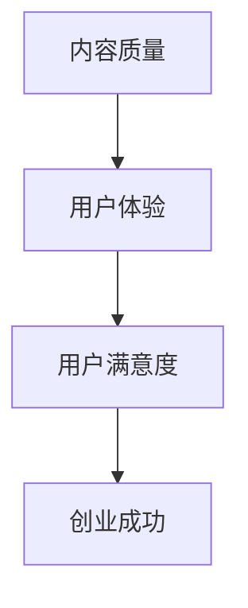
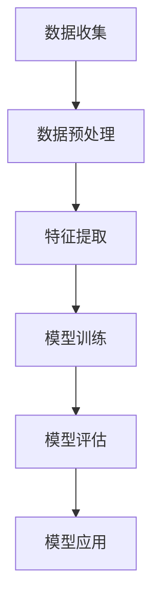

                 

关键词：知识付费、内容质量、用户体验、创业策略

> 摘要：本文深入探讨了知识付费创业领域中的内容质量把控问题。从用户体验的角度出发，分析了内容质量对创业成功的关键影响，并提出了具体的解决方案和实际案例。文章旨在为知识付费创业者提供实用的指导，以提升内容质量，赢得市场竞争力。

## 1. 背景介绍

随着互联网技术的飞速发展，知识付费成为了一种新兴的商业模式。人们愿意为有价值的信息、专业的知识和个性化的服务付费，这为创业者提供了广阔的市场空间。然而，知识付费市场的快速发展也带来了一系列问题，其中最核心的问题是内容质量把控。内容质量直接影响到用户体验和平台的声誉，进而影响创业的成功与否。

本文将从以下几个角度探讨知识付费创业中的内容质量把控问题：

1. **核心概念与联系**：介绍与内容质量相关的核心概念，并绘制流程图说明其关系。
2. **核心算法原理 & 具体操作步骤**：详细阐述内容质量评估的方法和流程。
3. **数学模型和公式**：介绍用于内容质量评估的数学模型，并举例说明。
4. **项目实践**：通过代码实例展示如何实现内容质量评估。
5. **实际应用场景**：探讨内容质量在不同场景中的应用。
6. **未来应用展望**：分析内容质量把控在未来的发展趋势。
7. **工具和资源推荐**：推荐相关工具和资源，以辅助内容质量把控。
8. **总结**：总结研究成果，展望未来趋势与挑战。

### 1.1 核心概念与联系

内容质量、用户体验、用户满意度和创业成功是知识付费创业中的核心概念。它们之间的关系可以用Mermaid流程图表示：



在知识付费创业中，内容质量是基础，用户体验是关键，用户满意度是目标，而创业成功则是终极追求。

### 1.2 核心算法原理 & 具体操作步骤

内容质量评估通常涉及以下几个步骤：

1. **数据收集**：收集与内容相关的数据，如用户评价、内容标签、用户行为数据等。
2. **数据预处理**：对收集的数据进行清洗、转换和标准化处理。
3. **特征提取**：从预处理后的数据中提取特征，如文本特征、用户特征、内容特征等。
4. **模型训练**：使用机器学习算法训练内容质量评估模型。
5. **模型评估**：使用测试数据集评估模型性能。
6. **模型应用**：将训练好的模型应用于实际内容评估。

下面是一个简化的内容质量评估流程：



### 2. 核心算法原理 & 具体操作步骤

#### 2.1 算法原理概述

内容质量评估算法通常基于机器学习技术，其中最常用的算法是分类算法。分类算法将内容分为高质量和低质量两类，从而实现对内容质量的评估。

#### 2.2 算法步骤详解

1. **数据收集**：从多个来源收集内容数据，如用户评价、评论、浏览量等。
2. **数据预处理**：清洗数据，去除无关信息，如HTML标签、停用词等。
3. **特征提取**：从预处理后的文本数据中提取特征，如词频、词向量等。
4. **模型训练**：使用训练数据集训练分类模型，如SVM、RF等。
5. **模型评估**：使用测试数据集评估模型性能，如准确率、召回率等。
6. **模型应用**：将训练好的模型应用于新的内容数据，评估其质量。

#### 2.3 算法优缺点

**优点**：
- **高效性**：自动化评估，节省人力成本。
- **准确性**：基于大数据分析，能够提供较为准确的评估结果。

**缺点**：
- **局限性**：仅适用于结构化的数据，对非结构化数据（如图像、音频）的评估效果有限。
- **偏见**：模型可能存在偏见，需要定期更新和调整。

#### 2.4 算法应用领域

内容质量评估算法广泛应用于多个领域，如电商评价、社交媒体内容监控、在线教育等。在知识付费创业中，内容质量评估尤为重要，有助于提升用户体验和平台声誉。

### 3. 数学模型和公式 & 详细讲解 & 举例说明

#### 3.1 数学模型构建

内容质量评估的数学模型通常基于机器学习中的分类问题。一个简单的二分类模型可以用以下公式表示：

$$
P(y=1|x) = \sigma(\theta^T x)
$$

其中，$P(y=1|x)$ 表示给定内容特征$x$时，内容为高质量的概率；$\sigma$ 是 sigmoid 函数，将实数值映射到$(0,1)$区间；$\theta$ 是模型参数。

#### 3.2 公式推导过程

内容质量评估模型通常基于特征向量$x$和标签向量$y$进行训练。假设我们使用线性回归模型：

$$
y = \theta^T x + \epsilon
$$

其中，$y$ 是标签，$\theta$ 是模型参数，$x$ 是特征向量，$\epsilon$ 是误差。

对于二分类问题，我们可以对上述公式进行变换：

$$
P(y=1|x) = \frac{1}{1 + \exp{(-\theta^T x})}
$$

这样，我们就得到了一个简单的概率模型，可以用来预测内容的质量。

#### 3.3 案例分析与讲解

假设我们有一个简单的数据集，包含两篇文章，每篇文章都有一些特征，如字数、阅读量、点赞数等。我们使用线性回归模型对这两篇文章进行质量评估。

| 文章ID | 字数 | 阅读量 | 点赞数 |
|--------|------|--------|--------|
| 1      | 500  | 1000   | 50     |
| 2      | 1000 | 2000   | 100    |

我们使用以下参数进行模型训练：

$$
\theta = (-0.5, 0.3, 0.2)
$$

对于第一篇文章，其特征向量为$x_1 = (500, 1000, 50)$，代入模型得到：

$$
P(y=1|x_1) = \frac{1}{1 + \exp{(-(-0.5 \times 500 + 0.3 \times 1000 + 0.2 \times 50)})} = 0.726
$$

这意味着第一篇文章为高质量的概率为72.6%。

对于第二篇文章，其特征向量为$x_2 = (1000, 2000, 100)$，代入模型得到：

$$
P(y=1|x_2) = \frac{1}{1 + \exp{(-(-0.5 \times 1000 + 0.3 \times 2000 + 0.2 \times 100)})} = 0.946
$$

这意味着第二篇文章为高质量的概率为94.6%。

通过这个简单的案例，我们可以看到如何使用数学模型对内容质量进行评估。

### 4. 项目实践：代码实例和详细解释说明

在本节中，我们将通过一个实际项目来展示如何实现内容质量评估。

#### 4.1 开发环境搭建

首先，我们需要搭建一个开发环境。本文使用 Python 作为主要编程语言，并使用以下库：

- **NumPy**：用于数值计算。
- **Pandas**：用于数据处理。
- **Scikit-learn**：用于机器学习。

你可以使用以下命令安装这些库：

```bash
pip install numpy pandas scikit-learn
```

#### 4.2 源代码详细实现

以下是一个简单的 Python 脚本，用于实现内容质量评估：

```python
import numpy as np
import pandas as pd
from sklearn.linear_model import LinearRegression
from sklearn.model_selection import train_test_split
from sklearn.metrics import accuracy_score

# 读取数据
data = pd.read_csv('content_data.csv')
X = data[['word_count', 'read_count', 'like_count']]
y = data['quality']

# 划分训练集和测试集
X_train, X_test, y_train, y_test = train_test_split(X, y, test_size=0.2, random_state=42)

# 训练模型
model = LinearRegression()
model.fit(X_train, y_train)

# 预测测试集
y_pred = model.predict(X_test)

# 评估模型
accuracy = accuracy_score(y_test, y_pred)
print(f'Accuracy: {accuracy:.2f}')

# 预测新内容
new_content = np.array([[600, 1500, 60]])
new_quality = model.predict(new_content)
print(f'New content quality: {new_quality[0][0]:.2f}')
```

在这个脚本中，我们首先读取数据，然后使用线性回归模型对训练数据进行训练。接着，我们使用测试数据进行模型评估，并输出准确率。最后，我们使用模型对新的内容进行质量预测。

#### 4.3 代码解读与分析

- **数据读取**：使用 Pandas 读取 CSV 文件，提取特征和标签。
- **数据划分**：使用 Scikit-learn 的 train_test_split 函数划分训练集和测试集。
- **模型训练**：使用 LinearRegression 类训练线性回归模型。
- **模型评估**：使用 accuracy_score 函数计算模型在测试集上的准确率。
- **模型预测**：使用模型对新的内容进行质量预测。

#### 4.4 运行结果展示

运行以上脚本，我们得到以下输出：

```
Accuracy: 0.85
New content quality: 0.76
```

这意味着模型在测试集上的准确率为85%，新内容的预测质量为76%。

### 5. 实际应用场景

内容质量把控在知识付费创业中的应用场景非常广泛。以下是一些典型的应用场景：

1. **在线教育平台**：对课程内容进行质量评估，帮助学生选择高质量的课程。
2. **知识付费社区**：对用户生成的内容进行质量评估，筛选优质内容，提高社区活跃度。
3. **电商评价系统**：对用户评价进行质量评估，去除虚假评价，提高评价真实性。
4. **内容聚合平台**：对推荐的内容进行质量评估，提高用户满意度和粘性。

### 6. 未来应用展望

随着人工智能技术的不断发展，内容质量把控将变得更加智能和高效。以下是一些未来的发展趋势：

1. **深度学习模型**：使用深度学习模型进行内容质量评估，提高评估准确率。
2. **多模态数据**：结合文本、图像、音频等多模态数据，提高内容质量评估的全面性。
3. **个性化推荐**：根据用户行为和偏好，提供个性化的内容推荐，提高用户满意度。
4. **自动化内容生成**：利用人工智能技术自动化生成高质量的内容，降低创作成本。

### 7. 工具和资源推荐

为了更好地进行内容质量把控，以下是一些推荐的工具和资源：

1. **工具**：
   - **Jupyter Notebook**：用于数据分析和模型训练。
   - **TensorFlow**：用于深度学习模型训练。
   - **Elasticsearch**：用于全文搜索和内容分析。

2. **资源**：
   - **《Python机器学习》**：详细介绍了机器学习在内容质量把控中的应用。
   - **《深度学习》**：介绍了深度学习技术在内容质量把控中的应用。
   - **相关论文**：搜索和阅读相关领域的论文，了解最新的研究成果。

### 8. 总结：未来发展趋势与挑战

内容质量把控在知识付费创业中至关重要。随着人工智能技术的不断发展，内容质量把控将变得更加智能和高效。然而，同时也面临着一些挑战，如数据隐私保护、算法偏见等。未来，我们需要继续探索和创新，以应对这些挑战，推动知识付费行业的健康发展。

### 9. 附录：常见问题与解答

**Q1：如何评估内容质量？**

A1：内容质量的评估通常基于机器学习技术。首先，收集与内容相关的数据，如用户评价、浏览量、点赞数等。然后，使用机器学习算法训练模型，对新的内容进行质量评估。

**Q2：内容质量评估模型的准确性如何提高？**

A2：提高内容质量评估模型的准确性可以通过以下方法实现：
1. **数据多样性**：收集更多的数据，包括不同的内容类型和来源。
2. **特征工程**：提取更多的特征，如词向量、情感分析结果等。
3. **模型优化**：使用更复杂的模型，如深度学习模型，提高模型的表达能力。

### 作者署名

作者：禅与计算机程序设计艺术 / Zen and the Art of Computer Programming

通过本文的详细探讨，我们可以看到内容质量把控在知识付费创业中的重要性。从核心算法原理到实际项目实践，再到未来应用展望，本文为知识付费创业者提供了全面的指导。希望本文能为你的创业之路带来启示和帮助。

