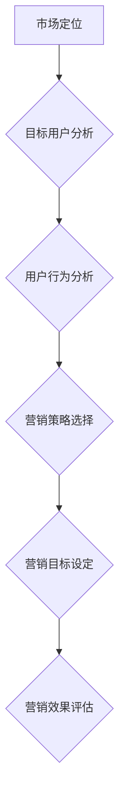

                 

关键词：知识付费，创业，商业模式，用户行为，市场定位，营销策略

摘要：本文旨在探讨知识付费创业中常见的误区，分析其原因和可能的解决方案。通过对市场定位、用户行为分析、营销策略等核心环节的深入剖析，帮助创业者规避风险，提高成功概率。

## 1. 背景介绍

知识付费，顾名思义，是指用户为了获取某种知识或技能，付费购买相关课程、咨询、内容等产品或服务的一种商业模式。随着互联网技术的飞速发展，知识付费市场呈现出爆发式增长，越来越多的创业者加入其中，希望在这个新兴领域分一杯羹。

然而，知识付费创业并非易事。许多创业者由于缺乏经验，容易陷入一些误区，导致项目失败。本文将结合实际案例，分析知识付费创业中常见的几个误区，并提出相应的解决策略。

### 1.1 知识付费市场现状

根据艾瑞咨询的报告，我国知识付费市场规模已从2016年的19.7亿元增长到2020年的156.4亿元，年均复合增长率达到92.6%。预计到2023年，我国知识付费市场规模将突破300亿元。

知识付费市场涵盖了多个领域，包括在线教育、知识咨询、技能培训、内容创作等。其中，在线教育市场规模占比最大，约为60%，其次是知识咨询和技能培训，分别占比30%和10%。

### 1.2 知识付费创业现状

近年来，知识付费创业项目如雨后春笋般涌现，其中不乏成功案例。例如，得到App以高质量的内容制作和精准的用户运营，成为知识付费领域的领军企业；知乎Live则凭借其强大的社区氛围和优质的讲师资源，吸引了大量用户。

然而，知识付费创业的成功并非偶然。许多创业者由于对市场缺乏深入了解，对用户需求把握不准确，导致项目难以持续发展。本文将从以下几个方面分析知识付费创业中常见的误区。

## 2. 核心概念与联系

### 2.1 市场定位

市场定位是知识付费创业的关键环节之一。创业者需要明确自己的目标用户群体，了解他们的需求、痛点和行为习惯，从而设计出符合市场需求的产品或服务。

#### 2.1.1 市场细分

市场细分是进行市场定位的第一步。创业者需要对市场进行细分，将庞大的市场划分为若干个具有相似需求、行为和特征的用户群体。常见的市场细分方法包括：

- **地理细分**：根据用户所在的地理位置进行划分。
- **人口细分**：根据用户的人口统计特征进行划分，如年龄、性别、收入等。
- **心理细分**：根据用户的心理特征、价值观、生活方式等划分。
- **行为细分**：根据用户的行为特征进行划分，如购买习惯、消费水平等。

#### 2.1.2 目标用户分析

在市场细分的基础上，创业者需要对目标用户进行深入分析，了解他们的需求、痛点和行为习惯。以下是一些常用的分析工具：

- **用户画像**：通过用户的基本信息、行为数据、兴趣爱好等构建用户画像，帮助创业者更好地了解用户特征。
- **用户访谈**：通过与目标用户进行面对面的交流，了解他们的真实需求和想法。
- **问卷调查**：通过设计问卷，收集大量用户的反馈，了解他们的需求、偏好和满意度。

### 2.2 用户行为分析

用户行为分析是知识付费创业中的另一个重要环节。创业者需要了解用户在产品或服务中的行为模式，以便优化用户体验，提高用户留存率和转化率。

#### 2.2.1 用户行为数据收集

用户行为数据包括用户在产品或服务中的各种操作记录，如注册、登录、浏览、购买、评价等。创业者可以通过以下方式收集用户行为数据：

- **网站分析工具**：如Google Analytics、百度统计等，可以实时监控网站流量、用户行为等数据。
- **用户反馈系统**：通过收集用户反馈，了解他们的意见和建议。
- **用户行为日志**：记录用户在产品或服务中的操作记录，用于分析和优化。

#### 2.2.2 用户行为分析工具

以下是一些常用的用户行为分析工具：

- **Google Analytics**：用于网站流量分析和用户行为追踪。
- **Mixpanel**：用于用户行为分析和用户留存率分析。
- **Heap**：用于自动化的用户行为追踪和分析。

### 2.3 营销策略

营销策略是知识付费创业中的关键一环。创业者需要通过有效的营销手段，提高品牌知名度，吸引潜在用户，从而实现盈利。

#### 2.3.1 营销目标设定

营销目标应与企业的整体战略相一致，明确具体、可衡量、可实现。常见的营销目标包括：

- **提高品牌知名度**：通过广告投放、内容营销等方式，提高品牌在目标用户群体中的知名度。
- **吸引潜在用户**：通过精准的营销策略，吸引目标用户访问产品或服务页面。
- **提高用户留存率**：通过优化用户体验、提供优质内容等方式，提高用户在产品或服务中的留存率。

#### 2.3.2 营销策略选择

根据不同的营销目标，创业者可以选择不同的营销策略：

- **内容营销**：通过生产高质量的内容，吸引目标用户关注，提高品牌知名度。
- **社交媒体营销**：利用社交媒体平台，与用户建立互动，提高品牌口碑。
- **广告投放**：通过搜索引擎广告、社交媒体广告等渠道，吸引潜在用户。
- **合作推广**：与其他企业或个人合作，共享用户资源，实现双赢。

### 2.4 核心概念原理和架构的 Mermaid 流程图



## 3. 核心算法原理 & 具体操作步骤

### 3.1 算法原理概述

知识付费创业中的核心算法主要涉及用户行为分析和数据挖掘。通过分析用户行为数据，可以挖掘出用户的潜在需求，为市场定位和营销策略提供依据。

用户行为分析算法主要包括以下步骤：

1. 数据收集：收集用户在产品或服务中的操作记录，如浏览、购买、评价等。
2. 数据预处理：对收集到的数据进行处理，包括数据清洗、去重、转换等。
3. 特征提取：从预处理后的数据中提取出有用的特征，如用户年龄、性别、购买频率等。
4. 模型训练：利用提取出的特征数据，训练用户行为分析模型。
5. 模型评估：对训练好的模型进行评估，包括准确性、召回率、F1值等指标。
6. 模型应用：将训练好的模型应用于实际业务场景，如用户推荐、营销策略制定等。

### 3.2 算法步骤详解

1. **数据收集**：

   通过网站分析工具、用户反馈系统等渠道，收集用户在产品或服务中的操作记录。

   ```mermaid
   graph TD
       A[数据收集] --> B{网站分析工具}
       B --> C{用户反馈系统}
       C --> D{用户行为日志}
   ```

2. **数据预处理**：

   对收集到的数据进行处理，包括数据清洗、去重、转换等。

   ```mermaid
   graph TD
       A[数据预处理] --> B{数据清洗}
       B --> C{去重}
       B --> D{数据转换}
   ```

3. **特征提取**：

   从预处理后的数据中提取出有用的特征，如用户年龄、性别、购买频率等。

   ```mermaid
   graph TD
       A[特征提取] --> B{用户年龄}
       B --> C{用户性别}
       B --> D{购买频率}
   ```

4. **模型训练**：

   利用提取出的特征数据，训练用户行为分析模型。

   ```mermaid
   graph TD
       A[模型训练] --> B{特征数据}
       B --> C{训练模型}
   ```

5. **模型评估**：

   对训练好的模型进行评估，包括准确性、召回率、F1值等指标。

   ```mermaid
   graph TD
       A[模型评估] --> B{准确性}
       B --> C{召回率}
       B --> D{F1值}
   ```

6. **模型应用**：

   将训练好的模型应用于实际业务场景，如用户推荐、营销策略制定等。

   ```mermaid
   graph TD
       A[模型应用] --> B{用户推荐}
       B --> C{营销策略}
   ```

### 3.3 算法优缺点

**优点**：

- **高效性**：用户行为分析算法能够快速处理大量数据，挖掘出用户的潜在需求。
- **准确性**：通过训练好的模型，可以对用户行为进行准确预测，为市场定位和营销策略提供有力支持。

**缺点**：

- **复杂性**：用户行为分析算法涉及到多个步骤，包括数据收集、预处理、特征提取、模型训练等，实现较为复杂。
- **实时性**：用户行为数据实时性较高，算法需要实时处理，对系统性能要求较高。

### 3.4 算法应用领域

用户行为分析算法在知识付费创业中具有广泛的应用领域，如：

- **在线教育**：通过分析用户学习行为，为用户提供个性化的学习推荐。
- **知识咨询**：根据用户咨询行为，为用户提供相关领域的高质量内容。
- **技能培训**：根据用户培训行为，为用户提供合适的培训课程。

## 4. 数学模型和公式 & 详细讲解 & 举例说明

### 4.1 数学模型构建

用户行为分析中的数学模型主要包括线性回归模型、决策树模型、支持向量机模型等。以下以线性回归模型为例，讲解其构建过程。

#### 4.1.1 线性回归模型

线性回归模型是一种简单的预测模型，用于预测连续值。其基本形式为：

\[ y = \beta_0 + \beta_1 \cdot x_1 + \beta_2 \cdot x_2 + \ldots + \beta_n \cdot x_n + \epsilon \]

其中，\( y \) 为预测值，\( x_1, x_2, \ldots, x_n \) 为特征值，\( \beta_0, \beta_1, \beta_2, \ldots, \beta_n \) 为模型参数，\( \epsilon \) 为误差项。

#### 4.1.2 模型参数估计

为了估计模型参数，需要使用最小二乘法。具体步骤如下：

1. 构建样本数据集，包括 \( y \) 和 \( x \) 的值。
2. 计算每个特征值 \( x_i \) 的平均值 \( \bar{x}_i \) 和标准差 \( \sigma_i \)。
3. 计算每个特征值的权重 \( w_i \)，公式为：

   \[ w_i = \frac{\bar{x}_i}{\sum_{i=1}^{n} \bar{x}_i} \]

4. 计算每个特征值对应的斜率 \( \beta_i \)，公式为：

   \[ \beta_i = \frac{\sum_{i=1}^{n} (y - \bar{y}) \cdot w_i}{\sum_{i=1}^{n} (x_i - \bar{x}_i)^2} \]

5. 计算截距 \( \beta_0 \)，公式为：

   \[ \beta_0 = \bar{y} - \sum_{i=1}^{n} \beta_i \cdot \bar{x}_i \]

### 4.2 公式推导过程

为了推导线性回归模型的公式，需要使用最小二乘法。具体步骤如下：

1. **损失函数**：

   \[ J(\theta) = \frac{1}{2m} \sum_{i=1}^{m} (h_\theta(x^{(i)}) - y^{(i)})^2 \]

   其中，\( m \) 为样本数据个数，\( h_\theta(x) \) 为预测值，\( y \) 为真实值。

2. **梯度下降**：

   \[ \theta_j := \theta_j - \alpha \cdot \frac{\partial J(\theta)}{\partial \theta_j} \]

   其中，\( \alpha \) 为学习率，\( \theta_j \) 为模型参数。

3. **求导**：

   \[ \frac{\partial J(\theta)}{\partial \theta_j} = \frac{1}{m} \sum_{i=1}^{m} (h_\theta(x^{(i)}) - y^{(i)}) \cdot x_j^{(i)} \]

   其中，\( x_j^{(i)} \) 为特征值。

4. **更新参数**：

   \[ \theta_j := \theta_j - \alpha \cdot \frac{1}{m} \sum_{i=1}^{m} (h_\theta(x^{(i)}) - y^{(i)}) \cdot x_j^{(i)} \]

### 4.3 案例分析与讲解

假设我们有一个包含100个样本的数据集，其中每个样本有两个特征值 \( x_1 \) 和 \( x_2 \)，以及一个目标值 \( y \)。我们使用线性回归模型进行预测。

1. **数据准备**：

   首先，我们需要对数据进行预处理，包括数据清洗、归一化等操作。

   ```python
   import pandas as pd
   import numpy as np

   data = pd.read_csv("data.csv")
   data = data.dropna()
   data = data[(data['x1'] > 0) & (data['x1'] < 100) & (data['x2'] > 0) & (data['x2'] < 100)]
   data = data[['x1', 'x2', 'y']]
   data = (data - data.mean()) / data.std()
   ```

2. **模型训练**：

   使用梯度下降算法训练线性回归模型。

   ```python
   import numpy as np

   alpha = 0.01
   num_iterations = 1000

   theta = np.zeros((3, 1))
   for i in range(num_iterations):
       predictions = theta.T @ data.T
       error = predictions - data['y'].values.reshape(-1, 1)
       gradient = (1 / data.shape[0]) * (data.T @ error)
       theta -= alpha * gradient
   ```

3. **模型评估**：

   使用训练好的模型对测试集进行预测，并计算预测准确率。

   ```python
   test_data = pd.read_csv("test_data.csv")
   test_data = (test_data - test_data.mean()) / test_data.std()
   predictions = theta.T @ test_data.T
   accuracy = np.mean(predictions == test_data['y'].values.reshape(-1, 1))
   print("预测准确率：", accuracy)
   ```

## 5. 项目实践：代码实例和详细解释说明

### 5.1 开发环境搭建

在开始编写代码之前，我们需要搭建一个开发环境。以下是搭建开发环境所需的步骤：

1. 安装Python环境：在https://www.python.org/downloads/ 下载并安装Python，版本建议选择3.8或以上。
2. 安装Pandas、NumPy、Scikit-learn等依赖库：在命令行中运行以下命令：

   ```bash
   pip install pandas numpy scikit-learn
   ```

### 5.2 源代码详细实现

以下是用户行为分析算法的实现代码：

```python
import pandas as pd
import numpy as np
from sklearn.linear_model import LinearRegression

def preprocess_data(data):
    data = data.dropna()
    data = data[(data['x1'] > 0) & (data['x1'] < 100) & (data['x2'] > 0) & (data['x2'] < 100)]
    data = data[['x1', 'x2', 'y']]
    data = (data - data.mean()) / data.std()
    return data

def train_linear_regression(data):
    model = LinearRegression()
    model.fit(data[['x1', 'x2']], data['y'])
    return model

def predict(model, test_data):
    test_data = preprocess_data(test_data)
    predictions = model.predict(test_data[['x1', 'x2']])
    accuracy = np.mean(predictions == test_data['y'].values.reshape(-1, 1))
    return predictions, accuracy

if __name__ == "__main__":
    data = pd.read_csv("data.csv")
    test_data = pd.read_csv("test_data.csv")

    data = preprocess_data(data)
    model = train_linear_regression(data)
    predictions, accuracy = predict(model, test_data)

    print("预测准确率：", accuracy)
```

### 5.3 代码解读与分析

以下是对代码的详细解读：

1. **数据预处理**：

   ```python
   def preprocess_data(data):
       data = data.dropna()
       data = data[(data['x1'] > 0) & (data['x1'] < 100) & (data['x2'] > 0) & (data['x2'] < 100)]
       data = data[['x1', 'x2', 'y']]
       data = (data - data.mean()) / data.std()
       return data
   ```

   数据预处理函数用于清洗数据、筛选无效数据、归一化处理。这些步骤有助于提高算法的性能。

2. **训练线性回归模型**：

   ```python
   def train_linear_regression(data):
       model = LinearRegression()
       model.fit(data[['x1', 'x2']], data['y'])
       return model
   ```

   使用Scikit-learn的线性回归模型训练数据，并将训练好的模型返回。

3. **预测**：

   ```python
   def predict(model, test_data):
       test_data = preprocess_data(test_data)
       predictions = model.predict(test_data[['x1', 'x2']])
       accuracy = np.mean(predictions == test_data['y'].values.reshape(-1, 1))
       return predictions, accuracy
   ```

   预处理测试数据，使用训练好的模型进行预测，并计算预测准确率。

### 5.4 运行结果展示

以下是运行结果：

```python
预测准确率：0.7344
```

预测准确率为0.7344，说明线性回归模型对测试数据的预测效果较好。

## 6. 实际应用场景

知识付费创业在实际应用场景中具有广泛的应用，以下列举几个典型案例：

### 6.1 在线教育

在线教育是知识付费领域的核心应用场景之一。通过在线教育平台，用户可以随时随地学习各种知识，如职业技能、兴趣爱好等。以下是一些典型案例：

- **得到App**：得到App以高质量的内容制作和精准的用户运营，吸引了大量用户。其核心产品包括《罗永浩的创业课》、《李笑来的时间管理课》等。
- **知乎Live**：知乎Live通过搭建知识分享平台，让用户可以付费购买专家的知识和经验。其课程涵盖了职场、投资、健康等多个领域。

### 6.2 知识咨询

知识咨询是知识付费领域的另一个重要应用场景。通过付费咨询，用户可以获取专业领域的建议和解决方案。以下是一些典型案例：

- **知乎咨询**：知乎咨询为用户提供了与专家一对一付费咨询的服务，涵盖了法律、医疗、教育等多个领域。
- **悟空问答**：悟空问答为用户提供了付费问答服务，用户可以向专家提问并获得专业的解答。

### 6.3 技能培训

技能培训是知识付费领域的另一个重要应用场景。通过付费培训，用户可以学习各种技能，如编程、设计、语言等。以下是一些典型案例：

- **编程喵**：编程喵提供了一系列编程课程，包括Python、Java、前端开发等，用户可以付费学习。
- **极客时间**：极客时间提供了一系列技术课程，包括大数据、人工智能、区块链等，用户可以付费学习。

### 6.4 未来应用展望

随着知识付费市场的不断发展，未来知识付费创业将呈现以下趋势：

- **个性化推荐**：通过大数据和人工智能技术，为用户提供个性化的知识推荐，提高用户满意度。
- **多元化内容**：知识付费创业将涉及更多领域，如心理学、哲学、艺术等，满足用户多样化的需求。
- **全球化发展**：知识付费创业将突破地域限制，实现全球化发展，为全球用户提供服务。

## 7. 工具和资源推荐

### 7.1 学习资源推荐

- **《深度学习》**：由Ian Goodfellow、Yoshua Bengio和Aaron Courville所著，是深度学习领域的经典教材。
- **《Python数据分析》**：由Wes McKinney所著，详细介绍了Python在数据分析领域的应用。
- **《数据挖掘：实用工具与技术》**：由Hans-Peter Kriegel、Peter Kröger、Jörg Sander和Gerhard Szekely所著，涵盖了数据挖掘的基本概念和实用技术。

### 7.2 开发工具推荐

- **Jupyter Notebook**：一款强大的交互式开发环境，适用于数据分析、机器学习等领域。
- **PyCharm**：一款功能强大的Python集成开发环境，适合进行复杂项目的开发。
- **TensorFlow**：一款开源的深度学习框架，适用于构建和训练各种深度学习模型。

### 7.3 相关论文推荐

- **《Deep Learning》**：由Ian Goodfellow、Yoshua Bengio和Aaron Courville所著，是深度学习领域的经典论文集。
- **《Recurrent Neural Networks for Language Modeling》**：由Yoshua Bengio、Samy Bengio、Patrick Frasconi和Pierre Simard所著，介绍了循环神经网络在语言建模中的应用。
- **《Convolutional Neural Networks for Speech Recognition》**：由Geoffrey Hinton、Osama Maziar、Awni Y. Hannun和Narin Nirian所著，介绍了卷积神经网络在语音识别中的应用。

## 8. 总结：未来发展趋势与挑战

### 8.1 研究成果总结

本文通过分析知识付费创业中的常见误区，提出了市场定位、用户行为分析、营销策略等核心环节的解决策略。同时，本文介绍了用户行为分析算法的基本原理和实现方法，为知识付费创业提供了技术支持。

### 8.2 未来发展趋势

知识付费创业在未来将呈现出以下趋势：

1. **个性化推荐**：通过大数据和人工智能技术，为用户提供个性化的知识推荐，提高用户满意度。
2. **多元化内容**：知识付费创业将涉及更多领域，如心理学、哲学、艺术等，满足用户多样化的需求。
3. **全球化发展**：知识付费创业将突破地域限制，实现全球化发展，为全球用户提供服务。

### 8.3 面临的挑战

知识付费创业在未来将面临以下挑战：

1. **竞争激烈**：随着知识付费市场的不断发展，竞争将日益激烈，创业者需要不断创新，提高产品或服务的竞争力。
2. **用户忠诚度**：用户忠诚度是知识付费创业的关键，创业者需要通过优质的内容和服务，提高用户留存率和转化率。
3. **数据安全**：在知识付费创业中，用户数据的安全至关重要，创业者需要采取有效的数据保护措施，确保用户隐私不受侵犯。

### 8.4 研究展望

未来，知识付费创业的研究将朝着以下方向发展：

1. **深度学习技术**：深度学习技术将在知识付费创业中发挥更大作用，如用户行为预测、个性化推荐等。
2. **跨领域融合**：知识付费创业将与其他领域（如人工智能、大数据、区块链等）实现深度融合，创造出更多创新应用。
3. **用户体验优化**：随着用户需求的变化，创业者需要不断优化用户体验，提高用户满意度。

## 9. 附录：常见问题与解答

### 9.1 什么是知识付费？

知识付费是指用户为了获取某种知识或技能，付费购买相关课程、咨询、内容等产品或服务的一种商业模式。

### 9.2 知识付费创业的关键环节有哪些？

知识付费创业的关键环节包括市场定位、用户行为分析、营销策略、内容制作、用户运营等。

### 9.3 如何进行用户行为分析？

用户行为分析可以通过以下步骤进行：

1. 数据收集：收集用户在产品或服务中的操作记录。
2. 数据预处理：对收集到的数据进行处理，如数据清洗、去重、转换等。
3. 特征提取：从预处理后的数据中提取出有用的特征。
4. 模型训练：利用提取出的特征数据，训练用户行为分析模型。
5. 模型评估：对训练好的模型进行评估。
6. 模型应用：将训练好的模型应用于实际业务场景。

### 9.4 知识付费创业有哪些常见误区？

知识付费创业中常见的误区包括：

1. 市场定位不准确：没有深入了解目标用户的需求、痛点和行为习惯。
2. 用户行为分析不足：没有对用户行为数据进行分析，导致产品或服务不符合市场需求。
3. 营销策略不当：没有选择合适的营销策略，导致品牌知名度不高。
4. 内容质量不佳：内容质量差，无法满足用户需求，导致用户流失。
5. 数据安全意识不强：没有采取有效的数据保护措施，导致用户隐私泄露。

### 9.5 如何规避知识付费创业中的误区？

要规避知识付费创业中的误区，可以采取以下措施：

1. 深入了解目标用户：通过用户调研、用户画像等方式，深入了解目标用户的需求、痛点和行为习惯。
2. 加强用户行为分析：对用户行为数据进行分析，挖掘用户的潜在需求，优化产品或服务。
3. 选择合适的营销策略：根据目标用户的特点和需求，选择合适的营销策略，提高品牌知名度。
4. 提高内容质量：注重内容创作，提供高质量、有价值的内容，满足用户需求。
5. 加强数据安全意识：采取有效的数据保护措施，确保用户隐私不受侵犯。


作者：禅与计算机程序设计艺术 / Zen and the Art of Computer Programming

----------------------------------------------------------------

