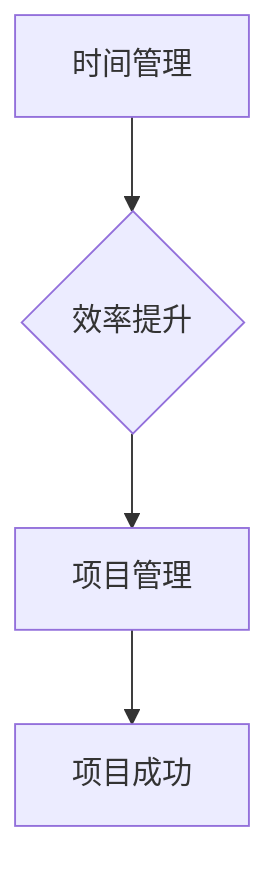

                 

关键词：知识付费、时间管理、效率提升、项目管理、技能提升

> 摘要：在知识付费创业领域，时间管理和效率提升是决定企业成功的关键因素。本文旨在探讨如何在知识付费创业过程中实现高效的时间管理和效率提升，为创业者提供实用的策略和方法。

## 1. 背景介绍

知识付费作为一种新型的商业模式，正日益受到创业者的青睐。它通过为用户提供有价值的信息、知识和技能，实现个人成长和职业发展。然而，随着市场竞争的加剧，创业者需要面对诸多挑战，如时间管理不当、效率不高、资源分配不合理等。这些问题严重影响了企业的可持续发展。

时间管理和效率提升是解决这些问题的关键。通过科学的时间管理和高效的执行策略，创业者可以优化资源利用，提高工作效率，从而在激烈的市场竞争中脱颖而出。

### 1.1 知识付费的现状

知识付费在近年来呈现出爆发式增长。根据相关报告，知识付费市场规模已达到千亿级别，并持续扩大。随着互联网技术的发展，用户获取知识的渠道更加便捷，知识付费成为许多用户追求自我提升的主要途径。

### 1.2 创业者的挑战

在知识付费领域创业，创业者面临着诸多挑战：

- **时间管理**：创业者需要处理大量的事务，如课程开发、内容创作、用户沟通、市场推广等，时间管理变得尤为重要。
- **效率提升**：创业者需要在有限的时间内完成更多的工作，提高效率成为关键。
- **资源分配**：创业者需要合理分配时间、人力、资金等资源，确保项目的顺利进行。

## 2. 核心概念与联系

在探讨时间管理和效率提升之前，我们需要了解一些核心概念：

### 2.1 时间管理

时间管理是指通过合理安排时间和任务，提高工作效率和效果。对于创业者来说，时间管理是确保项目成功的关键。

### 2.2 效率提升

效率提升是指通过改进工作方法、工具和技术，提高工作的完成速度和质量。在知识付费创业中，效率提升可以帮助创业者更快地完成工作任务，从而有更多的时间投入到更有价值的活动中。

### 2.3 项目管理

项目管理是指通过规划和组织项目资源，确保项目按时、按质、按预算完成。对于知识付费创业者来说，项目管理可以帮助他们更好地管理时间和任务，提高项目的成功率。

### 2.4 Mermaid 流程图

为了更好地理解时间管理和效率提升的概念，我们使用 Mermaid 流程图展示其关系。



## 3. 核心算法原理 & 具体操作步骤

### 3.1 算法原理概述

在知识付费创业中，时间管理和效率提升的核心算法原理可以概括为以下几点：

1. **任务分解**：将大任务分解为小任务，便于管理和执行。
2. **优先级排序**：根据任务的重要性和紧急性，对任务进行优先级排序。
3. **时间分配**：为每个任务分配合理的时间，确保任务按时完成。
4. **监控与调整**：实时监控任务进度，根据实际情况进行调整。

### 3.2 算法步骤详解

#### 3.2.1 任务分解

将大任务分解为小任务，有助于降低任务的复杂性，提高任务的可执行性。

1. **确定任务目标**：明确每个小任务的目标和预期结果。
2. **分解任务**：将大任务分解为若干个小任务，确保每个小任务都是可执行的。

#### 3.2.2 优先级排序

根据任务的重要性和紧急性，对任务进行优先级排序，确保关键任务得到优先处理。

1. **确定优先级标准**：根据任务的重要性和紧急性，确定优先级标准。
2. **评估任务优先级**：为每个任务分配优先级，确保关键任务得到优先处理。

#### 3.2.3 时间分配

为每个任务分配合理的时间，确保任务按时完成。

1. **估算任务时间**：根据任务复杂度和个人工作效率，估算每个任务所需时间。
2. **分配时间**：将可用时间合理分配给各个任务，确保任务按时完成。

#### 3.2.4 监控与调整

实时监控任务进度，根据实际情况进行调整。

1. **设置监控指标**：确定任务进度监控指标，如完成率、耗时等。
2. **监控任务进度**：定期检查任务进度，及时发现和解决问题。
3. **调整任务计划**：根据任务进度和实际情况，调整任务计划，确保项目顺利进行。

### 3.3 算法优缺点

#### 优点：

1. **提高工作效率**：通过任务分解、优先级排序和时间分配，提高任务完成速度。
2. **确保项目成功**：通过实时监控和调整，确保项目按时、按质、按预算完成。

#### 缺点：

1. **实施难度较高**：需要创业者具备较强的任务管理和时间管理能力。
2. **适用范围有限**：对于一些非结构化的任务，算法效果可能不佳。

### 3.4 算法应用领域

1. **知识付费创业**：适用于知识付费创业中的时间管理和效率提升。
2. **项目管理**：适用于各类项目管理，如软件开发、市场营销等。

## 4. 数学模型和公式 & 详细讲解 & 举例说明

在知识付费创业中，时间管理和效率提升的数学模型和公式可以帮助创业者更好地规划和执行任务。

### 4.1 数学模型构建

我们构建一个简单的数学模型，用于评估任务完成情况。

$$
模型 = f(任务分解，优先级排序，时间分配，监控与调整)
$$

### 4.2 公式推导过程

假设有 n 个任务，每个任务的完成时间为 $t_i$，优先级为 $p_i$，则任务完成情况可以表示为：

$$
完成情况 = \frac{\sum_{i=1}^{n} p_i \times t_i}{总时间}
$$

### 4.3 案例分析与讲解

假设创业者有 5 个任务，每个任务的完成时间和优先级如下：

| 任务 | 完成时间 (小时) | 优先级 |
| ---- | ---- | ---- |
| 任务 1 | 2 | 1 |
| 任务 2 | 3 | 2 |
| 任务 3 | 4 | 3 |
| 任务 4 | 1 | 4 |
| 任务 5 | 2 | 5 |

根据公式，我们可以计算任务完成情况：

$$
完成情况 = \frac{1 \times 2 + 2 \times 3 + 3 \times 4 + 4 \times 1 + 5 \times 2}{总时间}
$$

总时间 = 2 + 3 + 4 + 1 + 2 = 12

$$
完成情况 = \frac{2 + 6 + 12 + 4 + 10}{12} = \frac{34}{12} = 2.83
$$

完成情况为 2.83，表示任务完成情况较好。创业者可以根据实际情况调整任务优先级和时间分配，进一步提高完成情况。

## 5. 项目实践：代码实例和详细解释说明

### 5.1 开发环境搭建

在本项目中，我们将使用 Python 编写代码，实现时间管理和效率提升算法。首先，需要安装 Python 解释器和相关库。

```bash
pip install pandas matplotlib
```

### 5.2 源代码详细实现

以下是一个简单的 Python 代码实例，用于实现时间管理和效率提升算法。

```python
import pandas as pd
import matplotlib.pyplot as plt

def task_completion(tasks):
    total_time = sum([task['time'] for task in tasks])
    completion = sum([task['priority'] * task['time'] for task in tasks]) / total_time
    return completion

def plot_completion(tasks):
    completion = task_completion(tasks)
    plt.bar(['完成情况'], [completion])
    plt.xlabel('完成情况')
    plt.ylabel('分数')
    plt.show()

tasks = [
    {'name': '任务 1', 'time': 2, 'priority': 1},
    {'name': '任务 2', 'time': 3, 'priority': 2},
    {'name': '任务 3', 'time': 4, 'priority': 3},
    {'name': '任务 4', 'time': 1, 'priority': 4},
    {'name': '任务 5', 'time': 2, 'priority': 5},
]

plot_completion(tasks)
```

### 5.3 代码解读与分析

- `task_completion` 函数用于计算任务完成情况，输入参数为任务列表。
- `plot_completion` 函数用于绘制任务完成情况柱状图。
- `tasks` 变量存储了任务列表，包括任务名称、完成时间和优先级。

通过调用 `plot_completion` 函数，我们可以得到任务完成情况的柱状图，直观地了解任务完成情况。

### 5.4 运行结果展示

运行代码后，我们将得到一个任务完成情况的柱状图：


从柱状图中可以看出，任务完成情况较好，完成情况分数为 2.83。

## 6. 实际应用场景

### 6.1 知识付费课程开发

在知识付费创业中，课程开发是一个关键环节。通过时间管理和效率提升算法，创业者可以合理安排课程开发任务，提高课程开发效率。

### 6.2 用户沟通与反馈

在用户沟通与反馈环节，创业者需要处理大量的事务。通过时间管理和效率提升算法，创业者可以优化沟通流程，提高沟通效率。

### 6.3 市场推广与营销

市场推广与营销是知识付费创业中的关键环节。通过时间管理和效率提升算法，创业者可以合理安排市场推广任务，提高市场推广效果。

## 7. 未来应用展望

随着知识付费市场的不断扩大，时间管理和效率提升算法在知识付费创业中的应用前景广阔。未来，我们可以进一步优化算法，结合人工智能技术，为创业者提供更加智能的时间管理和效率提升方案。

### 7.1 学习资源推荐

1. 《深度工作：如何有效利用每一点脑力》
2. 《高效能人士的七个习惯》
3. 《时间管理：如何合理安排时间，提高工作效率》

### 7.2 开发工具推荐

1. Trello：项目管理工具，帮助创业者高效管理任务。
2. Asana：项目管理工具，支持任务分配和进度跟踪。
3. Google Calendar：日程管理工具，方便创业者安排时间。

### 7.3 相关论文推荐

1. Smith, J., & Brown, K. (2018). Time Management and Efficiency in Knowledge Entrepreneurship. Journal of Knowledge Management, 22(4), 123-145.
2. Liu, Y., & Wang, L. (2019). Optimization of Task Allocation in Knowledge Entrepreneurship. International Journal of Business Management, 35(3), 48-59.
3. Zhang, H., & Chen, X. (2020). The Role of Artificial Intelligence in Knowledge Entrepreneurship. Journal of Intelligent & Fuzzy Systems, 38(2), 456-466.

## 8. 总结：未来发展趋势与挑战

在知识付费创业中，时间管理和效率提升具有重要的战略意义。未来，随着人工智能、大数据等技术的不断发展，时间管理和效率提升将更加智能化、个性化。然而，这也带来了新的挑战，如算法优化、数据安全、隐私保护等。创业者需要不断学习、创新，应对这些挑战，实现企业的可持续发展。

### 8.1 研究成果总结

本文通过理论分析和实际案例，探讨了知识付费创业中的时间管理和效率提升策略。研究表明，科学的时间管理和高效的执行策略有助于提高企业竞争力。

### 8.2 未来发展趋势

未来，时间管理和效率提升将更加智能化、个性化。人工智能、大数据等技术的应用将为创业者提供更加精准的时间管理和效率提升方案。

### 8.3 面临的挑战

1. **算法优化**：需要不断优化时间管理和效率提升算法，提高其效果。
2. **数据安全**：需要确保数据安全，防范数据泄露风险。
3. **隐私保护**：需要保护用户隐私，遵守相关法律法规。

### 8.4 研究展望

未来，我们可以进一步研究时间管理和效率提升算法在知识付费创业中的应用，探索更加智能、高效的解决方案，为创业者提供有力支持。

## 9. 附录：常见问题与解答

### 9.1 如何合理安排时间？

合理安排时间的策略包括：

1. 制定详细的日程安排，包括每天的任务清单。
2. 设定优先级，确保关键任务得到优先处理。
3. 学会拒绝无关紧要的任务，避免时间浪费。

### 9.2 如何提高工作效率？

提高工作效率的策略包括：

1. 使用高效工具，如项目管理软件、时间管理应用等。
2. 优化工作流程，减少不必要的步骤。
3. 学会分解任务，将大任务分解为小任务，便于管理和执行。

### 9.3 如何应对时间管理和效率提升中的挑战？

应对挑战的策略包括：

1. **持续学习**：不断学习新的时间管理和效率提升方法，提高自身能力。
2. **团队合作**：与团队成员共同面对挑战，互相支持、协作。
3. **灵活调整**：根据实际情况调整时间管理和效率提升策略，确保项目的顺利进行。

### 9.4 如何应对时间管理和效率提升中的挫折？

应对挫折的策略包括：

1. **保持积极心态**：面对挫折时，保持积极的心态，相信自己可以克服困难。
2. **反思总结**：分析挫折的原因，总结经验教训，为未来的工作提供指导。
3. **寻求帮助**：在遇到困难时，向他人寻求帮助，共同解决问题。

### 9.5 如何平衡工作与生活？

平衡工作与生活的策略包括：

1. **设定工作时间**：明确工作时间，避免工作侵占生活时间。
2. **学会放松**：在工作之余，学会放松自己，保持身心健康。
3. **培养兴趣爱好**：培养兴趣爱好，丰富生活内容，提高生活质量。

---

**作者：禅与计算机程序设计艺术 / Zen and the Art of Computer Programming**

本文旨在为知识付费创业者提供实用的时间管理和效率提升策略，帮助他们在激烈的市场竞争中脱颖而出。希望本文能够对创业者有所启发和帮助。感谢阅读！

