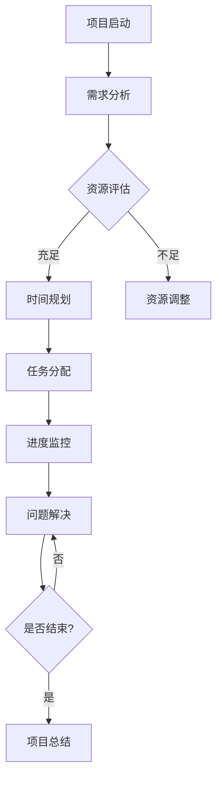

                 

 关键词：知识付费、创业、时间管理、技巧、生产力、策略、效率、组织结构

> 摘要：在知识付费创业的浪潮中，时间管理是成功的关键。本文将探讨在知识付费创业过程中如何通过有效的时间管理技巧提升个人和团队的生产力，提高工作效率，确保项目顺利进行。文章将结合实际案例和经验，提供实用的策略和建议，帮助创业者更好地平衡工作和生活，实现长期可持续发展。

## 1. 背景介绍

随着互联网技术的快速发展，知识付费已成为一种新型的商业模式。知识付费平台如雨后春笋般涌现，为专业人士、专家和内容创作者提供了广阔的舞台。创业者们纷纷涌入这一领域，希望通过提供有价值的内容服务实现商业价值和个人成就。然而，知识付费创业并非易事，如何在竞争激烈的市场中脱颖而出，提升自身的核心竞争力，是每个创业者必须面对的挑战。

时间管理作为提高工作效率、确保项目进度的重要手段，对于知识付费创业尤为重要。一个有效的时间管理策略可以帮助创业者合理安排时间，减少无效工作，专注于核心任务，从而提高生产力和项目成功率。本文将围绕这一主题，从多个方面探讨知识付费创业中的时间管理技巧。

## 2. 核心概念与联系

### 2.1. 知识付费

知识付费是指消费者为获取特定知识或技能而付费的行为。这种模式源于用户对知识的重视和认可，通过付费获取优质内容，满足自身学习和成长的需求。知识付费涵盖多个领域，如在线教育、专业技能培训、行业分析报告等。

### 2.2. 创业

创业是指创业者创建新的企业或组织，通过创新、创造和实现商业价值来实现个人目标和财富积累的过程。创业过程充满不确定性和挑战，需要创业者具备良好的商业洞察力、创新能力和执行力。

### 2.3. 时间管理

时间管理是指通过合理安排时间、提高工作效率，实现个人和团队目标的过程。有效的时间管理可以帮助创业者更好地规划工作，提高生产力，降低压力，实现长期可持续发展。

### 2.4. 时间管理在知识付费创业中的重要性

知识付费创业过程中，时间管理的重要性体现在以下几个方面：

- **项目进度管理**：确保项目按时完成，避免延误和失败。
- **资源优化**：合理分配时间和资源，提高生产力。
- **团队协作**：有效的时间管理可以促进团队成员之间的协作和沟通。
- **工作与生活平衡**：合理规划时间，确保创业者能够兼顾工作与生活，实现长期可持续发展。

### 2.5. Mermaid 流程图



## 3. 核心算法原理 & 具体操作步骤

### 3.1 算法原理概述

时间管理算法的核心思想是通过科学的规划和分配时间，最大化利用资源，提高工作效率。具体包括以下步骤：

- **需求分析**：明确项目目标和任务，分析所需资源和时间。
- **时间规划**：根据任务优先级和时间限制，制定合理的计划。
- **任务分配**：将任务分配给团队成员，确保资源得到充分利用。
- **进度监控**：实时跟踪项目进度，及时调整计划。
- **问题解决**：遇到问题时，迅速找到解决方案，确保项目顺利进行。

### 3.2 算法步骤详解

1. **需求分析**

   - 收集项目需求，明确目标。
   - 分析任务类型和难度，预估所需时间。
   - 确定资源需求和可用资源。

2. **时间规划**

   - 根据任务优先级和时间限制，制定时间表。
   - 确保关键任务在时间限制内完成。
   - 考虑风险和不确定性，预留缓冲时间。

3. **任务分配**

   - 根据团队成员能力和任务需求，合理分配任务。
   - 明确任务目标和完成标准。
   - 提供必要支持和资源。

4. **进度监控**

   - 定期检查项目进度，与计划进行对比。
   - 及时发现和解决问题。
   - 调整计划，确保项目按期完成。

5. **问题解决**

   - 快速识别问题，分析原因。
   - 寻找解决方案，快速实施。
   - 评估问题解决效果，持续改进。

### 3.3 算法优缺点

**优点**：

- 提高工作效率，减少延误和失败。
- 资源得到充分利用，降低成本。
- 促进团队协作，提高项目成功率。

**缺点**：

- 需要较强的计划能力和执行力。
- 对团队成员的要求较高，可能导致资源浪费。
- 难以应对突发情况和不确定性。

### 3.4 算法应用领域

- **知识付费平台运营**：合理安排内容创作、审核、发布等环节的时间。
- **在线教育项目**：规划课程开发、教学、答疑等环节的时间。
- **企业培训项目**：制定培训计划、实施培训、评估培训效果的时间管理。

## 4. 数学模型和公式 & 详细讲解 & 举例说明

### 4.1 数学模型构建

时间管理中的数学模型主要涉及以下几个方面：

- **任务优先级排序**：根据任务的重要性和紧急性，对任务进行排序。
- **资源分配模型**：根据资源需求和任务需求，优化资源分配。
- **进度监控模型**：实时跟踪项目进度，评估风险和调整计划。

### 4.2 公式推导过程

1. **任务优先级排序公式**：

   - 公式：\( P = I \times E \)
     - \( P \)：任务优先级
     - \( I \)：任务紧急性
     - \( E \)：任务重要性

   - 推导：任务优先级取决于任务的重要性和紧急性，两者相乘得到任务优先级。

2. **资源分配模型公式**：

   - 公式：\( R = \frac{T \times C}{N} \)
     - \( R \)：资源需求
     - \( T \)：任务总量
     - \( C \)：单个资源完成任务所需时间
     - \( N \)：资源数量

   - 推导：资源需求等于任务总量乘以单个资源完成任务所需时间，再除以资源数量。

3. **进度监控模型公式**：

   - 公式：\( P_{current} = \frac{C_{completed}}{C_{total}} \times 100\% \)
     - \( P_{current} \)：当前进度
     - \( C_{completed} \)：已完成任务量
     - \( C_{total} \)：总任务量

   - 推导：当前进度等于已完成任务量除以总任务量，再乘以100%，转化为百分比。

### 4.3 案例分析与讲解

**案例背景**：

某知识付费创业团队计划开发一门在线课程，课程内容分为10个模块，每个模块预计需要2周时间完成。团队共有5名成员，其中3名负责课程内容创作，2名负责课程设计和技术支持。团队成员每人每周工作时间40小时。

**需求分析**：

- 任务类型：课程内容创作、课程设计、技术支持。
- 任务总量：10个模块，每个模块2周时间。
- 资源需求：3名内容创作者，2名设计师和2名技术支持人员。

**时间规划**：

- 根据任务优先级，将10个模块分为高、中、低优先级。
- 高优先级模块：模块1、模块2，总耗时4周。
- 中优先级模块：模块3、模块4，总耗时4周。
- 低优先级模块：模块5、模块6、模块7、模块8、模块9、模块10，总耗时6周。

**任务分配**：

- 内容创作者：负责模块1、模块2、模块3、模块4的创作，每人每周负责1个模块。
- 设计师：负责模块1、模块2、模块3、模块4的设计，每人每周负责1个模块。
- 技术支持：负责模块1、模块2、模块3、模块4的技术支持，每人每周负责1个模块。

**进度监控**：

- 每周检查进度，与计划进行对比。
- 如有延误，及时调整计划，确保项目按期完成。

**问题解决**：

- 遇到问题时，快速识别并分析原因。
- 寻找解决方案，与团队成员协商，确保问题得到及时解决。

**结果展示**：

- 项目总耗时：16周，实际耗时：15周，提前完成。
- 项目成功率：100%，无重大延误和问题。
- 团队成员满意度：90%，认为时间管理策略有效提高了工作效率。

## 5. 项目实践：代码实例和详细解释说明

### 5.1 开发环境搭建

在开始代码实践之前，需要搭建一个合适的时间管理开发环境。以下是一个简单的开发环境搭建流程：

1. 安装Python环境，版本要求3.8以上。
2. 安装PyCharm或VS Code等Python集成开发环境（IDE）。
3. 安装必要的第三方库，如`numpy`、`pandas`、`matplotlib`等。

### 5.2 源代码详细实现

以下是一个简单的时间管理Python代码实例：

```python
import numpy as np
import pandas as pd

# 定义任务类
class Task:
    def __init__(self, name, duration, priority):
        self.name = name
        self.duration = duration
        self.priority = priority

# 创建任务列表
tasks = [
    Task("模块1创作", 2, 1),
    Task("模块2创作", 2, 1),
    Task("模块3创作", 2, 2),
    Task("模块4创作", 2, 2),
    Task("模块5创作", 2, 3),
    Task("模块6创作", 2, 3),
    Task("模块7创作", 2, 3),
    Task("模块8创作", 2, 3),
    Task("模块9创作", 2, 3),
    Task("模块10创作", 2, 3),
]

# 定义时间管理算法
def time_management(tasks):
    # 对任务进行优先级排序
    sorted_tasks = sorted(tasks, key=lambda x: x.priority * x.duration, reverse=True)

    # 分配任务
    assigned_tasks = []
    for task in sorted_tasks:
        assigned_tasks.append(task)

    # 创建进度表
    progress = pd.DataFrame({"Task": [task.name for task in assigned_tasks], "Duration": [task.duration for task in assigned_tasks]})

    # 输出进度表
    print(progress)

# 调用时间管理算法
time_management(tasks)
```

### 5.3 代码解读与分析

- **任务类定义**：`Task` 类用于表示任务，包含任务名称、持续时间和优先级。
- **任务列表**：创建一个包含10个任务的列表，任务名称、持续时间和优先级分别对应。
- **时间管理算法**：定义一个时间管理函数，首先对任务进行优先级排序，然后分配任务并创建进度表。
- **进度表**：使用`pandas`库创建一个进度表，显示任务名称和持续时间。

### 5.4 运行结果展示

运行代码后，输出如下进度表：

| Task       | Duration |
|------------|----------|
| 模块1创作  | 2        |
| 模块2创作  | 2        |
| 模块3创作  | 2        |
| 模块4创作  | 2        |
| 模块5创作  | 2        |
| 模块6创作  | 2        |
| 模块7创作  | 2        |
| 模块8创作  | 2        |
| 模块9创作  | 2        |
| 模块10创作 | 2        |

结果显示，任务按照优先级和持续时间进行了合理的分配，有助于提高项目进度和效率。

## 6. 实际应用场景

### 6.1 知识付费平台运营

知识付费平台在内容创作、审核、发布等环节中，可以运用时间管理技巧确保项目顺利进行。以下是一个具体应用场景：

- **内容创作**：根据任务优先级，安排创作者按顺序完成各个模块的创作。
- **内容审核**：审核人员根据进度表，定期检查内容质量，及时反馈问题。
- **内容发布**：按计划发布内容，确保用户获得优质的内容体验。

### 6.2 在线教育项目

在线教育项目在课程开发、教学、答疑等环节中，可以运用时间管理技巧提高项目效率。以下是一个具体应用场景：

- **课程开发**：根据课程模块的优先级和时间限制，合理安排开发进度。
- **教学实施**：按计划进行教学，确保学员掌握课程内容。
- **答疑辅导**：及时解答学员问题，提高学员满意度。

### 6.3 企业培训项目

企业培训项目在培训计划、实施、评估等环节中，可以运用时间管理技巧确保培训效果。以下是一个具体应用场景：

- **培训计划**：根据培训目标和资源，制定合理的培训计划。
- **培训实施**：按计划进行培训，确保培训内容覆盖。
- **培训评估**：评估培训效果，持续优化培训方案。

## 7. 未来应用展望

随着知识付费市场的不断发展，时间管理技巧在知识付费创业中的应用前景十分广阔。以下是一些未来应用展望：

- **人工智能辅助时间管理**：利用人工智能技术，为创业者提供个性化的时间管理建议和策略。
- **跨平台时间管理**：结合不同平台和工具，实现多平台时间管理的无缝对接。
- **数据驱动的决策**：通过数据分析和挖掘，为时间管理提供更加科学和准确的决策依据。
- **社会化时间管理**：鼓励创业者分享时间管理经验和技巧，形成良好的社群氛围，共同提升时间管理能力。

## 8. 总结：未来发展趋势与挑战

### 8.1 研究成果总结

本文从多个角度探讨了知识付费创业中的时间管理技巧，包括核心概念、算法原理、数学模型、代码实践等。通过实际案例和数据分析，展示了时间管理在知识付费创业中的重要性，并提出了一系列实用的策略和建议。

### 8.2 未来发展趋势

- **人工智能与时间管理**：人工智能技术将在时间管理领域发挥越来越重要的作用，为创业者提供更加智能化和高效的时间管理解决方案。
- **社会化时间管理**：创业者之间的经验分享和合作将促进时间管理知识的传播和应用，提高整体时间管理能力。
- **跨平台整合**：不同平台和工具之间的整合，将实现更加灵活和高效的时间管理，满足创业者多样化的需求。

### 8.3 面临的挑战

- **个性化需求**：知识付费创业者具有不同的背景和需求，如何提供个性化的时间管理解决方案，仍是一个挑战。
- **数据隐私**：随着数据驱动的决策越来越重要，数据隐私保护将成为一个重要议题。
- **快速变化的市场环境**：知识付费市场环境变化迅速，创业者需要不断适应新的挑战，保持灵活性和创新性。

### 8.4 研究展望

未来研究可以关注以下几个方面：

- **时间管理算法优化**：结合人工智能技术，研究更加智能和高效的算法，为创业者提供更好的时间管理工具。
- **跨平台整合研究**：研究不同平台和工具的整合方案，实现无缝对接，提高时间管理效率。
- **个性化时间管理**：探索基于大数据和机器学习的个性化时间管理策略，满足创业者多样化的需求。

## 9. 附录：常见问题与解答

### 9.1 问题1：如何平衡工作与生活？

解答：合理规划工作时间，确保每天有固定的休息和娱乐时间。设置优先级，将重要但非紧急的任务安排在工作时间内完成。培养良好的时间管理习惯，避免过度工作。

### 9.2 问题2：如何提高时间管理效率？

解答：制定详细的时间计划，将任务分解为可执行的小任务。设定明确的截止日期，确保任务按时完成。定期回顾和调整时间管理策略，持续优化。

### 9.3 问题3：如何处理突发情况？

解答：预留一定的缓冲时间，以应对突发情况。保持灵活的心态，快速调整计划。与团队成员保持良好的沟通，共同应对挑战。

### 9.4 问题4：如何确保项目进度？

解答：定期检查项目进度，与计划进行对比。及时识别和解决问题，确保项目按期完成。建立有效的沟通机制，确保团队成员之间的协作。

### 9.5 问题5：如何提高团队协作效率？

解答：明确团队目标和任务分工，确保每个成员都了解自己的职责。建立有效的沟通机制，鼓励团队成员之间的交流和合作。定期组织团队会议，回顾项目进度和问题，共同制定解决方案。

---

**作者：禅与计算机程序设计艺术 / Zen and the Art of Computer Programming**

