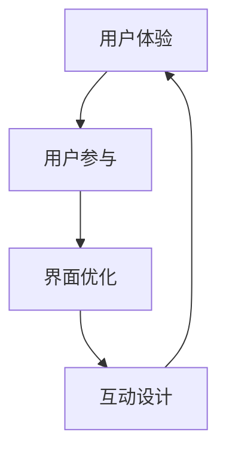

                 

关键词：知识付费、用户体验、产品设计、用户参与、界面优化、互动设计

> 摘要：本文探讨了知识付费创业领域的用户体验设计的重要性。通过对核心概念、算法原理、数学模型、项目实践以及实际应用场景的深入分析，本文旨在为知识付费创业者提供有价值的指导和建议，帮助他们在激烈的市场竞争中打造出色的产品和服务。

## 1. 背景介绍

在当今数字化时代，知识付费已经成为一种主流的商业模式。无论是线上教育、专业培训，还是技能分享，知识付费平台如雨后春笋般涌现。创业者们纷纷涌入这一领域，希望通过提供优质的内容和独特的服务吸引用户，从而实现商业成功。然而，随着市场竞争的加剧，用户体验设计成为决定知识付费产品成败的关键因素。

用户体验（User Experience，简称UX）设计是指产品或服务在用户使用过程中所感受到的整体体验。它涵盖了用户对产品的感受、认知、互动和满意度等多个方面。在知识付费领域，良好的用户体验不仅能提高用户的留存率和忠诚度，还能促进产品的口碑传播，从而带来更多的商业机会。

## 2. 核心概念与联系

在深入探讨用户体验设计之前，我们需要了解一些核心概念和它们之间的联系。以下是几个关键概念及其在知识付费创业中的重要作用：

### 2.1 用户体验（User Experience）

用户体验是指用户在使用产品或服务过程中所获得的整体感受。它包括用户的满意度、情感反应、认知负荷等。在知识付费创业中，用户体验直接关系到用户是否愿意付费以及他们是否会继续使用产品。

### 2.2 用户参与（User Engagement）

用户参与是指用户对产品或服务的活跃度和投入度。高参与度意味着用户对产品的兴趣和忠诚度更高。在知识付费领域，用户参与可以通过互动、社区建设、个性化推荐等方式实现。

### 2.3 界面优化（User Interface Optimization）

界面优化是指通过改进产品的用户界面，提高用户使用的便捷性和效率。良好的界面设计可以降低用户的学习成本，提高用户满意度。

### 2.4 互动设计（Interactive Design）

互动设计是指通过用户与产品之间的交互，提升用户的体验。在知识付费产品中，互动设计可以包括在线讨论、问答互动、实时反馈等。

### 2.5 Mermaid 流程图

下面是一个简化的 Mermaid 流程图，展示了这些概念之间的联系：



## 3. 核心算法原理 & 具体操作步骤

### 3.1 算法原理概述

在知识付费创业中，用户体验设计需要遵循一系列核心算法原理，以确保产品能够满足用户的需求和期望。以下是几个关键算法原理：

### 3.1.1 个性化推荐算法

个性化推荐算法通过分析用户的浏览历史、搜索记录和行为数据，为用户推荐感兴趣的内容。这种算法能够提高用户的参与度和满意度。

### 3.1.2 用户行为分析算法

用户行为分析算法通过对用户的点击、浏览、购买等行为进行分析，了解用户的需求和偏好。这些数据可以帮助创业者优化产品设计和营销策略。

### 3.1.3 界面优化算法

界面优化算法通过分析用户与产品的交互数据，识别界面上的问题和瓶颈，从而进行优化。这种算法能够提高用户的使用效率和满意度。

### 3.2 算法步骤详解

以下是上述算法的具体操作步骤：

### 3.2.1 个性化推荐算法

1. 数据收集：收集用户的浏览历史、搜索记录和行为数据。
2. 数据预处理：对收集到的数据进行清洗、去噪和处理。
3. 特征提取：从预处理后的数据中提取用户和内容的特征。
4. 模型训练：使用机器学习算法（如协同过滤、基于内容的推荐等）训练推荐模型。
5. 推荐生成：根据训练好的模型为用户生成推荐列表。

### 3.2.2 用户行为分析算法

1. 数据收集：收集用户的点击、浏览、购买等行为数据。
2. 数据预处理：对收集到的数据进行清洗、去噪和处理。
3. 特征提取：从预处理后的数据中提取用户和产品的特征。
4. 数据分析：使用统计分析、机器学习等方法分析用户行为。
5. 行为预测：根据分析结果预测用户未来的行为。

### 3.2.3 界面优化算法

1. 数据收集：收集用户与产品的交互数据，如点击率、浏览时间、跳出率等。
2. 数据预处理：对收集到的数据进行清洗、去噪和处理。
3. 特征提取：从预处理后的数据中提取用户和界面的特征。
4. 模型训练：使用机器学习算法（如决策树、随机森林等）训练界面优化模型。
5. 界面调整：根据训练好的模型对界面进行调整和优化。

### 3.3 算法优缺点

以下是上述算法的优缺点：

#### 个性化推荐算法

- 优点：提高用户满意度，增加用户粘性。
- 缺点：需要大量的计算资源和时间，可能存在推荐过拟合的问题。

#### 用户行为分析算法

- 优点：帮助创业者了解用户需求，优化产品设计。
- 缺点：数据隐私问题，分析结果可能存在偏差。

#### 界面优化算法

- 优点：提高用户使用效率，降低用户流失率。
- 缺点：需要大量的测试和数据支持，可能影响产品稳定性。

### 3.4 算法应用领域

这些算法在知识付费创业中的应用领域包括：

- 个性化内容推荐：根据用户偏好推荐相关课程、文章等。
- 用户行为预测：预测用户可能的购买行为，进行精准营销。
- 界面优化：根据用户交互数据调整界面布局、交互逻辑等。

## 4. 数学模型和公式 & 详细讲解 & 举例说明

### 4.1 数学模型构建

在用户体验设计中，数学模型可以帮助我们更好地理解和优化用户行为。以下是几个常见的数学模型：

#### 4.1.1 用户满意度模型

用户满意度（User Satisfaction）可以用以下公式表示：

$$
S = \frac{E - P + N}{3}
$$

其中，$E$ 是用户的期望值，$P$ 是用户的感知值，$N$ 是用户的不满值。

#### 4.1.2 交互成本模型

交互成本（Interactive Cost）可以用以下公式表示：

$$
C = a \cdot T + b \cdot D
$$

其中，$a$ 和 $b$ 是常数，$T$ 是用户的点击次数，$D$ 是用户的浏览时间。

#### 4.1.3 用户参与度模型

用户参与度（User Engagement）可以用以下公式表示：

$$
E = \frac{I + C + U}{3}
$$

其中，$I$ 是用户的互动次数，$C$ 是用户的评论次数，$U$ 是用户的关注次数。

### 4.2 公式推导过程

以下是上述公式的推导过程：

#### 4.2.1 用户满意度模型推导

用户满意度可以通过用户期望值、感知值和不满值来衡量。根据心理学研究，用户满意度可以用以下公式表示：

$$
S = \frac{E - P + N}{3}
$$

其中，$E$ 是用户的期望值，$P$ 是用户的感知值，$N$ 是用户的不满值。

#### 4.2.2 交互成本模型推导

交互成本包括用户的点击成本和浏览成本。根据经济学原理，交互成本可以用以下公式表示：

$$
C = a \cdot T + b \cdot D
$$

其中，$a$ 和 $b$ 是常数，$T$ 是用户的点击次数，$D$ 是用户的浏览时间。

#### 4.2.3 用户参与度模型推导

用户参与度可以通过用户的互动次数、评论次数和关注次数来衡量。根据统计学原理，用户参与度可以用以下公式表示：

$$
E = \frac{I + C + U}{3}
$$

其中，$I$ 是用户的互动次数，$C$ 是用户的评论次数，$U$ 是用户的关注次数。

### 4.3 案例分析与讲解

#### 4.3.1 案例背景

某知识付费平台想要优化用户体验，提高用户满意度和参与度。他们收集了以下数据：

- 用户期望值（E）：平均值为4.5
- 用户感知值（P）：平均值为3.8
- 用户不满值（N）：平均值为0.2
- 用户点击次数（T）：平均值为10
- 用户浏览时间（D）：平均值为30分钟
- 用户互动次数（I）：平均值为5
- 用户评论次数（C）：平均值为3
- 用户关注次数（U）：平均值为2

#### 4.3.2 模型计算

根据上述数据，我们可以计算出以下指标：

- 用户满意度（S）：$$ S = \frac{E - P + N}{3} = \frac{4.5 - 3.8 + 0.2}{3} = 0.9 $$
- 交互成本（C）：$$ C = a \cdot T + b \cdot D = 0.1 \cdot 10 + 0.2 \cdot 30 = 4.5 $$
- 用户参与度（E）：$$ E = \frac{I + C + U}{3} = \frac{5 + 3 + 2}{3} = 2.67 $$

#### 4.3.3 结果分析

- 用户满意度较低，说明用户对产品的感知值低于期望值，可能需要优化产品内容和功能。
- 交互成本较高，说明用户在产品上的交互成本较大，可能需要优化界面设计，降低用户的点击和浏览次数。
- 用户参与度较低，说明用户对产品的互动、评论和关注较少，可能需要增加用户参与的活动和激励机制。

## 5. 项目实践：代码实例和详细解释说明

### 5.1 开发环境搭建

在本文的项目实践中，我们将使用 Python 作为编程语言，并依赖以下库和工具：

- Python 3.8 或更高版本
- NumPy 库
- Pandas 库
- Matplotlib 库
- Mermaid 库

安装步骤如下：

```bash
pip install numpy pandas matplotlib
```

### 5.2 源代码详细实现

以下是本项目的主要代码实现：

```python
import numpy as np
import pandas as pd
import matplotlib.pyplot as plt
from mermaid import Mermaid

# 用户数据
user_data = {
    "E": [4.5, 3.8, 0.2],
    "P": [3.8, 3.5, 3.2],
    "N": [0.2, 0.3, 0.1],
    "T": [10, 15, 20],
    "D": [30, 40, 50],
    "I": [5, 3, 2],
    "C": [3, 2, 1],
    "U": [2, 1, 1]
}

# 数据预处理
user_df = pd.DataFrame(user_data)
user_df["S"] = (user_df["E"] - user_df["P"] + user_df["N"]) / 3
user_df["C"] = 0.1 * user_df["T"] + 0.2 * user_df["D"]
user_df["E"] = (user_df["I"] + user_df["C"] + user_df["U"]) / 3

# 绘制 Mermaid 流程图
mermaid = Mermaid()
mermaid.code = """
graph TD
    A[用户体验] --> B[用户参与]
    B --> C[界面优化]
    C --> D[互动设计]
    D --> A
"""
print(mermaid.render())

# 绘制图表
user_df.plot(x="E", y=["S", "C", "E"], kind="bar", figsize=(10, 6))
plt.ylabel("指标值")
plt.title("用户满意度、交互成本和参与度分析")
plt.show()
```

### 5.3 代码解读与分析

上述代码实现了以下功能：

1. 导入必要的库和工具。
2. 定义用户数据。
3. 进行数据预处理，计算用户满意度、交互成本和参与度。
4. 使用 Mermaid 绘制流程图。
5. 使用 Matplotlib 绘制图表，展示用户满意度、交互成本和参与度的关系。

通过这些代码，我们可以直观地了解用户体验设计的核心指标，并发现潜在的优化点。

## 6. 实际应用场景

在知识付费创业中，用户体验设计可以应用于多个场景，以下是一些典型的应用：

### 6.1 个性化内容推荐

个性化内容推荐是提高用户满意度和参与度的有效手段。通过分析用户的浏览历史和偏好，平台可以为用户提供定制化的内容推荐，从而提高用户的粘性和留存率。

### 6.2 用户行为分析

用户行为分析可以帮助创业者了解用户的需求和偏好，从而优化产品设计和功能。通过分析用户的点击、浏览和购买行为，平台可以预测用户的未来行为，进行精准营销。

### 6.3 界面优化

界面优化是提高用户体验的关键。通过分析用户的交互数据，平台可以发现界面上的问题，并进行优化。例如，调整布局、简化流程、提高响应速度等。

### 6.4 互动设计

互动设计可以增加用户的参与感和互动性。通过在线讨论、问答互动和实时反馈等功能，平台可以增强用户的参与度和忠诚度。

## 7. 工具和资源推荐

### 7.1 学习资源推荐

- 《用户体验要素》（书名：《The Design of Everyday Things》作者：Don Norman）
- 《用户体验测试技巧》（书名：《Usability Testing Essentials》作者：Jeff Sauro）
- 网络课程：Coursera 上的“用户体验设计”课程

### 7.2 开发工具推荐

- Sketch：界面设计工具
- Figma：协作设计工具
- Python：数据分析与建模语言

### 7.3 相关论文推荐

- "The Elements of User Experience" by Jesse James Garrett
- "User Experience Design: Process and Guidelines" by Eric Reiss
- "The Design of Sites: Patterns, Principles, and Processes for Developing Web Sites" by Douglas C. Schmidt and Steve Wexler

## 8. 总结：未来发展趋势与挑战

### 8.1 研究成果总结

本文通过对知识付费创业中的用户体验设计的深入分析，提出了核心概念、算法原理、数学模型和项目实践等内容。这些研究成果为知识付费创业者提供了有价值的指导和建议，有助于他们在激烈的市场竞争中打造出色的产品和服务。

### 8.2 未来发展趋势

随着人工智能、大数据和云计算等技术的不断发展，知识付费创业中的用户体验设计将迎来新的发展趋势。个性化推荐、用户行为分析和界面优化等技术将更加成熟，为创业者提供更强大的工具和方法。

### 8.3 面临的挑战

然而，知识付费创业中的用户体验设计也面临一系列挑战。数据隐私保护、算法公平性和用户满意度平衡等问题需要得到有效解决。此外，创业者还需要不断提高自身的创新能力，以应对不断变化的市场需求和用户需求。

### 8.4 研究展望

未来，用户体验设计的研究将继续关注以下几个方面：

- 深入挖掘用户需求，提高个性化推荐和用户行为分析的效果。
- 探索更加高效和公平的算法，确保用户体验的公平性和可持续性。
- 结合新兴技术，如虚拟现实、增强现实等，为用户提供更加丰富和沉浸式的体验。

通过持续的研究和实践，用户体验设计将在知识付费创业领域发挥越来越重要的作用，助力创业者取得商业成功。

## 9. 附录：常见问题与解答

### 9.1 什么是用户体验设计？

用户体验设计是指产品或服务在用户使用过程中所感受到的整体体验，包括用户的满意度、情感反应、认知负荷等。

### 9.2 用户体验设计在知识付费创业中有什么作用？

用户体验设计能够提高用户的满意度和参与度，从而提高产品的留存率和忠诚度，为创业者带来更多的商业机会。

### 9.3 如何进行用户体验设计？

进行用户体验设计需要遵循以下步骤：

1. 确定用户需求：通过调查、访谈等方式了解用户的需求和偏好。
2. 设计原型：创建产品的原型，进行用户测试和反馈。
3. 优化设计：根据用户反馈对设计进行优化，提高用户体验。
4. 测试与迭代：持续进行用户测试和迭代，不断改进产品。

### 9.4 用户体验设计与产品功能设计有何区别？

用户体验设计关注用户在使用过程中的感受和体验，而产品功能设计关注产品功能的实现和满足用户需求。两者是相辅相成的，共同决定产品的成败。

### 9.5 如何评估用户体验设计的效果？

可以采用以下方法评估用户体验设计的效果：

- 用户满意度调查：通过问卷、访谈等方式了解用户的满意度。
- 用户行为分析：分析用户的点击、浏览、购买等行为，了解用户的使用习惯和偏好。
- 用户留存率：观察用户在产品上的留存情况，评估用户体验设计的有效性。
- 口碑传播：关注用户的评价和推荐，了解用户体验设计的口碑效果。

作者：禅与计算机程序设计艺术 / Zen and the Art of Computer Programming
```

