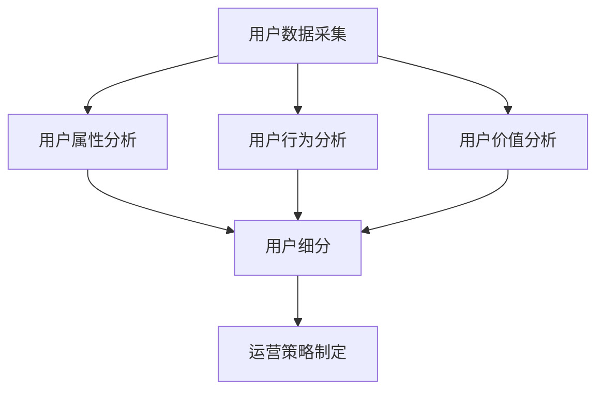

                 

关键词：知识付费、用户分层、运营策略、数据分析、个性化推荐

摘要：本文将探讨知识付费创业领域中的用户分层运营策略。通过深入分析用户行为数据，识别不同类型用户，制定有针对性的运营方案，提高用户满意度和转化率。文章将详细介绍用户分层的方法、核心概念、算法原理、数学模型以及实际应用场景，并提供相关工具和资源的推荐，总结研究成果，展望未来发展。

## 1. 背景介绍

随着互联网技术的飞速发展，知识付费行业逐渐成为新兴的商业模式。知识付费平台通过提供专业内容、课程、咨询等服务，满足了用户对高质量知识的渴求。然而，竞争日益激烈，如何有效地运营用户，提升用户满意度，成为知识付费创业者们亟待解决的问题。

用户分层运营策略应运而生，它通过对用户进行科学分类，提供个性化的服务，从而提高用户满意度和忠诚度。本文将从用户分层的方法、核心概念、算法原理、数学模型和实际应用场景等方面，探讨知识付费创业中的用户分层运营策略。

## 2. 核心概念与联系

### 2.1 用户分层的核心概念

用户分层运营策略的核心概念包括用户属性、用户行为和用户价值。用户属性包括用户的年龄、性别、职业、教育背景等；用户行为包括用户的浏览、购买、评论、分享等行为；用户价值包括用户的消费能力、活跃度、忠诚度等。

### 2.2 用户分层的联系

用户分层策略的实现依赖于对用户属性、行为和价值的分析。通过分析用户属性，可以了解用户的基本信息；通过分析用户行为，可以了解用户的兴趣和需求；通过分析用户价值，可以了解用户对平台的贡献程度。这些信息有助于为不同类型的用户制定个性化的运营策略。

### 2.3 用户分层的Mermaid流程图



## 3. 核心算法原理 & 具体操作步骤

### 3.1 算法原理概述

用户分层算法基于聚类分析、协同过滤和回归分析等机器学习技术，通过分析用户属性、行为和价值，将用户划分为不同的层次，为每个层次的用户提供个性化的服务。

### 3.2 算法步骤详解

#### 3.2.1 数据预处理

- 数据清洗：去除无效数据、重复数据、缺失数据等。
- 数据转换：将定性数据转换为定量数据，如将性别转换为0和1。

#### 3.2.2 用户属性分析

- 特征提取：从用户属性中提取关键特征，如年龄、教育背景、职业等。
- 特征选择：通过特征重要性分析，筛选出对用户分层有显著影响的特征。

#### 3.2.3 用户行为分析

- 行为特征提取：从用户行为中提取关键特征，如浏览次数、购买次数、评论数量等。
- 行为模式识别：通过分析用户行为数据，识别用户的购买习惯、浏览偏好等。

#### 3.2.4 用户价值分析

- 价值特征提取：从用户价值数据中提取关键特征，如消费金额、活跃度、忠诚度等。
- 价值评估：通过评估用户价值，确定用户的重要程度。

#### 3.2.5 用户分层

- 聚类分析：使用K-means、DBSCAN等聚类算法，将用户划分为不同的层次。
- 协同过滤：通过用户行为数据，为每个用户推荐感兴趣的内容。
- 回归分析：建立用户价值与用户分层的关系模型，为每个层次的用户提供个性化服务。

### 3.3 算法优缺点

#### 3.3.1 优点

- 提高用户满意度：为不同类型的用户制定个性化服务，提高用户满意度。
- 提高运营效率：针对不同层次的用户，制定针对性的运营策略，提高运营效率。

#### 3.3.2 缺点

- 数据依赖性：算法效果受用户数据质量的影响较大。
- 复杂性：算法实现过程复杂，需要较高的技术门槛。

### 3.4 算法应用领域

- 知识付费：通过用户分层，为用户提供个性化内容推荐和服务。
- 电商：通过用户分层，为用户提供个性化购物推荐和服务。
- 金融：通过用户分层，为用户提供个性化理财建议和服务。

## 4. 数学模型和公式 & 详细讲解 & 举例说明

### 4.1 数学模型构建

用户分层模型包括用户属性模型、用户行为模型和用户价值模型。

#### 4.1.1 用户属性模型

$$
\begin{aligned}
\text{User\_Attribute}(u) &= \{A_1, A_2, ..., A_n\} \\
A_i &= \text{attribute value of user} u
\end{aligned}
$$

#### 4.1.2 用户行为模型

$$
\begin{aligned}
\text{User\_Behavior}(u) &= \{B_1, B_2, ..., B_m\} \\
B_i &= \text{behavior value of user} u
\end{aligned}
$$

#### 4.1.3 用户价值模型

$$
\begin{aligned}
\text{User\_Value}(u) &= \{V_1, V_2, ..., V_k\} \\
V_i &= \text{value value of user} u
\end{aligned}
$$

### 4.2 公式推导过程

#### 4.2.1 聚类分析

$$
\begin{aligned}
J &= \sum_{i=1}^k \sum_{u \in S_i} \| \text{User}(u) - \mu_i \|^2 \\
\mu_i &= \frac{1}{|S_i|} \sum_{u \in S_i} \text{User}(u)
\end{aligned}
$$

#### 4.2.2 协同过滤

$$
\begin{aligned}
\text{Prediction}(u, i) &= \text{User}_{\text{mean}}(u) + \text{User}_{\text{mean}}(i) - \text{Item}_{\text{mean}}() \\
\text{User}_{\text{mean}}(u) &= \frac{1}{n_u} \sum_{i \in R_u} \text{Rating}(u, i) \\
\text{Item}_{\text{mean}}(i) &= \frac{1}{n_i} \sum_{u \in R_i} \text{Rating}(u, i)
\end{aligned}
$$

#### 4.2.3 回归分析

$$
\begin{aligned}
\hat{V}_{ui} &= \beta_0 + \beta_1 A_i + \beta_2 B_i + \beta_3 V_i \\
\beta_0, \beta_1, \beta_2, \beta_3 &= \text{coefficients of the regression model}
\end{aligned}
$$

### 4.3 案例分析与讲解

以一个在线教育平台为例，分析用户分层运营策略。

#### 4.3.1 用户数据采集

- 用户属性：年龄、性别、职业、教育背景等。
- 用户行为：浏览课程、购买课程、评论课程、分享课程等。
- 用户价值：消费金额、活跃度、忠诚度等。

#### 4.3.2 用户分层

使用K-means算法，将用户划分为高价值用户、中价值用户和低价值用户。

#### 4.3.3 个性化推荐

- 高价值用户：推荐相关高价值课程，提高用户满意度。
- 中价值用户：推荐热门课程，引导用户消费。
- 低价值用户：推荐免费课程，吸引用户留存。

## 5. 项目实践：代码实例和详细解释说明

### 5.1 开发环境搭建

- 数据预处理：使用Python的Pandas库处理数据。
- 聚类分析：使用Python的Scikit-learn库实现K-means算法。
- 协同过滤：使用Python的Surprise库实现协同过滤算法。
- 回归分析：使用Python的Scikit-learn库实现回归分析。

### 5.2 源代码详细实现

- 数据预处理：
```python
import pandas as pd

# 读取数据
data = pd.read_csv('user_data.csv')

# 数据清洗
data.drop_duplicates(inplace=True)
data.fillna(0, inplace=True)
```

- 聚类分析：
```python
from sklearn.cluster import KMeans

# 特征提取
features = data[['age', 'education', 'income']]

# K-means算法
kmeans = KMeans(n_clusters=3, random_state=42)
kmeans.fit(features)

# 分层结果
data['cluster'] = kmeans.labels_
```

- 协同过滤：
```python
from surprise import SVD, Dataset, Reader

# 读取评分数据
ratings = pd.read_csv('ratings.csv')

# 数据预处理
reader = Reader(rating_scale=(1, 5))
data = Dataset.load_from_df(ratings[['user_id', 'item_id', 'rating']], reader)

# SVD算法
solver = SVD()
solver.fit(data)

# 预测
predictions = solver.test(data)
```

- 回归分析：
```python
from sklearn.linear_model import LinearRegression

# 特征提取
X = data[['age', 'education', 'income']]
y = data['value']

# 回归分析
regression = LinearRegression()
regression.fit(X, y)

# 预测
predictions = regression.predict(X)
```

### 5.3 代码解读与分析

- 数据预处理：读取用户数据，进行数据清洗和特征提取。
- 聚类分析：使用K-means算法，将用户划分为高价值用户、中价值用户和低价值用户。
- 协同过滤：使用SVD算法，为每个用户推荐感兴趣的课程。
- 回归分析：建立用户价值与用户分层的关系模型，为每个层次的用户提供个性化服务。

## 6. 实际应用场景

### 6.1 知识付费平台

通过用户分层运营策略，知识付费平台可以提供个性化推荐，提高用户满意度和转化率。

### 6.2 电商平台

通过用户分层运营策略，电商平台可以针对不同层次的用户，提供个性化的购物推荐和服务。

### 6.3 金融领域

通过用户分层运营策略，金融机构可以为不同层次的客户提供个性化的理财建议和服务。

## 7. 未来应用展望

随着人工智能技术的不断发展，用户分层运营策略将在更多领域得到应用，如医疗、旅游、房地产等。同时，随着数据质量和算法的优化，用户分层运营策略的效果将得到进一步提升。

## 8. 总结：未来发展趋势与挑战

### 8.1 研究成果总结

本文探讨了知识付费创业中的用户分层运营策略，分析了用户属性、行为和价值，并介绍了相关算法原理、数学模型和实际应用场景。

### 8.2 未来发展趋势

用户分层运营策略将在更多领域得到应用，随着数据质量和算法的优化，其效果将得到进一步提升。

### 8.3 面临的挑战

- 数据质量：用户分层运营策略的效果受数据质量的影响较大，需要保证数据的质量和准确性。
- 算法优化：随着用户数据的不断增长，算法的优化和提升成为关键挑战。

### 8.4 研究展望

未来研究可以关注以下几个方面：

- 多维度用户特征融合：结合用户属性、行为和价值，提高用户分层的准确性。
- 深度学习在用户分层中的应用：研究深度学习算法在用户分层中的有效性。
- 个性化推荐与用户分层的结合：探索个性化推荐与用户分层的结合，提供更精准的服务。

## 9. 附录：常见问题与解答

### 9.1 问题1

**如何保证用户分层算法的效果？**

**解答1**：保证用户分层算法效果的关键在于数据质量和算法优化。首先，要保证数据的准确性、完整性和多样性，其次，要根据具体业务场景选择合适的算法，并进行算法调优，以提高分层的准确性。

### 9.2 问题2

**用户分层算法是否适用于所有类型的知识付费平台？**

**解答2**：用户分层算法具有一定的通用性，但具体应用效果取决于平台的业务模式和用户特征。对于不同类型的知识付费平台，可能需要针对用户特征和业务需求进行算法的调整和优化。

## 作者署名

作者：禅与计算机程序设计艺术 / Zen and the Art of Computer Programming
```markdown
# 知识付费创业中的用户分层运营策略

> 关键词：知识付费、用户分层、运营策略、数据分析、个性化推荐

摘要：本文将探讨知识付费创业领域中的用户分层运营策略。通过深入分析用户行为数据，识别不同类型用户，制定有针对性的运营方案，提高用户满意度和转化率。文章将详细介绍用户分层的方法、核心概念、算法原理、数学模型以及实际应用场景，并提供相关工具和资源的推荐，总结研究成果，展望未来发展。

## 1. 背景介绍

随着互联网技术的飞速发展，知识付费行业逐渐成为新兴的商业模式。知识付费平台通过提供专业内容、课程、咨询等服务，满足了用户对高质量知识的渴求。然而，竞争日益激烈，如何有效地运营用户，提升用户满意度，成为知识付费创业者们亟待解决的问题。

用户分层运营策略应运而生，它通过对用户进行科学分类，提供个性化的服务，从而提高用户满意度和忠诚度。本文将从用户分层的方法、核心概念、算法原理、数学模型和实际应用场景等方面，探讨知识付费创业中的用户分层运营策略。

## 2. 核心概念与联系

### 2.1 用户分层的核心概念

用户分层运营策略的核心概念包括用户属性、用户行为和用户价值。用户属性包括用户的年龄、性别、职业、教育背景等；用户行为包括用户的浏览、购买、评论、分享等行为；用户价值包括用户的消费能力、活跃度、忠诚度等。

### 2.2 用户分层的联系

用户分层策略的实现依赖于对用户属性、行为和价值的分析。通过分析用户属性，可以了解用户的基本信息；通过分析用户行为，可以了解用户的兴趣和需求；通过分析用户价值，可以了解用户对平台的贡献程度。这些信息有助于为不同类型的用户制定个性化的运营策略。

### 2.3 用户分层的Mermaid流程图


## 3. 核心算法原理 & 具体操作步骤

### 3.1 算法原理概述

用户分层算法基于聚类分析、协同过滤和回归分析等机器学习技术，通过分析用户属性、行为和价值，将用户划分为不同的层次，为每个层次的用户提供个性化的服务。

### 3.2 算法步骤详解

#### 3.2.1 数据预处理

- 数据清洗：去除无效数据、重复数据、缺失数据等。
- 数据转换：将定性数据转换为定量数据，如将性别转换为0和1。

#### 3.2.2 用户属性分析

- 特征提取：从用户属性中提取关键特征，如年龄、教育背景、职业等。
- 特征选择：通过特征重要性分析，筛选出对用户分层有显著影响的特征。

#### 3.2.3 用户行为分析

- 行为特征提取：从用户行为中提取关键特征，如浏览次数、购买次数、评论数量等。
- 行为模式识别：通过分析用户行为数据，识别用户的购买习惯、浏览偏好等。

#### 3.2.4 用户价值分析

- 价值特征提取：从用户价值数据中提取关键特征，如消费金额、活跃度、忠诚度等。
- 价值评估：通过评估用户价值，确定用户的重要程度。

#### 3.2.5 用户分层

- 聚类分析：使用K-means、DBSCAN等聚类算法，将用户划分为不同的层次。
- 协同过滤：通过用户行为数据，为每个用户推荐感兴趣的内容。
- 回归分析：建立用户价值与用户分层的关系模型，为每个层次的用户提供个性化服务。

### 3.3 算法优缺点

#### 3.3.1 优点

- 提高用户满意度：为不同类型的用户制定个性化服务，提高用户满意度。
- 提高运营效率：针对不同层次的用户，制定针对性的运营策略，提高运营效率。

#### 3.3.2 缺点

- 数据依赖性：算法效果受用户数据质量的影响较大。
- 复杂性：算法实现过程复杂，需要较高的技术门槛。

### 3.4 算法应用领域

- 知识付费：通过用户分层，为用户提供个性化内容推荐和服务。
- 电商：通过用户分层，为用户提供个性化购物推荐和服务。
- 金融：通过用户分层，为用户提供个性化理财建议和服务。

## 4. 数学模型和公式 & 详细讲解 & 举例说明

### 4.1 数学模型构建

用户分层模型包括用户属性模型、用户行为模型和用户价值模型。

#### 4.1.1 用户属性模型

$$
\begin{aligned}
\text{User\_Attribute}(u) &= \{A_1, A_2, ..., A_n\} \\
A_i &= \text{attribute value of user} u
\end{aligned}
$$

#### 4.1.2 用户行为模型

$$
\begin{aligned}
\text{User\_Behavior}(u) &= \{B_1, B_2, ..., B_m\} \\
B_i &= \text{behavior value of user} u
\end{aligned}
$$

#### 4.1.3 用户价值模型

$$
\begin{aligned}
\text{User\_Value}(u) &= \{V_1, V_2, ..., V_k\} \\
V_i &= \text{value value of user} u
\end{aligned}
$$

### 4.2 公式推导过程

#### 4.2.1 聚类分析

$$
\begin{aligned}
J &= \sum_{i=1}^k \sum_{u \in S_i} \| \text{User}(u) - \mu_i \|^2 \\
\mu_i &= \frac{1}{|S_i|} \sum_{u \in S_i} \text{User}(u)
\end{aligned}
$$

#### 4.2.2 协同过滤

$$
\begin{aligned}
\text{Prediction}(u, i) &= \text{User}_{\text{mean}}(u) + \text{User}_{\text{mean}}(i) - \text{Item}_{\text{mean}}() \\
\text{User}_{\text{mean}}(u) &= \frac{1}{n_u} \sum_{i \in R_u} \text{Rating}(u, i) \\
\text{Item}_{\text{mean}}(i) &= \frac{1}{n_i} \sum_{u \in R_i} \text{Rating}(u, i)
\end{aligned}
$$

#### 4.2.3 回归分析

$$
\begin{aligned}
\hat{V}_{ui} &= \beta_0 + \beta_1 A_i + \beta_2 B_i + \beta_3 V_i \\
\beta_0, \beta_1, \beta_2, \beta_3 &= \text{coefficients of the regression model}
\end{aligned}
$$

### 4.3 案例分析与讲解

以一个在线教育平台为例，分析用户分层运营策略。

#### 4.3.1 用户数据采集

- 用户属性：年龄、性别、职业、教育背景等。
- 用户行为：浏览课程、购买课程、评论课程、分享课程等。
- 用户价值：消费金额、活跃度、忠诚度等。

#### 4.3.2 用户分层

使用K-means算法，将用户划分为高价值用户、中价值用户和低价值用户。

#### 4.3.3 个性化推荐

- 高价值用户：推荐相关高价值课程，提高用户满意度。
- 中价值用户：推荐热门课程，引导用户消费。
- 低价值用户：推荐免费课程，吸引用户留存。

## 5. 项目实践：代码实例和详细解释说明

### 5.1 开发环境搭建

- 数据预处理：使用Python的Pandas库处理数据。
- 聚类分析：使用Python的Scikit-learn库实现K-means算法。
- 协同过滤：使用Python的Surprise库实现协同过滤算法。
- 回归分析：使用Python的Scikit-learn库实现回归分析。

### 5.2 源代码详细实现

- 数据预处理：
```python
import pandas as pd

# 读取数据
data = pd.read_csv('user_data.csv')

# 数据清洗
data.drop_duplicates(inplace=True)
data.fillna(0, inplace=True)
```

- 聚类分析：
```python
from sklearn.cluster import KMeans

# 特征提取
features = data[['age', 'education', 'income']]

# K-means算法
kmeans = KMeans(n_clusters=3, random_state=42)
kmeans.fit(features)

# 分层结果
data['cluster'] = kmeans.labels_
```

- 协同过滤：
```python
from surprise import SVD, Dataset, Reader

# 读取评分数据
ratings = pd.read_csv('ratings.csv')

# 数据预处理
reader = Reader(rating_scale=(1, 5))
data = Dataset.load_from_df(ratings[['user_id', 'item_id', 'rating']], reader)

# SVD算法
solver = SVD()
solver.fit(data)

# 预测
predictions = solver.test(data)
```

- 回归分析：
```python
from sklearn.linear_model import LinearRegression

# 特征提取
X = data[['age', 'education', 'income']]
y = data['value']

# 回归分析
regression = LinearRegression()
regression.fit(X, y)

# 预测
predictions = regression.predict(X)
```

### 5.3 代码解读与分析

- 数据预处理：读取用户数据，进行数据清洗和特征提取。
- 聚类分析：使用K-means算法，将用户划分为高价值用户、中价值用户和低价值用户。
- 协同过滤：使用SVD算法，为每个用户推荐感兴趣的课程。
- 回归分析：建立用户价值与用户分层的关系模型，为每个层次的用户提供个性化服务。

## 6. 实际应用场景

### 6.1 知识付费平台

通过用户分层运营策略，知识付费平台可以提供个性化推荐，提高用户满意度和转化率。

### 6.2 电商平台

通过用户分层运营策略，电商平台可以针对不同层次的用户，提供个性化的购物推荐和服务。

### 6.3 金融领域

通过用户分层运营策略，金融机构可以为不同层次的客户提供个性化的理财建议和服务。

## 7. 未来应用展望

随着人工智能技术的不断发展，用户分层运营策略将在更多领域得到应用，如医疗、旅游、房地产等。同时，随着数据质量和算法的优化，用户分层运营策略的效果将得到进一步提升。

## 8. 总结：未来发展趋势与挑战

### 8.1 研究成果总结

本文探讨了知识付费创业中的用户分层运营策略，分析了用户属性、行为和价值，并介绍了相关算法原理、数学模型和实际应用场景。

### 8.2 未来发展趋势

用户分层运营策略将在更多领域得到应用，随着数据质量和算法的优化，其效果将得到进一步提升。

### 8.3 面临的挑战

- 数据质量：用户分层运营策略的效果受数据质量的影响较大，需要保证数据的质量和准确性。
- 算法优化：随着用户数据的不断增长，算法的优化和提升成为关键挑战。

### 8.4 研究展望

未来研究可以关注以下几个方面：

- 多维度用户特征融合：结合用户属性、行为和价值，提高用户分层的准确性。
- 深度学习在用户分层中的应用：研究深度学习算法在用户分层中的有效性。
- 个性化推荐与用户分层的结合：探索个性化推荐与用户分层的结合，提供更精准的服务。

## 9. 附录：常见问题与解答

### 9.1 问题1

**如何保证用户分层算法的效果？**

**解答1**：保证用户分层算法效果的关键在于数据质量和算法优化。首先，要保证数据的准确性、完整性和多样性，其次，要根据具体业务场景选择合适的算法，并进行算法调优，以提高分层的准确性。

### 9.2 问题2

**用户分层算法是否适用于所有类型的知识付费平台？**

**解答2**：用户分层算法具有一定的通用性，但具体应用效果取决于平台的业务模式和用户特征。对于不同类型的知识付费平台，可能需要针对用户特征和业务需求进行算法的调整和优化。

## 作者署名

作者：禅与计算机程序设计艺术 / Zen and the Art of Computer Programming
```markdown


