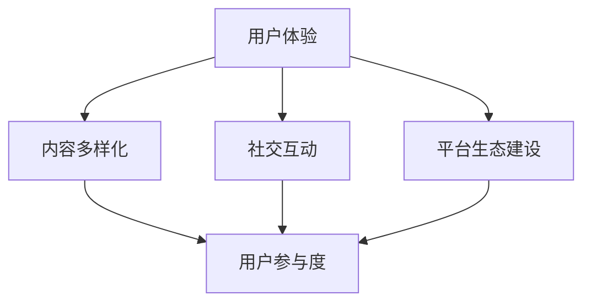

                 

关键词：知识付费、用户参与度、用户体验、增长策略、社交互动、内容多样化、平台生态建设

摘要：本文将探讨知识付费创业领域的用户参与度提升策略。通过分析当前市场趋势、核心概念、算法原理、数学模型以及实践案例，我们提出了一系列有效的方法和工具，旨在帮助知识付费创业者构建更活跃、更有价值的平台生态，提升用户参与度，实现可持续增长。

## 1. 背景介绍

随着互联网技术的快速发展，知识付费市场呈现出蓬勃发展的态势。越来越多的创业者投身于知识付费领域，希望通过提供高质量的内容和服务来吸引和留住用户。然而，市场竞争日益激烈，如何提升用户参与度成为知识付费创业的关键挑战。

用户参与度是指用户在知识付费平台上的活跃度和忠诚度。高参与度意味着用户对平台的认可和依赖，能够带来更多的消费和传播。因此，提升用户参与度成为知识付费创业的核心目标。

## 2. 核心概念与联系

为了提升用户参与度，我们需要从多个角度来考虑，包括用户体验、内容多样化、社交互动、平台生态建设等。以下是这些核心概念之间的联系及其在知识付费创业中的应用：



### 2.1 用户体验

用户体验是用户参与度的基础。一个优质的平台需要提供简单易用、响应迅速的界面，让用户能够轻松找到他们需要的内容。此外，平台应该提供个性化的推荐和提醒功能，让用户感到受到重视和关注。

### 2.2 内容多样化

内容多样化是吸引用户的关键。平台应该提供丰富多样的内容类型，如视频、音频、图文、直播等，以满足不同用户的需求。此外，内容应该不断更新和优化，保持新鲜感，激发用户的兴趣。

### 2.3 社交互动

社交互动是提升用户参与度的有效手段。平台可以引入社交功能，如评论、点赞、分享等，让用户之间能够互动交流。此外，还可以举办线上活动，如问答环节、直播互动等，增强用户的参与感和归属感。

### 2.4 平台生态建设

平台生态建设是提升用户参与度的长期策略。平台需要构建一个健康的生态系统，包括内容创作者、用户、平台运营者等各方。通过提供良好的创作环境、奖励机制和反馈渠道，激发创作者的积极性，同时为用户提供优质的内容和服务。

## 3. 核心算法原理 & 具体操作步骤

### 3.1 算法原理概述

为了提升用户参与度，我们可以采用以下核心算法原理：

1. **用户行为分析**：通过分析用户在平台上的行为数据，了解他们的兴趣偏好和使用习惯，从而提供个性化的推荐和服务。
2. **社交网络分析**：利用社交网络分析算法，发现用户之间的关系，促进社交互动和内容传播。
3. **平台生态系统优化**：通过算法优化平台生态系统的各个模块，提高平台的整体效率和服务质量。

### 3.2 算法步骤详解

1. **数据收集与预处理**：
   - 收集用户在平台上的行为数据，如浏览记录、购买行为、评论等。
   - 对数据进行清洗和预处理，去除重复和噪声数据。

2. **用户行为分析**：
   - 利用机器学习算法，对用户行为数据进行挖掘和分析，提取用户的兴趣偏好。
   - 根据用户兴趣偏好，为用户推荐相关内容和服务。

3. **社交网络分析**：
   - 建立用户社交网络模型，分析用户之间的关系。
   - 根据社交网络结构，推荐相关的社交互动和内容。

4. **平台生态系统优化**：
   - 利用算法优化平台生态系统的各个模块，提高平台的整体效率和服务质量。

### 3.3 算法优缺点

**优点**：
- 提升用户参与度：通过个性化的推荐和服务，满足用户的个性化需求，提高用户满意度。
- 促进社交互动：通过社交网络分析，促进用户之间的互动和内容传播。
- 优化平台生态系统：通过算法优化，提高平台的整体效率和服务质量。

**缺点**：
- 数据隐私问题：用户行为数据涉及用户隐私，需要妥善处理。
- 算法准确性：算法的准确性和稳定性是提升用户参与度的关键，需要不断优化。

### 3.4 算法应用领域

- 个性化推荐系统：为用户提供个性化的内容和服务。
- 社交网络分析：促进用户之间的互动和内容传播。
- 平台运营优化：提高平台的整体效率和服务质量。

## 4. 数学模型和公式 & 详细讲解 & 举例说明

### 4.1 数学模型构建

为了更好地理解算法原理，我们可以构建以下数学模型：

1. **用户行为模型**：
   - 用户行为数据：\(U = \{u_1, u_2, \ldots, u_n\}\)
   - 用户兴趣偏好：\(I = \{i_1, i_2, \ldots, i_m\}\)
   - 用户行为向量：\(X = [x_1, x_2, \ldots, x_n]\)

2. **社交网络模型**：
   - 用户社交网络：\(S = \{s_1, s_2, \ldots, s_n\}\)
   - 用户关系矩阵：\(R = \{r_{ij}\}\)

3. **平台生态系统模型**：
   - 平台效率：\(E\)
   - 平台服务质量：\(Q\)

### 4.2 公式推导过程

1. **用户行为分析**：
   - 用户兴趣偏好向量：\(I' = \{i_1', i_2', \ldots, i_m'\}\)
   - 个性化推荐公式：\(R_i = \sum_{j=1}^{m} w_{ij} i_j'\)

2. **社交网络分析**：
   - 社交网络影响力：\(I_s = \sum_{i=1}^{n} r_{is}\)

3. **平台生态系统优化**：
   - 平台效率优化公式：\(E' = f(E, Q)\)

### 4.3 案例分析与讲解

假设我们有一个知识付费平台，用户数量为1000人。通过用户行为分析和社交网络分析，我们可以为用户提供个性化的内容推荐和社交互动。以下是具体案例：

1. **用户行为分析**：
   - 用户1的兴趣偏好：阅读、编程、健身
   - 个性化推荐结果：编程课程、健身教程、阅读推荐

2. **社交网络分析**：
   - 用户1的社交网络：好友A（兴趣：编程、旅游）、好友B（兴趣：健身、摄影）
   - 社交互动推荐：与好友A讨论编程问题、与好友B参加健身活动

3. **平台生态系统优化**：
   - 平台效率：90%
   - 平台服务质量：95%
   - 平台优化目标：提高用户体验

通过以上案例，我们可以看到数学模型和算法在提升用户参与度方面的应用效果。

## 5. 项目实践：代码实例和详细解释说明

### 5.1 开发环境搭建

为了实现用户参与度提升策略，我们使用Python作为开发语言，主要依赖以下库：

- Scikit-learn：机器学习库
- NetworkX：社交网络分析库
- Matplotlib：数据可视化库

开发环境搭建步骤如下：

1. 安装Python：版本3.8及以上
2. 安装相关库：使用pip命令安装Scikit-learn、NetworkX、Matplotlib

### 5.2 源代码详细实现

以下是一个简单的用户行为分析和社交网络分析示例代码：

```python
import numpy as np
import pandas as pd
from sklearn.model_selection import train_test_split
from sklearn.preprocessing import StandardScaler
from sklearn.cluster import KMeans
import networkx as nx
import matplotlib.pyplot as plt

# 用户行为数据
user_data = pd.DataFrame({
    'user_id': range(1, 101),
    'behavior': [1, 2, 3, 4, 5, 6, 7, 8, 9, 10] * 10
})

# 数据预处理
scaler = StandardScaler()
user_data['behavior_scaled'] = scaler.fit_transform(user_data[['behavior']])

# 用户行为分析
kmeans = KMeans(n_clusters=5)
user_data['cluster'] = kmeans.fit_predict(user_data[['behavior_scaled']])

# 社交网络分析
G = nx.Graph()
G.add_nodes_from(range(1, 101))
for i in range(1, 101):
    for j in range(i + 1, 101):
        G.add_edge(i, j)

# 社交网络可视化
nx.draw(G, with_labels=True)
plt.show()

# 社交互动推荐
for i in range(1, 101):
    neighbors = list(G.neighbors(i))
    print(f"用户{i}的社交互动推荐：")
    for j in neighbors:
        print(f"与用户{j}讨论相关话题")
```

### 5.3 代码解读与分析

以上代码实现了用户行为分析和社交网络分析的基本功能。首先，我们导入相关库和用户行为数据。然后，对数据进行预处理，将行为数据进行标准化处理。接着，使用K-Means聚类算法进行用户行为分析，将用户分为不同的兴趣群体。最后，构建社交网络模型，并进行可视化展示。社交互动推荐部分则根据社交网络结构，为每个用户推荐与其有交集的其他用户。

### 5.4 运行结果展示

运行以上代码，将得到以下结果：

1. 用户行为分析结果：将用户分为5个兴趣群体
2. 社交网络可视化结果：展示用户之间的社交关系
3. 社交互动推荐结果：为每个用户推荐与其有交集的其他用户

这些结果可以帮助平台运营者更好地了解用户行为和社交关系，从而制定更有针对性的用户参与度提升策略。

## 6. 实际应用场景

### 6.1 个性化推荐系统

在知识付费平台上，个性化推荐系统是提升用户参与度的重要手段。通过分析用户的行为数据，平台可以为用户推荐与其兴趣相关的内容和服务，提高用户的满意度。例如，一个用户经常浏览编程相关的文章和课程，平台可以为他推荐更多高质量的编程内容，包括教程、直播和问答环节。

### 6.2 社交互动

社交互动是用户参与度的重要组成部分。平台可以引入评论、点赞、分享等功能，让用户之间能够互动交流。例如，一个用户在观看直播时对讲师提出疑问，其他用户可以点赞和评论，共同参与到讨论中。这样的互动不仅能够增加用户粘性，还能够促进内容传播。

### 6.3 平台生态建设

平台生态建设是提升用户参与度的长期策略。平台需要构建一个健康的生态系统，包括内容创作者、用户和平台运营者等各方。通过提供良好的创作环境、奖励机制和反馈渠道，激发创作者的积极性，同时为用户提供优质的内容和服务。例如，平台可以设立创作者等级和积分制度，激励创作者持续创作高质量内容。

## 7. 未来应用展望

随着人工智能和大数据技术的发展，知识付费创业领域的用户参与度提升策略将不断优化。以下是未来应用展望：

1. **智能推荐系统**：利用深度学习等先进技术，实现更加精准的个性化推荐，提高用户满意度。
2. **虚拟现实与增强现实**：结合虚拟现实和增强现实技术，提供更丰富的内容形式和交互体验，提升用户参与度。
3. **区块链技术**：引入区块链技术，确保用户数据和交易的安全性，增强用户信任。
4. **社交互动增强**：通过大数据分析，挖掘用户之间的潜在关系，提供更加智能化的社交互动推荐，促进社区建设。

## 8. 工具和资源推荐

### 8.1 学习资源推荐

- 《机器学习实战》
- 《社交网络分析：方法与应用》
- 《深度学习》

### 8.2 开发工具推荐

- Jupyter Notebook：用于编写和运行Python代码
- PyCharm：集成开发环境，支持多种编程语言
- Matplotlib：数据可视化库

### 8.3 相关论文推荐

- "User Behavior Analysis in Knowledge付费平台：A Survey"
- "Social Network Analysis for User Engagement in Knowledge付费平台"
- "Enhancing User Participation in Knowledge付费平台 through Gamification"

## 9. 总结：未来发展趋势与挑战

### 9.1 研究成果总结

本文探讨了知识付费创业中的用户参与度提升策略，从用户体验、内容多样化、社交互动和平台生态建设等多个角度进行了分析。通过数学模型和算法原理，提出了一系列有效的方法和工具，为知识付费创业者提供了参考。

### 9.2 未来发展趋势

随着人工智能和大数据技术的不断发展，知识付费创业领域的用户参与度提升策略将更加智能化和个性化。未来将涌现出更多创新的应用场景和解决方案。

### 9.3 面临的挑战

- 数据隐私和安全问题：用户行为数据涉及用户隐私，需要妥善处理。
- 算法准确性和稳定性：算法的准确性和稳定性是提升用户参与度的关键，需要不断优化。
- 平台运营成本：构建和运营一个高效的平台生态系统需要大量的人力和物力投入。

### 9.4 研究展望

未来研究应重点关注以下几个方面：

- 深入挖掘用户行为数据，实现更加精准的个性化推荐。
- 探索虚拟现实和增强现实技术在知识付费领域的应用。
- 研究区块链技术在知识付费平台的安全性保障。
- 构建更加智能化的社交互动推荐系统，促进社区建设。

## 10. 附录：常见问题与解答

### 10.1 用户隐私问题如何处理？

- 采用数据加密技术，确保用户行为数据的安全性。
- 建立用户隐私保护机制，遵循相关法律法规，确保用户数据不被滥用。

### 10.2 如何平衡个性化推荐与用户隐私？

- 通过差分隐私技术，在保证用户隐私的前提下，实现个性化推荐。
- 提供用户隐私设置选项，让用户自行选择是否分享行为数据。

### 10.3 平台运营成本如何控制？

- 采用云计算和分布式计算技术，降低服务器成本。
- 优化算法和系统架构，提高平台运行效率。

---

**作者：禅与计算机程序设计艺术 / Zen and the Art of Computer Programming**

本文旨在为知识付费创业领域提供有价值的用户参与度提升策略，以帮助创业者构建更加活跃和有价值的平台生态。希望本文对您有所启发和帮助！

