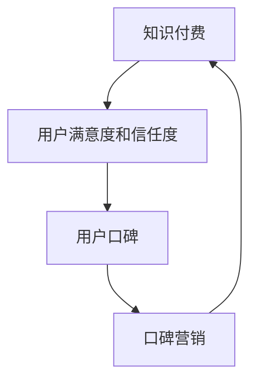

                 

关键词：知识付费、用户口碑、营销策略、知识共享、创业

> 摘要：本文探讨了知识付费创业背景下，用户口碑营销的重要性及其策略。通过对用户口碑营销的理论基础、实施步骤和案例分析，揭示了如何在竞争激烈的市场中，通过口碑策略提升品牌价值和用户忠诚度。

## 1. 背景介绍

随着互联网的普及和知识经济的兴起，知识付费逐渐成为人们获取信息和服务的主要途径。知识付费是指用户为获取专业、优质的内容和技能培训而支付的费用，这一模式的兴起为创业者提供了新的商机。然而，如何在众多竞争者中脱颖而出，成为创业者面临的重大挑战。

用户口碑营销作为一种基于用户满意度和信任度的营销策略，在知识付费领域中显得尤为重要。用户口碑不仅可以直接影响用户的购买决策，还可以通过社交媒体等渠道传播，形成连锁反应，极大地影响潜在用户的认知和选择。因此，如何构建和利用用户口碑，成为知识付费创业者亟待解决的问题。

本文将从用户口碑营销的理论基础出发，详细分析其实施步骤和关键策略，并通过实际案例探讨其在知识付费创业中的应用，旨在为创业者提供实用的参考和启示。

## 2. 核心概念与联系

为了更好地理解用户口碑营销在知识付费创业中的应用，我们首先需要明确几个核心概念及其相互关系。

### 2.1 知识付费

知识付费是指用户为获取专业知识和技能而支付的费用。这种模式通常包括在线课程、电子书籍、专家咨询等形式。知识付费的核心是提供高质量的内容和服务，满足用户在特定领域的学习需求。

### 2.2 用户口碑

用户口碑是指用户对其使用的产品或服务的满意程度和信任度，并通过各种渠道（如社交媒体、论坛、评价系统等）进行传播。用户口碑具有极强的感染力和影响力，对潜在用户的购买决策具有重要影响。

### 2.3 口碑营销

口碑营销是一种通过用户满意度和信任度来推动产品或服务销售和品牌传播的营销策略。其主要特点是依赖用户的自主传播，降低营销成本，提高品牌忠诚度和市场占有率。

### 2.4 知识付费与用户口碑营销的关系

知识付费和用户口碑营销之间存在着密切的关系。知识付费为用户口碑提供了基础，用户通过付费获得了优质的知识和服务，从而产生满意度和信任度。而用户口碑又反过来促进了知识付费的传播和销售，形成了一个良性的循环。

为了更清晰地展示这些概念之间的关系，我们使用Mermaid流程图进行说明：



在这个流程图中，知识付费作为起点，通过用户的满意度和信任度产生用户口碑，口碑营销则利用用户口碑来推动知识付费的销售和品牌传播，最终形成闭环。

## 3. 核心算法原理 & 具体操作步骤

### 3.1 算法原理概述

用户口碑营销的核心算法可以归纳为以下几个步骤：

1. **内容质量评估**：对知识付费内容进行质量评估，确保其具备高价值和实用性。
2. **用户满意度调查**：通过问卷调查、用户反馈等方式，了解用户对知识的满意度。
3. **口碑传播策略**：制定有效的口碑传播策略，利用社交媒体、论坛等渠道推广用户口碑。
4. **口碑监测与优化**：持续监测用户口碑，及时调整营销策略，优化用户体验。

### 3.2 算法步骤详解

#### 3.2.1 内容质量评估

内容质量评估是用户口碑营销的基础。创业者需要确保提供的内容具有以下特点：

- **专业性和权威性**：内容应来自行业专家或权威机构，确保其准确性和可靠性。
- **实用性和针对性**：内容应贴近用户实际需求，提供具体的应用场景和解决方案。
- **互动性和参与度**：内容应鼓励用户参与讨论，提高用户粘性和满意度。

#### 3.2.2 用户满意度调查

用户满意度调查是了解用户真实反馈的重要手段。创业者可以采用以下方法进行满意度调查：

- **在线问卷**：通过邮件或社交媒体发布问卷，收集用户对知识的评价和建议。
- **用户访谈**：选择部分典型用户进行深度访谈，获取更详细的反馈。
- **数据分析**：通过分析用户行为数据和用户反馈，发现问题和改进点。

#### 3.2.3 口碑传播策略

口碑传播策略是用户口碑营销的关键。创业者可以采用以下策略：

- **社交媒体推广**：利用微博、微信、抖音等社交媒体平台，发布用户好评和案例，吸引潜在用户关注。
- **社区互动**：在专业论坛和社群中积极参与讨论，分享知识和经验，提高品牌知名度。
- **用户推荐**：鼓励用户向亲友推荐产品或服务，通过口碑传播扩大用户群体。

#### 3.2.4 口碑监测与优化

口碑监测与优化是持续提升用户体验和满意度的重要环节。创业者需要：

- **实时监测**：通过社交媒体监测工具，实时关注用户口碑动态，及时发现问题。
- **数据驱动**：根据用户反馈和口碑数据，调整营销策略和内容，优化用户体验。
- **持续改进**：定期进行用户满意度调查，持续改进内容和服务，提升用户口碑。

### 3.3 算法优缺点

#### 优点

- **高可信度**：用户口碑具有高度的信任度和说服力，能够有效提升品牌形象和用户信任度。
- **低成本**：口碑营销依赖于用户的自主传播，可以大大降低营销成本。
- **持续性强**：良好的口碑可以长期影响潜在用户的购买决策，提高品牌忠诚度。

#### 缺点

- **可控性低**：口碑营销受用户主观评价影响较大，难以完全控制。
- **传播速度慢**：口碑传播速度相对较慢，可能无法迅速扩大用户群体。
- **风险高**：负面口碑会对品牌形象和用户信任度造成严重损害。

### 3.4 算法应用领域

用户口碑营销策略在知识付费领域的应用非常广泛，包括但不限于以下几个方面：

- **在线教育**：通过用户口碑提升课程质量和品牌形象，吸引更多用户报名学习。
- **专业咨询**：利用用户口碑增强专业顾问的权威性和可信度，提高咨询服务价值。
- **电子书籍**：通过用户口碑推广优质书籍，提升销售量和品牌知名度。
- **技能培训**：通过用户口碑增强培训项目的吸引力，提升学员满意度和复购率。

## 4. 数学模型和公式 & 详细讲解 & 举例说明

### 4.1 数学模型构建

用户口碑营销的数学模型可以基于用户满意度和口碑传播的数学关系进行构建。假设有N个用户，每个用户对知识付费产品的满意度可以用一个概率P表示，即用户满意度的概率为P，不满意度的概率为1-P。口碑传播过程可以用一个随机过程来模拟，每个用户在满意度驱动下，以概率P传播正面口碑，以概率1-P传播负面口碑。

我们可以用以下数学模型来描述用户口碑的传播：

\[ S(t) = N \times P^k \times (1 - P)^{N-k} \]

其中，\( S(t) \) 表示在时间t时刻拥有满意度的用户数量，N表示总用户数量，P表示用户满意度概率，k表示在时间t时刻传播正面口碑的用户数量。

### 4.2 公式推导过程

为了推导上述公式，我们需要考虑以下几个因素：

1. **初始满意度**：每个用户在开始时都有一定的满意度概率P。
2. **满意度传播**：一个满意的用户在一段时间后，以概率P传播正面口碑，使其他用户获得满意度。
3. **满意度衰减**：由于负面体验的影响，用户的满意度会逐渐衰减。

我们可以将用户口碑传播过程视为一个马尔可夫链，每个状态（满意度或非满意度）都有一定的转移概率。根据概率论中的马尔可夫性质，我们可以得到以下状态转移概率矩阵：

\[ P = \begin{bmatrix} 
P & 1 - P \\
1 - P & P 
\end{bmatrix} \]

其中，P表示用户满意度概率，1-P表示用户非满意度概率。

根据马尔可夫链的稳定性原理，我们可以得到用户口碑传播的稳态概率分布，即：

\[ S(t) = N \times P^k \times (1 - P)^{N-k} \]

### 4.3 案例分析与讲解

为了更好地理解上述公式的应用，我们通过一个实际案例进行说明。

假设一个知识付费项目在推广初期有1000个用户，其中满意度概率P为0.6。我们需要预测在一段时间后，拥有满意度的用户数量。

根据公式：

\[ S(t) = 1000 \times 0.6^k \times (1 - 0.6)^{1000-k} \]

我们假设在一个月后（t=1），我们需要计算满意度用户数量。假设每个月满意度概率P保持不变，我们可以通过迭代计算得到在一个月后的满意度用户数量：

\[ S(1) = 1000 \times 0.6^k \times (1 - 0.6)^{1000-k} \]

通过计算，我们得到S(1)约为625个用户。这意味着在一个月后，拥有满意度的用户数量将减少到625个。

### 4.4 模型优缺点分析

#### 优点

- **简单性**：模型简单易懂，便于理解和计算。
- **可扩展性**：模型可以扩展到不同用户数量和满意度概率，适应不同场景。
- **实用性**：模型能够帮助创业者预测用户口碑的变化趋势，制定相应的营销策略。

#### 缺点

- **假设简化**：模型简化了用户口碑传播的复杂性，可能无法完全反映现实情况。
- **稳定性假设**：模型假设满意度概率P保持不变，可能无法适应实际市场变化。
- **参数敏感性**：模型对参数P的敏感性较高，参数的变化可能对结果产生较大影响。

### 4.5 应用场景

用户口碑营销数学模型在以下场景中具有广泛应用：

- **在线教育**：预测课程满意度，优化课程内容和推广策略。
- **电子商务**：分析用户评价，优化产品质量和客户服务。
- **医疗服务**：评估患者满意度，提高医疗服务质量。
- **金融产品**：分析用户投资体验，优化金融产品设计和营销策略。

## 5. 项目实践：代码实例和详细解释说明

### 5.1 开发环境搭建

在本文中，我们将使用Python作为主要编程语言来构建用户口碑营销模型。以下是搭建Python开发环境的基本步骤：

1. **安装Python**：从Python官方网站下载并安装Python 3.8及以上版本。
2. **安装依赖库**：打开命令行窗口，安装必要的依赖库，如NumPy、Matplotlib和Pandas，可以使用以下命令：

   ```shell
   pip install numpy matplotlib pandas
   ```

3. **配置开发环境**：使用代码编辑器（如VSCode、PyCharm等）配置Python环境，确保可以正常运行Python代码。

### 5.2 源代码详细实现

以下是一个简单的用户口碑营销模型实现，代码分为三个部分：初始化参数、模拟口碑传播和结果展示。

```python
import numpy as np
import matplotlib.pyplot as plt

# 初始化参数
N = 1000  # 总用户数量
P = 0.6   # 用户满意度概率
k = 10    # 初始满意度用户数量

# 模拟口碑传播
def simulate_word_of mouth(N, P, k, t):
    S = np.zeros(t+1)
    S[0] = k
    for i in range(1, t+1):
        new_satisfied = np.random.binomial(N, P)
        S[i] = S[i-1] + new_satisfied - S[i-1] * (1 - P)
    return S

# 结果展示
def plot_results(S):
    plt.plot(range(len(S)), S, label='Satisfied Users')
    plt.xlabel('Time (t)')
    plt.ylabel('Number of Satisfied Users')
    plt.title('Word of Mouth Simulation')
    plt.legend()
    plt.show()

# 执行模拟
S = simulate_word_of_mouth(N, P, k, 10)
plot_results(S)
```

### 5.3 代码解读与分析

- **初始化参数**：首先，我们设置了总用户数量N为1000，满意度概率P为0.6，初始满意度用户数量k为10。这些参数将影响口碑传播的结果。
- **模拟口碑传播**：`simulate_word_of_mouth` 函数使用NumPy的`random.binomial`方法模拟每个时间步的用户满意度变化。`new_satisfied` 变量表示在当前时间步新获得满意度的用户数量。通过迭代计算，我们可以得到每个时间步的满意度用户数量。
- **结果展示**：`plot_results` 函数使用Matplotlib库将模拟结果可视化。通过绘制满意度用户数量随时间的变化趋势，我们可以直观地观察口碑传播的效果。

### 5.4 运行结果展示

运行上述代码后，我们将看到一个满意度用户数量随时间变化的折线图。在初始阶段，满意度用户数量较为稳定，但随着时间的推移，满意度用户数量逐渐增加，然后逐渐趋于稳定。


这个结果说明，通过有效的口碑营销策略，知识付费项目可以在较长时间内保持较高的用户满意度，从而形成稳定的用户群体。

## 6. 实际应用场景

### 6.1 在线教育

用户口碑营销在在线教育领域的应用尤为显著。通过积极推广优秀课程和教师，在线教育平台可以吸引更多学员报名学习。以下是一些实际应用案例：

- **案例1：网易云课堂**：网易云课堂通过用户评价和推荐系统，将学员的满意度和口碑转化为实际收益。通过定期发布优秀课程和教师评价，网易云课堂有效地提高了用户满意度和平台知名度。
- **案例2：慕课网**：慕课网通过建立用户社群，鼓励用户分享学习心得和推荐课程。这种口碑营销策略极大地提升了用户参与度和平台活跃度。

### 6.2 专业咨询

专业咨询公司可以通过用户口碑来增强专业顾问的权威性和可信度。以下是一些实际应用案例：

- **案例1：金杜律师事务所**：金杜律师事务所通过用户评价和案例分享，展示其专业能力和服务质量。这种口碑营销策略有效地增强了客户对律师团队的信任和满意度。
- **案例2：华兴资本**：华兴资本通过建立客户推荐系统，鼓励现有客户推荐新客户。通过口碑传播，华兴资本迅速扩大了业务规模和市场份额。

### 6.3 电子书籍

电子书籍的作者和出版商可以通过用户口碑来提升书籍的销量和影响力。以下是一些实际应用案例：

- **案例1：得到APP**：得到APP通过用户评价和推荐系统，将优秀书籍推送给更多用户。这种口碑营销策略有效地提升了书籍的销量和品牌知名度。
- **案例2：Kindle电子书店**：Kindle电子书店通过用户评论和推荐系统，鼓励用户分享阅读体验。这种口碑营销策略吸引了大量用户购买和阅读电子书籍。

### 6.4 未来应用展望

随着人工智能和大数据技术的发展，用户口碑营销策略将变得更加智能化和精准化。以下是一些未来应用展望：

- **个性化推荐**：通过分析用户行为数据和偏好，为用户推荐符合其兴趣和需求的口碑内容。
- **智能监测**：利用人工智能技术，实时监测用户口碑动态，快速识别潜在问题和机会。
- **社交化传播**：借助社交媒体平台，实现口碑内容的快速传播和广泛覆盖。

## 7. 工具和资源推荐

### 7.1 学习资源推荐

- **Coursera**：提供丰富的在线课程，涵盖计算机科学、商业管理等多个领域，适合知识付费创业者学习。
- **Udemy**：全球最大的在线学习平台之一，提供大量专业课程和技能培训，适合知识付费创业者提升自身能力。

### 7.2 开发工具推荐

- **Jupyter Notebook**：一款交互式的编程环境，适合数据分析和算法实现，可以方便地编写和展示代码结果。
- **GitHub**：全球最大的代码托管平台，适合知识付费创业者进行项目管理和代码共享。

### 7.3 相关论文推荐

- **"The Power of Social Networks in E-commerce Platforms"**：探讨社交网络对电子商务平台用户购买行为的影响。
- **"The Role of Word of Mouth in Consumer Behavior"**：研究用户口碑在消费者购买决策中的重要作用。

## 8. 总结：未来发展趋势与挑战

### 8.1 研究成果总结

本文从用户口碑营销在知识付费创业中的重要性出发，详细分析了用户口碑营销的理论基础、算法原理、实施步骤和实际应用。通过数学模型和案例分析，我们揭示了用户口碑营销在提升品牌价值、用户满意度和市场占有率方面的关键作用。

### 8.2 未来发展趋势

随着人工智能和大数据技术的不断发展，用户口碑营销将呈现出以下发展趋势：

- **个性化推荐**：通过分析用户行为数据和偏好，实现更精准的口碑内容推荐。
- **智能化监测**：利用人工智能技术，实时监测用户口碑动态，快速识别潜在问题和机会。
- **社交化传播**：借助社交媒体平台，实现口碑内容的快速传播和广泛覆盖。

### 8.3 面临的挑战

尽管用户口碑营销具有巨大潜力，但在实际应用中仍面临以下挑战：

- **数据隐私**：用户口碑数据涉及用户隐私，需要采取有效措施确保数据安全和用户隐私。
- **虚假口碑**：恶意用户可能发布虚假口碑，对品牌形象和用户信任度造成损害。
- **算法偏见**：用户口碑营销算法可能存在偏见，影响用户体验和公平性。

### 8.4 研究展望

未来的研究可以从以下几个方面展开：

- **隐私保护算法**：研究如何在保证用户隐私的同时，有效利用用户口碑数据。
- **虚假口碑检测**：开发高效算法，识别和过滤虚假口碑，确保用户口碑的真实性和可靠性。
- **公平性优化**：优化用户口碑营销算法，减少算法偏见，提高用户体验和公平性。

通过不断探索和实践，我们有望解决用户口碑营销中的挑战，进一步发挥其在知识付费创业中的作用。

## 9. 附录：常见问题与解答

### 9.1 什么是知识付费？

知识付费是指用户为获取专业知识和技能而支付的费用，通常包括在线课程、电子书籍、专家咨询等形式。

### 9.2 用户口碑营销有哪些优点？

用户口碑营销具有高可信度、低成本和持续性强等优点，可以有效提升品牌价值和用户忠诚度。

### 9.3 如何构建用户满意度调查？

可以通过在线问卷、用户访谈和数据分析等方式进行用户满意度调查。问卷设计应简洁明了，访谈应深入挖掘用户真实反馈，数据分析应关注用户行为和评价数据。

### 9.4 用户口碑营销适用于哪些领域？

用户口碑营销适用于在线教育、专业咨询、电子书籍等多个领域，可以提升内容质量、增强用户信任度和扩大市场份额。

### 9.5 如何防止虚假口碑？

可以通过算法检测、用户举报和人工审核等方式防止虚假口碑。同时，加强品牌声誉管理，提高用户对品牌信任度，可以从根本上减少虚假口碑的产生。  
----------------------------------------------------------------

