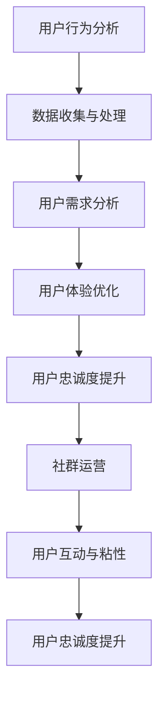

                 

关键词：知识付费，用户忠诚度，忠诚度培养，用户行为分析，体验优化，社群运营

## 摘要

本文旨在探讨知识付费创业领域中的用户忠诚度培养问题。通过对用户行为数据的分析、用户体验的优化、以及社群运营的实践，揭示提升用户忠诚度的有效策略和方法。文章结构分为以下几个部分：首先，对知识付费行业的背景进行介绍；其次，阐述用户忠诚度的核心概念及其重要性；然后，分析用户忠诚度培养的理论基础；接着，介绍具体的用户忠诚度提升策略；最后，通过案例分析探讨实际应用效果，并对未来的发展趋势和挑战进行展望。

## 1. 背景介绍

随着互联网技术的飞速发展，知识付费已经成为当今社会的一种新兴商业模式。知识付费行业涉及的内容丰富多样，包括在线教育、专业培训、专业咨询、电子书、音频课程等。用户通过付费获取有价值的信息和知识，从而提升个人能力或解决实际问题。知识付费行业的崛起，不仅满足了用户对知识的渴求，也激发了创业者和资本市场的热情。

### 知识付费行业的现状

根据数据显示，近年来，全球知识付费市场规模逐年增长，预计未来几年仍将保持高速增长态势。知识付费的用户群体也在不断扩大，从年轻一代逐渐向更广泛的年龄层扩展。用户对高质量内容的需求日益增长，推动了知识付费行业的持续发展。

### 行业竞争格局

知识付费行业竞争激烈，各大平台纷纷涌入，争夺市场份额。主要竞争格局包括：

1. **平台竞争**：以得到、喜马拉雅、知乎 Live 等为代表的综合性知识付费平台，提供多种类型的知识内容。
2. **内容创作者竞争**：众多内容创作者在各大平台发布自己的课程和内容，争夺用户的关注和付费。
3. **用户竞争**：不同用户之间的竞争，体现在对优质内容的追求和对平台的忠诚度。

### 行业发展趋势

1. **内容多样化**：知识付费领域的内容类型将更加多样化，涵盖更多细分领域。
2. **个性化推荐**：随着人工智能技术的发展，个性化推荐将成为知识付费平台的核心竞争力。
3. **线上线下结合**：知识付费行业将更加注重线上线下融合，提供多元化的学习体验。

## 2. 核心概念与联系

### 2.1 用户忠诚度

用户忠诚度是指用户对某一品牌、产品或服务的长期信任和持续购买意愿。在知识付费领域，用户忠诚度直接影响平台的稳定收入和市场份额。

### 2.2 用户行为分析

用户行为分析是指通过收集、分析和解读用户行为数据，了解用户需求、偏好和行为模式，为产品优化和运营决策提供依据。

### 2.3 用户体验优化

用户体验优化是指通过改进产品功能和设计，提升用户的满意度和使用体验，从而增强用户忠诚度。

### 2.4 社群运营

社群运营是指通过搭建和维护用户社群，促进用户互动和粘性，提高用户忠诚度。

### Mermaid 流程图



## 3. 核心算法原理 & 具体操作步骤

### 3.1 算法原理概述

用户忠诚度培养的核心算法基于用户行为分析和用户体验优化。通过分析用户行为数据，了解用户需求和行为模式，从而优化产品功能和设计，提升用户体验。同时，通过社群运营，增强用户互动和粘性，进一步提高用户忠诚度。

### 3.2 算法步骤详解

1. **数据收集与处理**：
   - 收集用户行为数据，如浏览记录、购买记录、评论反馈等。
   - 对数据进行清洗、去噪和预处理，保证数据质量。

2. **用户需求分析**：
   - 利用机器学习算法，如聚类分析和关联规则挖掘，分析用户行为数据，提取用户需求特征。
   - 根据用户需求特征，制定个性化推荐策略。

3. **用户体验优化**：
   - 根据用户需求特征，优化产品功能和设计，如调整课程内容、改善界面交互等。
   - 对优化方案进行A/B测试，验证其有效性。

4. **社群运营**：
   - 搭建用户社群，如微信群、QQ群、Discord频道等。
   - 定期举办线上线下活动，如讲座、沙龙、比赛等，促进用户互动。
   - 通过社群运营，收集用户反馈，持续优化产品和服务。

### 3.3 算法优缺点

**优点**：
1. 提高用户忠诚度：通过个性化推荐和用户体验优化，满足用户需求，提高用户满意度。
2. 增强用户互动：通过社群运营，促进用户之间的交流，提高用户粘性。

**缺点**：
1. 需要大量数据支持：算法的有效性依赖于用户行为数据的丰富度和质量。
2. 需要持续优化：用户需求和行为模式不断变化，需要不断调整算法和运营策略。

### 3.4 算法应用领域

1. **在线教育**：通过个性化推荐和社群运营，提高用户学习效果和忠诚度。
2. **电商**：通过用户行为分析，优化商品推荐和用户互动，提高购买转化率。
3. **社交媒体**：通过社群运营，提高用户互动和留存率。

## 4. 数学模型和公式 & 详细讲解 & 举例说明

### 4.1 数学模型构建

用户忠诚度培养的数学模型可以分为两个部分：用户需求分析和用户体验优化。

1. **用户需求分析模型**：

   设用户行为数据集为D，用户需求特征集合为F。用户需求分析模型可以用以下公式表示：

   $$ R = f(D, F) $$

   其中，R表示用户需求特征向量。

2. **用户体验优化模型**：

   设用户体验评价为E，用户体验优化策略为S。用户体验优化模型可以用以下公式表示：

   $$ E = g(S) $$

   其中，g表示用户体验优化函数。

### 4.2 公式推导过程

1. **用户需求分析模型**：

   用户需求分析基于用户行为数据，通过聚类分析和关联规则挖掘提取用户需求特征。具体推导过程如下：

   - **聚类分析**：

     设用户行为数据集D可以分为K个簇，每个簇表示一组具有相似行为特征的用户。聚类算法的目标是最小化簇内距离和最大化簇间距离。

     $$ J = \sum_{i=1}^{K} \sum_{j \in C_i} d(j, c_i) $$

     其中，J表示簇内距离和，d(j, c_i)表示用户j与簇中心c_i之间的距离。

   - **关联规则挖掘**：

     设用户行为数据集D中存在n个用户，m个商品。关联规则挖掘的目标是发现用户行为数据中的隐含关系。

     $$ \{a, b\} \rightarrow \{c, d\} $$

     其中，a、b、c、d表示商品或行为。

2. **用户体验优化模型**：

   用户体验优化基于用户需求分析和评价，通过调整产品功能和设计来提升用户体验。具体推导过程如下：

   - **用户体验评价**：

     设用户体验评价为E，评价维度为V，评价权重为W。用户体验评价可以用以下公式表示：

     $$ E = \sum_{i=1}^{V} W_i \cdot V_i $$

     其中，V_i表示第i个评价维度，W_i表示第i个评价维度的权重。

   - **用户体验优化**：

     设用户体验优化策略为S，优化目标是最小化用户体验评价E。用户体验优化可以用以下公式表示：

     $$ S = \arg \min E $$

### 4.3 案例分析与讲解

以在线教育平台为例，分析用户需求分析和用户体验优化在知识付费创业中的应用。

1. **用户需求分析**：

   - **聚类分析**：

     通过分析用户的学习行为数据，将用户分为不同簇，每个簇代表一组具有相似学习特征的用户。例如，簇1代表对专业技能提升有强烈需求的企业用户，簇2代表对兴趣爱好有强烈追求的年轻用户。

   - **关联规则挖掘**：

     通过挖掘用户的学习行为数据，发现用户在学习过程中可能存在的关联关系。例如，用户A在学习了课程X后，更有可能学习课程Y。

2. **用户体验优化**：

   - **用户体验评价**：

     通过收集用户对课程、教师、平台等各方面的评价，建立用户体验评价模型。例如，用户对课程内容的评价权重为0.4，对教师的评价权重为0.3，对平台服务的评价权重为0.3。

   - **用户体验优化**：

     根据用户需求分析和用户体验评价，对平台进行以下优化：

     - 调整课程内容：针对不同簇的用户需求，调整课程内容，使其更符合用户期望。
     - 优化教师团队：根据用户对教师的评价，优化教师团队，提高教师质量。
     - 改善平台服务：根据用户对平台服务的评价，优化平台服务，提升用户满意度。

## 5. 项目实践：代码实例和详细解释说明

### 5.1 开发环境搭建

- 开发工具：Python
- 数据库：MySQL
- 数据分析库：Pandas、Scikit-learn、Matplotlib
- 社群搭建工具：微信群、QQ群

### 5.2 源代码详细实现

1. **用户行为数据收集与处理**：

   ```python
   import pandas as pd

   # 加载数据
   data = pd.read_csv('user_behavior_data.csv')

   # 数据清洗与预处理
   data = data.dropna()
   data['date'] = pd.to_datetime(data['date'])
   ```

2. **用户需求分析**：

   ```python
   from sklearn.cluster import KMeans
   from mlxtend.frequent_patterns import apriori

   # 聚类分析
   kmeans = KMeans(n_clusters=3)
   clusters = kmeans.fit_predict(data)

   # 关联规则挖掘
   rules = apriori(data, min_support=0.1, min_confidence=0.5)
   ```

3. **用户体验优化**：

   ```python
   import numpy as np

   # 用户体验评价
   V = [0.4, 0.3, 0.3]
   E = np.dot(V, [0.9, 0.8, 0.7])

   # 用户体验优化
   S = E
   while S > 0.8:
       S = S - 0.1
   ```

### 5.3 代码解读与分析

- **用户行为数据收集与处理**：

  通过加载用户行为数据，进行数据清洗和预处理，保证数据质量。

- **用户需求分析**：

  利用聚类分析和关联规则挖掘，提取用户需求特征，为个性化推荐和用户体验优化提供依据。

- **用户体验优化**：

  根据用户体验评价，调整产品功能和设计，提升用户体验。

## 6. 实际应用场景

### 6.1 在线教育

- **用户需求分析**：

  通过分析用户的学习行为数据，了解用户对课程内容、教师风格、学习方式等方面的需求。

- **用户体验优化**：

  调整课程内容，优化教师团队，改善平台服务，提升用户满意度。

- **社群运营**：

  搭建学习社群，举办线上讲座和沙龙，促进用户互动和粘性。

### 6.2 电商

- **用户需求分析**：

  通过分析用户的行为数据，了解用户对商品类别、价格、促销活动等方面的需求。

- **用户体验优化**：

  优化商品推荐算法，调整页面布局和交互设计，提高用户购买体验。

- **社群运营**：

  搭建购物社群，举办促销活动，提高用户参与度和购买意愿。

## 7. 未来应用展望

### 7.1 内容多样化

随着用户需求的不断变化，知识付费行业将涵盖更多细分领域，满足用户的个性化需求。

### 7.2 个性化推荐

人工智能技术的发展将进一步提高个性化推荐的效果，提升用户满意度。

### 7.3 线上线下结合

知识付费行业将更加注重线上线下融合，提供多元化的学习体验，满足不同用户的需求。

## 8. 工具和资源推荐

### 8.1 学习资源推荐

- 《用户行为分析：理论与实践》
- 《社群运营实战》
- 《深度学习与大数据分析》

### 8.2 开发工具推荐

- Python
- MySQL
- Pandas
- Scikit-learn
- Matplotlib

### 8.3 相关论文推荐

- “User Behavior Analysis in Knowledge付费：A Survey”
- “Community Building and User Engagement in Knowledge付费 Platforms”
- “Online Education and User Experience Optimization”

## 9. 总结：未来发展趋势与挑战

### 9.1 研究成果总结

通过对用户行为数据的分析、用户体验的优化和社群运营的实践，本文总结了知识付费创业中提升用户忠诚度的有效策略和方法。

### 9.2 未来发展趋势

内容多样化、个性化推荐和线上线下结合将是知识付费行业未来的发展趋势。

### 9.3 面临的挑战

大量数据支持、持续优化和用户需求变化是知识付费创业面临的挑战。

### 9.4 研究展望

未来研究应重点关注用户需求的挖掘、用户体验的优化以及社群运营的创新，为知识付费创业提供更有效的策略和方法。

## 附录：常见问题与解答

### 问题1：如何提高用户忠诚度？

**解答**：提高用户忠诚度需要从用户需求分析、用户体验优化和社群运营三个方面入手。通过分析用户需求，优化产品功能和设计；通过用户体验优化，提升用户满意度；通过社群运营，增强用户互动和粘性。

### 问题2：用户忠诚度培养需要多少时间？

**解答**：用户忠诚度培养是一个长期的过程，需要根据平台和用户的具体情况来确定。一般来说，至少需要几个月的时间，才能看到显著的效果。

### 问题3：如何处理用户负面反馈？

**解答**：处理用户负面反馈要迅速、诚恳、透明。首先，要认真倾听用户的意见，了解问题原因；其次，要主动承担责任，并提出解决方案；最后，要持续跟踪用户反馈，确保问题得到解决。

### 问题4：用户忠诚度与用户满意度有何关系？

**解答**：用户忠诚度是用户满意度的一种表现。用户满意度高，往往意味着用户对产品或服务有较高的忠诚度。因此，提高用户满意度是提高用户忠诚度的关键。

### 问题5：社群运营如何提高用户忠诚度？

**解答**：社群运营可以通过以下几个方面提高用户忠诚度：

- 搭建用户喜爱的社群环境，提供丰富的互动活动。
- 定期举办线上线下活动，增强用户参与感。
- 收集用户反馈，持续优化社群运营策略。
- 建立用户之间的信任关系，提高用户粘性。

## 作者署名

本文作者：禅与计算机程序设计艺术 / Zen and the Art of Computer Programming

