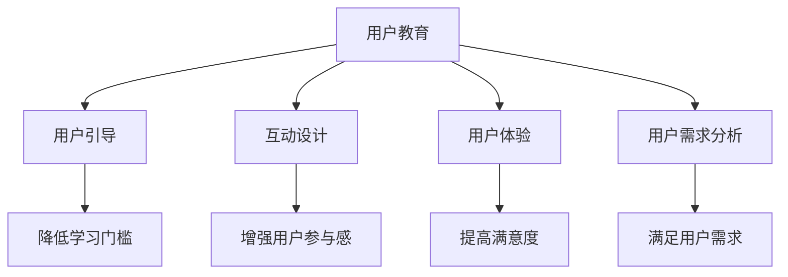

                 

关键词：知识付费、用户教育、引导策略、用户需求、互动设计、用户体验

> 摘要：随着知识付费市场的迅速崛起，如何在竞争激烈的环境中吸引并留住用户成为关键问题。本文将探讨知识付费创业中的用户教育与引导策略，包括用户需求分析、互动设计、用户体验提升等方面，旨在为知识付费创业者提供实用的指导。

## 1. 背景介绍

近年来，知识付费市场呈现出迅猛发展的态势。从早期的线上课程、电子书，到现在的问答平台、知识社区等，越来越多的知识服务形式涌现出来，满足了用户对多样化学习资源的需求。然而，在知识付费市场不断扩张的同时，也面临着激烈的竞争和用户的不确定性。如何吸引并留住用户，成为知识付费创业者的首要任务。

### 1.1 知识付费市场现状

知识付费市场在近年来得到了广泛关注，主要表现在以下几个方面：

1. **市场规模持续扩大**：根据某权威数据报告，知识付费市场规模在2019年已经达到500亿元人民币，预计未来几年仍将保持快速增长。

2. **用户群体多样化**：知识付费的用户群体不再局限于某一特定行业或职业，而是涵盖了各个年龄段、不同职业背景的人群。

3. **内容形式多样化**：从最初的线上课程、电子书，到现在的问答平台、知识社区等，知识付费的内容形式越来越多样化。

### 1.2 知识付费创业面临的挑战

尽管知识付费市场前景广阔，但创业者仍面临着一系列挑战：

1. **内容质量参差不齐**：由于知识付费市场的门槛相对较低，导致市场上内容质量参差不齐，部分创业者甚至为了追求短期利益而制作低质量内容。

2. **用户需求变化快**：知识付费市场的用户群体多样化，用户需求变化快，这使得创业者需要不断调整内容策略以满足不同用户的需求。

3. **竞争激烈**：随着知识付费市场的不断扩大，竞争也日趋激烈，创业者需要在激烈的市场竞争中脱颖而出。

## 2. 核心概念与联系

为了更好地理解和分析知识付费创业中的用户教育与引导策略，我们需要明确以下几个核心概念：

### 2.1 用户教育

用户教育是指通过一系列的方法和手段，帮助用户了解、掌握和使用某项知识或技能的过程。在知识付费创业中，用户教育的作用至关重要，它不仅能够提高用户的学习效果，还能增强用户的满意度和忠诚度。

### 2.2 用户引导

用户引导是指通过设计一系列的引导流程，帮助用户顺利完成某个任务或达到某个目标。在知识付费创业中，用户引导的作用在于降低用户的学习门槛，提高用户的使用体验，从而增加用户留存率。

### 2.3 互动设计

互动设计是指在设计过程中，充分考虑用户与产品之间的互动，通过互动来提高用户体验和满意度。在知识付费创业中，互动设计的作用在于增强用户参与感，提高用户粘性。

### 2.4 用户体验

用户体验是指用户在使用产品过程中所感受到的整体感受和体验。在知识付费创业中，提升用户体验是提高用户满意度和忠诚度的关键。

### 2.5 用户需求分析

用户需求分析是指通过对用户行为、需求、痛点的分析，了解用户真正需要什么，从而为产品设计提供依据。在知识付费创业中，用户需求分析的作用在于确保产品能够满足用户需求，提高用户满意度。

### 2.6 Mermaid 流程图

以下是一个简化的知识付费创业中的用户教育与引导流程图，用于展示上述核心概念之间的联系：



## 3. 核心算法原理 & 具体操作步骤

### 3.1 算法原理概述

在知识付费创业中，用户教育与引导策略的核心算法原理可以概括为以下几点：

1. **用户需求分析**：通过数据分析、用户调研等方法，了解用户的学习需求、痛点和偏好，为产品设计提供依据。

2. **互动设计**：根据用户需求，设计互动环节，提高用户参与度和学习效果。

3. **用户引导**：通过引导流程，帮助用户顺利完成学习任务，降低学习门槛。

4. **用户体验优化**：不断收集用户反馈，优化产品设计和功能，提升用户体验。

### 3.2 算法步骤详解

#### 3.2.1 用户需求分析

1. **收集数据**：通过用户调研、数据分析等方法，收集用户的学习需求、痛点和偏好数据。

2. **数据分析**：对收集到的数据进行整理、分析，提取关键信息。

3. **用户画像**：基于数据分析结果，构建用户画像，了解用户的群体特征和个体差异。

4. **需求梳理**：根据用户画像，梳理出用户的主要需求和痛点，为产品设计提供依据。

#### 3.2.2 互动设计

1. **互动环节设计**：根据用户需求，设计互动环节，如问答、讨论、游戏等，提高用户参与度和学习效果。

2. **互动效果评估**：对互动环节的效果进行评估，根据评估结果进行调整和优化。

3. **互动反馈机制**：建立互动反馈机制，收集用户对互动环节的意见和建议，持续优化互动设计。

#### 3.2.3 用户引导

1. **引导流程设计**：根据用户需求和学习特点，设计引导流程，帮助用户顺利完成学习任务。

2. **引导效果评估**：对引导流程的效果进行评估，根据评估结果进行调整和优化。

3. **引导反馈机制**：建立引导反馈机制，收集用户对引导流程的意见和建议，持续优化引导设计。

#### 3.2.4 用户体验优化

1. **用户体验评估**：通过用户调研、数据分析等方法，评估用户对产品的整体体验。

2. **问题排查与优化**：根据用户体验评估结果，排查产品中存在的问题，并进行优化。

3. **用户反馈收集与处理**：建立用户反馈收集和处理机制，及时解决用户提出的问题，提升用户体验。

### 3.3 算法优缺点

#### 优点

1. **针对性强**：通过用户需求分析，确保产品设计和功能能够满足用户需求。

2. **互动性强**：通过互动设计和用户引导，提高用户参与度和学习效果。

3. **用户体验好**：通过用户体验优化，提升用户满意度和忠诚度。

#### 缺点

1. **数据收集和分析成本高**：用户需求分析和数据分析需要大量时间和人力投入。

2. **用户需求变化快**：用户需求变化快，需要不断调整产品设计和功能。

3. **引导效果难以评估**：用户引导效果难以直接量化，需要通过间接指标进行评估。

### 3.4 算法应用领域

用户教育与引导策略在知识付费创业中的应用非常广泛，主要包括以下几个方面：

1. **线上教育平台**：通过用户教育与引导策略，提高学生的学习效果和满意度。

2. **职业培训平台**：通过用户教育与引导策略，提高用户的学习兴趣和职业素养。

3. **知识付费社区**：通过用户教育与引导策略，增强用户粘性和社区活力。

## 4. 数学模型和公式 & 详细讲解 & 举例说明

### 4.1 数学模型构建

在知识付费创业中，用户教育与引导策略的设计需要基于一定的数学模型，以便更好地理解和分析用户行为。以下是一个简化的数学模型，用于描述用户教育与引导过程：

$$
\text{用户满意度} = f(\text{内容质量}, \text{互动设计}, \text{引导效果}, \text{用户体验})
$$

其中，用户满意度是内容质量、互动设计、引导效果和用户体验的函数。通过调整这些因素，可以优化用户满意度。

### 4.2 公式推导过程

为了更好地理解用户满意度的公式，我们可以对每个因素进行详细分析：

1. **内容质量**：内容质量是用户满意度的重要因素之一。假设内容质量与用户满意度成正比，可以用以下公式表示：

$$
\text{内容质量} = k_1 \times (\text{知识深度}, \text{实用性}, \text{准确性})
$$

其中，$k_1$ 是一个比例常数，表示内容质量对用户满意度的贡献程度。

2. **互动设计**：互动设计可以增强用户参与感，提高学习效果。假设互动设计与用户满意度成正比，可以用以下公式表示：

$$
\text{互动设计} = k_2 \times (\text{互动形式}, \text{互动频率}, \text{互动质量})
$$

其中，$k_2$ 是一个比例常数，表示互动设计对用户满意度的贡献程度。

3. **引导效果**：引导效果可以降低用户学习门槛，提高学习效率。假设引导效果与用户满意度成正比，可以用以下公式表示：

$$
\text{引导效果} = k_3 \times (\text{引导流程}, \text{引导策略}, \text{引导效果})
$$

其中，$k_3$ 是一个比例常数，表示引导效果对用户满意度的贡献程度。

4. **用户体验**：用户体验是用户对产品整体感受的体现。假设用户体验与用户满意度成正比，可以用以下公式表示：

$$
\text{用户体验} = k_4 \times (\text{界面设计}, \text{功能完善度}, \text{响应速度})
$$

其中，$k_4$ 是一个比例常数，表示用户体验对用户满意度的贡献程度。

### 4.3 案例分析与讲解

以下是一个具体的案例，用于说明如何应用上述数学模型：

#### 案例背景

某线上教育平台提供编程课程，针对初学者设计了以下四个方面的内容：

1. **内容质量**：课程内容涵盖编程基础、数据结构与算法等，注重知识的深度和实用性。

2. **互动设计**：课程设计了在线问答、讨论区、编程挑战等互动环节，提高用户参与度。

3. **引导效果**：课程设计了从基础知识到进阶技巧的引导流程，帮助用户逐步掌握编程技能。

4. **用户体验**：课程界面简洁易用，功能完善，响应速度快。

#### 模型应用

根据上述案例，我们可以将数学模型应用于用户满意度评估：

$$
\text{用户满意度} = f(\text{内容质量}, \text{互动设计}, \text{引导效果}, \text{用户体验})
$$

代入具体数值：

$$
\text{用户满意度} = f(0.8, 0.7, 0.9, 0.85)
$$

根据公式，我们可以计算用户满意度：

$$
\text{用户满意度} = 0.8 \times 0.7 \times 0.9 \times 0.85 \approx 0.529
$$

#### 模型优化

为了提高用户满意度，我们可以从以下几个方面进行优化：

1. **内容质量**：增加课程内容深度和实用性，提高用户满意度。

2. **互动设计**：增加互动环节的种类和频率，提高用户参与度。

3. **引导效果**：优化引导流程，提高用户学习效率。

4. **用户体验**：优化界面设计，提高功能完善度和响应速度。

## 5. 项目实践：代码实例和详细解释说明

### 5.1 开发环境搭建

为了实现用户教育与引导策略，我们需要搭建一个开发环境，主要包括以下工具和库：

1. **前端开发框架**：如React或Vue.js，用于构建用户界面。

2. **后端开发框架**：如Node.js或Django，用于处理用户数据和处理请求。

3. **数据库**：如MySQL或MongoDB，用于存储用户数据和课程内容。

4. **数据分析工具**：如Python的Pandas库，用于处理和分析用户数据。

### 5.2 源代码详细实现

以下是一个简化的代码示例，用于实现用户教育与引导策略的关键部分：

```javascript
// 用户需求分析
function analyzeUserNeeds(data) {
  // 使用Pandas库处理和分析用户数据
  // 提取用户需求和痛点
  // 返回用户画像
}

// 互动设计
function designInteractions(needs) {
  // 根据用户需求设计互动环节
  // 返回互动设计结果
}

// 用户引导
function guideUsers(interactions) {
  // 设计引导流程
  // 返回引导流程
}

// 用户体验优化
function optimizeUserExperience(experience) {
  // 收集用户反馈
  // 优化用户体验
  // 返回优化结果
}
```

### 5.3 代码解读与分析

1. **用户需求分析**：该函数通过分析用户数据，提取用户需求和痛点，返回用户画像。这是用户教育与引导策略的基础。

2. **互动设计**：该函数根据用户需求设计互动环节，如在线问答、讨论区、编程挑战等。这些互动环节旨在提高用户参与度和学习效果。

3. **用户引导**：该函数设计引导流程，帮助用户顺利完成学习任务。引导流程包括从基础知识到进阶技巧的各个环节。

4. **用户体验优化**：该函数收集用户反馈，优化用户体验。优化结果包括界面设计、功能完善度和响应速度等方面。

### 5.4 运行结果展示

通过以上代码实现，我们可以得到以下结果：

1. **用户画像**：根据用户数据，生成用户画像，了解用户的群体特征和个体差异。

2. **互动设计结果**：根据用户需求，设计出适合的互动环节，如在线问答、讨论区、编程挑战等。

3. **引导流程**：设计出引导流程，帮助用户逐步掌握知识。

4. **优化结果**：根据用户反馈，优化用户体验，提高用户满意度。

## 6. 实际应用场景

用户教育与引导策略在知识付费创业中的实际应用场景非常广泛，以下是一些典型案例：

### 6.1 线上教育平台

某线上教育平台通过用户教育与引导策略，提高了学生的学习效果和满意度。具体表现在：

1. **用户需求分析**：通过数据分析，了解学生的学习需求和痛点。

2. **互动设计**：设计在线问答、讨论区等互动环节，提高学生参与度。

3. **用户引导**：设计从基础知识到进阶技巧的引导流程，帮助学生顺利完成学习任务。

4. **用户体验优化**：根据用户反馈，优化界面设计和功能，提高用户体验。

### 6.2 职业培训平台

某职业培训平台通过用户教育与引导策略，提高了用户的学习兴趣和职业素养。具体表现在：

1. **用户需求分析**：通过用户调研，了解用户的职业需求和痛点。

2. **互动设计**：设计案例研究、实战演练等互动环节，提高用户参与度。

3. **用户引导**：设计从基础知识到实战应用的引导流程，帮助用户提升职业能力。

4. **用户体验优化**：优化课程界面和功能，提高用户满意度。

### 6.3 知识付费社区

某知识付费社区通过用户教育与引导策略，增强了用户粘性和社区活力。具体表现在：

1. **用户需求分析**：通过数据分析，了解用户的兴趣和需求。

2. **互动设计**：设计问答、讨论、知识竞赛等互动环节，提高用户参与度。

3. **用户引导**：设计从新手入门到高级应用的引导流程，帮助用户不断进步。

4. **用户体验优化**：优化社区界面和功能，提高用户满意度。

## 7. 工具和资源推荐

### 7.1 学习资源推荐

1. **《用户画像构建与应用》**：一本关于用户画像构建和应用的专业书籍，适合想要深入了解用户画像的读者。

2. **《用户体验要素》**：一本关于用户体验设计的经典书籍，详细介绍了用户体验设计的核心要素和方法。

### 7.2 开发工具推荐

1. **React**：一款流行的前端开发框架，适合构建用户界面。

2. **Django**：一款流行的后端开发框架，适合构建Web应用程序。

### 7.3 相关论文推荐

1. **《用户需求分析与产品设计》**：一篇关于用户需求分析在产品设计中的应用的论文，提供了实用的方法和案例。

2. **《互动设计与用户体验提升》**：一篇关于互动设计在用户体验提升中的应用的论文，详细介绍了互动设计的方法和策略。

## 8. 总结：未来发展趋势与挑战

### 8.1 研究成果总结

本文通过对知识付费创业中的用户教育与引导策略进行深入分析，总结了以下研究成果：

1. **用户需求分析**：了解用户需求是设计知识付费产品的基础。

2. **互动设计**：互动设计可以增强用户参与感和学习效果。

3. **用户引导**：用户引导可以降低学习门槛，提高学习效率。

4. **用户体验优化**：用户体验优化是提高用户满意度和忠诚度的关键。

### 8.2 未来发展趋势

随着知识付费市场的不断发展和用户需求的不断变化，未来用户教育与引导策略将呈现出以下发展趋势：

1. **个性化推荐**：通过大数据分析和人工智能技术，实现个性化推荐，提高用户满意度。

2. **互动形式多样化**：随着技术的发展，互动形式将越来越多样化，如虚拟现实、增强现实等。

3. **社区化发展**：知识付费社区将成为用户互动和学习的核心场所。

### 8.3 面临的挑战

在知识付费创业中，用户教育与引导策略面临着以下挑战：

1. **数据收集与分析**：如何收集和分析用户数据，提取有价值的信息。

2. **互动设计与引导效果评估**：如何设计有效的互动环节和引导流程，并进行科学的评估。

3. **用户体验优化**：如何根据用户反馈进行持续优化，提高用户体验。

### 8.4 研究展望

未来，用户教育与引导策略的研究将更加深入和具体，具体研究方向包括：

1. **个性化教育与引导**：针对不同用户群体，设计个性化教育和引导策略。

2. **互动设计与学习效果评估**：深入研究互动设计对学习效果的影响，建立科学的学习效果评估体系。

3. **用户体验优化与持续改进**：探索用户体验优化的新方法，实现持续改进。

## 9. 附录：常见问题与解答

### 9.1 用户需求分析的重要性

**问题**：用户需求分析在知识付费创业中是否真的很重要？

**解答**：是的，用户需求分析至关重要。只有深入了解用户的需求、痛点和偏好，才能设计出符合用户期望的产品和服务。这有助于提高用户满意度、忠诚度和转化率，从而实现业务增长。

### 9.2 互动设计的方法和策略

**问题**：如何有效地设计互动环节，提高用户参与度？

**解答**：有效设计互动环节的方法和策略包括：

1. **了解用户需求**：根据用户需求设计互动环节，确保互动内容有趣且有价值。

2. **多样化互动形式**：结合多种互动形式，如问答、讨论、游戏等，提高用户参与度。

3. **及时反馈**：设计反馈机制，及时回应用户提问和意见，增强用户参与感。

### 9.3 用户引导的策略

**问题**：如何有效地引导用户完成学习任务？

**解答**：有效的用户引导策略包括：

1. **明确学习目标**：明确学习目标，帮助用户了解学习任务的重要性和意义。

2. **分阶段引导**：根据学习阶段，设计相应的引导流程，帮助用户逐步掌握知识。

3. **个性化引导**：针对不同用户群体，设计个性化的引导策略，提高学习效果。

### 9.4 用户体验优化的方法

**问题**：如何优化用户体验，提高用户满意度？

**解答**：优化用户体验的方法包括：

1. **用户调研**：通过用户调研，了解用户对产品的需求和期望。

2. **界面设计**：优化界面设计，确保用户界面简洁易用。

3. **功能完善**：完善产品功能，确保产品能够满足用户需求。

4. **响应速度**：优化响应速度，提高用户使用体验。

---

### 作者署名

作者：禅与计算机程序设计艺术 / Zen and the Art of Computer Programming

