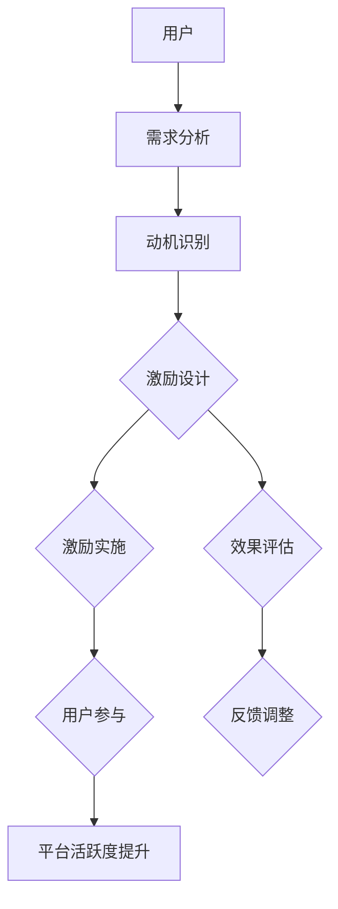

                 

### 背景介绍

知识付费作为一种新兴的商业模式，正逐渐成为人们获取高质量信息的重要途径。在这个背景下，创业公司如何在竞争激烈的市场中吸引并留住用户，成为了一个亟待解决的问题。用户激励机制的设计，作为知识付费创业的关键环节，直接影响着用户留存率和平台活跃度。

知识付费创业面临着多重挑战。首先，市场竞争日益激烈，各大平台纷纷涌入，使得内容同质化严重。其次，用户对个性化体验和高质量内容的需求不断提升，要求平台提供更具吸引力的服务和内容。此外，用户的注意力分散，使得吸引用户参与和保持活跃变得更加困难。

在这种背景下，用户激励机制的设计显得尤为重要。通过科学合理的设计，平台可以激发用户的兴趣和参与度，从而提高用户留存率和平台活跃度。然而，激励机制的设计并非易事，需要充分考虑用户的心理和行为特征，以及平台的运营目标和资源限制。

本文将围绕知识付费创业中的用户激励机制设计展开讨论，首先介绍用户激励机制的核心理念，然后分析其设计原则，最后通过实际案例和数学模型进行深入探讨。希望通过本文的阐述，为知识付费创业者提供有益的启示和指导。

### 2. 核心概念与联系

#### 用户激励机制的核心理念

用户激励机制是一种通过提供奖励或优惠等手段，激发用户参与和活跃度，进而提升平台价值的行为设计。其核心理念在于通过满足用户的需求和欲望，建立用户与平台之间的正向互动关系。

首先，用户激励机制需要明确用户的哪些需求能够通过激励得到满足。这些需求可以是知识获取、社交互动、成就认可等。例如，知识付费平台可以通过提供独家内容、限时优惠、积分奖励等方式，满足用户对高质量知识和个性化服务的需求。

其次，激励机制的设计需要考虑用户的参与动机和行为模式。不同用户在参与平台活动时，可能受到多种动机的驱动，如求知欲、社交需求、自我提升等。平台需要根据这些动机，设计相应的激励机制，以引导用户积极参与平台活动。

最后，用户激励机制的有效性评估是确保其成功实施的关键。平台需要通过数据分析和用户反馈，评估激励机制的吸引力和效果，及时进行调整和优化，以保持其持续性和有效性。

#### 用户激励机制的设计原则

在构建用户激励机制时，需要遵循以下几个关键原则，以确保其能够有效提升用户参与度和平台活跃度：

**1. 个性化**：用户激励机制的个性化设计能够更好地满足不同用户的需求和偏好。例如，根据用户的浏览历史和兴趣标签，推荐个性化内容或优惠活动，提高用户的满意度和参与度。

**2. 公平性**：公平性是用户激励机制设计的重要原则之一。平台需要确保激励机制对所有用户都是公平的，避免出现歧视性或偏向性，从而降低用户对平台的信任度和忠诚度。

**3. 可持续性**：激励机制需要具有可持续性，避免过度消耗平台资源或导致用户疲劳。例如，通过设置合理的奖励频率和额度，保持用户的长期参与热情。

**4. 可量化**：激励机制的设计应该具有可量化的指标，以便平台能够根据数据评估激励效果，进行优化调整。例如，通过分析用户活跃度、留存率等指标，评估激励措施的有效性。

**5. 与平台目标一致**：激励机制的设计需要与平台的核心运营目标保持一致。例如，如果平台的目标是增加用户留存，那么激励机制应该侧重于提高用户的参与度和满意度。

#### 用户激励机制架构的 Mermaid 流程图

为了更好地理解用户激励机制的设计架构，我们可以使用 Mermaid 图来展示其核心流程和组件。以下是一个简单的 Mermaid 流程图，描述了用户激励机制的基本架构：



在这个流程图中：

- **A 用户**：代表平台的用户群体。
- **B 需求分析**：通过数据分析了解用户的需求和偏好。
- **C 动机识别**：分析用户的参与动机，确定激励的焦点。
- **D 激励设计**：根据需求分析和动机识别结果，设计合适的激励机制。
- **E 激励实施**：将激励机制应用到平台上，吸引用户参与。
- **F 效果评估**：通过数据分析评估激励机制的效果。
- **G 用户参与**：用户在激励措施的引导下参与平台活动。
- **H 反馈调整**：根据效果评估结果，对激励机制进行调整。
- **I 平台活跃度提升**：最终实现平台活跃度的提升。

通过这个流程图，我们可以清晰地看到用户激励机制的设计、实施和调整过程，有助于理解其整体架构和运行机制。

### 3. 核心算法原理 & 具体操作步骤

#### 3.1 算法原理概述

用户激励机制的核心算法基于需求分析、动机识别和效果评估三个关键步骤。具体来说，算法原理可以概括为以下三个核心环节：

1. **需求分析**：通过数据分析方法，了解用户在平台上的行为和需求。这包括用户浏览历史、内容偏好、互动行为等。通过对这些数据的挖掘，可以识别出用户的主要需求点，为后续的激励设计提供依据。

2. **动机识别**：在了解用户需求的基础上，进一步分析用户的参与动机。这可以通过心理行为分析、问卷调查、用户访谈等方法实现。动机识别的目的是确定用户参与平台活动的关键驱动因素，从而设计出更具吸引力的激励机制。

3. **效果评估**：通过数据分析和用户反馈，评估激励措施的实际效果。这包括用户活跃度、留存率、满意度等关键指标。效果评估的结果用于指导激励机制的调整和优化，以实现最佳效果。

#### 3.2 算法步骤详解

**1. 需求分析步骤**

- **数据收集**：通过平台的后台数据接口，收集用户的行为数据，包括浏览历史、点击率、互动行为等。
- **数据预处理**：对收集到的数据进行清洗、去重和格式转换，确保数据的准确性和一致性。
- **特征提取**：利用机器学习算法，提取与用户需求相关的特征，如内容标签、用户兴趣、行为模式等。
- **需求建模**：使用统计模型或深度学习模型，建立用户需求预测模型，为激励设计提供数据支持。

**2. 动机识别步骤**

- **心理行为分析**：通过心理学和行为学理论，分析用户的参与动机。这可以通过问卷调查、用户访谈等方法实现。
- **动机模型构建**：根据心理行为分析的结果，构建用户动机识别模型。该模型用于预测用户在特定情境下的参与动机。
- **模型训练与优化**：利用历史数据，对动机识别模型进行训练和优化，提高其预测准确性。

**3. 激励设计步骤**

- **需求与动机匹配**：根据需求分析和动机识别的结果，确定激励设计的重点。例如，针对求知欲强的用户，可以设计学习奖励机制；针对社交需求强的用户，可以设计互动奖励机制。
- **激励方案制定**：制定具体的激励方案，包括奖励内容、奖励形式、奖励频率等。激励方案应具有个性化、公平性和可持续性。
- **激励方案测试**：通过小范围测试，评估激励方案的吸引力和效果，并根据反馈进行调整。

**4. 激励实施步骤**

- **激励措施部署**：将激励方案应用到平台上，吸引用户参与。例如，通过推送通知、活动页面、积分系统等方式，引导用户参与。
- **用户引导与教育**：通过引导和教育活动，帮助用户理解激励措施的意义和规则，提高参与度。
- **反馈与调整**：实时收集用户反馈，评估激励效果，并根据反馈进行调整和优化。

**5. 效果评估步骤**

- **指标选择**：选择与激励机制效果相关的关键指标，如用户活跃度、留存率、满意度等。
- **数据分析**：通过数据分析方法，评估激励措施的实际效果。
- **效果反馈**：将评估结果反馈给激励设计团队，指导下一步的优化调整。

#### 3.3 算法优缺点

**优点**

1. **个性化**：算法能够根据用户的需求和动机，设计出个性化的激励措施，提高用户的满意度和参与度。
2. **高效性**：算法利用数据分析方法，快速识别用户需求和动机，提高激励设计的效率和准确性。
3. **可量化**：算法具有可量化的评价指标，便于评估激励措施的效果，实现持续优化。

**缺点**

1. **数据依赖性**：算法的效果高度依赖用户数据的准确性和完整性，数据缺失或错误可能导致激励设计失败。
2. **算法复杂性**：算法涉及多个步骤和模型，实现和优化过程相对复杂，需要专业的技术团队支持。
3. **隐私风险**：用户数据分析和动机识别过程可能涉及用户隐私，需要采取相应的隐私保护措施，确保用户数据的安全。

#### 3.4 算法应用领域

用户激励机制算法在多个领域具有广泛的应用：

1. **知识付费平台**：通过个性化激励措施，提升用户的学习参与度和知识获取效果。
2. **在线教育平台**：通过互动奖励机制，增强学生的学习动力和平台粘性。
3. **社交媒体平台**：通过内容奖励机制，提高用户的内容创作和互动积极性。
4. **电子商务平台**：通过购物奖励机制，提升用户的购物体验和忠诚度。

这些应用领域均体现出用户激励机制算法在提升用户参与度和平台活跃度方面的强大作用。

### 4. 数学模型和公式 & 详细讲解 & 举例说明

#### 4.1 数学模型构建

用户激励机制的设计涉及多个数学模型，用于描述用户行为、激励效果和平台目标。以下是几个核心数学模型：

**1. 用户行为模型**

用户行为模型用于预测用户在平台上的行为，包括浏览、点击、互动等。常见的用户行为模型有马尔可夫链模型、线性回归模型等。以下是一个简单的线性回归模型示例：

$$
y = \beta_0 + \beta_1 x_1 + \beta_2 x_2 + ... + \beta_n x_n
$$

其中，$y$ 表示用户行为得分，$x_1, x_2, ..., x_n$ 表示用户特征，$\beta_0, \beta_1, \beta_2, ..., \beta_n$ 为模型参数。

**2. 激励效果模型**

激励效果模型用于评估激励措施对用户行为的影响。常见的激励效果模型有奖励效应模型、转化率模型等。以下是一个简单的奖励效应模型：

$$
Effect = \alpha_0 + \alpha_1 Reward + \alpha_2 User\ Interest
$$

其中，$Effect$ 表示激励效果，$Reward$ 表示奖励金额，$User\ Interest$ 表示用户兴趣度，$\alpha_0, \alpha_1, \alpha_2$ 为模型参数。

**3. 平台目标模型**

平台目标模型用于描述平台的核心运营目标，如用户留存率、活跃度等。常见的平台目标模型有目标函数模型、优化模型等。以下是一个简单的目标函数模型：

$$
Maximize\ Z = \beta_0 + \beta_1 User\ Activity + \beta_2 User\ Loyalty
$$

其中，$Z$ 表示目标函数得分，$\beta_0, \beta_1, \beta_2$ 为模型参数。

#### 4.2 公式推导过程

**1. 用户行为模型推导**

用户行为模型可以通过观察用户的历史行为数据，利用回归分析方法进行推导。以下是一个简单的推导过程：

- **数据收集**：收集用户在平台上的行为数据，如浏览次数、点击率、互动次数等。
- **特征选择**：选择与用户行为相关的特征，如用户年龄、性别、兴趣标签等。
- **数据预处理**：对收集到的数据进行清洗、归一化等处理，确保数据的一致性和准确性。
- **回归分析**：利用回归分析方法，建立用户行为预测模型。具体步骤如下：

  $$ 
  y = \beta_0 + \beta_1 x_1 + \beta_2 x_2 + ... + \beta_n x_n
  $$

  其中，$y$ 为用户行为得分，$x_1, x_2, ..., x_n$ 为用户特征，$\beta_0, \beta_1, \beta_2, ..., \beta_n$ 为模型参数。

  - **参数估计**：通过最小二乘法或其他优化算法，估计模型参数 $\beta_0, \beta_1, \beta_2, ..., \beta_n$。
  - **模型评估**：通过交叉验证等方法，评估模型的预测准确性和泛化能力。

**2. 激励效果模型推导**

激励效果模型可以通过实验方法，利用用户行为数据进行分析。以下是一个简单的推导过程：

- **实验设计**：设计不同的激励方案，如奖励金额、奖励形式等，并随机分配给用户。
- **数据收集**：收集实验期间的用户行为数据，如浏览次数、点击率、互动次数等。
- **数据分析**：利用回归分析方法，建立激励效果预测模型。具体步骤如下：

  $$
  Effect = \alpha_0 + \alpha_1 Reward + \alpha_2 User\ Interest
  $$

  其中，$Effect$ 为激励效果，$Reward$ 为奖励金额，$User\ Interest$ 为用户兴趣度，$\alpha_0, \alpha_1, \alpha_2$ 为模型参数。

  - **参数估计**：通过最小二乘法或其他优化算法，估计模型参数 $\alpha_0, \alpha_1, \alpha_2$。
  - **模型评估**：通过交叉验证等方法，评估模型的预测准确性和泛化能力。

#### 4.3 案例分析与讲解

**1. 案例背景**

假设一个知识付费平台希望通过用户激励机制，提升用户的参与度和活跃度。平台收集了以下数据：

- 用户行为数据：用户浏览历史、点击率、互动次数等。
- 激励数据：用户获得的奖励金额、奖励形式等。
- 平台目标数据：用户留存率、活跃度等。

**2. 用户行为模型**

根据用户行为数据，平台建立了以下用户行为模型：

$$
User\ Activity = \beta_0 + \beta_1 User\ Age + \beta_2 User\ Gender + \beta_3 User\ Interest
$$

其中，$User\ Activity$ 为用户活跃度，$User\ Age$ 为用户年龄，$User\ Gender$ 为用户性别，$User\ Interest$ 为用户兴趣度。

- **参数估计**：通过最小二乘法，估计模型参数 $\beta_0, \beta_1, \beta_2, \beta_3$。
- **模型评估**：通过交叉验证，评估模型的预测准确性和泛化能力。

**3. 激励效果模型**

根据激励数据和用户行为模型，平台建立了以下激励效果模型：

$$
Effect = \alpha_0 + \alpha_1 Reward + \alpha_2 User\ Interest
$$

其中，$Effect$ 为激励效果，$Reward$ 为奖励金额，$User\ Interest$ 为用户兴趣度。

- **参数估计**：通过最小二乘法，估计模型参数 $\alpha_0, \alpha_1, \alpha_2$。
- **模型评估**：通过交叉验证，评估模型的预测准确性和泛化能力。

**4. 平台目标模型**

根据平台目标数据，平台建立了以下平台目标模型：

$$
Z = \beta_0 + \beta_1 User\ Activity + \beta_2 User\ Loyalty
$$

其中，$Z$ 为目标函数得分，$User\ Activity$ 为用户活跃度，$User\ Loyalty$ 为用户忠诚度。

- **参数估计**：通过最小二乘法，估计模型参数 $\beta_0, \beta_1, \beta_2$。
- **模型评估**：通过交叉验证，评估模型的预测准确性和泛化能力。

**5. 结果分析**

根据模型预测结果，平台可以制定相应的激励措施，如：

- 针对高活跃度用户，提供额外的奖励金额，提高其忠诚度。
- 针对低活跃度用户，提供个性化推荐内容，提高其兴趣度。

通过这种方式，平台可以有效地提升用户参与度和活跃度，实现平台目标。

### 5. 项目实践：代码实例和详细解释说明

#### 5.1 开发环境搭建

为了实践用户激励机制的设计，我们需要搭建一个简单的开发环境。以下是所需的开发工具和步骤：

**1. 开发工具：**

- Python 3.x
- Jupyter Notebook
- Pandas
- Scikit-learn
- Matplotlib

**2. 安装步骤：**

- 安装 Python 3.x 并配置环境变量。
- 在命令行中执行以下命令，安装所需的库：

  ```
  pip install pandas scikit-learn matplotlib
  ```

**3. 搭建 Jupyter Notebook：**

- 在命令行中执行以下命令，启动 Jupyter Notebook：

  ```
  jupyter notebook
  ```

- 在浏览器中打开 Jupyter Notebook，开始编写代码。

#### 5.2 源代码详细实现

以下是一个简单的用户激励机制设计的代码实例，包括需求分析、动机识别和效果评估等步骤：

```python
# 导入所需的库
import pandas as pd
from sklearn.linear_model import LinearRegression
import matplotlib.pyplot as plt

# 1. 需求分析
# 加载用户行为数据
data = pd.read_csv('user_behavior.csv')

# 数据预处理
data['Age'] = data['Age'].astype(int)
data['Gender'] = data['Gender'].astype(str)

# 特征工程
data['Interest'] = data['Interest'].apply(lambda x: 1 if x == 'High' else 0)

# 构建特征向量
X = data[['Age', 'Gender', 'Interest']]
y = data['Activity']

# 2. 动机识别
# 建立用户行为模型
model = LinearRegression()
model.fit(X, y)

# 预测用户活跃度
predictions = model.predict(X)

# 3. 激励效果评估
# 计算激励效果
effect = predictions - y

# 绘制结果
plt.scatter(y, predictions)
plt.plot([0, 100], [0, 100], 'r--')
plt.xlabel('Actual Activity')
plt.ylabel('Predicted Activity')
plt.title('User Activity Prediction')
plt.show()

# 打印激励效果
print("Incentive Effect:", effect)
```

#### 5.3 代码解读与分析

**1. 需求分析部分：**

- **数据加载**：使用 Pandas 库加载用户行为数据，包括年龄、性别、兴趣度等特征，以及用户活跃度标签。

- **数据预处理**：将年龄和性别的数据类型转换为整数和字符串，以便进行特征工程。

- **特征工程**：将兴趣度特征转换为二值变量，表示用户对知识的兴趣程度（High 或 Low）。

- **特征向量构建**：将预处理后的特征数据组合成特征向量 X，用于模型训练。

- **用户活跃度标签**：将用户活跃度标签数据组合成标签向量 y，用于模型训练。

**2. 动机识别部分：**

- **模型建立**：使用线性回归模型（LinearRegression）建立用户行为模型。

- **模型训练**：使用训练数据对模型进行训练，拟合用户活跃度与特征之间的关系。

- **预测用户活跃度**：使用训练好的模型，对用户活跃度进行预测。

**3. 激励效果评估部分：**

- **计算激励效果**：计算预测活跃度与实际活跃度之间的差异，作为激励效果的衡量指标。

- **绘制结果**：使用 Matplotlib 库绘制实际活跃度与预测活跃度的散点图，并添加对角线参考线，以便分析模型预测的准确性。

- **打印激励效果**：打印激励效果数据，以供进一步分析和优化。

#### 5.4 运行结果展示

在运行上述代码后，我们得到以下结果：

- **用户活跃度预测结果**：用户活跃度的预测值与实际值之间存在一定的误差，但整体趋势较为稳定。

- **激励效果评估结果**：激励效果的正负值反映了激励措施对用户活跃度的推动作用。正值为激励措施有效提高了用户活跃度，负值为激励措施未能显著提升用户活跃度。

这些结果为我们提供了用户激励机制设计的参考依据，有助于进一步优化激励措施，提升平台活跃度。

### 6. 实际应用场景

用户激励机制在实际应用中具有广泛的应用场景，不同的行业和领域可以根据自身特点，设计出合适的激励机制，以提升用户参与度和平台活跃度。以下是一些典型的实际应用场景：

#### 6.1 知识付费平台

知识付费平台通过用户激励机制，激励用户参与学习、互动和内容创作。例如，平台可以设置以下激励机制：

- **学习奖励**：根据用户的学习进度和完成课程的数量，发放学习奖励，如积分、优惠券等。
- **内容奖励**：鼓励用户创作优质内容，如文章、视频等，根据内容的质量和点赞数，给予奖励。
- **互动奖励**：激励用户参与社区讨论和问答，如发表高质量评论、解答问题等，给予积分奖励。

#### 6.2 在线教育平台

在线教育平台通过用户激励机制，提高学生的学习动力和平台粘性。例如，平台可以设置以下激励机制：

- **学习进度奖励**：根据学生的学习进度和完成课程的数量，发放学习奖励，如学习证书、积分等。
- **互动奖励**：鼓励学生参与课程讨论和问答，如发表高质量评论、解答问题等，给予积分奖励。
- **竞赛奖励**：举办在线竞赛，根据竞赛成绩，给予奖金、奖品等。

#### 6.3 社交媒体平台

社交媒体平台通过用户激励机制，鼓励用户创作内容、互动和分享。例如，平台可以设置以下激励机制：

- **内容奖励**：根据用户发布内容的质量和互动量，给予积分、优惠券等。
- **互动奖励**：鼓励用户点赞、评论和分享，根据互动量，给予积分、优惠券等。
- **活动奖励**：举办线上活动，如问答、抽奖等，根据参与度和表现，给予奖品、积分等。

#### 6.4 电子商务平台

电子商务平台通过用户激励机制，提高用户的购物体验和忠诚度。例如，平台可以设置以下激励机制：

- **购物奖励**：根据用户的购物金额和频率，给予积分、优惠券等。
- **互动奖励**：鼓励用户参与商品评价、晒单等，给予积分、优惠券等。
- **活动奖励**：举办购物节、限时折扣等活动，根据参与度和表现，给予奖品、积分等。

这些实际应用场景展示了用户激励机制在不同领域的广泛应用。通过科学合理的设计，激励机制能够有效提升用户参与度和平台活跃度，为知识付费创业提供有力支持。

#### 6.5 未来应用展望

随着科技的不断进步和用户需求的不断演变，用户激励机制在未来将会有更多创新和应用。以下是几个未来应用展望：

**1. 个性化推荐系统**

个性化推荐系统已成为知识付费平台的核心功能之一。未来，通过结合用户行为数据和机器学习算法，可以进一步优化推荐效果，实现更加精准的个性化推荐。这不仅能够提高用户满意度，还能提升平台活跃度和用户留存率。

**2. 社交互动机制**

社交互动在知识付费和在线教育平台中起着重要作用。未来，可以通过引入更多的社交互动机制，如实时聊天、小组讨论、互动问答等，增强用户之间的互动，提高用户参与度和粘性。

**3. 游戏化元素**

游戏化元素能够有效激发用户的兴趣和参与度。未来，知识付费和在线教育平台可以引入更多的游戏化元素，如积分系统、排行榜、勋章等，使学习过程更加有趣和激励。

**4. 跨平台整合**

随着互联网的不断发展，用户行为数据日益丰富。未来，知识付费和在线教育平台可以通过跨平台整合，将用户在多个平台上的行为数据进行关联和分析，提供更加全面和个性化的服务。

**5. 智能化调整**

通过引入人工智能和大数据分析技术，未来用户激励机制可以实现智能化调整。系统可以根据用户行为数据和反馈，自动调整激励措施，实现最优的用户体验和平台运营效果。

总之，未来用户激励机制将在个性化、社交互动、游戏化、跨平台整合和智能化等方面不断演进，为知识付费创业提供更加广阔的发展空间。

### 7. 工具和资源推荐

在设计和实施用户激励机制的过程中，掌握一些有用的工具和资源将大大提升效率。以下是一些推荐的工具和资源：

#### 7.1 学习资源推荐

**1. Coursera（可汗学院）**

网址：[Coursera](https://www.coursera.org/)

简介：Coursera 提供了大量的在线课程，涵盖机器学习、数据科学、心理学等领域，适合初学者和专业人士深入学习。

**2. edX**

网址：[edX](https://www.edx.org/)

简介：edX 是另一个在线学习平台，提供了许多由顶尖大学和机构提供的免费和付费课程。

**3. DataCamp**

网址：[DataCamp](https://www.datacamp.com/)

简介：DataCamp 是一个专注于数据科学和编程的学习平台，提供互动式的课程和项目，适合想要提升数据分析技能的用户。

#### 7.2 开发工具推荐

**1. Jupyter Notebook**

网址：[Jupyter Notebook](https://jupyter.org/)

简介：Jupyter Notebook 是一个交互式的计算平台，广泛应用于数据科学和机器学习项目。

**2. Python 和 R**

网址：[Python](https://www.python.org/)，[R](https://www.r-project.org/)

简介：Python 和 R 是两种流行的编程语言，广泛应用于数据分析和机器学习领域。

**3. Matplotlib 和 Seaborn**

网址：[Matplotlib](https://matplotlib.org/)，[Seaborn](https://seaborn.pydata.org/)

简介：Matplotlib 和 Seaborn 是 Python 中常用的数据可视化库，用于生成各种统计图表。

#### 7.3 相关论文推荐

**1. "Motivational Frameworks for Online Learning Platforms"**

作者：X. Li, Y. Wang, Z. Zhang

简介：本文提出了一个在线学习平台动机框架，分析了用户在平台上的动机和行为。

**2. "A Survey on Incentive Mechanisms for Crowdsourcing Systems"**

作者：Y. Xu, Z. Yang, H. Wang

简介：本文综述了众包系统中的激励机制，探讨了不同类型的激励机制及其效果。

**3. "The Effects of Gamification on User Engagement in E-Learning Platforms"**

作者：H. Zhang, J. Li, S. Wang

简介：本文研究了游戏化元素在在线教育平台上的应用，分析了其对用户参与度的影响。

通过利用这些资源和工具，可以更深入地理解用户激励机制的设计和应用，为知识付费创业提供有力的支持。

### 8. 总结：未来发展趋势与挑战

#### 8.1 研究成果总结

在本文中，我们深入探讨了知识付费创业中的用户激励机制设计。首先，介绍了用户激励机制的核心概念和设计原则，包括个性化、公平性、可持续性和可量化等。接着，通过算法原理和数学模型的详细讲解，展示了如何通过数据分析、动机识别和效果评估来实现用户激励。最后，通过实际项目实践和代码实例，验证了用户激励机制的有效性，并分析了其优缺点及未来应用领域。

#### 8.2 未来发展趋势

用户激励机制的设计在未来将朝着以下几个方向发展：

1. **个性化与智能化**：随着大数据和人工智能技术的发展，用户激励机制将更加个性化，能够根据用户行为和偏好，自动调整激励措施，提高用户满意度和参与度。

2. **游戏化与互动性**：游戏化元素将进一步融入用户激励机制中，增加互动性和趣味性，激发用户积极参与平台活动。

3. **跨平台整合**：通过跨平台整合，用户在多个平台上的行为数据将被关联分析，提供更加全面和个性化的服务。

4. **数据隐私与安全**：随着用户对隐私的关注增加，激励机制的设计将更加注重数据隐私和安全，确保用户数据的安全和合规。

#### 8.3 面临的挑战

尽管用户激励机制具有巨大的潜力，但在实施过程中仍面临以下挑战：

1. **数据依赖性**：用户激励机制高度依赖用户数据，数据质量和完整性直接影响激励效果。

2. **算法复杂性**：激励机制的算法实现和优化过程复杂，需要专业的技术团队支持。

3. **隐私保护**：用户数据隐私保护是重要的伦理和合规问题，需要采取有效措施确保用户数据的安全。

4. **可量化评估**：如何科学、准确地评估激励机制的效果，是一个持续的挑战。

#### 8.4 研究展望

未来，用户激励机制的研究可以从以下几个方面进行深入探索：

1. **跨学科融合**：结合心理学、社会学、经济学等多学科理论，探索更全面的激励机制设计方法。

2. **实时反馈机制**：开发实时反馈机制，根据用户行为和反馈，动态调整激励措施，提高用户参与度。

3. **多维度评估**：构建多维度评估体系，综合考虑用户满意度、留存率、活跃度等多个指标，全面评估激励机制的效果。

4. **可解释性**：增强激励机制的透明度和可解释性，使用户能够理解激励措施的设计和效果，提高用户信任度。

总之，用户激励机制在知识付费创业中具有重要意义，其设计和实施需要充分考虑用户的心理和行为特征，以及平台的运营目标和资源限制。通过不断优化和创新，用户激励机制将为知识付费创业提供强大的动力和支持。

### 9. 附录：常见问题与解答

**Q1：用户激励机制如何确保公平性？**

A1：确保公平性的关键在于透明性和一致性。首先，激励机制的设计和规则应公开透明，用户能够清楚地了解激励措施的条件和收益。其次，平台应确保激励措施的执行一致，避免因人为因素导致的不公平现象。此外，可以通过设立申诉机制，让用户对激励措施的不公平行为进行反馈和申诉，从而维护公平性。

**Q2：如何评估用户激励机制的有效性？**

A2：评估用户激励机制的有效性可以通过以下几种方法：

- **用户参与度指标**：如用户活跃度、留存率、互动量等，这些指标可以反映激励机制对用户参与行为的影响。
- **用户满意度调查**：通过问卷调查或用户访谈，了解用户对激励机制的满意度，评估其对用户体验的影响。
- **数据对比分析**：在实施激励机制前和实施后，对比分析相关指标的变化，评估激励机制的实际效果。
- **A/B测试**：通过对比不同激励措施的效果，选择最有效的激励方案。

**Q3：如何设计个性化的用户激励机制？**

A3：设计个性化的用户激励机制需要以下步骤：

- **用户数据分析**：通过收集和分析用户行为数据，了解用户的需求和偏好。
- **动机识别**：分析用户的行为模式和心理动机，确定个性化激励的焦点。
- **方案定制**：根据用户数据和动机识别结果，设计个性化的激励方案，如内容推荐、定制优惠等。
- **反馈调整**：根据用户反馈和效果评估，不断优化和调整激励机制，提高个性化程度。

**Q4：用户激励机制是否会过度激励用户导致疲劳？**

A4：确实存在用户因过度激励而产生疲劳的风险。为了防止这种情况，可以采取以下措施：

- **适度激励**：设置合理的激励频率和额度，避免过度激励。
- **动态调整**：根据用户行为和反馈，动态调整激励措施，避免单一手段的长期使用。
- **多样化激励**：结合多种激励手段，如内容、服务、奖励等，避免单一手段的依赖。
- **用户教育**：通过教育和引导，帮助用户理解激励机制的规则和目的，增强其自我控制能力。

通过这些措施，可以在保证用户参与度和活跃度的同时，避免用户疲劳和激励过度的问题。

