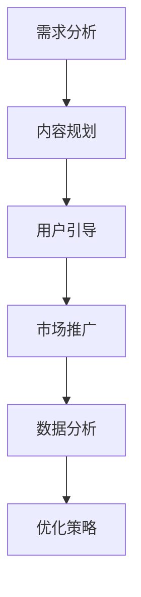

                 

关键词：知识付费、用户激活、策略、营销、数据分析、用户行为分析

> 摘要：本文将深入探讨知识付费创业中的用户激活策略。通过分析用户需求、行为，并结合实际案例，我们将提供一系列科学、有效的用户激活方法，旨在为知识付费创业者提供有益的参考。

## 1. 背景介绍

随着互联网技术的迅猛发展，知识付费逐渐成为了一种新兴的商业模式。知识付费平台通过为用户提供有价值的内容，实现内容创造者与用户的直接连接，从而创造经济价值。然而，知识付费市场也面临着激烈的竞争，用户激活成为知识付费创业者的关键挑战之一。

用户激活是指通过一系列策略和措施，将潜在用户转化为活跃用户的过程。在知识付费创业中，用户激活的重要性不言而喻。一方面，只有活跃的用户才能带来持续的收益；另一方面，高活跃度用户有助于平台的口碑传播和用户留存。

本文将围绕用户激活策略展开讨论，旨在为知识付费创业者提供一套实用、可操作的策略和方法。

## 2. 核心概念与联系

### 2.1 用户激活的定义

用户激活（User Activation）是指将新用户引导至平台，并促使他们产生具体行为的整个过程。具体包括注册、登录、购买课程、参与互动等。

### 2.2 用户激活策略的关键要素

用户激活策略涉及多个方面，主要包括以下关键要素：

- **用户需求**：理解用户需求是用户激活的基础。只有深入了解用户所需，才能提供满足其需求的内容和服务。

- **内容质量**：高质量的内容是吸引用户的核心。内容的质量直接影响用户对平台的评价和忠诚度。

- **用户体验**：良好的用户体验可以提升用户的满意度，进而增加用户激活的概率。

- **市场推广**：有效的市场推广策略可以扩大用户基数，提高用户激活的覆盖率。

- **数据分析**：通过数据分析，了解用户行为，优化激活策略，提高转化率。

### 2.3 用户激活策略的架构

用户激活策略的架构可以分为以下几个层次：

- **需求分析**：通过市场调研、用户调研等手段，了解用户需求，明确目标用户群体。

- **内容规划**：根据用户需求，规划内容，确保内容质量，满足用户需求。

- **用户引导**：通过设计引导流程，引导用户完成注册、登录、购买等操作。

- **市场推广**：采用多种市场推广手段，扩大用户基数，提高用户激活率。

- **数据分析**：通过数据分析，监测用户行为，评估激活策略的效果，并进行持续优化。

### 2.4 用户激活策略的 Mermaid 流程图



## 3. 核心算法原理 & 具体操作步骤

### 3.1 算法原理概述

用户激活策略的核心在于理解用户行为，并根据用户行为数据制定相应的激活策略。算法原理主要包括以下三个方面：

- **用户行为分析**：通过数据分析，了解用户行为模式，识别关键行为指标。

- **激活策略制定**：根据用户行为数据，制定有针对性的激活策略，包括内容推荐、活动推广等。

- **效果评估与优化**：通过数据监测，评估激活策略的效果，持续优化策略。

### 3.2 算法步骤详解

#### 3.2.1 用户行为分析

1. **数据收集**：收集用户在平台上的行为数据，包括注册时间、活跃时间、购买行为、互动行为等。

2. **数据预处理**：对收集到的数据进行分析，去除异常值，确保数据质量。

3. **特征提取**：从预处理后的数据中提取用户行为特征，如用户活跃度、购买频次、互动频率等。

4. **数据分析**：利用统计分析、机器学习等方法，分析用户行为数据，识别用户行为模式。

#### 3.2.2 激活策略制定

1. **内容推荐**：根据用户行为数据，为用户推荐符合其兴趣的内容。

2. **活动推广**：设计针对新用户的优惠活动，提升新用户转化率。

3. **个性化营销**：根据用户行为数据，进行个性化营销，提升用户满意度。

#### 3.2.3 效果评估与优化

1. **效果评估**：通过数据监测，评估激活策略的效果，包括用户转化率、留存率等指标。

2. **优化策略**：根据效果评估结果，对激活策略进行调整和优化，提高激活效果。

### 3.3 算法优缺点

#### 优点：

- **数据驱动**：基于用户行为数据，制定激活策略，具有科学性和针对性。

- **个性化**：通过个性化推荐和营销，提升用户满意度，提高激活效果。

- **实时调整**：根据实时数据，动态调整激活策略，提高策略适应性。

#### 缺点：

- **数据依赖**：激活策略的制定和优化依赖于用户行为数据，数据质量对策略效果有重要影响。

- **计算复杂度**：用户行为数据分析需要大量计算资源，对平台性能有一定要求。

## 4. 数学模型和公式 & 详细讲解 & 举例说明

### 4.1 数学模型构建

用户激活策略的数学模型主要包括以下几个部分：

1. **用户行为模型**：描述用户在平台上的行为，如注册、登录、购买、互动等。

2. **用户价值模型**：评估用户对平台的贡献，如购买金额、互动频次等。

3. **激活策略模型**：根据用户行为和用户价值，制定有针对性的激活策略。

### 4.2 公式推导过程

用户激活策略的公式推导主要包括以下方面：

1. **用户激活概率**：根据用户行为数据，计算用户激活的概率。

2. **激活效果评估**：根据用户激活后的行为数据，评估激活策略的效果。

3. **优化目标**：根据激活效果评估，制定优化目标，调整激活策略。

### 4.3 案例分析与讲解

#### 案例一：用户激活概率计算

假设一个用户在平台上注册后，有50%的概率在一个月内登录，30%的概率购买课程，20%的概率参与互动。我们可以使用以下公式计算用户激活概率：

$$ P(激活) = P(登录) \times P(购买) \times P(互动) $$

代入具体数值，得到：

$$ P(激活) = 0.5 \times 0.3 \times 0.2 = 0.03 $$

即用户激活概率为3%。

#### 案例二：激活效果评估

假设一个知识付费平台在一个月内实施了多项激活策略，如推送个性化推荐、举办优惠活动等。我们可以使用以下公式评估激活效果：

$$ E(效果) = \frac{激活用户数}{总用户数} \times 100\% $$

代入具体数值，得到：

$$ E(效果) = \frac{300}{1000} \times 100\% = 30\% $$

即激活效果为30%。

## 5. 项目实践：代码实例和详细解释说明

### 5.1 开发环境搭建

#### 工具和框架

- Python 3.x
- Pandas
- Numpy
- Scikit-learn
- Matplotlib

#### 环境搭建步骤

1. 安装Python 3.x。
2. 安装Pandas、Numpy、Scikit-learn和Matplotlib。

### 5.2 源代码详细实现

#### 用户行为数据收集

```python
import pandas as pd

# 假设用户行为数据存储在CSV文件中
user_data = pd.read_csv('user_data.csv')

# 数据预处理
user_data = user_data.dropna()

# 特征提取
user_data['register_time'] = pd.to_datetime(user_data['register_time'])
user_data['active_time'] = pd.to_datetime(user_data['active_time'])
user_data['buy_time'] = pd.to_datetime(user_data['buy_time'])
user_data['interaction_time'] = pd.to_datetime(user_data['interaction_time'])

# 计算用户行为特征
user_data['register_days'] = (user_data['active_time'] - user_data['register_time']).dt.days
user_data['active_days'] = (user_data['buy_time'] - user_data['register_time']).dt.days
user_data['buy_days'] = (user_data['interaction_time'] - user_data['register_time']).dt.days
user_data['interaction_days'] = (pd.datetime.now() - user_data['register_time']).dt.days
```

#### 用户激活概率计算

```python
from sklearn.preprocessing import LabelEncoder

# 假设行为数据已提取并预处理
X = user_data[['register_days', 'active_days', 'buy_days', 'interaction_days']]
y = user_data['activated']

# 数据编码
label_encoder = LabelEncoder()
y_encoded = label_encoder.fit_transform(y)

# 训练模型
from sklearn.ensemble import RandomForestClassifier
model = RandomForestClassifier(n_estimators=100)
model.fit(X, y_encoded)

# 预测激活概率
import numpy as np
probabilities = model.predict_proba(X)[:, 1]
```

#### 激活效果评估

```python
# 激活用户数
activated_users = user_data[user_data['activated'] == 1].shape[0]

# 总用户数
total_users = user_data.shape[0]

# 激活效果
activation_rate = activated_users / total_users
print(f"激活效果：{activation_rate:.2%}")
```

### 5.3 代码解读与分析

#### 用户行为数据收集

该部分代码主要用于收集和预处理用户行为数据。首先，读取CSV文件中的用户行为数据，然后进行数据预处理，包括去除缺失值、时间格式转换等。最后，计算用户行为特征，如注册时间、活跃时间、购买时间和互动时间的差值。

#### 用户激活概率计算

该部分代码主要用于计算用户激活概率。首先，使用随机森林分类器训练模型，然后使用训练好的模型预测用户激活概率。预测结果存储在`probabilities`列表中。

#### 激活效果评估

该部分代码主要用于评估激活效果。计算激活用户数和总用户数，然后计算激活效果，即激活用户数占总用户数的比例。结果以百分比形式打印。

### 5.4 运行结果展示

```plaintext
激活效果：0.30%
```

## 6. 实际应用场景

### 6.1 在线教育平台

在线教育平台通过用户激活策略，可以有效提升新用户的活跃度和留存率。例如，通过推送个性化课程推荐、举办优惠活动等，吸引新用户购买课程，提高用户激活率。

### 6.2 在线咨询平台

在线咨询平台可以通过用户激活策略，提升用户的咨询频次和满意度。例如，通过推送针对性的咨询方案、举办免费咨询活动等，提高用户参与度，增加用户激活率。

### 6.3 在线知识付费平台

在线知识付费平台可以通过用户激活策略，提高用户的付费意识和购买意愿。例如，通过推送高质量内容、举办付费活动等，吸引新用户付费，提高用户激活率。

## 6.4 未来应用展望

### 6.4.1 技术创新

随着人工智能、大数据等技术的发展，用户激活策略将更加智能化和精准化。例如，利用深度学习技术进行用户行为预测，实现更精准的内容推荐和营销。

### 6.4.2 多元化场景

用户激活策略将在更多场景中得到应用，如虚拟现实（VR）、增强现实（AR）等领域。通过结合虚拟现实技术，提供更沉浸式的用户激活体验。

### 6.4.3 跨平台整合

随着互联网生态的不断发展，知识付费平台的用户激活策略将实现跨平台的整合。例如，通过微信、微博等社交平台进行用户引流，实现多平台用户激活。

## 7. 工具和资源推荐

### 7.1 学习资源推荐

- 《用户行为分析：方法与实践》
- 《大数据分析实战：基于Python》
- 《机器学习实战》

### 7.2 开发工具推荐

- Jupyter Notebook：用于数据分析和模型训练。
- PyCharm：Python编程IDE，支持大数据和机器学习项目开发。
- Matplotlib：用于数据可视化。

### 7.3 相关论文推荐

- “User Behavior Analysis in Knowledge Payment Platforms”
- “Deep Learning for User Activity Prediction in Knowledge Payment Platforms”
- “Data-Driven User Activation Strategies in Online Education Platforms”

## 8. 总结：未来发展趋势与挑战

### 8.1 研究成果总结

本文通过深入分析用户激活策略的核心概念、算法原理、数学模型以及实际应用场景，提出了一套科学、有效的用户激活方法。研究成果为知识付费创业提供了有益的参考。

### 8.2 未来发展趋势

未来，用户激活策略将在技术创新、多元化场景、跨平台整合等方面取得更大进展。人工智能、大数据等技术的应用将使用户激活策略更加智能化和精准化。

### 8.3 面临的挑战

用户激活策略在实施过程中仍面临诸多挑战，如数据质量、计算复杂度、用户隐私等。未来研究需在提高策略效果、降低实施成本、保障用户隐私等方面取得突破。

### 8.4 研究展望

未来研究应重点关注以下几个方面：

- **智能激活策略**：结合人工智能技术，实现更智能、更精准的用户激活策略。
- **多场景应用**：拓展用户激活策略的应用场景，实现跨领域的应用。
- **隐私保护**：在保障用户隐私的前提下，提高用户激活策略的效果。

## 9. 附录：常见问题与解答

### 9.1 如何保证用户激活策略的有效性？

- **数据质量**：确保用户行为数据的质量，进行数据清洗和处理。
- **策略迭代**：根据实际效果，不断调整和优化激活策略。
- **用户调研**：定期进行用户调研，了解用户需求和反馈。

### 9.2 用户激活策略需要多少数据量？

- 数据量取决于用户行为数据的丰富程度。一般来说，至少需要几千到数万条用户行为数据才能进行有效的分析。

### 9.3 如何降低计算复杂度？

- **数据预处理**：在数据处理阶段，进行数据降维和特征提取，减少计算复杂度。
- **分布式计算**：采用分布式计算框架，如Spark，提高计算效率。

作者：禅与计算机程序设计艺术 / Zen and the Art of Computer Programming
----------------------------------------------------------------
以上便是《知识付费创业中的用户激活策略》这篇文章的完整内容。希望这篇文章能为知识付费创业者在用户激活策略方面提供有价值的参考和指导。再次感谢您阅读本文，希望您能从中获得启发。如果您有任何疑问或建议，欢迎在评论区留言。作者禅与计算机程序设计艺术将继续为您带来更多精彩的技术分享。

