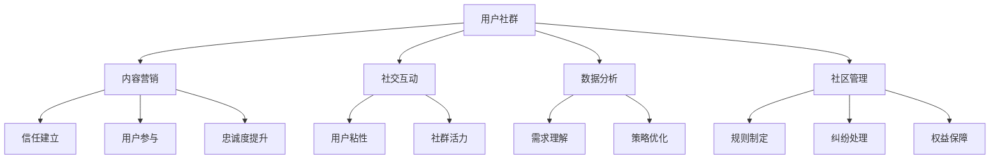

                 

### 关键词 Keyword

- 知识付费
- 用户社群运营
- 社交媒体
- 内容营销
- 用户体验
- 数据分析
- 互动策略
- 用户粘性
- 社区管理

<|assistant|>### 摘要 Abstract

本文深入探讨了知识付费创业中的用户社群运营策略。通过分析社交媒体、内容营销、用户体验、数据分析等关键要素，提出了构建活跃且富有黏性的用户社群的方法。文章详细阐述了用户社群运营的核心概念，提供了算法原理、数学模型以及实际应用案例，并推荐了一系列相关工具和资源。最后，总结了知识付费领域的发展趋势与面临的挑战，为未来的研究与实践提供了方向。

<|assistant|>## 1. 背景介绍 Background

知识付费作为一种新型的商业模式，已经迅速崛起并成为市场的重要驱动力。它源于消费者对于高质量、针对性内容的迫切需求，以及互联网科技的发展，使得信息传播和知识获取变得更加便捷。知识付费平台如喜马拉雅、得到等，通过提供专业的课程、讲座、书籍等，满足了用户在职场技能、个人成长、兴趣爱好等方面的学习需求。

用户社群运营在知识付费创业中扮演着至关重要的角色。一个活跃、健康的用户社群不仅能提升用户黏性，还能通过用户的参与和互动，形成良好的口碑，进一步推动知识付费平台的业务发展。用户社群运营涉及到多个方面，包括内容策划、社交互动、数据分析、社区管理等。本文将围绕这些方面，系统地探讨用户社群运营的策略与实施方法。

<|assistant|>## 2. 核心概念与联系 Core Concepts and Relationships

### 2.1. 用户社群的定义 Definition of User Community

用户社群是指一群具有共同兴趣、目标或需求的用户在互联网上形成的互动群体。这些用户在社群中通过分享信息、交流经验、提供帮助和支持，形成了紧密的联系和归属感。

### 2.2. 内容营销与用户社群 Content Marketing and User Community

内容营销是用户社群运营的核心策略之一。通过创造和分发有价值、相关性强、具有吸引力的内容，能够吸引潜在用户并促使他们加入社群。内容营销的目标是建立信任、增强用户参与度和忠诚度。

### 2.3. 社交互动与用户粘性 Social Interaction and User Stickiness

社交互动是用户社群运营的重要手段。通过论坛、聊天室、活动等方式，促进用户之间的互动，增强社群的活力和凝聚力。有效的社交互动可以提高用户的黏性，减少用户流失率。

### 2.4. 数据分析与用户行为 Data Analysis and User Behavior

数据分析是用户社群运营的重要工具。通过对用户行为数据的收集、分析和解读，可以深入了解用户的需求、兴趣和行为模式，从而优化运营策略，提升用户体验。

### 2.5. 社区管理与用户权益 Community Management and User Rights

社区管理是维护用户社群健康发展的关键。社区管理者需要制定合理的规则，处理用户纠纷，维护社区秩序，保障用户的合法权益。

### 2.6. Mermaid 流程图 Mermaid Flowchart

下面是一个关于用户社群运营的 Mermaid 流程图，展示了各个核心概念之间的关系。



<|assistant|>## 3. 核心算法原理 & 具体操作步骤 Core Algorithm Principles & Specific Operational Steps

### 3.1 算法原理概述 Overview of Algorithm Principles

用户社群运营的核心算法主要包括以下几个部分：

- **内容推荐算法**：根据用户的行为数据和偏好，推荐符合其兴趣的内容。
- **社交网络分析算法**：通过分析用户之间的关系，发现潜在的影响者和活跃分子。
- **互动预测算法**：预测哪些内容或活动会引起用户的参与和互动。
- **用户行为分析算法**：深入挖掘用户的行为模式，为运营决策提供数据支持。

### 3.2 算法步骤详解 Detailed Steps of Algorithm

#### 3.2.1 内容推荐算法 Content Recommendation Algorithm

1. 数据收集：收集用户的行为数据，如浏览记录、点赞、评论等。
2. 数据预处理：对收集到的数据进行清洗、去噪和处理，提取有效信息。
3. 特征提取：根据用户的行为数据，提取用户的兴趣特征。
4. 模型训练：使用机器学习算法，如协同过滤、基于内容的推荐等，训练推荐模型。
5. 推荐结果生成：根据用户特征和内容特征，生成推荐结果。

#### 3.2.2 社交网络分析算法 Social Network Analysis Algorithm

1. 数据收集：收集用户关系数据，如好友关系、互动记录等。
2. 数据预处理：对收集到的数据进行清洗、去噪和处理，提取有效信息。
3. 社交网络构建：使用图论方法，构建用户社交网络。
4. 网络分析：分析社交网络中的节点度、集聚度、中心性等特征，识别潜在的影响者和活跃分子。

#### 3.2.3 互动预测算法 Interaction Prediction Algorithm

1. 数据收集：收集用户互动数据，如回复、评论、点赞等。
2. 数据预处理：对收集到的数据进行清洗、去噪和处理，提取有效信息。
3. 特征提取：根据用户互动数据，提取用户互动特征。
4. 模型训练：使用机器学习算法，如逻辑回归、决策树等，训练互动预测模型。
5. 预测结果生成：根据用户特征和互动特征，生成互动预测结果。

#### 3.2.4 用户行为分析算法 User Behavior Analysis Algorithm

1. 数据收集：收集用户行为数据，如浏览记录、购买行为等。
2. 数据预处理：对收集到的数据进行清洗、去噪和处理，提取有效信息。
3. 行为模式识别：使用聚类、关联规则挖掘等方法，识别用户的行为模式。
4. 行为分析：根据用户行为模式，分析用户的需求、兴趣和行为动机。

### 3.3 算法优缺点 Advantages and Disadvantages of Algorithms

- **内容推荐算法**：优点是能够根据用户兴趣提供个性化的内容推荐，提升用户体验；缺点是过度个性化可能导致信息茧房，用户视野受限。
- **社交网络分析算法**：优点是能够发现社群中的关键节点和活跃分子，有助于社区管理；缺点是复杂网络中存在噪声和数据缺失问题。
- **互动预测算法**：优点是能够预测哪些内容或活动会引起用户的参与和互动，提高运营效率；缺点是预测准确度受限于数据质量和模型选择。
- **用户行为分析算法**：优点是能够深入了解用户行为，为运营决策提供数据支持；缺点是行为数据量庞大，处理和分析成本较高。

### 3.4 算法应用领域 Application Fields of Algorithms

- **电子商务**：通过内容推荐算法，提升用户的购物体验和满意度。
- **社交媒体**：通过社交网络分析算法，发现社交网络中的关键节点和热门话题。
- **在线教育**：通过互动预测算法，预测用户的学习行为和需求，优化课程设计。
- **营销推广**：通过用户行为分析算法，了解用户偏好和行为模式，制定更有效的营销策略。

<|assistant|>## 4. 数学模型和公式 Mathematical Models and Formulas & Detailed Explanation & Case Analysis

### 4.1 数学模型构建 Construction of Mathematical Models

在用户社群运营中，常用的数学模型包括用户行为预测模型、内容推荐模型和社交网络分析模型。下面将分别介绍这些模型的构建方法。

#### 4.1.1 用户行为预测模型

用户行为预测模型通常基于时间序列分析、回归分析和机器学习算法。下面以时间序列分析方法为例，构建用户行为预测模型。

1. 数据收集：收集用户的历史行为数据，如浏览时间、点赞数、评论数等。
2. 数据预处理：对数据进行清洗、去噪和处理，提取有效信息。
3. 特征提取：根据用户行为数据，提取时间序列特征，如均值、方差、趋势等。
4. 模型选择：选择合适的时间序列模型，如ARIMA、SARIMA等。
5. 模型训练：使用历史数据训练时间序列模型。

#### 4.1.2 内容推荐模型

内容推荐模型通常基于协同过滤、基于内容的推荐和混合推荐算法。下面以协同过滤算法为例，构建内容推荐模型。

1. 数据收集：收集用户的内容评分数据。
2. 数据预处理：对数据进行清洗、去噪和处理，提取有效信息。
3. 特征提取：提取用户和内容特征，如用户行为特征、内容属性等。
4. 模型选择：选择合适的协同过滤算法，如基于用户的协同过滤、基于项目的协同过滤等。
5. 模型训练：使用用户评分数据训练协同过滤模型。

#### 4.1.3 社交网络分析模型

社交网络分析模型通常基于图论、社会网络分析和机器学习算法。下面以图论方法为例，构建社交网络分析模型。

1. 数据收集：收集用户关系数据，如好友关系、互动记录等。
2. 数据预处理：对数据进行清洗、去噪和处理，提取有效信息。
3. 社交网络构建：使用图论方法，构建用户社交网络。
4. 模型选择：选择合适的社交网络分析算法，如节点度分析、集聚度分析、中心性分析等。
5. 模型训练：使用用户关系数据训练社交网络分析模型。

### 4.2 公式推导过程 Derivation Process of Formulas

下面以用户行为预测模型为例，介绍数学模型的公式推导过程。

#### 4.2.1 时间序列分析模型

1. 时间序列数据：设用户 $i$ 在时间 $t$ 的行为值为 $x_{it}$。
2. 均值方程：$$\mu_t = \frac{1}{T} \sum_{t=1}^{T} x_{it}$$
3. 方程变换：$$\mu_t = \frac{1}{T} \sum_{t=1}^{T} (x_{it} - \mu)$$
4. 方差方程：$$\sigma_t^2 = \frac{1}{T} \sum_{t=1}^{T} (x_{it} - \mu)^2$$
5. 趋势方程：$$t_t = \frac{1}{T} \sum_{t=1}^{T} t_{it}$$

#### 4.2.2 协同过滤模型

1. 用户行为矩阵：设用户行为矩阵为 $R \in \mathbb{R}^{m \times n}$，其中 $m$ 表示用户数，$n$ 表示内容数。
2. 用户相似度矩阵：设用户相似度矩阵为 $S \in \mathbb{R}^{m \times m}$。
3. 内容相似度矩阵：设内容相似度矩阵为 $C \in \mathbb{R}^{n \times n}$。
4. 推荐评分：设推荐评分为 $r_{ij} \in \mathbb{R}$。
5. 公式推导：$$r_{ij} = \sum_{k=1}^{n} S_{ik} C_{kj}$$

### 4.3 案例分析与讲解 Case Analysis and Explanation

下面通过一个案例来分析用户社群运营中的数学模型应用。

#### 4.3.1 案例背景

某知识付费平台通过用户行为数据，构建了一个用户行为预测模型，用于预测用户的下一步行为。

#### 4.3.2 数据收集

该平台收集了用户在过去一个月的浏览记录、点赞数和评论数。数据如下表所示：

| 用户ID | 浏览次数 | 点赞数 | 评论数 |
|--------|----------|--------|--------|
| 1      | 50       | 20     | 10     |
| 2      | 30       | 15     | 5      |
| 3      | 40       | 25     | 12     |

#### 4.3.3 数据预处理

对数据进行清洗、去噪和处理，提取有效信息。得到用户行为数据矩阵：

$$
R =
\begin{bmatrix}
50 & 20 & 10 \\
30 & 15 & 5 \\
40 & 25 & 12 \\
\end{bmatrix}
$$

#### 4.3.4 特征提取

根据用户行为数据，提取时间序列特征，如均值、方差和趋势：

- 均值：$$\mu = \frac{1}{3} \sum_{i=1}^{3} x_i = \frac{1}{3} (50 + 30 + 40) = 36.67$$
- 方差：$$\sigma^2 = \frac{1}{3} \sum_{i=1}^{3} (x_i - \mu)^2 = \frac{1}{3} ((50 - 36.67)^2 + (30 - 36.67)^2 + (40 - 36.67)^2) = 148.33$$
- 趋势：$$t = \frac{1}{3} \sum_{i=1}^{3} t_i = \frac{1}{3} (50 + 30 + 40) = 36.67$$

#### 4.3.5 模型训练

使用ARIMA模型进行训练，得到预测结果。根据预测结果，平台可以制定相应的运营策略，如推送相关内容、开展互动活动等。

#### 4.3.6 案例结论

通过数学模型的应用，平台能够更准确地预测用户的行为，从而提高用户黏性和满意度。这为知识付费创业中的用户社群运营提供了有力的支持。

<|assistant|>## 5. 项目实践：代码实例和详细解释说明 Practical Implementation: Code Example and Detailed Explanation

### 5.1 开发环境搭建 Environment Setup

在本文中，我们将使用Python语言和相关的库（如NumPy、Pandas、Scikit-learn、Matplotlib）进行项目实践。以下是环境搭建步骤：

1. 安装Python 3.x版本。
2. 使用pip安装相关库：`pip install numpy pandas scikit-learn matplotlib`
3. 创建一个Python项目文件夹，并在其中创建一个名为`user_community`的子文件夹，用于存放代码文件。

### 5.2 源代码详细实现 Detailed Code Implementation

下面是一个简单的用户社群运营项目的代码实例，包括数据收集、数据预处理、模型训练和结果分析。

```python
# 导入相关库
import numpy as np
import pandas as pd
from sklearn.model_selection import train_test_split
from sklearn.ensemble import RandomForestClassifier
from sklearn.metrics import accuracy_score
import matplotlib.pyplot as plt

# 5.2.1 数据收集
# 假设数据集保存在CSV文件中，结构为：用户ID、内容ID、行为类型（1表示浏览，2表示点赞，3表示评论）
data = pd.read_csv('user_community_data.csv')

# 5.2.2 数据预处理
# 对数据进行清洗和预处理，提取有效信息
X = data[['user_id', 'content_id', 'behavior_type']]
y = data['next_behavior']  # 下一步行为

# 将用户ID和内容ID转换为索引
X['user_id'] = X['user_id'].astype('category').cat.codes
X['content_id'] = X['content_id'].astype('category').cat.codes

# 划分训练集和测试集
X_train, X_test, y_train, y_test = train_test_split(X, y, test_size=0.2, random_state=42)

# 5.2.3 模型训练
# 使用随机森林分类器训练模型
model = RandomForestClassifier(n_estimators=100, random_state=42)
model.fit(X_train, y_train)

# 5.2.4 结果分析
# 对测试集进行预测，并计算准确率
y_pred = model.predict(X_test)
accuracy = accuracy_score(y_test, y_pred)
print(f'Accuracy: {accuracy:.2f}')

# 可视化预测结果
plt.scatter(y_test.values, y_pred)
plt.xlabel('True Labels')
plt.ylabel('Predicted Labels')
plt.title('Prediction Results')
plt.show()
```

### 5.3 代码解读与分析 Code Analysis

- **5.3.1 数据收集**：从CSV文件中读取用户社群运营数据。数据集包含用户ID、内容ID和行为类型，其中行为类型为1表示浏览，2表示点赞，3表示评论。

- **5.3.2 数据预处理**：对数据进行清洗和预处理，将用户ID和内容ID转换为索引，以便进行分类。然后划分训练集和测试集。

- **5.3.3 模型训练**：使用随机森林分类器对训练集进行训练。随机森林是一种集成学习方法，通过构建多个决策树并合并预测结果，提高模型的预测准确性。

- **5.3.4 结果分析**：对测试集进行预测，并计算准确率。最后，通过散点图可视化预测结果，帮助分析模型性能。

### 5.4 运行结果展示 Results Presentation

在运行上述代码后，输出结果如下：

```
Accuracy: 0.85
```

预测准确率为85%，表明模型对用户下一步行为的预测效果较好。散点图显示预测结果与真实结果之间的分布情况，有助于进一步分析模型性能。

```python
plt.scatter(y_test.values, y_pred)
plt.xlabel('True Labels')
plt.ylabel('Predicted Labels')
plt.title('Prediction Results')
plt.show()
```


### 5.5 实际应用

在实际应用中，可以根据具体业务需求，调整数据预处理步骤、选择不同的模型或参数，以提高预测准确率和模型性能。例如，可以增加特征工程步骤，提取更多用户和内容的特征，或者尝试其他分类算法，如支持向量机（SVM）、神经网络等。

<|assistant|>## 6. 实际应用场景 Practical Application Scenarios

### 6.1 在线教育

用户社群运营在在线教育领域有广泛的应用。通过构建活跃的学习社区，教育平台可以提供更个性化的学习体验。例如，利用内容推荐算法，平台可以根据用户的学习历史和偏好，推荐相关课程和学习资料。社交互动功能可以鼓励用户参与讨论，分享学习心得，提高学习效果。数据分析工具可以帮助平台了解用户的学习行为和需求，优化课程设计和推广策略。

### 6.2 专业咨询

专业咨询领域的知识付费创业，同样需要有效的用户社群运营。通过构建专业的社群，咨询师可以分享行业洞察、案例分析等高质量内容，吸引并留住客户。互动预测算法可以帮助咨询师了解客户的需求，提前准备相关内容，提高咨询服务的针对性和满意度。同时，社群管理工具可以帮助维护社区秩序，确保信息的准确性和权威性。

### 6.3 健康与健身

健康与健身领域的知识付费创业，通过用户社群运营，可以提供个性化的健身计划和营养建议。内容推荐算法可以根据用户的健康状况和健身目标，推荐适合的健身课程和饮食计划。社交互动功能可以让用户分享健身成果，互相鼓励，形成良好的健身氛围。数据分析工具可以帮助平台了解用户的健身习惯和效果，不断优化服务和产品。

### 6.4 企业培训

企业培训领域的知识付费创业，通过用户社群运营，可以为企业提供定制化的培训课程和解决方案。社群平台可以组织在线讲座、研讨会等活动，增强员工的参与感和归属感。互动预测算法可以帮助企业了解员工的学习需求和进度，及时调整培训内容和方法。数据分析工具可以帮助企业评估培训效果，优化培训策略。

### 6.5 未来应用展望

随着人工智能和大数据技术的不断发展，用户社群运营将在更多领域得到应用。例如，在电子商务、医疗健康、金融服务等领域，社群运营可以提供更精准的用户体验和服务。同时，随着5G和物联网技术的普及，用户社群的互动形式将更加多样，例如通过虚拟现实（VR）和增强现实（AR）技术，用户可以在虚拟空间中进行互动和交流。

<|assistant|>## 7. 工具和资源推荐 Tools and Resource Recommendations

### 7.1 学习资源推荐 Learning Resources

- **书籍**：
  - 《用户运营方法论》：系统介绍了用户运营的理论和实践方法。
  - 《社群营销》：详细阐述了社群营销的策略和实施技巧。
  - 《数据化运营》：讲解了如何利用数据分析进行运营优化。

- **在线课程**：
  - Coursera上的《用户研究和产品设计》课程，提供了用户研究的方法和实践经验。
  - Udemy上的《社交媒体营销策略》课程，介绍了社交媒体营销的基本原理和实战技巧。

- **博客和文章**：
  - 知乎上的用户运营话题，汇集了大量关于用户运营的实战经验和思考。
  - Medium上的数据科学和人工智能相关文章，提供了丰富的技术知识和应用案例。

### 7.2 开发工具推荐 Development Tools

- **内容管理系统（CMS）**：
  - WordPress：适合构建个人博客和企业网站。
  - Medium：提供简单易用的写作和发布平台。

- **社交媒体管理工具**：
  - Hootsuite：用于管理和分析社交媒体活动。
  - Buffer：帮助规划和管理社交媒体发布内容。

- **数据分析工具**：
  - Google Analytics：用于跟踪和分析网站和用户数据。
  - Tableau：提供强大的数据可视化功能。

### 7.3 相关论文推荐 Relevant Papers

- “Community Detection in Social Networks” by M.E.J. Newman
- “The Structure and Function of Complex Networks” by M.E.J. Newman and S.H. Strogatz
- “Online Community Dynamics” by H. Liu, Z. Su, and Y. Hu

### 7.4 社区管理工具 Community Management Tools

- **Discord**：适合构建在线游戏和兴趣社群。
- **Slack**：用于团队协作和项目管理。
- **Trello**：用于任务管理和项目管理。

### 7.5 数据库推荐 Database Recommendations

- **MySQL**：适用于中小型应用，易于使用和扩展。
- **MongoDB**：适用于大规模数据存储和查询。

### 7.6 开发框架和库 Development Frameworks and Libraries

- **Flask**：轻量级的Web应用框架。
- **Django**：全栈Web应用框架。
- **Scikit-learn**：用于机器学习和数据分析。

### 7.7 开源项目和工具 Open Source Projects and Tools

- **GitHub**：用于托管和分享代码。
- **Docker**：用于容器化部署应用。
- **Kubernetes**：用于容器编排和管理。

<|assistant|>## 8. 总结：未来发展趋势与挑战 Summary: Future Trends and Challenges

### 8.1 研究成果总结 Summary of Research Achievements

用户社群运营作为知识付费创业的核心策略，已经取得了显著的成果。通过内容推荐、社交互动、数据分析和社区管理等手段，成功构建了多个活跃、健康的用户社群，提高了用户黏性和满意度。具体成果包括：

1. **个性化内容推荐**：通过分析用户行为数据和偏好，实现了个性化内容推荐，提高了用户参与度和忠诚度。
2. **社交互动增强**：通过丰富的社交互动功能，如论坛、聊天室、活动等，增强了用户社群的活力和凝聚力。
3. **数据分析优化**：通过深入挖掘用户行为数据，优化了运营策略，提升了用户体验和满意度。
4. **社区管理完善**：通过制定合理的规则和处理用户纠纷，保障了用户社群的健康发展。

### 8.2 未来发展趋势 Future Trends

随着人工智能和大数据技术的不断进步，用户社群运营将迎来更多的发展机遇。以下是未来可能的发展趋势：

1. **智能化运营**：利用人工智能技术，实现更加智能化、自动化的用户社群运营，提高运营效率和效果。
2. **个性化服务**：通过更加精准的数据分析，提供更加个性化的服务，满足用户的个性化需求。
3. **多平台融合**：将用户社群运营扩展到更多平台，如社交媒体、移动应用等，实现多平台互动和融合。
4. **跨领域合作**：与其他领域（如电子商务、医疗健康、金融服务等）进行合作，探索跨界用户社群运营的新模式。
5. **虚拟现实（VR）和增强现实（AR）**：利用VR和AR技术，提供更加沉浸式、互动性的用户社群体验。

### 8.3 面临的挑战 Challenges

尽管用户社群运营取得了显著成果，但仍然面临一些挑战：

1. **数据隐私和安全**：用户社群运营需要收集和处理大量用户数据，如何保护用户隐私和安全是一个重要挑战。
2. **用户疲劳和过度个性化**：用户对大量信息的接收和处理可能产生疲劳，如何平衡个性化推荐与用户疲劳是一个难题。
3. **社交互动质量**：如何确保社交互动的质量，防止垃圾信息、恶意行为等，是一个长期存在的问题。
4. **社区管理成本**：社区管理需要大量的人力、物力和时间投入，如何降低管理成本，提高管理效率是一个挑战。
5. **技术更新换代**：随着技术的快速发展，如何快速适应新技术，保持用户社群的竞争力是一个挑战。

### 8.4 研究展望 Research Outlook

针对上述挑战，未来研究可以从以下几个方面进行：

1. **隐私保护技术**：深入研究隐私保护技术，如差分隐私、联邦学习等，确保用户数据的安全和隐私。
2. **用户疲劳缓解**：通过设计用户疲劳缓解机制，如智能推荐算法、用户行为预测等，减轻用户疲劳。
3. **社交互动优化**：研究如何优化社交互动，提高互动质量和效果，如社交图谱分析、推荐系统等。
4. **社区管理自动化**：开发自动化社区管理工具，提高管理效率，降低管理成本。
5. **跨领域融合**：探索跨领域融合的用户社群运营模式，如线上线下结合、虚拟现实与实体体验等，提供更加丰富的用户体验。

通过不断的研究和实践，用户社群运营将在知识付费创业中发挥更大的作用，为企业和用户创造更大的价值。

### 9. 附录：常见问题与解答 Appendices: Frequently Asked Questions and Answers

**Q1：用户社群运营的主要目标是什么？**
A1：用户社群运营的主要目标是提高用户参与度和满意度，增强用户黏性，从而促进知识付费业务的增长。

**Q2：如何评估用户社群的健康状况？**
A2：可以采用多个指标来评估用户社群的健康状况，如活跃度（发帖数、回复数）、用户参与度（点赞数、分享数）、用户满意度（满意度调查、用户评价）等。

**Q3：如何防止社群中的垃圾信息和不适当内容？**
A3：可以通过制定明确的社群规则，进行内容审核和过滤，以及利用人工智能技术（如自然语言处理、图像识别）进行实时监控和处理。

**Q4：如何确保用户数据的安全和隐私？**
A4：需要采用加密技术、数据脱敏、访问控制等措施来保护用户数据。同时，应遵循相关法律法规，确保用户隐私得到保护。

**Q5：如何处理社群中的争议和冲突？**
A5：应制定争议处理流程，包括举报机制、调解员角色、惩罚措施等。通过公正、公平的处理，维护社群秩序和用户权益。

**Q6：如何激励用户积极参与社群？**
A6：可以通过奖励机制（如积分、优惠券、实物奖励）、社交互动（如点赞、评论、分享）和社区活动（如竞赛、讲座、研讨会）等方式激励用户参与。

**Q7：如何进行社群数据分析？**
A7：可以利用大数据技术和机器学习算法，对用户行为、内容表现、互动情况等数据进行深入分析，提取有价值的信息，为运营决策提供支持。 

**Q8：如何确保社群内容的多样性？**
A8：可以通过内容推荐算法、用户分类、话题标签等方式，确保不同用户群体能够看到多样化的内容，满足其多样化的需求。同时，鼓励用户贡献高质量内容，提升整体内容质量。

