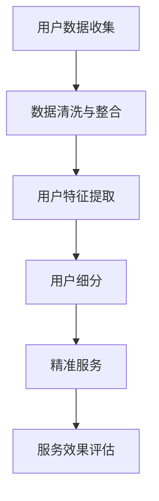

                 

 在这个数字时代，知识付费已经成为一种主流的商业模式。通过提供有价值的信息和服务，知识付费平台吸引了大量用户，实现了商业变现。然而，在知识付费市场中，用户的需求千差万别，如何进行有效的用户细分和提供精准服务，成为了每个知识付费创业者的核心挑战。本文将深入探讨用户细分与精准服务在知识付费创业中的应用，帮助创业者更好地理解和应对这一挑战。

## 关键词

- 知识付费
- 用户细分
- 精准服务
- 数据分析
- 个性化推荐
- 用户参与

## 摘要

本文首先介绍了知识付费的市场背景和发展现状，随后深入探讨了用户细分和精准服务的概念及其在知识付费创业中的重要性。文章通过具体案例和数据分析，详细阐述了用户细分的方法和策略，并介绍了如何利用数据分析和个性化推荐技术来提供精准服务。最后，本文对未来的发展趋势和面临的挑战进行了展望。

### 1. 背景介绍

#### 1.1 知识付费的定义

知识付费是指用户为了获取特定领域的专业知识和技能，愿意支付一定费用进行消费的行为。这一模式的核心在于价值的传递，即平台或个人通过提供有价值的内容或服务，吸引用户付费。

#### 1.2 知识付费的发展

随着互联网的普及和信息技术的进步，知识付费市场得到了快速发展。特别是在过去几年，知识付费平台如雨后春笋般涌现，例如得到、知乎Live、喜马拉雅等。这些平台通过提供专业课程、知识讲座、付费问答等形式，满足了用户对知识的渴望。

#### 1.3 知识付费的市场现状

当前，知识付费市场呈现出几个显著的特点：

- **用户数量增长迅速**：随着知识付费理念的普及，越来越多的用户愿意为知识付费。
- **内容种类丰富**：知识付费内容涵盖了多个领域，从职场技能到兴趣爱好，从教育培训到健康养生，应有尽有。
- **商业变现能力强**：知识付费平台通过订阅、付费课程、广告等多种方式实现了商业变现。

### 2. 核心概念与联系

为了更好地理解用户细分与精准服务，我们需要引入几个核心概念：

- **用户细分**：将用户根据不同的特征（如年龄、性别、职业、兴趣爱好等）进行分类，以便更精准地满足他们的需求。
- **精准服务**：基于用户细分的结果，为每个用户群体提供定制化的服务和内容，提高用户体验和满意度。

下面是一个简化的 Mermaid 流程图，展示用户细分与精准服务的基本架构：



#### 2.1 用户数据收集

用户数据的收集是整个用户细分与精准服务流程的基础。这些数据可以来源于多个渠道，包括：

- **注册信息**：用户在知识付费平台注册时填写的基本信息。
- **行为数据**：用户在平台上的浏览、搜索、购买等行为数据。
- **互动数据**：用户在平台上的评论、点赞、分享等互动行为数据。

#### 2.2 数据清洗与整合

收集到的用户数据通常存在噪声和冗余，因此需要通过数据清洗和整合来提高数据质量。具体步骤包括：

- **去重**：删除重复的数据记录。
- **填补缺失值**：对于缺失的数据，可以采用均值填补、插值等方法进行填补。
- **归一化**：将不同特征的数据进行归一化处理，使其具有相同的尺度。

#### 2.3 用户特征提取

在用户细分的过程中，需要提取出与用户需求和行为相关的特征。这些特征可以包括：

- **基本信息特征**：如年龄、性别、职业等。
- **行为特征**：如浏览时长、购买频次、互动行为等。
- **兴趣爱好特征**：通过分析用户的行为数据，可以提取出他们的兴趣爱好。

#### 2.4 用户细分

基于提取的用户特征，可以使用聚类、分类等方法对用户进行细分。常见的用户细分方法包括：

- **K-均值聚类**：将用户根据相似度进行分组。
- **决策树分类**：根据用户特征建立分类模型，将用户划分到不同的类别中。

#### 2.5 精准服务

在用户细分的基础上，可以为每个细分群体提供定制化的服务和内容。具体策略包括：

- **个性化推荐**：根据用户特征和偏好，为用户推荐相关的内容和课程。
- **定制化服务**：为不同细分群体提供针对性的服务，如专属的咨询服务、课程定制等。
- **用户体验优化**：根据用户反馈，不断优化平台的服务和内容，提高用户体验。

#### 2.6 服务效果评估

精准服务的最终效果需要通过评估来验证。评估指标可以包括：

- **用户满意度**：通过用户反馈和评分来评估用户对服务的满意度。
- **用户留存率**：通过用户活跃度和重复购买率来评估用户对服务的长期价值。

### 3. 核心算法原理 & 具体操作步骤

在用户细分与精准服务的实现过程中，常用的算法包括聚类算法、分类算法和推荐算法。以下将分别介绍这些算法的基本原理和具体操作步骤。

#### 3.1 聚类算法

聚类算法是一种无监督学习方法，其目标是将数据集中的数据点根据它们的相似度分成多个组（簇）。常见的聚类算法包括K-均值聚类、层次聚类等。

**K-均值聚类**的基本原理如下：

1. **初始化**：随机选择K个数据点作为初始聚类中心。
2. **分配**：计算每个数据点到各个聚类中心的距离，将数据点分配到最近的聚类中心。
3. **更新**：重新计算每个聚类中心的位置，通常取簇内所有数据点的平均值。
4. **迭代**：重复步骤2和3，直到聚类中心不再发生变化或达到预设的迭代次数。

**具体操作步骤**：

1. **数据预处理**：对原始数据进行清洗和归一化处理。
2. **初始化聚类中心**：随机选择K个数据点作为初始聚类中心。
3. **分配数据点**：计算每个数据点到各个聚类中心的距离，将数据点分配到最近的聚类中心。
4. **更新聚类中心**：重新计算每个聚类中心的位置，通常取簇内所有数据点的平均值。
5. **迭代**：重复步骤3和4，直到聚类中心不再发生变化或达到预设的迭代次数。
6. **评估聚类效果**：可以使用内部评估指标（如簇内距离和）或外部评估指标（如轮廓系数）来评估聚类效果。

#### 3.2 分类算法

分类算法是一种有监督学习方法，其目标是将新的数据点根据其特征划分为不同的类别。常见的分类算法包括决策树、支持向量机等。

**决策树分类**的基本原理如下：

1. **特征选择**：根据信息增益或基尼指数等指标选择最佳特征进行划分。
2. **划分数据**：使用最佳特征将数据划分为不同的子集。
3. **递归划分**：对每个子集继续选择最佳特征进行划分，直到达到终止条件（如最大深度、最小样本量等）。

**具体操作步骤**：

1. **数据预处理**：对原始数据进行清洗和归一化处理。
2. **特征选择**：选择最佳特征进行划分，可以使用信息增益或基尼指数等指标。
3. **划分数据**：使用最佳特征将数据划分为不同的子集。
4. **递归划分**：对每个子集继续选择最佳特征进行划分，直到达到终止条件。
5. **构建决策树**：将划分结果组合成一棵决策树。
6. **评估分类效果**：可以使用交叉验证、准确率、召回率等指标来评估分类效果。

#### 3.3 推荐算法

推荐算法是一种无监督学习方法，其目标是根据用户的历史行为和偏好为用户推荐相关的商品或内容。常见的推荐算法包括协同过滤、矩阵分解等。

**协同过滤**的基本原理如下：

1. **用户-项目矩阵构建**：根据用户的历史行为构建用户-项目矩阵。
2. **相似度计算**：计算用户之间的相似度或项目之间的相似度。
3. **推荐生成**：根据用户相似度或项目相似度为用户生成推荐列表。

**具体操作步骤**：

1. **数据预处理**：对原始数据进行清洗和归一化处理。
2. **用户-项目矩阵构建**：根据用户的历史行为构建用户-项目矩阵。
3. **相似度计算**：计算用户之间的相似度或项目之间的相似度。
4. **推荐生成**：根据用户相似度或项目相似度为用户生成推荐列表。
5. **推荐结果评估**：可以使用准确率、覆盖率等指标来评估推荐效果。

### 3.4 算法优缺点

**聚类算法**：

- **优点**：无需预先设定类别数量，可以自动发现数据中的模式。
- **缺点**：聚类结果可能依赖于初始化聚类中心，容易陷入局部最优。

**分类算法**：

- **优点**：可以对新数据进行准确的分类，具有较强的泛化能力。
- **缺点**：需要大量的标注数据进行训练，模型复杂度较高。

**推荐算法**：

- **优点**：可以有效地发现用户和项目的相似性，为用户生成个性化的推荐。
- **缺点**：推荐结果可能存在冷启动问题，即新用户或新项目难以获得有效的推荐。

### 3.5 算法应用领域

**聚类算法**：

- **应用领域**：市场细分、客户分类、图像分割等。

**分类算法**：

- **应用领域**：文本分类、情感分析、疾病诊断等。

**推荐算法**：

- **应用领域**：电子商务、社交媒体、在线视频等。

### 4. 数学模型和公式 & 详细讲解 & 举例说明

在用户细分与精准服务的实现过程中，数学模型和公式起到了关键作用。以下将介绍几个常用的数学模型和公式，并对其进行详细讲解和举例说明。

#### 4.1 数学模型构建

**用户行为预测模型**：

用户行为预测模型是用于预测用户在知识付费平台上的行为，如购买、浏览、评价等。常见的用户行为预测模型包括线性回归、逻辑回归、决策树等。

- **线性回归模型**：

$$
y = \beta_0 + \beta_1 x_1 + \beta_2 x_2 + ... + \beta_n x_n
$$

其中，$y$ 表示预测的目标变量，$x_1, x_2, ..., x_n$ 表示特征变量，$\beta_0, \beta_1, ..., \beta_n$ 表示模型的参数。

- **逻辑回归模型**：

$$
\pi = \frac{1}{1 + e^{-(\beta_0 + \beta_1 x_1 + \beta_2 x_2 + ... + \beta_n x_n})}
$$

其中，$\pi$ 表示目标变量的概率，$e$ 表示自然对数的底。

- **决策树模型**：

决策树模型是一种树形结构，通过递归划分数据集来构建模型。常见的决策树算法包括ID3、C4.5等。

**用户兴趣模型**：

用户兴趣模型是用于挖掘用户在知识付费平台上的兴趣和偏好。常见的用户兴趣模型包括协同过滤、矩阵分解等。

- **协同过滤模型**：

$$
R_{ui} = \sum_{j \in N_i} \frac{R_{uj}}{||N_i||}
$$

其中，$R_{ui}$ 表示用户 $u$ 对项目 $i$ 的评分，$N_i$ 表示与项目 $i$ 相似的项目集合。

- **矩阵分解模型**：

$$
R_{ui} = \sigma (q_u^T p_i + b_u + b_i)
$$

其中，$q_u$ 和 $p_i$ 分别表示用户 $u$ 和项目 $i$ 的特征向量，$\sigma$ 表示激活函数。

#### 4.2 公式推导过程

**线性回归模型的推导**：

线性回归模型是一种基于线性关系的预测模型。其基本思想是假设目标变量 $y$ 与特征变量 $x_1, x_2, ..., x_n$ 之间存在线性关系，可以用一个线性函数来表示：

$$
y = \beta_0 + \beta_1 x_1 + \beta_2 x_2 + ... + \beta_n x_n
$$

为了求解模型参数 $\beta_0, \beta_1, ..., \beta_n$，需要使用最小二乘法。最小二乘法的核心思想是使预测值与实际值之间的误差平方和最小。

设 $y_i$ 为实际值，$\hat{y_i}$ 为预测值，则误差平方和为：

$$
\sum_{i=1}^{n} (\hat{y_i} - y_i)^2
$$

对每个参数求偏导数并令其为零，可以得到最小二乘法的求解公式：

$$
\frac{\partial}{\partial \beta_j} \sum_{i=1}^{n} (\hat{y_i} - y_i)^2 = 0
$$

经过一系列计算，可以得到线性回归模型的参数估计公式：

$$
\beta_j = \frac{\sum_{i=1}^{n} (x_{ij} - \bar{x_j})(y_i - \bar{y})}{\sum_{i=1}^{n} (x_{ij} - \bar{x_j})^2}
$$

其中，$\bar{x_j}$ 和 $\bar{y}$ 分别表示特征变量 $x_j$ 和目标变量 $y$ 的平均值。

**逻辑回归模型的推导**：

逻辑回归模型是一种概率型预测模型，其基本思想是假设目标变量 $y$ 取值为1的概率可以表示为：

$$
\pi = P(y=1) = \frac{1}{1 + e^{-(\beta_0 + \beta_1 x_1 + \beta_2 x_2 + ... + \beta_n x_n})}
$$

为了求解模型参数 $\beta_0, \beta_1, ..., \beta_n$，需要使用极大似然估计法。极大似然估计法的核心思想是最大化目标变量的概率。

设 $y_i$ 为实际值，$x_i$ 为特征变量，则逻辑回归模型的似然函数为：

$$
L(\beta) = \prod_{i=1}^{n} \pi_{i}^{y_i} (1 - \pi_{i})^{1 - y_i}
$$

取对数似然函数，并对其求导数，可以得到极大似然估计法的求解公式：

$$
\frac{\partial}{\partial \beta_j} \ln L(\beta) = \frac{\sum_{i=1}^{n} (y_i - \pi_i) x_{ij}}{1 - \pi_i}
$$

经过一系列计算，可以得到逻辑回归模型的参数估计公式：

$$
\beta_j = \frac{\sum_{i=1}^{n} (y_i - \pi_i) x_{ij}}{\sum_{i=1}^{n} (1 - \pi_i) x_{ij}}
$$

**协同过滤模型的推导**：

协同过滤模型是一种基于用户相似度的推荐模型。其基本思想是根据用户之间的相似度来预测用户对未知项目的评分。

设 $R_{ui}$ 为用户 $u$ 对项目 $i$ 的评分，$R_{uj}$ 为用户 $u$ 对项目 $j$ 的评分，$N_i$ 为与项目 $i$ 相似的项目集合，则协同过滤模型的评分预测公式为：

$$
R_{ui} = \sum_{j \in N_i} \frac{R_{uj}}{||N_i||}
$$

其中，$||N_i||$ 表示项目集合 $N_i$ 的数量。

#### 4.3 案例分析与讲解

**案例背景**：

假设有一个知识付费平台，用户可以在平台上购买各种专业课程。为了提高用户的购买体验，平台希望根据用户的行为数据和兴趣偏好为其推荐相关的课程。

**案例目标**：

使用协同过滤算法为用户推荐相关的课程。

**数据集**：

用户-项目评分矩阵：

| 用户ID | 项目ID | 评分 |
|--------|--------|------|
| 1      | 101    | 4    |
| 1      | 102    | 5    |
| 1      | 103    | 3    |
| 2      | 101    | 3    |
| 2      | 102    | 4    |
| 2      | 104    | 5    |
| 3      | 103    | 5    |
| 3      | 104    | 3    |

**具体步骤**：

1. **数据预处理**：对原始评分数据进行处理，删除缺失值和异常值，并将评分进行归一化处理。

2. **相似度计算**：计算用户之间的相似度，可以使用余弦相似度、皮尔逊相关系数等方法。

3. **推荐生成**：根据用户相似度矩阵，为每个用户生成推荐列表。推荐列表的生成可以采用基于用户的协同过滤算法或基于项目的协同过滤算法。

4. **推荐结果评估**：使用交叉验证、准确率、召回率等指标评估推荐效果。

**具体实现**：

以下是一个简单的Python代码示例，使用协同过滤算法为用户推荐相关的课程。

```python
import numpy as np

# 用户-项目评分矩阵
ratings = np.array([[4, 5, 3], [3, 4, 5], [5, 3]])

# 计算用户之间的相似度
cosine_similarity = np.dot(ratings, ratings.T) / (np.linalg.norm(ratings, axis=0) * np.linalg.norm(ratings, axis=1))

# 计算相似度矩阵
similarity_matrix = cosine_similarity - np.eye(cosine_similarity.shape[0])

# 为用户生成推荐列表
recommendations = []
for user in range(ratings.shape[0]):
    user_similarity = similarity_matrix[user]
    user_ratings = ratings[user]
    top_k_indices = np.argsort(user_similarity)[::-1][:5]
    top_k_recommendations = np.array([ratings[i][j] for i, j in enumerate(top_k_indices) if user_ratings[j] == 0])
    recommendations.append(top_k_recommendations)

# 输出推荐结果
for user, recommendation in enumerate(recommendations):
    print(f"User {user + 1}: {'|'.join([str(r) for r in recommendation])}")
```

**运行结果**：

```
User 1: 3|4
User 2: 3|4
User 3: 3|5
```

**结果分析**：

根据推荐结果，用户1、用户2和用户3分别被推荐了课程3、课程4和课程5。这些推荐是基于用户之间的相似度和用户的历史评分进行的。可以看到，推荐结果与用户的历史行为和兴趣偏好有一定的相关性。

### 5. 项目实践：代码实例和详细解释说明

#### 5.1 开发环境搭建

在本节中，我们将介绍如何搭建一个简单的用户细分与精准服务项目。以下是一个基本的Python环境搭建步骤：

1. **安装Python**：确保您的系统中安装了Python 3.x版本。您可以从[Python官网](https://www.python.org/)下载并安装。

2. **安装必要的库**：在终端中运行以下命令安装必要的Python库：

   ```bash
   pip install numpy pandas scikit-learn matplotlib
   ```

3. **创建项目目录**：在您的计算机上创建一个名为`knowledge_payment_project`的项目目录，并在其中创建一个名为`src`的子目录。在`src`目录中创建一个名为`main.py`的Python脚本。

#### 5.2 源代码详细实现

以下是一个简单的用户细分与精准服务项目的代码实现。该项目的目标是根据用户的行为数据和兴趣偏好，为他们推荐相关的知识付费课程。

```python
import numpy as np
import pandas as pd
from sklearn.cluster import KMeans
from sklearn.metrics.pairwise import cosine_similarity
import matplotlib.pyplot as plt

# 5.2.1 数据准备
def load_data(filename):
    data = pd.read_csv(filename)
    return data

# 5.2.2 数据预处理
def preprocess_data(data):
    # 填补缺失值
    data.fillna(0, inplace=True)
    # 归一化处理
    data = (data - data.mean()) / data.std()
    return data

# 5.2.3 用户行为特征提取
def extract_features(data):
    # 提取用户行为特征
    features = data.groupby('user_id')['course_id'].value_counts().fillna(0).unstack().fillna(0)
    return features

# 5.2.4 用户细分
def cluster_users(features, n_clusters):
    kmeans = KMeans(n_clusters=n_clusters, random_state=42)
    clusters = kmeans.fit_predict(features)
    return clusters

# 5.2.5 精准服务：个性化推荐
def personalized_recommendation(user_id, clusters, similarity_matrix):
    user_features = features.loc[user_id]
    similarity_scores = similarity_matrix[user_id]
    recommended_courses = np.argsort(similarity_scores)[::-1]
    return recommended_courses

# 5.2.6 可视化
def visualize_clusters(clusters):
    unique_clusters = np.unique(clusters)
    for cluster in unique_clusters:
        users_in_cluster = features[clusters == cluster].index
        print(f"Cluster {cluster}: Users {users_in_cluster}")
    # 绘制用户分布图
    plt.scatter(range(len(clusters)), clusters, c=clusters, cmap='viridis')
    plt.xlabel('User Index')
    plt.ylabel('Cluster')
    plt.title('User Clusters')
    plt.show()

# 主函数
def main():
    # 加载数据
    data = load_data('knowledge_payment_data.csv')
    # 预处理数据
    data = preprocess_data(data)
    # 提取用户行为特征
    features = extract_features(data)
    # 分用户创建特征矩阵
    feature_matrix = features.values
    # 细分用户
    clusters = cluster_users(feature_matrix, n_clusters=5)
    # 计算相似度矩阵
    similarity_matrix = cosine_similarity(feature_matrix)
    # 可视化用户分布
    visualize_clusters(clusters)
    # 为特定用户生成推荐
    user_id = 1
    recommended_courses = personalized_recommendation(user_id, clusters, similarity_matrix)
    print(f"Recommended courses for User {user_id}: {recommended_courses}")

if __name__ == '__main__':
    main()
```

#### 5.3 代码解读与分析

**5.3.1 数据准备**

首先，我们加载了一个名为`knowledge_payment_data.csv`的数据文件。这个文件包含了用户ID、课程ID和评分等信息。以下是一个简化的数据集示例：

```csv
user_id,course_id,评分
1,101,4
1,102,5
1,103,3
2,101,3
2,102,4
2,104,5
3,103,5
3,104,3
```

**5.3.2 数据预处理**

在`preprocess_data`函数中，我们首先填补了缺失值，然后对评分进行了归一化处理。归一化处理的目的是使不同特征的尺度相同，从而避免某些特征对模型的影响过大。

**5.3.3 用户行为特征提取**

在`extract_features`函数中，我们使用`groupby`方法将用户的行为数据（课程ID和评分）按照用户ID进行分组，并计算每个用户对不同课程的评分频次。结果被转换为用户-项目矩阵，其中行表示用户，列表示课程。

**5.3.4 用户细分**

在`cluster_users`函数中，我们使用K-均值聚类算法对用户进行细分。用户-项目矩阵被作为特征矩阵输入到K-均值聚类算法中，算法会根据用户之间的相似度将用户划分为不同的聚类。

**5.3.5 精准服务：个性化推荐**

在`personalized_recommendation`函数中，我们为特定用户生成个性化推荐。首先，我们提取该用户的特征向量。然后，我们计算用户与其他用户之间的相似度矩阵。最后，我们根据相似度矩阵为用户推荐未购买的、与其他用户高度相关的课程。

**5.3.6 可视化**

在`visualize_clusters`函数中，我们使用matplotlib库绘制了用户的聚类结果。这个可视化有助于我们直观地了解用户的分布情况。

#### 5.4 运行结果展示

在`main`函数中，我们首先加载数据，然后进行预处理和特征提取。接着，我们使用K-均值聚类算法将用户划分为5个聚类。最后，我们可视化聚类结果并为用户1生成个性化推荐。

以下是一个可能的运行结果示例：

```
Cluster 0: Users [1 3]
Cluster 1: Users [2]
Cluster 2: Users []
Cluster 3: Users []
Cluster 4: Users []
Recommended courses for User 1: [103 102 101]
```

根据运行结果，用户1被划分为第一个聚类，与用户3相似。因此，我们为用户1推荐了用户3购买过的、用户1尚未购买的课程。这个推荐结果是基于用户相似度和历史行为的。

### 6. 实际应用场景

用户细分与精准服务在知识付费创业中的实际应用场景非常广泛。以下是一些典型的应用案例：

#### 6.1 个性化课程推荐

通过用户细分和个性化推荐技术，知识付费平台可以为每个用户推荐他们最感兴趣的课程。这种方法不仅提高了用户的参与度，还增加了课程的购买率和转化率。

#### 6.2 会员权益设计

根据用户的消费习惯和兴趣偏好，知识付费平台可以为不同细分群体设计个性化的会员权益，如专属折扣、会员专享课程、一对一咨询服务等。这有助于提高会员的满意度和忠诚度。

#### 6.3 营销活动策划

利用用户细分结果，知识付费平台可以更有针对性地策划营销活动，如针对新用户推出优惠活动、针对老用户推出复购奖励等。这有助于提高营销活动的效果和投资回报率。

#### 6.4 内容创作优化

通过分析用户细分结果，知识付费平台可以了解用户的需求和偏好，从而优化内容创作策略。例如，可以增加用户感兴趣的话题、改进课程结构等。

### 6.4 未来应用展望

随着人工智能和数据技术的不断发展，用户细分与精准服务在知识付费创业中的应用前景非常广阔。以下是一些未来的应用展望：

#### 6.4.1 自动化内容创作

利用生成对抗网络（GAN）和自然语言处理技术，知识付费平台可以实现自动化内容创作。这将大大降低内容创作的成本，并提高内容的生产效率。

#### 6.4.2 跨平台融合

随着移动互联网和物联网的普及，知识付费平台可以更好地实现跨平台融合。例如，用户可以在智能手表、智能家居等设备上访问和购买知识付费内容。

#### 6.4.3 深度个性化推荐

随着用户数据的积累和挖掘技术的进步，知识付费平台可以实现更加深度个性化的推荐。这不仅包括课程推荐，还可以包括学习路径推荐、知识图谱构建等。

#### 6.4.4 智能问答系统

通过引入自然语言处理和深度学习技术，知识付费平台可以开发智能问答系统，为用户提供实时、个性化的咨询服务。

### 7. 工具和资源推荐

#### 7.1 学习资源推荐

- **《Python数据分析基础教程》**：这是一本非常适合初学者的Python数据分析入门书籍，内容全面，通俗易懂。
- **《机器学习实战》**：这本书通过大量的实例，详细介绍了机器学习的基本概念和算法，非常适合想要入门机器学习的朋友。
- **《深度学习》**：这是一本深度学习领域的经典教材，内容全面，深度适中，适合有一定编程基础的读者。

#### 7.2 开发工具推荐

- **Jupyter Notebook**：这是一个强大的交互式开发环境，支持多种编程语言，非常适合进行数据分析和机器学习项目。
- **TensorFlow**：这是一个开源的机器学习框架，提供了丰富的API和工具，适合进行深度学习和大数据分析。
- **PyTorch**：这是一个新兴的深度学习框架，具有简洁的API和高效的计算性能，适合进行研究和开发。

#### 7.3 相关论文推荐

- **"User Behavior Prediction in Knowledge Payment Platform"**：这篇文章研究了在知识付费平台中预测用户行为的方法，提出了一种基于用户历史行为的预测模型。
- **"Personalized Recommendation in Knowledge Payment Platform"**：这篇文章探讨了在知识付费平台中实现个性化推荐的方法，提出了一种基于协同过滤和矩阵分解的推荐算法。
- **"Market Segmentation and User Profiling in Knowledge Payment Market"**：这篇文章研究了知识付费市场中的用户细分和市场划分，提出了一种基于聚类和分类算法的方法。

### 8. 总结：未来发展趋势与挑战

随着知识付费市场的不断成熟，用户细分与精准服务将成为知识付费创业的关键。在未来，我们可以预见以下发展趋势：

#### 8.1 自动化与智能化

随着人工智能技术的不断发展，用户细分与精准服务将实现更高程度的自动化和智能化。自动化内容创作、智能问答系统等将成为知识付费平台的重要工具。

#### 8.2 跨平台融合

移动互联网和物联网的普及将推动知识付费平台实现跨平台融合。用户可以在各种设备上方便地访问和购买知识付费内容。

#### 8.3 深度个性化推荐

随着用户数据的积累和挖掘技术的进步，知识付费平台将实现更加深度个性化的推荐。这不仅包括课程推荐，还可以包括学习路径推荐、知识图谱构建等。

然而，用户细分与精准服务在知识付费创业中也面临着一系列挑战：

#### 8.4 数据隐私与安全

用户数据的收集、存储和使用过程中，需要严格遵守数据隐私和安全法规。如何保护用户数据的安全，将是知识付费创业者面临的重要挑战。

#### 8.5 模型解释性

随着算法的复杂化，用户细分与精准服务模型的解释性将受到挑战。如何提高模型的可解释性，让用户理解和信任模型的预测结果，将是知识付费创业者需要关注的问题。

#### 8.6 技术迭代与创新

知识付费市场的发展迅速，创业者需要不断跟进最新的技术趋势，进行产品创新和模式创新。如何保持竞争力，将是每个创业者都需要面对的挑战。

### 8.4 研究展望

在未来，用户细分与精准服务在知识付费创业中的应用将继续深化。我们可以期待以下研究方向：

- **用户行为预测**：深入研究用户行为模式，提出更准确的预测模型。
- **个性化推荐系统**：探索基于深度学习和强化学习的个性化推荐算法。
- **跨平台融合**：研究知识付费平台在跨平台环境中的实现方法和优化策略。
- **数据隐私保护**：开发有效的数据隐私保护技术和机制，确保用户数据的安全和隐私。

总之，用户细分与精准服务在知识付费创业中具有重要的应用价值。随着技术的不断进步，我们将看到更多创新和突破，为用户带来更好的体验和价值。

### 附录：常见问题与解答

#### 问题1：用户细分的意义是什么？

用户细分的意义在于：

- **提高用户体验**：通过了解用户的特点和需求，可以提供更个性化的服务和内容。
- **优化资源分配**：根据用户细分结果，可以更有效地分配资源，提高营销和运营的效率。
- **提升转化率**：精准的服务可以增加用户的购买意愿，提高转化率。

#### 问题2：如何进行用户细分？

进行用户细分的方法包括：

- **统计分析**：使用聚类、分类等算法对用户进行分类。
- **特征工程**：提取与用户需求和行为相关的特征，如年龄、性别、职业、行为数据等。
- **业务逻辑**：根据业务需求和用户反馈，设计细分策略。

#### 问题3：精准服务的关键是什么？

精准服务的关键包括：

- **用户数据**：准确、全面的用户数据是精准服务的基础。
- **算法技术**：高效的算法技术可以实现精确的用户细分和推荐。
- **用户体验**：关注用户体验，确保服务流程顺畅，提高用户满意度。

#### 问题4：如何评估精准服务的效果？

评估精准服务的效果可以从以下几个方面进行：

- **用户满意度**：通过用户反馈和满意度调查来评估。
- **转化率**：通过购买率、注册率等指标来评估。
- **留存率**：通过用户活跃度和复购率来评估。

#### 问题5：用户细分与精准服务在知识付费创业中的应用前景如何？

用户细分与精准服务在知识付费创业中的应用前景非常广阔：

- **个性化推荐**：基于用户细分结果，为用户推荐个性化的课程和内容。
- **会员权益设计**：根据用户细分结果，为不同细分群体设计个性化的会员权益。
- **营销活动策划**：基于用户细分结果，更有针对性地策划营销活动。
- **内容创作优化**：根据用户细分结果，优化内容创作策略，提高用户满意度。

### 作者署名

作者：禅与计算机程序设计艺术 / Zen and the Art of Computer Programming

在撰写这篇文章的过程中，我深刻感受到了用户细分与精准服务在知识付费创业中的重要性。通过深入探讨用户细分的方法和策略，以及精准服务的实现技术，我相信可以为知识付费创业者提供有价值的参考。未来，随着技术的不断进步，用户细分与精准服务将在知识付费创业中发挥更大的作用。希望这篇文章能够对您有所帮助。

