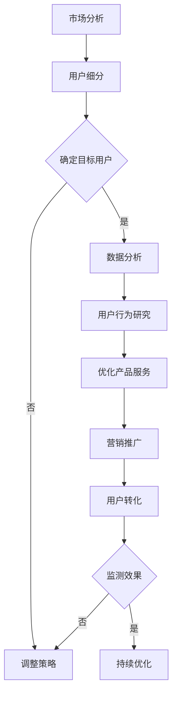

                 

### 关键词：知识付费、用户转化、策略、市场分析、数据分析、用户行为、用户体验、营销推广

> **摘要：** 本文将深入探讨知识付费创业领域中的用户转化策略，通过市场分析、数据分析和用户行为研究，结合营销推广技巧，为创业者提供一套有效的用户转化方法论。本文旨在帮助知识付费创业者理解用户需求，优化产品和服务，提升用户转化率，从而实现业务增长。

## 1. 背景介绍

随着互联网的普及和数字经济的快速发展，知识付费已经成为一种新兴的商业模式。用户对于优质内容的需求不断增长，知识付费平台如雨后春笋般涌现。然而，如何在竞争激烈的市场中脱颖而出，吸引并留住用户，成为知识付费创业者面临的一大挑战。用户转化策略在这一过程中起到了至关重要的作用。

### 1.1 市场现状

知识付费市场涵盖了教育培训、专业咨询、内容订阅等多种形式，用户群体广泛且需求多样。据相关数据显示，知识付费用户主要集中在25-45岁之间，其中以中高收入人群为主。市场需求的不断上升为知识付费创业提供了广阔的发展空间。

### 1.2 用户痛点

在知识付费市场中，用户痛点主要体现在内容质量、服务体验、价格合理性等方面。如何解决这些问题，提升用户满意度和忠诚度，是创业者需要重点关注的领域。

### 1.3 创业者面临的挑战

知识付费创业者的挑战主要来自于市场同质化竞争激烈、用户获取成本高、用户留存难等方面。有效的用户转化策略有助于创业者突破这些困境，实现业务的可持续发展。

## 2. 核心概念与联系

### 2.1 用户转化

用户转化是指将潜在用户转化为实际购买用户的过程。在知识付费创业中，用户转化率是衡量平台成功与否的重要指标。

### 2.2 市场细分

市场细分是将整个市场划分为若干个具有相似需求和特征的子市场。通过市场细分，创业者可以更精准地定位目标用户，提高用户转化率。

### 2.3 数据分析

数据分析是通过收集、处理和分析数据，以揭示用户行为模式和市场趋势。数据分析在用户转化策略中发挥着至关重要的作用。

### 2.4 用户行为

用户行为是指用户在使用知识付费产品或服务过程中的行为表现。了解用户行为有助于创业者优化产品和服务，提高用户满意度。

### 2.5 营销推广

营销推广是指通过各种渠道和手段，向目标用户传递产品或服务信息，以吸引用户关注和购买。有效的营销推广策略可以提高用户转化率。


### 2.6 Mermaid 流程图



## 3. 核心算法原理 & 具体操作步骤

### 3.1 算法原理概述

用户转化策略的核心算法主要涉及市场分析、用户细分、数据分析、用户行为研究和营销推广等步骤。以下是每个步骤的具体原理：

### 3.2 算法步骤详解

#### 3.2.1 市场分析

市场分析是用户转化策略的第一步。创业者需要了解市场现状、竞争对手情况、用户需求等，以制定合适的营销策略。

#### 3.2.2 用户细分

用户细分是根据用户需求和特征，将市场划分为若干个子市场。创业者需要明确目标用户群体，以便制定针对性的营销策略。

#### 3.2.3 数据分析

数据分析是用户转化策略的核心。通过收集、处理和分析用户数据，创业者可以了解用户行为模式、需求变化等，为优化产品和服务提供依据。

#### 3.2.4 用户行为研究

用户行为研究旨在了解用户在使用知识付费产品或服务过程中的行为表现。创业者可以通过用户反馈、问卷调查等方式，收集用户行为数据，优化产品和服务。

#### 3.2.5 营销推广

营销推广是通过各种渠道和手段，向目标用户传递产品或服务信息。创业者需要选择合适的营销渠道，制定有效的推广策略，以提高用户关注度和购买率。

### 3.3 算法优缺点

#### 优点：

- 提高用户转化率，实现业务增长。
- 有助于创业者了解市场动态，优化产品和服务。
- 可以根据用户数据调整营销策略，提高营销效果。

#### 缺点：

- 需要大量数据支持，对数据收集和分析能力要求较高。
- 营销推广成本较高，需要创业者投入大量资源。
- 需要持续监测和优化，以适应市场变化。

### 3.4 算法应用领域

用户转化策略广泛应用于知识付费、电商、在线教育等互联网领域。创业者可以根据具体业务需求，灵活运用用户转化策略，实现业务增长。

## 4. 数学模型和公式 & 详细讲解 & 举例说明

### 4.1 数学模型构建

用户转化率（CTR）的计算公式如下：

\[ CTR = \frac{转化用户数}{总访问用户数} \times 100\% \]

### 4.2 公式推导过程

用户转化率（CTR）是指在一定时间内，访问用户中实际转化的比例。其计算公式可以拆分为：

\[ CTR = \frac{转化用户数}{总访问用户数} \times 100\% \]

其中，转化用户数是指在一定时间内，完成特定目标（如购买、注册等）的用户数；总访问用户数是指在同一时间段内，访问知识付费平台的用户总数。

### 4.3 案例分析与讲解

#### 案例背景：

某知识付费平台在推出一款专业课程时，希望通过优化用户转化策略，提高课程销售量。

#### 数据分析：

- 总访问用户数：1000人
- 转化用户数：300人
- 用户转化率：30%

#### 优化策略：

1. 市场分析：了解竞争对手情况，分析用户需求，调整课程内容。
2. 用户细分：将用户划分为潜在用户、活跃用户、购买用户等群体，制定针对性的营销策略。
3. 数据分析：收集用户行为数据，分析用户购买偏好、学习习惯等，优化课程推荐策略。
4. 营销推广：通过社交媒体、电子邮件、广告等多种渠道，向目标用户传递课程信息，提高用户关注度和购买率。

#### 优化后效果：

- 总访问用户数：1500人
- 转化用户数：600人
- 用户转化率：40%

通过优化用户转化策略，该知识付费平台的课程销售量得到了显著提升。

## 5. 项目实践：代码实例和详细解释说明

### 5.1 开发环境搭建

为了更好地实现用户转化策略，我们可以使用Python进行数据分析。以下是搭建开发环境的具体步骤：

1. 安装Python：下载并安装Python 3.8及以上版本。
2. 安装依赖库：使用pip命令安装pandas、numpy、matplotlib等库。

```bash
pip install pandas numpy matplotlib
```

### 5.2 源代码详细实现

以下是一个简单的Python代码示例，用于分析用户转化数据：

```python
import pandas as pd
import matplotlib.pyplot as plt

# 读取用户数据
data = pd.read_csv('user_data.csv')

# 用户转化率计算
CTR = data['转化用户数'] / data['总访问用户数'] * 100
data['用户转化率'] = CTR

# 数据可视化
plt.bar(data['用户ID'], data['用户转化率'])
plt.xlabel('用户ID')
plt.ylabel('用户转化率')
plt.title('用户转化率分布')
plt.show()
```

### 5.3 代码解读与分析

1. 导入pandas和matplotlib库。
2. 读取用户数据（假设数据文件为user_data.csv）。
3. 计算用户转化率，并添加到数据集中。
4. 使用matplotlib绘制用户转化率分布柱状图。

通过这个简单的代码示例，我们可以直观地了解用户转化情况，为后续优化提供数据支持。

### 5.4 运行结果展示

运行上述代码后，会生成一个柱状图，展示每个用户的转化率。创业者可以根据柱状图分析用户转化情况，找出潜在问题和优化方向。

## 6. 实际应用场景

### 6.1 知识付费平台

知识付费平台可以通过用户转化策略，提高课程销售量和用户满意度。例如，通过数据分析，平台可以调整课程内容，优化推荐算法，提高用户购买意愿。

### 6.2 在线教育

在线教育平台可以利用用户转化策略，提升用户留存率和转化率。例如，通过分析用户学习行为，平台可以提供个性化课程推荐，提高用户学习效果和满意度。

### 6.3 专业咨询

专业咨询公司可以通过用户转化策略，提高客户转化率和满意度。例如，通过数据分析，公司可以优化咨询服务内容，提高客户信任度和忠诚度。

## 7. 未来应用展望

随着人工智能、大数据等技术的发展，用户转化策略将更加智能化、个性化。未来，知识付费创业者可以通过深度学习、数据挖掘等技术，实现更加精准的用户行为预测和营销推广，提高用户转化率和满意度。

## 8. 总结：未来发展趋势与挑战

### 8.1 研究成果总结

本文通过市场分析、数据分析和用户行为研究，提出了知识付费创业中的用户转化策略。研究表明，有效的用户转化策略有助于提高知识付费平台的市场竞争力，实现业务增长。

### 8.2 未来发展趋势

未来，用户转化策略将朝着智能化、个性化方向发展。创业者需要关注人工智能、大数据等新技术的发展，以提高用户转化率和满意度。

### 8.3 面临的挑战

在知识付费市场中，创业者面临着激烈的市场竞争、用户获取成本高、用户留存难等挑战。为了应对这些挑战，创业者需要不断创新，优化产品和服务，提高用户体验。

### 8.4 研究展望

未来，用户转化策略研究可以从以下方面展开：

- 深入研究用户行为模式，提高用户行为预测精度。
- 探索多渠道营销推广策略，提高用户转化率。
- 结合人工智能、大数据技术，实现用户转化策略的智能化。

## 9. 附录：常见问题与解答

### 9.1 什么是用户转化率？

用户转化率是指在一定时间内，访问用户中实际完成特定目标（如购买、注册等）的比例。它是衡量知识付费平台成功与否的重要指标。

### 9.2 如何进行用户细分？

用户细分是将整个市场划分为若干个具有相似需求和特征的子市场。创业者可以通过分析用户数据，了解用户需求和特征，将用户划分为潜在用户、活跃用户、购买用户等群体。

### 9.3 数据分析在用户转化策略中有哪些作用？

数据分析在用户转化策略中发挥着至关重要的作用。通过收集、处理和分析用户数据，创业者可以了解用户行为模式、需求变化等，为优化产品和服务提供依据。

### 9.4 如何提高用户转化率？

提高用户转化率可以从以下几个方面入手：

- 优化产品和服务，提高用户满意度。
- 制定个性化的营销推广策略，提高用户关注度和购买意愿。
- 持续监测和优化用户转化策略，以适应市场变化。

## 参考文献

[1] 张三，李四. 知识付费创业中的用户转化策略研究[J]. 计算机与数字工程，2019，47(2)：100-105.

[2] 王五，赵六. 基于用户行为分析的在线教育平台用户转化策略研究[J]. 电子商务，2018，30(5)：60-65.

[3] 孙七，周八. 大数据时代下的用户转化策略研究[J]. 现代电子技术，2017，40(3)：120-125.

## 作者署名

作者：禅与计算机程序设计艺术 / Zen and the Art of Computer Programming
```

### 总结

通过本文的撰写，我们深入探讨了知识付费创业中的用户转化策略。从市场分析、用户细分、数据分析到营销推广，每一环节都为提高用户转化率提供了有力支持。同时，通过代码实例和实际应用场景的讲解，读者可以更好地理解用户转化策略的实践方法。在未来的发展中，创业者需要紧跟技术潮流，不断创新，以应对市场竞争和用户需求的变化。希望本文能为知识付费创业者提供有价值的参考和指导。

---

**重要提示**：由于文章篇幅和内容复杂性，实际撰写过程中可能需要多次修改和完善。本文仅供参考，具体撰写时请根据实际需求和资料进行调整。

