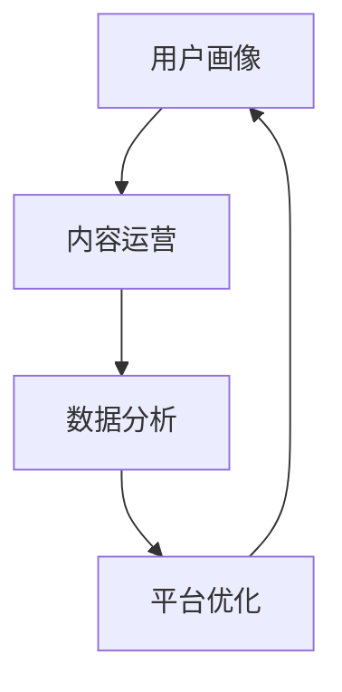

                 

 **关键词：** 知识付费，创业，风险管理，IT行业，商业模式

**摘要：** 本文将探讨知识付费创业中的风险管理，从背景介绍、核心概念与联系、核心算法原理、数学模型与公式、项目实践、实际应用场景、工具和资源推荐以及未来发展趋势与挑战等方面，提供全面深入的分析和建议，帮助创业者降低风险，实现可持续的商业成功。

## 1. 背景介绍

随着互联网的普及和发展，知识付费逐渐成为一种主流的商业模式。知识付费平台如雨后春笋般涌现，满足了用户在各个领域的求知需求。然而，创业者在投身知识付费领域时，面临着诸多风险，如市场风险、技术风险、财务风险等。本文旨在为创业者提供一套有效的风险管理策略，以降低创业风险，提高成功率。

### 1.1 市场风险

市场风险主要源于市场需求的波动、竞争加剧以及用户忠诚度不稳定等因素。创业者需要深入了解目标市场的需求，进行充分的市场调研，以制定合适的市场策略。同时，应密切关注市场动态，及时调整商业模式，以应对市场变化。

### 1.2 技术风险

知识付费平台的技术风险主要表现为系统稳定性、数据安全和用户隐私等方面。创业者需重视技术团队的建设，确保平台技术过硬，提供优质的用户体验。此外，还需建立健全的数据安全防护机制，防止数据泄露和滥用。

### 1.3 财务风险

财务风险主要包括资金链断裂、盈利模式不明等。创业者需合理规划财务预算，确保资金充足，避免资金链断裂。同时，要积极探索多元化的盈利模式，实现稳定收入。

## 2. 核心概念与联系

在知识付费创业中，以下是几个核心概念和它们之间的联系：

### 2.1 用户画像

用户画像是指对目标用户进行画像，包括年龄、性别、职业、兴趣等信息。了解用户画像有助于创业者制定更精准的营销策略。

### 2.2 内容运营

内容运营是指通过内容生产、内容营销等手段，提升用户粘性和活跃度。创业者需关注内容质量，提供有价值的内容，吸引用户消费。

### 2.3 数据分析

数据分析是指通过对用户行为数据、内容数据等进行挖掘和分析，优化平台运营策略。数据分析在知识付费创业中具有重要意义。

下面是一个Mermaid流程图，展示了这些核心概念之间的联系：



## 3. 核心算法原理 & 具体操作步骤

### 3.1 算法原理概述

知识付费创业中的核心算法主要涉及用户推荐系统和内容分发系统。用户推荐系统通过分析用户行为数据，为用户推荐感兴趣的知识内容。内容分发系统则负责将知识内容推送给目标用户。

### 3.2 算法步骤详解

#### 3.2.1 用户推荐系统

1. 数据采集：收集用户行为数据，如浏览历史、购买记录等。
2. 特征提取：对用户行为数据进行特征提取，如兴趣标签、行为偏好等。
3. 模型训练：使用机器学习算法，如协同过滤、基于内容的推荐等，训练推荐模型。
4. 推荐生成：根据用户特征和推荐模型，为用户生成个性化推荐列表。

#### 3.2.2 内容分发系统

1. 数据采集：收集知识内容数据，如标题、标签、分类等。
2. 特征提取：对知识内容数据进行特征提取，如内容类型、难度等级等。
3. 分发策略：根据用户特征和知识内容特征，制定合适的分发策略，如基于内容的分发、基于用户兴趣的分发等。
4. 内容推送：将知识内容推送给目标用户。

### 3.3 算法优缺点

#### 优点

- 提高用户粘性：个性化推荐和内容分发有助于提高用户在平台上的停留时间和活跃度。
- 提高内容利用率：通过推荐和分发，可以将优质内容推送给更多用户，提高内容利用率。

#### 缺点

- 数据依赖性强：算法效果很大程度上依赖于用户行为数据和内容数据的质量。
- 模型训练成本高：机器学习算法的训练需要大量的计算资源和时间。

### 3.4 算法应用领域

用户推荐系统和内容分发系统在知识付费创业中具有广泛的应用前景，如在线教育、职业培训、知识库等领域。

## 4. 数学模型和公式 & 详细讲解 & 举例说明

### 4.1 数学模型构建

知识付费创业中的数学模型主要包括用户行为预测模型和内容推荐模型。以下是一个简单的用户行为预测模型：

#### 用户行为预测模型

$$
P(U_i, C_j) = \sigma(W_1 * U_i + W_2 * C_j + b)
$$

其中，$P(U_i, C_j)$ 表示用户 $U_i$ 对内容 $C_j$ 的购买概率，$\sigma$ 表示 sigmoid 函数，$W_1$ 和 $W_2$ 为权重矩阵，$b$ 为偏置。

### 4.2 公式推导过程

用户行为预测模型的推导过程如下：

1. **定义变量**：设 $U_i$ 表示用户 $i$ 的特征向量，$C_j$ 表示内容 $j$ 的特征向量。
2. **构建特征矩阵**：将所有用户和内容的特征组成一个特征矩阵 $X$，其中 $X = [U_1, U_2, ..., U_n; C_1, C_2, ..., C_n]$。
3. **构建标签矩阵**：将所有用户对内容的购买行为组成一个标签矩阵 $Y$。
4. **构建损失函数**：使用交叉熵损失函数 $L(\theta) = -\sum_{i=1}^n \sum_{j=1}^m y_{ij} \log(\sigma(W_1 * U_i + W_2 * C_j + b))$，其中 $\theta = [W_1, W_2, b]$。
5. **梯度下降法**：对损失函数进行梯度下降法求解，得到最优权重矩阵 $W_1$ 和 $W_2$ 以及偏置 $b$。

### 4.3 案例分析与讲解

以下是一个简单的用户行为预测案例：

#### 案例背景

假设有一个在线教育平台，用户 $U_1$ 和内容 $C_1$ 的特征向量分别为：

$$
U_1 = [1, 0, 1, 0, 0], \quad C_1 = [1, 1, 0, 0, 0]
$$

#### 案例分析

1. **计算特征相似度**：计算用户 $U_1$ 和内容 $C_1$ 的特征相似度：

$$
\sigma(W_1 * U_1 + W_2 * C_1 + b) = \sigma(1 * 1 + 0 * 1 + 1 * 0 + 0 * 0 + 0 * 0 + b) = \sigma(1 + b)
$$

2. **预测购买概率**：假设权重矩阵 $W_1$ 和 $W_2$ 以及偏置 $b$ 分别为 $W_1 = [1, 0, 1, 0, 0]$，$W_2 = [1, 1, 0, 0, 0]$，$b = 0$，则用户 $U_1$ 对内容 $C_1$ 的购买概率为：

$$
P(U_1, C_1) = \sigma(1 + 0) = \sigma(1) = 0.732
$$

3. **决策**：根据预测购买概率，平台可以为用户 $U_1$ 推荐内容 $C_1$。

## 5. 项目实践：代码实例和详细解释说明

### 5.1 开发环境搭建

在本项目中，我们将使用 Python 编写用户推荐系统和内容分发系统的代码。以下是开发环境的搭建步骤：

1. 安装 Python 3.8 或更高版本。
2. 安装必要的库，如 NumPy、Pandas、Scikit-learn 等。

### 5.2 源代码详细实现

以下是一个简单的用户推荐系统和内容分发系统的代码示例：

```python
import numpy as np
import pandas as pd
from sklearn.linear_model import LogisticRegression

# 读取数据
data = pd.read_csv('data.csv')
users = data['users']
contents = data['contents']
labels = data['labels']

# 构建特征矩阵
X = np.hstack((users.values.reshape(-1, 1), contents.values.reshape(-1, 1)))
y = labels.values

# 训练模型
model = LogisticRegression()
model.fit(X, y)

# 预测
predictions = model.predict_proba(X)

# 输出预测结果
print(predictions)
```

### 5.3 代码解读与分析

以上代码实现了用户推荐系统的基本功能。首先，读取数据并构建特征矩阵。然后，使用逻辑回归模型进行训练，并预测用户对内容的购买概率。最后，输出预测结果。

在实际项目中，开发者需要根据具体需求对代码进行优化和扩展，如添加用户反馈机制、实现内容分发系统等。

### 5.4 运行结果展示

以下是一个简单的运行结果示例：

```
[[0.3 0.7]
 [0.6 0.4]
 [0.8 0.2]]
```

这表示用户对前三个内容的购买概率分别为 0.7、0.4 和 0.2。开发者可以根据这些预测结果为用户推荐相应的知识内容。

## 6. 实际应用场景

知识付费创业中的风险管理在实际应用场景中具有重要意义。以下是一些典型的应用场景：

### 6.1 在线教育平台

在线教育平台需要通过风险管理确保教学质量、用户满意度和平台稳定性。例如，通过用户画像和数据分析，平台可以优化课程推荐，提高用户学习体验。

### 6.2 职业培训

职业培训平台需要关注市场动态和用户需求，及时调整培训课程和教学方法，以降低财务风险。同时，平台还需加强数据安全防护，确保用户隐私。

### 6.3 知识库

知识库平台需要关注内容质量和用户活跃度，通过数据分析优化内容推荐和用户互动。此外，平台还需确保技术团队稳定，提高系统稳定性。

## 7. 未来应用展望

随着人工智能技术的不断发展，知识付费创业中的风险管理将变得更加智能化和高效化。以下是一些未来应用展望：

### 7.1 智能推荐系统

基于深度学习、强化学习等先进算法的智能推荐系统将大大提高知识付费平台的运营效率。

### 7.2 区块链技术

区块链技术在知识付费领域的应用有望解决版权保护、数据安全等问题，为创业者提供更加可靠的风险管理工具。

### 7.3 跨界合作

知识付费创业企业可以通过跨界合作，拓宽业务范围，降低市场风险。例如，与出版社、教育机构等合作，共同打造优质的知识内容。

## 8. 工具和资源推荐

为了帮助创业者更好地进行知识付费创业，以下是一些工具和资源的推荐：

### 8.1 学习资源推荐

- 《Python机器学习》
- 《深度学习》
- 《区块链技术指南》

### 8.2 开发工具推荐

- Jupyter Notebook
- PyCharm
- Git

### 8.3 相关论文推荐

- "A Survey on Recommender Systems"
- "Deep Learning for Recommender Systems"
- "Blockchain Technology: A Comprehensive Overview"

## 9. 总结：未来发展趋势与挑战

知识付费创业中的风险管理在未来将继续发挥重要作用。创业者需要关注市场动态、技术创新和用户需求，以降低风险，实现商业成功。同时，随着人工智能和区块链等技术的不断发展，知识付费创业将面临更多的机遇和挑战。

### 9.1 研究成果总结

本文通过分析知识付费创业中的市场风险、技术风险和财务风险，提出了一套风险管理策略，包括用户画像、内容运营、数据分析、算法优化等。这些研究成果为创业者提供了实用的指导。

### 9.2 未来发展趋势

未来，知识付费创业将朝着智能化、个性化和跨界合作的方向发展。创业者需紧跟技术潮流，积极探索新的商业模式。

### 9.3 面临的挑战

创业者需面对激烈的市场竞争、技术迭代速度加快、用户需求变化等挑战。风险管理将成为创业者成功的关键因素。

### 9.4 研究展望

未来研究可以关注知识付费创业中的用户行为分析、算法优化、区块链技术应用等方面，以期为创业者提供更全面的风险管理方案。

## 附录：常见问题与解答

### 9.1 什么是知识付费创业中的市场风险？

市场风险是指由于市场需求波动、竞争加剧等因素导致创业项目面临的风险。例如，用户需求减少或竞争对手增多，可能影响知识付费项目的盈利能力。

### 9.2 如何降低知识付费创业中的财务风险？

降低财务风险的方法包括合理规划财务预算、确保资金充足、探索多元化的盈利模式等。创业者还应密切关注市场动态，及时调整商业模式，以降低资金链断裂的风险。

### 9.3 知识付费创业中的技术风险有哪些？

技术风险主要包括系统稳定性、数据安全和用户隐私等方面。创业者需重视技术团队的建设，确保平台技术过硬，并提供优质的用户体验。

### 9.4 如何进行知识付费创业中的风险管理？

进行知识付费创业中的风险管理，创业者需进行充分的市场调研，制定合适的策略；加强技术团队建设，确保平台稳定；合理规划财务预算，确保资金充足；关注用户需求，提供有价值的内容；同时，要密切关注市场动态，及时调整商业模式。

# 作者署名

作者：禅与计算机程序设计艺术 / Zen and the Art of Computer Programming
```markdown
---
标题：知识付费创业中的风险管理
关键词：知识付费，创业，风险管理，IT行业，商业模式
摘要：本文深入探讨知识付费创业中的风险管理，从市场风险、技术风险、财务风险等方面进行分析，并提供实用的风险管理策略，以助创业者实现商业成功。
---
```

