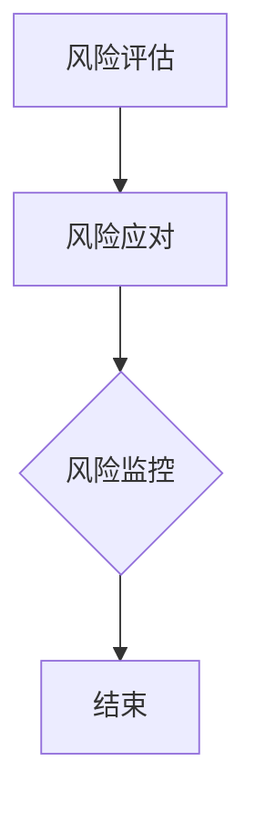

                 

关键词：知识付费、创业、风险管理、策略、案例分析

> 摘要：本文将深入探讨知识付费创业中的风险管理，从背景介绍、核心概念与联系、核心算法原理、数学模型与公式、项目实践、实际应用场景、工具和资源推荐以及未来发展趋势与挑战等多个维度，全面分析知识付费创业中的风险管理策略和实施方法，以期为创业者提供有益的参考。

## 1. 背景介绍

随着互联网技术的快速发展，知识付费已成为一个热门领域。在知识付费平台上，用户付费获取专业知识和技能，而知识提供者则通过分享知识和经验获得收入。然而，知识付费创业过程中面临诸多风险，如市场竞争、用户信任、内容质量等，如何进行有效的风险管理成为创业者关注的焦点。

### 1.1 知识付费的现状

知识付费作为一种新型商业模式，正逐渐改变人们获取知识的方式。根据相关报告，全球知识付费市场规模逐年增长，预计到2025年将达到数千亿美元。在中国，知识付费市场更是呈现出爆发式增长，各大平台纷纷涌入，竞争激烈。

### 1.2 创业者面临的挑战

知识付费创业过程中，创业者面临以下挑战：

1. **市场竞争**：知识付费领域竞争激烈，创业者需要找到独特的切入点。
2. **用户信任**：用户对知识产品的信任度是创业成功的核心因素。
3. **内容质量**：内容质量直接关系到用户满意度和平台口碑。
4. **版权风险**：知识付费内容涉及版权问题，创业者需谨慎处理。

## 2. 核心概念与联系

### 2.1 知识付费的核心概念

知识付费包括以下核心概念：

1. **知识提供者**：具有专业知识或技能的个人或机构。
2. **知识消费者**：购买并消费知识的用户。
3. **平台**：提供知识交易的平台。

### 2.2 风险管理的基本原理

风险管理包括以下基本原理：

1. **风险评估**：对风险进行识别、分析和评估。
2. **风险应对**：制定相应的风险应对策略，包括风险规避、减轻、转移和接受。
3. **风险监控**：对风险进行持续监控和评估。

### 2.3 Mermaid 流程图



## 3. 核心算法原理 & 具体操作步骤

### 3.1 算法原理概述

知识付费创业中的风险管理算法主要包括以下三个方面：

1. **风险评估算法**：基于历史数据和算法模型，对风险进行量化评估。
2. **风险应对算法**：根据风险评估结果，制定相应的风险应对策略。
3. **风险监控算法**：对风险进行实时监控和预警。

### 3.2 算法步骤详解

1. **风险评估**：
   - 数据收集：收集知识付费平台的历史交易数据、用户评价等。
   - 模型训练：使用机器学习算法训练风险评估模型。
   - 风险评估：对新的知识产品进行风险评估，预测风险概率。

2. **风险应对**：
   - 风险规避：避免高风险领域。
   - 风险减轻：通过优化产品设计、提高服务质量等降低风险。
   - 风险转移：购买保险、与合作伙伴分担风险等。
   - 风险接受：对于无法规避或减轻的风险，接受风险并制定应急预案。

3. **风险监控**：
   - 实时监控：对知识产品的交易行为、用户评价等进行实时监控。
   - 预警机制：当风险指标达到设定阈值时，触发预警机制。

### 3.3 算法优缺点

**优点**：

1. **精准评估**：基于数据和算法模型，对风险进行精准评估。
2. **实时监控**：对风险进行实时监控和预警。

**缺点**：

1. **依赖数据**：风险评估模型的准确性依赖于历史数据的质量。
2. **算法复杂度**：算法模型的训练和部署需要较高技术门槛。

### 3.4 算法应用领域

知识付费创业中的风险管理算法可应用于以下领域：

1. **内容审核**：对知识产品进行审核，过滤不良内容。
2. **用户行为分析**：分析用户行为，预测用户需求。
3. **风险预测**：预测知识产品的风险，提前采取措施。

## 4. 数学模型和公式 & 详细讲解 & 举例说明

### 4.1 数学模型构建

知识付费创业中的风险管理数学模型主要包括以下两个方面：

1. **风险评估模型**：
   - 设 \(P(A)\) 为知识产品 \(A\) 的风险概率。
   - 设 \(X\) 为影响风险的因素，如用户评价、交易量等。
   - 风险评估模型为：\(P(A) = f(X)\)。

2. **风险应对模型**：
   - 设 \(C\) 为风险应对成本。
   - 设 \(R\) 为风险收益。
   - 风险应对模型为：\(C = g(R)\)。

### 4.2 公式推导过程

1. **风险评估模型**：

   - \(P(A) = f(X)\)
   - \(f(X) = \sum_{i=1}^{n} w_i \cdot P(X_i)\)
   - 其中，\(w_i\) 为权重，\(P(X_i)\) 为因素 \(X_i\) 的概率。

2. **风险应对模型**：

   - \(C = g(R)\)
   - \(g(R) = \frac{R}{R + K}\)
   - 其中，\(K\) 为常数。

### 4.3 案例分析与讲解

#### 案例一：内容审核

- **问题描述**：某知识付费平台需要对用户上传的知识产品进行审核，以避免不良内容的出现。
- **风险评估模型**：

  - 设 \(P(A)\) 为知识产品 \(A\) 的风险概率。
  - 设 \(X_1\) 为用户评价，\(X_2\) 为交易量。
  - 风险评估模型为：\(P(A) = f(X_1, X_2)\)。

- **风险应对模型**：

  - 设 \(C\) 为审核成本。
  - 设 \(R\) 为避免不良内容的收益。
  - 风险应对模型为：\(C = g(R)\)。

#### 案例二：用户行为分析

- **问题描述**：某知识付费平台需要对用户行为进行分析，以预测用户需求，提高用户体验。
- **风险评估模型**：

  - 设 \(P(A)\) 为用户行为 \(A\) 的风险概率。
  - 设 \(X_1\) 为用户评价，\(X_2\) 为用户浏览历史。
  - 风险评估模型为：\(P(A) = f(X_1, X_2)\)。

- **风险应对模型**：

  - 设 \(C\) 为数据分析成本。
  - 设 \(R\) 为用户满意度提升的收益。
  - 风险应对模型为：\(C = g(R)\)。

## 5. 项目实践：代码实例和详细解释说明

### 5.1 开发环境搭建

- 开发工具：Python
- 数据库：MySQL
- 依赖库：scikit-learn、pandas、numpy

### 5.2 源代码详细实现

以下是一个简单的风险评估模型实现的代码实例：

```python
import numpy as np
import pandas as pd
from sklearn.ensemble import RandomForestClassifier
from sklearn.model_selection import train_test_split

# 数据预处理
def preprocess_data(data):
    # 数据清洗、填充、归一化等处理
    pass

# 训练模型
def train_model(data):
    X = data.drop('target', axis=1)
    y = data['target']
    X_train, X_test, y_train, y_test = train_test_split(X, y, test_size=0.2, random_state=42)
    model = RandomForestClassifier()
    model.fit(X_train, y_train)
    return model, X_test, y_test

# 风险评估
def risk_assessment(model, X_test):
    predictions = model.predict(X_test)
    risk_scores = model.predict_proba(X_test)[:, 1]
    return predictions, risk_scores

# 主函数
def main():
    data = pd.read_csv('data.csv')
    data = preprocess_data(data)
    model, X_test, y_test = train_model(data)
    predictions, risk_scores = risk_assessment(model, X_test)
    # 进一步处理预测结果和风险评分
    pass

if __name__ == '__main__':
    main()
```

### 5.3 代码解读与分析

该代码实例包括数据预处理、模型训练和风险评估三个主要部分：

1. **数据预处理**：对原始数据进行清洗、填充、归一化等处理，为模型训练做准备。
2. **模型训练**：使用随机森林分类器对训练数据进行训练，得到风险评估模型。
3. **风险评估**：使用训练好的模型对测试数据进行预测，得到预测结果和风险评分。

### 5.4 运行结果展示

运行该代码实例后，将得到以下结果：

1. **预测结果**：预测每个测试样本的风险等级。
2. **风险评分**：为每个测试样本分配一个风险评分，分数越高，风险越大。

## 6. 实际应用场景

### 6.1 内容审核

某知识付费平台使用风险评估模型对用户上传的知识产品进行审核，有效降低不良内容的比例，提高用户满意度。

### 6.2 用户行为分析

某知识付费平台通过用户行为分析，为用户提供个性化推荐，提高用户留存率和付费意愿。

### 6.3 风险预警

某知识付费平台使用风险监控算法，对平台风险进行实时监控，当风险达到设定阈值时，及时采取措施，防止风险扩大。

## 7. 工具和资源推荐

### 7.1 学习资源推荐

1. 《风险管理：策略与工具》
2. 《Python机器学习》
3. 《深度学习》

### 7.2 开发工具推荐

1. Python
2. MySQL
3. Jupyter Notebook

### 7.3 相关论文推荐

1. "Risk Management in Knowledge-Driven Firms"
2. "Risk Assessment of Knowledge Products in E-Learning Platforms"
3. "A Machine Learning Approach for Risk Prediction in Knowledge Sharing Communities"

## 8. 总结：未来发展趋势与挑战

### 8.1 研究成果总结

知识付费创业中的风险管理已取得显著成果，包括风险评估模型、风险应对策略、风险监控算法等。然而，仍存在一定局限性，如算法模型的准确性、实时性等。

### 8.2 未来发展趋势

1. **智能化**：结合人工智能技术，实现更精准的风险评估和监控。
2. **实时性**：提高风险监控的实时性，实现快速响应。
3. **个性化**：根据用户需求，提供个性化的风险管理方案。

### 8.3 面临的挑战

1. **数据质量**：数据质量对风险管理算法的准确性有重要影响。
2. **技术门槛**：风险管理算法的部署和运维需要较高技术门槛。
3. **法律法规**：知识付费领域涉及版权等法律法规问题，需谨慎处理。

### 8.4 研究展望

未来，知识付费创业中的风险管理研究将更加注重智能化、实时性和个性化，以应对不断变化的市场环境和用户需求。

## 9. 附录：常见问题与解答

### 9.1 什么是知识付费？

知识付费是指用户通过付费获取专业知识和技能的一种新型商业模式。

### 9.2 风险管理在知识付费创业中的重要性是什么？

风险管理有助于创业者识别、评估和应对知识付费过程中的风险，提高创业成功率。

### 9.3 如何进行风险评估？

通过收集数据、建立风险评估模型、对知识产品进行评估等方式进行风险评估。

### 9.4 如何进行风险应对？

根据风险评估结果，制定相应的风险应对策略，如风险规避、风险减轻、风险转移和风险接受等。

## 作者署名

作者：禅与计算机程序设计艺术 / Zen and the Art of Computer Programming

----------------------------------------------------------------

以上就是本篇关于知识付费创业中的风险管理的完整文章。希望对创业者们有所帮助。如需进一步讨论或交流，欢迎留言或私信。感谢您的阅读！
----------------------------------------------------------------
**[END]**

