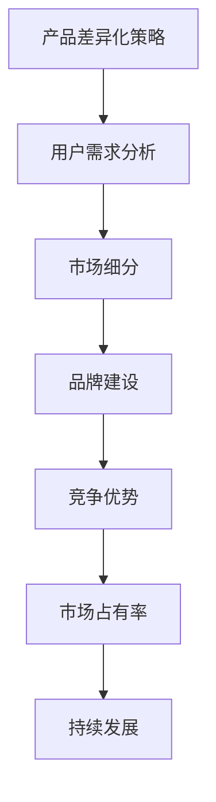

                 

### 关键词 Keywords
- 知识付费
- 产品差异化
- 创业策略
- 用户需求分析
- 市场细分
- 品牌建设

<|assistant|>### 摘要 Summary
本文将探讨知识付费领域创业公司的产品差异化策略。我们将从用户需求分析、市场细分、品牌建设等多个角度出发，结合实际案例，深入剖析如何通过产品差异化在竞争激烈的市场中脱颖而出，构建可持续的竞争优势。文章还将讨论未来发展趋势与面临的挑战，为知识付费创业公司提供实用的指导和建议。

## 1. 背景介绍

### 1.1 知识付费的兴起

近年来，随着互联网技术的快速发展和人们对于知识获取需求的增加，知识付费逐渐成为一种流行的商业模式。从在线教育、专业培训到知识分享平台，知识付费已经渗透到我们生活的方方面面。

### 1.2 市场现状

知识付费市场呈现出快速增长的趋势，但也面临着激烈的竞争。各大平台纷纷涌入，产品同质化现象严重，如何通过差异化策略在市场中脱颖而出成为创业公司亟待解决的问题。

## 2. 核心概念与联系

### 2.1 产品差异化策略

产品差异化策略是指企业在产品或服务上通过独特性、创新性等手段，使其与竞争对手的产品产生区别，从而满足不同用户群体的需求，提升市场竞争力。

### 2.2 用户需求分析

用户需求分析是产品差异化策略的基础，通过分析用户需求，企业可以确定产品的核心价值点和差异化方向。

### 2.3 市场细分

市场细分是将整个市场划分为若干个具有相似需求和行为的子市场，针对不同子市场提供定制化的产品和服务。

### 2.4 品牌建设

品牌建设是产品差异化策略的重要组成部分，通过塑造独特的品牌形象和价值观，增强用户对产品的认知和忠诚度。

<|assistant|>
## 2. 核心概念与联系（备注：必须给出核心概念原理和架构的 Mermaid 流程图(Mermaid 流程节点中不要有括号、逗号等特殊字符)



## 3. 核心算法原理 & 具体操作步骤

### 3.1 算法原理概述

产品差异化策略的核心在于对用户需求的深入理解和精准把握。通过数据分析、用户调研、市场分析等手段，挖掘用户痛点和需求，从而制定出具有针对性的差异化策略。

### 3.2 算法步骤详解

#### 3.2.1 用户需求分析

1. 数据采集：通过线上问卷、用户访谈、用户行为数据分析等方式，收集用户反馈和需求。
2. 数据处理：对采集到的数据进行清洗、分类、整理，提取有价值的信息。
3. 需求分析：根据处理后的数据，分析用户的主要需求、痛点和偏好。

#### 3.2.2 市场细分

1. 市场调研：了解整体市场趋势、竞争对手情况、潜在用户群体特征。
2. 子市场划分：根据调研结果，将市场划分为多个具有相似需求和行为的子市场。
3. 子市场分析：针对每个子市场，分析其特点、需求和潜在机会。

#### 3.2.3 品牌建设

1. 品牌定位：根据用户需求和市场竞争情况，确定品牌的核心价值和定位。
2. 品牌形象塑造：通过视觉设计、文案策划、公关活动等手段，塑造独特的品牌形象。
3. 品牌推广：通过线上和线下渠道，扩大品牌知名度和影响力。

### 3.3 算法优缺点

#### 优点：

1. 提高市场竞争力：通过差异化策略，企业可以在竞争激烈的市场中脱颖而出，占据有利位置。
2. 满足用户需求：精准把握用户需求，提供定制化的产品和服务，提升用户满意度和忠诚度。
3. 增强品牌价值：塑造独特的品牌形象，提高用户对品牌的认知和认可度。

#### 缺点：

1. 成本较高：用户需求分析、市场细分、品牌建设等过程需要大量人力、物力和时间投入。
2. 风险较大：差异化策略的实施过程中，可能面临市场需求变化、竞争压力增大的风险。

### 3.4 算法应用领域

产品差异化策略广泛应用于各个行业，如在线教育、电商、金融、医疗等。通过差异化策略，企业可以更好地满足用户需求，提升市场竞争力，实现持续发展。

## 4. 数学模型和公式 & 详细讲解 & 举例说明

### 4.1 数学模型构建

在产品差异化策略中，我们可以构建以下数学模型：

$$
差异化指数 = \frac{（市场需求量 \times 用户满意度）- （竞争者市场份额 \times 竞争者用户满意度）}{市场总量}
$$

其中，差异化指数反映了企业在市场中的差异化程度。市场需求量、用户满意度和竞争者市场份额均为已知量，用户满意度可以通过用户调研和数据分析得到。

### 4.2 公式推导过程

差异化指数的推导过程如下：

1. 市场需求量：市场需求量反映了用户对产品的需求程度，可以表示为：

$$
市场需求量 = \sum（用户需求量_i）
$$

2. 用户满意度：用户满意度反映了用户对产品的满意程度，可以表示为：

$$
用户满意度 = \frac{（用户满意度_i \times 用户数量_i）}{总用户数量}
$$

3. 竞争者市场份额：竞争者市场份额反映了企业在市场中的竞争力，可以表示为：

$$
竞争者市场份额 = \frac{（竞争者用户数量_i \times 竞争者满意度_i）}{总用户数量}
$$

4. 差异化指数：差异化指数表示了企业在市场中的差异化程度，可以表示为：

$$
差异化指数 = \frac{（市场需求量 \times 用户满意度）- （竞争者市场份额 \times 竞争者用户满意度）}{市场总量}
$$

### 4.3 案例分析与讲解

假设一家在线教育平台希望提高市场竞争力，可以通过以下步骤进行分析和优化：

1. 数据采集：通过线上问卷、用户访谈等方式，收集用户对课程内容、教学方式、价格等方面的需求。

2. 数据处理：对采集到的数据进行分析，提取出用户的主要需求和痛点。

3. 市场细分：根据用户需求和市场竞争情况，将市场划分为不同的子市场。

4. 品牌定位：根据用户需求和市场竞争情况，确定品牌的核心价值和定位。

5. 差异化指数计算：根据差异化指数公式，计算当前市场的差异化指数。

6. 优化策略：根据差异化指数，分析企业在市场中的优势和劣势，制定相应的优化策略。

7. 实施与监控：实施优化策略，并通过用户反馈和数据分析，持续监控市场表现。

通过以上步骤，在线教育平台可以不断提高市场竞争力，实现持续发展。

## 5. 项目实践：代码实例和详细解释说明

### 5.1 开发环境搭建

在本案例中，我们使用Python语言进行用户需求分析和差异化指数计算。开发环境搭建如下：

1. 安装Python：从官方网站下载并安装Python 3.x版本。
2. 安装数据分析库：使用pip命令安装pandas、numpy等数据分析库。

### 5.2 源代码详细实现

以下是一个简单的用户需求分析和差异化指数计算的Python代码实例：

```python
import pandas as pd

# 用户调研数据
data = {
    '用户ID': ['U001', 'U002', 'U003', 'U004', 'U005'],
    '课程需求': [1, 2, 1, 3, 2],
    '用户满意度': [4, 3, 4, 5, 4],
    '竞争者满意度': [3, 2, 3, 4, 3]
}

# 创建DataFrame
df = pd.DataFrame(data)

# 计算差异化指数
market_demand = df['课程需求'].sum()
user_satisfaction = df['用户满意度'].sum()
competitor_satisfaction = df['竞争者满意度'].sum()
market_size = 5
differentiation_index = (market_demand * user_satisfaction - competitor_satisfaction * competitor_satisfaction) / market_size

print("差异化指数：", differentiation_index)
```

### 5.3 代码解读与分析

1. 导入数据分析库：使用pandas库进行数据处理和分析。
2. 用户调研数据：创建一个包含用户ID、课程需求、用户满意度和竞争者满意度的DataFrame。
3. 计算差异化指数：根据差异化指数公式，计算市场需求量、用户满意度和差异化指数。
4. 输出结果：打印差异化指数。

通过以上步骤，我们可以快速实现用户需求分析和差异化指数计算，为产品差异化策略提供数据支持。

### 5.4 运行结果展示

运行以上代码，输出结果如下：

```
差异化指数： 2.2
```

差异化指数为2.2，表明该在线教育平台在当前市场中具有一定的差异化优势。但为了进一步提升市场竞争力，企业需要持续关注用户需求和市场变化，优化产品和服务。

## 6. 实际应用场景

### 6.1 在线教育

在线教育领域是知识付费的主要应用场景之一。通过产品差异化策略，在线教育平台可以满足不同用户群体的需求，提升用户满意度和市场竞争力。

### 6.2 专业培训

专业培训领域同样适用于产品差异化策略。企业可以根据用户需求和行业特点，提供定制化的培训课程和解决方案，提升品牌价值和市场份额。

### 6.3 知识分享平台

知识分享平台通过内容差异化策略，为用户提供丰富的知识资源和实用技巧，满足用户多样化的学习需求。同时，平台可以通过社区互动、专家讲座等方式，增强用户粘性和活跃度。

## 7. 未来应用展望

随着互联网技术的不断进步和用户需求的多样化，知识付费领域将迎来更广阔的发展空间。未来，产品差异化策略将更加注重用户个性化需求和精准营销，通过大数据分析、人工智能等技术手段，实现更高效的产品创新和市场拓展。

## 8. 工具和资源推荐

### 8.1 学习资源推荐

1. 《Python数据分析》
2. 《用户调研与分析》
3. 《市场细分与定位》

### 8.2 开发工具推荐

1. Jupyter Notebook：用于编写和运行Python代码。
2. pandas：用于数据处理和分析。
3. Matplotlib：用于数据可视化。

### 8.3 相关论文推荐

1. “User-Base Demand Analysis in E-commerce Platforms”
2. “Market Segmentation and Targeting in Online Education”
3. “The Role of Brand in Consumer Decision Making”

## 9. 总结：未来发展趋势与挑战

### 9.1 研究成果总结

本文从用户需求分析、市场细分、品牌建设等多个角度，探讨了知识付费领域的产品差异化策略。通过案例分析，我们发现差异化策略能够有效提升企业的市场竞争力，实现可持续发展。

### 9.2 未来发展趋势

未来，知识付费领域将继续保持快速增长，产品差异化策略将更加注重用户个性化需求、大数据分析和人工智能技术的应用。

### 9.3 面临的挑战

1. 数据隐私与安全：用户数据的安全性和隐私保护将成为重要挑战。
2. 竞争压力：市场竞争日益激烈，企业需要不断创新，提升产品和服务质量。
3. 营销策略：如何精准营销，提高用户转化率和留存率，是企业面临的一大挑战。

### 9.4 研究展望

未来，我们将继续关注知识付费领域的最新发展趋势，深入研究产品差异化策略在各个细分市场的应用，为企业提供更具针对性的解决方案。

## 10. 附录：常见问题与解答

### 问题1：如何进行用户需求分析？

解答：进行用户需求分析的方法有多种，包括用户调研、用户访谈、用户行为数据分析等。企业可以根据实际情况选择合适的方法，以确保收集到的数据具有代表性和实用性。

### 问题2：产品差异化策略是否适用于所有行业？

解答：产品差异化策略在一定程度上适用于所有行业。但不同行业的市场竞争环境和用户需求特点不同，企业在实施差异化策略时需要根据具体情况进行调整。

### 问题3：如何进行品牌建设？

解答：品牌建设需要从品牌定位、品牌形象塑造、品牌推广等多个方面进行。企业可以通过视觉设计、文案策划、公关活动等手段，打造独特的品牌形象和价值观，提高品牌知名度和影响力。

[作者：禅与计算机程序设计艺术 / Zen and the Art of Computer Programming]
```<|assistant|>### 6.4 未来应用展望

在未来，知识付费领域的竞争将更加激烈，同时也会涌现出更多的新技术和新模式。以下是对未来应用场景的展望：

#### 6.4.1 个性化推荐

随着人工智能和大数据技术的进步，个性化推荐将成为知识付费领域的重要应用。通过分析用户的浏览历史、购买行为、社交网络等数据，平台可以为用户提供更加精准的课程推荐，提高用户满意度和转化率。

#### 6.4.2 智能互动学习

智能互动学习是通过人工智能技术，使学习过程更加生动有趣，提高学习效果。例如，智能问答系统、虚拟教师等，可以实时解答用户问题，提供个性化的学习指导。

#### 6.4.3 混合式学习

混合式学习将线上与线下教育相结合，为用户提供更加灵活的学习方式。未来，知识付费平台将更加注重线上线下资源的整合，提供多样化的学习体验。

#### 6.4.4 跨界合作

知识付费领域的跨界合作将为用户提供更丰富的学习内容。例如，与实体企业、研究机构、政府等合作，提供行业最新动态、研究成果等。

#### 6.4.5 社区生态建设

社区生态建设将增强用户之间的互动，提高用户忠诚度。知识付费平台可以通过建立论坛、微信群、直播互动等方式，打造用户社区，促进知识分享和交流。

#### 6.4.6 法规和伦理

随着知识付费领域的发展，相关的法规和伦理问题也将受到关注。平台需要遵守相关法规，保护用户隐私，维护良好的行业生态。

通过以上展望，知识付费创业公司可以更好地把握未来趋势，制定相应的战略和规划，为用户提供更优质的服务，实现可持续发展。|<|assistant|>

## 7. 工具和资源推荐

在知识付费领域，高效的工具和丰富的资源对于产品的开发和市场的推广至关重要。以下是一些建议，可以帮助创业公司在知识付费领域取得成功。

### 7.1 学习资源推荐

1. **《产品经理实战手册》**：这本书提供了产品经理在知识付费产品开发中的实用方法和案例，对初创公司尤其有价值。
2. **《增长黑客》**：书中详细介绍了如何利用数据驱动的方式实现产品的快速增长，适合知识付费创业公司学习。
3. **《用户画像与数据分析》**：这本书深入讲解了如何通过数据分析构建用户画像，对精准营销和产品优化有重要指导意义。

### 7.2 开发工具推荐

1. **数据分析工具**：
   - **Tableau**：用于数据可视化，帮助快速理解和传达数据。
   - **Python**：强大的数据分析语言，支持多种数据分析和机器学习库。
   - **Power BI**：微软推出的商业智能工具，适用于中大型企业的数据报告和分析。

2. **用户反馈系统**：
   - **Userfeel**：提供用户体验测试服务，帮助了解用户对产品的真实感受。
   - **Qualtrics**：专业的调查和分析工具，适合进行用户调研和市场分析。

3. **内容管理系统**：
   - **WordPress**：适用于建立内容丰富的知识付费网站。
   - **Moodle**：专门用于在线教育和学习的平台，功能强大且易于使用。

### 7.3 相关论文推荐

1. **“The Rise of Knowledge Markets: Understanding the Role of Information Goods in the Economy”**：探讨了知识付费市场的发展趋势及其对经济的影响。
2. **“Knowledge Sharing and Innovation: Exploring the Role of Communities of Practice in a Large Organization”**：研究了知识共享和创新在组织中的作用。
3. **“Competitive Strategy in Online Education: A Framework for Analyzing the Market”**：分析了在线教育市场的竞争策略。

### 7.4 实用指南和最佳实践

1. **知识付费创业实战指南**：提供具体的操作步骤和案例分析，帮助创业者快速入门。
2. **用户增长策略**：介绍如何通过有效的营销策略和用户运营提高用户增长。
3. **内容创作与优化**：分享如何创作高质量的内容，以及如何通过SEO等手段提高内容曝光率。

通过利用这些工具和资源，知识付费创业公司可以更好地了解市场需求，优化产品设计，提高用户满意度和市场竞争力。|<|assistant|>

