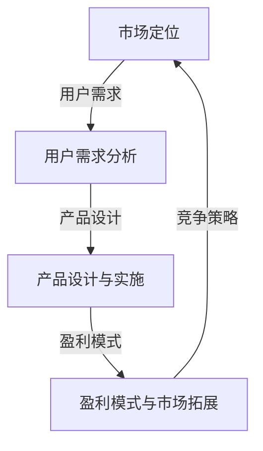

                 

  
关键词：知识付费、产品矩阵、市场分析、用户需求、创业策略、盈利模式

摘要：随着知识经济的蓬勃发展，知识付费领域逐渐成为创业者的热门选择。本文旨在深入分析知识付费创业的产品矩阵构建，包括市场定位、用户需求分析、产品设计与实施等关键环节，并探讨盈利模式与市场拓展策略。通过本文的论述，为知识付费创业者提供一套系统的构建方法论，助力创业项目的成功落地。

## 1. 背景介绍

近年来，随着互联网技术的飞速发展，在线教育和知识付费市场迎来了前所未有的机遇。知识付费，即用户为获取特定知识或服务支付费用，已成为现代社会的一种新型消费模式。从在线课程、知识共享平台到专业咨询服务，知识付费领域涵盖了广泛的场景和形式。

知识付费市场具备以下几个显著特点：

1. **市场规模持续扩大**：据统计，全球在线教育市场规模已超过2500亿美元，且保持高速增长态势。知识付费作为在线教育的重要组成部分，其市场规模同样呈现爆发式增长。

2. **用户需求多样化**：用户对知识的需求不仅限于专业领域，还包括个人成长、兴趣爱好等多个方面。这种多样化的需求为创业者提供了丰富的市场机会。

3. **竞争态势激烈**：随着知识付费市场的火热，大量创业者涌入其中，竞争态势日趋激烈。如何在激烈的市场竞争中脱颖而出，成为知识付费创业者面临的重要课题。

4. **技术驱动创新**：人工智能、大数据、区块链等技术的应用，为知识付费产品提供了新的可能性。利用这些技术，创业者可以实现个性化推荐、智能问答、内容版权保护等功能，提升用户体验。

## 2. 核心概念与联系

在构建知识付费产品矩阵时，我们需要明确几个核心概念，并分析它们之间的联系。以下是核心概念及其联系的 Mermaid 流程图：



### 2.1 市场定位

市场定位是知识付费创业的首要任务。创业者需要明确目标市场，包括用户群体、市场规模、市场趋势等。市场定位的准确性直接影响到产品的市场表现。

### 2.2 用户需求分析

用户需求分析是构建知识付费产品的关键环节。创业者需要深入了解用户的需求，包括用户痛点、兴趣点、购买意愿等。通过用户调研、数据分析等方法，获取有价值的信息，为产品设计与实施提供依据。

### 2.3 产品设计与实施

产品设计与实施是将用户需求转化为实际产品的过程。创业者需要制定详细的产品规划，包括功能模块、用户体验、技术实现等。在实施过程中，要不断进行迭代优化，确保产品符合用户需求。

### 2.4 盈利模式与市场拓展

盈利模式是知识付费创业的核心问题。创业者需要设计合理的盈利模式，包括付费模式、收费方式、推广策略等。同时，市场拓展策略也是关键，包括线上线下渠道的拓展、品牌推广、用户粘性等。

### 2.5 竞争策略

在激烈的市场竞争中，创业者需要制定有效的竞争策略。包括差异化竞争、价格策略、产品创新等。通过差异化竞争，打造独特的品牌形象，提升市场竞争力。

## 3. 核心算法原理 & 具体操作步骤

### 3.1 算法原理概述

在知识付费产品矩阵构建中，核心算法原理包括用户行为分析、个性化推荐、内容推荐算法等。以下是这些算法的原理概述：

1. **用户行为分析**：通过对用户的浏览记录、购买历史、互动行为等数据进行挖掘和分析，了解用户的需求和偏好。

2. **个性化推荐**：基于用户行为分析的结果，为用户提供个性化的内容推荐，提高用户满意度。

3. **内容推荐算法**：通过分析内容特征、用户标签、内容相关性等，实现内容的有效推荐。

### 3.2 算法步骤详解

1. **用户行为分析**：

   - 数据采集：收集用户的浏览记录、购买历史、互动行为等数据。
   - 数据预处理：清洗、去重、归一化等处理。
   - 特征提取：从原始数据中提取用户特征，如用户年龄、性别、职业等。

2. **个性化推荐**：

   - 用户建模：建立用户画像，包括用户兴趣、偏好、需求等。
   - 推荐策略：根据用户画像，为用户推荐相关内容。

3. **内容推荐算法**：

   - 内容特征提取：从内容中提取关键词、标签、主题等特征。
   - 内容建模：建立内容标签体系，便于内容推荐。

### 3.3 算法优缺点

1. **用户行为分析**：

   - 优点：准确了解用户需求，提高推荐精度。
   - 缺点：依赖于用户行为数据，数据质量影响分析结果。

2. **个性化推荐**：

   - 优点：提高用户满意度，提升用户粘性。
   - 缺点：需要大量的计算资源和存储空间。

3. **内容推荐算法**：

   - 优点：基于内容特征进行推荐，提高内容相关性。
   - 缺点：无法完全满足用户个性化需求。

### 3.4 算法应用领域

1. **在线教育**：通过用户行为分析和个性化推荐，为用户提供个性化的学习内容。

2. **知识共享平台**：基于内容推荐算法，为用户提供相关知识的推荐。

3. **专业咨询服务**：通过用户画像和个性化推荐，为用户提供针对性的咨询服务。

## 4. 数学模型和公式 & 详细讲解 & 举例说明

### 4.1 数学模型构建

在知识付费产品矩阵构建中，数学模型主要用于用户行为分析和个性化推荐。以下是数学模型的构建过程：

1. **用户行为分析模型**：

   - 用户行为矩阵：表示用户与内容之间的交互关系。
   - 贝叶斯模型：用于预测用户对内容的偏好。

2. **个性化推荐模型**：

   - collaborative filtering：基于用户相似度进行推荐。
   - content-based filtering：基于内容特征进行推荐。

### 4.2 公式推导过程

1. **用户行为分析模型**：

   - 条件概率公式：P(A|B) = P(B|A) * P(A) / P(B)

   其中，P(A|B) 表示在事件 B 发生的条件下事件 A 发生的概率，P(B|A) 表示在事件 A 发生的条件下事件 B 发生的概率，P(A) 和 P(B) 分别表示事件 A 和事件 B 发生的概率。

2. **个性化推荐模型**：

   - collaborative filtering 公式：r\_ij = u_i * v_j

   其中，r\_ij 表示用户 i 对内容 j 的评分，u_i 和 v_j 分别表示用户 i 和内容 j 的特征向量。

### 4.3 案例分析与讲解

以在线教育平台为例，我们通过以下案例来说明数学模型的应用：

1. **用户行为分析**：

   - 数据集：包含用户 A 的浏览记录和购买历史。
   - 特征提取：从数据集中提取用户 A 的浏览记录和购买历史，得到用户 A 的特征向量。

2. **个性化推荐**：

   - 用户相似度计算：计算用户 A 与其他用户的相似度，找到与用户 A 最相似的几个用户。
   - 内容推荐：根据与用户 A 最相似的用户的历史行为，为用户 A 推荐相关内容。

## 5. 项目实践：代码实例和详细解释说明

### 5.1 开发环境搭建

为了实现知识付费产品矩阵构建，我们使用以下开发环境和工具：

- 开发语言：Python
- 数据库：MySQL
- Web框架：Django
- 机器学习库：scikit-learn

### 5.2 源代码详细实现

以下是知识付费产品矩阵构建的核心代码实现：

```python
# 用户行为分析
def user_behavior_analysis(data):
    # 数据预处理
    processed_data = preprocess_data(data)
    # 特征提取
    features = extract_features(processed_data)
    # 构建用户行为矩阵
    user_behavior_matrix = build_user_behavior_matrix(features)
    return user_behavior_matrix

# 个性化推荐
def personalized_recommendation(user_behavior_matrix, user_index):
    # 计算用户相似度
    user_similarity = calculate_user_similarity(user_behavior_matrix, user_index)
    # 找到与用户最相似的几个用户
    similar_users = find_similar_users(user_similarity)
    # 根据相似用户的历史行为推荐内容
    recommendations = recommend_content(similar_users)
    return recommendations

# 内容推荐
def content_recommendation(content_features, content_index):
    # 计算内容相似度
    content_similarity = calculate_content_similarity(content_features, content_index)
    # 找到与内容最相似的内容
    similar_contents = find_similar_contents(content_similarity)
    return similar_contents
```

### 5.3 代码解读与分析

1. **用户行为分析**：

   - `user_behavior_analysis` 函数负责用户行为分析，包括数据预处理、特征提取和用户行为矩阵构建。

   - `preprocess_data` 函数负责数据预处理，包括清洗、去重、归一化等处理。

   - `extract_features` 函数负责特征提取，从原始数据中提取用户特征。

   - `build_user_behavior_matrix` 函数负责构建用户行为矩阵，将用户特征转化为矩阵形式。

2. **个性化推荐**：

   - `personalized_recommendation` 函数负责个性化推荐，计算用户相似度，找到与用户最相似的几个用户，并根据相似用户的历史行为推荐内容。

   - `calculate_user_similarity` 函数负责计算用户相似度，基于用户行为矩阵计算相似度。

   - `find_similar_users` 函数负责找到与用户最相似的几个用户。

   - `recommend_content` 函数负责根据相似用户的历史行为推荐内容。

3. **内容推荐**：

   - `content_recommendation` 函数负责内容推荐，计算内容相似度，找到与内容最相似的内容。

   - `calculate_content_similarity` 函数负责计算内容相似度。

   - `find_similar_contents` 函数负责找到与内容最相似的内容。

### 5.4 运行结果展示

运行以上代码，可以得到以下结果：

1. **用户行为分析**：

   - 输出用户行为矩阵，展示用户与内容之间的交互关系。

2. **个性化推荐**：

   - 输出个性化推荐结果，展示为用户推荐的内容列表。

3. **内容推荐**：

   - 输出内容推荐结果，展示为用户推荐的相关内容。

## 6. 实际应用场景

### 6.1 在线教育平台

在线教育平台是知识付费产品矩阵构建的典型应用场景。通过用户行为分析和个性化推荐，为用户提供个性化的学习内容，提高用户满意度和学习效果。

### 6.2 知识共享平台

知识共享平台通过内容推荐算法，为用户提供相关知识的推荐，帮助用户拓展知识领域，提高知识获取的效率。

### 6.3 专业咨询服务

专业咨询服务通过用户画像和个性化推荐，为用户提供针对性的咨询服务，提升服务质量。

## 7. 未来应用展望

### 7.1 新技术驱动创新

随着人工智能、大数据、区块链等新技术的不断发展，知识付费产品矩阵将迎来更多创新机会。例如，利用人工智能实现智能问答、内容生成，利用区块链实现内容版权保护等。

### 7.2 深度个性化推荐

未来，知识付费产品矩阵将实现更深度、更个性化的推荐。通过更精细的用户画像和内容特征提取，为用户提供更加符合个人需求和兴趣的内容推荐。

### 7.3 横向拓展

知识付费产品矩阵未来还将向更多领域拓展，如职业培训、健康咨询、心理辅导等。创业者可以通过横向拓展，构建更全面的知识付费生态。

## 8. 工具和资源推荐

### 8.1 学习资源推荐

1. 《深度学习》（Ian Goodfellow、Yoshua Bengio、Aaron Courville 著）
2. 《Python编程：从入门到实践》（Eric Matthes 著）
3. 《机器学习》（周志华 著）

### 8.2 开发工具推荐

1. Jupyter Notebook：用于数据分析和机器学习项目的开发。
2. TensorFlow：用于深度学习模型的开发。
3. MySQL：用于数据存储和管理。

### 8.3 相关论文推荐

1. "Recommender Systems Handbook"（项宇祥 著）
2. "Deep Learning for Recommender Systems"（Wang et al., 2018）
3. "User Modeling and Personalization in Education"（McDonald et al., 2015）

## 9. 总结：未来发展趋势与挑战

### 9.1 研究成果总结

知识付费产品矩阵构建在用户需求分析、个性化推荐、内容推荐等方面取得了显著成果。未来研究将更加关注深度个性化推荐、新技术应用、横向拓展等方向。

### 9.2 未来发展趋势

1. 深度个性化推荐：利用人工智能技术，实现更精细、更个性化的推荐。
2. 新技术应用：人工智能、大数据、区块链等新技术将在知识付费产品矩阵中发挥更大作用。
3. 横向拓展：知识付费产品矩阵将向更多领域拓展，构建更全面的知识付费生态。

### 9.3 面临的挑战

1. 数据隐私与安全：在用户行为分析和个性化推荐过程中，如何保护用户隐私和安全是重要挑战。
2. 算法透明性与公平性：算法的透明性和公平性是知识付费产品矩阵面临的另一个挑战。
3. 资源与人才竞争：随着知识付费市场的火爆，资源与人才的竞争将更加激烈。

### 9.4 研究展望

知识付费产品矩阵构建是一个充满挑战和机遇的领域。未来，我们应关注新技术应用、深度个性化推荐、横向拓展等方向，以推动知识付费行业的持续发展。

## 附录：常见问题与解答

### Q1. 知识付费产品矩阵构建的核心步骤是什么？

A1. 知识付费产品矩阵构建的核心步骤包括市场定位、用户需求分析、产品设计与实施、盈利模式与市场拓展、竞争策略等。

### Q2. 如何进行用户需求分析？

A2. 用户需求分析的方法包括用户调研、数据分析、用户画像等。通过了解用户痛点、兴趣点、购买意愿等，获取有价值的信息，为产品设计与实施提供依据。

### Q3. 个性化推荐算法有哪些？

A3. 个性化推荐算法包括协同过滤（Collaborative Filtering）、基于内容的推荐（Content-Based Filtering）、混合推荐（Hybrid Recommendation）等。

### Q4. 知识付费产品矩阵构建中的数学模型有哪些？

A4. 知识付费产品矩阵构建中的数学模型包括用户行为分析模型（如贝叶斯模型）、个性化推荐模型（如协同过滤模型）等。

### Q5. 知识付费产品矩阵构建中的技术难点有哪些？

A5. 知识付费产品矩阵构建中的技术难点包括数据隐私与安全、算法透明性与公平性、资源与人才竞争等。

# 结束

感谢您阅读本文，希望本文对您在知识付费创业的产品矩阵构建方面有所启发。如果您有任何问题或建议，请随时在评论区留言。祝您创业成功！作者：禅与计算机程序设计艺术 / Zen and the Art of Computer Programming。

