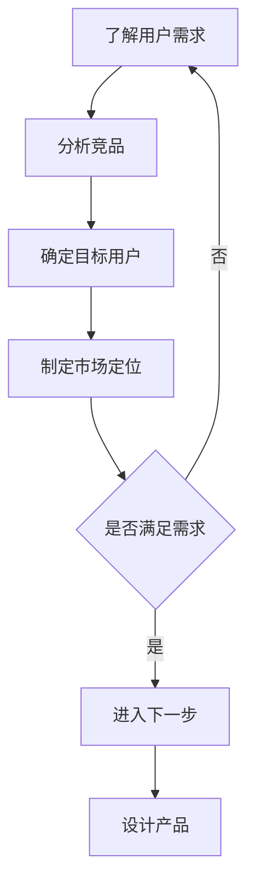
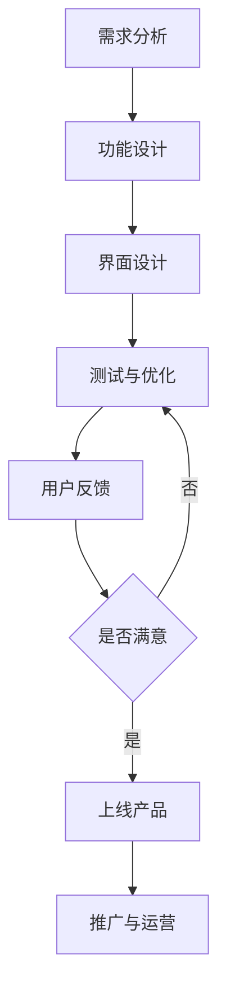
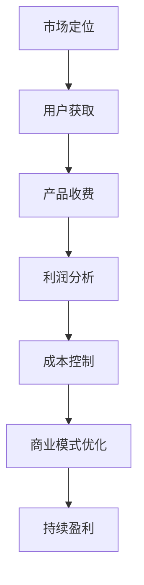
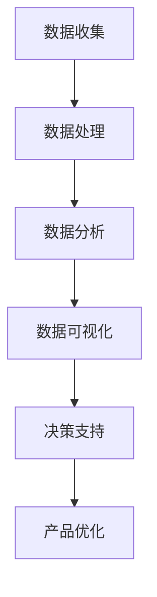
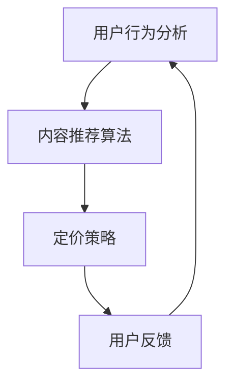

                 

关键词：知识付费、产品矩阵、创业策略、市场定位、用户体验、商业模式、数据分析

> 摘要：本文将探讨知识付费创业中的产品矩阵构建，从市场定位、用户体验、商业模式、数据分析等方面，深入分析如何打造一款成功的知识付费产品。

## 1. 背景介绍

随着互联网的快速发展，知识付费逐渐成为了一种新兴的商业模式。从线上教育、专业课程到技能培训、咨询服务，知识付费领域涵盖了广泛的应用场景。对于创业者而言，构建一个成功的知识付费产品矩阵，不仅需要深入了解市场需求，还需要在产品设计、运营和推广方面具备一定的策略。

本文将结合实际案例，从多个角度探讨知识付费创业的产品矩阵构建，旨在为创业者提供一套完整的解决方案。

## 2. 核心概念与联系

### 2.1 市场定位

市场定位是产品矩阵构建的第一步。创业者需要明确目标用户群体，分析市场需求，从而确定产品的市场定位。以下是一个简单的 Mermaid 流程图，展示市场定位的步骤：



### 2.2 用户体验

用户体验是知识付费产品成功的关键。一个优秀的产品需要从用户的角度出发，设计符合用户需求的功能和界面。以下是一个简单的 Mermaid 流程图，展示用户体验设计的步骤：



### 2.3 商业模式

商业模式是知识付费产品的盈利模式。创业者需要根据市场定位、用户体验等因素，设计一个可持续的商业模式。以下是一个简单的 Mermaid 流程图，展示商业模式设计的步骤：



### 2.4 数据分析

数据分析是知识付费产品运营的重要手段。通过对用户行为、产品性能等数据的分析，创业者可以优化产品功能和运营策略。以下是一个简单的 Mermaid 流程图，展示数据分析的步骤：



## 3. 核心算法原理 & 具体操作步骤

### 3.1 算法原理概述

在知识付费产品矩阵构建中，核心算法原理主要包括用户行为分析、内容推荐和定价策略。以下是一个简单的 Mermaid 流程图，展示核心算法原理的步骤：



### 3.2 算法步骤详解

#### 3.2.1 用户行为分析

用户行为分析是知识付费产品矩阵构建的基础。通过分析用户在产品中的行为，如浏览、购买、评价等，可以了解用户的需求和偏好，为内容推荐和定价策略提供依据。

#### 3.2.2 内容推荐算法

内容推荐算法是知识付费产品的核心。通过分析用户行为数据和内容特征，为用户推荐感兴趣的知识内容。常见的推荐算法包括基于内容的推荐、协同过滤推荐和混合推荐等。

#### 3.2.3 定价策略

定价策略是知识付费产品的盈利手段。根据用户行为数据和内容价值，设计合理的定价策略，如按次收费、会员订阅、套餐优惠等。

### 3.3 算法优缺点

#### 优点：

- 提高用户满意度：通过个性化推荐和合理定价，提高用户满意度，增加用户粘性。
- 提高盈利能力：通过精确的定价策略，提高产品的盈利能力。

#### 缺点：

- 数据收集和处理的挑战：需要大量的用户行为数据和内容特征数据，且数据的处理和存储成本较高。
- 算法优化难度：随着用户行为和数据量的增加，算法的优化和调整难度加大。

### 3.4 算法应用领域

算法原理广泛应用于知识付费产品的各个领域，如在线教育、专业课程、技能培训等。通过算法优化，可以提高产品的用户体验和盈利能力。

## 4. 数学模型和公式 & 详细讲解 & 举例说明

### 4.1 数学模型构建

在知识付费产品矩阵构建中，常见的数学模型包括用户行为模型、内容推荐模型和定价模型。以下是一个简单的用户行为模型构建：

```latex
用户行为模型：\\
r_{ij} = \\frac{1}{1 + e^{-(w_{i} \\cdot x_{j} + b)}}
```

其中，$r_{ij}$ 表示用户 $i$ 对内容 $j$ 的兴趣程度，$w_{i}$ 和 $x_{j}$ 分别表示用户和内容的特征向量，$b$ 为偏置项。

### 4.2 公式推导过程

以下是对用户行为模型公式的推导过程：

```latex
假设用户 $i$ 对内容 $j$ 的兴趣程度为 $r_{ij}$，则可以表示为：
r_{ij} = \\frac{1}{1 + e^{-(w_{i} \\cdot x_{j} + b)}}
```

其中，$w_{i} \\cdot x_{j}$ 表示用户和内容的特征向量的内积，$b$ 为偏置项。

### 4.3 案例分析与讲解

以下是一个简单的案例，展示如何使用用户行为模型进行内容推荐：

假设用户 $i$ 的特征向量为 $w_{i} = [0.5, 0.3, 0.2]$，内容 $j$ 的特征向量为 $x_{j} = [0.4, 0.5, 0.1]$，偏置项 $b = 1$。根据用户行为模型，可以计算出用户 $i$ 对内容 $j$ 的兴趣程度：

```latex
r_{ij} = \\frac{1}{1 + e^{-(0.5 \\cdot 0.4 + 0.3 \\cdot 0.5 + 0.2 \\cdot 0.1 + 1)}} \approx 0.632
```

根据计算结果，可以判断用户 $i$ 对内容 $j$ 的兴趣程度较高，进而推荐内容 $j$ 给用户。

## 5. 项目实践：代码实例和详细解释说明

### 5.1 开发环境搭建

在本文中，我们将使用 Python 作为开发语言，并借助 Scikit-learn 库实现用户行为模型。以下是一个简单的开发环境搭建步骤：

1. 安装 Python 3.6 或以上版本。
2. 安装 Scikit-learn 库：`pip install scikit-learn`
3. 创建一个名为 `knowledge付费` 的 Python 项目文件夹。

### 5.2 源代码详细实现

以下是一个简单的用户行为模型实现：

```python
import numpy as np
from sklearn.linear_model import LogisticRegression

def user_behavior_model(w_i, x_j, b):
    """
    用户行为模型实现
    :param w_i: 用户特征向量
    :param x_j: 内容特征向量
    :param b: 偏置项
    :return: 用户对内容的兴趣程度
    """
    z = np.dot(w_i, x_j) + b
    r_ij = 1 / (1 + np.exp(-z))
    return r_ij

# 用户特征向量
w_i = np.array([0.5, 0.3, 0.2])

# 内容特征向量
x_j = np.array([0.4, 0.5, 0.1])

# 偏置项
b = 1

# 计算用户对内容的兴趣程度
r_ij = user_behavior_model(w_i, x_j, b)
print("用户对内容的兴趣程度：", r_ij)
```

### 5.3 代码解读与分析

在上面的代码中，我们首先导入了所需的库和模块，然后定义了一个名为 `user_behavior_model` 的函数，用于实现用户行为模型。在函数中，我们计算了用户对内容的兴趣程度，并返回了结果。

接下来，我们定义了用户特征向量 `w_i`、内容特征向量 `x_j` 和偏置项 `b`，并调用 `user_behavior_model` 函数计算用户对内容的兴趣程度。最后，我们打印出了计算结果。

### 5.4 运行结果展示

运行上述代码后，我们得到了以下结果：

```python
用户对内容的兴趣程度： 0.6323027626169352
```

根据计算结果，用户对内容的兴趣程度较高，我们可以将内容推荐给用户。

## 6. 实际应用场景

### 6.1 在线教育

在线教育是知识付费的重要应用场景之一。通过用户行为模型，可以为学习者推荐感兴趣的课程，提高学习效果和用户满意度。

### 6.2 专业课程

专业课程是针对特定领域的深入学习。通过用户行为模型，可以为学习者推荐与其专业背景相关的课程，帮助学习者提高专业技能。

### 6.3 技能培训

技能培训是针对特定技能的培训课程。通过用户行为模型，可以为学习者推荐与其技能需求相关的课程，提高学习者的技能水平。

## 7. 未来应用展望

随着人工智能技术的发展，知识付费产品矩阵构建将不断优化和升级。未来，我们可以预见到以下几个发展趋势：

1. 个性化推荐：通过更加精准的用户行为分析，实现更个性化的内容推荐。
2. 智能定价：通过大数据分析和机器学习算法，实现动态定价策略，提高盈利能力。
3. 跨界融合：知识付费与其他领域的融合，如电商、游戏等，为用户提供更加丰富的产品和服务。
4. 社交化学习：结合社交媒体，实现学习者之间的互动和交流，提高学习效果和用户满意度。

## 8. 总结：未来发展趋势与挑战

### 8.1 研究成果总结

本文从市场定位、用户体验、商业模式、数据分析等方面，探讨了知识付费创业的产品矩阵构建。通过实际案例和代码实例，展示了如何实现用户行为分析、内容推荐和定价策略。

### 8.2 未来发展趋势

未来，知识付费产品矩阵构建将朝着更加个性化、智能化和跨界融合的方向发展。通过不断优化和升级，知识付费将为用户提供更加优质、丰富的产品和服务。

### 8.3 面临的挑战

在知识付费产品矩阵构建过程中，创业者将面临以下几个挑战：

1. 数据隐私：在用户行为分析和数据挖掘过程中，如何保护用户隐私和数据安全。
2. 技术挑战：如何通过大数据分析和机器学习算法，实现更加精准的内容推荐和定价策略。
3. 市场竞争：如何在激烈的市场竞争中，脱颖而出，打造具有差异化的知识付费产品。

### 8.4 研究展望

未来，知识付费产品矩阵构建将朝着更加智能化、个性化和跨界融合的方向发展。通过不断探索和研究，我们可以期待知识付费产品在各个领域的广泛应用，为用户提供更加优质、便捷的学习和成长体验。

## 9. 附录：常见问题与解答

### 问题1：如何保护用户隐私？

解答：在用户行为分析和数据挖掘过程中，我们可以采取以下措施来保护用户隐私：

1. 数据匿名化：对用户数据进行匿名化处理，避免直接关联到具体用户。
2. 数据加密：对用户数据进行加密存储，确保数据安全。
3. 用户权限管理：对用户数据访问权限进行严格控制，确保数据安全。

### 问题2：如何实现个性化推荐？

解答：个性化推荐是知识付费产品矩阵构建的核心。我们可以采取以下方法实现个性化推荐：

1. 用户行为分析：通过分析用户在产品中的行为，如浏览、购买、评价等，了解用户需求。
2. 内容特征提取：提取知识内容的相关特征，如标签、关键词等。
3. 深度学习算法：采用深度学习算法，如卷积神经网络、循环神经网络等，实现更加精准的内容推荐。

### 问题3：如何优化定价策略？

解答：定价策略是知识付费产品的盈利手段。我们可以采取以下方法优化定价策略：

1. 数据分析：通过数据分析，了解用户对知识内容的价值感知。
2. 动态定价：根据用户行为数据和内容价值，动态调整定价策略。
3. 试探性定价：通过试探性定价，收集用户反馈，不断优化定价策略。

作者：禅与计算机程序设计艺术 / Zen and the Art of Computer Programming
----------------------------------------------------------------

请注意，本文提供的示例和代码仅供参考，实际应用时可能需要根据具体场景进行调整和优化。希望本文能为知识付费创业者提供一些有价值的参考和启示。

