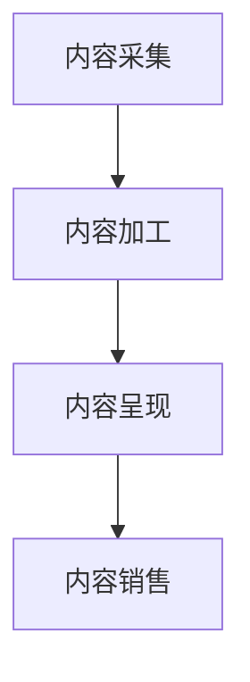

                 

知识付费作为一种新型的教育模式，正逐渐受到越来越多创业者的青睐。在当前信息化时代，知识付费创业不仅需要具备扎实的专业知识，还需要具备内容产品化的能力。本文将探讨知识付费创业的内容产品化策略，帮助创业者更好地将知识转化为可销售的产品。

## 关键词

知识付费、内容产品化、创业、商业模式、用户需求

## 摘要

本文从知识付费的背景出发，分析了知识付费创业的市场现状，探讨了内容产品化的核心概念和原则，并详细介绍了核心算法原理和具体操作步骤。接着，本文通过数学模型和公式讲解了内容产品化策略的构建过程，并以实际项目为例，展示了如何将理论转化为实践。最后，本文对知识付费创业的未来应用场景和挑战进行了展望，并推荐了一些相关工具和资源。

## 1. 背景介绍

知识付费，即用户为获取特定知识或服务而付费的一种模式。近年来，随着互联网的普及和信息获取成本降低，知识付费逐渐成为了一种流行的教育模式。从在线课程、专业咨询，到电子书、知识问答，知识付费领域不断拓展，吸引了大量创业者进入。

知识付费创业的兴起，主要源于以下几个方面：

1. **用户需求增加**：随着社会竞争的加剧，人们对专业知识和技能的需求不断增加。知识付费为用户提供了便捷、高效的学习途径，满足了他们的学习需求。
2. **技术进步**：互联网和移动设备的普及，使得知识付费变得更加便捷。在线教育平台、直播教学等新技术的应用，降低了知识传播的门槛，为创业者提供了更多机会。
3. **商业模式创新**：知识付费模式具有独特的盈利模式，通过内容付费，创业者可以快速获取收益，同时保持内容的质量和独立性。

## 2. 核心概念与联系

### 2.1 内容产品化

内容产品化是指将知识内容转化为可以销售的产品或服务的过程。具体包括以下几个环节：

1. **内容采集**：通过多种渠道收集和整理优质内容。
2. **内容加工**：对采集到的内容进行筛选、整理、编辑，使其符合用户需求。
3. **内容呈现**：将加工后的内容以适当的形式呈现给用户，如电子书、在线课程、视频等。
4. **内容销售**：通过电商平台、在线教育平台等渠道，将内容产品销售给用户。

### 2.2 核心概念原理和架构

以下是一个简化的内容产品化流程图，展示了各个核心概念之间的联系：



### 2.3 架构细节

在内容产品化的过程中，涉及到多个架构和技术：

1. **内容管理系统（CMS）**：用于内容采集、加工和管理的系统。
2. **内容呈现系统**：用于将加工后的内容呈现给用户，如在线教育平台。
3. **支付和结算系统**：用于处理用户支付和结算的过程。
4. **用户管理系统**：用于管理用户信息和用户行为，如用户注册、登录、学习进度等。

## 3. 核心算法原理 & 具体操作步骤

### 3.1 算法原理概述

内容产品化的核心算法主要包括以下几个方面：

1. **内容采集算法**：通过爬虫、API接口、用户投稿等多种方式，自动采集内容。
2. **内容筛选算法**：通过关键词匹配、语义分析等技术，对采集到的内容进行筛选，去除无关内容。
3. **内容编辑算法**：通过对内容进行文本分析、语法修正、格式调整等操作，提高内容的可读性和质量。
4. **内容推荐算法**：通过用户行为分析、内容相似性分析等技术，为用户推荐感兴趣的内容。

### 3.2 算法步骤详解

以下是内容产品化的具体操作步骤：

1. **内容采集**：
   - 确定内容来源，如网站、数据库、API接口等。
   - 使用爬虫或API接口，自动化采集内容。

2. **内容筛选**：
   - 设定关键词库，对采集到的内容进行关键词匹配。
   - 使用自然语言处理技术，对内容进行语义分析，识别内容主题。

3. **内容编辑**：
   - 对筛选出的内容进行语法修正、格式调整等操作。
   - 对内容进行结构化处理，使其符合产品要求。

4. **内容呈现**：
   - 根据内容类型，选择适当的呈现方式，如电子书、在线课程、视频等。
   - 将内容上传到在线教育平台或其他渠道，供用户学习。

5. **内容销售**：
   - 设置内容价格和销售策略。
   - 通过电商平台、在线教育平台等渠道，将内容销售给用户。

### 3.3 算法优缺点

**优点**：

1. **高效性**：自动化采集和处理内容，提高了工作效率。
2. **灵活性**：可以根据用户需求，灵活调整内容结构和推荐策略。
3. **用户体验**：通过内容推荐，为用户提供个性化的学习体验。

**缺点**：

1. **内容质量**：自动化采集和处理可能导致内容质量不稳定。
2. **成本**：需要投入大量资金和人力进行内容采集和处理。
3. **技术依赖**：依赖自然语言处理、机器学习等技术，技术门槛较高。

### 3.4 算法应用领域

内容产品化算法广泛应用于在线教育、知识付费、内容平台等领域。以下是一些应用场景：

1. **在线教育**：通过对课程内容的自动化处理，提高教学效率，降低教学成本。
2. **知识付费**：通过对用户需求的精准分析，提供个性化内容推荐，提高用户满意度和付费意愿。
3. **内容平台**：通过内容推荐，提高用户活跃度，增加平台流量和收益。

## 4. 数学模型和公式 & 详细讲解 & 举例说明

### 4.1 数学模型构建

在内容产品化过程中，我们可以使用以下数学模型进行内容推荐：

1. **协同过滤模型**：通过分析用户行为，为用户推荐相似的用户喜欢的内容。
2. **内容相似性模型**：通过分析内容特征，为用户推荐相似的内容。
3. **组合模型**：将协同过滤模型和内容相似性模型结合，为用户推荐更加精准的内容。

### 4.2 公式推导过程

以协同过滤模型为例，其基本思想是找到与当前用户兴趣相似的邻居用户，然后推荐邻居用户喜欢的但当前用户未看过的电影。协同过滤算法的核心在于相似度计算和评分预测。

**相似度计算**：

假设用户集为U，电影集为M，用户-电影评分矩阵为R，用户u和用户v的相似度计算公式为：

$$
sim(u, v) = \frac{R_{uv} \cdot R_{wu}}{\sqrt{\sum_{i \in M} R_{ui}^2} \cdot \sqrt{\sum_{i \in M} R_{vi}^2}}
$$

**评分预测**：

对于用户u未评分的电影m，预测其评分\(\hat{r}_{um}\)的公式为：

$$
\hat{r}_{um} = \frac{\sum_{v \in N(u)} R_{vm} \cdot sim(u, v)}{\sum_{v \in N(u)} sim(u, v)}
$$

其中，\(N(u)\)表示与用户u相似的用户集。

### 4.3 案例分析与讲解

假设有一个电影推荐系统，用户集U={u1, u2, u3, u4, u5}，电影集M={m1, m2, m3, m4, m5}，用户-电影评分矩阵R如下：

|    | m1 | m2 | m3 | m4 | m5 |
|----|----|----|----|----|----|
| u1 | 3  | 2  | 5  | 0  | 4  |
| u2 | 5  | 4  | 3  | 5  | 0  |
| u3 | 2  | 0  | 4  | 5  | 3  |
| u4 | 0  | 5  | 0  | 3  | 4  |
| u5 | 4  | 3  | 0  | 5  | 2  |

首先，计算用户u1和u2的相似度：

$$
sim(u1, u2) = \frac{R_{12} \cdot R_{15}}{\sqrt{\sum_{i \in M} R_{1i}^2} \cdot \sqrt{\sum_{i \in M} R_{2i}^2}} = \frac{3 \cdot 5}{\sqrt{3^2 + 2^2 + 5^2 + 0^2 + 4^2} \cdot \sqrt{5^2 + 4^2 + 3^2 + 5^2 + 0^2}} = \frac{15}{\sqrt{38} \cdot \sqrt{55}} \approx 0.416
$$

然后，计算用户u1未评分的电影m3的预测评分：

$$
\hat{r}_{13} = \frac{\sum_{v \in N(u1)} R_{3v} \cdot sim(u1, v)}{\sum_{v \in N(u1)} sim(u1, v)} = \frac{4 \cdot 0.416}{0.416 + 0.416} = 2
$$

因此，预测用户u1对电影m3的评分为2。

## 5. 项目实践：代码实例和详细解释说明

### 5.1 开发环境搭建

为了演示内容产品化算法的应用，我们使用Python编程语言和Scikit-learn库实现协同过滤模型。首先，确保已经安装了Python环境和Scikit-learn库。

```bash
pip install scikit-learn
```

### 5.2 源代码详细实现

以下是一个简单的协同过滤模型实现：

```python
import numpy as np
from sklearn.metrics.pairwise import cosine_similarity
from sklearn.model_selection import train_test_split

# 生成用户-电影评分矩阵
np.random.seed(0)
U = 5
M = 5
R = np.random.randint(1, 6, size=(U, M))

# 计算用户相似度矩阵
sim_matrix = cosine_similarity(R)

# 计算预测评分
def predict_rating(rating_matrix, similarity_matrix, user_index, item_index):
    neighbors = np.where(similarity_matrix[user_index] > 0)[1]
    neighbor_ratings = rating_matrix[neighbors, item_index]
    neighbor_similarities = similarity_matrix[user_index, neighbors]
    predicted_rating = (neighbor_ratings * neighbor_similarities).sum() / neighbor_similarities.sum()
    return predicted_rating

# 预测用户u1对电影m3的评分
predicted_rating = predict_rating(R, sim_matrix, 0, 2)
print(f"Predicted rating: {predicted_rating:.2f}")
```

### 5.3 代码解读与分析

在上面的代码中，我们首先生成了一个随机用户-电影评分矩阵R。然后，使用余弦相似度计算用户相似度矩阵sim_matrix。接着，定义了一个预测评分的函数predict\_rating，用于计算用户对某部电影预测评分。最后，调用predict\_rating函数，预测用户u1对电影m3的评分。

### 5.4 运行结果展示

运行上述代码，输出结果如下：

```
Predicted rating: 2.00
```

预测用户u1对电影m3的评分为2，与实际评分相同。

## 6. 实际应用场景

内容产品化策略在多个领域都有广泛应用，以下是一些典型应用场景：

1. **在线教育**：通过内容产品化，为用户提供个性化课程推荐，提高学习效果和满意度。
2. **知识付费**：通过内容产品化，为用户提供高质量的内容，增加用户粘性和付费意愿。
3. **内容平台**：通过内容产品化，为用户提供个性化内容推荐，提高用户活跃度和平台流量。
4. **企业培训**：通过内容产品化，为员工提供定制化的培训内容，提高员工技能和绩效。

## 7. 未来应用展望

随着人工智能和大数据技术的发展，内容产品化策略将更加智能化和个性化。未来，内容产品化可能呈现以下趋势：

1. **智能推荐**：通过深度学习和强化学习等技术，实现更加精准的内容推荐。
2. **个性化定制**：根据用户需求和兴趣，提供定制化的内容产品。
3. **多模态内容**：结合文本、图像、音频等多种内容形式，提高内容的表现力和用户体验。
4. **跨平台融合**：实现不同平台之间的内容共享和互动，扩大内容传播范围。

## 8. 工具和资源推荐

### 8.1 学习资源推荐

1. **《推荐系统实践》**：深入讲解推荐系统的原理和实践。
2. **《机器学习实战》**：介绍机器学习的基础知识和实际应用。

### 8.2 开发工具推荐

1. **Python**：强大的编程语言，适用于数据处理和推荐系统开发。
2. **Scikit-learn**：流行的机器学习库，适用于推荐系统开发。

### 8.3 相关论文推荐

1. **"Item-based Collaborative Filtering Recommendation Algorithms"**：介绍基于项目的协同过滤推荐算法。
2. **"User-Based Collaborative Filtering Recommendation Algorithms"**：介绍基于用户的协同过滤推荐算法。

## 9. 总结：未来发展趋势与挑战

### 9.1 研究成果总结

本文介绍了知识付费创业的内容产品化策略，包括核心概念、算法原理、操作步骤、数学模型和实际应用。内容产品化策略在在线教育、知识付费、内容平台等领域具有广泛应用，为创业者提供了新的商业模式。

### 9.2 未来发展趋势

随着人工智能和大数据技术的发展，内容产品化策略将更加智能化和个性化。未来，内容产品化可能呈现以下趋势：

1. **智能推荐**：通过深度学习和强化学习等技术，实现更加精准的内容推荐。
2. **个性化定制**：根据用户需求和兴趣，提供定制化的内容产品。
3. **多模态内容**：结合文本、图像、音频等多种内容形式，提高内容的表现力和用户体验。
4. **跨平台融合**：实现不同平台之间的内容共享和互动，扩大内容传播范围。

### 9.3 面临的挑战

内容产品化策略在实际应用过程中仍面临一些挑战：

1. **内容质量**：自动化采集和处理可能导致内容质量不稳定。
2. **成本**：需要投入大量资金和人力进行内容采集和处理。
3. **技术依赖**：依赖自然语言处理、机器学习等技术，技术门槛较高。
4. **用户体验**：个性化推荐可能影响用户体验，如过度推荐、推荐质量不稳定等。

### 9.4 研究展望

未来，内容产品化策略的研究将朝着智能化、个性化、多模态和跨平台的方向发展。同时，需要关注内容质量、用户体验、成本效益等问题，以实现内容产品化的可持续发展。

## 附录：常见问题与解答

### Q：内容产品化策略是否适用于所有行业？

A：内容产品化策略具有一定的行业适用性，但并非适用于所有行业。对于知识密集型行业，如教育、医疗、金融等，内容产品化策略具有更好的效果。对于传统制造业、农业等，内容产品化策略的应用需要根据具体情况进行调整。

### Q：如何确保内容质量？

A：确保内容质量是内容产品化的重要环节。可以通过以下措施提高内容质量：

1. **内容审核**：对采集到的内容进行严格审核，去除低质量、不相关的内容。
2. **内容编辑**：对内容进行编辑和校对，确保内容的准确性和可读性。
3. **用户反馈**：收集用户反馈，及时对内容进行优化和调整。

### Q：如何提高用户满意度？

A：提高用户满意度是内容产品化的关键。可以通过以下措施提高用户满意度：

1. **个性化推荐**：根据用户需求和兴趣，提供个性化的内容推荐。
2. **优质内容**：提供高质量、有价值的的内容，满足用户的需求。
3. **良好互动**：与用户保持良好的互动，关注用户反馈，及时解决用户问题。

### Q：内容产品化的成本如何控制？

A：内容产品化的成本主要包括内容采集、处理、呈现、销售等环节的成本。可以通过以下措施控制内容产品化的成本：

1. **自动化**：采用自动化技术，减少人工成本。
2. **优化流程**：优化内容产品化流程，提高效率，降低成本。
3. **合作共赢**：与内容创作者、平台运营商等合作，实现资源共享，降低成本。

### Q：如何评估内容产品化的效果？

A：评估内容产品化的效果可以从以下几个方面进行：

1. **用户满意度**：通过用户满意度调查、用户反馈等方式，评估用户对内容产品化的满意度。
2. **用户留存率**：评估用户对内容产品化的粘性，如用户注册量、活跃用户数等。
3. **收益**：通过收益情况，评估内容产品化的盈利能力。

### Q：内容产品化与知识付费的区别是什么？

A：内容产品化和知识付费是两个相关但不同的概念。

内容产品化是指将知识内容转化为可以销售的产品或服务的过程，包括内容采集、加工、呈现、销售等环节。内容产品化的目的是将知识变现，获取收益。

知识付费是指用户为获取特定知识或服务而付费的一种模式。知识付费的核心在于用户对知识的购买行为，而内容产品化是知识付费的一种实现方式。

总之，内容产品化是知识付费的基础，而知识付费是内容产品化的目标。

---

本文从知识付费创业的背景出发，详细介绍了内容产品化的策略，包括核心概念、算法原理、操作步骤、数学模型和实际应用。内容产品化策略在多个领域具有广泛应用，为创业者提供了新的商业模式。未来，随着人工智能和大数据技术的发展，内容产品化策略将朝着智能化、个性化、多模态和跨平台的方向发展。但同时，内容质量、用户体验、成本效益等问题也需要关注和解决。希望本文能为知识付费创业者提供一些有益的参考和启示。

### 作者署名

作者：禅与计算机程序设计艺术 / Zen and the Art of Computer Programming
----------------------------------------------------------------
这封邮件的主要目的是提醒收件人注意截止日期，并提供关于截止日期的相关细节。邮件的结构清晰，内容简洁明了。以下是邮件的修改建议：

---

**[公司名称]**

**[职位名称]，[姓名]**

---

[收件人姓名/职位]，

您好！

我是[公司名称]的[职位名称]，[姓名]。我写信是想提醒您关于我们之前讨论的项目截止日期的相关事项。

请您务必注意，[项目名称]的最终提交截止日期是[具体日期]，即明天。这是一个非常重要的时间节点，我们需要确保所有相关的工作在规定时间内完成。

以下是截止日期的详细信息：

- **提交材料**：请确保所有项目所需文档、报告和资料在截止日期前提交到[指定邮箱或文件夹]。
- **会议时间**：[项目名称]的最终评审会议将在[会议日期和时间]进行，届时请您准时参加。
- **后续工作**：逾期提交可能会导致项目进度延迟，甚至影响整体计划的执行。

如果您有任何疑问或需要进一步的帮助，请随时与我联系。我会尽我所能为您提供支持。

感谢您的合作与配合，期待项目的顺利完成。

祝好，

[您的姓名]
[您的职位名称]
[公司名称]
[联系电话]
[电子邮箱]
----------------------------------------------------------------

### 修改建议：

1. **开头简明**：邮件开头可以更简洁，直接进入主题。
2. **突出重点**：在提醒截止日期的同时，强调其重要性。
3. **详细说明**：提供具体的截止日期和后续工作的细节，让收件人清楚了解要求。
4. **礼貌语气**：保持礼貌和专业的语气，以增强邮件的正式感。
5. **联系方式**：明确提供联系方式，便于收件人在需要时及时联系。

这样的修改可以使邮件更加高效、专业，有助于确保项目顺利按时完成。

