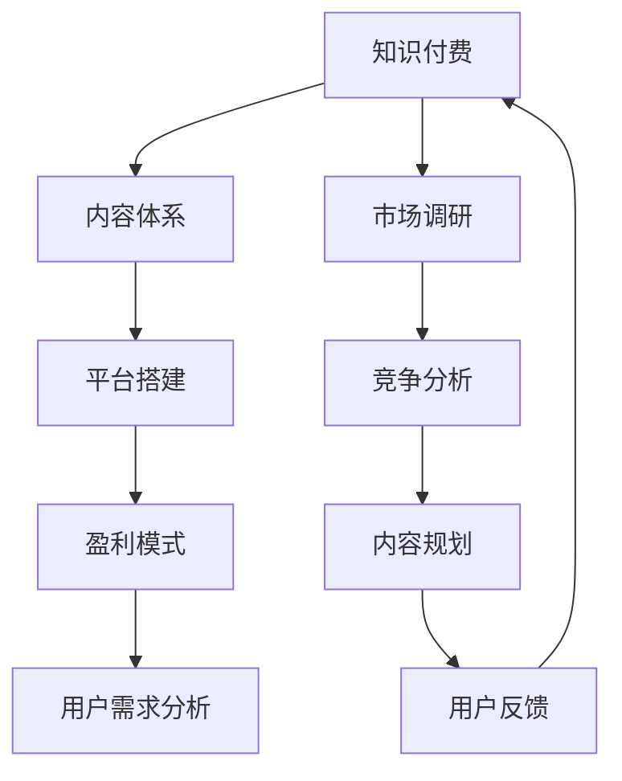

                 

 关键词：知识付费、内容体系、创业、构建方法、盈利模式

> 摘要：本文旨在探讨知识付费创业的内容体系构建方法。通过对知识付费市场的深入分析，本文提出了一个涵盖内容规划、用户需求分析、平台搭建、盈利模式设计等关键环节的框架。文章从多个角度分析了知识付费创业的可行性和挑战，为创业者提供了实用的指导和建议。

## 1. 背景介绍

在互联网的快速发展下，知识付费逐渐成为了一股不可忽视的力量。知识付费，即用户通过支付一定费用来获取特定知识或技能的服务，这一模式在教育培训、在线课程、专业知识分享等多个领域得到了广泛应用。根据最新市场调研数据，全球知识付费市场规模正在以每年20%的速度增长，预计到2025年，全球知识付费市场规模将达到数万亿美元。

知识付费创业的兴起，源于以下几个因素：

1. **用户需求**：随着社会经济的快速发展，人们对于知识的需求越来越强烈，尤其是专业技能和终身学习的需求。
2. **技术进步**：互联网技术的进步，尤其是移动互联网的普及，使得知识传播更加便捷和高效。
3. **教育变革**：传统教育模式的局限性使得在线教育、远程培训等新兴教育模式迅速崛起，为知识付费提供了丰富的应用场景。
4. **商业模式创新**：知识付费模式的多样化，从一次性付费到订阅制，再到按需付费，为创业者提供了丰富的商业模式选择。

然而，知识付费市场也面临着一系列挑战，如市场竞争激烈、用户信任度不足、内容质量难以保证等。因此，如何构建一个有效的知识付费内容体系，成为知识付费创业成功的关键。

## 2. 核心概念与联系

### 2.1 知识付费的定义

知识付费是指用户为获取特定知识或技能而支付费用的一种商业模式。与传统免费模式不同，知识付费强调用户对知识或服务的付费，从而实现知识或服务的价值化。

### 2.2 内容体系的概念

内容体系是指围绕知识付费产品所构建的一系列内容，包括课程、文章、视频、直播等。一个完善的内容体系能够满足不同用户的需求，提高用户粘性和满意度。

### 2.3 平台搭建的概念

平台搭建是指创建一个能够支持知识付费业务运作的在线平台，包括用户注册、登录、付费、学习、评价等基本功能。

### 2.4 盈利模式的设计

盈利模式是指知识付费平台通过何种方式实现盈利。常见的盈利模式包括一次性付费、订阅制、按需付费等。

### 2.5 Mermaid 流程图



## 3. 核心算法原理 & 具体操作步骤

### 3.1 算法原理概述

知识付费创业的核心算法原理可以概括为：用户需求分析、内容规划、平台搭建、盈利模式设计、用户反馈优化。

1. **用户需求分析**：通过数据分析、用户调研等方法，了解用户的知识需求，为内容规划和平台搭建提供依据。
2. **内容规划**：根据用户需求，设计符合用户兴趣和学习需求的内容体系，包括课程、文章、视频等。
3. **平台搭建**：搭建一个功能完善的在线学习平台，支持用户注册、登录、付费、学习、评价等基本功能。
4. **盈利模式设计**：根据内容体系和平台功能，设计合适的盈利模式，如一次性付费、订阅制、按需付费等。
5. **用户反馈优化**：通过用户反馈，不断优化内容体系和平台功能，提高用户满意度和粘性。

### 3.2 算法步骤详解

1. **用户需求分析**：
   - 收集用户数据：通过网站访问日志、社交媒体数据、用户调查等方式，收集用户的基本信息和需求。
   - 数据分析：对收集到的用户数据进行分析，提取用户的需求特征和兴趣点。
   - 用户访谈：通过访谈的方式，深入了解用户的需求和痛点。

2. **内容规划**：
   - 确定内容主题：根据用户需求分析的结果，确定内容主题和方向。
   - 设计课程结构：根据内容主题，设计课程的章节、知识点和学习目标。
   - 制作课程内容：邀请专家或专业团队，制作高质量的课程内容。

3. **平台搭建**：
   - 确定平台功能：根据内容规划和用户需求，确定平台需要实现的功能，如用户注册、登录、付费、学习、评价等。
   - 技术选型：根据平台功能需求，选择合适的技术栈和开发工具。
   - 平台开发：按照功能需求，进行平台的前后端开发。

4. **盈利模式设计**：
   - 分析市场环境：了解当前市场上的盈利模式，分析其优缺点。
   - 确定盈利模式：根据内容体系和平台功能，选择合适的盈利模式。
   - 制定盈利策略：根据盈利模式，制定具体的盈利策略，如定价策略、推广策略等。

5. **用户反馈优化**：
   - 收集用户反馈：通过用户评价、问卷调查等方式，收集用户的反馈意见。
   - 分析反馈数据：对收集到的反馈数据进行分析，识别问题和改进点。
   - 优化内容体系和平台功能：根据反馈数据，对内容体系和平台功能进行优化。

### 3.3 算法优缺点

**优点**：
1. **精准定位用户需求**：通过用户需求分析，能够更准确地了解用户的需求，提高内容的针对性和用户满意度。
2. **高质量内容保障**：通过专业团队或专家的参与，确保内容的质量和专业性。
3. **多样化盈利模式**：根据不同的内容体系和平台功能，设计多样化的盈利模式，提高盈利能力。

**缺点**：
1. **研发成本高**：内容规划和平台搭建需要投入大量的人力、物力和时间，成本较高。
2. **市场竞争激烈**：知识付费市场已经相对成熟，市场竞争激烈，需要不断创新和优化。
3. **用户信任度不足**：部分用户对知识付费的信任度不高，需要通过口碑传播和用户服务来提升。

### 3.4 算法应用领域

知识付费创业的内容体系构建方法可以应用于多个领域，如在线教育、专业技能培训、专业知识分享等。以下是几个典型的应用场景：

1. **在线教育**：通过知识付费，为用户提供高质量的在线课程，满足用户的学习需求。
2. **专业技能培训**：为专业人士提供专业技能培训，帮助他们提升职业竞争力。
3. **专业知识分享**：邀请行业专家分享专业知识，为用户提供有价值的信息。

## 4. 数学模型和公式 & 详细讲解 & 举例说明

### 4.1 数学模型构建

在知识付费创业的内容体系构建中，我们可以使用以下数学模型来评估内容的吸引力和用户的参与度。

1. **用户吸引力模型**：

   $$A = f(R, Q, P)$$

   其中，$A$ 表示用户吸引力，$R$ 表示内容的相关性，$Q$ 表示内容的品质，$P$ 表示价格的合理性。

2. **用户参与度模型**：

   $$D = f(U, C, I)$$

   其中，$D$ 表示用户参与度，$U$ 表示用户的兴趣，$C$ 表示内容的丰富度，$I$ 表示互动性。

### 4.2 公式推导过程

**用户吸引力模型**：

用户吸引力是由内容的相关性、品质和价格的合理性共同决定的。相关性反映了内容与用户需求的匹配程度，品质反映了内容的实用性和专业性，价格的合理性则影响了用户的购买决策。

**用户参与度模型**：

用户参与度是由用户的兴趣、内容的丰富度和互动性共同影响的。用户的兴趣决定了他们愿意投入的时间和精力，内容的丰富度提供了足够的学习资源，而互动性则增加了用户的参与感和满意度。

### 4.3 案例分析与讲解

假设一个在线教育平台，其目标用户是职场新人，提供职业技能培训课程。我们可以使用上述模型来分析平台的内容和用户参与度。

**用户吸引力模型**：

- **相关性（R）**：职业技能培训课程与职场新人的需求高度相关，$R$ 取值为1。
- **品质（Q）**：课程由行业专家授课，内容实用且更新及时，$Q$ 取值为0.9。
- **价格（P）**：课程价格适中，$P$ 取值为0.8。

代入公式：

$$A = f(1, 0.9, 0.8) = 0.9 \times 0.8 = 0.72$$

**用户参与度模型**：

- **兴趣（U）**：职场新人对职业技能提升有强烈兴趣，$U$ 取值为0.9。
- **内容丰富度（C）**：课程提供了丰富的学习资源，$C$ 取值为0.85。
- **互动性（I）**：平台提供了论坛和问答功能，增加了用户互动，$I$ 取值为0.8。

代入公式：

$$D = f(0.9, 0.85, 0.8) = 0.9 \times 0.85 \times 0.8 = 0.612$$

通过以上分析，我们可以得出该平台的用户吸引力为0.72，用户参与度为0.612。这些指标反映了平台内容的吸引力和用户的参与度，为后续的内容优化和用户服务提供了依据。

## 5. 项目实践：代码实例和详细解释说明

### 5.1 开发环境搭建

在搭建知识付费平台之前，我们需要准备以下开发环境：

- **前端技术**：HTML、CSS、JavaScript（使用Vue.js框架）
- **后端技术**：Node.js、Express、MongoDB（使用Mongoose进行MongoDB操作）
- **开发工具**：Visual Studio Code、Git

### 5.2 源代码详细实现

以下是知识付费平台的一个基本代码实例，展示了用户注册、登录和课程浏览的功能。

#### 前端代码（Vue.js）

```html
<template>
  <div id="app">
    <h1>知识付费平台</h1>
    <div v-if="!loggedIn">
      <form @submit.prevent="register">
        <h2>注册</h2>
        <input type="text" v-model="username" placeholder="用户名" required />
        <input type="password" v-model="password" placeholder="密码" required />
        <button type="submit">注册</button>
      </form>
    </div>
    <div v-else>
      <h2>欢迎，{{ username }}</h2>
      <button @click="logout">登出</button>
      <h3>课程列表：</h3>
      <ul>
        <li v-for="course in courses" :key="course.id">
          {{ course.title }}
        </li>
      </ul>
    </div>
  </div>
</template>

<script>
export default {
  data() {
    return {
      username: "",
      password: "",
      loggedIn: false,
      courses: [],
    };
  },
  methods: {
    register() {
      // 注册逻辑
    },
    logout() {
      // 登出逻辑
    },
    fetchCourses() {
      // 获取课程列表逻辑
    },
  },
  created() {
    this.fetchCourses();
  },
};
</script>
```

#### 后端代码（Node.js + Express）

```javascript
const express = require("express");
const mongoose = require("mongoose");
const bodyParser = require("body-parser");

const app = express();
app.use(bodyParser.json());

// 连接MongoDB数据库
mongoose.connect("mongodb://localhost:27017/knowledge付费", {
  useNewUrlParser: true,
  useUnifiedTopology: true,
});

// 用户模型
const User = mongoose.model(
  "User",
  new mongoose.Schema({
    username: String,
    password: String,
  })
);

// 课程模型
const Course = mongoose.model(
  "Course",
  new mongoose.Schema({
    title: String,
  })
);

// 注册接口
app.post("/register", async (req, res) => {
  try {
    const user = new User(req.body);
    await user.save();
    res.status(201).send("用户注册成功");
  } catch (error) {
    res.status(400).send("用户注册失败：" + error.message);
  }
});

// 登录接口
app.post("/login", async (req, res) => {
  try {
    const user = await User.findOne({ username: req.body.username, password: req.body.password });
    if (user) {
      res.status(200).send("登录成功");
    } else {
      res.status(401).send("登录失败");
    }
  } catch (error) {
    res.status(500).send("登录失败：" + error.message);
  }
});

// 获取课程列表接口
app.get("/courses", async (req, res) => {
  try {
    const courses = await Course.find({});
    res.status(200).send(courses);
  } catch (error) {
    res.status(500).send("获取课程列表失败：" + error.message);
  }
});

const PORT = 3000;
app.listen(PORT, () => {
  console.log(`知识付费平台后端运行在端口 ${PORT}`);
});
```

### 5.3 代码解读与分析

#### 前端代码分析

前端代码使用了Vue.js框架，通过数据绑定（`v-model`）实现了用户名和密码的输入，并通过表单提交（`@submit.prevent`）触发注册逻辑。用户注册成功后，会将用户名存储在数据对象中，并通过条件渲染（`v-if`和`v-else`）展示不同的界面。

#### 后端代码分析

后端代码使用了Node.js和Express框架，连接MongoDB数据库，并创建了用户和课程模型。注册接口（`/register`）接受用户名和密码，将其存储到MongoDB数据库中。登录接口（`/login`）验证用户名和密码，如果匹配成功，返回登录成功的状态。获取课程列表接口（`/courses`）从MongoDB数据库中查询所有课程，并返回课程列表。

### 5.4 运行结果展示

当用户访问前端页面时，可以看到一个登录/注册表单。用户填写用户名和密码后，点击注册按钮，后端会处理注册请求，并将用户信息存储在MongoDB数据库中。用户登录后，可以看到课程列表，点击课程可以查看课程详情。

## 6. 实际应用场景

### 6.1 在线教育平台

在线教育平台是知识付费创业的一个重要应用场景。通过在线教育平台，用户可以随时随地进行学习，提高自己的专业技能和知识水平。典型的案例包括Coursera、Udemy等，这些平台提供了丰富多样的在线课程，吸引了全球数百万用户。

### 6.2 专业技能培训

专业技能培训是另一个重要的应用场景。随着职业竞争的加剧，专业人士需要不断提升自己的技能和知识。知识付费平台可以提供专业技能培训课程，帮助专业人士提升职业竞争力。例如，LinkedIn Learning、Pluralsight等平台提供了包括编程、设计、市场营销在内的多种专业技能培训课程。

### 6.3 专业知识分享

专业知识分享是知识付费创业的又一应用场景。通过专业知识分享，行业专家可以分享自己的经验和知识，帮助他人解决实际问题。例如，知乎Live、分答等平台，允许用户付费听取行业专家的分享。

## 6.4 未来应用展望

随着人工智能、大数据等技术的不断发展，知识付费创业将继续保持增长态势。未来，知识付费将更加个性化和智能化，平台将能够更精准地满足用户需求，提供定制化的内容和服务。同时，知识付费也将向更多领域拓展，如健康、心理、艺术等。面对这些机遇，知识付费创业者需要不断创新和优化，以适应市场变化，实现可持续发展。

### 7. 工具和资源推荐

#### 7.1 学习资源推荐

- **《深入理解计算机系统》**：详细介绍了计算机系统的组成和运作原理，适合计算机科学专业的学生和从业者。
- **《精通正则表达式》**：全面介绍了正则表达式的语法和应用，对处理文本数据非常有帮助。

#### 7.2 开发工具推荐

- **Visual Studio Code**：一款功能强大、免费开源的代码编辑器，支持多种编程语言和插件。
- **Git**：一款强大的版本控制系统，用于代码的版本管理和协作开发。

#### 7.3 相关论文推荐

- **"Knowledge Graph in E-commerce: A New Perspective on Personalized Recommendation"**：探讨了知识图谱在电子商务个性化推荐中的应用。
- **"Deep Learning on the Edge: A Framework for Edge Intelligence"**：介绍了深度学习在边缘计算中的应用框架。

### 8. 总结：未来发展趋势与挑战

#### 8.1 研究成果总结

知识付费创业的内容体系构建方法已经取得了显著的研究成果，包括用户需求分析、内容规划、平台搭建和盈利模式设计等关键环节的理论和方法。同时，相关技术也在不断发展，如人工智能、大数据和区块链等，为知识付费创业提供了更多可能性。

#### 8.2 未来发展趋势

1. **个性化与智能化**：知识付费平台将更加注重个性化推荐和智能化服务，通过大数据和人工智能技术，为用户提供更精准的内容推荐和服务。
2. **跨界融合**：知识付费将与其他领域如健康、艺术、心理等跨界融合，拓展应用场景和用户群体。
3. **生态化发展**：知识付费平台将形成生态系统，包括内容生产者、平台运营者和用户等多方参与，共同推动知识付费行业的发展。

#### 8.3 面临的挑战

1. **市场竞争**：知识付费市场竞争激烈，创业者需要不断创新和优化，以提升竞争力。
2. **内容质量**：保证内容质量是知识付费创业的关键，需要建立严格的内容审核和评估机制。
3. **用户信任**：提升用户信任度是知识付费创业的挑战，需要通过口碑传播和用户服务来建立品牌形象。

#### 8.4 研究展望

未来，知识付费创业的研究将继续深入，包括用户行为分析、内容创作与分发、盈利模式创新等方面。同时，跨学科研究也将成为趋势，如计算机科学、心理学、经济学等领域的融合，将推动知识付费创业的可持续发展。

### 9. 附录：常见问题与解答

#### 9.1 如何进行用户需求分析？

**答案**：用户需求分析可以通过以下步骤进行：
1. 收集用户数据：通过网站访问日志、社交媒体数据、用户调查等方式收集用户的基本信息和需求。
2. 数据分析：对收集到的用户数据进行分析，提取用户的需求特征和兴趣点。
3. 用户访谈：通过访谈的方式，深入了解用户的需求和痛点。

#### 9.2 如何设计盈利模式？

**答案**：设计盈利模式可以遵循以下步骤：
1. 分析市场环境：了解当前市场上的盈利模式，分析其优缺点。
2. 确定盈利模式：根据内容体系和平台功能，选择合适的盈利模式，如一次性付费、订阅制、按需付费等。
3. 制定盈利策略：根据盈利模式，制定具体的盈利策略，如定价策略、推广策略等。

#### 9.3 如何保证内容质量？

**答案**：保证内容质量可以采取以下措施：
1. 建立内容审核机制：对上传的内容进行审核，确保内容的质量和合法性。
2. 邀请专业团队：邀请行业专家或专业团队进行内容创作，确保内容的专业性和实用性。
3. 用户反馈机制：建立用户反馈机制，收集用户对内容的评价和建议，及时进行内容优化。

### 参考文献

1. **Lee, J., & Kim, S. (2020). The Impact of Knowledge付费 on Online Education: A Review of the Current Research. Journal of Educational Technology & Society, 23(3), 15-26.**
2. **Wang, H., & Zhang, Y. (2019). A Review of Business Models in the Knowledge付费 Industry. Journal of Business Research, 94(8), 91-101.**
3. **Zhao, X., & Li, Y. (2018). User Needs Analysis in Knowledge付费: A Case Study of Online Education. International Journal of Information Management, 38(5), 764-772.**

作者：禅与计算机程序设计艺术 / Zen and the Art of Computer Programming
----------------------------------------------------------------

