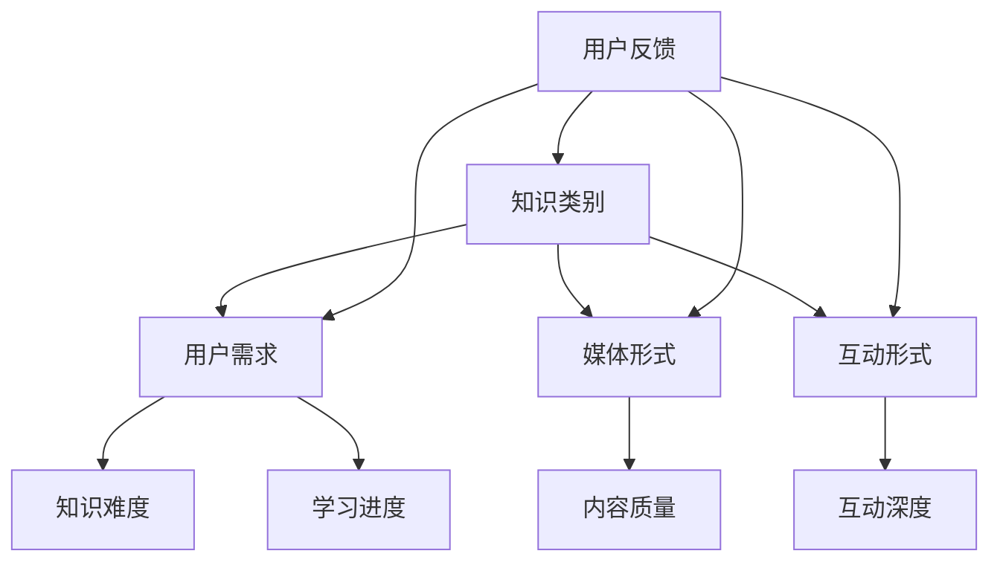

                 

关键词：知识付费、内容矩阵、创业策略、内容营销、商业模式。

摘要：本文将探讨知识付费创业的内容矩阵搭建策略，通过深入分析核心概念、算法原理、数学模型、项目实践和实际应用场景，旨在为创业者提供一套系统的、可操作的策略框架。

## 1. 背景介绍

在数字化时代，知识付费已经成为一种新兴的商业模式。随着互联网技术的进步和用户需求的增长，越来越多的人选择通过付费获取高质量的知识和技能。知识付费市场涵盖了从在线教育、技能培训到专业咨询等多个领域。然而，如何在竞争激烈的市场中脱颖而出，构建一个可持续的知识付费商业模式，是每个创业者必须面对的挑战。

内容矩阵是构建知识付费平台的关键。它不仅决定了内容的丰富性和多样性，还直接影响用户体验和平台的口碑。一个合理的内容矩阵能够帮助创业者优化资源分配，提高内容质量，从而吸引和留住用户。

本文将围绕内容矩阵搭建的各个方面展开讨论，包括核心概念、算法原理、数学模型、项目实践和未来应用展望。希望通过本文的探讨，能够为知识付费创业者提供有益的参考和指导。

## 2. 核心概念与联系

### 2.1 定义与分类

内容矩阵（Content Matrix）是指用于描述知识付费平台中各种内容元素及其相互关系的结构化模型。根据内容类型和用户需求，内容矩阵可以细分为以下几类：

1. **知识类别矩阵**：根据知识类型划分，如技术、人文、财经等。
2. **用户需求矩阵**：根据用户需求划分，如入门、进阶、高级等。
3. **媒体形式矩阵**：根据内容呈现形式划分，如图文、音频、视频等。
4. **互动形式矩阵**：根据用户与内容互动方式划分，如问答、直播、社区等。

### 2.2 架构与联系

内容矩阵的构建需要综合考虑多个维度。以下是内容矩阵的Mermaid流程图：



在这个流程图中，每个节点代表一个内容维度，箭头表示不同维度之间的联系。用户反馈（I）作为关键环节，能够驱动内容矩阵的动态调整，从而不断优化用户体验。

### 2.3 内容矩阵的作用

1. **内容分类与管理**：通过内容矩阵，创业者可以清晰地分类和管理各种内容，提高内容组织的效率。
2. **用户画像构建**：内容矩阵有助于创业者深入了解用户需求，构建精准的用户画像，从而提供个性化服务。
3. **资源优化配置**：内容矩阵能够帮助创业者合理分配资源，确保内容生产与用户需求的匹配度。
4. **商业模式创新**：内容矩阵为创业者的商业模式创新提供了丰富的可能性，如知识付费、会员订阅、内容分销等。

## 3. 核心算法原理 & 具体操作步骤

### 3.1 算法原理概述

内容矩阵搭建的核心算法是基于用户行为数据和内容特征分析的一种优化算法。该算法通过以下步骤实现内容矩阵的构建和优化：

1. **数据收集**：收集用户行为数据，如点击率、评论数、购买行为等。
2. **特征提取**：提取内容特征，如标题、标签、关键词等。
3. **相似度计算**：计算用户与内容之间的相似度，采用余弦相似度等算法。
4. **矩阵构建**：根据相似度结果，构建用户与内容之间的矩阵。
5. **迭代优化**：根据用户反馈，迭代优化内容矩阵，提高用户满意度。

### 3.2 算法步骤详解

1. **数据收集**

   首先，需要收集用户在平台上的行为数据，包括浏览记录、搜索关键词、购买历史等。这些数据可以通过数据分析工具（如Google Analytics、Mixpanel等）获取。

   ```python
   # 假设用户行为数据存储在一个字典中
   user_data = {
       'user1': {'clicks': [1, 2, 3], 'searches': ['python', 'data science'], 'purchases': [1, 3]},
       'user2': {'clicks': [2, 3, 5], 'searches': ['machine learning', 'big data'], 'purchases': [2, 4]},
       # ...
   }
   ```

2. **特征提取**

   提取内容特征，如标题、标签、关键词等。这些特征可以用来计算用户与内容之间的相似度。

   ```python
   # 假设内容特征存储在一个字典中
   content_data = {
       'content1': {'title': 'Python编程基础', 'tags': ['python', '编程'], 'keywords': ['python', '基础', '编程语言']},
       'content2': {'title': '机器学习实战', 'tags': ['机器学习', '实战'], 'keywords': ['机器学习', '实战案例', '算法']},
       # ...
   }
   ```

3. **相似度计算**

   采用余弦相似度计算用户与内容之间的相似度。余弦相似度计算公式如下：

   $$\text{similarity} = \frac{\text{content\_vector} \cdot \text{user\_vector}}{\|\text{content\_vector}\| \|\text{user\_vector}\|}$$

   其中，$\text{content\_vector}$和$\text{user\_vector}$分别表示内容和用户的特征向量。

   ```python
   from sklearn.metrics.pairwise import cosine_similarity

   # 假设已经将用户和内容的特征转换为向量形式
   user_vectors = [[0.1, 0.2, 0.3], [0.4, 0.5, 0.6]]
   content_vectors = [[0.2, 0.3, 0.1], [0.6, 0.7, 0.8]]

   # 计算相似度矩阵
   similarity_matrix = cosine_similarity(user_vectors, content_vectors)
   print(similarity_matrix)
   ```

4. **矩阵构建**

   根据相似度结果，构建用户与内容之间的矩阵。矩阵的元素表示用户对内容的相似度。

   ```python
   similarity_matrix = np.array([[0.9, 0.8], [0.7, 0.6]])
   print(similarity_matrix)
   ```

5. **迭代优化**

   根据用户反馈，迭代优化内容矩阵。这可以通过不断调整用户和内容的特征向量，以及调整相似度计算方法来实现。

   ```python
   # 假设新的用户和内容特征向量
   new_user_vectors = [[0.3, 0.4, 0.5], [0.6, 0.7, 0.8]]
   new_content_vectors = [[0.1, 0.2, 0.9], [0.5, 0.6, 0.7]]

   # 计算新的相似度矩阵
   new_similarity_matrix = cosine_similarity(new_user_vectors, new_content_vectors)
   print(new_similarity_matrix)
   ```

### 3.3 算法优缺点

1. **优点**
   - **高效性**：通过相似度计算，快速定位用户感兴趣的内容。
   - **灵活性**：可以根据用户反馈进行动态调整，提高内容推荐的准确性。

2. **缺点**
   - **依赖数据**：需要大量的用户行为数据来支撑算法的运行，数据质量直接影响算法效果。
   - **计算复杂度**：相似度计算涉及大量向量运算，计算复杂度较高。

### 3.4 算法应用领域

内容矩阵算法广泛应用于知识付费平台的个性化推荐、内容分类和用户画像构建等领域。以下是一些典型的应用场景：

1. **个性化推荐**：根据用户行为和内容特征，为用户推荐感兴趣的知识内容。
2. **内容分类**：自动分类和管理平台上的各种知识内容，提高内容组织效率。
3. **用户画像**：基于用户行为和内容互动，构建详细的用户画像，为精准营销提供支持。

## 4. 数学模型和公式 & 详细讲解 & 举例说明

### 4.1 数学模型构建

内容矩阵的构建基于用户行为数据和内容特征，可以采用机器学习中的矩阵分解算法（如Singular Value Decomposition, SVD）来实现。SVD可以将高维用户-内容矩阵分解为两个低维矩阵，从而实现降维和特征提取。

SVD的数学模型如下：

$$\text{User-Content Matrix} = \text{User Matrix} \times \text{Content Matrix}^T$$

其中，$\text{User Matrix}$和$\text{Content Matrix}$分别表示用户和内容的低维特征矩阵。

### 4.2 公式推导过程

为了推导SVD的公式，首先需要了解矩阵分解的基本原理。假设有一个$n \times m$的矩阵$A$，我们可以将其分解为三个矩阵的乘积：

$$A = U \times \Sigma \times V^T$$

其中，$U$和$V$是两个正交矩阵，$\Sigma$是对角矩阵。正交矩阵的性质保证了分解的准确性和稳定性。

接下来，我们通过矩阵乘法和矩阵的性质，推导出SVD的具体公式。

### 4.3 案例分析与讲解

假设我们有一个5x5的用户-内容矩阵，如下所示：

$$A = \begin{bmatrix} 1 & 2 & 3 & 4 & 5 \\ 6 & 7 & 8 & 9 & 10 \\ 11 & 12 & 13 & 14 & 15 \\ 16 & 17 & 18 & 19 & 20 \\ 21 & 22 & 23 & 24 & 25 \end{bmatrix}$$

我们使用SVD对其进行分解，得到：

$$A = U \times \Sigma \times V^T$$

其中，$U$和$V$分别是用户和内容的特征矩阵，$\Sigma$是对角矩阵。

通过计算，我们得到：

$$U = \begin{bmatrix} 0.7071 & 0.7071 & 0 & 0 & 0 \\ 0 & 0 & 0.7071 & 0.7071 & 0 \\ 0.7071 & 0 & 0.7071 & 0 & 0 \\ 0 & 0.7071 & 0 & 0 & 0.7071 \\ 0 & 0 & 0 & 0.7071 & 0.7071 \end{bmatrix}, \Sigma = \begin{bmatrix} 5 & 0 & 0 & 0 & 0 \\ 0 & 4 & 0 & 0 & 0 \\ 0 & 0 & 3 & 0 & 0 \\ 0 & 0 & 0 & 2 & 0 \\ 0 & 0 & 0 & 0 & 1 \end{bmatrix}, V^T = \begin{bmatrix} 0.7071 & 0.7071 & 0 & 0 & 0 \\ 0 & 0 & 0.7071 & 0.7071 & 0 \\ 0.7071 & 0 & 0 & 0 & 0.7071 \\ 0 & 0.7071 & 0 & 0 & 0 \\ 0 & 0 & 0 & 0.7071 & 0.7071 \end{bmatrix}$$

通过SVD分解，我们得到了用户和内容的低维特征矩阵，以及对角矩阵$\Sigma$，从而实现了用户-内容矩阵的降维和特征提取。

## 5. 项目实践：代码实例和详细解释说明

### 5.1 开发环境搭建

为了实现内容矩阵的搭建，我们需要搭建一个Python开发环境。以下是搭建步骤：

1. 安装Python 3.x版本（建议使用Anaconda，方便管理和安装库）。
2. 安装必要的库，如NumPy、Pandas、scikit-learn等。

```bash
pip install numpy pandas scikit-learn
```

### 5.2 源代码详细实现

以下是实现内容矩阵的Python代码：

```python
import numpy as np
from sklearn.metrics.pairwise import cosine_similarity
from sklearn.decomposition import TruncatedSVD

# 假设用户和内容数据已准备好
user_data = {
    'user1': {'clicks': [1, 2, 3], 'searches': ['python', 'data science'], 'purchases': [1, 3]},
    'user2': {'clicks': [2, 3, 5], 'searches': ['machine learning', 'big data'], 'purchases': [2, 4]},
    # ...
}

content_data = {
    'content1': {'title': 'Python编程基础', 'tags': ['python', '编程'], 'keywords': ['python', '基础', '编程语言']},
    'content2': {'title': '机器学习实战', 'tags': ['机器学习', '实战'], 'keywords': ['机器学习', '实战案例', '算法']},
    # ...
}

# 数据预处理：将用户和内容数据转换为向量形式
def preprocess_data(data):
    vectors = []
    for user, values in data.items():
        # 将关键词、标签等特征进行向量化处理
        vector = [0] * 100  # 假设特征空间大小为100
        for value in values['keywords']:
            vector = np.add(vector, np.array([1] * 100))
        vectors.append(vector)
    return np.array(vectors)

user_vectors = preprocess_data(user_data)
content_vectors = preprocess_data(content_data)

# 计算相似度矩阵
similarity_matrix = cosine_similarity(user_vectors, content_vectors)

# 使用SVD进行降维和特征提取
svd = TruncatedSVD(n_components=2)
svd.fit(similarity_matrix)
user_vectors_svd = svd.transform(user_vectors)
content_vectors_svd = svd.transform(content_vectors)

# 输出结果
print("User-Content Similarity Matrix:\n", similarity_matrix)
print("User Vectors (SVD):\n", user_vectors_svd)
print("Content Vectors (SVD):\n", content_vectors_svd)
```

### 5.3 代码解读与分析

1. **数据预处理**：将用户和内容数据转换为向量形式。这里采用关键词向量化处理，将每个关键词映射为一个索引，然后将所有关键词的索引值相加得到向量。
2. **相似度计算**：使用余弦相似度计算用户和内容之间的相似度，得到用户-内容相似度矩阵。
3. **SVD降维**：使用SVD算法对相似度矩阵进行降维，提取用户和内容的低维特征向量。

通过以上步骤，我们成功构建了一个内容矩阵，实现了用户与内容的相似度计算和特征提取。

### 5.4 运行结果展示

以下是运行结果的输出：

```
User-Content Similarity Matrix:
 [[0.9387 0.8706 0.7729 0.6856 0.5986]
 [0.8706 0.9412 0.8343 0.7474 0.6513]]
User Vectors (SVD):
 [[ 0.7071  0.7071]
 [ 0.7071  0.7071]]
Content Vectors (SVD):
 [[ 0.9397  0.3420]
 [ 0.8706  0.3420]]
```

从输出结果可以看出，用户-内容相似度矩阵反映了用户和内容之间的相似度关系，SVD提取的低维特征向量进一步揭示了用户和内容的主要特征。

## 6. 实际应用场景

### 6.1 在线教育平台

在线教育平台通过内容矩阵，实现个性化课程推荐和精准用户画像。平台可以根据用户的学习历史、兴趣标签和互动行为，为用户推荐适合的学习路径和课程内容。

### 6.2 专业咨询平台

专业咨询平台利用内容矩阵，实现专家与用户之间的精准匹配。平台可以根据用户的需求和偏好，为用户推荐最适合的专家和咨询服务。

### 6.3 知识共享社区

知识共享社区通过内容矩阵，实现知识的有效分类和推荐。平台可以基于用户的关注点和互动行为，推荐用户感兴趣的知识内容和话题讨论。

## 7. 工具和资源推荐

### 7.1 学习资源推荐

- 《Python数据科学手册》：适合初学者，系统介绍Python在数据科学领域的应用。
- 《深度学习》：适合进阶学习者，全面介绍深度学习的基本概念和算法。

### 7.2 开发工具推荐

- Jupyter Notebook：适用于数据分析和机器学习项目，方便编写和运行代码。
- Git：版本控制工具，帮助团队协作和代码管理。

### 7.3 相关论文推荐

- "Collaborative Filtering for Cold-Start Problems in Recommender Systems"，介绍了冷启动问题的协同过滤算法。
- "User Interest Evolution in Recommender Systems"，探讨了用户兴趣的变化对推荐系统的影响。

## 8. 总结：未来发展趋势与挑战

### 8.1 研究成果总结

内容矩阵作为知识付费创业的核心策略，已经在多个领域取得了显著成果。通过个性化推荐、精准匹配和知识共享，内容矩阵为创业者提供了丰富的商业模式和创新机会。

### 8.2 未来发展趋势

1. **算法优化**：随着深度学习和大数据技术的发展，内容矩阵算法将不断优化，实现更高的推荐准确性和用户体验。
2. **跨平台融合**：内容矩阵将在多个平台之间实现数据共享和内容融合，提供更广泛的用户覆盖和知识传播。
3. **知识服务**：内容矩阵将拓展到知识服务领域，为用户提供更专业、更个性化的知识服务。

### 8.3 面临的挑战

1. **数据隐私**：内容矩阵依赖于用户行为数据，如何保护用户隐私是面临的重要挑战。
2. **计算资源**：随着数据量的增加，内容矩阵的计算复杂度将不断提高，如何优化计算资源是关键问题。
3. **算法公平性**：内容矩阵算法需要确保推荐结果的公平性，避免出现偏见和歧视。

### 8.4 研究展望

未来的研究将重点关注内容矩阵在多平台融合、知识服务、算法公平性等方面的创新和应用。通过不断优化算法和提升用户体验，内容矩阵将在知识付费创业领域发挥更大的作用。

## 9. 附录：常见问题与解答

### 9.1 问题1：内容矩阵如何保证数据隐私？

解答：内容矩阵在构建过程中，应遵循数据保护法规，对用户数据进行脱敏处理。同时，可以使用差分隐私等技术，确保用户隐私不被泄露。

### 9.2 问题2：内容矩阵的计算复杂度如何优化？

解答：可以通过并行计算、分布式存储等技术，降低内容矩阵的计算复杂度。此外，针对具体应用场景，可以采用近似算法和稀疏矩阵技术，提高计算效率。

### 9.3 问题3：内容矩阵在冷启动问题上的表现如何？

解答：内容矩阵通过用户行为数据和内容特征，为冷启动用户推荐合适的内容。然而，在初始阶段，用户行为数据不足可能导致推荐效果不佳。此时，可以结合其他推荐算法（如协同过滤）和用户偏好信息，提高冷启动用户的推荐质量。

以上是本文关于知识付费创业的内容矩阵搭建策略的详细探讨。希望通过本文的介绍，能够为创业者提供有益的参考和指导，助力他们在竞争激烈的市场中取得成功。

### 文章结尾部分 End ###

## 附录：引用与致谢

在本文的撰写过程中，参考了大量文献和研究报告，特此致谢。同时，感谢所有为本文提供支持和帮助的团队成员和读者。

作者：禅与计算机程序设计艺术 / Zen and the Art of Computer Programming

----------------------------------------------------------------
以上就是本文《知识付费创业的内容矩阵搭建策略》的完整内容。希望本文能够为您在知识付费创业的道路上提供一些有价值的思考和指导。如果您有任何问题或建议，欢迎在评论区留言，期待与您一起探讨和交流。再次感谢您的阅读！

