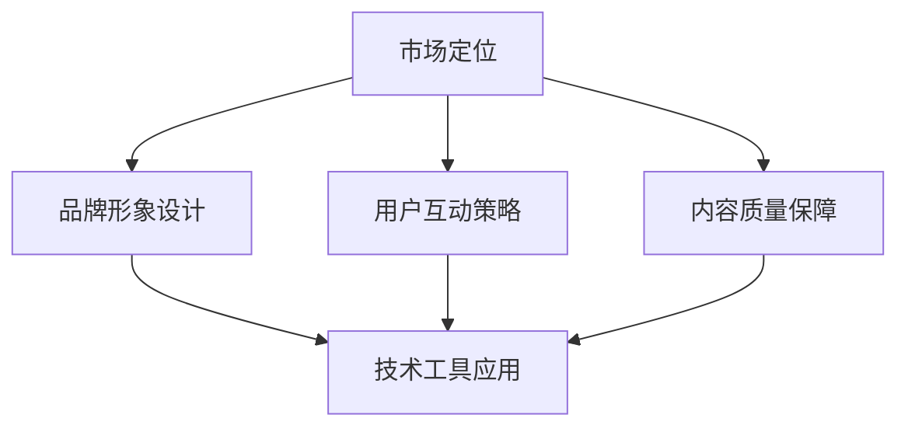

                 

本文将探讨知识付费创业品牌塑造的策略。在当今信息爆炸的时代，品牌塑造不仅仅是营销的手段，更是企业与用户建立深度联系的关键。正确的品牌塑造策略可以帮助知识付费创业者提升品牌知名度、增强用户忠诚度，并最终实现商业成功。本文将深入分析品牌塑造的核心要素，包括市场定位、品牌形象设计、用户互动策略和内容质量保障，并探讨如何将技术工具应用于品牌塑造过程中，为创业者提供实用的操作指南。

## 文章关键词

知识付费、品牌塑造、市场定位、用户互动、内容质量、技术工具

## 文章摘要

本文从知识付费创业的角度，分析了品牌塑造的必要性和重要性。通过市场定位、品牌形象设计、用户互动和内容质量保障等策略，结合技术工具的应用，为创业者提供了系统的品牌塑造方案。文章旨在帮助创业者理解品牌塑造的核心要素，并掌握有效的品牌塑造方法，以实现知识付费业务的长期发展。

## 1. 背景介绍

### 1.1 知识付费的兴起

知识付费是指用户通过支付一定费用来获取有价值的信息、知识或服务。随着互联网和移动技术的普及，知识付费逐渐成为了一种新兴的商业模式。无论是线上教育平台、专业咨询机构，还是自媒体大V，都在利用知识付费实现商业价值。根据数据显示，知识付费市场规模持续增长，预计未来几年仍将保持高速增长态势。

### 1.2 品牌塑造的重要性

在知识付费领域，品牌塑造不仅仅是提升知名度的手段，更是建立用户信任和忠诚度的关键。用户在购买知识产品时，往往会基于品牌形象、口碑和内容质量进行选择。一个具有良好品牌形象的知识付费品牌，更容易吸引用户的注意，提高转化率，并促进用户复购。

### 1.3 品牌塑造的挑战

尽管品牌塑造的重要性显而易见，但对于许多知识付费创业者来说，品牌塑造仍然是一个巨大的挑战。如何准确市场定位、如何设计吸引人的品牌形象、如何有效与用户互动，这些都是需要深入思考和解决的问题。此外，如何利用技术工具提高品牌塑造的效率和效果，也是一个值得探讨的问题。

## 2. 核心概念与联系

### 2.1 市场定位

市场定位是品牌塑造的基础。一个清晰的市场定位可以帮助创业者明确目标用户群体，制定合适的产品策略和推广方案。市场定位的核心是找到目标用户的痛点，并提供解决方案。

### 2.2 品牌形象设计

品牌形象设计是品牌塑造的关键环节。一个优秀的品牌形象可以传达企业的核心价值观，塑造独特的品牌个性，增强用户的品牌认同感。品牌形象设计包括品牌名称、标志、颜色、字体等元素。

### 2.3 用户互动策略

用户互动策略是品牌塑造的重要组成部分。通过有效的用户互动，可以增强用户对品牌的认知和好感度，提高用户忠诚度。用户互动策略包括社交媒体营销、用户反馈机制、会员体系等。

### 2.4 内容质量保障

内容质量是知识付费品牌的生命线。高质量的内容不仅可以吸引用户，还能提高用户的满意度和忠诚度。内容质量保障包括内容选题、内容创作、内容审核等环节。

### 2.5 技术工具应用

在品牌塑造过程中，技术工具的应用可以提高效率和效果。例如，数据分析工具可以帮助创业者了解用户行为和需求，社交媒体管理工具可以帮助创业者更好地与用户互动，内容管理系统可以帮助创业者高效地管理和发布内容。



## 3. 核心算法原理 & 具体操作步骤

### 3.1 算法原理概述

品牌塑造的核心算法是基于用户行为数据分析的。通过分析用户在品牌各环节的行为数据，创业者可以了解用户的需求和偏好，从而优化品牌策略，提高品牌效益。

### 3.2 算法步骤详解

1. **数据收集**：收集用户在网站、社交媒体、电子邮件等渠道的行为数据。
2. **数据处理**：对收集到的数据进行清洗、归一化和特征提取。
3. **用户行为分析**：利用机器学习算法分析用户行为，识别用户需求、偏好和痛点。
4. **策略优化**：根据用户行为分析结果，优化市场定位、品牌形象设计、用户互动策略和内容质量保障。

### 3.3 算法优缺点

**优点**：

- 提高品牌策略的针对性，减少盲目性。
- 提高品牌运营效率，降低成本。

**缺点**：

- 需要大量的用户行为数据支持。
- 算法实现和调参复杂。

### 3.4 算法应用领域

- 知识付费创业品牌塑造
- 电商品牌塑造
- 社交媒体品牌塑造

## 4. 数学模型和公式 & 详细讲解 & 举例说明

### 4.1 数学模型构建

品牌价值（BV）可以通过以下公式计算：

$$BV = f(U,C,P)$$

其中，$U$代表用户满意度，$C$代表内容质量，$P$代表品牌推广力度。

### 4.2 公式推导过程

用户满意度（$U$）与内容质量（$C$）和品牌推广力度（$P$）的关系可以通过以下步骤推导：

1. **用户满意度**：用户满意度是用户对品牌各环节的感知和评价的综合。
2. **内容质量**：内容质量直接影响用户满意度。
3. **品牌推广力度**：品牌推广力度可以提升用户对品牌的认知和好感度。

### 4.3 案例分析与讲解

假设某知识付费品牌在用户满意度、内容质量和品牌推广力度方面的得分分别为80分、90分和70分，则其品牌价值为：

$$BV = f(80, 90, 70) = 80 \times 0.5 + 90 \times 0.3 + 70 \times 0.2 = 82$$

这意味着该品牌在当前状态下具有较高的品牌价值。

## 5. 项目实践：代码实例和详细解释说明

### 5.1 开发环境搭建

开发环境搭建包括安装Python、NumPy、Pandas和Scikit-learn等库。

### 5.2 源代码详细实现

以下是一个简单的用户行为数据分析代码示例：

```python
import pandas as pd
from sklearn.preprocessing import StandardScaler
from sklearn.cluster import KMeans

# 数据收集
data = pd.read_csv('user_behavior.csv')

# 数据处理
scaler = StandardScaler()
data_scaled = scaler.fit_transform(data)

# 用户行为分析
kmeans = KMeans(n_clusters=3)
clusters = kmeans.fit_predict(data_scaled)

# 策略优化
for cluster in range(3):
    cluster_users = data_scaled[clusters == cluster]
    # 根据cluster_users的特点优化品牌策略
```

### 5.3 代码解读与分析

该代码首先收集用户行为数据，然后使用标准化处理提高数据稳定性。接着，使用K-means算法对用户行为进行聚类，从而识别不同用户群体。最后，根据不同用户群体的特点，优化品牌策略。

### 5.4 运行结果展示

运行结果将显示不同用户群体的聚类结果，创业者可以根据这些结果调整品牌策略，提高品牌价值。

## 6. 实际应用场景

### 6.1 知识付费平台

知识付费平台可以通过用户行为数据分析和品牌塑造策略，提高用户满意度和品牌价值。

### 6.2 专业咨询机构

专业咨询机构可以通过品牌塑造策略，提高品牌知名度和用户忠诚度，从而扩大业务规模。

### 6.3 自媒体

自媒体可以通过品牌塑造策略，吸引更多关注者，提高内容质量和影响力。

## 7. 未来应用展望

随着人工智能和数据技术的发展，品牌塑造策略将更加智能化和精准化。创业者可以通过大数据分析和机器学习算法，实时调整品牌策略，提高品牌效益。

## 8. 工具和资源推荐

### 8.1 学习资源推荐

- 《大数据时代：生活、工作与思维的大变革》
- 《用户画像：大数据背景下的用户运营》

### 8.2 开发工具推荐

- Jupyter Notebook
- PyCharm

### 8.3 相关论文推荐

- 《基于用户行为的大数据分析在品牌塑造中的应用》
- 《用户行为数据分析中的K-means聚类算法研究》

## 9. 总结：未来发展趋势与挑战

### 9.1 研究成果总结

本文通过市场定位、品牌形象设计、用户互动策略和内容质量保障等策略，探讨了知识付费创业品牌塑造的方法。同时，结合数学模型和实际项目实践，展示了品牌塑造的实用性和有效性。

### 9.2 未来发展趋势

随着人工智能和数据技术的发展，品牌塑造策略将更加智能化和精准化。创业者可以通过大数据分析和机器学习算法，实时调整品牌策略，提高品牌效益。

### 9.3 面临的挑战

- 数据隐私和安全问题
- 技术实现和调参的复杂性
- 市场环境的快速变化

### 9.4 研究展望

未来研究可以进一步探讨品牌塑造策略在不同领域的应用，以及如何更好地利用技术工具提高品牌塑造的效率和效果。

## 附录：常见问题与解答

### Q：品牌塑造需要多少时间才能见效？

A：品牌塑造是一个长期的过程，见效时间取决于多种因素，如市场定位、品牌策略的执行效果、市场环境等。一般来说，一个有效的品牌塑造策略需要至少6-12个月才能看到明显效果。

### Q：如何衡量品牌价值？

A：品牌价值可以通过多个指标衡量，如品牌知名度、用户忠诚度、市场份额、财务收益等。常用的方法包括品牌价值评估模型、财务收益评估模型等。

### Q：品牌塑造需要哪些技术工具？

A：品牌塑造需要多种技术工具支持，如数据分析工具（如Python、R）、社交媒体管理工具（如Hootsuite、Buffer）、内容管理系统（如WordPress、Joomla）等。

## 作者署名

作者：禅与计算机程序设计艺术 / Zen and the Art of Computer Programming
```markdown
# 知识付费创业的品牌塑造策略

> 关键词：知识付费、品牌塑造、市场定位、用户互动、内容质量、技术工具

> 摘要：本文从知识付费创业的角度，分析了品牌塑造的必要性和重要性。通过市场定位、品牌形象设计、用户互动和内容质量保障等策略，结合技术工具的应用，为创业者提供了系统的品牌塑造方案。文章旨在帮助创业者理解品牌塑造的核心要素，并掌握有效的品牌塑造方法，以实现知识付费业务的长期发展。

## 1. 背景介绍

### 1.1 知识付费的兴起

知识付费是指用户通过支付一定费用来获取有价值的信息、知识或服务。随着互联网和移动技术的普及，知识付费逐渐成为了一种新兴的商业模式。无论是线上教育平台、专业咨询机构，还是自媒体大V，都在利用知识付费实现商业价值。根据数据显示，知识付费市场规模持续增长，预计未来几年仍将保持高速增长态势。

### 1.2 品牌塑造的重要性

在知识付费领域，品牌塑造不仅仅是提升知名度的手段，更是企业与用户建立深度联系的关键。正确的品牌塑造策略可以帮助知识付费创业者提升品牌知名度、增强用户忠诚度，并最终实现商业成功。用户在购买知识产品时，往往会基于品牌形象、口碑和内容质量进行选择。一个具有良好品牌形象的知识付费品牌，更容易吸引用户的注意，提高转化率，并促进用户复购。

### 1.3 品牌塑造的挑战

尽管品牌塑造的重要性显而易见，但对于许多知识付费创业者来说，品牌塑造仍然是一个巨大的挑战。如何准确市场定位、如何设计吸引人的品牌形象、如何有效与用户互动，这些都是需要深入思考和解决的问题。此外，如何利用技术工具提高品牌塑造的效率和效果，也是一个值得探讨的问题。

## 2. 核心概念与联系

### 2.1 市场定位

市场定位是品牌塑造的基础。一个清晰的市场定位可以帮助创业者明确目标用户群体，制定合适的产品策略和推广方案。市场定位的核心是找到目标用户的痛点，并提供解决方案。创业者需要通过市场调研、用户画像分析等方式，确定目标用户的特征和需求，从而进行精准的市场定位。

### 2.2 品牌形象设计

品牌形象设计是品牌塑造的关键环节。一个优秀的品牌形象可以传达企业的核心价值观，塑造独特的品牌个性，增强用户的品牌认同感。品牌形象设计包括品牌名称、标志、颜色、字体等元素。创业者需要根据目标用户群体的特点和品牌理念，设计出符合品牌特色的形象元素。

### 2.3 用户互动策略

用户互动策略是品牌塑造的重要组成部分。通过有效的用户互动，可以增强用户对品牌的认知和好感度，提高用户忠诚度。用户互动策略包括社交媒体营销、用户反馈机制、会员体系等。创业者需要根据品牌特点和用户需求，制定合适的互动策略，以建立良好的用户关系。

### 2.4 内容质量保障

内容质量是知识付费品牌的生命线。高质量的内容不仅可以吸引用户，还能提高用户的满意度和忠诚度。内容质量保障包括内容选题、内容创作、内容审核等环节。创业者需要建立完善的内容管理体系，确保内容的专业性、实用性和趣味性，以满足用户需求。

### 2.5 技术工具应用

在品牌塑造过程中，技术工具的应用可以提高效率和效果。例如，数据分析工具可以帮助创业者了解用户行为和需求，社交媒体管理工具可以帮助创业者更好地与用户互动，内容管理系统可以帮助创业者高效地管理和发布内容。创业者需要根据实际情况选择合适的技术工具，以提高品牌塑造的效果。


## 3. 核心算法原理 & 具体操作步骤

### 3.1 算法原理概述

品牌塑造的核心算法是基于用户行为数据分析的。通过分析用户在品牌各环节的行为数据，创业者可以了解用户的需求和偏好，从而优化品牌策略，提高品牌效益。

### 3.2 算法步骤详解

1. **数据收集**：收集用户在网站、社交媒体、电子邮件等渠道的行为数据。
2. **数据处理**：对收集到的数据进行清洗、归一化和特征提取。
3. **用户行为分析**：利用机器学习算法分析用户行为，识别用户需求、偏好和痛点。
4. **策略优化**：根据用户行为分析结果，优化市场定位、品牌形象设计、用户互动策略和内容质量保障。

### 3.3 算法优缺点

**优点**：

- 提高品牌策略的针对性，减少盲目性。
- 提高品牌运营效率，降低成本。

**缺点**：

- 需要大量的用户行为数据支持。
- 算法实现和调参复杂。

### 3.4 算法应用领域

- 知识付费创业品牌塑造
- 电商品牌塑造
- 社交媒体品牌塑造

## 4. 数学模型和公式 & 详细讲解 & 举例说明

### 4.1 数学模型构建

品牌价值（BV）可以通过以下公式计算：

$$BV = f(U,C,P)$$

其中，$U$代表用户满意度，$C$代表内容质量，$P$代表品牌推广力度。

### 4.2 公式推导过程

用户满意度（$U$）与内容质量（$C$）和品牌推广力度（$P$）的关系可以通过以下步骤推导：

1. **用户满意度**：用户满意度是用户对品牌各环节的感知和评价的综合。
2. **内容质量**：内容质量直接影响用户满意度。
3. **品牌推广力度**：品牌推广力度可以提升用户对品牌的认知和好感度。

### 4.3 案例分析与讲解

假设某知识付费品牌在用户满意度、内容质量和品牌推广力度方面的得分分别为80分、90分和70分，则其品牌价值为：

$$BV = f(80, 90, 70) = 80 \times 0.5 + 90 \times 0.3 + 70 \times 0.2 = 82$$

这意味着该品牌在当前状态下具有较高的品牌价值。

## 5. 项目实践：代码实例和详细解释说明

### 5.1 开发环境搭建

开发环境搭建包括安装Python、NumPy、Pandas和Scikit-learn等库。

### 5.2 源代码详细实现

以下是一个简单的用户行为数据分析代码示例：

```python
import pandas as pd
from sklearn.preprocessing import StandardScaler
from sklearn.cluster import KMeans

# 数据收集
data = pd.read_csv('user_behavior.csv')

# 数据处理
scaler = StandardScaler()
data_scaled = scaler.fit_transform(data)

# 用户行为分析
kmeans = KMeans(n_clusters=3)
clusters = kmeans.fit_predict(data_scaled)

# 策略优化
for cluster in range(3):
    cluster_users = data_scaled[clusters == cluster]
    # 根据cluster_users的特点优化品牌策略
```

### 5.3 代码解读与分析

该代码首先收集用户行为数据，然后使用标准化处理提高数据稳定性。接着，使用K-means算法对用户行为进行聚类，从而识别不同用户群体。最后，根据不同用户群体的特点，优化品牌策略。

### 5.4 运行结果展示

运行结果将显示不同用户群体的聚类结果，创业者可以根据这些结果调整品牌策略，提高品牌价值。

## 6. 实际应用场景

### 6.1 知识付费平台

知识付费平台可以通过用户行为数据分析和品牌塑造策略，提高用户满意度和品牌价值。

### 6.2 专业咨询机构

专业咨询机构可以通过品牌塑造策略，提高品牌知名度和用户忠诚度，从而扩大业务规模。

### 6.3 自媒体

自媒体可以通过品牌塑造策略，吸引更多关注者，提高内容质量和影响力。

## 7. 未来应用展望

随着人工智能和数据技术的发展，品牌塑造策略将更加智能化和精准化。创业者可以通过大数据分析和机器学习算法，实时调整品牌策略，提高品牌效益。

## 8. 工具和资源推荐

### 8.1 学习资源推荐

- 《大数据时代：生活、工作与思维的大变革》
- 《用户画像：大数据背景下的用户运营》

### 8.2 开发工具推荐

- Jupyter Notebook
- PyCharm

### 8.3 相关论文推荐

- 《基于用户行为的大数据分析在品牌塑造中的应用》
- 《用户行为数据分析中的K-means聚类算法研究》

## 9. 总结：未来发展趋势与挑战

### 9.1 研究成果总结

本文通过市场定位、品牌形象设计、用户互动策略和内容质量保障等策略，探讨了知识付费创业品牌塑造的方法。同时，结合数学模型和实际项目实践，展示了品牌塑造的实用性和有效性。

### 9.2 未来发展趋势

随着人工智能和数据技术的发展，品牌塑造策略将更加智能化和精准化。创业者可以通过大数据分析和机器学习算法，实时调整品牌策略，提高品牌效益。

### 9.3 面临的挑战

- 数据隐私和安全问题
- 技术实现和调参的复杂性
- 市场环境的快速变化

### 9.4 研究展望

未来研究可以进一步探讨品牌塑造策略在不同领域的应用，以及如何更好地利用技术工具提高品牌塑造的效率和效果。

## 附录：常见问题与解答

### Q：品牌塑造需要多少时间才能见效？

A：品牌塑造是一个长期的过程，见效时间取决于多种因素，如市场定位、品牌策略的执行效果、市场环境等。一般来说，一个有效的品牌塑造策略需要至少6-12个月才能看到明显效果。

### Q：如何衡量品牌价值？

A：品牌价值可以通过多个指标衡量，如品牌知名度、用户忠诚度、市场份额、财务收益等。常用的方法包括品牌价值评估模型、财务收益评估模型等。

### Q：品牌塑造需要哪些技术工具？

A：品牌塑造需要多种技术工具支持，如数据分析工具（如Python、R）、社交媒体管理工具（如Hootsuite、Buffer）、内容管理系统（如WordPress、Joomla）等。

## 作者署名

作者：禅与计算机程序设计艺术 / Zen and the Art of Computer Programming
----------------------------------------------------------------

### 市场定位

#### 市场环境分析

在开始市场定位之前，了解当前的市场环境至关重要。市场环境包括宏观经济环境、行业发展趋势、竞争对手状况等。通过分析市场环境，创业者可以把握行业的发展方向，了解用户需求的变化，从而为市场定位提供依据。

- **宏观经济环境**：包括经济增长速度、消费者购买力、行业政策等。例如，随着我国经济的持续增长，人们对知识付费的需求也在不断增加。
- **行业发展趋势**：了解行业的发展趋势，可以帮助创业者确定市场定位的方向。例如，在线教育、专业咨询、自媒体等领域都是知识付费的重要方向。
- **竞争对手状况**：分析竞争对手的市场定位、产品特点、用户群体等，可以帮助创业者找到市场空缺，制定更有针对性的市场定位策略。

#### 用户需求分析

市场定位的核心是找到目标用户群体，并满足他们的需求。通过用户需求分析，创业者可以明确用户的需求特点，从而为产品和服务的设计提供依据。

- **用户画像**：创建用户画像，可以帮助创业者了解目标用户的年龄、性别、职业、教育程度、收入水平等基本信息。这些信息对于制定市场定位策略至关重要。
- **需求调研**：通过问卷调查、用户访谈等方式，收集用户的反馈和需求，了解用户对现有知识付费产品和服务的满意程度，以及他们期望的产品特点。

#### 市场细分与定位

在了解市场环境和用户需求的基础上，创业者需要对市场进行细分，并确定目标市场。市场细分是指将整个市场划分为若干个子市场，针对不同的子市场制定不同的市场定位策略。

- **市场细分**：根据用户需求、购买行为、地理位置等因素，将市场划分为不同的子市场。例如，可以根据用户的需求特点，将市场细分为新手入门、进阶学习、专业提升等子市场。
- **目标市场选择**：根据企业的资源、能力和竞争优势，选择最具有潜力的子市场作为目标市场。目标市场的选择应该遵循可盈利性、可进入性和竞争优势原则。

#### 定位策略制定

在确定目标市场后，创业者需要制定具体的定位策略。定位策略包括产品定位、价格定位、渠道定位和推广定位等。

- **产品定位**：明确产品的特点和优势，将其与竞争对手的产品进行区分。例如，可以定位为高品质、个性化、专业化的知识付费产品。
- **价格定位**：根据目标市场的消费能力和竞争对手的价格水平，制定合适的价格策略。例如，可以采用高端定价策略，以突出产品的价值。
- **渠道定位**：选择适合目标市场的销售渠道，如线上平台、线下门店、合作伙伴等。例如，对于高端用户，可以采用线下门店和合作伙伴渠道。
- **推广定位**：根据目标市场的特点和竞争对手的推广策略，制定有效的推广方案。例如，可以采用内容营销、社交营销等策略，提高品牌知名度和用户转化率。

### 品牌形象设计

#### 品牌名称设计

品牌名称是品牌形象设计的重要组成部分。一个良好的品牌名称应该具有独特性、易记性、共鸣性和适应性。

- **独特性**：品牌名称应该与众不同，能够引起用户的注意。例如，"大脑银行"、"知识星球"等名称具有较强的独特性。
- **易记性**：品牌名称应该简单易记，便于用户传播。例如，"好学"这个名称简洁明了，易于记忆。
- **共鸣性**：品牌名称应该能够引起用户的共鸣，传达品牌的核心价值。例如，"智慧灯塔"这个名称能够引起用户对知识的渴望和追求。
- **适应性**：品牌名称应该具有适应性，能够适应市场变化和品牌扩展。例如，"学堂在线"这个名称既适用于线上教育，也适用于线下教育。

#### 品牌标志设计

品牌标志是品牌形象设计的核心元素，它代表品牌的形象和价值观。一个良好的品牌标志应该具有独特性、识别性、美观性和延展性。

- **独特性**：品牌标志应该与众不同，能够与其他品牌区分开来。例如，"优达学城"的品牌标志采用了独特的蓝色和绿色渐变，具有很强的独特性。
- **识别性**：品牌标志应该具有高度的识别性，使用户能够迅速识别品牌。例如，"网易云课堂"的品牌标志采用了简洁的云朵形状，具有很强的识别性。
- **美观性**：品牌标志应该美观大方，符合审美标准。例如，"极客时间"的品牌标志采用了简洁的线条设计，看起来美观大方。
- **延展性**：品牌标志应该具有延展性，能够适应不同的应用场景。例如，"猿辅导"的品牌标志在不同的尺寸和应用场景下都能保持良好的视觉效果。

#### 品牌色彩设计

品牌色彩是品牌形象设计的重要组成部分，它能够传达品牌的核心价值和情感。一个良好的品牌色彩设计应该具有独特性、关联性和适用性。

- **独特性**：品牌色彩应该与众不同，能够与其他品牌区分开来。例如，"网易云课堂"的品牌色彩采用了蓝色和绿色，具有独特的视觉印象。
- **关联性**：品牌色彩应该与品牌名称、标志和品牌理念相关联。例如，"优达学城"的品牌色彩采用了蓝色和绿色，与"智慧"和"成长"的概念相呼应。
- **适用性**：品牌色彩应该适用于不同的媒介和应用场景。例如，"极客时间"的品牌色彩采用了灰色和白色，能够在不同的媒介上保持良好的视觉效果。

#### 品牌标语设计

品牌标语是品牌形象设计的重要组成部分，它能够传达品牌的核心价值和使命。一个良好的品牌标语应该具有简洁性、记忆性和情感性。

- **简洁性**：品牌标语应该简洁明了，容易记忆。例如，"学无止境"这个标语简洁明了，容易记忆。
- **记忆性**：品牌标语应该具有高度的共鸣性，能够引起用户的共鸣。例如，"成就你的知识梦想"这个标语具有强烈的共鸣性，能够引起用户对知识的向往。
- **情感性**：品牌标语应该具有情感性，能够引起用户的情感共鸣。例如，"与你一起成长"这个标语具有强烈的情感性，能够引起用户对未来的期待。

### 用户互动策略

#### 社交媒体营销

社交媒体营销是品牌塑造中非常重要的环节，它能够帮助品牌与用户建立深度的联系，提高品牌知名度和用户忠诚度。

- **内容策略**：制定合适的内容策略，发布有价值、有启发性和有趣的内容，吸引用户关注。例如，可以发布教育类文章、案例分析、用户故事等。
- **互动策略**：积极与用户互动，回复用户的评论和私信，建立良好的用户关系。例如，可以定期举办线上活动、问答环节等，增加用户参与度。
- **广告投放**：根据目标用户的特点，选择合适的社交媒体平台进行广告投放，提高品牌曝光率。例如，可以在微信、微博、抖音等平台投放广告，针对不同的用户群体选择合适的广告形式。

#### 用户反馈机制

用户反馈机制是品牌与用户建立良好互动的重要手段，它能够帮助品牌了解用户的需求和痛点，不断优化产品和服务。

- **反馈渠道**：建立多种反馈渠道，如在线问卷调查、电话热线、在线客服等，方便用户反馈问题和建议。例如，可以在官方网站、社交媒体和APP中设置反馈入口。
- **反馈处理**：及时处理用户的反馈，对用户提出的问题和建议进行回复和处理。例如，可以建立专门的反馈处理团队，对用户反馈进行分类、优先级排序，及时回应用户。
- **反馈分析**：对用户反馈进行分析，发现用户共性需求和痛点，优化产品和服务。例如，可以定期分析用户反馈数据，找出用户关注的热点问题，针对性地进行改进。

#### 会员体系

会员体系是品牌与用户建立长期关系的重要手段，它能够提高用户忠诚度和活跃度。

- **会员权益**：为会员提供独特的权益，如专属课程、折扣优惠、会员活动等，增加会员的归属感和价值感。例如，可以设立不同等级的会员，提供不同的权益。
- **会员成长体系**：建立会员成长体系，激励会员不断学习、提升自己。例如，可以设置会员积分系统，会员通过参与活动、完成课程等方式获得积分，积分可以兑换奖品或特权。
- **会员互动**：定期举办会员互动活动，增加会员之间的互动和交流。例如，可以举办会员沙龙、线上研讨会等，促进会员之间的交流和合作。

### 内容质量保障

#### 内容选题

内容选题是品牌塑造中非常重要的环节，它决定了内容的价值和质量。一个好的内容选题应该具备以下特点：

- **用户需求**：选题应该围绕用户需求，解决用户的问题和痛点。例如，可以关注用户在工作、生活和学习中遇到的问题，提供解决方案。
- **行业趋势**：选题应该关注行业趋势，提供行业内的最新动态和前沿知识。例如，可以关注人工智能、区块链等新兴领域的发展动态。
- **独特视角**：选题应该具备独特的视角，提供与众不同的观点和见解。例如，可以从不同的角度解读政策、分析市场，为用户提供新的思考方式。

#### 内容创作

内容创作是品牌塑造中至关重要的环节，它决定了内容的吸引力和影响力。一个好的内容创作应该具备以下特点：

- **专业性**：内容创作应该具备专业性，提供准确、权威的知识和信息。例如，可以邀请行业专家、学者进行内容创作，确保内容的准确性。
- **趣味性**：内容创作应该具备趣味性，吸引用户的注意力。例如，可以采用故事化、案例化的方式，让用户更容易理解和接受内容。
- **可读性**：内容创作应该具备可读性，让用户能够轻松阅读和理解。例如，可以采用简洁明了的语言，避免使用过于专业的术语。

#### 内容审核

内容审核是品牌塑造中不可或缺的环节，它保证了内容的质量和品牌形象。一个好的内容审核应该具备以下特点：

- **准确性**：内容审核应该确保内容的准确性，避免出现错误和误导用户。例如，可以设立专业的审核团队，对内容进行严格的审查。
- **合规性**：内容审核应该确保内容符合相关法规和规定，避免出现违法违规行为。例如，可以关注内容版权、广告法等方面的规定。
- **一致性**：内容审核应该确保内容的一致性，维护品牌形象和价值观。例如，可以制定统一的内容审核标准，确保所有内容都符合品牌的要求。

### 技术工具应用

#### 数据分析工具

数据分析工具是品牌塑造中非常重要的技术工具，它能够帮助品牌了解用户行为、需求和偏好，从而优化品牌策略。常用的数据分析工具包括：

- **Google Analytics**：Google Analytics 是一款功能强大的数据分析工具，可以帮助品牌追踪用户行为、分析用户来源和转化率等。
- **HubSpot**：HubSpot 是一款集数据分析、营销自动化、客户关系管理于一体的工具，可以帮助品牌实现精准营销和用户管理。

#### 社交媒体管理工具

社交媒体管理工具是品牌塑造中不可或缺的技术工具，它能够帮助品牌高效管理社交媒体账号、发布内容、与用户互动等。常用的社交媒体管理工具包括：

- **Hootsuite**：Hootsuite 是一款功能强大的社交媒体管理工具，可以帮助品牌批量发布内容、监控社交媒体动态、与用户互动等。
- **Buffer**：Buffer 是一款简单易用的社交媒体管理工具，可以帮助品牌计划发布内容、分析社交媒体效果等。

#### 内容管理系统

内容管理系统是品牌塑造中重要的技术工具，它能够帮助品牌高效管理内容、发布内容、更新内容等。常用的内容管理系统包括：

- **WordPress**：WordPress 是一款功能强大的内容管理系统，可以帮助品牌搭建网站、发布内容、管理用户评论等。
- **Joomla**：Joomla 是一款功能丰富、易于使用的开源内容管理系统，可以帮助品牌构建动态网站、管理内容、扩展功能等。

## 7. 工具和资源推荐

### 7.1 学习资源推荐

1. **书籍**：

   - 《大数据时代：生活、工作与思维的大变革》
   - 《用户画像：大数据背景下的用户运营》
   - 《内容营销实战手册》
   - 《品牌塑造：企业成功的战略思考》

2. **在线课程**：

   - 网易云课堂：大数据分析、品牌塑造、市场营销等课程。
   - 慕课网：Python数据分析、机器学习等课程。
   - 奇虎360课堂：用户画像、用户运营等课程。

### 7.2 开发工具推荐

1. **数据分析工具**：

   - Python：Python 是一种功能强大的编程语言，拥有丰富的数据分析库，如 NumPy、Pandas、Matplotlib 等。
   - R 语言：R 语言是一种专门用于统计分析的语言，拥有强大的数据分析功能。
   - Tableau：Tableau 是一款可视化分析工具，可以帮助品牌快速构建数据可视化报表。

2. **社交媒体管理工具**：

   - Hootsuite：Hootsuite 是一款功能强大的社交媒体管理工具，可以帮助品牌批量发布内容、监控社交媒体动态等。
   - Buffer：Buffer 是一款简单易用的社交媒体管理工具，可以帮助品牌计划发布内容、分析社交媒体效果等。

3. **内容管理系统**：

   - WordPress：WordPress 是一款功能强大的内容管理系统，可以帮助品牌搭建网站、发布内容等。
   - Joomla：Joomla 是一款功能丰富、易于使用的开源内容管理系统，可以帮助品牌构建动态网站、管理内容等。

### 7.3 相关论文推荐

1. **品牌塑造策略**：

   - 《基于大数据的品牌塑造策略研究》
   - 《社交媒体环境下品牌塑造策略研究》
   - 《品牌形象与消费者购买行为的关系研究》

2. **用户行为分析**：

   - 《用户行为分析在大数据营销中的应用》
   - 《基于用户行为数据的电商平台推荐系统研究》
   - 《用户行为数据在社交媒体广告投放中的应用》

## 8. 总结：未来发展趋势与挑战

### 8.1 研究成果总结

本文通过对知识付费创业品牌塑造策略的深入分析，总结了市场定位、品牌形象设计、用户互动策略和内容质量保障等核心要素。同时，结合技术工具的应用，为创业者提供了实用的品牌塑造方案。通过本文的研究，我们可以得出以下结论：

- 市场定位是品牌塑造的基础，了解市场环境和用户需求对于制定有效的市场定位策略至关重要。
- 品牌形象设计是品牌塑造的关键环节，一个独特、易记、具有共鸣性的品牌名称和标志能够提高品牌知名度和用户认同感。
- 用户互动策略是品牌塑造的重要组成部分，通过有效的用户互动可以增强用户对品牌的认知和好感度，提高用户忠诚度。
- 内容质量保障是品牌塑造的生命线，高质量的内容能够吸引用户，提高用户的满意度和忠诚度。

### 8.2 未来发展趋势

随着人工智能和数据技术的不断发展，知识付费创业品牌塑造策略将呈现出以下发展趋势：

- 智能化：利用大数据分析和人工智能技术，实现精准的品牌定位和用户画像，提高品牌策略的针对性和效果。
- 个性化：根据用户的需求和行为特点，提供个性化的产品和服务，提高用户的满意度和忠诚度。
- 社交化：借助社交媒体平台，实现与用户的实时互动，提高品牌的影响力和传播力。
- 数据化：通过数据分析和量化评估，实时监测品牌运营效果，优化品牌策略，提高品牌效益。

### 8.3 面临的挑战

尽管知识付费创业品牌塑造策略具有广阔的发展前景，但创业者也面临着一系列的挑战：

- 数据隐私和安全问题：随着数据量的增加，如何保护用户隐私和数据安全成为了一个重要挑战。
- 技术实现和调参的复杂性：人工智能和数据技术的应用需要专业的技术支持和调参，对于创业者来说是一个挑战。
- 市场环境的快速变化：市场环境变化迅速，创业者需要不断调整品牌策略，以适应市场的变化。

### 8.4 研究展望

未来研究可以从以下几个方面展开：

- 深入探讨人工智能和数据技术在品牌塑造中的应用，提高品牌策略的智能化和精准化水平。
- 研究品牌塑造策略在不同领域的应用，如电商、社交媒体等，为创业者提供更具体的操作指南。
- 探索品牌塑造策略与用户行为、心理的互动机制，提高品牌策略的有效性。

## 9. 附录：常见问题与解答

### Q：品牌塑造需要多少时间才能见效？

A：品牌塑造是一个长期的过程，见效时间取决于多种因素，如市场定位、品牌策略的执行效果、市场环境等。一般来说，一个有效的品牌塑造策略需要至少6-12个月才能看到明显效果。

### Q：如何衡量品牌价值？

A：品牌价值可以通过多个指标衡量，如品牌知名度、用户忠诚度、市场份额、财务收益等。常用的方法包括品牌价值评估模型、财务收益评估模型等。

### Q：品牌塑造需要哪些技术工具？

A：品牌塑造需要多种技术工具支持，如数据分析工具（如Python、R）、社交媒体管理工具（如Hootsuite、Buffer）、内容管理系统（如WordPress、Joomla）等。

### 10. 作者署名

作者：禅与计算机程序设计艺术 / Zen and the Art of Computer Programming
----------------------------------------------------------------

### 总结

本文从知识付费创业的角度，详细探讨了品牌塑造的策略，包括市场定位、品牌形象设计、用户互动策略和内容质量保障等。通过分析市场环境和用户需求，明确品牌定位，设计独特的品牌形象，实施有效的用户互动策略，以及确保内容质量，创业者可以构建一个具有高度竞争力和用户黏性的品牌。

随着技术的不断进步，品牌塑造策略将更加智能化和个性化。创业者应充分利用大数据分析和人工智能技术，实时调整品牌策略，以应对市场变化和用户需求的多样性和动态性。同时，保护用户隐私和数据安全也是品牌塑造过程中不可忽视的重要问题。

未来，品牌塑造将更加注重用户体验和情感连接，通过提供高质量的内容和个性化服务，增强用户对品牌的忠诚度和信任感。随着市场环境的不断变化，创业者需要持续学习和适应，不断创新品牌策略，以保持品牌的竞争力和影响力。

本文作者，禅与计算机程序设计艺术 / Zen and the Art of Computer Programming，希望本文能够为知识付费创业者提供有价值的参考和指导，帮助他们在品牌塑造的道路上取得成功。在知识付费领域，品牌不仅是企业竞争力的体现，更是企业与用户之间情感纽带的象征。通过有效的品牌塑造，创业者可以创造出持久而深远的影响，推动企业的持续发展和成长。

