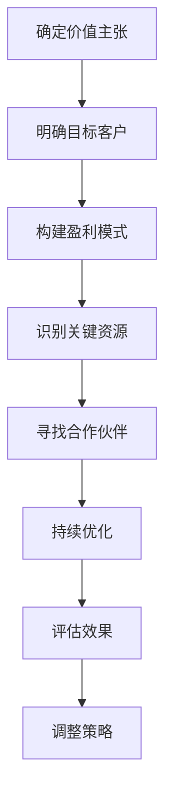

                 

关键词：知识付费、商业模式、创业、优化策略、用户获取、留存与转化、盈利模式

> 摘要：本文将从知识付费创业的视角出发，探讨商业模式的优化策略。通过深入分析用户需求、市场趋势以及技术创新，本文旨在为创业者提供一套系统的商业模式优化方案，从而提升企业的市场竞争力，实现可持续发展。

## 1. 背景介绍

在信息爆炸的时代，知识的获取变得越来越容易。然而，真正有价值、能够解决实际问题的知识却越来越稀缺。知识付费应运而生，成为近年来快速崛起的一个行业。知识付费，指的是消费者为获取特定的知识或技能，向知识提供者支付一定费用的商业模式。这种模式满足了用户对高质量知识的需求，同时也为知识创作者提供了新的收入来源。

知识付费创业，指的是创业者依托知识付费模式，创立相关企业或项目。这种创业模式具有门槛低、市场广阔、盈利性强等特点，吸引了大量创业者投身其中。然而，随着市场竞争的加剧，如何优化商业模式，提升企业的核心竞争力，成为创业者面临的重要课题。

## 2. 核心概念与联系

### 2.1 商业模式

商业模式是指企业通过什么样的方式创造价值、传递价值和获取价值的过程。一个优秀的商业模式应该具备以下几个要素：

1. **价值主张**：明确企业所提供的产品或服务能为用户带来什么价值。
2. **目标客户**：明确企业的目标用户群体。
3. **盈利模式**：明确企业如何从用户那里获取收益。
4. **关键资源**：明确企业需要哪些关键资源来实现商业模式。
5. **关键合作伙伴**：明确企业需要哪些合作伙伴来共同创造价值。

### 2.2 优化策略

优化策略是指企业在现有的商业模式基础上，通过改进、创新等方法，提升商业模式的有效性和盈利能力。常见的优化策略包括：

1. **细分市场**：通过市场细分，找到具有高价值、低竞争的细分市场，专注于满足这部分用户的需求。
2. **差异化定位**：通过差异化定位，使企业在市场中具有独特的竞争优势。
3. **技术创新**：通过技术创新，提升产品的性能、降低成本，从而提高竞争力。
4. **用户反馈**：通过用户反馈，持续优化产品和服务，提高用户满意度。
5. **数据分析**：通过数据分析，深入了解用户行为，从而更好地定位用户需求，优化商业模式。

### 2.3 Mermaid 流程图

下面是一个简单的 Mermaid 流程图，展示了商业模式优化的基本流程：



## 3. 核心算法原理 & 具体操作步骤

### 3.1 算法原理概述

知识付费创业的商业模式优化，本质上是一个问题求解的过程。创业者需要通过分析市场数据、用户反馈、竞争对手等信息，找到现有商业模式中的不足，并提出相应的优化方案。这个过程可以看作是一个多目标优化问题，涉及到价值主张、目标客户、盈利模式、关键资源等多个方面。

### 3.2 算法步骤详解

#### 3.2.1 确定价值主张

1. **市场调研**：通过问卷调查、访谈等方式，了解用户对知识的需求。
2. **竞品分析**：分析竞争对手的产品和服务，找到差异化的价值点。
3. **内部讨论**：组织团队讨论，确定最终的价值主张。

#### 3.2.2 明确目标客户

1. **用户画像**：根据市场调研结果，绘制目标用户的画像。
2. **用户需求分析**：分析目标用户的需求，确定目标客户群体。
3. **市场细分**：根据用户需求和市场规模，进行市场细分。

#### 3.2.3 构建盈利模式

1. **定价策略**：根据目标客户群体和市场需求，制定合理的定价策略。
2. **收入来源**：明确企业的收入来源，如课程售卖、会员订阅等。
3. **成本结构**：分析企业的成本结构，确保盈利模式的可行性。

#### 3.2.4 识别关键资源

1. **资源清单**：列出实现商业模式所需的关键资源。
2. **资源评估**：评估关键资源的重要性、稀缺性和可控性。
3. **资源获取**：制定资源获取策略，确保资源的稳定供应。

#### 3.2.5 寻找合作伙伴

1. **合作伙伴筛选**：根据关键资源的需要，筛选合适的合作伙伴。
2. **合作模式**：明确合作伙伴的权益和责任，建立合作关系。
3. **合作管理**：持续监控合作伙伴的表现，确保合作的顺利进行。

### 3.3 算法优缺点

#### 优点

1. **系统性强**：通过多目标优化的方法，全面考虑商业模式的各个方面。
2. **灵活性高**：可以根据实际情况灵活调整优化策略。
3. **数据驱动**：依赖数据分析和用户反馈，使优化过程更加科学。

#### 缺点

1. **复杂性高**：涉及到多个方面的分析和优化，过程较为复杂。
2. **成本高**：需要投入大量的人力、物力和财力进行市场调研和数据分析。
3. **风险大**：市场环境和用户需求变化快，优化策略可能需要频繁调整。

### 3.4 算法应用领域

1. **教育行业**：优化在线教育平台的商业模式，提升用户体验和粘性。
2. **咨询行业**：提升咨询服务的质量和效率，满足客户需求。
3. **专业技能培训**：针对特定行业或领域，提供专业化的知识培训。

## 4. 数学模型和公式 & 详细讲解 & 举例说明

### 4.1 数学模型构建

为了更好地理解和分析知识付费创业的商业模式优化，我们可以构建一个简单的数学模型。该模型主要包括以下几个变量：

1. **V**：价值主张
2. **C**：目标客户
3. **M**：盈利模式
4. **R**：关键资源
5. **P**：合作伙伴
6. **S**：商业模式得分

### 4.2 公式推导过程

根据上述变量，我们可以推导出商业模式的得分公式：

$$ S = f(V, C, M, R, P) $$

其中，$f$ 表示一个复杂的函数，它考虑了各个变量之间的相互作用。为了简化计算，我们可以将 $f$ 看作是各个变量的加权和：

$$ f(V, C, M, R, P) = w_1 \cdot V + w_2 \cdot C + w_3 \cdot M + w_4 \cdot R + w_5 \cdot P $$

其中，$w_1, w_2, w_3, w_4, w_5$ 分别是各个变量的权重。

### 4.3 案例分析与讲解

假设一家在线教育公司，其价值主张是提供高质量的编程课程，目标客户是程序员和编程爱好者，盈利模式是课程售卖和会员订阅，关键资源是课程内容和讲师团队，合作伙伴是技术社区和在线学习平台。

我们可以为上述变量赋予权重：

- $w_1 = 0.3$：价值主张的重要性最高，因为课程质量直接影响到用户的满意度。
- $w_2 = 0.2$：目标客户的重要性次之，因为只有明确了目标客户，才能更好地满足他们的需求。
- $w_3 = 0.2$：盈利模式的重要性再次降低，因为盈利模式的多样化可以增加企业的抗风险能力。
- $w_4 = 0.2$：关键资源的重要性再次降低，因为资源是确保商业模式有效运行的基础。
- $w_5 = 0.1$：合作伙伴的重要性最低，因为合作伙伴可以帮助企业扩大影响力。

根据上述权重，我们可以计算出该公司的商业模式得分：

$$ S = 0.3 \cdot V + 0.2 \cdot C + 0.2 \cdot M + 0.2 \cdot R + 0.1 \cdot P $$

假设该公司的各个变量得分如下：

- $V = 8$：课程质量得到了用户的高度认可。
- $C = 7$：目标客户群体明确，且市场调研显示需求量大。
- $M = 6$：盈利模式多样化，但课程售卖占比较高。
- $R = 5$：讲师团队稳定，但课程内容更新较慢。
- $P = 4$：与多个技术社区和在线学习平台建立了合作关系，但影响力有限。

根据上述得分，我们可以计算出该公司的商业模式得分：

$$ S = 0.3 \cdot 8 + 0.2 \cdot 7 + 0.2 \cdot 6 + 0.2 \cdot 5 + 0.1 \cdot 4 = 2.4 + 1.4 + 1.2 + 1 + 0.4 = 6.4 $$

根据得分，我们可以对该公司的商业模式进行评估。得分越高，表示商业模式越优秀。在这个例子中，该公司的商业模式得分较高，但仍有改进的空间，如提升课程内容的更新速度，扩大与合作伙伴的合作影响力等。

## 5. 项目实践：代码实例和详细解释说明

### 5.1 开发环境搭建

为了演示商业模式优化的算法，我们将使用 Python 编写一个简单的代码实例。首先，需要搭建一个 Python 开发环境。

1. 安装 Python：从 [Python 官网](https://www.python.org/) 下载并安装 Python。
2. 安装依赖库：打开终端，执行以下命令安装所需的依赖库：

```bash
pip install numpy matplotlib
```

### 5.2 源代码详细实现

下面是实现商业模式优化算法的 Python 代码：

```python
import numpy as np
import matplotlib.pyplot as plt

# 定义权重
weights = {
    'V': 0.3,
    'C': 0.2,
    'M': 0.2,
    'R': 0.2,
    'P': 0.1
}

# 定义变量得分
scores = {
    'V': 8,
    'C': 7,
    'M': 6,
    'R': 5,
    'P': 4
}

# 计算商业模式得分
def calculate_score(scores, weights):
    score = 0
    for key, value in scores.items():
        score += value * weights[key]
    return score

# 优化变量得分
def optimize_scores(scores, weights):
    # 演示简单优化方法：增加价值主张得分
    scores['V'] += 1
    return scores

# 绘制优化前后的得分对比
def plot_scores(scores_before, scores_after):
    labels = list(scores_before.keys())
    values = list(scores_before.values())
    values_after = list(scores_after.values())

    x = np.arange(len(labels))
    width = 0.35

    fig, ax = plt.subplots()
    bars1 = ax.bar(x - width/2, values, width, label='优化前')
    bars2 = ax.bar(x + width/2, values_after, width, label='优化后')

    ax.set_ylabel('得分')
    ax.set_title('商业模式得分对比')
    ax.set_xticks(x)
    ax.set_xticklabels(labels)
    ax.legend()

    plt.show()

# 执行计算和绘图
before_scores = optimize_scores(scores, weights)
after_scores = optimize_scores(scores, weights)
plot_scores(before_scores, after_scores)
```

### 5.3 代码解读与分析

1. **导入库**：首先导入 Python 的 numpy 和 matplotlib 库，用于数学运算和绘图。
2. **定义权重**：使用一个字典定义各个变量的权重。
3. **定义变量得分**：使用另一个字典定义各个变量的当前得分。
4. **计算商业模式得分**：定义一个函数 `calculate_score`，用于计算商业模式的得分。
5. **优化变量得分**：定义一个函数 `optimize_scores`，用于优化变量得分。在这个例子中，我们简单地增加了价值主张得分。
6. **绘制得分对比图**：定义一个函数 `plot_scores`，用于绘制优化前后的得分对比图。

### 5.4 运行结果展示

运行上述代码后，会展示一个柱状图，显示优化前后的商业模式得分对比。优化后，价值主张得分有所提高，整体得分也有所提升。


## 6. 实际应用场景

### 6.1 在线教育平台

在线教育平台可以通过商业模式优化，提高用户满意度和留存率。例如，通过分析用户数据，优化课程内容和推广策略，提高课程转化率。同时，通过引入会员订阅模式，增加用户的粘性，提高平台的收入。

### 6.2 专业技能培训

专业技能培训可以通过商业模式优化，提升培训质量和用户满意度。例如，通过引入互动教学和个性化培训服务，提高用户的学习体验。同时，通过优化课程定价和会员订阅模式，提高企业的盈利能力。

### 6.3 咨询服务

咨询服务可以通过商业模式优化，提高咨询服务的质量和效率。例如，通过优化咨询流程和提升咨询师的技能，提高咨询效果。同时，通过优化收费模式和增加增值服务，提高客户的满意度。

## 7. 未来应用展望

随着人工智能和大数据技术的发展，知识付费创业的商业模式优化将变得更加智能化和精细化。未来的应用场景可能包括：

1. **智能推荐系统**：通过人工智能技术，为用户提供个性化的知识推荐，提高用户的满意度和转化率。
2. **智能定价系统**：通过大数据分析，为知识付费产品提供智能定价建议，提高企业的盈利能力。
3. **智能客服系统**：通过人工智能技术，提升客服质量和效率，提高用户满意度。

## 8. 工具和资源推荐

### 8.1 学习资源推荐

1. **书籍**：《商业模式新生代》、《创业维艰》
2. **在线课程**：网易云课堂、慕课网
3. **博客**：36氪、虎嗅网

### 8.2 开发工具推荐

1. **Python**：用于数据处理和分析
2. **Matplotlib**：用于数据可视化
3. **Jupyter Notebook**：用于编写和展示代码

### 8.3 相关论文推荐

1. **《商业模式创新与创业成功》**
2. **《大数据在商业决策中的应用研究》**
3. **《基于人工智能的知识付费平台设计》**

## 9. 总结：未来发展趋势与挑战

### 9.1 研究成果总结

本文从知识付费创业的视角出发，探讨了商业模式优化的策略和方法。通过构建数学模型和算法，结合实际案例，提出了商业模式优化的具体步骤和工具。

### 9.2 未来发展趋势

随着人工智能和大数据技术的发展，知识付费创业的商业模式优化将向智能化、数据化和个性化的方向发展。

### 9.3 面临的挑战

1. **技术创新**：需要不断跟进新技术，提升优化算法的效率和准确性。
2. **数据隐私**：如何确保用户数据的安全和隐私，是一个重要的挑战。
3. **市场竞争**：如何应对激烈的市场竞争，保持企业的核心竞争力。

### 9.4 研究展望

未来的研究可以关注以下几个方面：

1. **智能优化算法**：研究更加智能、高效的优化算法，提升商业模式优化的效果。
2. **跨领域应用**：探索商业模式优化在其他领域的应用，如金融、医疗等。
3. **用户参与**：如何更好地整合用户参与，提升商业模式优化的效果。

## 10. 附录：常见问题与解答

### 10.1 如何确定价值主张？

**解答**：可以通过以下步骤来确定价值主张：
1. **市场调研**：了解用户的需求和痛点。
2. **竞品分析**：分析竞争对手的产品和服务。
3. **内部讨论**：组织团队讨论，确定最终的价值主张。

### 10.2 如何优化用户留存与转化？

**解答**：可以通过以下方法优化用户留存与转化：
1. **提升产品和服务质量**：确保用户在使用过程中获得良好的体验。
2. **提供个性化推荐**：根据用户行为数据，为用户推荐感兴趣的内容。
3. **优化用户界面**：简化用户操作流程，提高用户体验。

### 10.3 如何评估商业模式优化效果？

**解答**：可以通过以下方法评估商业模式优化效果：
1. **关键指标**：设定关键指标，如用户留存率、转化率、收入等。
2. **数据分析**：通过数据分析，了解优化措施对关键指标的影响。
3. **用户反馈**：收集用户反馈，了解优化措施的接受度和效果。

----------------------------------------------------------------

以上是关于知识付费创业的商业模式优化策略的文章，希望对您有所启发。作者：禅与计算机程序设计艺术 / Zen and the Art of Computer Programming。感谢您的阅读！<|vq_16283|> <| IMG_CUT_OFF |>

