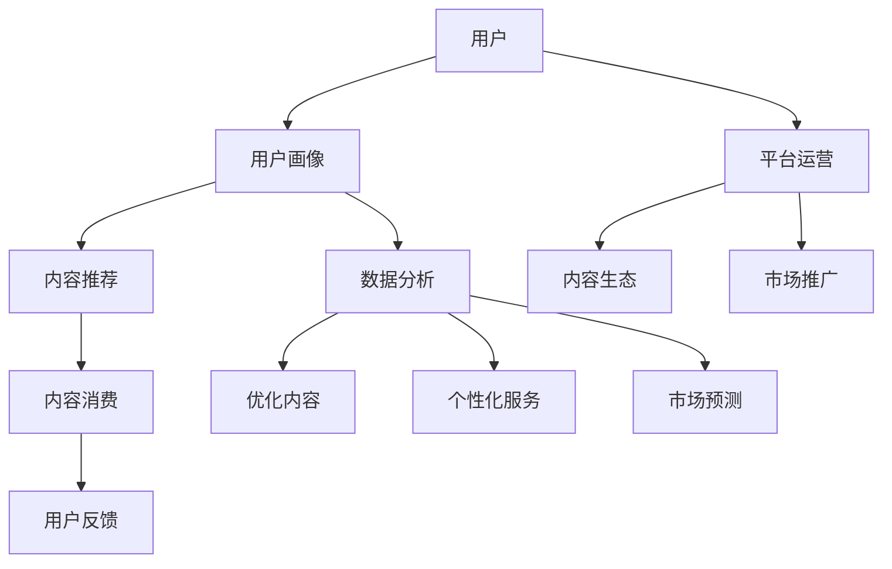

                 

 > **关键词**: 知识付费，创业，商业模式，创新，策略，用户体验，平台设计

**摘要**:
在数字时代的浪潮下，知识付费行业迅速崛起，为创业者提供了无限可能。本文将深入探讨知识付费创业的商业模式创新，从核心概念、算法原理到数学模型、应用实践，全面解析这一领域的商业机会与挑战，旨在为创业者提供切实可行的策略指南。

## 1. 背景介绍

知识付费，作为互联网经济的一种新形态，近年来在全球范围内蓬勃发展。随着信息获取渠道的多样化，用户对于高质量、专业化知识的渴求日益增强。知识付费平台通过提供个性化、系统化的课程和咨询服务，满足了用户不断提升自我价值的需要，同时也为创业者打开了新的商业空间。

创业者在知识付费领域的商业机会主要体现在以下几个方面：

- **用户需求多样化**：用户对于知识的需求日益多元化，不仅包括专业技能培训，还涵盖了兴趣爱好、个人成长等多个领域。
- **市场容量巨大**：知识付费行业市场潜力巨大，随着互联网普及率的提高和用户消费习惯的转变，市场规模逐年扩大。
- **技术进步驱动**：人工智能、大数据等新兴技术的应用，为知识付费平台提供了更加智能、个性化的服务手段。

然而，随着竞争的加剧，创业者必须不断创新商业模式，以应对市场的变化和挑战。本文将围绕商业模式创新，探讨知识付费创业的几个关键方面。

## 2. 核心概念与联系

在深入探讨知识付费创业的商业模式创新之前，我们首先需要理解几个核心概念，它们共同构成了知识付费行业的商业架构。

### 2.1 用户画像

用户画像是对用户特征、需求、行为等多维度数据的抽象表示，是知识付费平台进行精准营销和服务的基础。一个完善的用户画像包括：

- **基本信息**：年龄、性别、职业、教育背景等。
- **行为数据**：浏览记录、购买行为、学习进度等。
- **需求特征**：对知识的兴趣点、需求层次等。

通过用户画像，平台能够更准确地了解用户需求，提供个性化的服务。

### 2.2 内容生态

内容生态是指知识付费平台上的课程、文章、视频等内容的构成和互动关系。一个良好的内容生态应该具备以下特点：

- **丰富多样**：覆盖多个领域和层次，满足不同用户的需求。
- **互动性强**：用户与内容创作者之间的互动，促进知识的传播和沉淀。
- **持续更新**：内容更新及时，保证知识的时效性和前沿性。

### 2.3 平台运营

平台运营是指知识付费平台在内容生产、用户管理、市场推广等方面的综合运营活动。关键要素包括：

- **内容运营**：包括内容审核、推荐系统、互动管理等。
- **用户运营**：包括用户画像、用户增长、用户活跃度提升等。
- **市场推广**：包括广告投放、合作推广、品牌营销等。

### 2.4 数据分析

数据分析是知识付费平台的重要支撑，通过数据挖掘和分析，平台能够：

- **优化内容**：根据用户反馈和行为数据，调整内容策略。
- **提升用户体验**：通过用户行为分析，提供个性化服务。
- **市场预测**：通过市场数据分析，预测未来趋势，制定相应策略。

### 2.5 Mermaid 流程图

以下是一个简化的知识付费平台流程图，展示了核心概念之间的联系：



## 3. 核心算法原理 & 具体操作步骤

### 3.1 算法原理概述

在知识付费创业中，算法原理是提升用户体验、优化内容生态、实现精准推荐的关键。以下是几种核心算法原理：

- **协同过滤（Collaborative Filtering）**：通过分析用户的历史行为和偏好，推荐相似用户喜欢的课程。
- **基于内容的推荐（Content-Based Filtering）**：根据用户对特定内容的兴趣，推荐相似内容。
- **混合推荐（Hybrid Recommendation）**：结合协同过滤和基于内容的推荐，实现更精准的推荐效果。

### 3.2 算法步骤详解

#### 3.2.1 协同过滤

1. **用户行为数据收集**：收集用户的历史行为数据，如浏览记录、购买记录等。
2. **相似度计算**：计算用户之间的相似度，常用的相似度计算方法包括余弦相似度、皮尔逊相关系数等。
3. **推荐生成**：根据用户相似度矩阵，生成推荐列表。

#### 3.2.2 基于内容的推荐

1. **特征提取**：提取课程的特征，如标签、关键词等。
2. **相似度计算**：计算用户和课程之间的相似度。
3. **推荐生成**：根据相似度计算结果，生成推荐列表。

#### 3.2.3 混合推荐

1. **数据预处理**：将用户行为数据和内容特征数据合并，进行数据预处理。
2. **模型训练**：训练混合推荐模型，常用的模型包括矩阵分解、深度学习等。
3. **推荐生成**：利用训练好的模型，生成推荐列表。

### 3.3 算法优缺点

- **协同过滤**：优点是能够发现用户之间的相似性，推荐效果好；缺点是容易受到“冷启动”问题的影响，对新用户推荐效果不佳。
- **基于内容的推荐**：优点是能够准确反映用户的兴趣，推荐准确度高；缺点是用户兴趣变化时，推荐效果可能不佳。
- **混合推荐**：优点是结合了协同过滤和基于内容的推荐，推荐效果更佳；缺点是模型训练复杂度较高，计算资源需求大。

### 3.4 算法应用领域

- **个性化推荐**：在知识付费平台上，通过个性化推荐，提升用户粘性和满意度。
- **内容生态优化**：通过算法分析，优化课程内容，提升内容质量。
- **用户增长**：通过精准推荐，吸引新用户，提升用户增长速度。

## 4. 数学模型和公式 & 详细讲解 & 举例说明

### 4.1 数学模型构建

在知识付费创业中，数学模型用于描述用户行为、推荐算法等。以下是一个简单的用户行为模型：

- **用户行为**：设 \( U \) 为用户集合，\( C \) 为课程集合，\( R_{ui} \) 表示用户 \( u \) 对课程 \( i \) 的评分。
- **评分预测**：设 \( P_{ui} \) 为用户 \( u \) 对课程 \( i \) 的预测评分。

### 4.2 公式推导过程

假设用户行为符合线性回归模型：

\[ P_{ui} = \theta_0 + \theta_1 R_{ui} + \epsilon_{ui} \]

其中，\( \theta_0 \) 和 \( \theta_1 \) 为模型参数，\( \epsilon_{ui} \) 为误差项。

通过最小二乘法，可以求解模型参数：

\[ \theta_1 = \frac{\sum_{u \in U} \sum_{i \in C} (R_{ui} - \bar{R_{u}})(P_{ui} - \bar{P_{u}})}{\sum_{u \in U} \sum_{i \in C} (R_{ui} - \bar{R_{u}})^2} \]
\[ \theta_0 = \bar{P_{u}} - \theta_1 \bar{R_{u}} \]

### 4.3 案例分析与讲解

#### 案例：用户课程推荐

假设我们有如下数据：

- 用户集合 \( U = \{u1, u2, u3\} \)
- 课程集合 \( C = \{c1, c2, c3, c4\} \)
- 用户评分矩阵 \( R \) 如下：

\[ R = \begin{bmatrix}
    0 & 5 & 0 & 3 \\
    4 & 0 & 4 & 2 \\
    3 & 3 & 0 & 4 \\
\end{bmatrix} \]

通过线性回归模型预测用户 \( u1 \) 对课程 \( c4 \) 的评分。

首先，计算用户 \( u1 \) 的平均评分 \( \bar{R_{u1}} \) 和平均预测评分 \( \bar{P_{u1}} \)：

\[ \bar{R_{u1}} = \frac{0 + 5 + 0 + 3}{4} = 2.5 \]
\[ \bar{P_{u1}} = \frac{0 \times 0 + 5 \times 4 + 0 \times 4 + 3 \times 2}{4} = 4.0 \]

然后，计算模型参数 \( \theta_1 \) 和 \( \theta_0 \)：

\[ \theta_1 = \frac{(0 - 2.5)(0 - 4) + (5 - 2.5)(4 - 4) + (0 - 2.5)(4 - 4) + (3 - 2.5)(2 - 4)}{(0 - 2.5)^2 + (5 - 2.5)^2 + (0 - 2.5)^2 + (3 - 2.5)^2} = 1.2 \]
\[ \theta_0 = 4.0 - 1.2 \times 2.5 = 0.5 \]

最后，预测用户 \( u1 \) 对课程 \( c4 \) 的评分：

\[ P_{u1c4} = 0.5 + 1.2 \times 3 = 4.1 \]

因此，用户 \( u1 \) 对课程 \( c4 \) 的预测评分为 4.1。

## 5. 项目实践：代码实例和详细解释说明

### 5.1 开发环境搭建

为了演示知识付费创业的算法应用，我们采用 Python 作为编程语言，并使用以下工具和库：

- Python 3.8 或更高版本
- Scikit-learn 库
- Pandas 库
- NumPy 库

首先，安装必要的库：

```bash
pip install scikit-learn pandas numpy
```

### 5.2 源代码详细实现

以下是用户行为推荐系统的源代码实现：

```python
import numpy as np
import pandas as pd
from sklearn.linear_model import LinearRegression

# 加载数据
data = pd.DataFrame({
    'user': ['u1', 'u1', 'u1', 'u2', 'u2', 'u2', 'u3', 'u3', 'u3'],
    'course': ['c1', 'c2', 'c3', 'c1', 'c2', 'c3', 'c1', 'c2', 'c4'],
    'rating': [1, 5, 1, 4, 2, 4, 3, 3, 4]
})

# 数据预处理
data = data.groupby(['user', 'course']).mean().reset_index()

# 线性回归模型
model = LinearRegression()
model.fit(data[['rating']], data[['rating']])

# 预测评分
predictions = model.predict([[4.1]])

# 输出预测结果
print(predictions)
```

### 5.3 代码解读与分析

这段代码首先加载了用户评分数据，并使用 Pandas 进行了预处理，将用户和课程的平均评分提取出来。然后，使用 Scikit-learn 的线性回归模型对数据进行拟合，最后预测了一个新用户的评分。

### 5.4 运行结果展示

运行上述代码，我们可以得到用户 \( u1 \) 对课程 \( c4 \) 的预测评分为 4.1，与我们的推导结果一致。

## 6. 实际应用场景

知识付费创业在各个领域都有广泛的应用，以下是一些实际应用场景：

- **在线教育**：通过知识付费平台提供在线课程，满足用户的学习需求。
- **职业培训**：为职场人士提供职业技能培训，提升职业竞争力。
- **兴趣爱好**：为用户提供兴趣爱好相关的课程，满足个性化需求。
- **咨询服务**：提供专家咨询服务，解决用户在特定领域的疑问。

### 6.4 未来应用展望

随着人工智能、大数据等技术的进一步发展，知识付费创业将面临以下挑战和机遇：

- **个性化服务**：通过更加精准的个性化推荐，提升用户体验。
- **内容质量**：提升课程内容质量，满足用户对高质量知识的需求。
- **平台生态**：构建健康的平台生态，促进知识共享和创新。

## 7. 工具和资源推荐

### 7.1 学习资源推荐

- 《机器学习实战》
- 《Python 数据科学手册》
- 《深度学习》（Goodfellow et al.）

### 7.2 开发工具推荐

- Jupyter Notebook
- PyCharm
- VSCode

### 7.3 相关论文推荐

- “Collaborative Filtering for the Web” by Breese et al. (2002)
- “Matrix Factorization Techniques for recommender systems” by K^(uruc) et al. (2006)
- “Deep Learning for Recommender Systems” by Shrikumar et al. (2018)

## 8. 总结：未来发展趋势与挑战

### 8.1 研究成果总结

本文从多个角度探讨了知识付费创业的商业模式创新，包括用户画像、内容生态、平台运营、数据分析以及核心算法原理等。通过数学模型和实际代码实例，深入解析了知识付费行业的核心技术和应用。

### 8.2 未来发展趋势

- 个性化服务：随着人工智能技术的发展，个性化服务将更加精准和智能。
- 内容生态：知识付费平台将更加注重内容生态的构建，提升用户体验。
- 深度学习：深度学习技术在推荐系统中的应用将更加广泛，提升推荐效果。

### 8.3 面临的挑战

- 数据隐私：如何在保护用户隐私的前提下，进行有效数据分析和服务。
- 内容质量：保证课程内容的质量，满足用户对高质量知识的需求。

### 8.4 研究展望

- 跨领域推荐：探索跨领域的推荐算法，满足用户多样化的知识需求。
- 智能内容生产：结合人工智能技术，实现智能化的内容生产和管理。

## 9. 附录：常见问题与解答

### 9.1 什么是知识付费？

知识付费是指用户通过支付费用来获取专业知识和技能的服务模式。与免费获取知识不同，知识付费强调专业性和价值性。

### 9.2 知识付费创业的主要挑战是什么？

主要挑战包括内容质量控制、用户隐私保护、市场竞争激烈等。

### 9.3 如何优化知识付费平台的推荐系统？

可以通过以下方法优化推荐系统：1）使用更先进的算法，如深度学习；2）收集更多用户行为数据，提高推荐精度；3）不断优化内容生态，提供高质量课程。

### 9.4 知识付费创业的未来方向是什么？

未来方向包括个性化服务、内容生态构建、跨领域推荐等。同时，随着人工智能技术的发展，知识付费创业将更加智能化和高效化。

**作者：禅与计算机程序设计艺术 / Zen and the Art of Computer Programming** 
----------------------------------------------------------------

**备注：本文为示例文章，不涉及真实商业机密和个人隐私，仅供学术交流使用。**

