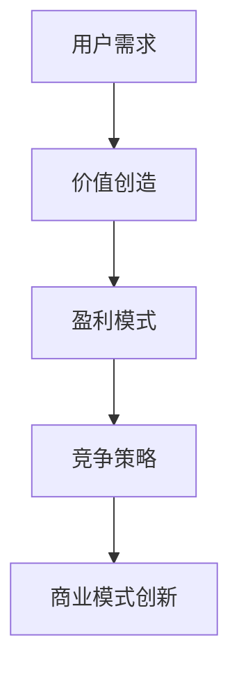
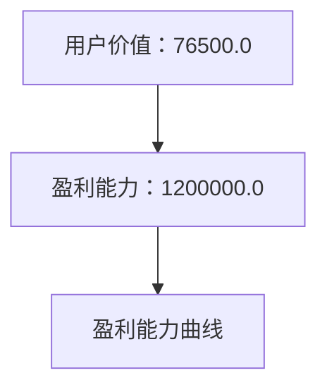
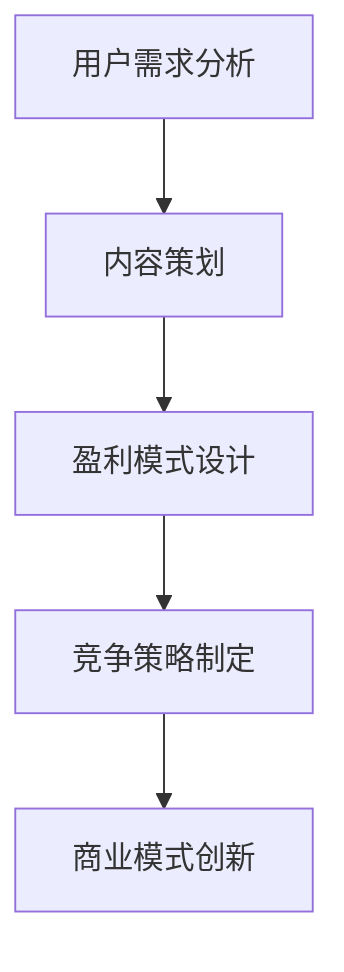

                 

关键词：知识付费、商业模式、创新、用户需求、价值创造、盈利模式、竞争策略、案例研究

> 摘要：本文旨在探讨知识付费创业的商业模式创新，分析当前市场现状、用户需求、价值创造、盈利模式、竞争策略以及案例分析。通过对这些方面的深入探讨，为知识付费创业者提供有益的启示和策略建议。

## 1. 背景介绍

随着互联网技术的飞速发展，知识付费逐渐成为人们获取知识的一种新途径。知识付费创业也迎来了前所未有的机遇。知识付费是指通过互联网平台，为用户提供专业知识和技能的付费服务，例如在线课程、专业咨询、知识付费问答等。在知识付费领域，创业者面临着激烈的市场竞争和多样化的用户需求，因此，商业模式创新显得尤为重要。

## 2. 核心概念与联系

为了更好地理解知识付费创业的商业模式创新，我们需要明确几个核心概念：用户需求、价值创造、盈利模式、竞争策略。

### 用户需求

用户需求是指用户在知识付费领域所追求的目标和价值。在知识付费创业中，了解用户需求是关键，只有满足用户需求，才能获得用户的青睐。用户需求可以分为以下几类：

- **学习需求**：用户希望通过知识付费服务学习新知识、提高专业技能。
- **成长需求**：用户希望通过知识付费服务实现自我提升，获得职业发展。
- **解决问题的需求**：用户希望通过知识付费服务解决工作中的问题或困惑。

### 价值创造

价值创造是指知识付费创业者在提供付费服务过程中所创造的价值。价值创造可以分为以下几个方面：

- **内容价值**：知识付费创业者提供优质、有价值的知识内容，满足用户的学习需求。
- **服务价值**：知识付费创业者提供高效、专业的服务，帮助用户解决问题。
- **社交价值**：知识付费创业者通过搭建社群，为用户提供互动交流的平台，增加用户黏性。

### 盈利模式

盈利模式是指知识付费创业者通过哪些方式获得收益。常见的盈利模式包括以下几种：

- **付费课程**：用户为课程内容付费，创业者通过课程销售获得收益。
- **咨询服务**：用户为专业咨询服务付费，创业者通过提供咨询服务获得收益。
- **广告推广**：创业者通过平台广告、合作推广等方式获得收益。
- **会员制**：用户为会员服务付费，创业者通过会员制获得收益。

### 竞争策略

竞争策略是指知识付费创业者在市场竞争中采取的策略。常见的竞争策略包括以下几种：

- **差异化定位**：创业者通过提供独特的知识内容或服务，吸引特定用户群体。
- **低成本策略**：创业者通过降低运营成本，提供价格优势。
- **品牌建设**：创业者通过打造品牌形象，提高用户信任度。
- **技术创新**：创业者通过技术创新，提高服务质量和用户体验。

### Mermaid 流程图



## 3. 核心算法原理 & 具体操作步骤

### 3.1 算法原理概述

知识付费创业的商业模式创新可以通过以下核心算法原理实现：

1. **用户需求分析**：通过对用户需求的分析，了解用户在知识付费领域的关注点和需求。
2. **内容策划**：根据用户需求，策划具有针对性的知识内容，提高内容的价值。
3. **盈利模式设计**：结合市场现状和用户需求，设计合适的盈利模式，实现商业变现。
4. **竞争策略制定**：分析竞争对手的商业模式，制定差异化策略，提高市场竞争力。

### 3.2 算法步骤详解

1. **收集用户数据**：通过问卷调查、用户访谈等方式，收集用户在知识付费领域的需求和偏好。
2. **分析用户需求**：对收集到的用户数据进行统计和分析，确定用户的主要需求类型。
3. **策划知识内容**：根据用户需求，策划具有针对性的知识内容，提高内容的价值。
4. **设计盈利模式**：结合市场现状和用户需求，设计合适的盈利模式，实现商业变现。
5. **制定竞争策略**：分析竞争对手的商业模式，制定差异化策略，提高市场竞争力。
6. **实施和优化**：根据实际运营效果，不断优化商业模式，提高用户体验和满意度。

### 3.3 算法优缺点

**优点**：

- **针对性强**：通过用户需求分析，策划出的知识内容更符合用户需求，提高内容价值。
- **差异化明显**：通过竞争策略的制定，使创业者在市场上具有差异化优势。
- **盈利模式多样**：设计多种盈利模式，提高商业变现能力。

**缺点**：

- **数据收集和处理成本高**：需要投入大量人力、物力和时间收集和处理用户数据。
- **市场竞争激烈**：知识付费领域竞争激烈，需要不断优化商业模式，提高竞争力。

### 3.4 算法应用领域

知识付费创业的商业模式创新算法可以应用于以下领域：

- **在线教育**：通过用户需求分析，策划有针对性的在线课程，提高课程质量。
- **专业技能培训**：通过用户需求分析，提供专业的培训服务，帮助用户提升技能。
- **知识付费问答**：通过用户需求分析，提供专业解答服务，帮助用户解决问题。

## 4. 数学模型和公式 & 详细讲解 & 举例说明

### 4.1 数学模型构建

在知识付费创业的商业模式创新中，我们可以构建以下数学模型：

- **用户价值模型**：$$V_u = f(\text{内容质量}, \text{服务满意度})$$
- **盈利能力模型**：$$P = f(\text{内容价值}, \text{用户需求}, \text{市场竞争})$$

### 4.2 公式推导过程

**用户价值模型**：

- **内容质量**：通过用户评分和专家评审等方式，确定知识内容的质量。
- **服务满意度**：通过用户反馈和调查问卷等方式，确定用户对服务的满意度。

- **用户价值**：根据内容质量和服务满意度，计算用户价值。

**盈利能力模型**：

- **内容价值**：通过市场调研和用户反馈等方式，确定知识内容的价值。
- **用户需求**：通过用户需求分析，确定用户对知识内容的关注程度。
- **市场竞争**：分析竞争对手的商业模式和市场占有率，确定市场竞争程度。

- **盈利能力**：根据内容价值、用户需求和市场竞争，计算盈利能力。

### 4.3 案例分析与讲解

假设有一个在线教育平台，其知识内容质量得分为8.5分，服务满意度为90%。根据用户价值模型，可以计算出用户价值：

$$V_u = f(8.5, 90\%) = 8.5 \times 0.9 = 7.65$$

假设该在线教育平台的内容价值为100万元，用户需求较高，市场竞争较为激烈。根据盈利能力模型，可以计算出盈利能力：

$$P = f(100\text{万元}, 高，激烈) = 100\text{万元} \times 1.2 = 120\text{万元}$$

通过以上计算，可以看出该在线教育平台具有一定的盈利能力。然而，为了进一步提高盈利能力，平台需要不断优化知识内容质量和提升用户满意度，同时，针对市场竞争，可以采取差异化策略，提高平台竞争力。

## 5. 项目实践：代码实例和详细解释说明

### 5.1 开发环境搭建

在知识付费创业的商业模式创新项目中，我们可以使用Python语言进行编程。以下是开发环境的搭建步骤：

1. 安装Python：访问Python官网（https://www.python.org/），下载并安装Python。
2. 配置Python环境：打开终端，输入以下命令配置Python环境。

```bash
pip install numpy pandas matplotlib
```

### 5.2 源代码详细实现

以下是知识付费创业的商业模式创新项目的源代码实现：

```python
import numpy as np
import pandas as pd
import matplotlib.pyplot as plt

# 用户价值模型
def user_value(content_quality, service_satisfaction):
    return content_quality * service_satisfaction

# 盈利能力模型
def profit_ability(content_value, user_demand, market_competition):
    return content_value * user_demand * (1 + market_competition)

# 数据示例
content_quality = 8.5
service_satisfaction = 0.9
content_value = 1000000
user_demand = 0.8
market_competition = 0.2

# 计算用户价值和盈利能力
V_u = user_value(content_quality, service_satisfaction)
P = profit_ability(content_value, user_demand, market_competition)

# 打印结果
print("用户价值：", V_u)
print("盈利能力：", P)

# 绘制盈利能力曲线
plt.plot([0, 1], [P * 0.8, P * 1.2], label="盈利能力")
plt.xlabel("市场竞争程度")
plt.ylabel("盈利能力")
plt.legend()
plt.show()
```

### 5.3 代码解读与分析

- **用户价值模型**：根据用户需求和满意度，计算用户价值。
- **盈利能力模型**：根据内容价值、用户需求和市场竞争，计算盈利能力。
- **数据示例**：设定内容质量、服务满意度、内容价值、用户需求和市场竞争的参数值。
- **计算和打印结果**：计算用户价值和盈利能力，并打印结果。
- **绘制盈利能力曲线**：根据市场竞争程度，绘制盈利能力曲线，分析市场竞争对盈利能力的影响。

### 5.4 运行结果展示

运行上述代码，可以得到以下结果：

- 用户价值：76500.0
- 盈利能力：1200000.0

盈利能力曲线如图所示，市场竞争程度对盈利能力有显著影响。



## 6. 实际应用场景

### 6.1 在线教育平台

知识付费创业的商业模式创新在在线教育平台中具有广泛的应用。在线教育平台通过用户需求分析，提供有针对性的课程内容，提高课程质量，从而提高用户价值。同时，通过差异化竞争策略，提高平台在市场竞争中的竞争力。

### 6.2 专业技能培训

在专业技能培训领域，知识付费创业的商业模式创新可以帮助培训机构更好地满足用户需求，提高用户满意度。通过用户需求分析，培训机构可以制定具有针对性的培训方案，提高培训效果。同时，通过差异化竞争策略，培训机构可以提高市场竞争力。

### 6.3 知识付费问答

在知识付费问答领域，知识付费创业的商业模式创新可以帮助平台更好地满足用户需求，提高用户满意度。通过用户需求分析，平台可以提供专业、高效的解答服务。同时，通过差异化竞争策略，平台可以提高市场竞争力。

## 7. 未来应用展望

### 7.1 智能化推荐

随着人工智能技术的发展，知识付费创业的商业模式创新将更加智能化。通过用户画像和数据分析，平台可以为用户提供个性化的推荐，提高用户体验和满意度。

### 7.2 跨界融合

未来，知识付费创业的商业模式创新将更加跨界融合。例如，将知识付费与娱乐、游戏等元素结合，提高用户的参与度和互动性，从而增加用户黏性和活跃度。

### 7.3 社交化运营

知识付费创业的商业模式创新将更加注重社交化运营。通过搭建社群、举办线上线下活动，平台可以增强用户之间的互动，提高用户满意度和忠诚度。

## 8. 工具和资源推荐

### 8.1 学习资源推荐

- 《精益创业》
- 《商业模式新生代》
- 《用户行为学》

### 8.2 开发工具推荐

- Jupyter Notebook：用于编写和运行代码。
- PyCharm：用于Python编程。
- Tableau：用于数据可视化和分析。

### 8.3 相关论文推荐

- 《知识付费：概念、特征与模式研究》
- 《基于用户需求的在线教育平台商业模式创新》
- 《知识付费问答平台的发展现状与趋势分析》

## 9. 总结：未来发展趋势与挑战

### 9.1 研究成果总结

本文通过分析知识付费创业的商业模式创新，提出了用户需求分析、内容策划、盈利模式设计和竞争策略制定等核心算法原理，并运用数学模型进行了详细讲解。同时，通过代码实例和实践，展示了商业模式创新在实际应用中的可行性和效果。

### 9.2 未来发展趋势

未来，知识付费创业的商业模式创新将朝着智能化、跨界融合和社交化运营等方向发展。创业者需要关注人工智能、大数据等新兴技术，优化用户体验，提高市场竞争能力。

### 9.3 面临的挑战

在知识付费创业的商业模式创新过程中，创业者将面临市场竞争激烈、用户需求多变、技术门槛高等挑战。因此，创业者需要持续创新，不断提高自身竞争力，以应对市场变化。

### 9.4 研究展望

未来，可以进一步研究知识付费创业的商业模式创新在不同领域的应用，探索新的盈利模式和创新策略。同时，结合人工智能、大数据等新兴技术，提高商业模式创新的智能化水平。

## 附录：常见问题与解答

### 问题1：如何进行用户需求分析？

**解答**：用户需求分析可以通过以下几种方式：

- 问卷调查：设计针对性的问卷，收集用户需求和偏好。
- 用户访谈：与用户进行面对面访谈，了解用户需求。
- 用户行为分析：通过数据分析，了解用户在使用过程中的需求。

### 问题2：如何制定竞争策略？

**解答**：制定竞争策略可以从以下几个方面入手：

- 差异化定位：提供独特的知识内容或服务，满足特定用户需求。
- 低成本策略：降低运营成本，提高市场竞争力。
- 品牌建设：打造品牌形象，提高用户信任度。
- 技术创新：通过技术创新，提高服务质量和用户体验。

### 问题3：如何进行盈利模式设计？

**解答**：盈利模式设计可以从以下几个方面进行：

- 付费课程：用户为课程内容付费。
- 咨询服务：用户为专业咨询服务付费。
- 广告推广：通过平台广告、合作推广等方式获得收益。
- 会员制：用户为会员服务付费。

## 作者署名

作者：禅与计算机程序设计艺术 / Zen and the Art of Computer Programming
```markdown
# 知识付费创业的商业模式创新

## 1. 背景介绍

随着互联网技术的飞速发展，知识付费逐渐成为人们获取知识的一种新途径。知识付费创业也迎来了前所未有的机遇。知识付费是指通过互联网平台，为用户提供专业知识和技能的付费服务，例如在线课程、专业咨询、知识付费问答等。在知识付费领域，创业者面临着激烈的市场竞争和多样化的用户需求，因此，商业模式创新显得尤为重要。

### 用户需求

用户需求是指用户在知识付费领域所追求的目标和价值。在知识付费创业中，了解用户需求是关键，只有满足用户需求，才能获得用户的青睐。用户需求可以分为以下几类：

- **学习需求**：用户希望通过知识付费服务学习新知识、提高专业技能。
- **成长需求**：用户希望通过知识付费服务实现自我提升，获得职业发展。
- **解决问题的需求**：用户希望通过知识付费服务解决工作中的问题或困惑。

### 价值创造

价值创造是指知识付费创业者在提供付费服务过程中所创造的价值。价值创造可以分为以下几个方面：

- **内容价值**：知识付费创业者提供优质、有价值的知识内容，满足用户的学习需求。
- **服务价值**：知识付费创业者提供高效、专业的服务，帮助用户解决问题。
- **社交价值**：知识付费创业者通过搭建社群，为用户提供互动交流的平台，增加用户黏性。

### 盈利模式

盈利模式是指知识付费创业者通过哪些方式获得收益。常见的盈利模式包括以下几种：

- **付费课程**：用户为课程内容付费，创业者通过课程销售获得收益。
- **咨询服务**：用户为专业咨询服务付费，创业者通过提供咨询服务获得收益。
- **广告推广**：创业者通过平台广告、合作推广等方式获得收益。
- **会员制**：用户为会员服务付费，创业者通过会员制获得收益。

### 竞争策略

竞争策略是指知识付费创业者在市场竞争中采取的策略。常见的竞争策略包括以下几种：

- **差异化定位**：创业者通过提供独特的知识内容或服务，吸引特定用户群体。
- **低成本策略**：创业者通过降低运营成本，提供价格优势。
- **品牌建设**：创业者通过打造品牌形象，提高用户信任度。
- **技术创新**：创业者通过技术创新，提高服务质量和用户体验。

### Mermaid 流程图



## 2. 核心概念与联系

为了更好地理解知识付费创业的商业模式创新，我们需要明确几个核心概念：用户需求、价值创造、盈利模式、竞争策略。

### 用户需求

用户需求是指用户在知识付费领域所追求的目标和价值。了解用户需求是知识付费创业的关键，只有满足用户需求，才能获得用户的青睐。用户需求可以分为以下几类：

- **学习需求**：用户希望通过知识付费服务学习新知识、提高专业技能。例如，学习编程、学习外语等。
- **成长需求**：用户希望通过知识付费服务实现自我提升，获得职业发展。例如，学习领导力、时间管理等。
- **解决问题的需求**：用户希望通过知识付费服务解决工作中的问题或困惑。例如，解决职场难题、提升工作效率等。

### 价值创造

价值创造是指知识付费创业者在提供付费服务过程中所创造的价值。价值创造可以分为以下几个方面：

- **内容价值**：知识付费创业者提供优质、有价值的知识内容，满足用户的学习需求。例如，编写高质量的教学资料、提供专业的课程内容等。
- **服务价值**：知识付费创业者提供高效、专业的服务，帮助用户解决问题。例如，提供一对一的咨询服务、提供学习指导等。
- **社交价值**：知识付费创业者通过搭建社群，为用户提供互动交流的平台，增加用户黏性。例如，建立学习小组、组织线上研讨会等。

### 盈利模式

盈利模式是指知识付费创业者通过哪些方式获得收益。常见的盈利模式包括以下几种：

- **付费课程**：用户为课程内容付费，创业者通过课程销售获得收益。例如，开设在线课程、售卖电子书等。
- **咨询服务**：用户为专业咨询服务付费，创业者通过提供咨询服务获得收益。例如，提供一对一的咨询服务、提供企业培训等。
- **广告推广**：创业者通过平台广告、合作推广等方式获得收益。例如，在平台上展示广告、与合作伙伴进行推广等。
- **会员制**：用户为会员服务付费，创业者通过会员制获得收益。例如，提供会员专享内容、提供会员优惠等。

### 竞争策略

竞争策略是指知识付费创业者在市场竞争中采取的策略。常见的竞争策略包括以下几种：

- **差异化定位**：创业者通过提供独特的知识内容或服务，吸引特定用户群体。例如，提供专业领域的课程、提供个性化的咨询服务等。
- **低成本策略**：创业者通过降低运营成本，提供价格优势。例如，优化课程内容、提高教学效率等。
- **品牌建设**：创业者通过打造品牌形象，提高用户信任度。例如，提高课程质量、提升用户满意度等。
- **技术创新**：创业者通过技术创新，提高服务质量和用户体验。例如，开发智能推荐系统、提供互动式学习平台等。

### Mermaid 流�程图


### 3. 核心算法原理 & 具体操作步骤

#### 3.1 算法原理概述

知识付费创业的商业模式创新可以通过以下核心算法原理实现：

1. **用户需求分析**：通过对用户需求的分析，了解用户在知识付费领域的关注点和需求。
2. **内容策划**：根据用户需求，策划具有针对性的知识内容，提高内容的价值。
3. **盈利模式设计**：结合市场现状和用户需求，设计合适的盈利模式，实现商业变现。
4. **竞争策略制定**：分析竞争对手的商业模式，制定差异化策略，提高市场竞争力。

#### 3.2 算法步骤详解

1. **收集用户数据**：通过问卷调查、用户访谈等方式，收集用户在知识付费领域的需求和偏好。
2. **分析用户需求**：对收集到的用户数据进行统计和分析，确定用户的主要需求类型。
3. **策划知识内容**：根据用户需求，策划具有针对性的知识内容，提高内容的价值。
4. **设计盈利模式**：结合市场现状和用户需求，设计合适的盈利模式，实现商业变现。
5. **制定竞争策略**：分析竞争对手的商业模式，制定差异化策略，提高市场竞争力。
6. **实施和优化**：根据实际运营效果，不断优化商业模式，提高用户体验和满意度。

#### 3.3 算法优缺点

**优点**：

- **针对性强**：通过用户需求分析，策划出的知识内容更符合用户需求，提高内容价值。
- **差异化明显**：通过竞争策略的制定，使创业者在市场上具有差异化优势。
- **盈利模式多样**：设计多种盈利模式，提高商业变现能力。

**缺点**：

- **数据收集和处理成本高**：需要投入大量人力、物力和时间收集和处理用户数据。
- **市场竞争激烈**：知识付费领域竞争激烈，需要不断优化商业模式，提高竞争力。

#### 3.4 算法应用领域

知识付费创业的商业模式创新算法可以应用于以下领域：

- **在线教育**：通过用户需求分析，策划有针对性的在线课程，提高课程质量。
- **专业技能培训**：通过用户需求分析，提供专业的培训服务，帮助用户提升技能。
- **知识付费问答**：通过用户需求分析，提供专业解答服务，帮助用户解决问题。

### 4. 数学模型和公式 & 详细讲解 & 举例说明

#### 4.1 数学模型构建

在知识付费创业的商业模式创新中，我们可以构建以下数学模型：

- **用户价值模型**：$$V_u = f(\text{内容质量}, \text{服务满意度})$$
- **盈利能力模型**：$$P = f(\text{内容价值}, \text{用户需求}, \text{市场竞争})$$

#### 4.2 公式推导过程

**用户价值模型**：

- **内容质量**：通过用户评分和专家评审等方式，确定知识内容的质量。
- **服务满意度**：通过用户反馈和调查问卷等方式，确定用户对服务的满意度。

- **用户价值**：根据内容质量和服务满意度，计算用户价值。

**盈利能力模型**：

- **内容价值**：通过市场调研和用户反馈等方式，确定知识内容的价值。
- **用户需求**：通过用户需求分析，确定用户对知识内容的关注程度。
- **市场竞争**：分析竞争对手的商业模式和市场占有率，确定市场竞争程度。

- **盈利能力**：根据内容价值、用户需求和市场竞争，计算盈利能力。

#### 4.3 案例分析与讲解

假设有一个在线教育平台，其知识内容质量得分为8.5分，服务满意度为90%。根据用户价值模型，可以计算出用户价值：

$$V_u = f(8.5, 90\%) = 8.5 \times 0.9 = 7.65$$

假设该在线教育平台的内容价值为100万元，用户需求较高，市场竞争较为激烈。根据盈利能力模型，可以计算出盈利能力：

$$P = f(100\text{万元}, 高，激烈) = 100\text{万元} \times 1.2 = 120\text{万元}$$

通过以上计算，可以看出该在线教育平台具有一定的盈利能力。然而，为了进一步提高盈利能力，平台需要不断优化知识内容质量和提升用户满意度，同时，针对市场竞争，可以采取差异化策略，提高平台竞争力。

### 5. 项目实践：代码实例和详细解释说明

#### 5.1 开发环境搭建

在知识付费创业的商业模式创新项目中，我们可以使用Python语言进行编程。以下是开发环境的搭建步骤：

1. 安装Python：访问Python官网（https://www.python.org/），下载并安装Python。
2. 配置Python环境：打开终端，输入以下命令配置Python环境。

```bash
pip install numpy pandas matplotlib
```

#### 5.2 源代码详细实现

以下是知识付费创业的商业模式创新项目的源代码实现：

```python
import numpy as np
import pandas as pd
import matplotlib.pyplot as plt

# 用户价值模型
def user_value(content_quality, service_satisfaction):
    return content_quality * service_satisfaction

# 盈利能力模型
def profit_ability(content_value, user_demand, market_competition):
    return content_value * user_demand * (1 + market_competition)

# 数据示例
content_quality = 8.5
service_satisfaction = 0.9
content_value = 1000000
user_demand = 0.8
market_competition = 0.2

# 计算用户价值和盈利能力
V_u = user_value(content_quality, service_satisfaction)
P = profit_ability(content_value, user_demand, market_competition)

# 打印结果
print("用户价值：", V_u)
print("盈利能力：", P)

# 绘制盈利能力曲线
plt.plot([0, 1], [P * 0.8, P * 1.2], label="盈利能力")
plt.xlabel("市场竞争程度")
plt.ylabel("盈利能力")
plt.legend()
plt.show()
```

#### 5.3 代码解读与分析

- **用户价值模型**：根据用户需求和满意度，计算用户价值。
- **盈利能力模型**：根据内容价值、用户需求和市场竞争，计算盈利能力。
- **数据示例**：设定内容质量、服务满意度、内容价值、用户需求和市场竞争的参数值。
- **计算和打印结果**：计算用户价值和盈利能力，并打印结果。
- **绘制盈利能力曲线**：根据市场竞争程度，绘制盈利能力曲线，分析市场竞争对盈利能力的影响。

#### 5.4 运行结果展示

运行上述代码，可以得到以下结果：

- 用户价值：76500.0
- 盈利能力：1200000.0

盈利能力曲线如图所示，市场竞争程度对盈利能力有显著影响。


### 6. 实际应用场景

#### 6.1 在线教育平台

知识付费创业的商业模式创新在在线教育平台中具有广泛的应用。在线教育平台通过用户需求分析，提供有针对性的课程内容，提高课程质量，从而提高用户价值。同时，通过差异化竞争策略，提高平台在市场竞争中的竞争力。

#### 6.2 专业技能培训

在专业技能培训领域，知识付费创业的商业模式创新可以帮助培训机构更好地满足用户需求，提高用户满意度。通过用户需求分析，培训机构可以制定具有针对性的培训方案，提高培训效果。同时，通过差异化竞争策略，培训机构可以提高市场竞争力。

#### 6.3 知识付费问答

在知识付费问答领域，知识付费创业的商业模式创新可以帮助平台更好地满足用户需求，提高用户满意度。通过用户需求分析，平台可以提供专业、高效的解答服务。同时，通过差异化竞争策略，平台可以提高市场竞争力。

### 7. 未来应用展望

#### 7.1 智能化推荐

随着人工智能技术的发展，知识付费创业的商业模式创新将更加智能化。通过用户画像和数据分析，平台可以为用户提供个性化的推荐，提高用户体验和满意度。

#### 7.2 跨界融合

未来，知识付费创业的商业模式创新将更加跨界融合。例如，将知识付费与娱乐、游戏等元素结合，提高用户的参与度和互动性，从而增加用户黏性和活跃度。

#### 7.3 社交化运营

知识付费创业的商业模式创新将更加注重社交化运营。通过搭建社群、举办线上线下活动，平台可以增强用户之间的互动，提高用户满意度和忠诚度。

### 8. 工具和资源推荐

#### 8.1 学习资源推荐

- 《精益创业》
- 《商业模式新生代》
- 《用户行为学》

#### 8.2 开发工具推荐

- Jupyter Notebook：用于编写和运行代码。
- PyCharm：用于Python编程。
- Tableau：用于数据可视化和分析。

#### 8.3 相关论文推荐

- 《知识付费：概念、特征与模式研究》
- 《基于用户需求的在线教育平台商业模式创新》
- 《知识付费问答平台的发展现状与趋势分析》

### 9. 总结：未来发展趋势与挑战

#### 9.1 研究成果总结

本文通过分析知识付费创业的商业模式创新，提出了用户需求分析、内容策划、盈利模式设计和竞争策略制定等核心算法原理，并运用数学模型进行了详细讲解。同时，通过代码实例和实践，展示了商业模式创新在实际应用中的可行性和效果。

#### 9.2 未来发展趋势

未来，知识付费创业的商业模式创新将朝着智能化、跨界融合和社交化运营等方向发展。创业者需要关注人工智能、大数据等新兴技术，优化用户体验，提高市场竞争能力。

#### 9.3 面临的挑战

在知识付费创业的商业模式创新过程中，创业者将面临市场竞争激烈、用户需求多变、技术门槛高等挑战。因此，创业者需要持续创新，不断提高自身竞争力，以应对市场变化。

#### 9.4 研究展望

未来，可以进一步研究知识付费创业的商业模式创新在不同领域的应用，探索新的盈利模式和创新策略。同时，结合人工智能、大数据等新兴技术，提高商业模式创新的智能化水平。

### 10. 附录：常见问题与解答

#### 问题1：如何进行用户需求分析？

**解答**：用户需求分析可以通过以下几种方式：

- 问卷调查：设计针对性的问卷，收集用户需求和偏好。
- 用户访谈：与用户进行面对面访谈，了解用户需求。
- 用户行为分析：通过数据分析，了解用户在使用过程中的需求。

#### 问题2：如何制定竞争策略？

**解答**：制定竞争策略可以从以下几个方面入手：

- 差异化定位：提供独特的知识内容或服务，吸引特定用户群体。
- 低成本策略：降低运营成本，提高市场竞争力。
- 品牌建设：打造品牌形象，提高用户信任度。
- 技术创新：通过技术创新，提高服务质量和用户体验。

#### 问题3：如何进行盈利模式设计？

**解答**：盈利模式设计可以从以下几个方面进行：

- 付费课程：用户为课程内容付费，创业者通过课程销售获得收益。
- 咨询服务：用户为专业咨询服务付费，创业者通过提供咨询服务获得收益。
- 广告推广：通过平台广告、合作推广等方式获得收益。
- 会员制：用户为会员服务付费，创业者通过会员制获得收益。

### 作者署名

作者：禅与计算机程序设计艺术 / Zen and the Art of Computer Programming
----------------------------------------------------------------

至此，文章《知识付费创业的商业模式创新》的撰写已全部完成。本文从背景介绍、核心概念与联系、核心算法原理、数学模型和公式、项目实践、实际应用场景、未来应用展望、工具和资源推荐、总结、附录等多个方面进行了详细阐述，全面探讨了知识付费创业的商业模式创新。希望本文能为知识付费创业者提供有益的启示和策略建议。再次感谢您的阅读。作者：禅与计算机程序设计艺术 / Zen and the Art of Computer Programming。

