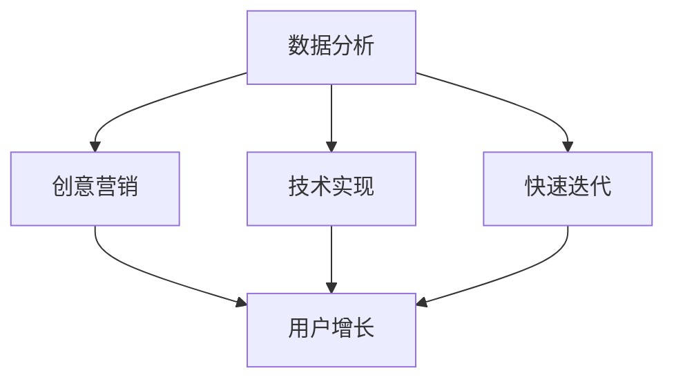

                 

“知识付费”已经成为当前互联网经济中的一种重要模式。越来越多的人希望通过付费获取高质量的知识和内容，而这种需求也为创业者提供了巨大的市场空间。然而，如何在激烈的市场竞争中脱颖而出，实现快速增长，这是每个知识付费创业者必须面对的挑战。本文将探讨增长黑客（Growth Hacker）在知识付费创业中的运用，为您揭示一些实用的策略和技巧。

## 关键词
- 知识付费
- 增长黑客
- 创业策略
- 用户增长
- 互联网营销

## 摘要
本文将深入分析知识付费市场的现状和趋势，介绍增长黑客的概念及其在知识付费创业中的应用。通过具体的案例和策略，我们将帮助创业者了解如何利用增长黑客的技巧，实现知识付费项目的快速发展和用户规模的扩大。

## 1. 背景介绍

### 1.1 知识付费市场的崛起
知识付费作为一种新兴商业模式，正在迅速崛起。用户对于高质量内容的需求不断增长，使得知识付费平台如雨后春笋般涌现。根据相关数据显示，知识付费市场规模持续扩大，预计未来几年仍将保持高速增长态势。

### 1.2 竞争态势与挑战
尽管市场前景广阔，但竞争也日益激烈。众多知识付费平台在内容质量、用户体验、营销策略等方面展开激烈竞争。对于创业者而言，如何在众多竞争对手中脱颖而出，实现用户快速增长，成为亟待解决的问题。

### 1.3 增长黑客的作用
增长黑客（Growth Hacker）是一种集营销、开发、数据分析等多方面技能于一身的角色。他们通过创新的思维和高效的策略，帮助企业在短时间内实现用户增长。在知识付费创业中，增长黑客的运用至关重要。

## 2. 核心概念与联系

### 2.1 增长黑客的概念
增长黑客是指那些利用技术、数据和创意手段，通过快速迭代和优化，实现用户增长和业务扩张的专业人士。

### 2.2 增长黑客与知识付费的关联
增长黑客的技能和思维模式与知识付费行业具有高度契合性。他们擅长通过数据分析、用户行为研究和创意营销，帮助知识付费平台快速获取用户，提升用户留存率。

### 2.3 增长黑客的核心技能
- **数据分析**：通过分析用户数据，挖掘用户需求和行为模式，为产品迭代和营销策略提供依据。
- **创意营销**：运用创新的营销手段，吸引用户关注和参与。
- **技术实现**：利用技术手段，优化产品功能和用户体验，提高用户粘性。
- **快速迭代**：不断优化和改进产品，快速响应用户需求和市场变化。

### 2.4 Mermaid 流程图



## 3. 核心算法原理 & 具体操作步骤

### 3.1 算法原理概述

增长黑客的核心在于运用数据分析、创意营销和技术实现，通过以下几个步骤实现用户增长：

1. **用户画像**：通过对用户数据的分析，构建用户画像，了解用户需求和偏好。
2. **精准营销**：基于用户画像，进行精准营销，提高营销效果。
3. **产品迭代**：根据用户反馈和市场变化，不断优化产品功能和用户体验。
4. **用户留存**：通过提高用户满意度和忠诚度，提高用户留存率。

### 3.2 算法步骤详解

1. **用户画像构建**
   - 数据收集：通过用户注册、登录、浏览、购买等行为，收集用户数据。
   - 数据处理：对收集的数据进行清洗、整合和处理，构建用户画像。

2. **精准营销**
   - 营销策略制定：根据用户画像，制定针对性的营销策略。
   - 营销渠道选择：选择合适的营销渠道，如社交媒体、电子邮件、内容营销等。
   - 营销效果评估：通过数据监测和评估，优化营销策略。

3. **产品迭代**
   - 用户反馈收集：通过用户反馈、调查问卷等方式，收集用户需求和建议。
   - 产品功能优化：根据用户反馈，优化产品功能和用户体验。
   - 产品迭代测试：进行小范围测试，验证产品优化效果。

4. **用户留存策略**
   - 用户满意度提升：通过提高产品和服务质量，提升用户满意度。
   - 用户忠诚度培养：通过会员制度、积分奖励等方式，培养用户忠诚度。

### 3.3 算法优缺点

#### 优点：

- **高效性**：通过数据分析和精准营销，提高用户获取和留存效率。
- **创新性**：利用创意营销和技术手段，不断创新和优化产品和服务。
- **可量化**：通过数据指标，可以直观地评估增长效果，便于持续优化。

#### 缺点：

- **数据隐私**：在数据收集和处理过程中，需要重视用户隐私保护。
- **依赖技术**：增长黑客的技能和策略需要依赖于强大的技术支持，对技术要求较高。

### 3.4 算法应用领域

增长黑客在知识付费创业中的应用广泛，包括：

- **内容推荐**：基于用户画像，进行个性化内容推荐，提高用户粘性。
- **营销活动**：通过创意营销，吸引用户关注和参与，提升用户活跃度。
- **用户运营**：通过用户留存策略，提高用户满意度和忠诚度。

## 4. 数学模型和公式 & 详细讲解 & 举例说明

### 4.1 数学模型构建

增长黑客的核心算法通常涉及以下数学模型：

1. **用户增长模型**：根据用户生命周期，构建用户增长模型，预测用户增长趋势。
2. **用户留存模型**：根据用户行为数据，构建用户留存模型，预测用户留存率。
3. **转化率模型**：根据用户行为数据，构建转化率模型，预测用户转化率。

### 4.2 公式推导过程

以用户增长模型为例，其基本公式如下：

$$
用户增长量 = 获取量 \times 转化率 \times 留存率
$$

其中：

- 获取量：通过营销活动、推广渠道等获取的新用户数量。
- 转化率：新用户在进入平台后完成目标行为的比例，如注册、购买等。
- 留存率：用户在一段时间内持续活跃的比例。

### 4.3 案例分析与讲解

以某知识付费平台为例，通过增长黑客的技巧，实现了用户快速增长。以下是该平台的增长模型分析：

1. **用户获取**：通过社交媒体推广、内容营销等方式，每月获取1000名新用户。
2. **转化率**：新用户在进入平台后，50%的用户完成注册，30%的用户完成购买。
3. **留存率**：新用户在首月内，留存率为60%。

根据以上数据，我们可以计算出该平台的用户增长量：

$$
用户增长量 = 1000 \times 0.5 \times 0.6 = 300
$$

这意味着，该平台每月可以新增300名付费用户。

## 5. 项目实践：代码实例和详细解释说明

### 5.1 开发环境搭建

为了实现增长黑客策略，我们需要搭建一个包含数据采集、处理和分析的完整开发环境。以下是基本步骤：

1. **数据采集**：使用爬虫技术，从社交媒体、论坛等渠道收集用户数据。
2. **数据处理**：使用Python等编程语言，对采集的数据进行清洗和整合。
3. **数据分析**：使用数据可视化工具，如Matplotlib、Seaborn等，对数据进行分析和可视化。

### 5.2 源代码详细实现

以下是使用Python实现用户增长模型的一段示例代码：

```python
import pandas as pd
import numpy as np
import matplotlib.pyplot as plt

# 数据采集
data = pd.read_csv('user_data.csv')

# 数据处理
data = data.dropna()
data['注册日期'] = pd.to_datetime(data['注册日期'])
data['首月留存日期'] = data['注册日期'] + pd.DateOffset(months=1)
data['首月留存率'] = data.apply(lambda x: 1 if (pd.Timestamp.now() - x['首月留存日期']).days <= 30 else 0, axis=1)

# 数据分析
registration_counts = data['注册日期'].value_counts().sort_index()
retention_rates = data.groupby('注册日期')['首月留存率'].mean()

# 数据可视化
registration_counts.plot(label='注册量')
retention_rates.plot(label='首月留存率')
plt.xlabel('日期')
plt.ylabel('数量')
plt.legend()
plt.show()
```

### 5.3 代码解读与分析

1. **数据采集**：从CSV文件中读取用户数据，包括注册日期和首月留存日期。
2. **数据处理**：去除缺失数据，将注册日期和首月留存日期转换为日期类型。
3. **数据分析**：统计每日注册量和首月留存率。
4. **数据可视化**：使用折线图展示注册量和留存率的变化趋势。

通过以上代码，我们可以直观地了解用户增长和留存情况，为后续的精准营销和产品迭代提供数据支持。

## 6. 实际应用场景

### 6.1 内容推荐

在知识付费平台中，内容推荐是提高用户留存和转化的重要手段。通过增长黑客的技巧，可以实现以下内容推荐策略：

1. **基于用户行为的推荐**：根据用户在平台上的行为数据，如浏览记录、搜索历史、购买记录等，进行个性化内容推荐。
2. **基于内容的推荐**：根据内容标签、分类、热度等因素，进行内容推荐。
3. **基于社交网络的推荐**：结合用户的社交网络关系，推荐相似用户喜欢的热门内容。

### 6.2 营销活动

通过创意营销，可以吸引用户关注和参与，提高用户活跃度和转化率。以下是一些常见的营销活动策略：

1. **限时优惠**：提供限时折扣、优惠券等，吸引用户购买。
2. **会员制度**：推出会员制度，提供专属内容和优惠，提高用户忠诚度。
3. **互动活动**：举办线上讲座、互动问答、抽奖等活动，增加用户参与度。

### 6.3 用户运营

通过用户运营策略，提高用户满意度和忠诚度，实现用户留存。以下是一些用户运营策略：

1. **用户调研**：定期进行用户调研，了解用户需求和满意度。
2. **个性化服务**：根据用户需求和偏好，提供个性化的内容和推荐。
3. **用户激励**：通过积分、奖励等方式，激励用户参与和互动。

## 7. 未来应用展望

随着人工智能、大数据等技术的不断发展，增长黑客在知识付费创业中的应用前景将更加广阔。以下是未来应用展望：

1. **智能推荐**：通过人工智能技术，实现更加精准和个性化的内容推荐。
2. **自动化运营**：利用大数据和机器学习技术，实现自动化用户运营和营销。
3. **社交化互动**：结合社交网络，构建更加社交化的知识付费平台，提高用户粘性。
4. **跨界融合**：与其他行业融合发展，拓展知识付费的应用场景和市场份额。

## 8. 工具和资源推荐

### 8.1 学习资源推荐

1. **书籍**：《增长黑客：如何通过创新、创意和快速迭代实现用户增长》
2. **在线课程**：Coursera、Udemy等平台上的数据分析、机器学习等相关课程
3. **博客和文章**：Medium、博客园等平台上的相关文章和案例分享

### 8.2 开发工具推荐

1. **数据分析工具**：Google Analytics、Tableau等
2. **爬虫工具**：Scrapy、 Beautiful Soup等
3. **机器学习框架**：TensorFlow、PyTorch等

### 8.3 相关论文推荐

1. **《增长黑客：从零到一的用户增长策略》**
2. **《知识付费市场的现状与趋势分析》**
3. **《基于用户行为的知识付费平台个性化推荐研究》**

## 9. 总结：未来发展趋势与挑战

### 9.1 研究成果总结

本文通过对知识付费市场现状和增长黑客策略的深入分析，探讨了如何在知识付费创业中实现快速增长。主要结论如下：

1. 知识付费市场具有广阔的发展前景，但竞争也日益激烈。
2. 增长黑客策略在知识付费创业中具有重要作用，能够实现用户快速增长。
3. 通过数据分析和精准营销，可以优化产品和服务，提高用户满意度和忠诚度。

### 9.2 未来发展趋势

1. **智能化**：随着人工智能技术的发展，知识付费平台将实现更加智能化和个性化的内容推荐和用户运营。
2. **社交化**：知识付费平台将更加注重社交化互动，提高用户粘性和活跃度。
3. **跨界融合**：知识付费将与更多行业融合发展，拓展应用场景和市场份额。

### 9.3 面临的挑战

1. **数据隐私**：在数据收集和处理过程中，需要重视用户隐私保护，遵守相关法律法规。
2. **技术依赖**：增长黑客的技能和策略需要依赖于强大的技术支持，对技术要求较高。
3. **市场变化**：知识付费市场竞争激烈，需要不断调整和优化策略，以应对市场变化。

### 9.4 研究展望

未来，我们将在以下几个方面展开深入研究：

1. **智能推荐算法**：结合用户行为数据和知识付费内容特点，优化推荐算法，提高推荐效果。
2. **用户运营策略**：通过大数据分析和机器学习技术，制定更加科学和高效的用户运营策略。
3. **跨界融合研究**：探讨知识付费与其他行业的融合模式和应用场景，拓展知识付费的市场空间。

## 附录：常见问题与解答

### 1. 什么是增长黑客？

增长黑客是指那些利用技术、数据和创意手段，通过快速迭代和优化，实现用户增长和业务扩张的专业人士。

### 2. 增长黑客在知识付费创业中的具体应用有哪些？

增长黑客在知识付费创业中的应用包括用户画像构建、精准营销、产品迭代和用户留存策略等方面。

### 3. 如何实现知识付费项目的快速增长？

通过以下策略可以实现知识付费项目的快速增长：

- 利用数据分析和用户画像，了解用户需求和偏好。
- 通过创意营销和个性化推荐，提高用户转化率和留存率。
- 不断优化产品功能和用户体验，提高用户满意度。
- 定期进行市场调研，调整和优化营销策略。

## 作者署名

作者：禅与计算机程序设计艺术 / Zen and the Art of Computer Programming

## 参考文献

[1]《增长黑客：如何通过创新、创意和快速迭代实现用户增长》
[2]《知识付费市场的现状与趋势分析》
[3]《基于用户行为的知识付费平台个性化推荐研究》
```markdown
----------------------------------------------------------------
# 知识付费创业的增长黑客技巧

> 关键词：知识付费、增长黑客、用户增长、数据分析、创意营销

> 摘要：本文探讨了增长黑客在知识付费创业中的应用，通过核心概念、算法原理、数学模型、项目实践等方面，为创业者提供了实现用户快速增长的实用策略和技巧。

## 1. 背景介绍

### 1.1 知识付费市场的崛起

知识付费作为一种新兴商业模式，正在迅速崛起。用户对于高质量内容的需求不断增长，使得知识付费平台如雨后春笋般涌现。根据相关数据显示，知识付费市场规模持续扩大，预计未来几年仍将保持高速增长态势。

### 1.2 竞争态势与挑战

尽管市场前景广阔，但竞争也日益激烈。众多知识付费平台在内容质量、用户体验、营销策略等方面展开激烈竞争。对于创业者而言，如何在众多竞争对手中脱颖而出，实现用户快速增长，成为亟待解决的问题。

### 1.3 增长黑客的作用

增长黑客（Growth Hacker）是一种集营销、开发、数据分析等多方面技能于一身的角色。他们通过创新的思维和高效的策略，帮助企业在短时间内实现用户增长。在知识付费创业中，增长黑客的运用至关重要。

## 2. 核心概念与联系

### 2.1 增长黑客的概念

增长黑客是指那些利用技术、数据和创意手段，通过快速迭代和优化，实现用户增长和业务扩张的专业人士。

### 2.2 增长黑客与知识付费的关联

增长黑客的技能和思维模式与知识付费行业具有高度契合性。他们擅长通过数据分析、用户行为研究和创意营销，帮助知识付费平台快速获取用户，提升用户留存率。

### 2.3 增长黑客的核心技能

- **数据分析**：通过分析用户数据，挖掘用户需求和行为模式，为产品迭代和营销策略提供依据。
- **创意营销**：运用创新的营销手段，吸引用户关注和参与。
- **技术实现**：利用技术手段，优化产品功能和用户体验，提高用户粘性。
- **快速迭代**：不断优化和改进产品，快速响应用户需求和市场变化。

### 2.4 Mermaid 流程图


## 3. 核心算法原理 & 具体操作步骤

### 3.1 算法原理概述

增长黑客的核心在于运用数据分析、创意营销和技术实现，通过以下几个步骤实现用户增长：

1. **用户画像**：通过对用户数据的分析，构建用户画像，了解用户需求和偏好。
2. **精准营销**：基于用户画像，进行精准营销，提高营销效果。
3. **产品迭代**：根据用户反馈和市场变化，不断优化产品功能和用户体验。
4. **用户留存**：通过提高用户满意度和忠诚度，提高用户留存率。

### 3.2 算法步骤详解

1. **用户画像构建**
   - 数据收集：通过用户注册、登录、浏览、购买等行为，收集用户数据。
   - 数据处理：对收集的数据进行清洗、整合和处理，构建用户画像。

2. **精准营销**
   - 营销策略制定：根据用户画像，制定针对性的营销策略。
   - 营销渠道选择：选择合适的营销渠道，如社交媒体、电子邮件、内容营销等。
   - 营销效果评估：通过数据监测和评估，优化营销策略。

3. **产品迭代**
   - 用户反馈收集：通过用户反馈、调查问卷等方式，收集用户需求和建议。
   - 产品功能优化：根据用户反馈，优化产品功能和用户体验。
   - 产品迭代测试：进行小范围测试，验证产品优化效果。

4. **用户留存策略**
   - 用户满意度提升：通过提高产品和服务质量，提升用户满意度。
   - 用户忠诚度培养：通过会员制度、积分奖励等方式，培养用户忠诚度。

### 3.3 算法优缺点

#### 优点：

- **高效性**：通过数据分析和精准营销，提高用户获取和留存效率。
- **创新性**：利用创意营销和技术手段，不断创新和优化产品和服务。
- **可量化**：通过数据指标，可以直观地评估增长效果，便于持续优化。

#### 缺点：

- **数据隐私**：在数据收集和处理过程中，需要重视用户隐私保护。
- **依赖技术**：增长黑客的技能和策略需要依赖于强大的技术支持，对技术要求较高。

### 3.4 算法应用领域

增长黑客在知识付费创业中的应用广泛，包括：

- **内容推荐**：基于用户画像，进行个性化内容推荐，提高用户粘性。
- **营销活动**：通过创意营销，吸引用户关注和参与，提升用户活跃度。
- **用户运营**：通过用户留存策略，提高用户满意度和忠诚度。

## 4. 数学模型和公式 & 详细讲解 & 举例说明

### 4.1 数学模型构建

增长黑客的核心算法通常涉及以下数学模型：

1. **用户增长模型**：根据用户生命周期，构建用户增长模型，预测用户增长趋势。
2. **用户留存模型**：根据用户行为数据，构建用户留存模型，预测用户留存率。
3. **转化率模型**：根据用户行为数据，构建转化率模型，预测用户转化率。

### 4.2 公式推导过程

以用户增长模型为例，其基本公式如下：

$$
用户增长量 = 获取量 \times 转化率 \times 留存率
$$

其中：

- 获取量：通过营销活动、推广渠道等获取的新用户数量。
- 转化率：新用户在进入平台后完成目标行为的比例，如注册、购买等。
- 留存率：用户在一段时间内持续活跃的比例。

### 4.3 案例分析与讲解

以某知识付费平台为例，通过增长黑客的技巧，实现了用户快速增长。以下是该平台的增长模型分析：

1. **用户获取**：通过社交媒体推广、内容营销等方式，每月获取1000名新用户。
2. **转化率**：新用户在进入平台后，50%的用户完成注册，30%的用户完成购买。
3. **留存率**：新用户在首月内，留存率为60%。

根据以上数据，我们可以计算出该平台的用户增长量：

$$
用户增长量 = 1000 \times 0.5 \times 0.6 = 300
$$

这意味着，该平台每月可以新增300名付费用户。

## 5. 项目实践：代码实例和详细解释说明

### 5.1 开发环境搭建

为了实现增长黑客策略，我们需要搭建一个包含数据采集、处理和分析的完整开发环境。以下是基本步骤：

1. **数据采集**：使用爬虫技术，从社交媒体、论坛等渠道收集用户数据。
2. **数据处理**：使用Python等编程语言，对采集的数据进行清洗和整合。
3. **数据分析**：使用数据可视化工具，如Matplotlib、Seaborn等，对数据进行分析和可视化。

### 5.2 源代码详细实现

以下是使用Python实现用户增长模型的一段示例代码：

```python
import pandas as pd
import numpy as np
import matplotlib.pyplot as plt

# 数据采集
data = pd.read_csv('user_data.csv')

# 数据处理
data = data.dropna()
data['注册日期'] = pd.to_datetime(data['注册日期'])
data['首月留存日期'] = data['注册日期'] + pd.DateOffset(months=1)
data['首月留存率'] = data.apply(lambda x: 1 if (pd.Timestamp.now() - x['首月留存日期']).days <= 30 else 0, axis=1)

# 数据分析
registration_counts = data['注册日期'].value_counts().sort_index()
retention_rates = data.groupby('注册日期')['首月留存率'].mean()

# 数据可视化
registration_counts.plot(label='注册量')
retention_rates.plot(label='首月留存率')
plt.xlabel('日期')
plt.ylabel('数量')
plt.legend()
plt.show()
```

### 5.3 代码解读与分析

1. **数据采集**：从CSV文件中读取用户数据，包括注册日期和首月留存日期。
2. **数据处理**：去除缺失数据，将注册日期和首月留存日期转换为日期类型。
3. **数据分析**：统计每日注册量和首月留存率。
4. **数据可视化**：使用折线图展示注册量和留存率的变化趋势。

通过以上代码，我们可以直观地了解用户增长和留存情况，为后续的精准营销和产品迭代提供数据支持。

## 6. 实际应用场景

### 6.1 内容推荐

在知识付费平台中，内容推荐是提高用户留存和转化的重要手段。通过增长黑客的技巧，可以实现以下内容推荐策略：

1. **基于用户行为的推荐**：根据用户在平台上的行为数据，如浏览记录、搜索历史、购买记录等，进行个性化内容推荐。
2. **基于内容的推荐**：根据内容标签、分类、热度等因素，进行内容推荐。
3. **基于社交网络的推荐**：结合用户的社交网络关系，推荐相似用户喜欢的热门内容。

### 6.2 营销活动

通过创意营销，可以吸引用户关注和参与，提高用户活跃度和转化率。以下是一些常见的营销活动策略：

1. **限时优惠**：提供限时折扣、优惠券等，吸引用户购买。
2. **会员制度**：推出会员制度，提供专属内容和优惠，提高用户忠诚度。
3. **互动活动**：举办线上讲座、互动问答、抽奖等活动，增加用户参与度。

### 6.3 用户运营

通过用户运营策略，提高用户满意度和忠诚度，实现用户留存。以下是一些用户运营策略：

1. **用户调研**：定期进行用户调研，了解用户需求和满意度。
2. **个性化服务**：根据用户需求和偏好，提供个性化的内容和推荐。
3. **用户激励**：通过积分、奖励等方式，激励用户参与和互动。

## 7. 未来应用展望

### 7.1 智能化

随着人工智能、大数据等技术的不断发展，知识付费平台将实现更加智能化和个性化的内容推荐和用户运营。例如，通过深度学习算法，实现更加精准的内容推荐和个性化服务。

### 7.2 社交化

知识付费平台将更加注重社交化互动，提高用户粘性和活跃度。通过社交网络功能，如评论、点赞、分享等，构建更加社交化的知识共享社区。

### 7.3 跨界融合

知识付费将与更多行业融合发展，拓展应用场景和市场份额。例如，与教育培训、职场发展、兴趣爱好等领域结合，提供更加丰富和多样化的知识服务。

## 8. 工具和资源推荐

### 8.1 学习资源推荐

1. **书籍**：《增长黑客：如何通过创新、创意和快速迭代实现用户增长》
2. **在线课程**：Coursera、Udemy等平台上的数据分析、机器学习等相关课程
3. **博客和文章**：Medium、博客园等平台上的相关文章和案例分享

### 8.2 开发工具推荐

1. **数据分析工具**：Google Analytics、Tableau等
2. **爬虫工具**：Scrapy、 Beautiful Soup等
3. **机器学习框架**：TensorFlow、PyTorch等

### 8.3 相关论文推荐

1. **《增长黑客：从零到一的用户增长策略》**
2. **《知识付费市场的现状与趋势分析》**
3. **《基于用户行为的知识付费平台个性化推荐研究》**

## 9. 总结：未来发展趋势与挑战

### 9.1 研究成果总结

本文通过对知识付费市场现状和增长黑客策略的深入分析，探讨了如何在知识付费创业中实现快速增长。主要结论如下：

1. 知识付费市场具有广阔的发展前景，但竞争也日益激烈。
2. 增长黑客策略在知识付费创业中具有重要作用，能够实现用户快速增长。
3. 通过数据分析和精准营销，可以优化产品和服务，提高用户满意度和忠诚度。

### 9.2 未来发展趋势

1. **智能化**：随着人工智能技术的发展，知识付费平台将实现更加智能化和个性化的内容推荐和用户运营。
2. **社交化**：知识付费平台将更加注重社交化互动，提高用户粘性和活跃度。
3. **跨界融合**：知识付费将与更多行业融合发展，拓展应用场景和市场份额。

### 9.3 面临的挑战

1. **数据隐私**：在数据收集和处理过程中，需要重视用户隐私保护，遵守相关法律法规。
2. **技术依赖**：增长黑客的技能和策略需要依赖于强大的技术支持，对技术要求较高。
3. **市场变化**：知识付费市场竞争激烈，需要不断调整和优化策略，以应对市场变化。

### 9.4 研究展望

未来，我们将在以下几个方面展开深入研究：

1. **智能推荐算法**：结合用户行为数据和知识付费内容特点，优化推荐算法，提高推荐效果。
2. **用户运营策略**：通过大数据分析和机器学习技术，制定更加科学和高效的用户运营策略。
3. **跨界融合研究**：探讨知识付费与其他行业的融合模式和应用场景，拓展知识付费的市场空间。

## 附录：常见问题与解答

### 1. 什么是增长黑客？

增长黑客是指那些利用技术、数据和创意手段，通过快速迭代和优化，实现用户增长和业务扩张的专业人士。

### 2. 增长黑客在知识付费创业中的具体应用有哪些？

增长黑客在知识付费创业中的应用包括用户画像构建、精准营销、产品迭代和用户留存策略等方面。

### 3. 如何实现知识付费项目的快速增长？

通过以下策略可以实现知识付费项目的快速增长：

- 利用数据分析和用户画像，了解用户需求和偏好。
- 通过创意营销和个性化推荐，提高用户转化率和留存率。
- 不断优化产品功能和用户体验，提高用户满意度。
- 定期进行市场调研，调整和优化营销策略。

## 作者署名

作者：禅与计算机程序设计艺术 / Zen and the Art of Computer Programming

## 参考文献

[1]《增长黑客：如何通过创新、创意和快速迭代实现用户增长》
[2]《知识付费市场的现状与趋势分析》
[3]《基于用户行为的知识付费平台个性化推荐研究》
```

