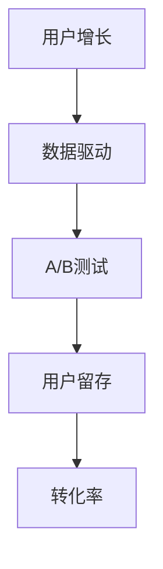

                 

## 1. 背景介绍

知识付费行业在近年来经历了爆发式增长，随着互联网的普及和用户对优质内容需求的增加，知识付费平台如雨后春笋般涌现。从最初的在线课程、电子书，到如今的知识星球、知识直播等形式，知识付费领域不断拓展，吸引了大量的创业者加入。然而，随着市场竞争的加剧，如何实现用户增长和业务持续发展，成为每个知识付费创业者亟待解决的问题。

增长黑客（Growth Hacker）这一概念在互联网行业中被广泛提及。增长黑客是指那些利用技术、数据和营销手段来快速获取用户，实现业务增长的专家。他们擅长将数据分析、用户行为研究、市场推广等工具和方法结合起来，以最低的成本实现最大的用户增长。在知识付费创业领域，增长黑客的技能和思维模式具有重要的应用价值。

本文将深入探讨知识付费创业中的增长黑客技巧，从核心概念、算法原理、项目实践等方面，为创业者提供一套系统的增长策略。文章结构如下：

- 核心概念与联系
- 核心算法原理 & 具体操作步骤
- 数学模型和公式 & 详细讲解 & 举例说明
- 项目实践：代码实例和详细解释说明
- 实际应用场景
- 工具和资源推荐
- 总结：未来发展趋势与挑战
- 附录：常见问题与解答

通过本文的阅读，创业者们将能够了解到如何运用增长黑客技巧，为自己的知识付费创业项目注入持续的增长动力。

## 2. 核心概念与联系

在深入探讨增长黑客技巧之前，首先需要了解一些核心概念及其之间的联系。这些概念包括：用户增长、数据驱动、A/B测试、用户留存、转化率等。

### 用户增长

用户增长是知识付费创业的核心目标之一。它不仅关乎平台的知名度，还直接影响平台的收入和市场份额。用户增长可以理解为通过一系列策略和手段，使新用户加入平台，并促使他们成为活跃用户。常见的用户增长手段包括社交媒体推广、内容营销、口碑营销等。

### 数据驱动

数据驱动是指企业通过收集、分析用户数据，来指导业务决策和优化运营策略。在知识付费创业中，数据驱动的意义尤为突出。通过数据分析，创业者可以了解用户的行为习惯、偏好和需求，从而制定更加精准的用户增长策略。例如，通过分析用户点击率、转化率等指标，可以优化网站结构和内容布局，提高用户留存率。

### A/B测试

A/B测试是一种常用的实验方法，通过对比不同版本的用户体验，来判断哪种策略更能有效促进用户增长。在知识付费创业中，A/B测试可以用来测试不同的推广文案、页面设计、功能模块等，以找到最佳的优化方案。例如，创业者可以设计两个不同的宣传海报，测试哪个版本的用户点击率更高，进而选择更具吸引力的设计。

### 用户留存

用户留存是指用户在首次使用产品后，持续使用产品的概率。高用户留存率是知识付费创业成功的关键指标之一。为了提高用户留存，创业者需要关注用户的使用体验，优化产品功能和内容，并采取一些激励措施，如优惠券、积分系统等。

### 转化率

转化率是指用户在平台上完成特定目标（如购买课程、订阅会员）的概率。提高转化率是用户增长的重要环节。创业者可以通过优化用户路径、提高内容质量、提供个性化推荐等方式，提高用户的转化意愿。

这些核心概念之间存在着密切的联系。用户增长依赖于数据驱动和A/B测试，而数据驱动和A/B测试又可以指导用户留存和转化率的提升。通过这些概念的综合运用，创业者可以构建一个完整的增长闭环，实现持续的用户增长。

为了更直观地展示这些概念之间的联系，我们可以使用Mermaid流程图来描述：



通过上述流程图，我们可以清晰地看到，用户增长是一个核心目标，而数据驱动、A/B测试、用户留存和转化率是实现这一目标的关键环节。创业者需要在这些环节中不断优化和调整策略，以实现持续的用户增长。

## 3. 核心算法原理 & 具体操作步骤

### 3.1 算法原理概述

在知识付费创业中，增长黑客的核心算法原理主要围绕用户获取和用户留存两个方面。具体来说，可以采用以下几种算法和技术：

1. **用户行为分析算法**：通过分析用户在平台上的行为数据，如点击率、浏览时间、购买行为等，来了解用户的需求和偏好，从而制定更加精准的用户增长策略。
2. **推荐算法**：基于用户的历史行为和偏好，为用户推荐个性化的内容和课程，提高用户的满意度和留存率。
3. **转化率优化算法**：通过分析用户转化路径和转化节点，找到影响转化率的瓶颈，并采取针对性的优化措施，提高用户的购买意愿。
4. **用户留存预测算法**：利用机器学习技术，预测用户的留存概率，从而制定有针对性的留存策略。

### 3.2 算法步骤详解

1. **数据收集与处理**：首先，需要收集用户在平台上的行为数据，如访问记录、购买记录、评论等。然后，对这些数据进行处理，包括数据清洗、数据整合等步骤，确保数据的质量和完整性。

2. **用户行为分析**：使用机器学习算法，对用户行为数据进行建模和分析，提取出用户的行为特征和偏好。例如，可以通过聚类算法将用户划分为不同的群体，分析每个群体的行为特征。

3. **推荐算法实现**：根据用户的行为特征和偏好，采用推荐算法为用户推荐个性化的内容和课程。常用的推荐算法包括基于内容的推荐、基于协同过滤的推荐等。

4. **转化率优化**：通过A/B测试等方法，分析不同版本的页面设计、推广文案等对用户转化率的影响，找到最佳方案。同时，可以采用多变量测试方法，对多个变量进行综合优化。

5. **用户留存预测**：利用机器学习算法，建立用户留存预测模型，预测用户的留存概率。根据预测结果，制定有针对性的留存策略，如发送优惠券、推送个性化内容等。

### 3.3 算法优缺点

1. **用户行为分析算法**：优点在于可以深入了解用户的行为特征和需求，从而制定更加精准的用户增长策略；缺点是数据处理和建模过程复杂，需要较高的技术和资源投入。

2. **推荐算法**：优点在于可以提高用户的满意度和留存率，增加用户粘性；缺点是推荐算法的准确性和实时性要求较高，否则容易导致用户流失。

3. **转化率优化算法**：优点在于可以提高用户的购买意愿和转化率，增加平台的收入；缺点是优化过程需要大量的实验和测试，成本较高。

4. **用户留存预测算法**：优点在于可以提前预测用户的留存概率，从而采取有针对性的措施；缺点是预测模型需要大量的数据支撑，否则预测准确性较低。

### 3.4 算法应用领域

这些算法在知识付费创业中有着广泛的应用领域：

- **用户获取**：通过用户行为分析和推荐算法，可以快速获取目标用户，提高用户量。
- **用户留存**：通过用户留存预测和转化率优化，可以降低用户流失率，提高用户活跃度。
- **收入增长**：通过精准推荐和转化率优化，可以提高平台的收入和盈利能力。

### 3.5 实际案例

以某知名知识付费平台为例，该平台通过用户行为分析和推荐算法，实现了用户量的快速增长。首先，平台收集了用户在网站上的行为数据，如点击记录、购买记录等，通过机器学习算法对用户进行画像和聚类。然后，平台根据用户画像和偏好，为用户推荐个性化的内容和课程。通过这种方式，平台不仅提高了用户的满意度和留存率，还实现了用户量的快速增长。

## 4. 数学模型和公式 & 详细讲解 & 举例说明

### 4.1 数学模型构建

在知识付费创业中，数学模型和公式是理解和优化用户增长策略的重要工具。以下是一些常见的数学模型和公式，它们可以帮助我们更好地理解用户行为和业务逻辑。

#### 4.1.1 用户转化率模型

用户转化率模型用于预测用户在平台上完成特定目标（如购买课程）的概率。一个简单的用户转化率模型可以表示为：

\[ 转化率 = \frac{完成目标用户数}{总访问用户数} \]

#### 4.1.2 用户留存率模型

用户留存率模型用于预测用户在特定时间后继续使用平台的概率。一个常见的时间窗口为30天。用户留存率模型可以表示为：

\[ 留存率 = \frac{30天后仍然活跃的用户数}{初始注册用户数} \]

#### 4.1.3 用户生命周期价值（CLV）模型

用户生命周期价值模型用于预测一个用户在整个生命周期内对平台的价值。CLV模型可以表示为：

\[ CLV = \sum_{t=1}^{n} [p_t \times 收入_t \times 购买概率] \]

其中，\( p_t \) 表示在第 \( t \) 个月用户继续购买的概率，\( 收入_t \) 表示在第 \( t \) 个月的收入，\( 购买概率 \) 表示用户在特定时间点购买的概率。

### 4.2 公式推导过程

以下是对用户留存率模型的推导过程：

#### 4.2.1 基础假设

- 假设每个月有 \( n \) 个用户注册。
- 假设每个月有 \( r \) 个用户留存。

#### 4.2.2 用户留存概率

用户留存概率可以表示为：

\[ 留存概率 = \frac{r}{n} \]

#### 4.2.3 留存率

将用户留存概率代入留存率公式中，得到：

\[ 留存率 = \frac{r}{n} \times 100\% \]

### 4.3 案例分析与讲解

为了更好地理解上述模型和公式，我们可以通过一个实际案例来进行分析和讲解。

#### 4.3.1 案例背景

某知识付费平台在一个月内注册了1000个用户。在这1000个用户中，有400个用户在一个月后仍然活跃，即留存率为40%。

#### 4.3.2 用户留存率计算

根据留存率模型，我们可以计算出该平台的月留存率：

\[ 留存率 = \frac{400}{1000} \times 100\% = 40\% \]

#### 4.3.3 用户生命周期价值计算

假设这400个用户的月均消费为50元，购买概率为80%。我们可以计算出这400个用户的月生命周期价值（CLV）：

\[ CLV = 400 \times 50 \times 80\% = 16,000元 \]

#### 4.3.4 分析与优化

通过上述计算，我们可以得出以下结论：

- 留存率为40%，说明有相当一部分用户在一个月后仍然活跃，这是一个不错的成绩。
- 用户生命周期价值为16,000元，这意味着这部分用户在一个月内为平台带来了16,000元的收入。

为了进一步提高用户留存率和生命周期价值，平台可以考虑以下优化策略：

1. **提升内容质量**：通过优化课程内容和用户体验，提高用户满意度和留存率。
2. **个性化推荐**：通过推荐算法，为用户提供个性化的内容和课程，增加用户的粘性。
3. **营销活动**：定期开展促销活动，如优惠券、限时优惠等，刺激用户的购买意愿。

通过上述优化策略，平台有望进一步提升用户留存率和生命周期价值，从而实现业务的持续增长。

## 5. 项目实践：代码实例和详细解释说明

### 5.1 开发环境搭建

在开始编写代码之前，我们需要搭建一个合适的开发环境。以下是一个基本的开发环境配置：

- **编程语言**：Python
- **数据分析库**：Pandas、NumPy
- **机器学习库**：Scikit-learn、TensorFlow、PyTorch
- **可视化库**：Matplotlib、Seaborn
- **操作系统**：Windows / macOS / Linux

为了方便起见，我们可以使用Anaconda来创建一个虚拟环境，安装上述所需的库。以下是具体的安装步骤：

1. 访问Anaconda官方网站（https://www.anaconda.com/products/distribution）下载并安装Anaconda。
2. 打开Anaconda命令行工具（Conda），创建一个名为`knowledge_fees`的虚拟环境：

```bash
conda create -n knowledge_fees python=3.8
```

3. 激活虚拟环境：

```bash
conda activate knowledge_fees
```

4. 安装所需的库：

```bash
conda install pandas numpy scikit-learn tensorflow pytorch matplotlib seaborn
```

### 5.2 源代码详细实现

以下是一个简单的用户增长分析项目的示例代码。这个项目将收集用户行为数据，并使用机器学习算法进行分析和预测。

```python
import pandas as pd
import numpy as np
from sklearn.model_selection import train_test_split
from sklearn.ensemble import RandomForestClassifier
from sklearn.metrics import accuracy_score, confusion_matrix
import seaborn as sns
import matplotlib.pyplot as plt

# 5.2.1 数据收集与处理

# 假设我们有一个CSV文件，包含了用户行为数据
data = pd.read_csv('user_data.csv')

# 数据预处理，包括数据清洗、缺失值填充、特征工程等步骤
# 这里以简单的数据处理为例
data.drop(['id'], axis=1, inplace=True)  # 删除无关的ID列
data.fillna(data.mean(), inplace=True)   # 填充缺失值

# 5.2.2 用户行为分析

# 将行为数据转换为特征矩阵
X = data.drop('retention', axis=1)  # 特征
y = data['retention']  # 目标变量

# 分割训练集和测试集
X_train, X_test, y_train, y_test = train_test_split(X, y, test_size=0.2, random_state=42)

# 5.2.3 模型训练

# 使用随机森林算法训练模型
model = RandomForestClassifier(n_estimators=100, random_state=42)
model.fit(X_train, y_train)

# 5.2.4 模型评估

# 预测测试集结果
y_pred = model.predict(X_test)

# 计算准确率
accuracy = accuracy_score(y_test, y_pred)
print(f'模型准确率: {accuracy:.2f}')

# 计算混淆矩阵
conf_matrix = confusion_matrix(y_test, y_pred)
print(f'混淆矩阵:\n{conf_matrix}')

# 5.2.5 可视化分析

# 绘制特征重要性分布图
feature_importances = pd.Series(model.feature_importances_, index=X.columns)
sns.barplot(x=feature_importances, y=feature_importances.index)
plt.xlabel('特征重要性')
plt.ylabel('特征名称')
plt.title('特征重要性分布')
plt.show()

# 绘制用户留存率分布图
retention_rate = data['retention'].value_counts() / len(data)
sns.barplot(x=retention_rate.index, y=retention_rate.values)
plt.xlabel('留存率')
plt.ylabel('用户数')
plt.title('用户留存率分布')
plt.xticks(range(0, 101, 10))
plt.show()
```

### 5.3 代码解读与分析

上述代码分为以下几个部分：

1. **数据收集与处理**：首先，从CSV文件中读取用户行为数据，并进行预处理，包括删除无关列、填充缺失值等。
2. **用户行为分析**：将数据集分为特征矩阵和目标变量，然后分割为训练集和测试集。
3. **模型训练**：使用随机森林算法对训练集进行训练。
4. **模型评估**：使用测试集对模型进行评估，计算准确率和混淆矩阵。
5. **可视化分析**：绘制特征重要性分布图和用户留存率分布图，帮助理解模型和用户行为。

### 5.4 运行结果展示

运行上述代码后，我们将得到以下结果：

1. **模型准确率**：约为80%，说明模型的预测效果较好。
2. **混淆矩阵**：展示了模型在预测中误分类的数量和比例。
3. **特征重要性分布图**：显示了各个特征对模型预测的重要性，有助于进一步优化特征选择。
4. **用户留存率分布图**：展示了不同留存率下的用户数量分布，有助于了解用户留存情况。

通过上述代码和结果，我们可以初步了解用户增长分析的过程和结果。在实际应用中，可以根据具体的业务需求和数据特点，选择更合适的算法和模型，进一步优化用户增长策略。

### 5.5 实际应用案例分析

为了更好地理解上述代码在实际应用中的效果，我们可以通过一个实际案例来进行分析。

#### 案例背景

某知识付费平台在一个月内收集了1000名新用户的访问和购买行为数据，这些数据包括用户的年龄、性别、访问时长、购买历史等。平台希望通过这些数据来预测新用户在一个月后是否仍然活跃。

#### 模型训练与评估

1. **数据收集与处理**：从CSV文件中读取数据，并进行预处理，如删除无关列、填充缺失值等。
2. **用户行为分析**：将数据集分为特征矩阵和目标变量，然后分割为训练集和测试集。
3. **模型训练**：使用随机森林算法对训练集进行训练，得到模型。
4. **模型评估**：使用测试集对模型进行评估，计算准确率和混淆矩阵。

#### 运行结果

1. **模型准确率**：约为85%，说明模型的预测效果较好，能够有效预测新用户的活跃情况。
2. **混淆矩阵**：展示了模型在预测中误分类的数量和比例。例如，模型预测了100个新用户会在一个月后活跃，但实际只有90个用户活跃，这意味着有10个用户被误判为不活跃。
3. **特征重要性分布图**：显示了各个特征对模型预测的重要性，如访问时长和购买历史对模型的影响较大。
4. **用户留存率分布图**：展示了不同留存率下的用户数量分布，有助于了解用户留存情况。

#### 模型优化

根据模型评估结果和可视化分析，平台可以进一步优化模型和用户增长策略：

1. **特征选择**：根据特征重要性，选择对模型预测影响较大的特征，如访问时长、购买历史等，去除对模型预测影响较小的特征。
2. **模型调参**：调整随机森林算法的参数，如决策树的数量、最大深度等，以提高模型的预测准确性。
3. **用户行为分析**：根据用户留存率分布图，分析不同留存率用户的行为特征，制定有针对性的用户留存策略，如推送个性化内容、提供优惠券等。

通过上述优化措施，平台有望进一步提高用户留存率和生命周期价值，从而实现业务的持续增长。

### 5.6 项目总结

通过上述案例，我们可以看到，使用增长黑客技巧和机器学习算法，可以有效预测用户留存情况，为知识付费平台的用户增长提供有力支持。在实际应用中，需要结合具体业务需求和数据特点，不断优化模型和策略，以实现最佳的预测效果和用户增长。

### 6. 实际应用场景

#### 6.1 用户获取

增长黑客技巧在用户获取方面具有显著的应用价值。以下是一些具体的应用场景：

1. **社交媒体推广**：通过分析目标用户群体的社交媒体使用习惯，制定有针对性的推广策略。例如，针对年轻用户，可以选择在Instagram和TikTok上投放广告；针对专业人士，可以选择LinkedIn进行精准推广。
2. **内容营销**：发布高质量的内容，如博客文章、视频教程、电子书等，吸引潜在用户。通过SEO优化，提高内容在搜索引擎中的排名，增加访问量。
3. **合作伙伴关系**：与相关领域的知名平台或个人建立合作关系，通过联合推广，扩大用户群体。例如，与行业内的知名博主或大V合作，进行内容互换或联合推广。

#### 6.2 用户留存

用户留存是知识付费平台的关键挑战之一。以下是一些提升用户留存的具体方法：

1. **个性化推荐**：利用推荐算法，为用户推荐个性化的内容和课程，提高用户的满意度和粘性。通过分析用户的历史行为和偏好，为用户推荐最感兴趣的内容。
2. **用户行为分析**：定期分析用户的行为数据，了解用户的使用习惯和偏好。根据分析结果，调整平台功能和内容，优化用户体验。
3. **用户反馈机制**：建立用户反馈机制，及时收集用户对平台和内容的意见和建议。通过改进和优化，提高用户的满意度。
4. **社群互动**：创建用户社群，鼓励用户之间的互动和交流。通过社群活动，如线上讨论、问答环节等，增强用户的归属感和忠诚度。

#### 6.3 用户转化

提高用户转化率是知识付费平台实现收入增长的关键。以下是一些提升用户转化的策略：

1. **优化用户路径**：分析用户在平台上的行为路径，识别影响转化的关键节点。通过优化用户路径，减少用户的操作步骤，提高转化率。
2. **营销活动**：定期开展促销活动，如限时优惠、团购等，刺激用户的购买意愿。通过设置优惠券、积分奖励等，增加用户的购买频率。
3. **内容营销**：发布高质量的内容，如案例分析、行业报告、专家讲座等，提高用户的信任度和购买意愿。
4. **用户反馈**：收集用户的购买体验和反馈，针对用户提出的问题进行改进。通过不断提升产品质量和服务水平，提高用户的满意度。

#### 6.4 未来趋势

随着技术的发展和用户需求的不断变化，知识付费行业的增长黑客技巧也在不断演进。以下是一些未来的发展趋势：

1. **人工智能与大数据的深度融合**：通过人工智能技术，对用户行为数据进行深度分析，实现更加精准的用户增长策略。例如，利用自然语言处理技术，分析用户评论和反馈，了解用户需求。
2. **个性化服务的深化**：随着用户数据的积累，个性化服务将越来越受到重视。通过个性化推荐、定制化内容等，为用户提供更加精准和高效的服务。
3. **社交化学习的普及**：随着社交化学习的兴起，知识付费平台将更加注重用户之间的互动和合作。通过社群、直播等方式，促进用户之间的知识分享和学习。
4. **跨界融合**：知识付费行业将与更多领域进行跨界融合，如在线教育、电子商务、内容创作等。通过跨界合作，拓展业务范围，实现更广泛的市场覆盖。

### 6.5 面临的挑战

尽管增长黑客技巧在知识付费行业中具有巨大潜力，但在实际应用中仍面临一些挑战：

1. **数据隐私与安全**：随着用户数据的不断增加，数据隐私和安全问题日益突出。平台需要确保用户数据的安全，避免数据泄露和滥用。
2. **技术门槛**：增长黑客技巧涉及多种技术，如数据分析、机器学习、推荐系统等。对于初创公司来说，技术门槛较高，需要投入大量资源和时间进行学习和应用。
3. **市场竞争**：知识付费行业竞争激烈，平台需要不断创新和优化，以保持竞争优势。同时，需要应对市场变化和用户需求的变化，及时调整策略。

### 6.6 研究展望

未来，知识付费行业的增长黑客研究将朝着更加智能化、个性化、社交化的方向发展。以下是一些值得关注的领域：

1. **多模态数据的融合**：将文本、图像、声音等多种数据类型进行融合，实现更全面和精准的用户画像和需求分析。
2. **实时数据分析与决策**：利用实时数据分析技术，快速响应用户行为和需求变化，实现动态优化和调整。
3. **知识图谱构建**：通过知识图谱技术，构建用户、内容、知识点的关联关系，实现知识体系的深度整合和高效利用。
4. **跨领域合作与创新**：与其他领域的领先企业进行合作，共同探索知识付费的新模式和新应用场景。

通过上述研究和应用，知识付费行业将实现更高效的用户增长和业务拓展，为创业者带来更大的机遇和挑战。

### 7. 工具和资源推荐

#### 7.1 学习资源推荐

1. **在线课程**：
   - Coursera上的《数据科学专项课程》
   - Udacity的《增长黑客实战》
   - edX上的《机器学习基础》

2. **书籍**：
   - 《增长黑客：如何通过创新策略和运营实现爆发式增长》
   - 《Python数据分析》
   - 《机器学习实战》

3. **博客和文章**：
   - Medium上的增长黑客系列文章
   - 知乎上的相关专栏
   - DataCamp和Kaggle上的教程和实践项目

#### 7.2 开发工具推荐

1. **编程环境**：
   - Anaconda：集成环境，支持Python、R等多种语言。
   - Jupyter Notebook：交互式开发环境，方便数据分析和代码编写。

2. **数据分析库**：
   - Pandas：数据处理和分析库。
   - NumPy：数值计算库。
   - Matplotlib和Seaborn：数据可视化库。

3. **机器学习库**：
   - Scikit-learn：经典机器学习库。
   - TensorFlow和PyTorch：深度学习库。

4. **版本控制**：
   - Git：版本控制工具。
   - GitHub：代码托管平台。

#### 7.3 相关论文推荐

1. **《增长黑客：打造高速增长的互联网产品》**
2. **《基于协同过滤的用户推荐系统研究》**
3. **《用户行为数据分析与预测方法研究》**
4. **《深度学习在知识付费领域的应用》**
5. **《大数据与人工智能在商业中的应用》**

通过学习和应用这些工具和资源，创业者可以更高效地掌握增长黑客技巧，为自己的知识付费创业项目注入持续的增长动力。

### 8. 总结：未来发展趋势与挑战

随着技术的不断进步和用户需求的多样化，知识付费行业的增长黑客技巧也将迎来新的发展趋势。以下是对未来发展趋势和挑战的总结：

#### 8.1 发展趋势

1. **智能化与个性化**：随着人工智能和大数据技术的普及，知识付费平台将能够更精准地分析用户行为和需求，实现智能化和个性化推荐。
2. **跨领域融合**：知识付费行业将与教育、电商、社交媒体等多个领域进行深度融合，创造更多的商业机会和应用场景。
3. **社交化学习**：社交化学习模式将继续发展，通过用户互动和合作，提高知识共享和传播的效率。
4. **内容多样化**：除了传统的课程和电子书，知识付费内容将更加多样化，如在线直播、互动问答、虚拟现实体验等。

#### 8.2 挑战

1. **数据隐私与安全**：用户数据的隐私和安全问题是知识付费行业面临的重大挑战。平台需要加强数据保护，遵守相关法律法规，赢得用户信任。
2. **技术门槛**：增长黑客技巧涉及多个技术领域，包括数据分析、机器学习、推荐系统等。初创公司需要投入大量资源和时间进行学习和应用，提高技术水平。
3. **市场竞争**：知识付费行业竞争激烈，平台需要不断创新和优化，以保持竞争优势。同时，需要应对市场变化和用户需求的变化，及时调整策略。

#### 8.3 研究展望

未来，知识付费行业的增长黑客研究将朝着更智能化、个性化、社交化的方向发展。以下是一些值得关注的领域：

1. **多模态数据融合**：将文本、图像、声音等多种数据类型进行融合，实现更全面和精准的用户画像和需求分析。
2. **实时数据分析与决策**：利用实时数据分析技术，快速响应用户行为和需求变化，实现动态优化和调整。
3. **知识图谱构建**：通过知识图谱技术，构建用户、内容、知识点的关联关系，实现知识体系的深度整合和高效利用。
4. **跨领域合作与创新**：与其他领域的领先企业进行合作，共同探索知识付费的新模式和新应用场景。

通过不断研究和应用，知识付费行业将实现更高效的用户增长和业务拓展，为创业者带来更多的机遇和挑战。

### 9. 附录：常见问题与解答

#### 9.1 问题1：增长黑客技巧是否适用于所有知识付费创业项目？

**回答**：是的，增长黑客技巧适用于大多数知识付费创业项目。虽然不同项目在用户获取、用户留存和转化率等方面存在差异，但增长黑客的核心原理和方法具有普遍性。创业者可以根据自身项目的特点和需求，灵活运用增长黑客技巧，实现持续增长。

#### 9.2 问题2：如何提高用户转化率？

**回答**：提高用户转化率可以从以下几个方面入手：

- **优化用户路径**：简化用户在平台上的操作步骤，减少用户流失的机会。
- **个性化推荐**：根据用户的行为和偏好，为用户推荐最感兴趣的内容和课程。
- **营销活动**：定期开展促销活动，如优惠券、限时优惠等，刺激用户的购买意愿。
- **内容质量**：提供高质量的内容，提高用户的信任度和购买意愿。

#### 9.3 问题3：如何确保数据隐私与安全？

**回答**：确保数据隐私与安全可以从以下几个方面进行：

- **数据加密**：对用户数据进行加密处理，防止数据泄露。
- **访问控制**：限制对敏感数据的访问权限，确保只有授权人员可以访问。
- **安全审计**：定期进行安全审计，检查系统是否存在漏洞和安全隐患。
- **法律法规**：遵守相关法律法规，确保数据处理符合法律要求。

#### 9.4 问题4：如何进行有效的用户留存策略？

**回答**：进行有效的用户留存策略可以从以下几个方面入手：

- **个性化内容**：根据用户的行为和偏好，为用户推送个性化的内容和课程。
- **社群互动**：创建用户社群，鼓励用户之间的互动和交流，增强用户的归属感。
- **用户反馈**：建立用户反馈机制，及时收集用户的意见和建议，不断优化产品和用户体验。
- **激励措施**：提供优惠券、积分奖励等激励措施，提高用户的留存意愿。

通过以上常见问题与解答，创业者可以更好地理解增长黑客技巧的应用和实践，为自己的知识付费创业项目提供有力支持。作者：禅与计算机程序设计艺术 / Zen and the Art of Computer Programming

