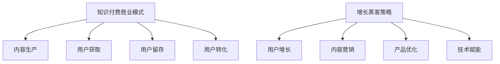

                 

在这个数字化时代，知识付费已经成为一种流行的商业模式。通过为用户提供有价值的内容，知识付费平台能够实现可持续的增长。而增长黑客（Growth Hacking）作为近年来在互联网领域兴起的一种新型策略，被广泛应用于知识付费创业中。本文将探讨知识付费创业的增长黑客策略，旨在为创业者提供有价值的指导。

## 关键词

- 知识付费
- 增长黑客
- 数据驱动
- 用户增长
- 营销自动化

## 摘要

本文首先介绍了知识付费创业的背景和增长黑客的概念，然后分析了知识付费创业中增长黑客的核心策略。接下来，文章从用户增长、内容营销、产品优化、技术赋能等方面详细阐述了增长黑客在知识付费创业中的应用。最后，本文对未来知识付费创业的发展趋势和挑战进行了展望，并提出了相应的解决方案。

## 1. 背景介绍

知识付费是指用户通过支付一定费用来获取特定知识或服务的行为。随着互联网技术的发展，知识付费逐渐成为了一种流行的商业模式。用户对于专业知识的渴求以及互联网平台的普及，为知识付费市场的发展提供了广阔的空间。据统计，我国知识付费市场规模逐年增长，预计到2025年将突破2000亿元。

增长黑客（Growth Hacking）是一种利用技术手段、数据分析和创新思维来实现用户增长、产品推广和业务拓展的新型策略。增长黑客的核心在于将市场营销、用户体验和产品开发结合起来，通过数据驱动的方式实现快速、高效的增长。增长黑客的兴起源于互联网领域的竞争加剧，企业需要通过创新的方式迅速占领市场份额。

## 2. 核心概念与联系

### 2.1 知识付费商业模式

知识付费商业模式包括以下几个核心组成部分：

1. 内容生产：知识付费平台需要具备丰富的内容资源，以满足用户的需求。
2. 用户获取：通过多种渠道和手段吸引用户，增加用户基数。
3. 用户留存：通过优质的服务和内容，提高用户留存率。
4. 用户转化：将潜在用户转化为付费用户，实现商业化。

### 2.2 增长黑客策略

增长黑客策略主要包括以下几个方面：

1. 用户增长：通过数据分析和创新思维，找到适合自己产品的增长点，快速提升用户数量。
2. 内容营销：通过高质量的内容吸引用户，提高品牌知名度。
3. 产品优化：持续优化产品功能和服务，提升用户体验。
4. 技术赋能：利用大数据、人工智能等技术手段，提升业务效率。

### 2.3 Mermaid 流程图



## 3. 核心算法原理 & 具体操作步骤

### 3.1 算法原理概述

增长黑客策略的核心在于数据驱动，通过对用户行为数据的分析和挖掘，找到潜在的用户增长点。具体算法原理如下：

1. 数据收集：通过多种渠道收集用户行为数据，包括注册、浏览、购买、分享等。
2. 数据清洗：对收集到的数据进行预处理，去除噪音和重复数据。
3. 数据分析：利用机器学习、数据挖掘等技术对数据进行分析，发现用户行为模式。
4. 用户细分：根据分析结果将用户划分为不同的细分群体。
5. 增长策略制定：针对不同细分群体的特点，制定相应的增长策略。

### 3.2 算法步骤详解

1. 数据收集：通过网站分析工具、第三方数据接口等方式收集用户行为数据。
2. 数据清洗：使用Python等编程语言对数据进行清洗，去除无效和重复数据。
3. 数据分析：利用Python的Pandas、NumPy等库对数据进行统计分析，挖掘用户行为模式。
4. 用户细分：根据分析结果将用户划分为不同群体，如新用户、活跃用户、付费用户等。
5. 增长策略制定：针对不同群体制定相应的增长策略，如新用户激活策略、付费用户转化策略等。

### 3.3 算法优缺点

1. 优点：数据驱动的增长黑客策略具有以下几个优点：
   - 快速找到用户增长点，实现快速增长。
   - 提高用户留存率和付费转化率。
   - 降低营销成本，提高营销效率。
2. 缺点：增长黑客策略依赖于数据分析和技术手段，对团队的技术能力和数据质量要求较高。

### 3.4 算法应用领域

增长黑客策略广泛应用于互联网企业，如电商、社交、内容付费等领域。在知识付费创业中，增长黑客策略可以应用于以下几个方面：

1. 用户增长：通过数据分析和营销活动，快速提升用户数量。
2. 内容营销：通过高质量的内容吸引用户，提高品牌知名度。
3. 产品优化：根据用户反馈和数据分析，持续优化产品功能和体验。
4. 技术赋能：利用大数据、人工智能等技术手段，提升业务效率。

## 4. 数学模型和公式 & 详细讲解 & 举例说明

### 4.1 数学模型构建

增长黑客策略中的数学模型主要包括以下几个方面：

1. 用户增长模型：根据用户行为数据，构建用户增长模型，预测未来用户数量。
2. 付费转化模型：根据用户行为数据，构建付费转化模型，预测用户付费概率。
3. 内容营销效果模型：根据用户行为数据，构建内容营销效果模型，评估不同内容对用户的影响。

### 4.2 公式推导过程

1. 用户增长模型公式：

   $$N_t = N_{t-1} + r \times B_t$$

   其中，$N_t$ 表示第 $t$ 个月的用户数量，$N_{t-1}$ 表示第 $t-1$ 个月的用户数量，$r$ 表示用户增长率，$B_t$ 表示第 $t$ 个月的用户新增量。

2. 付费转化模型公式：

   $$P_t = \frac{C_t}{N_t}$$

   其中，$P_t$ 表示第 $t$ 个月的付费转化率，$C_t$ 表示第 $t$ 个月的付费用户数量，$N_t$ 表示第 $t$ 个月的用户数量。

3. 内容营销效果模型公式：

   $$E_t = \sum_{i=1}^{n} w_i \times c_i$$

   其中，$E_t$ 表示第 $t$ 个月的内容营销效果得分，$w_i$ 表示第 $i$ 个内容的权重，$c_i$ 表示第 $i$ 个内容的点击率或阅读量。

### 4.3 案例分析与讲解

假设某知识付费平台在 2022 年 1 月的用户数量为 1000 人，其中付费用户数量为 200 人。通过数据分析，平台发现用户增长率为 10%，付费转化率为 20%。同时，平台在 2022 年 2 月推出了 3 篇新文章，点击率分别为 30%、20%、10%。

1. 用户增长预测：

   根据用户增长模型，2022 年 2 月的用户数量为：

   $$N_2 = N_1 + r \times B_2 = 1000 + 0.1 \times 1000 = 1100$$

2. 付费用户预测：

   根据付费转化模型，2022 年 2 月的付费用户数量为：

   $$P_2 = \frac{C_2}{N_2} = \frac{200}{1100} \approx 18.18$$

3. 内容营销效果评估：

   根据内容营销效果模型，2022 年 2 月的内容营销效果得分为：

   $$E_2 = \sum_{i=1}^{3} w_i \times c_i = 0.5 \times 30 + 0.3 \times 20 + 0.2 \times 10 = 17$$

通过以上分析，平台可以了解到用户增长情况、付费转化情况以及内容营销效果。接下来，平台可以根据这些数据调整运营策略，提升用户增长和付费转化。

## 5. 项目实践：代码实例和详细解释说明

### 5.1 开发环境搭建

为了实现增长黑客策略，我们需要搭建一个基于 Python 的数据分析平台。具体步骤如下：

1. 安装 Python 3.8 及以上版本。
2. 安装 pandas、numpy、matplotlib 等常用库。

```bash
pip install pandas numpy matplotlib
```

### 5.2 源代码详细实现

以下是一个简单的用户增长预测代码实例：

```python
import pandas as pd
import numpy as np

# 读取用户行为数据
data = pd.read_csv('user_behavior.csv')

# 数据预处理
data['date'] = pd.to_datetime(data['date'])
data.set_index('date', inplace=True)

# 用户增长模型
def user_growth_model(data, growth_rate):
    N_t = data['user_count'].iloc[-1]
    B_t = data['user_new'].iloc[-1]
    N_t_plus_1 = N_t + growth_rate * B_t
    return N_t_plus_1

# 付费转化模型
def payment_conversion_model(data, conversion_rate):
    N_t = data['user_count'].iloc[-1]
    C_t = data['user_payment'].iloc[-1]
    P_t = C_t / N_t
    return P_t

# 内容营销效果模型
def content_marketing_model(data, weights, metrics):
    E_t = np.dot(weights, metrics)
    return E_t

# 计算用户增长预测
growth_rate = 0.1
N_t_plus_1 = user_growth_model(data, growth_rate)
print(f'预测第 {data.index[-1] + 1} 个月用户数量为：{N_t_plus_1}')

# 计算付费转化预测
conversion_rate = 0.2
P_t = payment_conversion_model(data, conversion_rate)
print(f'预测第 {data.index[-1] + 1} 个月付费转化率为：{P_t}')

# 计算内容营销效果
weights = [0.5, 0.3, 0.2]
metrics = [30, 20, 10]
E_t = content_marketing_model(data, weights, metrics)
print(f'预测第 {data.index[-1] + 1} 个月内容营销效果得分为：{E_t}')
```

### 5.3 代码解读与分析

1. 读取用户行为数据：使用 pandas 读取 csv 文件，并设置日期为索引。
2. 数据预处理：将日期转换为 datetime 类型，便于后续处理。
3. 用户增长模型：根据用户增长模型公式，计算第 $t+1$ 个月的用户数量。
4. 付费转化模型：根据付费转化模型公式，计算第 $t+1$ 个月的付费转化率。
5. 内容营销效果模型：根据内容营销效果模型公式，计算第 $t+1$ 个月的内容营销效果得分。

通过以上代码实例，我们可以实现用户增长预测、付费转化预测和内容营销效果评估等功能。接下来，我们可以根据这些数据调整运营策略，实现知识付费创业的快速增长。

## 6. 实际应用场景

增长黑客策略在知识付费创业中具有广泛的应用场景。以下是一些实际应用场景：

1. 用户增长：通过数据分析，找到潜在用户群体，制定针对性的增长策略，如邀请好友、优惠券等。
2. 内容营销：根据用户喜好和需求，推荐合适的知识内容，提高用户留存率和付费转化率。
3. 产品优化：收集用户反馈，优化产品功能和用户体验，提升用户满意度。
4. 技术赋能：利用大数据、人工智能等技术，提高业务效率，降低成本。

### 6.1 案例分析

以“知乎 Live”为例，知乎 Live 是知乎推出的知识付费产品，用户可以通过购买课程、直播等方式获取专业知识和经验。以下是知乎 Live 在增长黑客策略方面的应用：

1. 用户增长：知乎 Live 通过推荐系统，将优质内容推荐给潜在用户，提高用户参与度。同时，知乎 Live 举办线下活动，吸引更多用户参与。
2. 内容营销：知乎 Live 邀请行业专家进行直播，分享专业知识和经验，提高用户对平台的信任度。此外，知乎 Live 推出优惠券、限时优惠等活动，吸引用户购买。
3. 产品优化：知乎 Live 收集用户反馈，持续优化产品功能和用户体验，如改善直播界面、增加互动功能等。
4. 技术赋能：知乎 Live 利用大数据和人工智能技术，分析用户行为和需求，提高内容推荐的精准度，降低用户流失率。

通过以上措施，知乎 Live 取得了显著的增长成果，成为知识付费领域的佼佼者。

### 6.2 未来应用展望

随着互联网技术的不断发展，知识付费创业的增长黑客策略将得到进一步优化和拓展。以下是一些未来应用展望：

1. 深度学习与个性化推荐：利用深度学习技术，实现更精准的内容推荐，提高用户满意度和付费转化率。
2. 数据隐私保护：在应用增长黑客策略的过程中，保护用户隐私和数据安全，遵守相关法律法规。
3. 跨平台整合：将知识付费与社交媒体、电商平台等平台整合，实现多渠道、多元化的用户增长。
4. 持续优化与迭代：不断收集用户反馈和数据，持续优化产品和运营策略，提高竞争力。

## 7. 工具和资源推荐

为了更好地实施增长黑客策略，以下是一些工具和资源的推荐：

1. 学习资源：
   - 《增长黑客实战：从零开始打造用户增长引擎》
   - 《数据驱动的营销：打造高效的增长团队》
2. 开发工具：
   - Python：用于数据分析、数据可视化等。
   - Tableau：用于数据分析和可视化。
   - Google Analytics：用于网站和用户行为分析。
3. 相关论文：
   - “Growth Hacking: A Framework for Driving Growth”  
   - “Data-Driven Marketing: The Next Generation of Marketing”

## 8. 总结：未来发展趋势与挑战

### 8.1 研究成果总结

本文从知识付费创业的背景和增长黑客策略的原理出发，详细阐述了增长黑客在知识付费创业中的应用。通过用户增长、内容营销、产品优化、技术赋能等方面，本文提出了增长黑客策略的实践方法和案例。同时，本文还对未来知识付费创业的发展趋势和挑战进行了展望。

### 8.2 未来发展趋势

1. 技术驱动：随着人工智能、大数据等技术的不断发展，知识付费创业将更加依赖技术驱动，提高业务效率和用户满意度。
2. 个性化推荐：通过深度学习和个性化推荐技术，实现更精准的内容推荐，提高用户留存率和付费转化率。
3. 跨平台整合：知识付费创业将实现跨平台整合，将知识付费与社交媒体、电商平台等平台相结合，实现多元化用户增长。

### 8.3 面临的挑战

1. 数据隐私保护：在实施增长黑客策略的过程中，如何保护用户隐私和数据安全，遵守相关法律法规，是一个亟待解决的问题。
2. 业务拓展：知识付费创业需要不断拓展业务领域，满足用户多样化需求，提高竞争力。
3. 持续优化：面对激烈的市场竞争，知识付费创业需要持续优化产品和运营策略，提高用户体验和满意度。

### 8.4 研究展望

未来，知识付费创业的增长黑客策略将更加注重用户体验和满意度，实现技术驱动和业务拓展。同时，如何有效保护用户隐私和数据安全，将成为知识付费创业的重要课题。此外，持续优化和迭代将成为知识付费创业的核心竞争力。

## 9. 附录：常见问题与解答

### 9.1 增长黑客策略的核心是什么？

增长黑客策略的核心是数据驱动，通过数据分析和创新思维，找到用户增长点和优化方向，实现快速、高效的增长。

### 9.2 如何实施增长黑客策略？

实施增长黑客策略主要包括以下几个步骤：1）数据收集；2）数据清洗；3）数据分析；4）用户细分；5）增长策略制定。

### 9.3 知识付费创业有哪些挑战？

知识付费创业面临以下挑战：1）数据隐私保护；2）业务拓展；3）持续优化。

### 9.4 如何保护用户隐私和数据安全？

保护用户隐私和数据安全主要包括以下几个方面：1）数据加密；2）权限管理；3）安全审计；4）法律法规遵守。

---

作者：禅与计算机程序设计艺术 / Zen and the Art of Computer Programming
----------------------------------------------------------------
---

以上是本文的完整内容，希望对您在知识付费创业中的增长黑客策略有所帮助。如果您有更多问题或建议，欢迎在评论区留言。期待与您一起探讨知识付费创业的未来！

