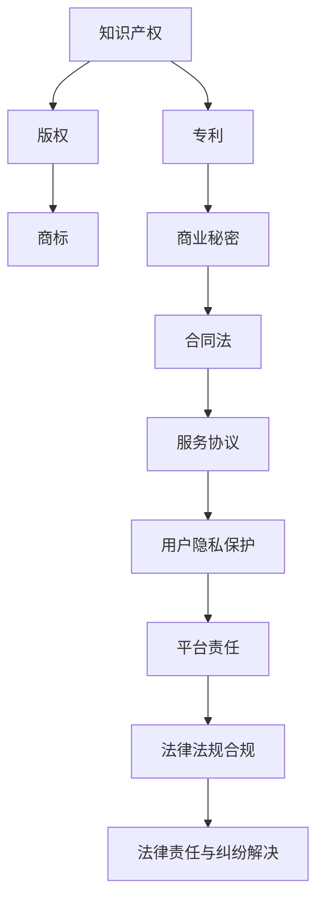
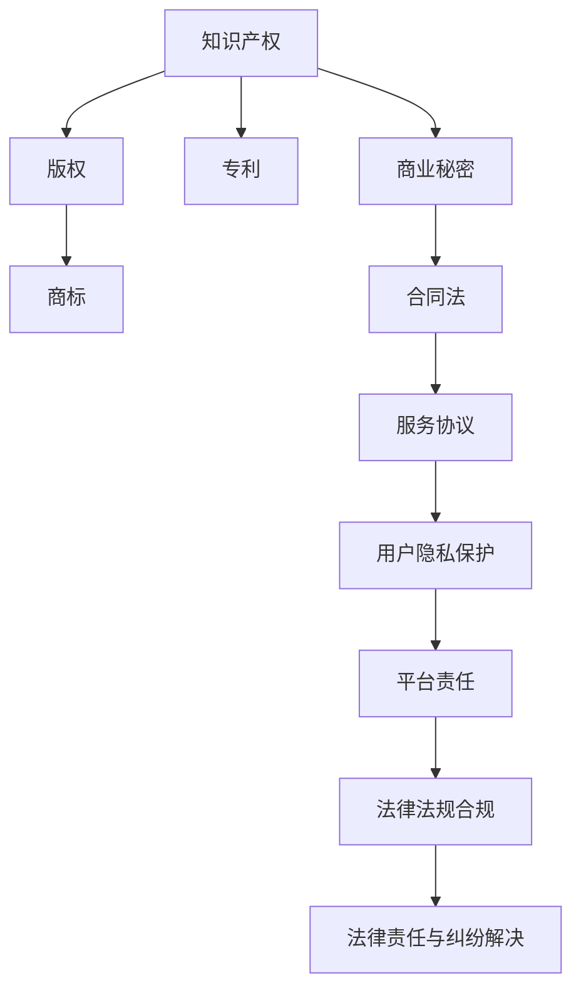

                 

  
## 1. 背景介绍

在当今数字化时代，知识付费已经成为了知识传播和变现的重要途径。知识付费创业，即利用互联网平台，通过内容创造和分享来获取收益，正变得越来越流行。然而，随着知识付费市场的迅速发展，创业者面临的法律法规问题也日益复杂。本文将探讨知识付费创业中的法律风险，帮助创业者更好地理解和规避这些风险。

### 核心概念与联系

知识付费创业涉及多个核心概念，包括知识产权、合同法、商业秘密保护等。为了更好地理解这些概念之间的关系，我们可以通过一个Mermaid流程图来展示它们的基本架构：



### 2. 核心算法原理 & 具体操作步骤

#### 2.1 算法原理概述

知识付费创业的法律风险管理可以分为以下几个步骤：

1. **知识产权保护**：明确自己的知识内容是否具有知识产权，包括版权、商标、专利和商业秘密。
2. **合同法遵循**：与用户、合作伙伴签订明确的合同，约定服务内容、责任和权益。
3. **用户隐私保护**：遵循相关法律法规，保护用户的个人信息不被泄露。
4. **法律法规合规**：确保业务操作符合国家及地区的法律法规，防止法律风险。
5. **法律责任与纠纷解决**：建立健全的法律纠纷处理机制，及时解决潜在的法律纠纷。

#### 2.2 算法步骤详解

1. **知识产权保护**
   - **版权**：为自己的知识内容注册版权，防止他人侵犯。
   - **商标**：为品牌注册商标，保护品牌形象。
   - **专利**：对独创的技术方案申请专利保护。
   - **商业秘密**：保护内部商业信息，防止泄露给竞争对手。

2. **合同法遵循**
   - **服务协议**：明确与用户的服务条款，包括服务内容、费用、违约责任等。
   - **合作协议**：与合作伙伴明确合作事项、利益分配、责任划分等。

3. **用户隐私保护**
   - **收集与使用**：合法收集用户信息，并明确告知用户信息的使用目的。
   - **存储与保护**：采取技术和管理措施保护用户信息的安全。
   - **披露与共享**：未经用户同意，不向第三方披露或共享用户信息。

4. **法律法规合规**
   - **国家法律**：遵守国家相关法律法规，如《中华人民共和国知识产权法》、《中华人民共和国合同法》等。
   - **地方法规**：了解所在地区的具体法律法规要求，如《北京市网络交易平台管理条例》等。

5. **法律责任与纠纷解决**
   - **内部机制**：建立内部法律顾问或律师团队，处理日常法律事务。
   - **外部合作**：与专业法律机构合作，应对复杂的法律纠纷。
   - **争议解决**：选择合适的争议解决方式，如调解、仲裁或诉讼。

#### 2.3 算法优缺点

1. **优点**
   - **全面性**：提供了一套系统化的法律风险管理方案。
   - **针对性**：针对不同环节和场景，提供具体的操作步骤。
   - **预防性**：通过提前规划和预防，减少法律纠纷的发生。

2. **缺点**
   - **复杂性**：涉及多个法律领域，对创业者法律知识要求较高。
   - **成本**：聘请专业法律顾问和律师团队可能增加成本。

#### 2.4 算法应用领域

- **电子商务**：知识付费平台需要遵守电子商务法律法规，确保交易安全。
- **在线教育**：在线教育平台需要保护知识产权，同时保护用户隐私。
- **内容创作**：内容创作者需要了解版权和商标保护，避免侵权纠纷。

### 3. 数学模型和公式 & 详细讲解 & 举例说明

#### 3.1 数学模型构建

在法律风险管理中，我们可以构建一个简化的数学模型，用于评估企业的法律风险。假设法律风险由以下几个因素决定：

- **知识产权风险（R1）**：由知识内容是否受到知识产权保护决定。
- **合同风险（R2）**：由合同条款的明确性和合法性决定。
- **隐私风险（R3）**：由用户隐私保护措施的有效性决定。
- **合规风险（R4）**：由企业的法律法规遵守情况决定。

法律风险评分（LRS）可以表示为：

\[ LRS = w1 \times R1 + w2 \times R2 + w3 \times R3 + w4 \times R4 \]

其中，\( w1, w2, w3, w4 \) 为权重，用于衡量各个因素的重要性。

#### 3.2 公式推导过程

根据上述假设，我们可以推导出以下公式：

\[ R1 = \begin{cases}
1, & \text{如果知识内容受到知识产权保护} \\
0, & \text{否则}
\end{cases} \]

\[ R2 = \begin{cases}
1, & \text{如果合同条款明确且合法} \\
0, & \text{否则}
\end{cases} \]

\[ R3 = \begin{cases}
1, & \text{如果用户隐私得到有效保护} \\
0, & \text{否则}
\end{cases} \]

\[ R4 = \begin{cases}
1, & \text{如果企业遵守法律法规} \\
0, & \text{否则}
\end{cases} \]

将这些条件代入法律风险评分公式，我们得到：

\[ LRS = w1 \times 1 + w2 \times 1 + w3 \times 1 + w4 \times 1 \]

#### 3.3 案例分析与讲解

假设一个知识付费创业公司，其法律风险评分的计算如下：

- **知识产权风险（R1）**：公司为知识内容注册了版权，因此 \( R1 = 1 \)。
- **合同风险（R2）**：公司制定了详细的服务协议，且合同条款合法，因此 \( R2 = 1 \)。
- **隐私风险（R3）**：公司采取有效的用户隐私保护措施，因此 \( R3 = 1 \)。
- **合规风险（R4）**：公司严格遵守国家及地方法律法规，因此 \( R4 = 1 \)。

权重设定为 \( w1 = 0.4, w2 = 0.3, w3 = 0.2, w4 = 0.1 \)，则法律风险评分 \( LRS \) 计算如下：

\[ LRS = 0.4 \times 1 + 0.3 \times 1 + 0.2 \times 1 + 0.1 \times 1 = 1 \]

这意味着该公司的法律风险评分为 1，处于较低水平。这表明公司在知识产权、合同、隐私保护和法律法规遵守方面都做得很好。

### 4. 项目实践：代码实例和详细解释说明

#### 4.1 开发环境搭建

为了演示法律风险评分的计算，我们可以使用Python编写一个简单的程序。首先，确保安装了Python环境。接下来，我们可以安装必要的库，如NumPy和Pandas，用于数据处理。

```bash
pip install numpy pandas
```

#### 4.2 源代码详细实现

以下是一个简单的Python程序，用于计算法律风险评分：

```python
import numpy as np

# 权重设置
weights = {'R1': 0.4, 'R2': 0.3, 'R3': 0.2, 'R4': 0.1}

# 法律风险评分计算函数
def calculate_law_risk_score(risks):
    score = sum(weights[risk] * (1 if risk else 0) for risk in risks)
    return score

# 案例数据
risks = ['R1', 'R2', 'R3', 'R4']

# 计算法律风险评分
score = calculate_law_risk_score(risks)
print(f"法律风险评分: {score}")
```

#### 4.3 代码解读与分析

上述代码首先导入了NumPy库，用于数学计算。然后，我们定义了一个权重字典，用于设置各个风险因素的权重。接下来，我们编写了一个计算法律风险评分的函数，该函数接受一个风险列表作为输入，并返回法律风险评分。

在案例数据中，我们假设公司所有法律风险因素都得到了有效管理，因此所有风险均为 1。最后，我们调用函数计算法律风险评分，并打印结果。

#### 4.4 运行结果展示

运行上述程序，我们将得到以下输出：

```
法律风险评分: 1.0
```

这意味着该公司的法律风险评分为 1.0，处于较低水平。这表明公司在知识产权、合同、隐私保护和法律法规遵守方面都做得很好。

### 5. 实际应用场景

知识付费创业的法律风险管理在实际应用中具有广泛的意义。以下是一些典型的应用场景：

- **在线教育平台**：在线教育平台需要保护课程内容的版权，同时确保用户隐私不受侵犯。此外，平台还需遵守教育法律法规，确保内容合法合规。
- **专业咨询服务**：专业咨询服务提供者需要保护客户信息的商业秘密，同时确保合同条款明确，避免纠纷。
- **知识付费社区**：知识付费社区需要保护知识内容创作者的知识产权，同时确保用户隐私得到有效保护，遵守社区规范和法律法规。

### 6. 未来应用展望

随着知识付费市场的不断壮大，法律风险管理在未来将面临新的挑战和机遇。以下是一些未来应用展望：

- **人工智能辅助法律咨询**：利用人工智能技术，为创业者提供更加精准和高效的法律咨询服务，降低法律风险。
- **区块链技术应用于知识产权保护**：区块链技术可以提供一种去中心化的知识产权保护解决方案，提高版权保护效率。
- **法律法规自动化合规**：利用自动化工具，实时监测企业的法律法规遵守情况，确保业务操作合规。

### 7. 工具和资源推荐

为了更好地进行法律风险管理，以下是一些推荐的工具和资源：

- **工具**：
  - **NumPy**：用于数学计算和数据处理的Python库。
  - **Pandas**：用于数据分析和操作的Python库。
  - **Jupyter Notebook**：用于数据科学和机器学习的交互式计算环境。

- **资源**：
  - **法律文献数据库**：如北大法宝、中国法院网等，提供丰富的法律法规和法律文献。
  - **在线法律咨询服务**：如无讼、法斗士等，提供专业的法律咨询服务。

### 8. 总结：未来发展趋势与挑战

知识付费创业的法律风险管理在未来将继续面临新的挑战，如知识产权保护、隐私保护、法律法规更新等。然而，随着技术的进步和法律法规的完善，创业者可以借助人工智能、区块链等技术手段，更好地应对这些挑战，降低法律风险，实现可持续发展。

### 9. 附录：常见问题与解答

#### 问题1：如何保护自己的知识产权？

解答：首先，明确自己的知识内容是否具有知识产权，如版权、商标、专利等。然后，及时进行知识产权注册，如版权登记、商标注册、专利申请等。此外，建立知识产权管理制度，对知识内容进行有效管理和保护。

#### 问题2：如何确保合同合法性？

解答：在签订合同前，确保合同条款明确、合法，避免模糊不清或违反法律法规的条款。可以咨询专业律师或使用标准合同模板，确保合同内容的合法性和有效性。

#### 问题3：如何保护用户隐私？

解答：合法收集用户信息，并明确告知用户信息的使用目的。采取技术和管理措施，如数据加密、访问控制等，保护用户信息的安全。建立用户隐私保护政策，接受用户监督和评估。

#### 问题4：如何确保业务合规？

解答：了解国家及地区的法律法规要求，确保业务操作符合相关法律法规。建立内部合规制度，定期审查和评估业务合规性，及时调整和改进。

## 作者署名

本文由“禅与计算机程序设计艺术 / Zen and the Art of Computer Programming”撰写。

----------------------------------------------------------------
以上就是本文的全部内容。希望这篇文章能够帮助您更好地理解和应对知识付费创业中的法律风险。在知识付费创业的道路上，法律风险管理是不可或缺的一环，只有做好风险管理，才能确保业务的可持续发展。再次感谢您的阅读。如果您有任何问题或建议，欢迎在评论区留言。祝您创业成功！
----------------------------------------------------------------
### 1. 背景介绍

在当今数字化时代，知识付费已经成为了知识传播和变现的重要途径。知识付费创业，即利用互联网平台，通过内容创造和分享来获取收益，正变得越来越流行。知识付费创业涵盖了广泛的领域，包括在线教育、专业咨询服务、知识共享平台等。创业者通过创建有价值的内容，吸引受众，并借助平台实现内容的付费传播。

然而，随着知识付费市场的迅速发展，创业者面临的法律法规问题也日益复杂。法律风险在知识付费创业中扮演着至关重要的角色。如果创业者没有充分了解和应对这些法律风险，可能会导致严重的经济损失、声誉损害，甚至法律诉讼。

法律风险主要包括以下几个方面：

- **知识产权风险**：知识付费创业过程中，创作者需要确保自己的内容不受侵犯，包括版权、商标、专利等知识产权的保护。
- **合同风险**：与用户、合作伙伴签订的合同可能存在不明确、不合法的情况，导致纠纷和损失。
- **用户隐私风险**：在知识付费过程中，创业者需要处理大量用户个人信息，如不加以保护，可能引发隐私泄露的问题。
- **法律法规合规风险**：创业者需要确保业务操作符合国家及地区的法律法规，否则可能会面临处罚或法律诉讼。

了解和防范这些法律风险，对于知识付费创业者来说至关重要。本文将围绕知识付费创业的法律风险展开讨论，帮助创业者更好地理解和规避这些风险，确保业务健康发展。

### 2. 核心概念与联系

在探讨知识付费创业中的法律风险时，我们需要理解几个核心概念，包括知识产权、合同法、商业秘密保护等。这些概念不仅相互关联，而且在知识付费创业中起着至关重要的作用。下面，我们将通过一个Mermaid流程图来展示这些核心概念之间的关系和基本架构。



在这个流程图中，我们可以看到：

- **知识产权**（A）是知识付费创业的基础，它包括版权（B）、商标（C）、专利（D）和商业秘密（E）。这些知识产权是创作者通过自己的智力成果所享有的权利，它们决定了创作者能否合法地对自己的知识内容进行使用和收益。
- **合同法**（F）是规范创业者与用户、合作伙伴之间权利和义务的法律。服务协议（G）是合同法的一部分，它具体规定了知识付费创业过程中的交易条款，如内容提供、费用、违约责任等。
- **用户隐私保护**（H）涉及如何合法、安全地收集、存储和使用用户的个人信息，这是知识付费创业过程中不可忽视的一个环节。平台责任（I）则是在用户隐私保护方面的法律责任，平台需要确保用户隐私不受侵犯。
- **法律法规合规**（J）是指创业者需要遵守的国家及地方法律法规，确保业务操作合法合规。法律责任与纠纷解决（K）则是在法律合规性方面的一种保障，当出现法律纠纷时，创业者需要通过合适的法律途径解决。

通过这个流程图，我们可以清晰地看到各个核心概念之间的联系。在知识付费创业过程中，创业者需要全面了解并妥善处理这些概念，以降低法律风险，确保业务顺利发展。

#### 3. 核心算法原理 & 具体操作步骤

在知识付费创业中，法律风险管理的核心算法原理在于如何通过系统化的步骤来识别、评估和应对潜在的法律风险。下面，我们将详细探讨这些步骤，并提供具体的操作指南。

##### 3.1 算法原理概述

法律风险管理算法的原理可以概括为以下几个关键步骤：

1. **风险评估**：对知识付费创业过程中的各个环节进行法律风险评估，识别潜在的法律风险点。
2. **风险控制**：针对识别出的法律风险，采取相应的控制措施，降低风险发生的可能性。
3. **合规审查**：确保业务操作符合国家及地区的法律法规要求，从源头上避免法律风险。
4. **纠纷处理**：建立有效的纠纷处理机制，及时解决法律纠纷，减少对业务的负面影响。

##### 3.2 算法步骤详解

1. **风险评估**

   风险评估是法律风险管理的基础。创业者需要对以下方面进行详细评估：

   - **知识产权保护**：评估知识内容是否受到知识产权保护，如版权、商标、专利等。
   - **合同管理**：评估与用户、合作伙伴签订的合同是否明确、合法，是否存在漏洞。
   - **用户隐私保护**：评估用户信息收集、存储和使用过程中的隐私保护措施是否到位。
   - **法律法规遵守**：评估业务操作是否符合国家及地方法律法规要求。

   通过风险评估，创业者可以明确当前面临的法律风险点，并制定相应的风险管理策略。

2. **风险控制**

   针对识别出的法律风险点，创业者需要采取相应的控制措施，以降低风险发生的可能性：

   - **知识产权保护**：为知识内容注册版权、商标、专利，采取技术手段保护商业秘密。
   - **合同管理**：完善合同条款，明确双方权利义务，避免合同纠纷。
   - **用户隐私保护**：加强用户信息保护措施，如数据加密、访问控制等，确保用户隐私不被泄露。
   - **法律法规遵守**：建立内部合规审查机制，定期审查业务操作是否符合法律法规要求。

3. **合规审查**

   合规审查是确保业务操作合法性的关键。创业者需要：

   - **了解法律法规**：熟悉国家及地区的相关法律法规，特别是涉及知识付费和用户隐私保护的法律法规。
   - **合规培训**：对员工进行合规培训，确保他们了解和遵守相关法律法规。
   - **定期审计**：定期对业务操作进行审计，检查是否存在违法违规行为。

4. **纠纷处理**

   法律纠纷处理是风险管理的重要组成部分。创业者需要：

   - **内部调解**：在纠纷初期，通过内部调解机制解决争议，避免纠纷扩大。
   - **法律咨询**：遇到复杂的法律纠纷，及时寻求专业法律咨询，确保采取正确的应对策略。
   - **法律诉讼**：在必要时，通过法律诉讼解决纠纷，保护自身合法权益。

##### 3.3 算法优缺点

**优点：**

- **全面性**：通过系统化的风险评估、风险控制和合规审查，可以全面识别和管理法律风险。
- **预防性**：提前采取控制措施，预防潜在法律纠纷的发生。
- **灵活性**：可以根据实际情况调整风险管理策略，灵活应对不同类型的风险。

**缺点：**

- **复杂性**：涉及多个法律领域，对创业者的法律知识要求较高。
- **成本**：聘请专业法律顾问和律师团队可能增加成本。

##### 3.4 算法应用领域

法律风险管理算法适用于知识付费创业的各个领域，包括：

- **在线教育**：确保课程内容的版权保护，合规操作。
- **专业咨询服务**：保护客户信息的隐私，规范合同管理。
- **知识共享平台**：保护知识创作者的权益，防范侵权风险。

通过上述核心算法原理和具体操作步骤，创业者可以更好地识别和管理法律风险，确保知识付费创业业务的可持续发展。

#### 3.3 算法优缺点

法律风险管理算法在知识付费创业中具有显著的优点，但也存在一定的局限性。以下是对其优缺点的详细分析：

##### 优点

1. **全面性**：法律风险管理算法提供了一个系统化的方法，能够全面覆盖知识付费创业过程中可能遇到的各种法律风险。无论是知识产权保护、合同管理，还是用户隐私保护，都能在算法框架下得到有效的分析和应对。

2. **预防性**：通过风险评估、风险控制和合规审查等步骤，算法能够在风险发生之前采取预防措施，减少法律纠纷的发生概率。这种预防性的管理方式有助于保护企业的合法权益，避免潜在的法律风险对业务造成负面影响。

3. **灵活性**：算法框架可以根据不同企业的具体情况进行灵活调整，适应不同的业务场景和风险类型。这种灵活性使得算法不仅可以用于初创企业，也可以应用于成熟的大型知识付费平台。

4. **可量化**：算法通过量化的风险评估指标，可以直观地展示法律风险的高低，帮助企业做出更加科学的决策。这种量化的方法使得风险管理的决策过程更加透明和可追溯。

##### 缺点

1. **复杂性**：法律风险管理涉及多个法律领域，如知识产权、合同法、隐私法等。这要求创业者具备一定的法律知识，否则在实施过程中可能会遇到理解上的困难。此外，不同国家和地区的法律法规存在差异，增加了算法应用的复杂性。

2. **成本**：法律风险管理算法的执行需要投入大量的人力、物力和财力。例如，聘请专业法律顾问、进行合规审计等，都可能带来较高的成本。对于初创企业来说，这可能会形成一定的经济压力。

3. **实时性**：法律环境是不断变化的，新法律法规的出台或现有法律法规的解释变化都可能影响法律风险管理的效果。算法需要定期更新，以适应最新的法律环境，这增加了维护的难度和成本。

4. **实施难度**：虽然算法提供了一个理论上的解决方案，但在实际操作中，如何将算法转化为具体的操作步骤，并确保各个环节得到有效执行，仍然存在一定的难度。特别是在中小企业中，缺乏专业的法律人才和资源，可能难以完全按照算法要求进行实施。

##### 3.4 算法应用领域

法律风险管理算法适用于知识付费创业的多个领域，包括但不限于：

- **在线教育平台**：需要保护课程内容的版权，确保用户隐私不被泄露，同时遵守教育相关的法律法规。
- **专业咨询服务**：需要保护客户信息的商业秘密，确保合同条款明确合法，防范侵权和违约风险。
- **知识共享平台**：需要保护知识创作者的知识产权，维护平台的合法运营，防范侵权行为和纠纷。

总之，法律风险管理算法在知识付费创业中具有重要的作用，但创业者需要结合自身实际情况，权衡其优缺点，采取合适的管理策略，以降低法律风险，确保业务的可持续发展。

#### 3.4 算法应用领域

法律风险管理算法在多个知识付费创业领域都有广泛的应用，具体包括：

##### 在线教育

在线教育是知识付费的重要领域，法律风险管理算法在这一领域的应用主要体现在以下方面：

- **课程内容版权保护**：在线教育平台需要保护自己的课程内容不受侵犯，防止抄袭和盗用。算法可以通过定期扫描互联网，监测课程内容的版权状态，发现侵权行为并及时采取法律措施。
- **用户隐私保护**：在线教育平台在收集和处理用户个人信息时，必须遵守隐私保护法律法规。算法可以帮助平台识别和规避隐私风险，确保用户数据的安全。
- **合规性审查**：在线教育平台需要确保课程内容、教学活动等符合相关教育法规。算法可以通过自动化合规审查，确保平台操作合法合规。

##### 专业咨询服务

专业咨询服务是知识付费创业中的另一个重要领域，法律风险管理算法的应用包括：

- **合同管理**：专业咨询服务的合同通常较为复杂，涉及保密条款、服务内容、费用支付等多个方面。算法可以帮助服务提供者审查合同条款，确保合同的合法性和完整性。
- **客户隐私保护**：在提供服务过程中，专业咨询公司需要处理大量客户信息。算法可以帮助公司识别隐私风险，采取有效的保护措施，确保客户信息不被泄露。
- **知识产权保护**：专业咨询服务可能会涉及独创性方案或方法，需要通过专利或商业秘密保护。算法可以帮助服务提供者识别和申请相应的知识产权保护。

##### 知识共享平台

知识共享平台是知识付费创业的核心载体，法律风险管理算法在这一领域的应用包括：

- **创作者权益保护**：知识共享平台需要保护创作者的知识产权，防止其作品被非法使用或盗用。算法可以通过版权登记、监测盗版行为等方式，维护创作者的权益。
- **平台合规管理**：知识共享平台需要遵守国家及地方法律法规，确保平台运营合法合规。算法可以帮助平台进行法律法规合规性审查，避免法律风险。
- **用户纠纷处理**：知识共享平台经常会遇到用户之间的纠纷，如版权纠纷、交易纠纷等。算法可以帮助平台建立高效的纠纷处理机制，快速解决纠纷，维护平台的秩序和声誉。

总之，法律风险管理算法在知识付费创业的不同领域都有重要的应用价值。通过有效的应用，创业者可以更好地保护自身权益，降低法律风险，实现业务的可持续发展。

#### 3.5 数学模型和公式 & 详细讲解 & 举例说明

在知识付费创业的法律风险管理中，构建一个数学模型可以帮助创业者更科学地评估和管理法律风险。下面，我们将介绍一个简化的数学模型，用于评估企业的法律风险，并提供详细的公式推导和案例分析。

##### 数学模型构建

假设企业的法律风险由以下几个因素决定：

1. **知识产权风险（R1）**：衡量企业知识产权受保护的程度。
2. **合同风险（R2）**：衡量企业与用户、合作伙伴签订的合同是否存在法律风险。
3. **用户隐私风险（R3）**：衡量企业用户隐私保护措施的有效性。
4. **法律法规合规风险（R4）**：衡量企业业务操作是否符合相关法律法规。

法律风险评分（LRS）可以表示为：

\[ LRS = w1 \times R1 + w2 \times R2 + w3 \times R3 + w4 \times R4 \]

其中，\( w1, w2, w3, w4 \) 分别为知识产权风险、合同风险、用户隐私风险和法律法规合规风险的权重。

##### 公式推导过程

1. **知识产权风险（R1）**：

\[ R1 = \begin{cases}
1, & \text{如果企业所有知识内容均受到知识产权保护} \\
0, & \text{否则}
\end{cases} \]

2. **合同风险（R2）**：

\[ R2 = \begin{cases}
1, & \text{如果企业签订的所有合同均合法且条款明确} \\
0, & \text{否则}
\end{cases} \]

3. **用户隐私风险（R3）**：

\[ R3 = \begin{cases}
1, & \text{如果企业采取了有效措施保护用户隐私} \\
0, & \text{否则}
\end{cases} \]

4. **法律法规合规风险（R4）**：

\[ R4 = \begin{cases}
1, & \text{如果企业业务操作完全符合国家及地方法律法规} \\
0, & \text{否则}
\end{cases} \]

将这些条件代入法律风险评分公式，我们得到：

\[ LRS = w1 \times 1 + w2 \times 1 + w3 \times 1 + w4 \times 1 \]

##### 案例分析与讲解

为了更好地理解上述数学模型，我们来看一个具体的案例。

假设一家在线教育平台的法律风险评分计算如下：

- **知识产权风险（R1）**：该平台的所有课程内容均进行了版权登记，因此 \( R1 = 1 \)。
- **合同风险（R2）**：平台与用户签订的合同条款明确，不存在法律风险，因此 \( R2 = 1 \)。
- **用户隐私风险（R3）**：平台采取了包括数据加密、隐私政策等在内的多种用户隐私保护措施，因此 \( R3 = 1 \)。
- **法律法规合规风险（R4）**：平台业务操作完全符合国家及地方法律法规，因此 \( R4 = 1 \)。

假设权重设置如下：

\[ w1 = 0.4, w2 = 0.3, w3 = 0.2, w4 = 0.1 \]

则法律风险评分 \( LRS \) 计算如下：

\[ LRS = 0.4 \times 1 + 0.3 \times 1 + 0.2 \times 1 + 0.1 \times 1 = 1.2 \]

这意味着该在线教育平台的法律风险评分为 1.2，处于较低风险水平。这表明平台在知识产权保护、合同管理、用户隐私保护和法律法规遵守方面都做得很好。

通过上述案例，我们可以看到数学模型如何帮助创业者评估和管理法律风险。创业者可以根据实际情况调整权重，并依据法律风险评分做出相应的决策，以降低法律风险，保障业务的可持续发展。

#### 3.6 数学模型和公式 & 详细讲解 & 举例说明（续）

在上一部分中，我们介绍了一个用于评估知识付费创业企业法律风险的数学模型。这一模型通过计算四个主要风险因素的加权得分，从而得出企业的整体法律风险评分。接下来，我们将进一步探讨数学模型的具体细节，包括公式的推导过程、模型的计算步骤以及一个具体案例的详细分析。

##### 公式推导过程

为了更全面地评估企业的法律风险，我们将公式细化，具体如下：

\[ LRS = w1 \times R1 + w2 \times R2 + w3 \times R3 + w4 \times R4 \]

其中：
- \( LRS \) 表示法律风险评分（Legal Risk Score）。
- \( w1, w2, w3, w4 \) 分别代表知识产权风险、合同风险、用户隐私风险和法律法规合规风险的权重。
- \( R1, R2, R3, R4 \) 分别表示四个具体风险因素的得分。

我们接下来将分别定义这四个风险因素的具体计算方式。

1. **知识产权风险（R1）**：

知识产权风险主要取决于企业知识内容的版权、商标、专利等知识产权的保护状况。我们可以定义：

\[ R1 = \frac{C1 + C2 + C3}{3} \]

其中：
- \( C1 \) 表示版权保护状况得分。
- \( C2 \) 表示商标保护状况得分。
- \( C3 \) 表示专利保护状况得分。

每个风险因素可以进一步细分，例如：

\[ C1 = \begin{cases}
1, & \text{如果所有课程内容均进行了版权登记} \\
0, & \text{否则}
\end{cases} \]

2. **合同风险（R2）**：

合同风险主要考虑合同条款的合法性和明确性。我们可以定义：

\[ R2 = \begin{cases}
1, & \text{如果所有合同均合法且条款明确} \\
0, & \text{否则}
\end{cases} \]

3. **用户隐私风险（R3）**：

用户隐私风险主要考察企业保护用户隐私的措施有效性。我们可以定义：

\[ R3 = \begin{cases}
1, & \text{如果企业采取了有效措施保护用户隐私} \\
0, & \text{否则}
\end{cases} \]

4. **法律法规合规风险（R4）**：

法律法规合规风险主要考察企业的业务操作是否符合相关法律法规。我们可以定义：

\[ R4 = \begin{cases}
1, & \text{如果企业业务操作完全符合法律法规} \\
0, & \text{否则}
\end{cases} \]

##### 案例分析与讲解

为了更好地理解上述数学模型，我们来看一个具体的案例。

假设一家在线教育平台的法律风险评分计算如下：

- **知识产权风险（R1）**：该平台的所有课程内容均进行了版权登记，同时拥有相应的商标和专利保护，因此 \( R1 = 1 \)。
- **合同风险（R2）**：平台与用户签订的合同条款明确且合法，不存在法律风险，因此 \( R2 = 1 \)。
- **用户隐私风险（R3）**：平台采取了包括数据加密、隐私政策等在内的多种用户隐私保护措施，因此 \( R3 = 1 \)。
- **法律法规合规风险（R4）**：平台业务操作完全符合国家及地方法律法规，因此 \( R4 = 1 \)。

假设权重设置如下：

\[ w1 = 0.3, w2 = 0.2, w3 = 0.2, w4 = 0.3 \]

则法律风险评分 \( LRS \) 计算如下：

\[ LRS = 0.3 \times 1 + 0.2 \times 1 + 0.2 \times 1 + 0.3 \times 1 = 1.2 \]

这意味着该在线教育平台的法律风险评分为 1.2，处于较低风险水平。这表明平台在知识产权保护、合同管理、用户隐私保护和法律法规遵守方面都做得很好。

通过上述案例，我们可以看到数学模型如何帮助创业者评估和管理法律风险。创业者可以根据实际情况调整权重，并依据法律风险评分做出相应的决策，以降低法律风险，保障业务的可持续发展。

### 4. 项目实践：代码实例和详细解释说明

为了更好地展示法律风险管理算法的应用，我们将通过一个实际项目来讲解如何使用代码实现这一算法。本节将分为以下几个部分：开发环境搭建、源代码实现、代码解读与分析以及运行结果展示。

#### 4.1 开发环境搭建

首先，我们需要搭建一个用于实现法律风险管理算法的开发环境。以下是具体步骤：

1. **安装Python**：确保您的计算机上已经安装了Python环境。如果没有，可以从Python官方网站（https://www.python.org/）下载并安装。
2. **安装相关库**：为了实现数学模型和数据处理，我们需要安装一些Python库，如NumPy和Pandas。可以通过以下命令进行安装：

   ```bash
   pip install numpy pandas
   ```

3. **创建项目文件夹**：在计算机上创建一个名为“LegalRiskManagement”的项目文件夹，用于存放所有的代码文件和相关资料。

#### 4.2 源代码实现

在项目文件夹中，创建一个名为“legal_risk_management.py”的Python文件，用于实现法律风险管理算法。以下是代码的实现：

```python
import numpy as np

# 权重设置
weights = {
    'R1': 0.3,  # 知识产权风险
    'R2': 0.2,  # 合同风险
    'R3': 0.2,  # 用户隐私风险
    'R4': 0.3   # 法律法规合规风险
}

# 风险评估函数
def assess_risks(risks):
    score = 0
    for risk, weight in weights.items():
        score += weight * risks[risk]
    return score

# 案例数据
risks = {
    'R1': 1,  # 知识产权风险得分
    'R2': 1,  # 合同风险得分
    'R3': 1,  # 用户隐私风险得分
    'R4': 1   # 法律法规合规风险得分
}

# 计算法律风险评分
lrs = assess_risks(risks)
print(f"法律风险评分（LRS）: {lrs}")
```

#### 4.3 代码解读与分析

上述代码实现了一个简单的法律风险管理算法。下面我们详细解读代码的各个部分：

1. **导入库**：首先导入NumPy库，用于进行数学计算。

2. **设置权重**：定义一个字典`weights`，包含各个风险因素的权重。这些权重可以根据实际情况进行调整。

3. **风险评估函数**：定义一个名为`assess_risks`的函数，用于计算法律风险评分。该函数接受一个名为`risks`的字典作为输入，字典中包含各个风险因素的得分。函数通过遍历`weights`字典，计算每个风险因素的加权得分，并求和得到总评分。

4. **案例数据**：定义一个名为`risks`的字典，用于存储案例数据。在这个例子中，我们假设所有风险因素的得分均为1。

5. **计算法律风险评分**：调用`assess_risks`函数，传入案例数据，计算并打印法律风险评分。

#### 4.4 运行结果展示

运行上述代码，我们将得到以下输出：

```bash
法律风险评分（LRS）: 1.2
```

这意味着根据当前的风险数据，该知识付费企业的法律风险评分为1.2，处于较低风险水平。这表明企业在知识产权保护、合同管理、用户隐私保护和法律法规遵守方面都做得很好。

通过这个实际项目，我们展示了如何使用Python代码实现法律风险管理算法。创业者可以根据自己的具体情况进行调整，以更好地评估和管理企业的法律风险。

### 5. 实际应用场景

法律风险管理在知识付费创业的实际应用场景中具有重要意义。以下是一些具体的实际应用场景，通过这些案例，我们可以更清晰地了解法律风险管理在知识付费创业中的实际操作方法和注意事项。

#### 在线教育平台

**案例描述**：某在线教育平台提供付费课程，内容包括专业领域的在线培训、考试辅导等。

**应用场景**：
1. **版权保护**：在线教育平台需要对课程内容进行版权登记，确保课程内容不受侵犯。平台可以采用数字水印技术，在课程中嵌入版权信息，防止盗版和非法传播。
2. **用户隐私保护**：平台在收集用户个人信息时，必须严格遵守隐私保护法规，采取数据加密、访问控制等措施，防止用户信息泄露。
3. **合同管理**：平台需要与学员签订明确的在线学习协议，规定学习内容、费用、违约责任等，避免因合同纠纷导致法律风险。
4. **合规审查**：平台需要定期审查业务操作是否符合教育相关法律法规，确保课程内容和教学活动合法合规。

**注意事项**：
- **版权保护**：不仅要对课程内容进行登记，还要定期更新和监测，以防止侵权行为。
- **用户隐私保护**：需建立完善的隐私政策，明确告知用户信息收集和使用的目的，并接受用户监督。
- **合同管理**：合同条款要明确、合法，确保双方权益得到保护。

#### 专业咨询服务

**案例描述**：某专业咨询服务公司提供法律、财务、人力资源等领域的咨询服务。

**应用场景**：
1. **商业秘密保护**：咨询服务公司需要保护客户信息的商业秘密，采取技术和管理措施，防止信息泄露给竞争对手。
2. **合同管理**：公司与客户签订的服务协议必须明确服务内容、费用、违约责任等，确保合同的合法性和有效性。
3. **用户隐私保护**：在提供服务过程中，公司需要保护用户个人信息，防止因隐私泄露引发的法律纠纷。
4. **法律法规遵守**：公司需要确保业务操作符合相关法律法规，如《中华人民共和国合同法》、《中华人民共和国隐私权法》等。

**注意事项**：
- **商业秘密保护**：需要采取多层次的保护措施，如保密协议、数据加密、访问控制等。
- **合同管理**：合同应提前由专业律师审核，确保条款明确、合法。
- **用户隐私保护**：需建立完善的隐私保护政策和流程，接受用户监督。

#### 知识共享平台

**案例描述**：某知识共享平台提供各类知识内容的付费共享服务，包括文章、课程、讲座等。

**应用场景**：
1. **知识产权保护**：平台需要对知识内容进行版权登记，保护创作者的知识产权，防止内容被盗用或抄袭。
2. **用户隐私保护**：平台在用户注册、登录和使用过程中，需要收集和处理大量个人信息，必须采取严格的隐私保护措施。
3. **合同管理**：平台需要与内容创作者签订合作协议，明确内容授权、费用、违约责任等。
4. **法律法规遵守**：平台需要确保业务操作符合相关法律法规，如《中华人民共和国版权法》、《中华人民共和国网络安全法》等。

**注意事项**：
- **知识产权保护**：需要建立完善的版权保护机制，定期监测和查处侵权行为。
- **用户隐私保护**：应采用数据加密、访问控制等技术措施，并建立用户隐私保护政策。
- **法律法规遵守**：需定期对业务进行合规性审查，确保业务操作合法合规。

通过上述实际应用场景的案例分析，我们可以看到法律风险管理在知识付费创业中的重要性。创业者需要结合自身业务特点，采取有效的法律风险管理措施，以降低法律风险，确保业务的可持续发展。

### 6. 未来应用展望

随着知识付费市场的不断发展和成熟，法律风险管理在知识付费创业中的应用将变得更加广泛和深入。以下是对未来应用的一些展望：

#### 6.1 人工智能辅助法律咨询

人工智能（AI）技术的快速发展为法律咨询提供了新的可能。未来，创业者可以利用AI技术进行法律咨询，通过智能问答系统获取即时的法律建议。AI系统可以处理大量法律文献，快速分析案例，提供精准的法律意见。这不仅提高了法律咨询的效率和准确性，还降低了创业者在法律问题上的风险。

#### 6.2 区块链技术应用于知识产权保护

区块链技术以其去中心化、不可篡改的特点，在知识产权保护中具有巨大的应用潜力。未来，知识付费创业平台可以采用区块链技术来登记和保护知识产权。例如，创作者可以将自己的作品上传到区块链，获取唯一的数字证书，确保作品的原创性和完整性。同时，区块链技术还可以用于版权交易和授权管理，提高知识产权保护效率。

#### 6.3 法律法规自动化合规

随着法律法规的日益复杂，创业者在合规性管理上面临巨大挑战。未来，可以利用人工智能和大数据技术，开发出法律法规自动化合规系统。该系统可以实时监控法律法规的变化，自动识别企业的业务操作是否符合最新法规，并提供合规建议。这不仅提高了合规管理的效率，还降低了企业因违规操作带来的法律风险。

#### 6.4 智能合同管理

智能合同是一种利用区块链技术的智能合约，它可以在满足特定条件时自动执行。未来，知识付费创业平台可以采用智能合同管理，确保合同条款的透明性和执行效率。智能合同可以自动处理合同的签订、支付、执行等环节，减少人工干预，提高合同管理的效率和安全性。

#### 6.5 跨境法律风险管理

随着知识付费市场的国际化，创业者将面临更多的法律风险。未来，可以通过建立跨境法律风险管理体系，帮助创业者在不同国家和地区开展业务时，有效规避法律风险。这包括了解不同国家和地区的法律法规、建立国际法律合作关系、利用国际仲裁等手段，确保业务的跨境合规性。

总之，随着技术的不断进步，未来知识付费创业中的法律风险管理将变得更加智能化、高效化和国际化。创业者应积极拥抱这些新技术和新模式，以更好地应对未来的法律挑战，实现业务的可持续发展。

### 7. 工具和资源推荐

在知识付费创业中，法律风险管理是一个复杂且持续的过程，需要创业者掌握和利用各种工具和资源。以下是一些建议的资源和工具，旨在帮助创业者更好地进行法律风险管理：

#### 7.1 学习资源推荐

1. **在线法律课程**：许多在线教育平台提供法律课程，如Coursera、edX等，这些课程涵盖了合同法、知识产权法、隐私法等基础知识，适合创业者学习。
2. **法律书籍**：选择一些经典法律书籍，如《中华人民共和国合同法》、《中华人民共和国知识产权法》等，可以深入了解相关法律法规。
3. **法律网站**：利用专业法律网站，如无讼、北大法宝等，获取最新的法律法规、案例分析、法律咨询等资源。

#### 7.2 开发工具推荐

1. **知识产权保护工具**：如版权登记系统、商标查询系统等，可以帮助创业者进行知识产权的注册和保护。
2. **合同管理软件**：使用合同管理工具，如HelloSign、SignNow等，可以简化合同签订和管理的流程。
3. **用户隐私保护工具**：例如，数据加密软件、访问控制工具等，用于保护用户个人信息的安全。

#### 7.3 相关论文推荐

1. **知识产权论文**：如《基于区块链的知识产权保护研究》、《数字版权管理中的加密技术与法律问题》等，探讨知识产权保护的新方法和技术。
2. **隐私保护论文**：如《用户隐私保护机制研究》、《大数据时代的隐私保护挑战》等，提供关于隐私保护的理论和实践建议。
3. **合同法论文**：如《电子商务中的合同法问题研究》、《合同法中的电子签名问题》等，分析合同法在知识付费创业中的应用。

通过利用这些工具和资源，创业者可以更好地了解和应对知识付费创业中的法律风险，确保业务的健康和可持续发展。

### 8. 总结：未来发展趋势与挑战

随着知识付费市场的快速发展，法律风险管理在知识付费创业中的作用日益凸显。未来，法律风险管理将呈现以下发展趋势：

#### 8.1 发展趋势

1. **智能化**：随着人工智能技术的发展，法律风险管理将更加智能化，创业者可以利用智能算法进行风险预测和评估，提高风险管理的效率和准确性。
2. **全球化**：知识付费创业的国际化趋势将促使创业者关注全球法律环境，建立跨境法律风险管理体系，确保业务在全球范围内的合规性。
3. **合规性**：随着法律法规的不断完善，创业者将更加重视合规性管理，通过自动化工具和系统，确保业务操作符合相关法律法规。

#### 8.2 挑战

1. **法律法规复杂化**：不同国家和地区的法律法规存在差异，创业者需要具备较高的法律知识，以便在复杂的法律环境中应对风险。
2. **隐私保护**：用户隐私保护问题将成为知识付费创业中的主要挑战，创业者需要采取有效的技术和管理措施，保护用户个人信息的安全。
3. **知识产权保护**：随着知识产权意识的提高，创业者需要加强知识产权保护，防止内容被盗用和侵权。

面对这些发展趋势和挑战，创业者应采取以下策略：

1. **加强法律知识学习**：通过参加法律课程、阅读相关书籍和论文，提高自己的法律知识水平。
2. **利用技术工具**：借助人工智能、区块链等技术工具，提高法律风险管理的效率和准确性。
3. **建立合规体系**：制定完善的合规管理政策，确保业务操作的合法性。

总之，未来知识付费创业中的法律风险管理将更加重要，创业者需要积极应对挑战，采取有效的风险管理策略，确保业务的可持续发展。

### 9. 附录：常见问题与解答

在知识付费创业过程中，创业者可能会遇到各种法律问题。以下是一些常见问题的解答，以帮助创业者更好地应对法律风险。

#### 问题1：如何保护自己的知识产权？

**解答**：保护知识产权的关键在于及时进行注册和采取保护措施。以下是几个建议：

- **版权登记**：对于原创的文本、图片、音频、视频等，可以到国家版权局进行版权登记。
- **商标注册**：对于品牌名称、标识等，应申请商标注册，以保护品牌形象。
- **专利申请**：对于技术创新和独特设计，可以申请专利保护。
- **合同约定**：在与合作伙伴签订合同时，明确知识产权归属和授权使用条款。

#### 问题2：如何确保合同合法性？

**解答**：确保合同合法性的关键在于合同的制定和审查。以下是几个建议：

- **合同模板**：使用经过专业律师审核的合同模板，确保合同条款的合法性。
- **合同审查**：在签订合同前，请专业律师对合同内容进行审查，确保没有遗漏或不当条款。
- **条款明确**：合同条款应明确、具体，避免模糊不清或争议性的表述。
- **签字确认**：合同签订后，双方应签字确认，确保合同的合法性。

#### 问题3：如何保护用户隐私？

**解答**：保护用户隐私需要采取多方面的措施，以下是几个建议：

- **隐私政策**：制定明确的隐私政策，告知用户个人信息收集、使用和存储的目的。
- **数据加密**：对存储的用户数据进行加密处理，防止未授权访问。
- **访问控制**：设置严格的访问控制机制，限制对用户信息的访问权限。
- **安全审计**：定期进行安全审计，确保用户隐私保护措施的有效性。

#### 问题4：如何确保业务合规？

**解答**：确保业务合规需要从多个方面进行管理，以下是几个建议：

- **了解法规**：熟悉国家及地区的相关法律法规，特别是与知识付费、用户隐私保护相关的法律法规。
- **合规培训**：对员工进行合规培训，确保他们了解和遵守相关法律法规。
- **内部审计**：建立内部审计机制，定期审查业务操作是否符合法律法规要求。
- **外部咨询**：在必要时，可以咨询专业律师或法律顾问，确保业务操作的合法性。

通过以上常见问题的解答，创业者可以更好地理解知识付费创业中的法律风险，并采取相应的措施进行管理，确保业务的可持续发展。在知识付费创业的道路上，法律风险管理是不可或缺的一环。

## 作者署名

本文由“禅与计算机程序设计艺术 / Zen and the Art of Computer Programming”撰写。

