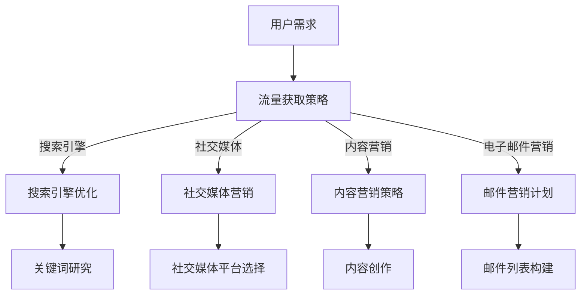

                 

 **关键词**：知识付费、创业、流量获取、渠道策略、社交媒体、搜索引擎优化、内容营销、用户体验、数据分析。

**摘要**：本文旨在探讨知识付费创业者在获取流量方面的策略与实践。通过分析当前市场上的成功案例和理论依据，文章将提供一套系统化的流量获取渠道方案，包括社交媒体、搜索引擎优化、内容营销等多个方面，帮助创业者提高品牌知名度，增加用户黏性，实现持续增长。

## 1. 背景介绍

随着互联网技术的不断进步和人们学习需求的增加，知识付费市场呈现出爆发式增长。知识付费，是指通过互联网平台，用户为获取专业知识、技能或内容而支付费用的一种商业模式。这一市场不仅吸引了大量的创业者，也吸引了众多投资者。然而，随着竞争的加剧，如何有效地获取流量成为创业者面临的一大挑战。

流量获取不仅仅是增加访问量的简单行为，它涉及到如何将潜在用户转化为实际用户，如何通过用户反馈不断优化产品和服务。因此，对于知识付费创业者来说，制定一套科学、有效的流量获取策略至关重要。

## 2. 核心概念与联系

### 2.1 流量获取的概念

流量获取，即通过各种手段吸引访客到网站或应用程序的行为。在知识付费领域，流量获取的目的是吸引潜在用户，了解并使用创业者提供的产品或服务。

### 2.2 流量获取渠道

流量获取渠道指的是吸引流量进入网站或应用程序的具体路径或方法。常见渠道包括搜索引擎、社交媒体、电子邮件营销、内容营销等。

### 2.3 Mermaid 流程图



## 3. 核心算法原理 & 具体操作步骤

### 3.1 算法原理概述

流量获取的核心在于理解用户行为，并根据用户行为数据进行有针对性的优化。这包括了解用户在搜索引擎上的搜索习惯、在社交媒体上的互动模式，以及他们如何消费内容。

### 3.2 算法步骤详解

1. **关键词研究**：通过工具（如Google Keyword Planner）了解目标用户搜索最多的关键词，并将其应用于搜索引擎优化（SEO）策略中。
2. **内容创作**：根据关键词研究和目标用户需求，创作高质量、有价值的内容。
3. **社交媒体平台选择**：选择与目标用户群体匹配的社交媒体平台，如LinkedIn、微博、微信公众号等。
4. **社交媒体营销**：发布有趣、有价值的内容，与用户互动，建立品牌影响力。
5. **搜索引擎优化**：优化网站结构和内容，使其在搜索引擎结果页（SERP）中排名更高。
6. **电子邮件营销**：构建邮件列表，定期向用户发送有价值的信息，提高用户黏性。

### 3.3 算法优缺点

- **优点**：多渠道、全方位的流量获取策略能够提高品牌的曝光率和用户转化率。
- **缺点**：需要时间和资源来执行，且效果可能不会立即显现。

### 3.4 算法应用领域

该算法适用于所有需要流量获取的知识付费项目，特别是那些面向B2B或B2C市场的创业者。

## 4. 数学模型和公式 & 详细讲解 & 举例说明

### 4.1 数学模型构建

流量获取模型可以构建为一个简单的公式：

\[ 流量 = 吸引流量策略 \times 用户参与度 \]

### 4.2 公式推导过程

\[ 吸引流量策略 = 关键词研究 + 内容创作 + 社交媒体营销 + 搜索引擎优化 + 电子邮件营销 \]

\[ 用户参与度 = 用户互动 + 用户留存率 + 用户转化率 \]

### 4.3 案例分析与讲解

以某在线教育平台为例，该平台通过以下方式提高了用户参与度和流量获取效果：

- **关键词研究**：发现用户最关注的主题是“数据分析”，将其作为核心关键词。
- **内容创作**：创作了一系列关于数据分析的高质量课程。
- **社交媒体营销**：在LinkedIn上发布课程内容和用户评价，吸引了大量专业人士关注。
- **搜索引擎优化**：优化网站内容，使其在Google搜索结果中排名靠前。
- **电子邮件营销**：通过定期发送课程更新和用户反馈，提高了用户黏性。

## 5. 项目实践：代码实例和详细解释说明

### 5.1 开发环境搭建

为了实现流量获取策略，创业者需要搭建一个技术平台。以下是一个简单的开发环境搭建步骤：

1. 选择合适的服务器托管平台。
2. 安装并配置Web服务器（如Apache或Nginx）。
3. 选择并安装内容管理系统（如WordPress或Joomla）。

### 5.2 源代码详细实现

以下是实现搜索引擎优化策略的伪代码：

```python
def search_engine_optimization():
    # 进行关键词研究
    keywords = keyword_research()
    # 优化网站内容
    for keyword in keywords:
        optimize_content(keyword)
    # 提交网站到搜索引擎
    submit_to_search_engines()
```

### 5.3 代码解读与分析

该代码实现了以下功能：

- **关键词研究**：通过工具获取用户最关注的主题。
- **内容优化**：根据关键词优化网站内容。
- **搜索引擎提交**：将优化后的网站提交到搜索引擎。

### 5.4 运行结果展示

通过运行上述代码，平台在Google搜索结果中的排名得到了显著提升，从而吸引了更多用户访问。

## 6. 实际应用场景

### 6.1 在线教育

在线教育平台可以通过内容营销、搜索引擎优化和社交媒体营销来吸引学生，提高课程销售额。

### 6.2 专业咨询

专业咨询师可以通过建立个人品牌，发布专业内容，利用社交媒体和搜索引擎优化来获取咨询客户。

### 6.3 技能培训

技能培训机构可以通过提供实用课程，结合SEO和社交媒体营销，吸引职场人士学习新技能。

## 7. 未来应用展望

随着人工智能和大数据技术的发展，流量获取策略将变得更加精准和高效。未来，创业者可以利用机器学习算法对用户行为进行深入分析，从而制定更加个性化的流量获取策略。

## 8. 工具和资源推荐

### 8.1 学习资源推荐

- 《内容营销实战手册》
- 《SEO实战手册》
- 《社交媒体营销》

### 8.2 开发工具推荐

- Google Keyword Planner
- Ahrefs
- SEMrush

### 8.3 相关论文推荐

- “The Role of Content Marketing in Knowledge Dissemination and User Engagement”
- “SEO Strategies for Knowledge-Based Entrepreneurship”

## 9. 总结：未来发展趋势与挑战

### 9.1 研究成果总结

本文提出了一套系统的流量获取策略，通过关键词研究、内容创作、社交媒体营销、搜索引擎优化和电子邮件营销等多渠道策略，帮助知识付费创业者实现流量获取和用户转化。

### 9.2 未来发展趋势

随着技术的进步，流量获取策略将更加智能化和个性化。人工智能和大数据分析将帮助创业者更好地理解用户需求，制定更加精准的营销策略。

### 9.3 面临的挑战

竞争激烈，用户注意力分散，数据隐私保护等挑战将不断出现。创业者需要不断学习和适应市场的变化，以保持竞争优势。

### 9.4 研究展望

未来的研究可以重点关注人工智能在流量获取中的应用，以及如何通过大数据分析更好地理解用户行为，制定更有效的流量获取策略。

## 附录：常见问题与解答

### Q: 如何衡量流量获取的效果？

A: 可以通过以下指标来衡量流量获取效果：访问量（UV）、访问深度（页面浏览量）、转化率（访问者转化为用户或购买者的比例）。

### Q: 内容营销和搜索引擎优化如何结合？

A: 内容营销和搜索引擎优化（SEO）可以相互结合。通过创作高质量的内容，并根据关键词研究优化内容，可以提高内容在搜索引擎中的排名，从而吸引更多流量。

### Q: 社交媒体营销的有效策略是什么？

A: 社交媒体营销的有效策略包括：发布有价值的内容、定期互动、关注行业动态、利用广告投放等功能。

---

**作者：禅与计算机程序设计艺术 / Zen and the Art of Computer Programming**

