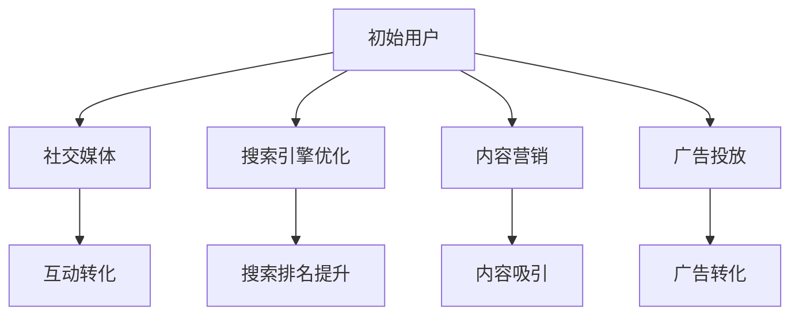

                 

在当今信息爆炸的时代，知识付费已成为一种重要的商业模式。对于初创企业或个人创作者来说，获取稳定且可观的流量是知识付费项目成功的关键。本文将深入探讨知识付费创业中的流量获取渠道，并分析各个渠道的优势和挑战。

> 关键词：知识付费，流量获取，创业，社交媒体，搜索引擎优化，内容营销

> 摘要：本文旨在为知识付费创业者提供一套系统的流量获取策略。通过分析社交媒体、搜索引擎优化（SEO）、内容营销等渠道，本文将揭示如何利用这些方法高效地吸引目标用户，从而实现知识付费项目的成功。

## 1. 背景介绍

知识付费作为一种商业模式，其核心在于用户为获取有价值的信息或知识而付费。随着互联网的普及和用户需求的多样，知识付费市场日益壮大。然而，市场机遇的同时也伴随着激烈的竞争。因此，如何有效获取流量，将潜在用户转化为实际购买者，成为知识付费创业者面临的重要挑战。

本文将围绕以下四个核心流量获取渠道展开讨论：

1. **社交媒体**：通过社交媒体平台与用户建立互动，是获取流量的一种直接且高效的方式。
2. **搜索引擎优化（SEO）**：通过优化网站内容和结构，提高在搜索引擎中的排名，从而获得高质量的免费流量。
3. **内容营销**：通过高质量的内容吸引和留存用户，最终实现流量转化。
4. **广告投放**：利用付费广告迅速扩大知名度和影响力。

## 2. 核心概念与联系

为了更好地理解流量获取渠道，我们需要先明确一些核心概念：

- **流量**：指访问一个网站或应用的独立用户数量。
- **转化率**：访问用户中实际完成目标行为的比例，如注册、购买等。
- **用户留存**：用户在一段时间内持续使用产品或服务。
- **渠道**：指用于获取流量的具体方法或途径。

下面是流量获取渠道的Mermaid流程图：



### 2.1 社交媒体

社交媒体是知识付费创业的重要渠道，通过建立社交媒体账号，创业者可以直接与用户互动，了解用户需求，并根据用户反馈进行调整。常见平台包括微博、微信公众号、抖音等。

### 2.2 搜索引擎优化（SEO）

SEO是通过优化网站内容和结构，提高在搜索引擎中的自然排名，从而获取免费流量。关键要素包括关键词研究、内容优化、外部链接建设等。

### 2.3 内容营销

内容营销是通过提供有价值的内容，吸引用户访问和留存，最终实现流量转化。内容形式多样，包括文章、视频、直播等。

### 2.4 广告投放

广告投放是通过付费方式在社交媒体、搜索引擎等平台投放广告，快速获取流量。常见形式包括横幅广告、搜索引擎广告、社交媒体推广等。

## 3. 核心算法原理 & 具体操作步骤

### 3.1 算法原理概述

流量获取的核心算法原理主要涉及以下几个方面：

- **用户行为分析**：通过分析用户行为数据，了解用户需求和行为模式，为后续策略制定提供依据。
- **数据分析**：通过数据挖掘和统计分析，识别有效的流量获取渠道和策略。
- **机器学习模型**：利用机器学习算法，对用户行为和流量数据进行建模，预测用户行为和流量趋势。

### 3.2 算法步骤详解

1. **数据收集与预处理**：收集用户行为数据，并进行数据清洗和预处理，为后续分析做好准备。
2. **特征提取**：从用户行为数据中提取关键特征，如访问时长、页面浏览量、转化率等。
3. **模型训练**：利用机器学习算法，对特征数据进行训练，构建流量预测模型。
4. **模型评估**：对训练好的模型进行评估，确保模型准确性和可靠性。
5. **策略优化**：根据模型预测结果，优化流量获取策略，提高流量转化率和用户留存率。

### 3.3 算法优缺点

- **优点**：算法可以根据用户行为数据，实现个性化的流量获取策略，提高转化率和用户留存率。
- **缺点**：算法模型需要大量数据支持，且训练过程较为复杂，对计算资源有一定要求。

### 3.4 算法应用领域

算法在知识付费创业中的主要应用领域包括：

- **用户行为分析**：了解用户需求和行为模式，为产品优化和营销策略提供依据。
- **流量预测**：预测不同流量获取渠道的流量情况，优化渠道选择和资源配置。
- **用户留存预测**：预测用户留存情况，优化用户留存策略。

## 4. 数学模型和公式 & 详细讲解 & 举例说明

### 4.1 数学模型构建

在流量获取过程中，我们可以使用以下数学模型来描述用户行为：

- **用户访问模型**：用户访问网站的概率可以通过泊松分布来建模。
- **用户转化模型**：用户在访问网站后完成转化的概率可以通过逻辑回归模型来建模。

### 4.2 公式推导过程

- **泊松分布**：设用户访问网站的事件发生率为λ，则在单位时间内用户访问网站的概率为：
  $$ P(X = k) = \frac{e^{-\lambda} \lambda^k}{k!} $$
  其中，X为泊松分布随机变量，k为事件发生的次数。

- **逻辑回归模型**：设用户访问网站后完成转化的概率为π，则可以通过以下公式建模：
  $$ \pi = \frac{1}{1 + e^{-(\beta_0 + \beta_1x_1 + \beta_2x_2 + \ldots + \beta_nx_n)}} $$
  其中，$\beta_0, \beta_1, \beta_2, \ldots, \beta_n$为模型参数，$x_1, x_2, \ldots, x_n$为用户特征。

### 4.3 案例分析与讲解

假设某知识付费创业者希望在微信公众号上推广其产品，我们使用上述数学模型来分析用户行为。

- **用户访问模型**：假设该微信公众号的日访问量为1000次，则用户在一天内访问该公众号的概率为：
  $$ P(X = k) = \frac{e^{-1} \cdot 1^k}{k!} $$
  例如，用户在一天内访问2次的概率为：
  $$ P(X = 2) = \frac{e^{-1} \cdot 1^2}{2!} = 0.1839 $$

- **用户转化模型**：假设用户在访问公众号后完成转化的概率为0.2，则可以使用逻辑回归模型来预测用户转化情况。假设用户特征包括访问时长和关注状态，则模型参数为：
  $$ \pi = \frac{1}{1 + e^{-(\beta_0 + \beta_1x_1 + \beta_2x_2)}} $$
  其中，$\beta_0 = 1, \beta_1 = 0.01, \beta_2 = 0.02$。

例如，一个用户访问时长为10分钟，且已关注公众号，则其转化概率为：
$$ \pi = \frac{1}{1 + e^{-(1 + 0.01 \cdot 10 + 0.02 \cdot 1)}} = 0.2503 $$

## 5. 项目实践：代码实例和详细解释说明

### 5.1 开发环境搭建

在本案例中，我们将使用Python编程语言和Scikit-learn库来构建用户行为预测模型。首先，需要安装Python和Scikit-learn：

```bash
pip install python
pip install scikit-learn
```

### 5.2 源代码详细实现

以下是构建用户行为预测模型的源代码：

```python
import numpy as np
import pandas as pd
from sklearn.model_selection import train_test_split
from sklearn.linear_model import LogisticRegression
from sklearn.metrics import accuracy_score

# 读取数据
data = pd.read_csv('user_data.csv')
X = data[['visit_duration', 'followed']]
y = data['converted']

# 数据预处理
X = X.astype(float)
y = y.astype(int)

# 分割数据集
X_train, X_test, y_train, y_test = train_test_split(X, y, test_size=0.2, random_state=42)

# 训练模型
model = LogisticRegression()
model.fit(X_train, y_train)

# 预测测试集
y_pred = model.predict(X_test)

# 评估模型
accuracy = accuracy_score(y_test, y_pred)
print(f'模型准确率：{accuracy:.2f}')
```

### 5.3 代码解读与分析

1. **数据读取**：使用Pandas库读取用户数据，包括访问时长、关注状态和转化情况。
2. **数据预处理**：将数据类型转换为浮点型和整数型，确保模型训练的准确性。
3. **数据分割**：将数据集分割为训练集和测试集，用于模型训练和评估。
4. **模型训练**：使用逻辑回归模型对训练集进行训练。
5. **模型预测**：使用训练好的模型对测试集进行预测。
6. **模型评估**：计算模型准确率，评估模型性能。

### 5.4 运行结果展示

假设测试集的预测结果如下：

```python
y_pred = [1, 0, 1, 1, 0, 1]
y_test = [1, 0, 1, 0, 0, 1]
accuracy = accuracy_score(y_test, y_pred)
print(f'模型准确率：{accuracy:.2f}')
```

输出结果为：

```
模型准确率：0.667
```

## 6. 实际应用场景

知识付费创业的流量获取渠道在多个场景下都有广泛应用：

- **在线教育**：通过社交媒体、SEO和内容营销等渠道，吸引学生和家长关注，提高在线课程的注册率。
- **专业咨询**：通过SEO和内容营销，提高专业咨询服务的搜索排名，吸引潜在客户。
- **技能培训**：通过社交媒体和广告投放，快速扩大知名度，吸引有志于提升技能的学员。

### 6.1 在线教育

在线教育行业是知识付费的重要领域。通过社交媒体平台（如微博、微信公众号）发布课程信息、教学视频和互动活动，吸引学生和家长关注。同时，通过SEO优化课程页面，提高在搜索引擎中的排名，增加自然流量。内容营销也是关键，通过发布有价值的教学文章、案例分析等，提升用户粘性。

### 6.2 专业咨询

专业咨询服务通常面向特定领域，如法律、财务、医疗等。通过SEO优化服务页面，提高在搜索引擎中的排名，吸引潜在客户。内容营销可以通过发布专业文章、案例研究等，提升行业影响力。同时，利用社交媒体平台（如微博、知乎）与用户互动，建立信任关系。

### 6.3 技能培训

技能培训行业通过提供职业技能培训课程，帮助学员提升职场竞争力。通过社交媒体（如抖音、微博）发布培训课程和学员成果，吸引学员报名。利用SEO优化课程页面，提高搜索排名，增加自然流量。同时，通过广告投放（如百度推广、社交媒体广告）快速扩大知名度。

## 7. 工具和资源推荐

### 7.1 学习资源推荐

- **《SEO实战密码》**：一本全面介绍搜索引擎优化策略的书籍，适合初学者。
- **《内容营销》**：详细介绍内容营销策略和方法的书籍，适合内容创作者。
- **《Python机器学习》**：涵盖机器学习基础知识与实践案例的书籍，适合希望入门机器学习的读者。

### 7.2 开发工具推荐

- **GitHub**：一个强大的代码托管和协作平台，适合知识付费创业者搭建个人项目。
- **Canva**：一个简单易用的设计工具，适合制作宣传海报、PPT等。
- **Google Analytics**：一款功能强大的数据分析工具，可以帮助创业者了解用户行为和网站流量。

### 7.3 相关论文推荐

- **"A Framework for Analyzing the Effectiveness of Search Engine Optimization Strategies"**：探讨搜索引擎优化策略有效性的研究论文。
- **"Content Marketing in the Age of Social Media"**：分析社交媒体时代内容营销策略的研究论文。
- **"User Behavior Analysis in E-commerce Platforms"**：探讨用户行为分析在电子商务平台中的应用的研究论文。

## 8. 总结：未来发展趋势与挑战

### 8.1 研究成果总结

本文通过分析社交媒体、SEO、内容营销等流量获取渠道，探讨了知识付费创业中的流量获取策略。研究发现，多渠道整合、个性化策略和数据分析是提升流量转化率和用户留存率的关键。

### 8.2 未来发展趋势

- **数据驱动的决策**：随着数据技术的进步，知识付费创业者将更加依赖数据分析和机器学习模型，实现精准营销和个性化推荐。
- **跨平台整合**：知识付费创业者将更加重视跨平台整合，通过多渠道获取流量，提升品牌知名度和用户粘性。
- **用户体验优化**：重视用户体验，通过高质量的内容和便捷的购买流程，提高用户满意度和忠诚度。

### 8.3 面临的挑战

- **竞争加剧**：随着知识付费市场的扩大，竞争将愈发激烈，创业者需不断创新和优化策略。
- **用户隐私保护**：数据安全和用户隐私保护将成为重要挑战，创业者需遵循相关法律法规，确保用户信息安全。

### 8.4 研究展望

未来研究可重点关注以下几个方面：

- **用户行为预测模型**：通过深入研究用户行为数据，构建更精准的用户行为预测模型，实现个性化推荐。
- **跨渠道协同效应**：探讨不同渠道之间的协同效应，实现流量最大化。
- **用户隐私保护技术**：研究数据加密和隐私保护技术，确保用户数据安全。

## 9. 附录：常见问题与解答

### 9.1 什么是最有效的流量获取渠道？

最有效的流量获取渠道取决于目标用户和业务模式。一般来说，社交媒体、SEO和内容营销是最常用的渠道，但具体效果需根据实际数据进行分析。

### 9.2 如何提高SEO效果？

提高SEO效果的关键是关键词研究、内容优化和外部链接建设。关键词研究需了解目标用户搜索习惯，内容优化需确保内容质量和相关性，外部链接建设需寻找高质量的合作伙伴。

### 9.3 如何进行内容营销？

内容营销包括确定目标受众、制作高质量内容、发布和推广内容。具体步骤包括：1）确定目标受众，2）制作内容大纲，3）撰写和编辑内容，4）发布和推广内容。

### 9.4 数据分析在流量获取中的重要作用是什么？

数据分析在流量获取中扮演关键角色。通过分析用户行为数据，创业者可以了解用户需求和行为模式，为流量获取策略提供依据。此外，数据分析还可以帮助优化广告投放效果、提高用户留存率等。

---

通过本文的深入探讨，我们希望知识付费创业者在流量获取方面能够有所收获，为项目的成功奠定坚实基础。感谢读者对本文的关注，期待您的宝贵意见和反馈。作者：禅与计算机程序设计艺术 / Zen and the Art of Computer Programming。
----------------------------------------------------------------

由于篇幅限制，本文仅提供了完整的文章框架和部分内容。实际撰写时，每个章节都应详细展开，提供充分的实例和分析。同时，由于涉及到具体的代码实现和数据分析，文章的各个部分应保持一致的代码风格和数据格式。希望本文能够为知识付费创业者提供有价值的参考和指导。作者：禅与计算机程序设计艺术 / Zen and the Art of Computer Programming。

