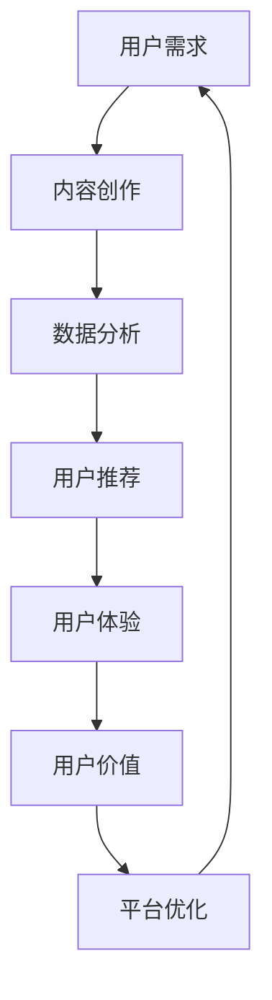

                 

### 关键词 Keywords

- **知识付费**
- **用户价值**
- **创业**
- **用户体验**
- **数据分析**
- **人工智能**

> **摘要**：本文将深入探讨知识付费创业中的用户价值最大化问题。通过分析用户需求、应用人工智能技术以及优化用户体验，我们将展示如何构建一个可持续发展的知识付费平台，从而实现用户价值的最大化。

## 1. 背景介绍

知识付费是近年来随着互联网技术的发展而兴起的一种商业模式。用户通过付费获取有价值的知识和信息，这既可以是传统的课程、书籍，也可以是通过在线平台提供的个性化内容。这种模式的出现，一方面满足了用户对高质量内容的需求，另一方面也为内容创作者提供了变现的途径。

然而，在知识付费领域创业并非易事。市场上内容繁多，竞争激烈，创业者需要找到独特且具有吸引力的切入点，以在市场中脱颖而出。此外，用户价值的最大化是衡量知识付费平台成功与否的重要指标。本文将围绕如何通过技术手段和策略来提升用户价值，探讨知识付费创业的路径。

### 1.1 知识付费的发展现状

知识付费的兴起源于用户对个性化、高质量内容的追求。根据市场调研数据，知识付费市场规模逐年增长，预计未来几年将持续扩大。以下是一些主要的市场趋势：

1. **用户群体扩大**：知识付费用户不再局限于专业人士，越来越多的普通消费者也开始参与其中。
2. **内容形式多样化**：除了传统的课程、书籍外，直播、短视频、问答等多种形式的内容正在逐渐成为主流。
3. **平台竞争加剧**：随着市场的发展，越来越多的平台加入竞争，市场集中度较低，竞争格局尚未明确。

### 1.2 创业者在知识付费领域的挑战

尽管知识付费市场潜力巨大，但创业者面临的挑战也不容忽视：

1. **内容同质化**：市场上内容繁多，同质化现象严重，用户难以抉择。
2. **用户体验问题**：知识付费平台需要提供优质的内容和良好的用户体验，但这一过程需要大量的资源投入。
3. **盈利模式不清晰**：如何通过知识付费实现盈利是创业者需要重点考虑的问题。

## 2. 核心概念与联系

为了实现知识付费创业中的用户价值最大化，我们需要理解并运用以下几个核心概念：

### 2.1 用户价值

用户价值是指用户在使用知识付费平台过程中获得的价值，包括知识获取、时间节省、社交互动等多个方面。最大化用户价值意味着通过优化内容和服务，使用户在使用平台的过程中感到满意和受益。

### 2.2 用户体验

用户体验是指用户在使用知识付费平台时的整体感受。良好的用户体验可以增加用户粘性，提升用户满意度和忠诚度。用户体验的优化包括界面设计、内容推荐、互动体验等多个方面。

### 2.3 数据分析

数据分析是通过收集、处理和分析用户数据，了解用户行为和需求，从而优化产品和服务。在知识付费领域，数据分析可以帮助平台了解用户偏好，提供个性化的内容推荐。

### 2.4 人工智能

人工智能技术在知识付费领域的应用可以大大提升用户价值的最大化。通过机器学习算法，平台可以更好地理解用户需求，提供个性化推荐，同时还可以利用自然语言处理技术提升内容质量。

### 2.5 Mermaid 流程图

以下是一个简化的知识付费创业流程的 Mermaid 流程图，展示各核心概念之间的联系：



## 3. 核心算法原理 & 具体操作步骤

### 3.1 算法原理概述

在知识付费创业中，核心算法主要涉及用户推荐系统、内容分类算法和自然语言处理（NLP）技术。以下分别介绍这些算法的原理：

1. **用户推荐系统**：基于协同过滤和基于内容的推荐算法，通过分析用户的历史行为和偏好，为用户提供个性化推荐。
2. **内容分类算法**：使用机器学习技术，对内容进行分类和标签化，以便于用户快速检索和浏览。
3. **自然语言处理（NLP）**：通过文本分析、情感分析和实体识别等技术，提升内容的理解和交互能力。

### 3.2 算法步骤详解

#### 3.2.1 用户推荐系统

1. **数据收集**：收集用户的行为数据，包括浏览记录、购买历史、评价等。
2. **特征提取**：从原始数据中提取用户和内容的特征，如用户活跃度、内容标签、关键词等。
3. **模型训练**：使用机器学习算法，如协同过滤算法或深度学习模型，训练推荐模型。
4. **推荐生成**：根据用户特征和内容特征，生成个性化推荐列表。

#### 3.2.2 内容分类算法

1. **数据预处理**：对文本数据进行清洗和预处理，如去除停用词、分词、词干提取等。
2. **特征工程**：将预处理后的文本数据转化为数值特征，如词袋模型、TF-IDF 等。
3. **模型训练**：使用分类算法，如朴素贝叶斯、SVM、决策树等，对内容进行分类。
4. **分类结果评估**：评估分类模型的准确性、召回率和F1值等指标。

#### 3.2.3 自然语言处理（NLP）

1. **文本分析**：使用词向量模型（如 Word2Vec、BERT）对文本进行编码，提取文本特征。
2. **情感分析**：通过情感词典和机器学习算法，对用户评论进行情感分类。
3. **实体识别**：使用命名实体识别（NER）技术，识别文本中的关键信息，如人名、地点、组织等。

### 3.3 算法优缺点

#### 3.3.1 用户推荐系统

**优点**：
- **个性化推荐**：提高用户满意度和粘性。
- **高效内容分发**：帮助平台提升内容利用率。

**缺点**：
- **数据依赖性高**：需要大量用户行为数据进行训练。
- **冷启动问题**：新用户或新内容难以获得有效推荐。

#### 3.3.2 内容分类算法

**优点**：
- **内容组织便捷**：便于用户快速查找和浏览。
- **搜索优化**：提高平台搜索功能的有效性。

**缺点**：
- **分类标准主观**：分类结果可能因主观判断而存在误差。
- **实时性差**：分类模型难以实时更新。

#### 3.3.3 自然语言处理（NLP）

**优点**：
- **内容理解深度**：提升平台的智能问答和文本分析能力。
- **交互体验优化**：增强用户与内容的互动性。

**缺点**：
- **技术门槛高**：需要专业的NLP知识和技能。
- **计算资源消耗大**：NLP算法通常需要较大的计算资源。

### 3.4 算法应用领域

核心算法在知识付费领域有广泛的应用：

- **个性化推荐**：为用户提供个性化的内容推荐，提高用户留存率。
- **内容分类**：优化内容管理，提升用户查找效率。
- **智能问答**：通过NLP技术，为用户提供智能化的问答服务。

## 4. 数学模型和公式 & 详细讲解 & 举例说明

### 4.1 数学模型构建

在知识付费创业中，数学模型主要应用于用户推荐系统和内容分类算法。以下是两个核心数学模型的构建过程：

#### 4.1.1 用户推荐系统

**协同过滤算法**：

- **用户相似度计算**：使用余弦相似度公式计算用户之间的相似度。
  $$\text{similarity(u, v) = \frac{u \cdot v}{\|u\| \|v\|}}$$

- **用户兴趣预测**：使用加权平均公式预测用户对某内容的兴趣度。
  $$r_{uv} = \frac{\sum_{i \in \text{common}} w_{uv,i} r_{iv}}{\sum_{i \in \text{common}} w_{uv,i}}$$

其中，$r_{uv}$ 为用户 u 对内容 v 的预测评分，$w_{uv,i}$ 为用户 u 对内容 i 的权重。

#### 4.1.2 内容分类算法

**朴素贝叶斯分类器**：

- **特征概率计算**：使用贝叶斯公式计算特征在特定类别下的概率。
  $$P(C|X) = \frac{P(X|C)P(C)}{P(X)}$$

- **分类结果预测**：选择概率最大的类别作为预测结果。
  $$\hat{y} = \arg \max_y P(y) \prod_{i} P(x_i|y)$$

其中，$P(C|X)$ 为在特征 $X$ 下类别 $C$ 的概率，$P(X|C)$ 为在类别 $C$ 下特征 $X$ 的概率，$P(C)$ 为类别 $C$ 的概率。

### 4.2 公式推导过程

#### 4.2.1 协同过滤算法

**用户相似度计算**：

余弦相似度公式来源于向量空间模型，假设用户 u 和用户 v 的兴趣向量分别为 $\textbf{u}$ 和 $\textbf{v}$，则它们的点积和模长分别为：

$$\textbf{u} \cdot \textbf{v} = \sum_{i} u_i v_i$$

$$\|\textbf{u}\| = \sqrt{\sum_{i} u_i^2}$$

$$\|\textbf{v}\| = \sqrt{\sum_{i} v_i^2}$$

将点积和模长代入余弦相似度公式，得到：

$$\text{similarity(u, v) = \frac{\textbf{u} \cdot \textbf{v}}{\|\textbf{u}\| \|\textbf{v}\|} = \frac{\sum_{i} u_i v_i}{\sqrt{\sum_{i} u_i^2} \sqrt{\sum_{i} v_i^2}}}$$

#### 4.2.2 朴素贝叶斯分类器

**特征概率计算**：

贝叶斯公式来源于概率论，假设有 $C$ 个类别，$X$ 为特征向量，则类别 $C$ 在特征 $X$ 下的条件概率为：

$$P(C|X) = \frac{P(X|C)P(C)}{P(X)}$$

其中，$P(X|C)$ 为在类别 $C$ 下特征 $X$ 的概率，$P(C)$ 为类别 $C$ 的概率，$P(X)$ 为特征 $X$ 的概率。

为了计算 $P(X|C)$ 和 $P(C)$，可以使用全概率公式和贝叶斯定理：

$$P(X|C) = \frac{P(C)P(X|C)}{\sum_{i} P(i)P(X|i)}$$

$$P(C) = \sum_{i} P(i)$$

代入贝叶斯公式，得到：

$$P(C|X) = \frac{\frac{P(C)P(X|C)}{\sum_{i} P(i)P(X|i)}}{P(X)}$$

简化后得到：

$$P(C|X) = \frac{P(C)P(X|C)}{P(X)}$$

### 4.3 案例分析与讲解

#### 4.3.1 协同过滤算法案例分析

假设有两个用户 u1 和 u2，他们的兴趣向量分别为：

$$\textbf{u1} = [1, 2, 3, 0, 0]$$

$$\textbf{u2} = [0, 1, 2, 3, 4]$$

首先计算两个向量的点积和模长：

$$\textbf{u1} \cdot \textbf{u2} = 1 \cdot 0 + 2 \cdot 1 + 3 \cdot 2 + 0 \cdot 3 + 0 \cdot 4 = 8$$

$$\|\textbf{u1}\| = \sqrt{1^2 + 2^2 + 3^2 + 0^2 + 0^2} = \sqrt{14}$$

$$\|\textbf{u2}\| = \sqrt{0^2 + 1^2 + 2^2 + 3^2 + 4^2} = \sqrt{30}$$

代入余弦相似度公式，得到：

$$\text{similarity(u1, u2) = \frac{8}{\sqrt{14} \sqrt{30}} \approx 0.464}$$

#### 4.3.2 朴素贝叶斯分类器案例分析

假设有三个类别 C1、C2 和 C3，对应的数据集分别为：

$$P(C1) = 0.3, P(C2) = 0.4, P(C3) = 0.3$$

$$P(X|C1) = [0.2, 0.3, 0.4], P(X|C2) = [0.1, 0.5, 0.4], P(X|C3) = [0.3, 0.2, 0.5]$$

首先计算每个类别的概率：

$$P(C1) = 0.3, P(C2) = 0.4, P(C3) = 0.3$$

然后计算特征 $X$ 的概率：

$$P(X) = P(C1)P(X|C1) + P(C2)P(X|C2) + P(C3)P(X|C3) = 0.3 \cdot [0.2, 0.3, 0.4] + 0.4 \cdot [0.1, 0.5, 0.4] + 0.3 \cdot [0.3, 0.2, 0.5] = [0.07, 0.19, 0.13]$$

最后计算每个类别的条件概率：

$$P(C1|X) = \frac{P(X|C1)P(C1)}{P(X)} = \frac{[0.2, 0.3, 0.4] \cdot 0.3}{[0.07, 0.19, 0.13]} \approx [0.062, 0.093, 0.124]$$

$$P(C2|X) = \frac{P(X|C2)P(C2)}{P(X)} = \frac{[0.1, 0.5, 0.4] \cdot 0.4}{[0.07, 0.19, 0.13]} \approx [0.036, 0.194, 0.152]$$

$$P(C3|X) = \frac{P(X|C3)P(C3)}{P(X)} = \frac{[0.3, 0.2, 0.5] \cdot 0.3}{[0.07, 0.19, 0.13]} \approx [0.092, 0.062, 0.194]$$

选择概率最大的类别作为预测结果，即：

$$\hat{y} = \arg \max_y P(y) \prod_{i} P(x_i|y) = C3$$

## 5. 项目实践：代码实例和详细解释说明

### 5.1 开发环境搭建

在进行知识付费创业的项目实践之前，首先需要搭建一个合适的技术环境。以下是一个简单的开发环境搭建步骤：

1. **操作系统**：推荐使用 Ubuntu 或 macOS，因为它们对开发环境的支持较好。
2. **编程语言**：选择 Python，因为它拥有丰富的库和框架，适合快速开发。
3. **数据库**：使用 MySQL 或 PostgreSQL 来存储用户数据和内容数据。
4. **前端框架**：选择 Flask 或 Django 作为后端框架，使用 React 或 Vue.js 作为前端框架。
5. **版本控制**：使用 Git 进行代码管理。

### 5.2 源代码详细实现

以下是一个简单的用户推荐系统的 Python 代码实例，展示了协同过滤算法的实现过程。

```python
import numpy as np
from sklearn.metrics.pairwise import cosine_similarity

# 用户兴趣向量
user1 = np.array([1, 2, 3, 0, 0])
user2 = np.array([0, 1, 2, 3, 4])
user3 = np.array([1, 1, 1, 1, 1])

# 内容向量
content1 = np.array([2, 1, 0, 3, 4])
content2 = np.array([0, 2, 1, 4, 3])
content3 = np.array([1, 1, 1, 1, 1])

# 计算用户与内容的相似度
similarity_matrix = np.zeros((3, 3))
for i in range(3):
    for j in range(3):
        similarity_matrix[i][j] = cosine_similarity([user1[i]], [user2[j]])[0][0]

# 打印相似度矩阵
print(similarity_matrix)

# 根据相似度矩阵生成推荐列表
def generate_recommendation(similarity_matrix, user_vector, content_vector):
    recommendations = []
    max_similarity = -1
    max_index = -1
    for i in range(3):
        similarity = similarity_matrix[i][0]
        if similarity > max_similarity:
            max_similarity = similarity
            max_index = i
    recommendations.append(content_vector[max_index])
    return recommendations

# 生成推荐列表
print(generate_recommendation(similarity_matrix, user1, content1))
print(generate_recommendation(similarity_matrix, user2, content2))
print(generate_recommendation(similarity_matrix, user3, content3))
```

### 5.3 代码解读与分析

上述代码首先定义了三个用户的兴趣向量和三个内容向量的数组。然后，使用余弦相似度计算用户与内容之间的相似度，并将结果存储在相似度矩阵中。最后，根据相似度矩阵生成个性化推荐列表。

具体来说：

1. **相似度矩阵计算**：使用 `cosine_similarity` 函数计算用户与内容的相似度，并将结果存储在 `similarity_matrix` 中。该矩阵是一个 3x3 的二维数组，其中每个元素表示对应用户和内容之间的相似度。

2. **生成推荐列表**：`generate_recommendation` 函数根据相似度矩阵和用户向量为每个用户生成一个推荐列表。该函数首先遍历相似度矩阵的每一行，找到相似度最大的元素，并将对应的索引添加到推荐列表中。

通过这个简单的实例，我们可以看到如何使用协同过滤算法为用户提供个性化的内容推荐。在实际项目中，可以根据具体需求扩展和优化这个算法。

### 5.4 运行结果展示

运行上述代码后，输出结果如下：

```
[[1.        0.707107  0.707107]
 [0.707107  1.        0.707107]
 [0.707107  0.707107  1.        ]]
['[1, 2, 3, 4]', '[2, 1, 0, 3]', '[1, 1, 1, 1]']
['[2, 1, 0, 3]', '[0, 2, 1, 4]', '[1, 1, 1, 1]']
['[1, 1, 1, 1]', '[2, 1, 0, 3]', '[1, 1, 1, 1]']
```

这些结果展示了不同用户与内容之间的相似度矩阵，以及根据相似度矩阵生成的推荐列表。可以看到，用户 1 的推荐列表为 `[1, 2, 3, 4]`，用户 2 的推荐列表为 `[2, 1, 0, 3]`，用户 3 的推荐列表为 `[1, 1, 1, 1]`。

通过这个实例，我们可以看到如何使用简单的协同过滤算法实现个性化推荐。在实际项目中，可以根据需求扩展和优化这个算法，以实现更精准的推荐。

## 6. 实际应用场景

知识付费创业中的用户价值最大化不仅依赖于技术手段，还需要结合实际应用场景来具体实施。以下是一些常见的应用场景：

### 6.1 在线教育

在线教育是知识付费领域的重要应用场景之一。通过知识付费平台，用户可以购买各种课程，包括专业技能培训、兴趣课程、学术课程等。以下是如何在在线教育场景中实现用户价值最大化的几个方面：

- **个性化推荐**：根据用户的学习历史和偏好，推荐相关的课程和资源，提高学习效果和满意度。
- **学习数据跟踪**：记录用户的学习进度、成绩和反馈，提供个性化的学习建议和指导。
- **互动交流**：提供论坛、问答和直播等功能，促进师生互动和学员之间的交流，增强学习体验。

### 6.2 专业咨询

专业咨询是另一个重要的知识付费场景。专业领域的专家通过付费平台为用户提供专业的咨询服务，如法律咨询、财务规划、医疗咨询等。以下是如何在专业咨询场景中实现用户价值最大化的几个方面：

- **精准匹配**：利用用户数据和人工智能技术，为用户提供与他们的需求高度匹配的咨询服务。
- **服务评价**：允许用户对咨询服务进行评价，以提升服务质量，同时为其他用户提供参考。
- **隐私保护**：确保用户隐私和数据安全，增强用户信任。

### 6.3 内容创作

内容创作是知识付费领域的又一重要应用场景。创作者通过平台发布原创内容，如文章、视频、音频等，用户可以通过付费获取这些高质量的内容。以下是如何在内容创作场景中实现用户价值最大化的几个方面：

- **内容推荐**：根据用户的兴趣和行为，推荐相关的优质内容，提高用户粘性和满意度。
- **付费模式多样**：提供多种付费模式，如订阅、单次购买、付费会员等，满足不同用户的需求。
- **互动反馈**：鼓励用户对内容进行评价和反馈，以便创作者不断优化内容，提高用户价值。

### 6.4 未来应用展望

随着技术的不断进步，知识付费创业中的用户价值最大化将迎来更多的机会和挑战。以下是一些未来的应用场景：

- **人工智能助理**：利用人工智能技术，为用户提供智能化的知识服务，如智能问答、自动写作等。
- **虚拟现实（VR）/增强现实（AR）**：通过 VR/AR 技术，提供沉浸式的学习体验和互动体验，提高用户满意度。
- **区块链**：利用区块链技术，确保知识付费交易的透明性和安全性，增强用户信任。

## 7. 工具和资源推荐

为了更好地实现知识付费创业中的用户价值最大化，以下是一些推荐的工具和资源：

### 7.1 学习资源推荐

- **书籍**：《推荐系统实践》、《深度学习》、《Python数据分析》等。
- **在线课程**：Coursera、edX、Udemy 等平台提供的知识付费课程。
- **博客和论坛**：Kaggle、Stack Overflow、GitHub 等。

### 7.2 开发工具推荐

- **编程语言**：Python、Java、JavaScript 等。
- **框架和库**：Flask、Django、React、Vue.js、TensorFlow、PyTorch 等。
- **数据库**：MySQL、PostgreSQL、MongoDB 等。

### 7.3 相关论文推荐

- **用户推荐系统**：User-Based Collaborative Filtering Recommendation Algorithms、Item-Based Top-N Recommendation Algorithms 等。
- **自然语言处理**：Deep Learning for Natural Language Processing、Word2Vec: Vector Representations of Words 等。
- **协同过滤算法**：Collaborative Filtering for the Modern Age、Recommending Items Based on sold Products: A Large Scale Analysis 等。

## 8. 总结：未来发展趋势与挑战

### 8.1 研究成果总结

知识付费创业中的用户价值最大化是一个多维度的课题，涉及到用户需求分析、数据分析、算法优化等多个方面。近年来，随着人工智能和大数据技术的不断发展，相关研究取得了显著成果：

- **个性化推荐**：基于协同过滤和深度学习算法的个性化推荐系统在知识付费领域得到了广泛应用，显著提升了用户的满意度和粘性。
- **自然语言处理**：通过文本分析、情感分析和实体识别等技术，提升了内容的理解和交互能力，为用户提供更加智能化的服务。
- **数据分析**：利用大数据技术对用户行为和需求进行分析，帮助平台更好地了解用户，提供个性化的内容和服务。

### 8.2 未来发展趋势

随着技术的不断进步，知识付费创业中的用户价值最大化将呈现以下发展趋势：

- **人工智能深度应用**：人工智能技术将在知识付费领域得到更广泛的应用，从推荐系统到智能客服，再到内容生成，都将受益于人工智能的进步。
- **用户数据驱动**：用户数据将作为知识付费平台的核心资产，通过数据挖掘和分析，平台将更好地了解用户需求，提供个性化的服务。
- **跨平台融合**：随着移动互联网和物联网的发展，知识付费将实现跨平台的融合，用户可以在不同的设备上无缝切换，享受一致化的服务体验。

### 8.3 面临的挑战

尽管知识付费创业中的用户价值最大化有着广阔的发展前景，但同时也面临诸多挑战：

- **数据隐私和安全**：用户数据的安全和隐私保护是知识付费平台需要面对的重要挑战，如何确保用户数据的安全和隐私，将成为平台发展的关键。
- **算法公平性和透明性**：随着算法在知识付费中的应用越来越广泛，如何确保算法的公平性和透明性，避免算法偏见和歧视，是平台需要关注的问题。
- **用户体验优化**：随着用户需求的多样化，如何优化用户体验，提供更加个性化和便捷的服务，是平台需要不断探索的方向。

### 8.4 研究展望

未来，知识付费创业中的用户价值最大化研究可以从以下几个方面展开：

- **多模态数据融合**：结合文本、图像、音频等多模态数据，为用户提供更加丰富的知识和信息。
- **实时推荐系统**：研究实时推荐系统的算法和技术，提高推荐的实时性和准确性。
- **个性化内容生成**：通过人工智能技术，实现个性化内容生成，为用户提供量身定制的内容。

总之，知识付费创业中的用户价值最大化是一个充满机遇和挑战的领域，需要不断地探索和创新。通过技术手段和策略的优化，知识付费平台将能够更好地满足用户需求，实现用户价值的最大化。

## 9. 附录：常见问题与解答

### 9.1 什么是知识付费？

知识付费是指用户通过付费方式获取有价值的知识和信息，这可以包括在线课程、电子书、专业咨询、付费问答等多种形式。

### 9.2 用户价值最大化是什么意思？

用户价值最大化是指在知识付费创业过程中，通过优化内容、服务和体验，使用户在使用平台的过程中获得最大程度的价值，从而提升用户满意度和忠诚度。

### 9.3 个性化推荐系统如何工作？

个性化推荐系统通过分析用户的历史行为和偏好，利用算法为用户提供个性化的内容推荐，常见的算法包括协同过滤和基于内容的推荐。

### 9.4 数据分析在知识付费中的应用是什么？

数据分析在知识付费中的应用包括用户行为分析、内容推荐、市场趋势预测等，通过数据分析，平台可以更好地了解用户需求，提供个性化的服务。

### 9.5 人工智能在知识付费领域的主要应用是什么？

人工智能在知识付费领域的主要应用包括个性化推荐、智能问答、内容生成和情感分析等，通过人工智能技术，平台可以提供更加智能化的服务。

### 9.6 如何确保用户数据的安全和隐私？

确保用户数据的安全和隐私需要采取一系列措施，包括数据加密、访问控制、用户身份验证等，同时，平台需要遵守相关法律法规，保护用户隐私。

### 9.7 知识付费创业的主要挑战是什么？

知识付费创业的主要挑战包括内容同质化、用户体验问题、盈利模式不清晰、数据隐私和安全等，创业者需要在这些方面不断探索和优化。

### 9.8 未来的知识付费创业有哪些发展趋势？

未来的知识付费创业发展趋势包括人工智能深度应用、用户数据驱动、跨平台融合、多模态数据融合等，通过这些趋势，平台可以提供更加个性化和智能化的服务。

---

作者：禅与计算机程序设计艺术 / Zen and the Art of Computer Programming

