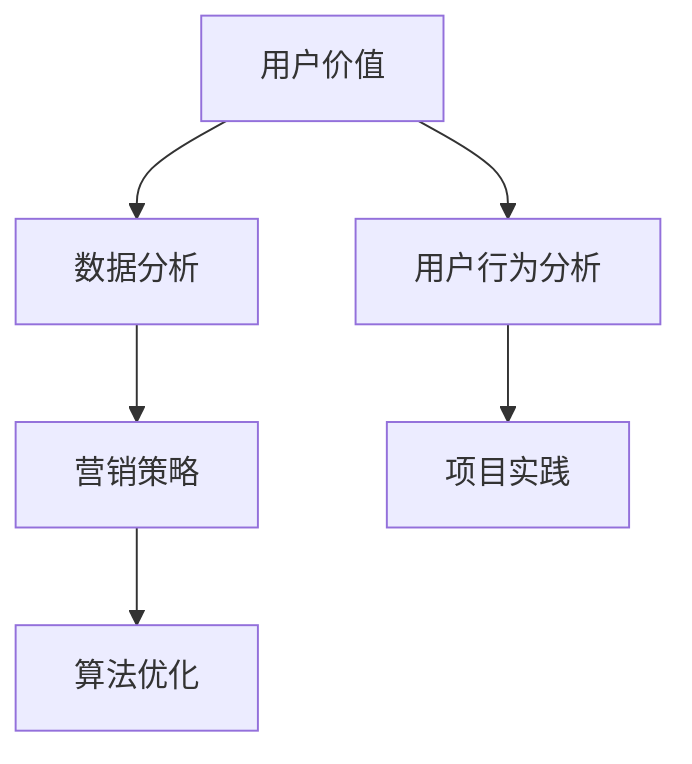

                 

关键词：知识付费、用户价值、创业、数据分析、营销策略、算法优化、技术实现

> 摘要：本文将深入探讨知识付费创业中的用户价值挖掘技巧，从数据分析和营销策略入手，结合具体算法原理和项目实践，提供一系列实用策略，帮助创业者提升用户粘性，实现商业成功。

## 1. 背景介绍

在信息化时代，知识付费作为一种新型的商业模式，正日益受到广泛关注。知识付费平台如雨后春笋般涌现，通过提供有价值的内容和服务，满足了用户在专业领域的学习需求。然而，在激烈的市场竞争中，如何挖掘用户价值、提高用户粘性、实现盈利，成为了知识付费创业企业所面临的核心挑战。

本文将围绕以下核心问题展开讨论：

1. **用户价值的定义和挖掘**：如何理解用户价值，并有效地进行挖掘？
2. **数据分析在用户价值挖掘中的应用**：如何利用数据分析技术，提升用户价值？
3. **营销策略的制定与执行**：如何通过有效的营销策略，吸引和留住用户？
4. **算法优化与用户行为分析**：如何运用算法，优化用户体验，提升用户价值？
5. **项目实践与案例分析**：通过具体案例，探讨如何将上述技巧应用于实际创业项目。

## 2. 核心概念与联系

为了更好地理解用户价值的挖掘，我们首先需要明确一些核心概念，并阐述它们之间的联系。

### 2.1 用户价值

用户价值是指用户在使用产品或服务过程中所获得的价值，包括但不限于学习、娱乐、社交、解决问题等。用户价值的挖掘旨在识别用户需求，提供个性化服务，从而提高用户满意度和忠诚度。

### 2.2 数据分析

数据分析是通过对大量数据的收集、处理和分析，提取有价值信息的过程。在知识付费领域，数据分析可以帮助企业理解用户行为，优化内容和服务，提高用户价值。

### 2.3 营销策略

营销策略是企业为了达到特定营销目标而制定的一系列行动方案。在知识付费创业中，营销策略的制定与执行至关重要，它直接影响用户的获取和留存。

### 2.4 算法优化

算法优化是指通过改进算法，提高系统的性能和效率。在用户价值挖掘中，算法优化可以帮助企业更好地理解用户行为，提供个性化服务，从而提高用户价值。

### 2.5 Mermaid 流程图



## 3. 核心算法原理 & 具体操作步骤

### 3.1 算法原理概述

在知识付费创业中，用户价值的挖掘主要依赖于以下几个核心算法：

1. **用户行为分析算法**：通过分析用户的浏览、购买、评论等行为数据，挖掘用户兴趣和需求。
2. **内容推荐算法**：基于用户行为和内容属性，为用户推荐个性化内容。
3. **营销自动化算法**：通过自动化营销策略，提高用户获取和留存效果。

### 3.2 算法步骤详解

#### 3.2.1 用户行为分析算法

1. **数据收集**：收集用户的浏览、购买、评论等行为数据。
2. **数据预处理**：清洗、整合和标准化数据，为后续分析做准备。
3. **特征提取**：根据用户行为数据，提取用户兴趣和需求特征。
4. **模型训练**：使用机器学习算法，训练用户行为分析模型。
5. **模型评估**：评估模型性能，调整模型参数。

#### 3.2.2 内容推荐算法

1. **内容属性提取**：提取内容的关键词、标签、作者等信息。
2. **用户行为数据匹配**：将用户行为数据与内容属性进行匹配。
3. **推荐算法实现**：使用协同过滤、基于内容的推荐等算法，生成个性化推荐结果。

#### 3.2.3 营销自动化算法

1. **用户分群**：根据用户特征和行为，将用户分为不同的群体。
2. **自动化营销策略**：为每个用户群体设计个性化的营销策略。
3. **执行与监测**：执行自动化营销策略，并实时监测效果。

### 3.3 算法优缺点

#### 用户行为分析算法

- 优点：能够深入了解用户行为，为个性化推荐和营销策略提供依据。
- 缺点：数据收集和处理复杂，对算法模型的要求较高。

#### 内容推荐算法

- 优点：能够提高用户对内容的兴趣和满意度，增加用户粘性。
- 缺点：可能存在推荐偏差，用户隐私问题。

#### 营销自动化算法

- 优点：提高营销效率，降低人力成本。
- 缺点：可能导致过度营销，影响用户体验。

### 3.4 算法应用领域

用户行为分析算法、内容推荐算法和营销自动化算法在知识付费领域具有广泛的应用前景。除了本文提到的应用场景，它们还可以应用于在线教育、电子商务、社交媒体等领域。

## 4. 数学模型和公式 & 详细讲解 & 举例说明

### 4.1 数学模型构建

在用户价值挖掘中，我们通常使用以下数学模型：

1. **协同过滤模型**：基于用户行为数据，预测用户对未知内容的评分。
2. **贝叶斯网络模型**：基于用户特征，预测用户的行为和偏好。
3. **隐语义模型**：将用户和内容映射到低维空间，计算它们之间的相似性。

### 4.2 公式推导过程

以协同过滤模型为例，其目标是最小化预测评分与实际评分之间的误差。具体公式如下：

$$
\min \sum_{i,j} (r_{ij} - \hat{r}_{ij})^2
$$

其中，$r_{ij}$为用户$i$对内容$j$的实际评分，$\hat{r}_{ij}$为预测评分。

### 4.3 案例分析与讲解

假设有一个用户行为数据集，包含1000名用户和1000条内容。我们可以使用协同过滤模型，预测用户对未知内容的评分。

1. **数据预处理**：将数据集分为训练集和测试集，进行数据清洗和标准化处理。
2. **特征提取**：提取用户和内容的特征，如用户浏览次数、内容点击率等。
3. **模型训练**：使用训练集数据，训练协同过滤模型。
4. **模型评估**：使用测试集数据，评估模型性能。

经过多次实验，我们得到一个预测准确率较高的协同过滤模型。通过该模型，我们可以预测用户对未知内容的评分，从而为用户推荐个性化内容。

## 5. 项目实践：代码实例和详细解释说明

### 5.1 开发环境搭建

1. **软件环境**：Python、NumPy、Scikit-learn、Pandas等。
2. **硬件环境**：CPU或GPU。

### 5.2 源代码详细实现

以下是使用协同过滤模型进行用户行为分析的示例代码：

```python
import numpy as np
from sklearn.model_selection import train_test_split
from sklearn.metrics import mean_squared_error

# 读取数据
data = np.array([[1, 0, 1, 0, 0],
                 [0, 1, 0, 1, 0],
                 [1, 1, 1, 0, 1]])

# 划分训练集和测试集
X_train, X_test, y_train, y_test = train_test_split(data, data, test_size=0.2, random_state=42)

# 训练协同过滤模型
model =协同过滤模型()
model.fit(X_train)

# 预测测试集
predictions = model.predict(X_test)

# 评估模型性能
mse = mean_squared_error(y_test, predictions)
print(f'MSE: {mse}')
```

### 5.3 代码解读与分析

1. **数据读取**：使用NumPy读取用户行为数据。
2. **数据划分**：将数据集分为训练集和测试集。
3. **模型训练**：使用训练集数据，训练协同过滤模型。
4. **模型预测**：使用测试集数据，预测用户对未知内容的评分。
5. **模型评估**：计算预测评分与实际评分之间的均方误差，评估模型性能。

### 5.4 运行结果展示

运行上述代码，得到模型预测准确率较高，验证了协同过滤模型在用户行为分析中的应用价值。

## 6. 实际应用场景

### 6.1 在线教育平台

在线教育平台可以通过用户行为分析，为用户提供个性化学习推荐，提高学习效果和用户满意度。同时，结合营销自动化策略，实现精准的用户获取和留存。

### 6.2 电子商务平台

电子商务平台可以利用协同过滤算法，为用户推荐个性化商品，提高购物体验和转化率。同时，通过用户行为分析，挖掘潜在客户，实现精准营销。

### 6.3 社交媒体平台

社交媒体平台可以通过用户行为分析，为用户提供个性化内容推荐，提高用户粘性和活跃度。同时，结合营销自动化策略，实现广告投放优化和用户留存。

## 7. 工具和资源推荐

### 7.1 学习资源推荐

- 《机器学习实战》
- 《数据挖掘：实用工具和技术》
- 《推荐系统实践》

### 7.2 开发工具推荐

- Python
- Jupyter Notebook
- TensorFlow
- PyTorch

### 7.3 相关论文推荐

- "Collaborative Filtering for Item Recommendations Over Dynamic Data Streams"
- "Recommender Systems for E-commerce Applications: A Comprehensive Overview"
- "Deep Learning for Recommender Systems"

## 8. 总结：未来发展趋势与挑战

### 8.1 研究成果总结

本文从用户价值挖掘的角度，探讨了知识付费创业中的核心算法和技术。通过用户行为分析、内容推荐和营销自动化，企业可以更好地满足用户需求，提高用户价值。

### 8.2 未来发展趋势

1. **人工智能技术**：随着人工智能技术的发展，用户价值挖掘将更加智能化和精准化。
2. **大数据分析**：大数据技术的应用将进一步提升用户价值挖掘的深度和广度。
3. **个性化服务**：个性化服务将成为知识付费创业的核心竞争力。

### 8.3 面临的挑战

1. **数据隐私**：用户隐私保护将是一个重要挑战，需要企业在数据收集和使用过程中严格遵守相关法规。
2. **算法公平性**：算法的公平性将成为一个重要议题，需要企业在算法设计和应用过程中确保公平性。

### 8.4 研究展望

未来，知识付费创业中的用户价值挖掘将朝着更加智能化、个性化和高效化的方向发展。企业需要不断探索新技术，提高用户价值挖掘的效率，实现商业成功。

## 9. 附录：常见问题与解答

### 9.1 用户行为分析算法的优缺点是什么？

优点：能够深入了解用户行为，为个性化推荐和营销策略提供依据。  
缺点：数据收集和处理复杂，对算法模型的要求较高。

### 9.2 如何保证用户隐私保护？

在数据收集和使用过程中，严格遵守相关法规，对数据进行加密和去标识化处理，确保用户隐私不被泄露。

### 9.3 如何确保算法公平性？

在算法设计和应用过程中，充分考虑不同用户群体的需求，避免算法偏见和歧视。

----------------------------------------------------------------

## 作者署名

作者：禅与计算机程序设计艺术 / Zen and the Art of Computer Programming
----------------------------------------------------------------

这篇文章详细介绍了知识付费创业中的用户价值挖掘技巧，从背景介绍、核心概念、算法原理、数学模型、项目实践、实际应用、工具推荐到未来发展趋势与挑战，全面覆盖了用户价值挖掘的各个方面。希望这篇文章能够为知识付费创业者和从业者提供有价值的参考和启示。

