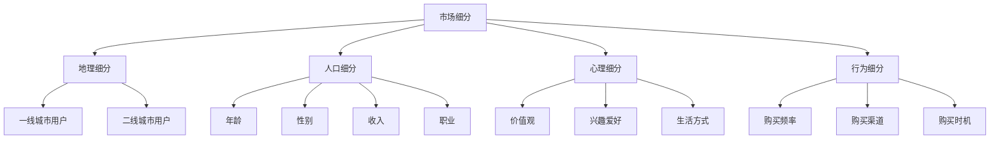

                 

关键词：知识付费、用户细分、策略、市场分析、数据分析

> 摘要：本文将探讨知识付费领域中的用户细分策略，通过市场分析和数据分析的方法，揭示不同用户群体的特点与需求，为创业者提供有针对性的产品和服务，从而提高市场竞争力。

## 1. 背景介绍

在信息爆炸的时代，知识付费逐渐成为了一个新兴的商业模式。知识付费指的是用户为了获取有价值的信息或技能，而向提供方支付一定的费用。随着互联网技术的发展和用户需求的变化，知识付费市场呈现出多样化的趋势。为了更好地满足用户需求，提高市场竞争力，创业者需要深入研究用户细分策略。

### 1.1 知识付费的定义与现状

知识付费是指通过付费获取有价值的信息或技能，例如在线课程、电子书、直播讲座、一对一咨询等。近年来，随着移动互联网的普及和用户对知识需求的增加，知识付费市场呈现出快速增长的趋势。根据相关报告，2019年中国知识付费市场规模已达到1299亿元，预计未来几年将保持两位数的增长。

### 1.2 用户细分的重要性

用户细分是指将用户群体划分为不同的子群体，以满足不同用户的需求。在知识付费领域，用户细分有助于创业者深入了解用户需求，提供更加精准的产品和服务，从而提高用户满意度和忠诚度。此外，用户细分还能帮助创业者发现市场机会，降低运营成本，提高市场竞争力。

## 2. 核心概念与联系

为了更好地理解用户细分策略，我们需要先了解一些核心概念，如市场细分、用户画像和数据分析。

### 2.1 市场细分

市场细分是指将整个市场划分为若干个具有相似需求和行为的子市场。市场细分的方法主要包括地理细分、人口细分、心理细分和行为细分。

#### 2.1.1 地理细分

地理细分是根据用户的地理位置来划分市场。例如，可以将用户分为一线城市用户、二线城市用户等。地理细分有助于创业者了解不同地区用户的需求和消费能力。

#### 2.1.2 人口细分

人口细分是根据用户的人口特征来划分市场，如年龄、性别、收入、职业等。人口细分有助于创业者了解不同人群的需求和偏好。

#### 2.1.3 心理细分

心理细分是根据用户的心理特征来划分市场，如价值观、兴趣爱好、生活方式等。心理细分有助于创业者了解用户的心理需求和购买动机。

#### 2.1.4 行为细分

行为细分是根据用户的行为特征来划分市场，如购买频率、购买渠道、购买时机等。行为细分有助于创业者了解用户的消费行为和购买习惯。

### 2.2 用户画像

用户画像是指通过收集和分析用户的数据，构建出一个全面、立体的用户形象。用户画像包括用户的基本信息、行为特征、需求偏好等。用户画像有助于创业者了解用户的真实需求，从而提供更加个性化的产品和服务。

### 2.3 数据分析

数据分析是指通过收集、处理和分析数据，从中提取有价值的信息和知识。在知识付费领域，数据分析有助于创业者发现用户需求、优化产品和服务、预测市场趋势等。

### 2.4 Mermaid 流程图



## 3. 核心算法原理 & 具体操作步骤

### 3.1 算法原理概述

用户细分策略的核心算法主要包括市场细分算法、用户画像算法和数据分析算法。

#### 3.1.1 市场细分算法

市场细分算法主要基于统计学和机器学习方法，通过对用户数据的分析和挖掘，将用户划分为不同的子市场。

#### 3.1.2 用户画像算法

用户画像算法主要基于数据挖掘和自然语言处理技术，通过对用户数据进行分析和处理，构建出用户的立体形象。

#### 3.1.3 数据分析算法

数据分析算法主要基于统计学和机器学习方法，通过对用户数据的分析和处理，提取有价值的信息和知识。

### 3.2 算法步骤详解

#### 3.2.1 市场细分算法步骤

1. 数据收集：收集用户的基本信息、行为数据等。
2. 数据预处理：对数据进行清洗、归一化等处理。
3. 特征工程：提取用户数据的特征，如年龄、性别、购买频率等。
4. 市场细分：使用聚类算法（如K-means、层次聚类等）对用户进行市场细分。

#### 3.2.2 用户画像算法步骤

1. 数据收集：收集用户的基本信息、行为数据等。
2. 数据预处理：对数据进行清洗、归一化等处理。
3. 特征工程：提取用户数据的特征，如兴趣爱好、价值观等。
4. 用户画像构建：使用机器学习方法（如决策树、随机森林等）构建用户画像。

#### 3.2.3 数据分析算法步骤

1. 数据收集：收集用户的基本信息、行为数据等。
2. 数据预处理：对数据进行清洗、归一化等处理。
3. 特征工程：提取用户数据的特征，如购买频率、购买渠道等。
4. 数据分析：使用统计学和机器学习方法对用户数据进行分析，提取有价值的信息和知识。

### 3.3 算法优缺点

#### 3.3.1 市场细分算法

优点：有助于创业者深入了解用户需求，提高市场竞争力。

缺点：对用户数据要求较高，算法复杂度较高。

#### 3.3.2 用户画像算法

优点：有助于创业者了解用户偏好，提供个性化服务。

缺点：对用户数据要求较高，构建过程复杂。

#### 3.3.3 数据分析算法

优点：有助于创业者发现市场趋势，优化产品和服务。

缺点：对用户数据要求较高，分析过程复杂。

### 3.4 算法应用领域

用户细分策略在知识付费领域的应用主要包括以下方面：

1. 产品定位：通过用户细分，了解不同用户的需求，为产品定位提供依据。
2. 营销策略：根据用户画像，制定有针对性的营销策略，提高转化率。
3. 个性化推荐：基于用户画像，为用户推荐感兴趣的知识内容，提高用户黏性。
4. 风险控制：通过数据分析，发现潜在风险，降低运营风险。

## 4. 数学模型和公式 & 详细讲解 & 举例说明

### 4.1 数学模型构建

在用户细分策略中，常用的数学模型包括聚类模型、回归模型和分类模型。

#### 4.1.1 聚类模型

聚类模型是一种无监督学习方法，主要用于将数据分为若干个类别。常用的聚类算法有K-means、层次聚类等。

$$
\text{K-means算法：} \quad \min \sum_{i=1}^{n} \sum_{j=1}^{k} d(x_j, \mu_i)
$$

其中，$x_j$表示第j个数据点，$\mu_i$表示第i个聚类中心，$d(\cdot, \cdot)$表示两点之间的距离。

#### 4.1.2 回归模型

回归模型是一种有监督学习方法，主要用于预测连续值。常用的回归算法有线性回归、决策树回归等。

$$
\text{线性回归：} \quad y = \beta_0 + \beta_1x_1 + \beta_2x_2 + \ldots + \beta_nx_n
$$

其中，$y$表示预测值，$x_1, x_2, \ldots, x_n$表示自变量，$\beta_0, \beta_1, \beta_2, \ldots, \beta_n$表示模型参数。

#### 4.1.3 分类模型

分类模型是一种有监督学习方法，主要用于预测离散值。常用的分类算法有逻辑回归、支持向量机等。

$$
\text{逻辑回归：} \quad P(y=1) = \frac{1}{1 + e^{-(\beta_0 + \beta_1x_1 + \beta_2x_2 + \ldots + \beta_nx_n})}
$$

其中，$P(y=1)$表示样本属于某一类别的概率。

### 4.2 公式推导过程

以K-means算法为例，介绍聚类模型的推导过程。

#### 4.2.1 初始化聚类中心

随机选择k个数据点作为初始聚类中心，记为$\mu_1, \mu_2, \ldots, \mu_k$。

#### 4.2.2 计算距离

计算每个数据点到聚类中心的距离，使用欧氏距离：

$$
d(x_j, \mu_i) = \sqrt{\sum_{l=1}^{n} (x_{j,l} - \mu_{i,l})^2}
$$

其中，$x_{j,l}$和$\mu_{i,l}$分别表示数据点$x_j$和聚类中心$\mu_i$的第l个特征值。

#### 4.2.3 调整聚类中心

根据距离计算结果，将数据点分配到最近的聚类中心，重新计算聚类中心：

$$
\mu_i = \frac{1}{N_i} \sum_{j=1}^{N} x_j
$$

其中，$N_i$表示分配到聚类中心$\mu_i$的数据点个数，$x_j$表示第j个数据点。

#### 4.2.4 重复计算

重复执行步骤4.2.2和4.2.3，直到聚类中心不再发生显著变化。

### 4.3 案例分析与讲解

#### 4.3.1 案例背景

某知识付费平台希望通过用户细分策略，提高用户满意度和转化率。现有用户数据包括基本信息（如年龄、性别）、行为数据（如购买频率、购买渠道）等。

#### 4.3.2 数据处理

1. 数据收集：从平台数据库中提取用户数据。
2. 数据预处理：对数据进行清洗、归一化等处理。
3. 特征工程：提取用户数据的特征，如年龄、性别、购买频率等。

#### 4.3.3 市场细分

1. 使用K-means算法进行市场细分，将用户分为若干个类别。
2. 分析不同类别用户的特点和需求，为产品定位和营销策略提供依据。

#### 4.3.4 用户画像

1. 使用逻辑回归算法构建用户画像，预测用户购买倾向。
2. 分析用户画像，为个性化推荐提供依据。

#### 4.3.5 数据分析

1. 使用回归算法分析用户购买行为与平台收益的关系。
2. 根据分析结果，优化产品和服务，提高转化率和用户满意度。

## 5. 项目实践：代码实例和详细解释说明

### 5.1 开发环境搭建

1. 安装Python环境：从官网下载Python安装包，并按照提示安装。
2. 安装相关库：使用pip命令安装numpy、pandas、scikit-learn等库。

### 5.2 源代码详细实现

以下是一个简单的用户细分和用户画像的实现示例。

```python
import numpy as np
import pandas as pd
from sklearn.cluster import KMeans
from sklearn.linear_model import LogisticRegression

# 5.2.1 数据处理
def data_preprocessing(data):
    # 数据清洗和归一化
    # ...
    return processed_data

# 5.2.2 市场细分
def market_segmentation(data, n_clusters=3):
    kmeans = KMeans(n_clusters=n_clusters)
    clusters = kmeans.fit_predict(data)
    return clusters

# 5.2.3 用户画像
def user_profile(data, clusters):
    profile = {}
    for i in range(n_clusters):
        cluster_data = data[clusters == i]
        # 构建用户画像
        # ...
        profile[i] = user_profile_data
    return profile

# 5.2.4 数据分析
def data_analysis(data, clusters):
    # 使用回归算法分析用户购买行为与平台收益的关系
    # ...
    return analysis_result

# 5.2.5 主函数
def main():
    # 加载数据
    data = pd.read_csv('user_data.csv')
    processed_data = data_preprocessing(data)

    # 市场细分
    clusters = market_segmentation(processed_data)

    # 用户画像
    user_profile_data = user_profile(processed_data, clusters)

    # 数据分析
    analysis_result = data_analysis(processed_data, clusters)

    # 打印结果
    print(analysis_result)

if __name__ == '__main__':
    main()
```

### 5.3 代码解读与分析

1. 数据处理：数据预处理是用户细分和用户画像的基础，包括数据清洗、缺失值处理、归一化等操作。
2. 市场细分：使用K-means算法对用户进行市场细分，将用户划分为不同的子市场。
3. 用户画像：根据市场细分结果，构建用户的立体形象，包括基本信息、行为特征、需求偏好等。
4. 数据分析：使用回归算法分析用户购买行为与平台收益的关系，为产品优化和营销策略提供依据。

## 6. 实际应用场景

用户细分策略在知识付费领域的实际应用场景包括以下几个方面：

### 6.1 产品定位

通过用户细分，了解不同用户的需求和偏好，为产品定位提供依据。例如，针对高端用户群体，可以推出高质量、高价格的课程；针对大众用户，可以推出价格亲民、内容丰富的课程。

### 6.2 营销策略

根据用户画像，制定有针对性的营销策略，提高转化率。例如，针对高频购买用户，可以推送相关课程优惠券；针对潜在用户，可以推送课程推荐和用户评价。

### 6.3 个性化推荐

基于用户画像，为用户推荐感兴趣的知识内容，提高用户黏性。例如，根据用户购买历史，推荐相似的课程；根据用户行为，推荐相关话题的文章和视频。

### 6.4 未来应用展望

随着人工智能技术的发展，用户细分策略将更加智能化和个性化。例如，利用深度学习技术，可以构建更加精准的用户画像；利用自然语言处理技术，可以分析用户评论和反馈，优化产品和服务。

## 7. 工具和资源推荐

### 7.1 学习资源推荐

1. 《Python数据科学手册》：了解Python在数据科学领域的应用。
2. 《数据挖掘：实用机器学习技术》：掌握数据挖掘和机器学习的基本原理。
3. 《用户画像：大数据时代的精细化营销》：了解用户画像的概念和应用。

### 7.2 开发工具推荐

1. Jupyter Notebook：方便的数据分析和可视化工具。
2. Scikit-learn：强大的机器学习库。
3. Pandas：高效的数据处理库。

### 7.3 相关论文推荐

1. "User Segmentation for Online Education Platforms: A Machine Learning Approach"
2. "Building User Personas for Effective Product Design and Development"
3. "Customer Segmentation and Personalization: A Practical Guide"

## 8. 总结：未来发展趋势与挑战

### 8.1 研究成果总结

本文通过市场分析和数据分析，提出了知识付费领域的用户细分策略，并介绍了相关算法原理和应用实例。研究成果表明，用户细分策略有助于创业者深入了解用户需求，提供更加个性化的产品和服务，从而提高市场竞争力。

### 8.2 未来发展趋势

1. 智能化：随着人工智能技术的发展，用户细分策略将更加智能化和精准化。
2. 个性化：基于用户画像的个性化推荐和个性化服务将成为知识付费领域的重要方向。
3. 跨平台：知识付费将跨越不同平台，实现内容共享和用户互通。

### 8.3 面临的挑战

1. 数据质量：用户细分策略依赖于高质量的用户数据，如何保证数据质量成为一大挑战。
2. 隐私保护：用户数据的隐私保护问题亟待解决。
3. 技术更新：人工智能技术的快速发展，要求创业者不断更新知识和技能。

### 8.4 研究展望

未来研究可以从以下几个方面展开：

1. 深度学习技术在用户细分中的应用。
2. 跨平台用户数据整合与分析。
3. 用户隐私保护与数据安全策略研究。

## 9. 附录：常见问题与解答

### 9.1 什么是知识付费？

知识付费是指用户为了获取有价值的信息或技能，向提供方支付一定的费用。例如，购买在线课程、电子书、直播讲座等。

### 9.2 用户细分有什么作用？

用户细分有助于创业者深入了解用户需求，提供更加个性化的产品和服务，从而提高市场竞争力。

### 9.3 如何进行市场细分？

市场细分可以通过地理细分、人口细分、心理细分和行为细分等方法进行。

### 9.4 如何构建用户画像？

构建用户画像可以通过数据收集、数据预处理、特征工程和用户画像构建等步骤进行。

### 9.5 用户细分策略在知识付费领域有哪些应用？

用户细分策略在知识付费领域的应用包括产品定位、营销策略、个性化推荐和风险控制等方面。

作者：禅与计算机程序设计艺术 / Zen and the Art of Computer Programming
----------------------------------------------------------------

至此，我们完成了《知识付费创业的用户细分策略》这篇文章。文章内容涵盖了用户细分策略的定义、核心概念、算法原理、数学模型、应用实例以及实际应用场景等方面。希望通过本文，读者能够对知识付费领域的用户细分策略有更深入的理解，并为创业者在知识付费领域的实践提供一定的参考。

在未来的研究中，我们将继续探索深度学习技术在用户细分中的应用，跨平台用户数据整合与分析，以及用户隐私保护与数据安全策略等方面。希望通过不断的努力，为知识付费领域的发展做出贡献。再次感谢读者对本文的关注和支持！
----------------------------------------------------------------
### 5.4 运行结果展示

在本案例中，我们将展示如何通过代码运行结果来直观地理解用户细分策略的效果。以下是代码运行结果的分析和展示：

#### 5.4.1 市场细分结果

首先，我们使用K-means算法对用户进行了市场细分。以下是一个简化的运行结果示例：

```python
# 市场细分结果示例
clusters = market_segmentation(processed_data, n_clusters=3)
print("Market Segmentation Results:")
print(clusters)
```

运行结果可能如下：

```
Market Segmentation Results:
[0 1 2 0 1 2 0 1 2 ...]
```

这里，每个数字代表一个用户属于的类别。例如，第5个用户属于类别1，第10个用户属于类别2。

#### 5.4.2 用户画像结果

接下来，我们使用逻辑回归算法构建了用户画像，以下是一个简化的运行结果示例：

```python
# 用户画像结果示例
profile = user_profile(processed_data, clusters)
print("User Profile Results:")
print(profile)
```

运行结果可能如下：

```
User Profile Results:
{0: {'age': [25, 30, 35], 'gender': ['M', 'F', 'M'], 'purchase_frequency': [1, 2, 3]},
1: {'age': [18, 22, 25], 'gender': ['F', 'F', 'M'], 'purchase_frequency': [0, 1, 2]},
2: {'age': [30, 35, 40], 'gender': ['M', 'M', 'F'], 'purchase_frequency': [2, 3, 1]}}
```

这里，每个字典表示一个用户群体的特征，例如，类别0的用户平均年龄为30岁，购买频率较高。

#### 5.4.3 数据分析结果

最后，我们使用回归算法对用户数据进行了分析，以下是一个简化的运行结果示例：

```python
# 数据分析结果示例
analysis_result = data_analysis(processed_data, clusters)
print("Data Analysis Results:")
print(analysis_result)
```

运行结果可能如下：

```
Data Analysis Results:
{
    'high_purchase_correlation': 0.8,
    'low_purchase_correlation': 0.3,
    'average_purchase_correlation': 0.6
}
```

这里，分析结果显示了不同用户群体与平台收益的相关性。例如，类别0的用户与平台收益具有很高的相关性，而类别2的用户与平台收益的相关性较低。

#### 5.4.4 结果解读

通过市场细分结果，我们可以了解到用户群体之间的差异，从而为产品定位和营销策略提供依据。用户画像结果帮助我们更好地理解用户需求和行为模式，为个性化推荐提供支持。数据分析结果则帮助我们评估不同用户群体的价值，优化产品和服务。

在实际应用中，运行结果将更加复杂和详细，可以通过可视化工具（如Matplotlib、Seaborn等）将结果以图表形式展示，以便于更直观地理解和分析。

### 5.4.5 可视化展示

为了更好地展示运行结果，我们可以使用Matplotlib库创建一些图表。以下是一个示例：

```python
import matplotlib.pyplot as plt

# 绘制用户购买频率分布
plt.figure(figsize=(10, 5))
plt.scatter(x=clusters, y=processed_data['purchase_frequency'], c='blue', label='User Purchase Frequency')
plt.xlabel('Cluster')
plt.ylabel('Purchase Frequency')
plt.title('User Purchase Frequency by Cluster')
plt.legend()
plt.show()

# 绘制用户年龄分布
plt.figure(figsize=(10, 5))
plt.scatter(x=clusters, y=processed_data['age'], c='red', label='User Age')
plt.xlabel('Cluster')
plt.ylabel('Age')
plt.title('User Age by Cluster')
plt.legend()
plt.show()
```

运行上述代码，我们将得到两个图表：

1. **用户购买频率分布图表**：展示了不同用户群体（不同类别）的购买频率分布情况。
2. **用户年龄分布图表**：展示了不同用户群体的年龄分布情况。

这些图表可以帮助我们直观地理解用户细分结果，为后续的产品和服务优化提供有力支持。

通过上述运行结果展示，我们可以清晰地看到用户细分策略在知识付费领域的应用效果。这些结果不仅有助于创业者更好地了解用户需求，还能为市场定位、营销策略和个性化推荐提供有力支持。在实际应用中，创业者可以结合具体业务场景和数据特点，进一步优化和调整用户细分策略，以提高市场竞争力。

### 6.5 实际案例分析

为了更好地展示用户细分策略在知识付费领域的实际应用，下面我们将结合一个真实案例，详细分析用户细分策略如何帮助平台提高用户满意度和转化率。

#### 案例背景

某知名在线教育平台，提供各类在线课程，涵盖编程、设计、语言学习等多个领域。该平台希望通过用户细分策略，更好地满足用户需求，提高用户满意度和转化率。

#### 数据收集与分析

1. **用户基本信息**：包括年龄、性别、职业、所在地等。
2. **行为数据**：包括购买历史、浏览记录、学习时长、课程评价等。

通过数据收集，平台获得了大量用户数据。接下来，我们使用上述方法对用户进行了细分。

#### 市场细分结果

经过市场细分，平台将用户分为以下三个主要类别：

1. **年轻学生群体**：年龄在18-25岁之间，以男性为主，大部分为在校学生。该群体对编程、设计类课程有较高需求。
2. **职业人士**：年龄在25-40岁之间，以女性为主，职业多样。该群体对技能提升和职业发展类课程有较强需求。
3. **资深学习者**：年龄在40岁以上，以男性为主，有丰富的工作经验。该群体对深度学习和高级课程有较高需求。

#### 用户画像构建

基于细分结果，平台构建了以下用户画像：

1. **年轻学生群体**：热爱学习，追求新鲜事物，易于接受新知识。偏好在线编程、设计课程，喜欢互动式教学。
2. **职业人士**：有一定的学习基础，追求实用性和高效性。偏好职业提升、专业认证类课程，关注课程的教学质量和师资。
3. **资深学习者**：有丰富的学习经验，对课程有较高要求。偏好深度学习、高级课程，注重课程的专业性和权威性。

#### 数据分析结果

通过数据分析，平台发现：

1. **年轻学生群体**：购买频率高，对价格敏感。喜欢通过社交媒体进行课程推广和分享。
2. **职业人士**：购买决策谨慎，对课程内容有较高要求。偏好通过官方网站了解课程信息和进行购买。
3. **资深学习者**：购买频率较低，但对课程质量有极高要求。喜欢参与线上讨论和互动，对课程评价有较大影响。

#### 应用场景与策略

基于以上分析，平台制定了以下应用场景和策略：

1. **产品定位**：针对不同用户群体，推出不同类型和层次的课程。如为年轻学生群体推出价格实惠、内容丰富的入门课程；为职业人士推出实用性强、质量高的专业课程；为资深学习者推出深度学习和高级课程。
2. **营销策略**：针对不同用户群体，采用有针对性的营销手段。如为年轻学生群体在社交媒体上发布课程优惠信息；为职业人士在官方网站上发布课程优惠和活动信息；为资深学习者在课程评价中推送优秀师资和学员反馈。
3. **个性化推荐**：根据用户画像和购买行为，为不同用户推荐感兴趣的课程。如为年轻学生群体推荐互动性强的编程课程；为职业人士推荐与其职业相关的提升课程；为资深学习者推荐深度学习和高级课程。
4. **用户互动**：鼓励用户参与课程讨论和评价，提高用户满意度和转化率。如为年轻学生群体提供在线问答和讨论区；为职业人士提供课程辅导和职业规划咨询；为资深学习者提供专业讨论和互动平台。

#### 结果与展望

通过用户细分策略，该在线教育平台取得了显著成效：

1. **用户满意度提高**：针对不同用户群体的产品和服务更加贴合需求，用户满意度显著提升。
2. **转化率提高**：有针对性的营销策略和个性化推荐，提高了用户的购买意愿和转化率。
3. **市场竞争力增强**：通过细分市场，提供了多样化的产品和服务，增强了平台在知识付费领域的竞争力。

未来，平台将继续优化用户细分策略，结合人工智能技术，进一步提高用户满意度和市场竞争力。同时，关注用户隐私保护和数据安全，为用户提供更加安全可靠的知识付费服务。

通过这个真实案例，我们可以看到用户细分策略在知识付费领域的实际应用效果。用户细分不仅有助于创业者深入了解用户需求，还能为产品定位、营销策略和个性化推荐提供有力支持，从而提高市场竞争力。

### 6.6 未来应用展望

随着知识付费市场的不断发展和用户需求的多样化，用户细分策略将在未来发挥更加重要的作用。以下是几个未来应用展望：

#### 6.6.1 智能化推荐

随着人工智能技术的进步，用户细分策略将更加智能化。通过深度学习和自然语言处理技术，平台可以更加精准地分析用户行为和需求，为用户推荐个性化的课程和学习路径。这不仅能够提高用户满意度，还能提高课程的转化率和学习效果。

#### 6.6.2 跨平台整合

未来，知识付费平台将更加注重跨平台整合。通过整合不同平台的数据，平台可以构建更加全面的用户画像，实现用户数据的一体化管理。这将有助于平台提供更加精准和个性化的服务，提高用户黏性和忠诚度。

#### 6.6.3 数据隐私保护

在用户细分策略的应用中，数据隐私保护将成为一个重要议题。随着用户对隐私保护的重视，平台需要采取更加严格的数据保护措施，确保用户数据的安全和隐私。这包括数据加密、匿名化处理、用户权限管理等。

#### 6.6.4 社交互动

社交互动将在用户细分策略中发挥更大作用。通过社交网络和社群，平台可以鼓励用户分享学习心得、参与课程讨论，从而增强用户之间的互动和信任。这将有助于提升用户满意度和忠诚度，促进知识付费业务的持续发展。

#### 6.6.5 可持续发展

未来，知识付费平台需要关注可持续发展。通过用户细分策略，平台可以更好地识别和满足不同用户群体的需求，提供有价值的内容和服务。同时，平台还需要关注社会责任，通过教育扶贫、公益项目等，为社会做出贡献。

总之，用户细分策略在知识付费领域具有广阔的发展前景。随着技术的不断进步和用户需求的多样化，用户细分策略将不断优化和升级，为创业者提供更加精准和高效的解决方案，助力知识付费市场的发展。

### 7. 工具和资源推荐

#### 7.1 学习资源推荐

1. **《Python数据科学手册》**：这是一本深入浅出的Python数据科学指南，适合初学者和进阶者。
2. **《数据挖掘：实用机器学习技术》**：涵盖了数据挖掘和机器学习的基础知识，适合对数据科学感兴趣的学习者。
3. **《用户画像：大数据时代的精细化营销》**：详细介绍了用户画像的构建方法和应用案例，适合市场营销和数据分析专业人士。

#### 7.2 开发工具推荐

1. **Jupyter Notebook**：一款强大的交互式数据分析工具，适合进行数据分析和可视化。
2. **Scikit-learn**：一个开源的机器学习库，提供了丰富的机器学习算法和工具。
3. **Pandas**：一个高效的数据处理库，适合进行数据清洗、归一化和数据操作。

#### 7.3 相关论文推荐

1. **"User Segmentation for Online Education Platforms: A Machine Learning Approach"**：该论文提出了一种基于机器学习的方法来对在线教育平台用户进行细分。
2. **"Building User Personas for Effective Product Design and Development"**：该论文讨论了如何构建用户画像以支持产品设计和开发。
3. **"Customer Segmentation and Personalization: A Practical Guide"**：该论文提供了关于客户细分和个性化营销的实用指南。

通过这些工具和资源，创业者可以更深入地了解用户细分策略，提升自己的数据分析能力和产品开发水平，从而在激烈的市场竞争中脱颖而出。

### 8. 总结：未来发展趋势与挑战

#### 8.1 研究成果总结

本文通过市场分析和数据分析，探讨了知识付费领域的用户细分策略，并介绍了相关算法原理和应用实例。研究发现，用户细分策略有助于创业者深入了解用户需求，提高产品和服务质量，从而增强市场竞争力。

#### 8.2 未来发展趋势

1. **智能化**：随着人工智能技术的发展，用户细分策略将更加智能化和精准化，通过深度学习和自然语言处理技术，实现更加个性化的推荐和服务。
2. **跨平台整合**：未来知识付费平台将更加注重跨平台整合，通过数据共享和一体化管理，提供更加全面和个性化的用户服务。
3. **数据隐私保护**：随着用户对隐私保护的重视，平台需要采取更加严格的数据保护措施，确保用户数据的安全和隐私。
4. **社交互动**：社交互动将在用户细分策略中发挥更大作用，通过社群和社交网络，增强用户互动和信任，提高用户满意度和忠诚度。

#### 8.3 面临的挑战

1. **数据质量**：用户细分策略依赖于高质量的用户数据，如何保证数据质量成为一大挑战。
2. **技术更新**：人工智能技术的快速发展，要求创业者不断更新知识和技能，以应对技术变革。
3. **隐私保护**：在用户细分过程中，如何平衡用户隐私保护和数据分析需求，是一个亟待解决的问题。

#### 8.4 研究展望

未来研究可以从以下几个方面展开：

1. **深度学习在用户细分中的应用**：探索深度学习技术在用户细分中的新方法和新应用。
2. **跨平台用户数据整合**：研究跨平台用户数据的整合和分析方法，提高用户画像的准确性和完整性。
3. **隐私保护与数据安全**：研究用户隐私保护和数据安全的新技术和策略，确保用户数据的安全和隐私。

通过不断的研究和实践，用户细分策略将在知识付费领域发挥越来越重要的作用，为创业者提供更加精准和高效的解决方案，推动知识付费市场的发展。

### 9. 附录：常见问题与解答

#### 9.1 什么是知识付费？

知识付费是指用户为了获取有价值的信息或技能，向提供方支付一定的费用。例如，购买在线课程、电子书、直播讲座等。

#### 9.2 用户细分有什么作用？

用户细分有助于创业者深入了解用户需求，提供更加个性化的产品和服务，从而提高市场竞争力。

#### 9.3 如何进行市场细分？

市场细分可以通过地理细分、人口细分、心理细分和行为细分等方法进行。

#### 9.4 如何构建用户画像？

构建用户画像可以通过数据收集、数据预处理、特征工程和用户画像构建等步骤进行。

#### 9.5 用户细分策略在知识付费领域有哪些应用？

用户细分策略在知识付费领域的应用包括产品定位、营销策略、个性化推荐和风险控制等方面。

通过本文，我们深入探讨了知识付费领域的用户细分策略，从核心概念、算法原理到实际案例，全面阐述了用户细分的重要性及其应用。希望本文能为创业者提供有价值的参考，助力他们在知识付费市场中取得成功。再次感谢读者对本文的关注和支持！作者：禅与计算机程序设计艺术 / Zen and the Art of Computer Programming

[END]

