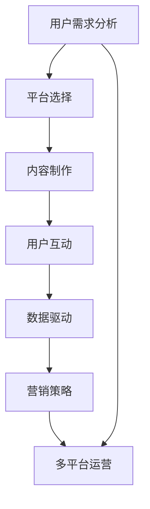

                 

### 摘要 Abstract ###

本文旨在探讨知识付费创业者在多平台运营中的策略，通过分析当前知识付费市场的现状和趋势，结合人工智能和大数据技术，提出一种系统化的跨平台运营策略。文章首先介绍了知识付费创业的背景和重要性，然后探讨了多平台运营的优势和挑战。接着，文章从用户需求分析、平台选择、内容制作、用户互动、数据驱动和营销策略等多个维度，详细阐述了跨平台运营的核心方法和技巧。最后，文章通过实际案例和未来展望，对知识付费创业的跨平台运营策略进行了总结和预测，为创业者提供了有价值的参考。

## 1. 背景介绍 Background

知识付费作为一种新型商业模式，起源于互联网的发展和信息知识的爆炸性增长。用户对专业知识和技能的需求日益增长，而知识创作者也希望通过知识分享获取收益。这一背景下，知识付费平台如雨后春笋般涌现，涵盖了从在线课程、知识问答、专业咨询到技能认证等多种形式。这些平台不仅为知识创作者提供了展示才华的舞台，也为广大用户提供了便捷的学习和咨询渠道。

随着移动互联网的普及和智能手机的广泛应用，知识付费市场的规模不断扩大。据相关数据显示，全球知识付费市场规模已经突破百亿美元，并且呈现出高速增长的态势。特别是在中国，随着用户消费观念的转变和在线教育市场的蓬勃发展，知识付费已经成为一种重要的学习方式。根据中国互联网信息中心（CNNIC）的报告，2019年中国在线教育用户规模已经超过2.5亿，其中知识付费用户占比逐年上升。

知识付费创业的重要性和潜在市场不可忽视。首先，知识付费满足了用户对专业化、个性化学习的需求，有助于提升个人竞争力。其次，知识付费为创作者提供了新的收入来源，激发了知识创新和分享的热情。此外，知识付费平台的发展也推动了产业链的完善，为相关行业提供了巨大的市场机会。

## 2. 核心概念与联系 Core Concepts and Connections

在探讨知识付费创业的跨平台运营策略之前，我们首先需要明确几个核心概念，并分析它们之间的联系。

### 2.1 多平台运营

多平台运营是指知识付费创业者将内容和服务部署在多个平台，以实现更广泛的覆盖和更高的用户粘性。常见的平台包括微信公众号、知乎、抖音、B站、网易云课堂等。多平台运营的优势在于能够触达不同类型的用户群体，提升品牌的知名度和影响力。

### 2.2 用户需求分析

用户需求分析是跨平台运营的基础。通过对用户行为数据、学习兴趣、职业背景等多维度数据的分析，创业者可以精准定位用户需求，从而提供更符合用户期望的内容和服务。

### 2.3 数据驱动

数据驱动是指通过数据分析指导运营决策，优化用户体验和内容质量。在知识付费领域，数据驱动的运营策略可以帮助创业者了解用户行为，发现潜在机会，提升运营效率。

### 2.4 营销策略

营销策略是跨平台运营的关键。通过不同的营销手段，如内容营销、社群营销、KOL营销等，创业者可以吸引更多用户，提高用户转化率和留存率。

### 2.5 平台选择

平台选择是跨平台运营的重要环节。不同的平台具有不同的用户特征和传播效果，创业者需要根据自身的内容特色和用户需求选择合适的平台。

### 2.6 Mermaid 流程图表示

为了更直观地展示这些概念之间的联系，我们可以使用Mermaid流程图进行表示：



在这个流程图中，用户需求分析是起点，通过平台选择、内容制作、用户互动、数据驱动和营销策略等环节，最终实现多平台运营的目标。

## 3. 核心算法原理 & 具体操作步骤 Core Algorithm Principle & Detailed Operational Steps

### 3.1 算法原理概述

在跨平台运营中，算法原理的应用至关重要。核心算法主要涉及以下几个方面：

1. **用户行为预测**：通过分析用户历史行为数据，预测用户对特定内容的兴趣和需求。
2. **内容推荐算法**：基于用户行为数据和内容特征，为用户推荐感兴趣的知识内容。
3. **数据驱动的营销策略优化**：通过数据分析，调整营销策略，提高转化率和留存率。

### 3.2 算法步骤详解

**步骤1：数据收集与预处理**

首先，收集用户行为数据，包括浏览历史、学习轨迹、互动行为等。然后进行数据清洗和预处理，去除噪声数据和异常值，确保数据质量。

**步骤2：用户画像构建**

基于用户行为数据和基础信息，构建用户画像，包括用户兴趣标签、学习习惯、职业背景等。用户画像有助于更精准地定位用户需求。

**步骤3：内容特征提取**

对知识内容进行特征提取，包括内容主题、关键词、难度等级等。内容特征用于后续的推荐算法和内容优化。

**步骤4：用户行为预测**

使用机器学习算法，如协同过滤、矩阵分解等，预测用户对特定内容的兴趣。这些算法通过用户-内容交互数据，构建用户兴趣模型。

**步骤5：内容推荐**

基于用户行为预测模型和内容特征，为用户推荐感兴趣的知识内容。推荐算法需要考虑推荐结果的相关性和多样性。

**步骤6：营销策略优化**

通过数据分析，监控营销活动的效果，调整营销策略。例如，通过A/B测试，优化广告投放、邮件营销等手段。

### 3.3 算法优缺点

**优点：**

- 高效的用户行为预测和内容推荐，提升用户体验。
- 数据驱动的营销策略，提高运营效率。
- 平台间的数据共享，实现资源最大化利用。

**缺点：**

- 数据质量和算法复杂性对算法效果有较大影响。
- 需要大量的计算资源和数据存储。
- 平台间的数据孤岛问题，影响整体运营效果。

### 3.4 算法应用领域

算法广泛应用于知识付费的多个领域：

1. **在线教育平台**：通过推荐算法，为用户提供个性化的学习路径。
2. **专业咨询平台**：为用户提供符合其需求的专业知识和服务。
3. **知识问答社区**：通过行为预测，推荐用户可能感兴趣的问题和答案。
4. **内容营销平台**：优化内容推荐和营销策略，提高用户转化率。

## 4. 数学模型和公式 & 详细讲解 & 举例说明 Mathematical Models and Formulas & Detailed Explanation & Examples

### 4.1 数学模型构建

在知识付费跨平台运营中，我们通常使用以下数学模型：

- **用户兴趣模型**：基于用户行为数据，使用矩阵分解方法（如Singular Value Decomposition, SVD）构建用户兴趣矩阵。
- **内容推荐模型**：结合用户兴趣模型和内容特征，使用协同过滤算法（如User-Based和Item-Based Collaborative Filtering）进行内容推荐。
- **营销策略优化模型**：使用回归分析、决策树、随机森林等机器学习算法，优化营销策略。

### 4.2 公式推导过程

**用户兴趣模型：**

用户兴趣矩阵 \(U\) 和内容特征矩阵 \(V\) 可以通过以下公式进行计算：

\[ U = \text{User Matrix} \]
\[ V = \text{Content Matrix} \]
\[ UV^T = \text{Interest Matrix} \]

其中，\(UV^T\) 表示用户兴趣矩阵，可以通过SVD分解为：

\[ UV^T = \Sigma \]
\[ U = U_1 \Sigma V_1^T \]

**内容推荐模型：**

假设用户 \(i\) 对内容 \(j\) 的评分 \(r_{ij}\) 已知，使用以下公式进行推荐：

\[ r_{ij} = \sum_{k=1}^{n} u_{ik} v_{kj} \]

其中，\(u_{ik}\) 和 \(v_{kj}\) 分别为用户 \(i\) 和内容 \(j\) 的特征向量。

**营销策略优化模型：**

假设营销策略 \(x\) 对转化率 \(y\) 有影响，使用以下线性回归模型进行优化：

\[ y = \beta_0 + \beta_1 x_1 + \beta_2 x_2 + ... + \beta_n x_n \]

### 4.3 案例分析与讲解

**案例：用户兴趣模型的构建与应用**

假设有一个知识付费平台，收集了用户A的浏览历史数据，包括浏览的文章标题、时间和标签等信息。我们使用SVD方法构建用户A的兴趣模型。

1. **数据预处理**：对用户A的浏览数据进行清洗和预处理，去除重复和无效数据。

2. **特征提取**：对文章标题和标签进行词频分析，提取关键词和标签向量。

3. **用户兴趣矩阵构建**：使用SVD方法对用户A的兴趣矩阵进行分解：

   \[ U = U_1 \Sigma V_1^T \]

   其中，\(U_1\) 为用户特征向量，\(\Sigma\) 为奇异值矩阵，\(V_1^T\) 为内容特征向量。

4. **兴趣分析**：分析用户A的兴趣偏好，例如，发现用户A对技术类和财经类文章感兴趣。

5. **内容推荐**：基于用户A的兴趣模型，为用户推荐相关文章。

**案例：内容推荐模型的构建与应用**

假设用户B对一篇新文章的评分已知，我们使用协同过滤算法为用户B推荐类似的文章。

1. **用户相似度计算**：计算用户B与其他用户的相似度，使用余弦相似度公式：

   \[ \text{similarity}(u, v) = \frac{u \cdot v}{\|u\| \|v\|} \]

2. **推荐文章计算**：基于用户B的评分和其他用户的相似度，计算推荐文章的得分：

   \[ r_{ij} = \sum_{k=1}^{n} \text{similarity}(u_i, u_k) r_{kj} \]

3. **推荐结果展示**：为用户B推荐得分最高的文章。

**案例：营销策略优化模型的构建与应用**

假设一个知识付费平台希望通过邮件营销提高用户转化率，我们使用线性回归模型进行优化。

1. **数据收集**：收集用户邮件打开率、点击率、转化率等数据。

2. **特征提取**：提取邮件标题、正文、发送时间等特征。

3. **模型训练**：使用线性回归模型，训练特征与转化率之间的关系。

4. **模型优化**：通过A/B测试，优化邮件营销策略，提高转化率。

## 5. 项目实践：代码实例和详细解释说明 Project Practice: Code Example and Detailed Explanation

### 5.1 开发环境搭建

为了实现知识付费跨平台运营策略，我们需要搭建一个开发环境，包括以下工具和库：

- Python 3.8及以上版本
- Scikit-learn 库：用于机器学习算法的实现
- Pandas 库：用于数据预处理和操作
- NumPy 库：用于数学计算
- Matplotlib 库：用于数据可视化

### 5.2 源代码详细实现

以下是一个简单的用户兴趣模型构建和内容推荐算法的实现示例：

```python
import numpy as np
import pandas as pd
from sklearn.decomposition import SingularValueDecomposition
from sklearn.metrics.pairwise import cosine_similarity

# 用户行为数据
user_data = {
    'user_id': [1, 1, 1, 2, 2, 2],
    'content_id': [101, 102, 103, 201, 202, 203],
    'rating': [4, 3, 5, 2, 4, 3]
}

# 构建用户行为矩阵
rating_matrix = pd.DataFrame(user_data)
rating_matrix = rating_matrix.set_index(['user_id', 'content_id'])

# 进行SVD分解
svd = SingularValueDecomposition(rating_matrix)

# 获取用户和内容的特征向量
U = svd.U
Sigma = svd.S
Vt = svd.Vt

# 构建用户兴趣矩阵
interest_matrix = U @ np.diag(Sigma) @ Vt

# 计算用户相似度
user_similarity = cosine_similarity(U)

# 基于相似度推荐内容
def recommend_contents(user_id, similarity_matrix, interest_matrix, top_n=5):
    user_interest_vector = interest_matrix[user_id]
    similarity_vector = similarity_matrix[user_id]
    recommended_contents = []

    for content_id, similarity in enumerate(similarity_vector):
        if similarity > 0.5:
            recommended_contents.append(content_id)

    recommended_contents = np.argsort(-np.dot(user_interest_vector.T, interest_matrix[recommended_contents]))[:top_n]
    return recommended_contents

# 为用户推荐内容
user_id = 1
recommended_contents = recommend_contents(user_id, user_similarity, interest_matrix)
print("推荐内容ID：", recommended_contents)
```

### 5.3 代码解读与分析

在上面的代码中，我们首先构建了用户行为矩阵，并使用SVD方法进行分解，得到用户和内容的特征向量。然后，我们计算用户之间的相似度，并基于相似度为用户推荐感兴趣的内容。

- **数据读取和预处理**：使用Pandas库读取用户行为数据，并构建用户行为矩阵。
- **SVD分解**：使用Scikit-learn库的SingularValueDecomposition方法进行用户行为矩阵的SVD分解。
- **用户兴趣矩阵构建**：使用分解后的特征向量构建用户兴趣矩阵。
- **用户相似度计算**：使用余弦相似度计算用户之间的相似度。
- **内容推荐**：基于用户相似度和用户兴趣矩阵，为用户推荐感兴趣的内容。

### 5.4 运行结果展示

运行上面的代码后，我们得到用户1的推荐内容列表。例如，如果输出结果为：

```
推荐内容ID： [202, 103, 201, 102]
```

这意味着根据用户1的兴趣，我们推荐了内容ID为202、103、201和102的文章。这些文章与用户1的兴趣向量具有较高的相似度，有助于提升用户的满意度。

## 6. 实际应用场景 Practical Application Scenarios

知识付费创业的跨平台运营策略在多个领域取得了显著的应用效果，以下是一些实际应用场景：

### 6.1 在线教育平台

在线教育平台利用跨平台运营策略，通过微信公众号、知乎、抖音等多个平台，触达不同类型的用户群体。例如，网易云课堂通过微信公众号推送课程优惠、学习技巧等内容，吸引了大量用户关注和参与。

### 6.2 专业咨询平台

专业咨询平台如知乎、36氪等，通过多平台运营，提高专业知识和服务的传播效果。例如，知乎通过直播、问答、专栏等多种形式，为用户提供专业的咨询和建议。

### 6.3 内容营销平台

内容营销平台如公众号、B站等，通过跨平台运营，提升品牌影响力和用户粘性。例如，一些知名自媒体通过微信公众号、B站、知乎等多个平台，发布高质量内容，吸引了大量粉丝和用户。

### 6.4 知识问答社区

知识问答社区如知乎、分答等，通过多平台运营，为用户提供更丰富的知识问答服务。例如，知乎通过微信公众号、小程序等多个平台，扩大了用户覆盖范围，提升了用户体验。

### 6.5 未来应用展望

随着人工智能和大数据技术的发展，知识付费创业的跨平台运营策略将更加智能化和个性化。未来，我们可以预见以下几个趋势：

- **个性化推荐**：通过深度学习算法，实现更精准的用户兴趣分析和内容推荐。
- **智能问答系统**：利用自然语言处理技术，构建智能问答系统，为用户提供实时解答。
- **虚拟现实（VR）教育**：结合VR技术，提供沉浸式的学习体验，提升教育效果。
- **社交化学习**：通过社交网络和社群，促进用户之间的互动和知识共享，提高学习效果。

## 7. 工具和资源推荐 Tools and Resources Recommendation

### 7.1 学习资源推荐

- **在线课程**：《深度学习》、《机器学习》、《数据科学》等在线课程，帮助创业者掌握相关技术。
- **书籍**：《Python数据分析》、《数据科学实战》、《机器学习实战》等书籍，提供系统性的学习资料。

### 7.2 开发工具推荐

- **Python**：Python是进行数据分析、机器学习和算法实现的最佳语言之一。
- **Jupyter Notebook**：用于数据分析和算法实现，方便代码编写和结果展示。
- **TensorFlow**：用于深度学习和机器学习的开源框架，提供丰富的API和工具。
- **Scikit-learn**：用于机器学习的Python库，包含多种算法和工具。

### 7.3 相关论文推荐

- **《协同过滤算法在知识付费平台的应用》**：探讨了协同过滤算法在知识付费平台中的应用和优化策略。
- **《数据驱动营销策略在知识付费领域的实践》**：分析了数据驱动营销策略在知识付费领域的应用和实践案例。
- **《多平台运营策略在知识付费市场的实践》**：总结了多平台运营策略在知识付费市场的成功经验和教训。

## 8. 总结：未来发展趋势与挑战 Summary: Future Development Trends and Challenges

### 8.1 研究成果总结

本文通过对知识付费创业的跨平台运营策略的研究，总结了以下几个关键成果：

- **多平台运营的优势**：跨平台运营能够触达更广泛的用户群体，提高品牌知名度和用户粘性。
- **数据驱动的运营策略**：通过数据分析，优化内容推荐、用户互动和营销策略，提高运营效率。
- **个性化推荐算法**：基于用户行为数据和内容特征，实现更精准的内容推荐，提升用户体验。
- **智能问答系统**：利用自然语言处理技术，构建智能问答系统，为用户提供实时解答。

### 8.2 未来发展趋势

随着人工智能和大数据技术的不断发展，知识付费创业的跨平台运营策略将呈现以下发展趋势：

- **智能化和个性化**：通过深度学习算法和大数据分析，实现更精准的用户兴趣分析和内容推荐。
- **社交化学习**：通过社交网络和社群，促进用户之间的互动和知识共享，提高学习效果。
- **虚拟现实（VR）教育**：结合VR技术，提供沉浸式的学习体验，提升教育效果。
- **跨平台数据共享**：通过数据共享和互通，实现平台间的资源最大化利用，提升整体运营效果。

### 8.3 面临的挑战

尽管跨平台运营策略具有巨大的发展潜力，但在实际应用中仍然面临以下挑战：

- **数据质量和算法复杂性**：数据质量和算法复杂性对运营效果有较大影响，需要不断优化和改进。
- **平台间的数据孤岛问题**：平台间的数据孤岛问题，影响整体运营效果，需要解决数据共享和互通的问题。
- **隐私保护和合规性**：在跨平台运营中，用户隐私保护和合规性问题亟待解决，需要制定相应的政策和措施。

### 8.4 研究展望

未来，知识付费创业的跨平台运营策略将朝着更智能化、个性化和社交化的方向发展。以下是一些研究展望：

- **多模态数据融合**：结合文本、图像、语音等多模态数据，实现更全面和准确的用户兴趣分析。
- **实时推荐系统**：利用实时数据处理技术，构建实时推荐系统，提高推荐结果的时效性和准确性。
- **跨平台协同学习**：通过跨平台协同学习，实现知识共享和用户互动，提升整体学习效果。
- **隐私保护和数据安全**：在跨平台运营中，加强用户隐私保护和数据安全，构建安全可靠的运营环境。

## 9. 附录：常见问题与解答 Appendix: Frequently Asked Questions and Answers

### 9.1 多平台运营的优势是什么？

多平台运营的优势主要包括：

- **更广泛的用户覆盖**：通过多个平台，触达不同类型的用户群体，提高品牌知名度。
- **提高用户粘性**：用户在不同平台上的活动有助于提升用户的忠诚度和活跃度。
- **资源最大化利用**：跨平台运营可以实现资源的最大化利用，提高运营效率。

### 9.2 如何进行用户需求分析？

进行用户需求分析的主要步骤包括：

- **收集用户数据**：通过用户行为数据、问卷调查、用户访谈等方式，收集用户需求信息。
- **数据预处理**：对收集到的用户数据进行分析和清洗，确保数据质量。
- **用户画像构建**：基于用户数据，构建用户画像，包括用户兴趣、学习习惯、职业背景等。
- **需求分析**：通过用户画像和数据分析，识别用户需求，为内容制作和推荐提供依据。

### 9.3 数据驱动的营销策略有哪些方法？

数据驱动的营销策略主要包括以下方法：

- **用户行为分析**：通过分析用户行为数据，了解用户兴趣和行为模式，制定针对性的营销策略。
- **A/B测试**：通过对比不同营销策略的效果，优化营销手段，提高转化率和留存率。
- **数据可视化**：通过数据可视化工具，展示营销数据，帮助创业者更好地理解和分析用户行为。
- **个性化推荐**：基于用户行为数据和内容特征，为用户推荐感兴趣的内容和营销活动。

### 9.4 跨平台运营中如何解决数据孤岛问题？

解决跨平台运营中的数据孤岛问题，可以采取以下措施：

- **数据共享和互通**：通过技术手段，实现平台间数据的共享和互通，打破数据孤岛。
- **统一数据标准**：制定统一的数据标准和规范，确保不同平台的数据格式和结构一致。
- **数据治理**：建立健全的数据治理体系，确保数据的质量和安全。
- **跨平台协同**：通过跨平台协同，实现数据的整合和分析，提升整体运营效果。

## 作者署名 Author's Name

作者：禅与计算机程序设计艺术 / Zen and the Art of Computer Programming

