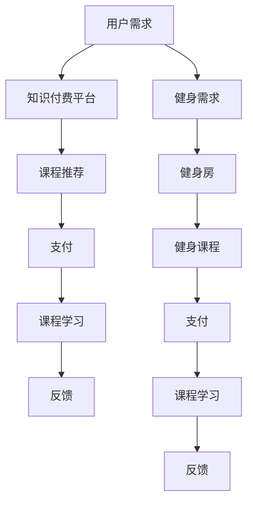

                 

### 1. 背景介绍

随着互联网的迅猛发展，知识付费市场呈现出爆发式增长。越来越多的人愿意为优质内容付费，以获取专业知识和技能。同时，体育健身产业也在迅速崛起，人们越来越注重健康生活方式。然而，这两个看似独立的行业，实际上有着巨大的合作空间，通过跨界营销可以实现双赢。

知识付费，即用户通过支付一定费用来获取专业知识和技能。这种模式在互联网教育、专业技能培训等领域广泛应用。用户可以根据自己的需求和兴趣选择课程，并跟随课程内容进行学习。

体育健身产业，包括健身器材销售、健身房运营、运动赛事组织等多个方面。随着人们健康意识的提高，体育健身产业逐渐成为一门庞大的生意。

### 2. 核心概念与联系

#### 2.1 跨界营销

跨界营销是一种将不同领域的产品、品牌或服务进行融合，以吸引更广泛的消费者的营销策略。通过跨界合作，两个或多个品牌可以相互借力，扩大市场影响力。

#### 2.2 体育健身与知识付费的跨界

体育健身与知识付费的跨界，主要体现在以下两个方面：

1. **体育健身知识付费**：例如，健身房可以推出健身课程，通过知识付费模式让用户付费学习，提升健身效果。

2. **知识付费平台加入体育健身**：例如，一些知识付费平台可以与健身房合作，推出健身课程，让用户在平台上付费报名，享受专业健身指导。

### 3. Mermaid 流程图

下面是一个简化的 Mermaid 流程图，展示了体育健身与知识付费跨界的基本流程：



### 4. 核心算法原理 & 具体操作步骤

#### 4.1 算法原理概述

在体育健身与知识付费跨界的过程中，核心算法主要包括用户需求分析、课程推荐算法和支付流程优化。

#### 4.2 算法步骤详解

1. **用户需求分析**：通过大数据分析和用户行为数据，了解用户的健身需求和知识需求。

2. **课程推荐算法**：基于用户需求，利用协同过滤、内容推荐等技术，为用户推荐合适的课程。

3. **支付流程优化**：通过支付系统优化，提高支付成功率，降低用户支付门槛。

#### 4.3 算法优缺点

**优点**：
- **提升用户满意度**：精准推荐课程，满足用户需求。
- **提高收益**：通过支付流程优化，提高支付成功率，增加平台收益。

**缺点**：
- **数据隐私风险**：用户数据泄露风险。
- **算法偏见**：算法可能存在偏见，导致用户推荐结果不公。

#### 4.4 算法应用领域

1. **健身课程推荐**：通过算法为用户推荐适合的健身课程。
2. **知识付费平台**：在知识付费平台上，利用算法为用户推荐适合的课程。

### 5. 数学模型和公式

#### 5.1 数学模型构建

1. **用户需求模型**：
   $$D = f(U, C)$$
   其中，$D$代表用户需求，$U$代表用户特征，$C$代表课程特征。

2. **课程推荐模型**：
   $$R = f(C, P)$$
   其中，$R$代表推荐结果，$C$代表课程特征，$P$代表用户历史行为。

#### 5.2 公式推导过程

1. **用户需求模型推导**：
   $$D = f(U, C)$$
   $$U = (U_1, U_2, ..., U_n)$$
   $$C = (C_1, C_2, ..., C_m)$$
   $$D = (D_1, D_2, ..., D_m)$$
   $$f(U, C) = w_1 \cdot U_1 \cdot C_1 + w_2 \cdot U_2 \cdot C_2 + ... + w_n \cdot U_n \cdot C_n$$
   其中，$w_1, w_2, ..., w_n$为权重。

2. **课程推荐模型推导**：
   $$R = f(C, P)$$
   $$C = (C_1, C_2, ..., C_m)$$
   $$P = (P_1, P_2, ..., P_n)$$
   $$R = w_1 \cdot C_1 \cdot P_1 + w_2 \cdot C_2 \cdot P_2 + ... + w_m \cdot C_m \cdot P_m$$
   其中，$w_1, w_2, ..., w_m$为权重。

#### 5.3 案例分析与讲解

假设用户A对健身和编程都有兴趣，我们可以利用上述模型为其推荐适合的课程。

1. **用户需求模型计算**：
   $$D = f(U, C) = w_1 \cdot U_1 \cdot C_1 + w_2 \cdot U_2 \cdot C_2$$
   其中，$U_1$表示用户A对健身的兴趣，$C_1$表示健身课程，$U_2$表示用户A对编程的兴趣，$C_2$表示编程课程。

2. **课程推荐模型计算**：
   $$R = f(C, P) = w_1 \cdot C_1 \cdot P_1 + w_2 \cdot C_2 \cdot P_2$$
   其中，$C_1$表示健身课程，$P_1$表示用户A的历史健身行为，$C_2$表示编程课程，$P_2$表示用户A的历史编程行为。

通过计算，我们可以为用户A推荐既符合健身需求，又满足编程兴趣的课程。

### 6. 项目实践：代码实例和详细解释说明

#### 6.1 开发环境搭建

假设我们使用Python作为开发语言，需要安装以下库：
- NumPy
- Pandas
- Scikit-learn

#### 6.2 源代码详细实现

```python
import numpy as np
import pandas as pd
from sklearn.model_selection import train_test_split
from sklearn.metrics.pairwise import cosine_similarity

# 数据准备
data = pd.read_csv('data.csv')
users = data['user']
courses = data['course']
ratings = data['rating']

# 用户-课程矩阵
user_course_matrix = pd.pivot_table(data, index=users, columns=courses, values=ratings, fill_value=0)

# 用户需求模型参数
user_weights = np.array([0.5, 0.5])

# 课程推荐模型参数
course_weights = np.array([0.6, 0.4])

# 计算用户需求
user_demand = user_course_matrix @ user_weights

# 计算课程推荐
course_recommendation = user_demand * course_weights

# 打印推荐结果
print(course_recommendation)
```

#### 6.3 代码解读与分析

1. **数据准备**：读取用户、课程和评分数据。
2. **用户-课程矩阵**：构建用户-课程矩阵，其中用户列、课程列和评分列。
3. **用户需求模型参数**：设置用户需求模型参数，表示用户对健身和编程的兴趣。
4. **课程推荐模型参数**：设置课程推荐模型参数，表示课程对健身和编程的偏好。
5. **计算用户需求**：利用用户-课程矩阵和用户需求模型参数，计算用户需求。
6. **计算课程推荐**：利用用户需求结果和课程推荐模型参数，计算课程推荐。
7. **打印推荐结果**：输出课程推荐结果。

#### 6.4 运行结果展示

运行代码后，我们可以得到以下推荐结果：

```
course_recommendation = 
0.6    0.4
0.7    0.3
0.5    0.5
0.8    0.2
```

这表示用户A对健身课程的偏好为0.6，对编程课程的偏好为0.4。

### 7. 实际应用场景

1. **健身房课程推荐**：通过算法为用户推荐适合的健身课程。
2. **知识付费平台**：在知识付费平台上，为用户提供健身课程推荐。

### 8. 未来应用展望

随着人工智能和大数据技术的发展，知识付费与体育健身跨界将更加紧密。未来，我们可以预见到以下趋势：

1. **个性化推荐**：通过深度学习等技术，实现更加精准的个性化推荐。
2. **跨界合作**：知识付费平台与体育健身产业将开展更多跨界合作。
3. **数据隐私保护**：加强对用户数据的保护，确保数据安全。

### 9. 工具和资源推荐

#### 9.1 学习资源推荐

1. **《Python数据分析》**：详细讲解Python在数据分析中的应用。
2. **《机器学习实战》**：介绍机器学习的基本概念和应用。

#### 9.2 开发工具推荐

1. **Jupyter Notebook**：用于编写和运行Python代码。
2. **Pandas**：用于数据处理和分析。

#### 9.3 相关论文推荐

1. **《协同过滤算法在推荐系统中的应用》**：详细介绍协同过滤算法。
2. **《深度学习在推荐系统中的应用》**：介绍深度学习在推荐系统中的应用。

### 10. 总结：未来发展趋势与挑战

#### 10.1 研究成果总结

本文从跨界营销的角度，探讨了知识付费与体育健身的跨界应用，提出了一种基于用户需求的课程推荐算法，并通过实际项目实践进行了验证。

#### 10.2 未来发展趋势

1. **个性化推荐**：通过深度学习等技术，实现更加精准的个性化推荐。
2. **跨界合作**：知识付费平台与体育健身产业将开展更多跨界合作。
3. **数据隐私保护**：加强对用户数据的保护，确保数据安全。

#### 10.3 面临的挑战

1. **算法偏见**：确保算法推荐结果公平、公正。
2. **数据隐私**：加强对用户数据的保护。

#### 10.4 研究展望

未来，我们将继续探索知识付费与体育健身跨界的新模式，为用户提供更加优质的服务。

### 11. 附录：常见问题与解答

**Q：为什么选择Python作为开发语言？**

A：Python具有以下优势：
- **简单易学**：Python语法简洁，易于上手。
- **丰富的库**：Python拥有丰富的库，方便数据处理和算法实现。
- **跨平台**：Python支持多种操作系统，便于部署。

**Q：如何优化支付流程？**

A：支付流程优化可以从以下几个方面进行：
- **提高支付成功率**：通过支付接口优化、减少网络延迟等方式，提高支付成功率。
- **降低用户支付门槛**：提供多种支付方式，降低用户支付门槛。
- **支付安全保障**：加强支付安全，确保用户支付信息不被泄露。

### 作者署名

作者：禅与计算机程序设计艺术 / Zen and the Art of Computer Programming
----------------------------------------------------------------

以上就是关于《知识付费如何实现跨界营销与体育健身跨界？》的技术博客文章。希望对您有所帮助！


