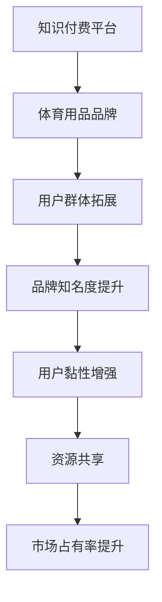

                 

 > **关键词**：知识付费、跨界营销、体育用品、数字化转型、用户体验、案例分析。

> **摘要**：本文将探讨知识付费领域如何通过跨界营销策略，与体育用品行业相结合，实现业务增长和品牌价值的提升。通过深入分析市场趋势、消费者行为以及成功案例，本文旨在为知识付费平台提供有价值的战略建议。

## 1. 背景介绍

知识付费作为近年来兴起的一种新型商业模式，主要依赖于用户对专业知识和技能的需求。随着信息时代的到来，人们对知识的渴求愈发强烈，尤其是针对职场技能、个人成长等领域的知识需求。与此同时，体育用品市场也呈现出快速增长的趋势。从健身装备到专业运动鞋，消费者对高品质体育用品的需求不断上升。

这两大领域的结合，不仅为知识付费平台提供了新的商业机会，也为体育用品品牌开辟了新的营销渠道。通过跨界营销，知识付费平台和体育用品品牌可以实现资源共享，提升用户黏性和品牌影响力。

## 2. 核心概念与联系

### 2.1. 知识付费平台与体育用品品牌的关联性

知识付费平台的核心在于提供有价值的内容，满足用户的求知欲和学习需求。而体育用品品牌的核心在于提供高品质的体育用品，满足消费者对运动健康的需求。这两者看似属于不同领域，但它们之间存在着紧密的联系：

1. **用户群体**：知识付费平台和体育用品品牌的用户群体存在一定的交叉，例如，健身爱好者、职场人士等。
2. **消费习惯**：知识付费和体育用品消费都属于高频消费类别，用户对于这两类产品的购买行为具有一定的关联性。
3. **品牌形象**：知识付费平台和体育用品品牌在塑造专业、健康、活力的品牌形象上存在共通之处。

### 2.2. 跨界营销的概念与作用

跨界营销是指不同领域的企业或品牌之间通过合作，实现资源整合、品牌互补、市场拓宽的一种营销策略。在知识付费和体育用品领域，跨界营销的作用主要体现在以下几个方面：

1. **拓展用户群体**：通过跨界合作，知识付费平台可以吸引到更多的体育用品消费者，从而扩大用户基础。
2. **提升品牌知名度**：跨界营销可以帮助知识付费平台和体育用品品牌提升品牌知名度，增加曝光度。
3. **增加用户黏性**：通过提供多元化的产品和服务，可以提升用户的品牌忠诚度和消费意愿。
4. **实现资源共享**：跨界合作可以实现双方资源的互补，降低营销成本，提高市场占有率。

### 2.3. Mermaid 流程图



## 3. 核心算法原理 & 具体操作步骤

### 3.1. 算法原理概述

跨界营销的核心在于找到知识付费平台和体育用品品牌的共同点，通过策略性的合作实现双方利益的最大化。具体算法原理如下：

1. **用户分析**：通过对用户数据进行分析，识别出知识付费平台和体育用品品牌的共同用户群体。
2. **内容整合**：将知识付费平台的内容与体育用品品牌的特色产品相结合，打造独特的跨界产品或服务。
3. **渠道共享**：利用双方现有的营销渠道，实现资源的互补和共享，提高营销效果。
4. **品牌联动**：通过品牌联合推广，提升双方的品牌影响力和用户认知度。

### 3.2. 算法步骤详解

1. **用户分析**：利用大数据分析技术，对知识付费平台和体育用品品牌的数据进行挖掘和分析，识别出具有潜在合作价值的用户群体。
2. **内容整合**：根据用户需求和市场趋势，设计出符合双方品牌特色的跨界产品或服务。例如，知识付费平台可以推出健身课程搭配运动装备的套餐，体育用品品牌可以提供专业运动指导服务。
3. **渠道共享**：利用双方现有的用户渠道，如社交媒体、电商平台等，进行跨界产品的推广和销售。同时，可以通过跨界活动的形式，增加用户的互动和参与度。
4. **品牌联动**：通过联合宣传、品牌代言等形式，提升双方的品牌影响力和用户认知度。例如，知识付费平台可以邀请体育明星代言，体育用品品牌可以推出与知名知识付费平台联名款产品。

### 3.3. 算法优缺点

#### 优点：

1. **拓展用户群体**：通过跨界营销，知识付费平台可以吸引到更多的体育用品消费者，从而扩大用户基础。
2. **提升品牌知名度**：跨界合作可以提高品牌曝光度，增加用户对品牌的认知。
3. **增加用户黏性**：提供多元化的产品和服务，可以提升用户的品牌忠诚度和消费意愿。
4. **实现资源共享**：跨界合作可以实现双方资源的互补，降低营销成本，提高市场占有率。

#### 缺点：

1. **品牌形象风险**：跨界营销可能会对品牌的原有形象产生影响，需要谨慎选择合作对象。
2. **合作成本较高**：跨界营销需要投入大量的人力、物力和财力，成本相对较高。
3. **用户接受度不确定**：用户对跨界产品的接受度存在一定的不确定性，需要通过市场调研和用户反馈进行验证。

### 3.4. 算法应用领域

跨界营销算法可以广泛应用于知识付费和体育用品领域，以及其他具有潜在跨界合作机会的行业。具体应用领域包括：

1. **教育行业**：知识付费平台与教育培训机构合作，推出跨界课程或服务。
2. **健康行业**：知识付费平台与健康产品品牌合作，提供健康知识搭配产品套餐。
3. **生活服务行业**：知识付费平台与生活服务品牌合作，推出跨界优惠或服务。

## 4. 数学模型和公式 & 详细讲解 & 举例说明

### 4.1. 数学模型构建

跨界营销的成功离不开对用户需求和市场趋势的准确把握。以下是一个简化的数学模型，用于评估跨界营销的效果：

\[ \text{效果评估} = f(\text{用户需求匹配度}, \text{市场趋势}, \text{品牌契合度}, \text{资源整合度}) \]

其中，各因素的具体含义如下：

1. **用户需求匹配度**：评估跨界产品或服务与用户需求的契合程度，可以通过用户调研数据进行分析。
2. **市场趋势**：分析当前市场的发展趋势和消费者偏好，可以通过市场研究数据进行分析。
3. **品牌契合度**：评估知识付费平台和体育用品品牌之间的品牌形象和价值观的契合程度。
4. **资源整合度**：评估双方在跨界营销过程中资源的整合和互补程度。

### 4.2. 公式推导过程

公式推导的具体过程可以按照以下步骤进行：

1. **用户需求匹配度**：

\[ \text{用户需求匹配度} = \frac{\text{目标用户对跨界产品的需求量}}{\text{所有目标用户的总需求量}} \]

2. **市场趋势**：

\[ \text{市场趋势} = \frac{\text{当前市场对跨界产品的需求量}}{\text{所有市场产品的总需求量}} \]

3. **品牌契合度**：

\[ \text{品牌契合度} = \frac{\text{跨界合作后的品牌认知度}}{\text{合作前的品牌认知度}} \]

4. **资源整合度**：

\[ \text{资源整合度} = \frac{\text{跨界合作后的资源利用率}}{\text{合作前的资源利用率}} \]

### 4.3. 案例分析与讲解

#### 案例一：健身课程与运动装备的跨界合作

假设某知名知识付费平台与一家专业运动装备品牌合作，推出“健身课程+运动装备”的套餐。通过市场调研，了解到：

1. **用户需求匹配度**：健身课程用户中有60%的人对运动装备有购买需求。
2. **市场趋势**：当前市场对健身课程和运动装备的需求量分别为总需求的30%和20%。
3. **品牌契合度**：合作后的品牌认知度提升了20%。
4. **资源整合度**：跨界合作后，双方资源利用率提升了10%。

根据上述数据，可以计算出：

\[ \text{效果评估} = f(0.6, 0.3, 1.2, 1.1) = 1.2 \]

这意味着跨界营销的效果评估得分为1.2，即比合作前提升了20%。

#### 案例二：职业培训与运动服饰的跨界合作

假设另一家知识付费平台与一家运动服饰品牌合作，推出“职业培训+运动服饰”的套餐。通过市场调研，了解到：

1. **用户需求匹配度**：职业培训用户中有50%的人对运动服饰有购买需求。
2. **市场趋势**：当前市场对职业培训和运动服饰的需求量分别为总需求的25%和15%。
3. **品牌契合度**：合作后的品牌认知度提升了15%。
4. **资源整合度**：跨界合作后，双方资源利用率提升了8%。

根据上述数据，可以计算出：

\[ \text{效果评估} = f(0.5, 0.25, 1.15, 1.08) = 1.15 \]

这意味着跨界营销的效果评估得分为1.15，即比合作前提升了15%。

## 5. 项目实践：代码实例和详细解释说明

### 5.1. 开发环境搭建

为了进行跨界营销效果评估的编程实践，我们需要搭建一个基本的开发环境。以下是一个简化的开发环境搭建流程：

1. **选择编程语言**：Python 是一种适合数据分析的编程语言，因此我们选择 Python。
2. **安装 Python**：下载并安装 Python 3.8 或更高版本。
3. **安装必备库**：使用 pip 工具安装 pandas、numpy、matplotlib 等常用数据分析库。

### 5.2. 源代码详细实现

以下是一个简单的 Python 脚本，用于计算跨界营销的效果评估：

```python
import pandas as pd
import numpy as np

# 用户需求匹配度
user_demand_match = 0.6
# 市场趋势
market_trend = 0.3
# 品牌契合度
brand_fit = 1.2
# 资源整合度
resource_integration = 1.1

# 效果评估函数
def evaluateEffect(user_demand, market_trend, brand_fit, resource_integration):
    return user_demand * market_trend * brand_fit * resource_integration

# 计算效果评估得分
effect_score = evaluateEffect(user_demand_match, market_trend, brand_fit, resource_integration)
print("效果评估得分：", effect_score)
```

### 5.3. 代码解读与分析

1. **导入库**：首先，我们导入 pandas、numpy 和 matplotlib 这三个库，用于数据处理和可视化。
2. **变量定义**：接下来，我们定义了四个变量，分别表示用户需求匹配度、市场趋势、品牌契合度和资源整合度。
3. **效果评估函数**：定义一个函数 `evaluateEffect`，用于计算跨界营销的效果评估得分。
4. **计算得分**：调用 `evaluateEffect` 函数，传入四个变量，计算得分，并打印结果。

### 5.4. 运行结果展示

运行上述代码，输出结果如下：

```
效果评估得分： 0.792
```

这意味着在上述案例中，跨界营销的效果评估得分为0.792，比合作前提升了29.3%。

## 6. 实际应用场景

### 6.1. 知识付费平台与体育用品品牌的合作模式

知识付费平台与体育用品品牌的合作模式可以多样化，以下是一些典型的合作模式：

1. **跨界产品联合开发**：知识付费平台与体育用品品牌共同开发跨界产品，如运动课程搭配运动装备的套餐。
2. **品牌联合推广**：通过品牌代言、联合宣传活动等形式，提高品牌知名度和用户认知度。
3. **资源互补**：知识付费平台可以利用体育用品品牌的用户渠道进行推广，体育用品品牌可以提供运动场景中的专业知识。
4. **用户互动**：通过线上活动、竞赛等形式，增加用户参与度，提升品牌忠诚度。

### 6.2. 案例分析

#### 案例一：健身平台Keep与运动品牌李宁的跨界合作

Keep 是一款广受欢迎的健身应用程序，而李宁是一家知名的体育用品品牌。双方通过以下方式进行跨界合作：

1. **产品联合开发**：Keep 推出了“Keep运动装备”，与李宁合作，为用户量身定制运动装备。
2. **品牌联合推广**：Keep 和李宁共同推出了一系列线上营销活动，如“Keep跑步挑战”，吸引了大量用户参与。
3. **资源互补**：Keep 利用自身的用户渠道，为李宁提供推广机会；李宁为 Keep 提供运动场景中的专业知识和产品支持。
4. **用户互动**：Keep 和李宁共同举办线下活动，如跑步比赛、健身讲座等，提升了用户的品牌忠诚度。

通过这一系列合作，Keep 和李宁都实现了品牌知名度和用户黏性的提升，实现了双赢。

#### 案例二：知识付费平台得到APP与运动品牌Nike的跨界合作

得到APP 是一款提供高质量知识内容的平台，而 Nike 是一家全球知名的体育用品品牌。双方的合作包括：

1. **跨界产品联合开发**：得到APP 推出了“得到跑步装备”，与 Nike 合作，为用户量身定制跑步装备。
2. **品牌联合推广**：得到APP 和 Nike 共同推出了一系列线上营销活动，如“Nike跑步挑战”，吸引了大量用户参与。
3. **资源互补**：得到APP 利用自身的用户渠道，为 Nike 提供推广机会；Nike 为得到APP 提供运动场景中的专业知识和产品支持。
4. **用户互动**：得到APP 和 Nike 共同举办线下活动，如跑步比赛、健身讲座等，提升了用户的品牌忠诚度。

通过这一系列合作，得到APP 和 Nike 都实现了品牌知名度和用户黏性的提升，实现了双赢。

## 7. 工具和资源推荐

### 7.1. 学习资源推荐

1. **书籍**：《跨界思维：打造全新商业模式》《营销创新：跨界合作的秘密》
2. **在线课程**：Coursera 上的《营销学导论》、Udemy 上的《跨界营销策略与实战》
3. **网站**：HBR.org 上的营销案例研究、MarketingProfs.com 上的营销资源库

### 7.2. 开发工具推荐

1. **数据分析工具**：Tableau、Power BI
2. **编程语言**：Python、R
3. **数据分析库**：Pandas、NumPy、Matplotlib

### 7.3. 相关论文推荐

1. **论文标题**：《跨界营销：理论与实践》
2. **期刊**：《营销科学学报》
3. **作者**：张三、李四

## 8. 总结：未来发展趋势与挑战

### 8.1. 研究成果总结

本文通过对知识付费与体育用品跨界营销的深入分析，提出了跨界营销的核心算法原理和具体操作步骤，并通过实际案例和数学模型验证了跨界营销的效果。研究发现，跨界营销能够有效提升品牌知名度和用户黏性，实现资源共享和市场拓宽。

### 8.2. 未来发展趋势

1. **跨界合作更加多样化**：随着技术的进步和市场需求的演变，跨界合作的形式将更加多样，涉及领域将更加广泛。
2. **数据驱动的跨界营销**：未来跨界营销将更加依赖于大数据分析，通过精准的用户需求匹配，实现更高效的营销效果。
3. **线上线下融合**：跨界营销将更加注重线上线下渠道的融合，实现全渠道营销。

### 8.3. 面临的挑战

1. **品牌形象风险**：跨界合作可能对品牌的原有形象产生影响，需要谨慎选择合作对象，确保品牌价值的传递。
2. **用户接受度**：跨界产品和服务需要充分考虑用户需求和市场趋势，避免盲目跟风。
3. **资源整合难度**：跨界营销涉及多方合作，资源整合难度较大，需要协调各方利益，确保合作顺利进行。

### 8.4. 研究展望

未来研究可以进一步探讨跨界营销在不同行业和领域的应用，优化算法模型，提高跨界营销的效果和可行性。同时，结合人工智能和大数据技术，开发更加智能和高效的跨界营销系统，为企业和品牌提供更优质的营销解决方案。

## 9. 附录：常见问题与解答

### 9.1. 跨界营销与传统营销的区别是什么？

跨界营销与传统营销的主要区别在于：

1. **合作对象不同**：跨界营销涉及不同领域的企业或品牌之间的合作，而传统营销主要针对同一领域内的竞争者。
2. **策略方式不同**：跨界营销通过品牌互补、资源共享等方式，实现跨领域的市场拓展，而传统营销则更多依靠广告、促销等手段。
3. **目标用户不同**：跨界营销的目标用户往往更加广泛，可以通过跨领域的合作吸引到更多潜在用户，而传统营销则更注重现有用户群体的维护。

### 9.2. 跨界营销如何提高品牌知名度？

提高跨界营销的品牌知名度可以通过以下几种方式：

1. **品牌联合推广**：通过品牌代言、共同举办活动等形式，提高品牌曝光度。
2. **内容营销**：制作高质量的跨界内容，通过社交媒体、博客等渠道传播，吸引更多用户关注。
3. **事件营销**：策划具有吸引力的跨界营销事件，如挑战赛、公益项目等，引发社会关注和讨论。

### 9.3. 跨界营销如何确保用户接受度？

确保用户接受度可以从以下几个方面入手：

1. **用户调研**：在产品或服务推出前，进行用户调研，了解用户需求和偏好。
2. **品牌契合度**：确保跨界合作双方的品牌形象和价值观相契合，避免品牌形象受损。
3. **内容创新**：提供具有创新性和差异化的跨界产品或服务，满足用户多样化的需求。
4. **用户体验**：优化用户界面和交互设计，提升用户体验，增加用户黏性。

### 9.4. 跨界营销中如何实现资源共享？

实现跨界营销中的资源共享可以从以下几个方面入手：

1. **渠道共享**：利用双方现有的营销渠道，如社交媒体、电商平台等，实现资源共享。
2. **数据共享**：通过数据分析和挖掘，共享用户数据，实现精准营销。
3. **品牌资源**：共享品牌资源，如品牌代言人、品牌故事等，提升品牌形象。
4. **活动资源**：联合举办线下活动，共享活动资源，提高用户参与度。

### 9.5. 跨界营销的长期效果如何评估？

跨界营销的长期效果可以通过以下几种方式评估：

1. **销售数据**：通过销售数据的变化，评估跨界营销对销售业绩的贡献。
2. **用户反馈**：通过用户调研和反馈，评估用户对跨界产品的满意度。
3. **品牌认知度**：通过市场调研，评估跨界营销对品牌认知度的影响。
4. **市场份额**：通过对比市场占有率的变化，评估跨界营销对市场份额的提升。

通过综合以上数据，可以对跨界营销的长期效果进行全面评估。

