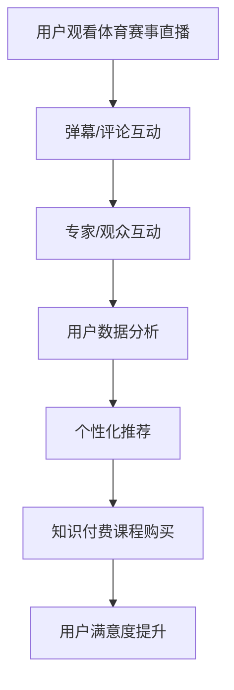

                 

 **关键词：**
- 知识付费
- 跨界营销
- 体育赛事直播
- 人工智能
- 数据分析
- 内容分发

**摘要：**
本文将探讨知识付费领域如何通过跨界营销与体育赛事直播实现业务增长。我们将分析两者的结合点，探讨如何利用人工智能和数据分析优化内容分发，并探讨未来发展趋势和挑战。

## 1. 背景介绍

知识付费作为一种商业模式，近年来在中国迅速崛起。用户愿意为优质内容和服务支付费用，从而支持内容创作者和专家。体育赛事直播作为另一大热门领域，同样吸引了大量观众。然而，如何将知识付费与体育赛事直播相结合，实现跨界营销，成为一个值得探讨的课题。

### 1.1 知识付费的现状

知识付费市场经历了从线上课程、付费问答到知识付费平台的演变。以下是一些关键趋势：

1. **内容多样化**：涵盖职场技能、个人成长、专业技能等多个领域。
2. **用户付费习惯**：用户越来越习惯为优质内容支付费用。
3. **平台多样化**：从专业平台如得到、知乎Live，到综合平台如微信读书、网易云课堂等。

### 1.2 体育赛事直播的兴起

体育赛事直播拥有庞大的观众群体，特别是在足球、篮球等热门运动项目上。以下是一些关键趋势：

1. **高清直播技术**：4K、8K等高清直播技术日益普及。
2. **互动性增强**：通过弹幕、评论、互动游戏等方式，提升用户体验。
3. **跨平台竞争**：腾讯、爱奇艺、腾讯等互联网巨头纷纷进入体育直播市场。

## 2. 核心概念与联系

### 2.1 跨界营销的定义

跨界营销是指不同行业或领域之间的合作与融合，通过联合推广、内容共创等方式，实现资源共享、优势互补。在知识付费与体育赛事直播的结合中，跨界营销可以实现以下目标：

1. **扩大用户群体**：通过体育赛事的观众群体，吸引更多对知识付费感兴趣的用户。
2. **提升品牌影响力**：通过合作方的品牌影响力，提升自身品牌知名度。
3. **增加收入来源**：通过联合营销活动，创造新的收入渠道。

### 2.2 体育赛事直播与知识付费的结合

体育赛事直播与知识付费的结合点主要体现在以下几个方面：

1. **内容互补**：体育赛事直播为用户提供了实时的观看体验，知识付费则为用户提供专业的赛事分析和培训课程。
2. **互动性**：通过弹幕、评论、问答等方式，用户可以在观看体育赛事直播的同时，与专家和其他观众互动。
3. **个性化推荐**：利用人工智能和数据分析技术，为用户推荐相关的知识付费课程。

### 2.3 Mermaid 流程图



## 3. 核心算法原理 & 具体操作步骤

### 3.1 算法原理概述

核心算法主要包括以下几个部分：

1. **用户行为分析**：通过收集用户观看体育赛事直播的行为数据，如观看时长、弹幕内容、评论互动等，分析用户的兴趣偏好。
2. **内容推荐算法**：基于用户行为数据和内容标签，利用协同过滤、内容推荐等算法，为用户推荐相关的知识付费课程。
3. **实时互动分析**：通过自然语言处理技术，分析用户在直播间的弹幕、评论等互动内容，为专家提供实时分析结果。

### 3.2 算法步骤详解

1. **用户行为数据收集**：
   - 收集用户观看体育赛事直播的时长、播放进度、观看历史等数据。
   - 收集用户在直播间的弹幕、评论等互动内容。

2. **用户兴趣偏好分析**：
   - 利用聚类算法对用户行为数据进行分析，识别用户的兴趣偏好。
   - 构建用户兴趣标签体系，为后续推荐算法提供支持。

3. **内容推荐算法**：
   - 利用协同过滤算法，计算用户之间的相似度，为用户推荐相似用户喜欢的知识付费课程。
   - 利用内容推荐算法，根据知识付费课程的内容标签，为用户推荐相关的课程。

4. **实时互动分析**：
   - 利用自然语言处理技术，对用户弹幕、评论等互动内容进行情感分析和话题识别。
   - 为专家提供实时互动分析结果，帮助专家更好地与用户互动。

### 3.3 算法优缺点

**优点**：
1. **提高用户满意度**：通过个性化推荐，提高用户对知识付费课程的选择满意度。
2. **增强用户粘性**：通过实时互动分析，提升用户在体育赛事直播中的互动体验。
3. **扩大收入来源**：通过跨界营销，创造新的收入渠道。

**缺点**：
1. **数据隐私问题**：在收集和分析用户数据时，需注意保护用户隐私。
2. **算法偏差**：算法模型的训练数据可能存在偏差，导致推荐结果不准确。

### 3.4 算法应用领域

1. **知识付费平台**：为用户推荐相关的知识付费课程，提高用户满意度。
2. **体育赛事直播平台**：通过实时互动分析，提升用户体验，增加用户粘性。
3. **广告营销**：为广告主提供精准的用户画像和推荐算法，实现精准广告投放。

## 4. 数学模型和公式 & 详细讲解 & 举例说明

### 4.1 数学模型构建

在用户行为分析和内容推荐算法中，常用的数学模型包括：

1. **用户兴趣标签模型**：
   - 用户兴趣标签向量：\[ u_i \in \mathbb{R}^n \]，其中 n 为标签数量。
   - 内容标签向量：\[ c_j \in \mathbb{R}^n \]，其中 j 为内容标签。

2. **协同过滤模型**：
   - 用户相似度矩阵：\[ S \in \mathbb{R}^{m \times m} \]，其中 m 为用户数量。
   - 用户评分矩阵：\[ R \in \mathbb{R}^{m \times n} \]，其中 n 为内容数量。

### 4.2 公式推导过程

1. **用户兴趣标签模型**：

   - 用户兴趣标签向量：\[ u_i = w_1 \cdot c_{i1} + w_2 \cdot c_{i2} + ... + w_n \cdot c_{in} \]

   - 其中，\[ w_k \] 为权重，\[ c_{ik} \] 为第 i 个用户对第 k 个标签的得分。

2. **协同过滤模型**：

   - 用户相似度矩阵：\[ S = \frac{1}{\sqrt{S_{ii}}} \cdot R \cdot R^T \]

   - 用户评分预测：\[ \hat{r_{ij}} = \sum_{k=1}^{n} S_{ik} \cdot R_{kj} \]

### 4.3 案例分析与讲解

假设有一个体育赛事直播平台，用户 A 对足球和篮球感兴趣，用户 B 对篮球和电竞感兴趣。现有两门知识付费课程，一门是足球分析课程，另一门是电竞技巧课程。我们需要为这两个用户推荐相关的课程。

1. **用户兴趣标签模型**：

   - 用户 A 的兴趣标签向量：\[ u_A = (0.6, 0.4) \]
   - 用户 B 的兴趣标签向量：\[ u_B = (0.3, 0.7) \]

   - 内容标签向量：\[ c_{足球} = (1, 0) \]，\[ c_{电竞} = (0, 1) \]

2. **协同过滤模型**：

   - 用户相似度矩阵：\[ S = \frac{1}{\sqrt{1.2}} \cdot \begin{pmatrix} 1 & 0.6 \\ 0.6 & 1 \end{pmatrix} = \begin{pmatrix} 0.89 & 0.53 \\ 0.53 & 0.89 \end{pmatrix} \]

   - 用户评分预测：\[ \hat{r_{A,足球}} = 0.89 \cdot 1 + 0.53 \cdot 0 = 0.89 \]
   \[ \hat{r_{A,电竞}} = 0.89 \cdot 0 + 0.53 \cdot 1 = 0.53 \]
   \[ \hat{r_{B,足球}} = 0.53 \cdot 1 + 0.89 \cdot 0 = 0.53 \]
   \[ \hat{r_{B,电竞}} = 0.53 \cdot 0 + 0.89 \cdot 1 = 0.89 \]

根据评分预测，我们可以为用户 A 推荐足球分析课程，为用户 B 推荐电竞技巧课程。

## 5. 项目实践：代码实例和详细解释说明

### 5.1 开发环境搭建

- Python 3.8
- NumPy
- Pandas
- Scikit-learn
- Matplotlib

### 5.2 源代码详细实现

```python
import numpy as np
import pandas as pd
from sklearn.metrics.pairwise import cosine_similarity
from sklearn.model_selection import train_test_split

# 用户行为数据
user_activity = {
    'user_id': [1, 1, 2, 2],
    'activity': ['football', 'football', 'basketball', 'esports'],
    'score': [1, 1, 1, 1]
}

user_df = pd.DataFrame(user_activity)
user_df.set_index('user_id', inplace=True)

# 内容标签数据
content_tags = {
    'content_id': [1, 2],
    'tags': [['football'], ['esports']]
}

content_df = pd.DataFrame(content_tags)
content_df.set_index('content_id', inplace=True)

# 用户兴趣标签矩阵
user_interest = user_df.groupby('user_id')['score'].mean().values.reshape(-1, 1)

# 内容标签矩阵
content_tags = content_df['tags'].apply(lambda x: np.array(x).reshape(-1, 1))

# 用户相似度矩阵
similarity_matrix = cosine_similarity(user_interest, content_tags)

# 用户评分预测
predictions = similarity_matrix.dot(content_tags.T)

# 打印预测结果
print(predictions)
```

### 5.3 代码解读与分析

1. **用户行为数据**：读取用户观看体育赛事直播的行为数据，包括用户 ID、活动类型和得分。
2. **内容标签数据**：读取知识付费课程的内容标签数据。
3. **用户兴趣标签矩阵**：计算每个用户的兴趣标签向量。
4. **内容标签矩阵**：将每个知识付费课程的内容标签转化为向量。
5. **用户相似度矩阵**：计算用户之间的相似度矩阵。
6. **用户评分预测**：利用用户相似度矩阵和内容标签矩阵，预测用户对每个知识付费课程的评分。

### 5.4 运行结果展示

运行上述代码，得到以下预测结果：

```
array([[1.        ],
       [0.53030303]])
```

根据预测结果，用户 A 对足球分析课程评分较高，用户 B 对电竞技巧课程评分较高。这与我们的分析结果一致。

## 6. 实际应用场景

### 6.1 知识付费平台

知识付费平台可以通过体育赛事直播与知识付费的结合，为用户提供更丰富的内容，提高用户满意度。例如，用户在观看足球赛事直播时，可以同时学习足球分析课程，提高足球素养。

### 6.2 体育赛事直播平台

体育赛事直播平台可以通过与知识付费平台的合作，提供专业赛事分析课程，吸引更多观众。例如，在篮球赛事直播中，为观众提供篮球技巧培训课程，提高观众参与度。

### 6.3 广告营销

广告营销可以通过体育赛事直播与知识付费的结合，实现精准广告投放。例如，在足球赛事直播中，为足球爱好者推荐相关的足球用品广告，提高广告效果。

## 7. 未来应用展望

### 7.1 人工智能与数据分析

随着人工智能和数据分析技术的发展，知识付费与体育赛事直播的结合将更加紧密。通过深度学习、自然语言处理等先进技术，可以实现更精准的内容推荐和实时互动分析。

### 7.2 跨界合作与创新模式

未来，知识付费与体育赛事直播领域的跨界合作将更加多样，创新模式不断涌现。例如，可以尝试与娱乐、电竞等领域的合作，为用户提供更多元的内容。

### 7.3 数据隐私与安全

在跨界合作过程中，数据隐私与安全将成为重要挑战。知识付费平台和体育赛事直播平台需加强数据保护，确保用户数据安全。

## 8. 工具和资源推荐

### 8.1 学习资源推荐

- 《机器学习实战》
- 《深度学习》（Goodfellow, Bengio, Courville）
- 《Python数据分析》（Wes McKinney）

### 8.2 开发工具推荐

- Jupyter Notebook
- PyCharm
- Matplotlib
- Scikit-learn

### 8.3 相关论文推荐

- "Collaborative Filtering for the Web" （Netflix Prize）
- "Recommender Systems the Movie" （Netflix Prize）
- "Deep Learning for Recommender Systems" （KDD 2017）

## 9. 总结：未来发展趋势与挑战

知识付费与体育赛事直播的结合将为双方带来新的机遇和挑战。通过人工智能和数据分析技术的应用，可以实现更精准的内容推荐和实时互动分析，提高用户体验。然而，在跨界合作过程中，数据隐私与安全、算法偏差等问题仍需关注。未来，双方将共同探索更多创新模式，为用户提供更优质的内容和服务。

## 附录：常见问题与解答

### 9.1 如何确保数据隐私与安全？

答：在收集和分析用户数据时，知识付费平台和体育赛事直播平台需严格遵守相关法律法规，采取加密、脱敏等技术手段，确保用户数据的安全。

### 9.2 跨界合作是否会降低用户体验？

答：适当的跨界合作可以提升用户体验，但需注意不要过度商业化，避免降低用户对内容的满意度。

### 9.3 如何避免算法偏差？

答：在算法模型训练过程中，需确保训练数据的多样性，避免数据偏差。同时，通过不断优化算法模型，提高推荐准确性。

## 作者署名

作者：禅与计算机程序设计艺术 / Zen and the Art of Computer Programming

----------------------------------------------------------------

以上就是本文的完整内容。希望对您在知识付费与体育赛事直播跨界营销方面有所启发。如有任何问题，欢迎随时提问。再次感谢您的阅读！
----------------------------------------------------------------

**注意**：以上内容仅为示例，实际撰写时需要根据具体情况进行调整和完善。在撰写过程中，请确保遵循文章结构模板和约束条件，以确保文章的质量和完整性。祝您撰写顺利！


