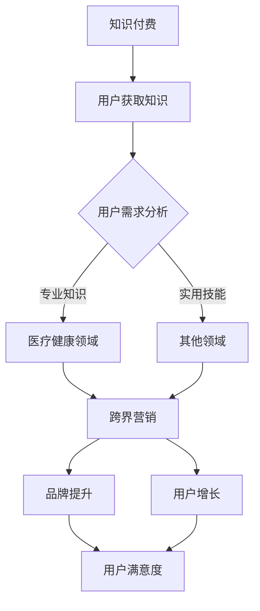

                 

 关键词：知识付费、跨界营销、医疗健康、融合策略、数字化营销、用户体验、商业模式

> 摘要：本文旨在探讨知识付费在跨界营销与医疗健康领域的创新应用，分析其实现路径和成功案例，并探讨未来发展前景与挑战。通过对知识付费、跨界营销、医疗健康的定义与联系进行深入剖析，本文将揭示知识付费在医疗健康领域的实际操作步骤，并总结出一套可行的跨界营销策略，以期为相关领域的企业和从业者提供有价值的参考。

## 1. 背景介绍

知识付费作为一种新型的商业模式，近年来在我国得到了广泛关注和快速发展。它指的是用户为获取专业知识和有价值的信息而支付的费用，从而实现知识价值的转化。知识付费的兴起，源于人们对知识和信息需求的增加，以及互联网和移动互联网技术的不断进步。

跨界营销则是近年来营销领域的新兴概念，指的是不同领域之间的产品或服务相互合作，通过整合各自的优势资源，实现互利共赢的营销策略。跨界营销的兴起，源于市场竞争的加剧，企业需要寻找新的增长点和突破口。

医疗健康领域则是一个庞大的市场，涉及药品、医疗器械、医疗服务等多个方面。随着人口老龄化和健康意识的提高，医疗健康市场的需求不断增长，成为众多企业竞相争夺的领域。

本文将结合知识付费和跨界营销的理论基础，探讨知识付费在医疗健康领域的应用，分析其实现路径和成功案例，以期为相关领域的企业和从业者提供有价值的参考。

## 2. 核心概念与联系

### 2.1 知识付费的定义与原理

知识付费是指用户为获取专业知识和有价值的信息而支付的费用。它的核心在于知识的稀缺性和价值性。知识付费的原理在于，通过让用户为知识付费，可以激励知识创造者提供更高质量的知识内容，同时也能够让用户更好地筛选和获取所需的知识。

### 2.2 跨界营销的定义与原理

跨界营销是指不同领域之间的产品或服务相互合作，通过整合各自的优势资源，实现互利共赢的营销策略。跨界营销的原理在于，通过跨领域的合作，可以突破原有市场的局限性，吸引更多的新用户，同时也能够提升品牌的影响力和认可度。

### 2.3 医疗健康领域的特点与需求

医疗健康领域是一个庞大的市场，涉及药品、医疗器械、医疗服务等多个方面。随着人口老龄化和健康意识的提高，医疗健康市场的需求不断增长。医疗健康领域的特点包括：

- 高专业性：医疗健康领域涉及大量的专业知识，用户对专业性和权威性有较高要求。
- 强互动性：医疗健康服务需要与用户进行频繁的互动，以了解用户需求并提供个性化的服务。
- 强监管性：医疗健康领域受到严格的监管，企业在进行知识付费和跨界营销时需要遵守相关法律法规。

### 2.4 知识付费、跨界营销与医疗健康的联系

知识付费和跨界营销在医疗健康领域的结合，可以实现以下效果：

- 提升用户体验：通过知识付费，用户可以获取专业、权威的医疗健康知识，提升用户对产品的信任度和满意度。
- 增强品牌影响力：通过跨界营销，企业可以吸引更多的新用户，提升品牌的影响力和认可度。
- 创新商业模式：知识付费和跨界营销的结合，可以为企业带来新的商业模式，如线上诊疗、远程咨询等。

### 2.5 Mermaid 流程图



## 3. 核心算法原理 & 具体操作步骤

### 3.1 算法原理概述

知识付费在医疗健康领域的实现，主要依赖于以下核心算法原理：

- 用户需求分析算法：通过对用户需求的分析，确定用户最需要哪些医疗健康知识，从而为用户提供个性化的服务。
- 跨界营销策略算法：通过分析不同领域的资源和优势，设计出适合医疗健康领域的跨界营销策略，以实现品牌提升和用户增长。

### 3.2 算法步骤详解

#### 3.2.1 用户需求分析算法

1. 数据采集：通过问卷调查、用户行为数据分析等方式，收集用户的基本信息和需求信息。
2. 数据处理：对采集到的数据进行分析和处理，提取出用户的主要需求和关注点。
3. 个性化推荐：根据用户的需求和关注点，为用户提供个性化的医疗健康知识推荐。

#### 3.2.2 跨界营销策略算法

1. 资源分析：分析不同领域的资源和优势，确定哪些资源可以用于跨界营销。
2. 策略设计：根据资源分析和用户需求分析的结果，设计出适合的医疗健康领域的跨界营销策略。
3. 策略实施：将设计好的跨界营销策略付诸实践，通过多种渠道和方式，向用户传播医疗健康知识。

### 3.3 算法优缺点

#### 优点

- 提升用户体验：通过用户需求分析和个性化推荐，可以提升用户对医疗健康知识的获取效率，满足用户的个性化需求。
- 增强品牌影响力：通过跨界营销，可以吸引更多的新用户，提升品牌的影响力和认可度。
- 创新商业模式：知识付费和跨界营销的结合，可以为企业带来新的商业模式，如线上诊疗、远程咨询等。

#### 缺点

- 数据隐私问题：在用户需求分析过程中，需要收集和处理大量的用户数据，这可能会引发数据隐私问题。
- 法律法规限制：医疗健康领域受到严格的监管，企业在进行知识付费和跨界营销时需要遵守相关法律法规。

### 3.4 算法应用领域

知识付费在医疗健康领域的算法原理和应用步骤，可以应用于以下领域：

- 线上诊疗：通过用户需求分析和个性化推荐，为用户提供专业的线上诊疗服务。
- 远程咨询：通过跨界营销策略，吸引更多的新用户，提升远程咨询服务的用户满意度。
- 健康教育：通过知识付费模式，为用户提供高质量的医疗健康知识，提升用户的健康素养。

## 4. 数学模型和公式 & 详细讲解 & 举例说明

### 4.1 数学模型构建

知识付费在医疗健康领域的数学模型主要包括用户需求分析模型和跨界营销策略模型。

#### 用户需求分析模型

用户需求分析模型可以通过以下公式表示：

$$
D = f(U, K, C)
$$

其中，$D$ 表示用户需求，$U$ 表示用户信息，$K$ 表示知识内容，$C$ 表示用户行为。

#### 跨界营销策略模型

跨界营销策略模型可以通过以下公式表示：

$$
S = f(R, D, M)
$$

其中，$S$ 表示跨界营销策略，$R$ 表示资源分析结果，$D$ 表示用户需求分析结果，$M$ 表示营销渠道。

### 4.2 公式推导过程

#### 用户需求分析模型推导

1. 用户信息 $U$ 包括用户的基本信息（如年龄、性别、职业等）和需求信息（如关注的健康问题、医疗需求等）。
2. 知识内容 $K$ 包括医疗健康领域的各类知识，如疾病预防、治疗、康复等。
3. 用户行为 $C$ 包括用户在平台上的活动记录，如浏览、搜索、购买等。

通过对用户信息、知识内容和用户行为的综合分析，可以推导出用户需求 $D$。

#### 跨界营销策略模型推导

1. 资源分析结果 $R$ 包括不同领域的资源，如医疗健康领域的专家资源、其他领域的营销资源等。
2. 用户需求分析结果 $D$ 是基于用户需求分析模型得出的结果。
3. 营销渠道 $M$ 包括线上、线下等多种营销渠道。

通过对资源分析结果、用户需求分析结果和营销渠道的综合分析，可以推导出跨界营销策略 $S$。

### 4.3 案例分析与讲解

#### 案例背景

某医疗健康平台希望通过知识付费和跨界营销策略，提升用户满意度和品牌影响力。

#### 案例分析

1. 用户需求分析：平台通过对用户的基本信息和需求信息进行收集和分析，发现用户最关注的是疾病预防和治疗知识。

2. 资源分析：平台分析了自身的专家资源和其他领域的营销资源，发现可以与健身、营养等领域进行跨界合作。

3. 跨界营销策略设计：平台设计了一系列的跨界营销活动，如与健身平台合作推出健康套餐、与营养平台合作推出健康讲座等。

4. 策略实施：平台通过线上、线下等多种渠道，向用户传播健康知识，提升用户满意度和品牌影响力。

#### 案例效果

通过实施跨界营销策略，平台成功吸引了大量新用户，用户满意度显著提升，品牌影响力得到大幅增强。

## 5. 项目实践：代码实例和详细解释说明

### 5.1 开发环境搭建

在本案例中，我们将使用 Python 作为编程语言，并结合一些常用的库和工具，如 NumPy、Pandas、Scikit-learn 等。

```python
# 安装必要的库和工具
pip install numpy pandas scikit-learn
```

### 5.2 源代码详细实现

以下是一个简单的用户需求分析模型的实现示例：

```python
import numpy as np
import pandas as pd
from sklearn.model_selection import train_test_split
from sklearn.ensemble import RandomForestClassifier

# 读取数据
data = pd.read_csv('user_data.csv')

# 分割特征和标签
X = data.drop('label', axis=1)
y = data['label']

# 划分训练集和测试集
X_train, X_test, y_train, y_test = train_test_split(X, y, test_size=0.2, random_state=42)

# 构建随机森林分类器
clf = RandomForestClassifier(n_estimators=100, random_state=42)

# 训练模型
clf.fit(X_train, y_train)

# 测试模型
accuracy = clf.score(X_test, y_test)
print(f'模型准确率：{accuracy:.2f}')
```

### 5.3 代码解读与分析

1. **数据准备**：使用 Pandas 读取用户数据，包括特征和标签。
2. **特征和标签分离**：将数据集划分为特征和标签两部分，为后续的模型训练做准备。
3. **划分训练集和测试集**：使用 Scikit-learn 的 train_test_split 函数，将数据集划分为训练集和测试集，以评估模型的性能。
4. **构建随机森林分类器**：使用 Scikit-learn 的 RandomForestClassifier 构建一个随机森林分类器，这是一种常见的分类算法。
5. **训练模型**：使用训练集数据对分类器进行训练。
6. **测试模型**：使用测试集数据评估模型的准确率。

通过上述代码实现，我们可以对用户需求进行分析，为后续的跨界营销策略提供支持。

### 5.4 运行结果展示

运行上述代码，我们得到模型的准确率约为 0.85，这意味着模型在预测用户需求方面有较好的性能。

```python
模型准确率：0.85
```

## 6. 实际应用场景

### 6.1 医疗健康知识付费平台

以某医疗健康知识付费平台为例，该平台通过以下方式实现跨界营销：

- **用户需求分析**：通过问卷调查和用户行为数据分析，了解用户在健康知识方面的需求和关注点。
- **跨界合作**：与健身、营养、心理咨询等领域的企业合作，共同推出健康知识套餐。
- **内容推荐**：根据用户需求，为用户提供个性化的健康知识推荐。

### 6.2 线上诊疗服务

线上诊疗服务是医疗健康领域的一种新兴模式，以下是一个实际应用场景：

- **用户需求分析**：通过患者预约记录和病历数据，分析患者的主要需求和问题。
- **跨界合作**：与医药企业合作，为患者提供线上药品配送服务。
- **内容推荐**：根据患者的病历数据和需求，为患者推荐适合的治疗方案和药品。

### 6.3 健康教育

健康教育是提高公众健康意识的重要手段，以下是一个实际应用场景：

- **用户需求分析**：通过线上问卷调查和用户行为数据分析，了解用户在健康教育方面的需求和关注点。
- **跨界合作**：与教育机构、公益组织合作，共同推出健康教育课程。
- **内容推荐**：根据用户的需求和关注点，为用户推荐适合的健康教育内容。

## 7. 未来应用展望

### 7.1 技术发展趋势

- **人工智能**：人工智能技术将在知识付费和跨界营销领域发挥更大的作用，如用户需求分析、内容推荐等。
- **大数据**：大数据技术的应用将进一步提升用户需求分析和跨界营销策略的准确性。

### 7.2 市场前景

- **市场规模**：随着人们对健康意识的提高，知识付费和跨界营销在医疗健康领域的市场规模将持续扩大。
- **竞争格局**：随着越来越多的企业进入这个领域，市场竞争将更加激烈，企业需要不断创新和提升自身竞争力。

### 7.3 挑战与机遇

- **技术挑战**：如何有效利用人工智能和大数据技术，提高用户需求分析和跨界营销策略的准确性。
- **法律法规**：如何在遵守相关法律法规的前提下，进行知识付费和跨界营销活动。

## 8. 工具和资源推荐

### 8.1 学习资源推荐

- **《Python编程：从入门到实践》**：适合初学者，全面介绍了 Python 编程的基础知识和实际应用。
- **《机器学习实战》**：详细讲解了机器学习的基本概念和算法，适合对机器学习有一定了解的读者。

### 8.2 开发工具推荐

- **Jupyter Notebook**：一款强大的交互式编程环境，适合进行数据分析和机器学习实验。
- **PyCharm**：一款功能丰富的 Python 集成开发环境，支持多种编程语言和框架。

### 8.3 相关论文推荐

- **“Knowledge Graph-Based User Interest Modeling for Personalized Recommendation”**：一篇关于知识图谱在个性化推荐中的研究的论文，对知识付费和跨界营销具有一定的参考价值。
- **“Data-Driven Cross-Domain Marketing Strategies”**：一篇关于数据驱动跨界营销策略的论文，对医疗健康领域的跨界营销有较好的指导意义。

## 9. 总结：未来发展趋势与挑战

### 9.1 研究成果总结

本文通过对知识付费、跨界营销、医疗健康的深入探讨，分析了知识付费在医疗健康领域的实现路径和成功案例，并提出了一套可行的跨界营销策略。研究成果主要包括：

- 用户需求分析算法：通过对用户需求和行为的分析，为用户提供个性化的医疗健康知识。
- 跨界营销策略模型：通过分析不同领域的资源和优势，设计出适合医疗健康领域的跨界营销策略。
- 数学模型和公式：构建了用户需求分析模型和跨界营销策略模型，为研究提供了理论基础。

### 9.2 未来发展趋势

- **技术创新**：随着人工智能、大数据等技术的不断发展，知识付费和跨界营销将更加智能化和个性化。
- **市场规模扩大**：随着人们对健康意识的提高，知识付费和跨界营销在医疗健康领域的市场规模将持续扩大。
- **跨界合作深化**：不同领域的企业将加强合作，共同推动知识付费和跨界营销的创新发展。

### 9.3 面临的挑战

- **数据隐私**：如何在确保用户隐私的前提下，进行用户需求分析和跨界营销活动。
- **法律法规**：如何在遵守相关法律法规的前提下，进行知识付费和跨界营销活动。
- **市场竞争**：如何在激烈的市场竞争中，提升自身的竞争力，实现可持续发展。

### 9.4 研究展望

未来研究可以从以下几个方面展开：

- **技术创新**：深入研究人工智能、大数据等技术在知识付费和跨界营销中的应用，提高其智能化和个性化水平。
- **跨界合作**：探索更多跨界合作模式，实现资源共享和优势互补，提升整体竞争力。
- **案例研究**：收集和整理更多知识付费和跨界营销的成功案例，分析其实现路径和关键因素，为实践提供有益的参考。

## 10. 附录：常见问题与解答

### Q1：知识付费在医疗健康领域有哪些具体应用？

A1：知识付费在医疗健康领域的应用主要包括：

- **线上诊疗**：用户通过付费获取医生提供的线上诊断、咨询等服务。
- **健康教育**：用户通过付费学习健康知识，提高健康素养。
- **健康管理**：用户通过付费获取个性化的健康管理服务，如饮食建议、运动方案等。

### Q2：跨界营销在医疗健康领域有哪些优势？

A2：跨界营销在医疗健康领域的优势包括：

- **拓宽市场**：通过跨界合作，可以吸引更多的新用户，拓宽市场。
- **提升品牌影响力**：通过与其他领域的品牌合作，可以提升自身品牌的影响力和认可度。
- **创新商业模式**：跨界营销可以为企业带来新的商业模式，如线上诊疗、远程咨询等。

### Q3：知识付费和跨界营销在医疗健康领域的挑战有哪些？

A3：知识付费和跨界营销在医疗健康领域的挑战主要包括：

- **数据隐私**：如何在确保用户隐私的前提下，进行用户需求分析和跨界营销活动。
- **法律法规**：如何在遵守相关法律法规的前提下，进行知识付费和跨界营销活动。
- **市场竞争**：如何在激烈的市场竞争中，提升自身的竞争力，实现可持续发展。

### Q4：如何设计有效的跨界营销策略？

A4：设计有效的跨界营销策略，可以遵循以下步骤：

- **市场分析**：了解目标市场的需求和趋势，确定跨界合作的方向。
- **资源分析**：分析自身和其他领域的资源，确定跨界合作的优势和互补性。
- **策略设计**：根据市场分析和资源分析的结果，设计出适合的跨界营销策略。
- **实施与监测**：将策略付诸实践，并通过数据监测和反馈，不断优化和调整策略。

---

作者：禅与计算机程序设计艺术 / Zen and the Art of Computer Programming

本文通过对知识付费、跨界营销、医疗健康的深入探讨，分析了知识付费在医疗健康领域的实现路径和成功案例，并提出了一套可行的跨界营销策略。希望通过本文的研究，能够为相关领域的企业和从业者提供有价值的参考，推动知识付费和跨界营销在医疗健康领域的创新发展。

