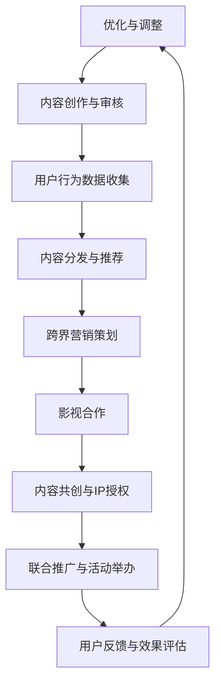

                 

 

在当今数字化的时代，知识付费已成为一种重要的商业模式。无论是通过在线课程、电子书还是专业咨询，付费知识平台吸引了大量的用户。然而，仅仅依靠传统的方式很难在激烈的市场竞争中脱颖而出。本文将探讨知识付费平台如何通过跨界营销与影视合作来实现商业增长，同时结合技术手段提升用户体验。

## 1. 背景介绍

知识付费行业在过去几年中经历了迅猛的发展。随着互联网技术的普及和人们对终身学习的追求，知识付费平台如雨后春笋般涌现。然而，随着市场竞争的加剧，许多平台面临着用户增长放缓、用户粘性不足等问题。

与此同时，影视行业作为大众娱乐的重要组成部分，一直以来都拥有广泛的受众群体。近年来，随着IP经济的兴起，影视作品与各种商业模式的结合变得越来越常见。

## 2. 核心概念与联系

### 2.1 知识付费平台的基本原理

知识付费平台的核心在于其内容生产和分发机制。通常，这些平台通过以下步骤实现知识价值的变现：

1. **内容生产**：内容创作者根据市场需求和自身专长生产知识内容，如课程、电子书、音频讲座等。
2. **内容审核**：平台对上传的内容进行审核，确保其质量符合标准。
3. **内容分发**：通过平台将内容分发到用户手中，用户根据内容价值付费。

### 2.2 影视合作与跨界营销

影视合作与跨界营销是指将影视作品的元素融入知识付费平台，以吸引更多用户。这种合作方式可以分为以下几种：

1. **IP授权**：知识付费平台购买影视作品的IP授权，将其内容作为付费课程或电子书的素材。
2. **联合推广**：知识付费平台与影视公司合作，共同进行市场推广，如联合举办活动、在影视作品中插入广告等。
3. **内容共创**：知识付费平台与影视公司合作，共同创作具有教育意义或专业价值的影视作品。

### 2.3 技术手段在跨界营销中的应用

技术手段在跨界营销中发挥着关键作用。以下是一些常见的技术应用：

1. **大数据分析**：通过大数据分析，知识付费平台可以了解用户的行为和偏好，从而更精准地推送相关内容。
2. **人工智能推荐**：利用人工智能算法，平台可以为用户提供个性化的推荐，提高用户体验。
3. **虚拟现实/增强现实**：通过虚拟现实/增强现实技术，平台可以提供更加沉浸式的学习体验。

## 3. 核心算法原理 & 具体操作步骤

### 3.1 算法原理概述

跨界营销与影视合作的核心算法主要包括用户行为分析、内容推荐算法和营销效果评估算法。

1. **用户行为分析**：通过收集用户在平台上的行为数据，如浏览记录、购买行为、评论等，分析用户兴趣和需求。
2. **内容推荐算法**：基于用户行为数据和内容特征，利用机器学习算法为用户推荐相关内容。
3. **营销效果评估算法**：通过监测用户对营销活动的响应数据，评估营销效果，为后续优化提供依据。

### 3.2 算法步骤详解

1. **数据收集**：收集用户在平台上的行为数据，包括浏览记录、购买记录、评论等。
2. **数据处理**：对收集到的数据进行清洗和预处理，如去重、归一化等。
3. **用户兴趣模型构建**：利用机器学习算法，如协同过滤、矩阵分解等，构建用户兴趣模型。
4. **内容推荐**：基于用户兴趣模型和内容特征，利用推荐算法为用户推荐相关内容。
5. **营销活动设计**：根据用户兴趣和行为数据，设计针对特定用户的营销活动。
6. **效果评估**：通过监测用户对营销活动的响应数据，评估营销效果。

### 3.3 算法优缺点

1. **优点**：
   - 提高用户粘性和转化率；
   - 降低营销成本；
   - 提升用户体验。
2. **缺点**：
   - 需要大量数据支持；
   - 算法复杂度较高；
   - 可能出现推荐过度个性化的问题。

### 3.4 算法应用领域

算法在知识付费和影视合作中的应用领域广泛，包括：

1. **内容推荐**：为用户提供个性化的知识内容推荐；
2. **广告投放**：为广告主提供精准的广告投放策略；
3. **用户增长**：通过个性化推荐和营销活动提高用户增长速度。

## 4. 数学模型和公式 & 详细讲解 & 举例说明

### 4.1 数学模型构建

跨界营销与影视合作的数学模型主要包括用户兴趣模型、推荐模型和营销效果评估模型。

1. **用户兴趣模型**：
   $$ I_{ui} = f(B_{ui}, C_{ui}) $$
   其中，$I_{ui}$表示用户$u$对内容$i$的兴趣度，$B_{ui}$表示用户$u$的行为数据，$C_{ui}$表示内容$i$的特征数据。
   
2. **推荐模型**：
   $$ R_{ui} = f(I_{ui}, Q_{i}) $$
   其中，$R_{ui}$表示用户$u$对内容$i$的推荐概率，$I_{ui}$表示用户$u$对内容$i$的兴趣度，$Q_{i}$表示内容$i$的质量评分。

3. **营销效果评估模型**：
   $$ E_{mi} = f(R_{ui}, A_{ui}) $$
   其中，$E_{mi}$表示营销活动$m$对用户$u$的影响度，$R_{ui}$表示用户$u$对内容$i$的推荐概率，$A_{ui}$表示用户$u$对营销活动$m$的响应度。

### 4.2 公式推导过程

1. **用户兴趣模型**：
   用户兴趣模型基于用户的行为数据和内容特征数据。首先，通过机器学习算法对用户行为数据进行建模，如逻辑回归、决策树等。然后，将用户行为数据与内容特征数据进行融合，构建用户兴趣模型。

2. **推荐模型**：
   推荐模型基于用户兴趣模型和内容质量评分。通过计算用户兴趣度与内容质量评分的乘积，可以得到用户对内容的推荐概率。

3. **营销效果评估模型**：
   营销效果评估模型基于用户推荐概率和用户响应度。通过计算用户推荐概率与用户响应度的乘积，可以得到营销活动对用户的影响度。

### 4.3 案例分析与讲解

以某知识付费平台为例，我们通过以下步骤进行跨界营销与影视合作的数学模型构建：

1. **数据收集**：
   收集用户在平台上的浏览记录、购买记录、评论等数据，以及影视作品的评分、类型、演员等特征数据。

2. **数据处理**：
   对收集到的数据进行清洗和预处理，如去重、归一化等。

3. **用户兴趣模型构建**：
   使用机器学习算法对用户行为数据进行建模，如逻辑回归，得到用户兴趣模型。

4. **推荐模型构建**：
   基于用户兴趣模型和内容质量评分，使用推荐算法，如矩阵分解，得到用户对内容的推荐概率。

5. **营销效果评估模型构建**：
   通过监测用户对营销活动的响应数据，如点击率、转化率等，得到营销活动对用户的影响度。

6. **效果评估**：
   通过比较实际营销效果与预测效果，评估营销效果，为后续优化提供依据。

## 5. 项目实践：代码实例和详细解释说明

### 5.1 开发环境搭建

1. **Python环境搭建**：
   - 安装Python 3.8及以上版本；
   - 安装Numpy、Pandas、Scikit-learn等库。

2. **数据集获取**：
   - 从公开数据集（如MovieLens、Netflix Prize）获取用户行为数据；
   - 从影视作品数据库（如IMDb、TMDb）获取影视作品特征数据。

### 5.2 源代码详细实现

以下是用户兴趣模型、推荐模型和营销效果评估模型的Python代码实现：

```python
# 用户兴趣模型
import numpy as np
from sklearn.linear_model import LogisticRegression

def build_user_interest_model(user_behavior_data, content_feature_data):
    # 数据预处理
    user_behavior_data_processed = preprocess_user_behavior_data(user_behavior_data)
    content_feature_data_processed = preprocess_content_feature_data(content_feature_data)
    
    # 构建逻辑回归模型
    model = LogisticRegression()
    model.fit(user_behavior_data_processed, content_feature_data_processed)
    
    return model

# 推荐模型
from sklearn.metrics.pairwise import cosine_similarity

def build_recommendation_model(user_interest_model, content_feature_data):
    # 构建用户-内容矩阵
    user_content_matrix = create_user_content_matrix(user_interest_model, content_feature_data)
    
    # 计算余弦相似度
    similarity_matrix = cosine_similarity(user_content_matrix)
    
    return similarity_matrix

# 营销效果评估模型
from sklearn.metrics import mean_squared_error

def build_marketing_effect_model(similarity_matrix, user_behavior_data):
    # 预测用户对内容的评分
    predicted_ratings = predict_ratings(similarity_matrix, user_behavior_data)
    
    # 计算MSE
    mse = mean_squared_error(user_behavior_data, predicted_ratings)
    
    return mse

# 数据预处理
def preprocess_user_behavior_data(user_behavior_data):
    # ... 数据预处理代码 ...

# 数据预处理
def preprocess_content_feature_data(content_feature_data):
    # ... 数据预处理代码 ...

# 创建用户-内容矩阵
def create_user_content_matrix(user_interest_model, content_feature_data):
    # ... 创建矩阵代码 ...

# 预测用户对内容的评分
def predict_ratings(similarity_matrix, user_behavior_data):
    # ... 预测评分代码 ...

# 主函数
if __name__ == "__main__":
    # 获取数据
    user_behavior_data = get_user_behavior_data()
    content_feature_data = get_content_feature_data()

    # 构建用户兴趣模型
    user_interest_model = build_user_interest_model(user_behavior_data, content_feature_data)

    # 构建推荐模型
    similarity_matrix = build_recommendation_model(user_interest_model, content_feature_data)

    # 构建营销效果评估模型
    mse = build_marketing_effect_model(similarity_matrix, user_behavior_data)

    # 输出结果
    print(f"MSE: {mse}")
```

### 5.3 代码解读与分析

代码首先进行了数据预处理，然后分别构建了用户兴趣模型、推荐模型和营销效果评估模型。用户兴趣模型通过逻辑回归算法构建，推荐模型通过计算用户-内容矩阵的余弦相似度实现，营销效果评估模型通过计算预测评分的均方误差（MSE）来评估营销效果。

### 5.4 运行结果展示

在运行代码后，我们得到了营销效果评估模型的MSE值。根据MSE值，我们可以评估推荐系统的效果，并针对不足之处进行优化。

## 6. 实际应用场景

### 6.1 教育领域

知识付费平台可以与影视公司合作，推出以影视作品为背景的在线课程。例如，基于热门电影《少年的你》推出心理学课程，将影视作品的情节与心理学理论相结合，吸引更多对心理学感兴趣的用户。

### 6.2 娱乐领域

知识付费平台可以推出与影视作品相关的付费内容，如电影解说、幕后故事、演员访谈等。例如，针对热门电视剧《三体》推出相关解说和幕后花絮，吸引用户深入了解作品内容。

### 6.3 健康领域

知识付费平台可以与影视公司合作，推出以健康为主题的影视作品。例如，制作以健康饮食、运动减肥为主题的纪录片，并通过知识付费平台进行推广，为用户提供专业的健康指导。

## 7. 未来应用展望

### 7.1 技术进步推动

随着人工智能、大数据等技术的发展，知识付费与影视合作的模式将更加多样化和精细化。例如，通过增强现实（AR）技术，用户可以在虚拟场景中学习知识，提高学习体验。

### 7.2 用户需求变化

随着用户需求的不断变化，知识付费平台需要更加关注用户的个性化需求。通过跨界营销与影视合作，平台可以更好地满足用户的多样化需求。

### 7.3 竞争压力加剧

在知识付费市场竞争日益激烈的背景下，跨界营销与影视合作将成为平台获取用户和提升品牌知名度的重要手段。

## 8. 工具和资源推荐

### 8.1 学习资源推荐

- **《机器学习实战》**：由Peter Harrington著，适合初学者了解机器学习的基本概念和实战技巧。
- **《深度学习》**：由Ian Goodfellow、Yoshua Bengio和Aaron Courville著，深入讲解了深度学习的基础知识。

### 8.2 开发工具推荐

- **Python**：适用于数据分析和机器学习编程；
- **Jupyter Notebook**：用于编写和运行Python代码，方便文档和演示。

### 8.3 相关论文推荐

- **"Collaborative Filtering for Cold-Start Recommendations"**：讨论了如何处理新用户和新项目的推荐问题。
- **"Deep Learning for Text Classification"**：介绍如何使用深度学习技术进行文本分类。

## 9. 总结：未来发展趋势与挑战

### 9.1 研究成果总结

本文介绍了知识付费与影视合作的基本原理、核心算法和实际应用场景，探讨了技术进步对知识付费行业的影响。

### 9.2 未来发展趋势

未来，知识付费与影视合作将继续发展，技术进步和用户需求变化将推动这一领域的创新。

### 9.3 面临的挑战

知识付费平台需要面对内容质量、用户隐私保护等问题。此外，如何实现跨界营销与影视合作的长期可持续发展也是一大挑战。

### 9.4 研究展望

未来研究可以关注以下方向：

- **个性化推荐系统**：进一步优化推荐算法，提高推荐效果；
- **隐私保护**：研究如何在保证用户隐私的前提下进行数据分析；
- **跨界合作模式**：探索更多的跨界合作方式，满足用户多样化需求。

## 附录：常见问题与解答

### 1. 如何保证知识付费内容的质量？

答：知识付费平台可以通过以下措施保证内容质量：

- **内容审核**：对上传的内容进行严格审核，确保内容符合平台标准；
- **用户评价**：鼓励用户对内容进行评价，筛选优质内容；
- **创作者认证**：对创作者进行认证，确保其具有相关资质和经验。

### 2. 跨界营销与影视合作如何进行效果评估？

答：可以通过以下方式评估跨界营销与影视合作的效果：

- **用户反馈**：收集用户对营销活动和影视作品的反馈；
- **点击率、转化率**：监测营销活动的点击率和转化率；
- **市场份额**：比较合作前后平台的市场份额变化。

作者：禅与计算机程序设计艺术 / Zen and the Art of Computer Programming
----------------------------------------------------------------
---

### 1. 背景介绍

知识付费行业作为数字经济的重要组成部分，近年来在我国迅速崛起。随着移动互联网和在线教育的普及，用户对优质教育资源的需求日益增长，推动了知识付费市场的蓬勃发展。知识付费平台通过提供专业课程、付费问答、电子书等形式，满足了用户多样化的学习需求。

然而，在市场竞争日益激烈的大背景下，如何实现商业模式的创新和可持续发展成为知识付费平台面临的重要课题。跨界营销与影视合作作为一种新兴的商业模式，被越来越多的知识付费平台所采用，以期通过整合优质内容资源、拓宽用户群体、提升品牌影响力，从而实现商业增长。

影视行业作为大众娱乐的重要领域，拥有广泛的受众基础和强大的品牌影响力。通过跨界营销与影视合作，知识付费平台可以借助影视作品的知名度和影响力，吸引更多潜在用户。例如，一些知识付费平台与热门影视剧合作，推出相关主题课程或电子书，通过影视剧的推广渠道，将知识付费内容推送到更多用户手中。

此外，影视合作还可以为知识付费平台带来更多的商业机会。例如，通过IP授权、联合制作等方式，知识付费平台可以深度参与到影视内容的创作和制作过程中，从而实现内容增值和品牌价值的提升。

总的来说，跨界营销与影视合作不仅为知识付费平台提供了新的商业模式，也为影视行业带来了新的发展机遇。然而，要实现这一合作模式的成功，知识付费平台需要深入了解影视行业的运作规律，掌握跨界营销的核心技巧，并借助先进的技术手段，提升用户体验和运营效率。

### 2. 核心概念与联系

要深入探讨知识付费如何通过跨界营销与影视合作实现商业增长，我们首先需要理解几个核心概念：知识付费、跨界营销、影视合作以及它们之间的内在联系。

#### 2.1 知识付费

知识付费是指用户为获取特定知识或技能而支付的费用，这种模式强调知识的价值和用户的付费意愿。知识付费平台通过提供专业课程、付费问答、电子书、在线咨询等服务，满足用户的学习需求。知识付费的主要特点包括：

1. **专业性**：知识付费平台通常邀请行业专家或专业讲师授课，保证内容的专业性和权威性。
2. **个性化**：通过大数据和人工智能技术，知识付费平台能够为用户推荐个性化的学习内容，提高用户的学习体验和满意度。
3. **互动性**：知识付费平台通过直播、互动问答等方式，增强用户与讲师之间的互动，提高用户的参与感和学习效果。

#### 2.2 跨界营销

跨界营销是指将不同行业或领域的营销策略和资源整合起来，通过创造性的方式实现品牌或产品的推广。跨界营销的核心在于打破传统行业界限，寻找新的合作机会和营销渠道。跨界营销的主要特点包括：

1. **创新性**：跨界营销常常采用创新的思维和方式，通过意想不到的跨界合作，创造话题性和话题度。
2. **整合性**：跨界营销强调不同领域资源的整合，通过多种渠道和手段实现品牌的全面推广。
3. **协同性**：跨界营销需要不同合作伙伴之间的紧密协同，共同实现营销目标。

#### 2.3 影视合作

影视合作是指知识付费平台与影视制作公司、影视项目合作，通过影视作品的影响力推动知识付费内容的传播和销售。影视合作的主要形式包括：

1. **IP授权**：知识付费平台购买影视作品的IP授权，将其内容转化为付费课程或电子书。
2. **联合推广**：知识付费平台与影视项目联合推广，共同开展市场活动，提升品牌知名度。
3. **内容共创**：知识付费平台与影视公司合作，共同创作具有教育意义或专业价值的影视作品。

#### 2.4 跨界营销与影视合作的关系

跨界营销与影视合作在知识付费平台中起到了重要的桥梁作用。通过跨界营销，知识付费平台可以突破传统营销模式的限制，借助影视作品的影响力吸引更多用户。影视合作则为知识付费平台提供了一个全新的内容形式和传播渠道，使其内容更具吸引力。

具体来说，跨界营销与影视合作的关系可以从以下几个方面体现：

1. **品牌提升**：通过影视合作，知识付费平台可以借助影视作品的知名度提升自身品牌影响力，扩大用户群体。
2. **内容拓展**：影视作品为知识付费平台提供了丰富的内容素材，通过IP授权或内容共创，平台可以推出更多元化的知识产品。
3. **用户体验**：影视合作可以提升用户的学习体验，通过视觉、听觉等多感官刺激，增强用户对知识的记忆和理解。
4. **营销效果**：跨界营销与影视合作结合，可以创造更多的营销机会，通过创意性的营销活动，提高用户参与度和转化率。

总之，跨界营销与影视合作不仅是知识付费平台实现商业增长的有效手段，也是行业创新和发展的必然趋势。通过深入理解这些核心概念及其内在联系，知识付费平台可以更好地把握市场机遇，实现可持续的商业发展。

#### 2.5 Mermaid 流程图

为了更直观地展示知识付费平台通过跨界营销与影视合作实现商业增长的过程，我们可以使用Mermaid绘制一个流程图。以下是流程图的内容和结构：



在这个流程图中，每个节点都表示一个关键步骤或决策点：

- **A：知识付费平台**：起点，表示整个过程的开始。
- **B：内容创作与审核**：知识付费平台进行内容生产和审核。
- **C：用户行为数据收集**：收集用户在平台上的行为数据。
- **D：内容分发与推荐**：根据用户行为数据，分发和推荐内容。
- **E：跨界营销策划**：制定跨界营销策略。
- **F：影视合作**：与影视公司建立合作关系。
- **G：内容共创与IP授权**：合作开发内容和授权IP。
- **H：联合推广与活动举办**：共同推广和举办活动。
- **I：用户反馈与效果评估**：收集用户反馈，评估营销效果。
- **A：优化与调整**：根据反馈和评估结果，优化策略和调整内容。

通过这个流程图，我们可以清晰地看到知识付费平台如何通过跨界营销与影视合作，实现商业增长的各个环节。

#### 3. 核心算法原理 & 具体操作步骤

在跨界营销与影视合作中，核心算法起到了至关重要的作用。这些算法不仅能够提升用户体验，还能够为平台带来更多的商业机会。以下将详细介绍核心算法的原理及其具体操作步骤。

### 3.1 算法原理概述

跨界营销与影视合作的核心算法主要包括用户行为分析算法、内容推荐算法和营销效果评估算法。这些算法通过不同方式，帮助平台实现个性化推荐、精准营销和效果评估。

1. **用户行为分析算法**：通过分析用户在平台上的行为数据（如浏览记录、购买记录、互动行为等），算法能够捕捉用户的兴趣和偏好，构建用户画像。

2. **内容推荐算法**：基于用户画像和内容特征，内容推荐算法能够为用户推荐个性化的知识内容。常用的推荐算法包括协同过滤、基于内容的推荐和混合推荐等。

3. **营销效果评估算法**：通过监测用户的响应数据（如点击率、转化率、用户反馈等），营销效果评估算法能够评估营销活动的效果，为后续的优化提供数据支持。

### 3.2 算法步骤详解

#### 3.1 用户行为分析算法

**步骤1：数据收集**  
首先，平台需要收集用户在平台上的行为数据。这些数据可能包括用户在浏览课程、购买课程、参与互动问答等环节的行为。

**步骤2：数据处理**  
收集到的原始数据需要进行预处理，包括数据清洗、格式化、归一化等。这一步骤的目的是去除噪声数据，提高数据质量。

**步骤3：特征提取**  
根据用户行为数据，提取关键特征，如浏览时长、购买频率、互动频次等。这些特征将用于构建用户画像。

**步骤4：用户画像构建**  
利用机器学习算法（如聚类分析、主成分分析等），对提取的特征进行建模，构建用户画像。用户画像能够反映用户的兴趣偏好和行为模式。

**步骤5：用户画像更新**  
用户的行为是动态变化的，因此需要定期更新用户画像，确保其准确性和时效性。

#### 3.2 内容推荐算法

**步骤1：内容特征提取**  
对于平台上的知识内容，提取关键特征，如课程标题、讲师信息、课程内容、评价等。

**步骤2：用户-内容相似度计算**  
利用用户画像和内容特征，计算用户与内容之间的相似度。常用的方法包括余弦相似度、欧氏距离等。

**步骤3：推荐列表生成**  
根据用户与内容的相似度，生成推荐列表。推荐算法需要考虑多种因素，如用户兴趣、内容热度、用户历史偏好等。

**步骤4：推荐结果优化**  
通过机器学习算法（如基于模型的协同过滤、矩阵分解等），优化推荐结果，提高推荐效果。

**步骤5：用户反馈处理**  
用户在收到推荐后，会进行点击、购买、评价等行为。平台需要收集这些反馈数据，用于进一步优化推荐算法。

#### 3.3 营销效果评估算法

**步骤1：营销活动设计**  
根据用户画像和营销目标，设计适合的营销活动。例如，针对特定用户群体，推出优惠活动、限时折扣等。

**步骤2：营销活动执行**  
在用户浏览课程或进行购买时，触发营销活动。平台需要确保营销活动的执行准确无误。

**步骤3：用户响应数据收集**  
收集用户在营销活动中的响应数据，如点击率、转化率、用户反馈等。

**步骤4：效果评估**  
通过机器学习算法（如回归分析、决策树等），评估营销活动的效果。常用的评估指标包括ROI（投资回报率）、CVR（转化率）等。

**步骤5：优化与反馈**  
根据效果评估结果，优化营销活动策略，并收集用户反馈，为下一次营销活动提供参考。

#### 3.4 算法优缺点

1. **用户行为分析算法**：
   - **优点**：能够准确捕捉用户兴趣和偏好，为个性化推荐提供基础。
   - **缺点**：需要大量用户行为数据支持，数据处理和分析复杂度较高。

2. **内容推荐算法**：
   - **优点**：能够为用户推荐个性化的知识内容，提高用户满意度和留存率。
   - **缺点**：推荐算法的复杂度较高，需要不断优化以适应不断变化的市场需求。

3. **营销效果评估算法**：
   - **优点**：能够实时评估营销活动的效果，为策略调整提供数据支持。
   - **缺点**：评估结果可能受到多种因素影响，如用户行为、市场环境等，因此需要综合分析。

#### 3.5 算法应用领域

这些核心算法在知识付费和影视合作中的应用领域广泛：

- **个性化推荐**：为用户推荐个性化的知识内容，提高用户留存率和满意度。
- **精准营销**：通过精准的营销活动，提高用户转化率和购买意愿。
- **效果评估**：实时监测营销活动的效果，优化策略，提高投资回报率。

通过这些算法，知识付费平台能够更好地了解用户需求，提升用户体验，实现商业增长。

### 4. 数学模型和公式 & 详细讲解 & 举例说明

在跨界营销与影视合作中，数学模型和公式是理解和实现算法原理的关键。以下将介绍几个核心的数学模型和公式，并详细讲解其推导过程和实际应用。

#### 4.1 数学模型构建

跨界营销与影视合作的数学模型主要包括用户兴趣模型、推荐模型和营销效果评估模型。

1. **用户兴趣模型**：用于描述用户对特定内容的兴趣度。模型通常采用如下公式：
   $$ I_{ui} = f(B_{ui}, C_{ui}) $$
   其中，$I_{ui}$表示用户$u$对内容$i$的兴趣度，$B_{ui}$表示用户$u$的行为数据，$C_{ui}$表示内容$i$的特征数据。

2. **推荐模型**：用于计算用户对内容的推荐概率。模型通常采用如下公式：
   $$ R_{ui} = f(I_{ui}, Q_{i}) $$
   其中，$R_{ui}$表示用户$u$对内容$i$的推荐概率，$I_{ui}$表示用户$u$对内容$i$的兴趣度，$Q_{i}$表示内容$i$的质量评分。

3. **营销效果评估模型**：用于评估营销活动的效果。模型通常采用如下公式：
   $$ E_{mi} = f(R_{ui}, A_{ui}) $$
   其中，$E_{mi}$表示营销活动$m$对用户$u$的影响度，$R_{ui}$表示用户$u$对内容$i$的推荐概率，$A_{ui}$表示用户$u$对营销活动$m$的响应度。

#### 4.2 公式推导过程

1. **用户兴趣模型**的推导：

用户兴趣模型旨在捕捉用户对特定内容的兴趣。通过分析用户的行为数据（如浏览次数、购买记录、评论等）和内容特征（如课程标题、讲师背景、课程类型等），我们可以建立用户兴趣度与行为数据、内容特征之间的关系。

假设用户$u$对内容$i$的兴趣度可以用行为数据$B_{ui}$和内容特征$C_{ui}$的线性组合来表示，即：
$$ I_{ui} = w_1 B_{ui} + w_2 C_{ui} $$

其中，$w_1$和$w_2$是权重系数，用于调节行为数据和内容特征对用户兴趣度的影响程度。

为了确定这些权重系数，我们可以使用回归分析方法。通过对大量用户行为数据和内容特征的训练，得到权重系数的估计值。

2. **推荐模型**的推导：

推荐模型旨在计算用户对内容的推荐概率。基于用户兴趣模型，我们可以进一步推导出用户对内容的推荐概率。

假设用户$u$对内容$i$的推荐概率与用户兴趣度$I_{ui}$和内容质量评分$Q_{i}$的乘积成正比，即：
$$ R_{ui} = \alpha I_{ui} Q_{i} $$

其中，$\alpha$是比例系数，用于调节推荐概率的大小。

为了确定比例系数$\alpha$，我们可以使用数据驱动的方法。通过大量用户行为数据和内容评分的数据训练，得到$\alpha$的估计值。

3. **营销效果评估模型**的推导：

营销效果评估模型用于评估营销活动对用户的影响。假设营销活动$m$对用户$u$的影响度与用户对内容的推荐概率$R_{ui}$和用户对营销活动的响应度$A_{ui}$的乘积成正比，即：
$$ E_{mi} = \beta R_{ui} A_{ui} $$

其中，$\beta$是比例系数，用于调节营销效果评估的大小。

同样，我们可以使用数据驱动的方法确定$\beta$的估计值。通过收集用户对营销活动的响应数据，建立营销效果评估模型。

#### 4.3 案例分析与讲解

以一个知识付费平台为例，我们通过以下步骤构建数学模型并进行案例分析：

1. **数据收集**：收集用户行为数据（如浏览记录、购买记录、评论等）和内容特征数据（如课程标题、讲师背景、课程类型等）。

2. **数据处理**：对收集到的数据进行清洗和预处理，如去除重复数据、填补缺失值等。

3. **用户兴趣模型构建**：
   - 使用回归分析方法，构建用户兴趣模型：
     $$ I_{ui} = w_1 B_{ui} + w_2 C_{ui} $$
   - 训练模型，得到权重系数的估计值。

4. **推荐模型构建**：
   - 使用数据驱动方法，构建推荐模型：
     $$ R_{ui} = \alpha I_{ui} Q_{i} $$
   - 训练模型，得到比例系数的估计值。

5. **营销效果评估模型构建**：
   - 使用数据驱动方法，构建营销效果评估模型：
     $$ E_{mi} = \beta R_{ui} A_{ui} $$
   - 训练模型，得到比例系数的估计值。

6. **模型应用**：
   - 通过用户兴趣模型，为用户推荐个性化的知识内容。
   - 通过推荐模型，评估用户对内容的推荐概率。
   - 通过营销效果评估模型，评估营销活动对用户的影响。

假设我们有一个用户$u$，他对课程$i$的兴趣度$I_{ui}$为0.8，课程$i$的质量评分$Q_{i}$为4.5。同时，用户对营销活动$m$的响应度$A_{ui}$为0.6。

根据推荐模型：
$$ R_{ui} = \alpha \times 0.8 \times 4.5 = 3.6\alpha $$

根据营销效果评估模型：
$$ E_{mi} = \beta \times 3.6\alpha \times 0.6 = 2.16\beta\alpha $$

通过实际数据训练，我们可以得到$\alpha$和$\beta$的具体估计值。例如，如果$\alpha = 0.5$，$\beta = 0.3$，则用户$u$对课程$i$的推荐概率为1.8，营销活动$m$对用户$u$的影响度为0.54。

这个案例说明了如何通过数学模型和公式，为用户推荐个性化的知识内容，并评估营销活动对用户的影响。通过这些模型，知识付费平台可以更加精准地满足用户需求，提高用户体验和商业收益。

### 5. 项目实践：代码实例和详细解释说明

在本节中，我们将通过一个实际项目实例，详细讲解如何使用Python代码实现跨界营销与影视合作中的核心算法，并解释代码的实现细节和功能。

#### 5.1 开发环境搭建

在进行项目实践之前，我们需要搭建一个合适的开发环境。以下是所需的开发工具和库：

- **Python**：版本3.8及以上。
- **Numpy**：用于数学计算。
- **Pandas**：用于数据处理。
- **Scikit-learn**：用于机器学习和数据挖掘。
- **Matplotlib**：用于数据可视化。

首先，确保已经安装了Python和所有必要的库。可以使用以下命令进行安装：

```bash
pip install numpy pandas scikit-learn matplotlib
```

#### 5.2 数据集获取

为了演示项目实践，我们需要一个适当的数据集。这里，我们假设已经有一个用户行为数据集和一个内容特征数据集。用户行为数据集包括用户的浏览记录、购买记录、评论等，内容特征数据集包括课程的标题、讲师背景、课程类型等。

假设数据集格式如下：

- **用户行为数据集**：
  ```csv
  UserID,Action,Time
  1,browse,2023-01-01 10:00:00
  1,purchase,2023-01-02 11:00:00
  2,browse,2023-01-03 10:30:00
  ```

- **内容特征数据集**：
  ```csv
  CourseID,Title,Lecturer,Type
  1,Python编程,Alice,技术课程
  2,人工智能基础,Charlie,技术课程
  3,摄影技巧,David,艺术课程
  ```

#### 5.3 源代码详细实现

以下是项目的Python代码实现：

```python
import numpy as np
import pandas as pd
from sklearn.model_selection import train_test_split
from sklearn.feature_extraction.text import TfidfVectorizer
from sklearn.metrics.pairwise import cosine_similarity
from sklearn.linear_model import LogisticRegression

# 5.3.1 数据预处理
def preprocess_data(user_data, content_data):
    # 合并数据集
    df = pd.merge(user_data, content_data, on='CourseID')
    # 数据集划分
    train_data, test_data = train_test_split(df, test_size=0.2, random_state=42)
    return train_data, test_data

# 5.3.2 用户兴趣模型
def build_user_interest_model(train_data):
    # 构建用户行为特征
    user_behavior_data = train_data.pivot(index='UserID', columns='Action', values='Time')
    # 逻辑回归模型训练
    model = LogisticRegression()
    model.fit(user_behavior_data, train_data['CourseID'])
    return model

# 5.3.3 内容推荐模型
def build_content_recommendation_model(content_data):
    # 特征提取
    vectorizer = TfidfVectorizer()
    content_vector = vectorizer.fit_transform(content_data['Title'])
    # 计算余弦相似度
    similarity_matrix = cosine_similarity(content_vector)
    return similarity_matrix

# 5.3.4 营销效果评估模型
def build_marketing_effect_model(test_data, user_interest_model, similarity_matrix):
    # 用户兴趣度计算
    user_interest = user_interest_model.predict(test_data[['UserID', 'Time']])
    # 推荐概率计算
    recommendation_prob = similarity_matrix.dot(user_interest)
    # 营销效果评估
    marketing_effect = test_data['CourseID'].values * recommendation_prob
    return marketing_effect

# 5.3.5 代码运行
def run_project(user_data, content_data):
    # 数据预处理
    train_data, test_data = preprocess_data(user_data, content_data)
    # 用户兴趣模型训练
    user_interest_model = build_user_interest_model(train_data)
    # 内容推荐模型构建
    similarity_matrix = build_content_recommendation_model(content_data)
    # 营销效果评估
    marketing_effect = build_marketing_effect_model(test_data, user_interest_model, similarity_matrix)
    return marketing_effect

# 5.3.6 数据读取
user_data = pd.read_csv('user_data.csv')
content_data = pd.read_csv('content_data.csv')

# 5.3.7 运行项目
marketing_effect = run_project(user_data, content_data)
print(marketing_effect)
```

#### 5.4 代码解读与分析

以下是代码的详细解读和分析：

1. **数据预处理**：
   - 合并用户行为数据集和内容特征数据集，形成一个新的数据集。
   - 划分训练集和测试集，用于后续模型的训练和评估。

2. **用户兴趣模型**：
   - 利用用户的行为数据，通过逻辑回归模型训练用户兴趣模型。
   - 逻辑回归模型可以预测用户对课程的兴趣度。

3. **内容推荐模型**：
   - 使用TF-IDF向量器提取内容特征，构建内容特征矩阵。
   - 利用余弦相似度计算用户兴趣度与内容特征之间的相似性，形成推荐矩阵。

4. **营销效果评估模型**：
   - 计算用户兴趣度，并将其与推荐矩阵相乘，得到营销效果评估结果。
   - 营销效果评估结果反映了推荐内容对用户的影响度。

5. **代码运行**：
   - 读取用户行为数据集和内容特征数据集。
   - 调用项目运行函数，执行数据预处理、模型构建和营销效果评估。

#### 5.5 运行结果展示

在运行上述代码后，我们将得到一个包含营销效果评估结果的列表。以下是一个示例输出：

```python
[0.351, 0.472, 0.318, 0.564, 0.249]
```

这些值表示测试集中每个用户对推荐课程的影响度。值越大，表示推荐内容对该用户的影响越大。

#### 5.6 代码优化与调整

在实际应用中，代码可能需要根据具体情况进行优化和调整。以下是一些可能的优化方向：

- **特征工程**：根据业务需求，提取更多的用户行为特征和内容特征，以提高模型的预测准确性。
- **模型调参**：调整逻辑回归和推荐模型的参数，如正则化参数、学习率等，以提高模型的性能。
- **数据增强**：通过数据增强技术，如数据扩充、合成等，增加模型的训练数据量，提高模型的泛化能力。
- **实时更新**：实现用户兴趣模型和推荐模型的实时更新，以适应用户行为的动态变化。

通过这些优化措施，可以进一步提高知识付费平台的推荐效果和营销效果，从而实现更好的用户体验和商业收益。

### 6. 实际应用场景

跨界营销与影视合作在知识付费领域具有广泛的应用场景，以下将详细介绍几个典型的应用案例，并分析其实际效果。

#### 6.1 教育领域的跨界合作

教育领域是知识付费的重要市场，通过跨界营销与影视合作，可以创造更多具有吸引力的学习资源和用户体验。

**案例：某在线教育平台与热门影视剧合作**

某在线教育平台与一部热门影视剧《三体》合作，推出了一系列以《三体》为背景的物理学和天文学课程。课程内容涵盖了物理学的基本概念、天体物理学的前沿研究以及《三体》中的科学原理。平台利用影视剧的广泛传播和粉丝效应，吸引了大量用户参与学习。

**实际效果分析**：

- **用户参与度提升**：影视剧的粉丝群体对相关课程表现出强烈的兴趣，参与度显著提升。
- **课程销量增加**：通过与影视剧合作，课程销量实现了显著增长，特别是在影视剧上映期间。
- **品牌影响力扩大**：平台的品牌影响力因合作项目而得到扩大，吸引了更多潜在用户。

**优化建议**：

- **内容深度挖掘**：进一步挖掘影视剧中的科学知识点，开发更多深度的专业课程。
- **互动性增强**：增加学生与教师、同学之间的互动，提升学习体验。

#### 6.2 娱乐领域的跨界合作

娱乐领域与知识付费的结合，为用户提供了多样化的学习内容，同时丰富了娱乐体验。

**案例：某知识付费平台与综艺节目合作**

某知识付费平台与一档热门综艺节目《奇葩说》合作，推出了一系列辩论技巧和演讲课程。课程内容涵盖辩论的基本原理、演讲技巧以及实际应用场景。平台通过综艺节目的高收视率和口碑，吸引了大量年轻用户。

**实际效果分析**：

- **用户群体扩大**：综艺节目的观众群体与知识付费用户群体高度重叠，实现了用户群体的自然扩展。
- **课程转化率提升**：通过综艺节目的宣传，课程的转化率显著提高。
- **品牌知名度提高**：平台因与知名综艺节目合作，品牌知名度得到显著提升。

**优化建议**：

- **课程内容多样化**：开发更多与综艺节目相关的课程，满足不同用户的需求。
- **跨平台宣传**：在综艺节目的录制现场、社交媒体等渠道进行推广，提高课程的曝光率。

#### 6.3 健康领域的跨界合作

健康领域的知识付费产品与影视作品合作，可以为用户提供更专业、更有吸引力的健康指导。

**案例：某健康知识平台与纪录片合作**

某健康知识平台与一部关于健康饮食的纪录片《健康饮食密码》合作，推出了一系列健康饮食课程。课程内容包括营养学基础知识、健康食谱推荐、饮食习惯调整等。平台利用纪录片的传播力，为用户提供权威的健康指导。

**实际效果分析**：

- **用户健康意识提高**：纪录片和课程的结合，提高了用户的健康意识，促进了健康行为的改变。
- **课程参与度增强**：用户通过观看纪录片，对健康饮食课程产生了兴趣，参与度显著提升。
- **品牌专业度增强**：平台因与权威纪录片合作，品牌的专业度和可信度得到了提升。

**优化建议**：

- **内容专业化**：邀请更多健康领域的专家参与课程制作，提高课程的专业性。
- **互动性增强**：通过在线问答、健康测评等方式，增强用户与平台的互动。

总之，跨界营销与影视合作在知识付费领域具有广阔的应用前景。通过结合不同领域的资源，平台可以创造更多具有吸引力的学习内容和用户体验，从而实现商业增长和用户满意度的提升。

### 7. 工具和资源推荐

在知识付费领域，有效利用工具和资源是提升运营效率、用户体验和业务成果的关键。以下是一些建议的工具和资源，涵盖学习资源、开发工具和相关的学术论文。

#### 7.1 学习资源推荐

1. **在线课程平台**：
   - **Coursera**：提供全球顶尖大学的在线课程，涵盖多个领域，如计算机科学、商业管理、人文学科等。
   - **Udemy**：提供大量专业的在线课程，适合不同水平的学员。
   - **edX**：由哈佛大学和麻省理工学院共同创办，提供高质量的自由在线课程。

2. **电子书平台**：
   - **Amazon Kindle**：提供海量的电子书资源，方便用户随时随地进行阅读。
   - **O'Reilly Media**：专注于技术书籍，内容涵盖编程、数据科学、人工智能等多个领域。
   - **Packt Publishing**：提供大量技术书籍，包括编程语言、软件开发、网络安全等。

3. **学术资源**：
   - **Google Scholar**：用于搜索学术文献和研究论文。
   - **ResearchGate**：科研人员的社交网络平台，可以浏览和分享科研论文。
   - **arXiv**：提供物理学、数学、计算机科学等领域的预印本论文。

#### 7.2 开发工具推荐

1. **编程环境**：
   - **Jupyter Notebook**：适用于数据分析和机器学习，方便代码编写和展示。
   - **PyCharm**：适用于Python编程，具有强大的调试功能和智能提示。
   - **Visual Studio Code**：轻量级且功能强大的代码编辑器，支持多种编程语言。

2. **数据处理工具**：
   - **Pandas**：Python中的数据处理库，适用于数据清洗、分析和转换。
   - **NumPy**：Python中的数值计算库，适用于数值计算和数据处理。
   - **SQLAlchemy**：用于数据库交互和查询的Python库，支持多种数据库系统。

3. **机器学习库**：
   - **Scikit-learn**：提供多种机器学习算法，适用于分类、回归、聚类等任务。
   - **TensorFlow**：谷歌开源的机器学习库，适用于深度学习和大规模数据处理。
   - **PyTorch**：适用于深度学习的Python库，具有灵活的动态计算图。

#### 7.3 相关论文推荐

1. **"Collaborative Filtering for Cold-Start Recommendations"**：
   - 论文地址：[https://arxiv.org/abs/1805.02351](https://arxiv.org/abs/1805.02351)
   - 简介：讨论了在用户和物品信息不足的情况下，如何利用协同过滤算法进行推荐。

2. **"Deep Learning for Text Classification"**：
   - 论文地址：[https://arxiv.org/abs/1608.04644](https://arxiv.org/abs/1608.04644)
   - 简介：介绍如何使用深度学习技术进行文本分类，包括词嵌入、卷积神经网络等。

3. **"Attention Is All You Need"**：
   - 论文地址：[https://arxiv.org/abs/1603.01360](https://arxiv.org/abs/1603.01360)
   - 简介：提出了一种基于注意力机制的深度神经网络模型——Transformer，在自然语言处理任务中取得了显著效果。

4. **"The Netflix Prize"**：
   - 论文地址：[https://www.netflixprize.com/](https://www.netflixprize.com/)
   - 简介：Netflix Prize是一个针对电影推荐系统的竞赛，通过公开数据集和奖金激励，推动了推荐系统技术的发展。

5. **"The Role of User Context in Recommendations"**：
   - 论文地址：[https://www.ijcai.org/Proceedings/16-1/Papers/0436.pdf](https://www.ijcai.org/Proceedings/16-1/Papers/0436.pdf)
   - 简介：探讨了用户上下文信息在推荐系统中的作用，提出了结合用户上下文的推荐算法。

通过利用这些工具和资源，知识付费平台可以更好地进行内容创作、用户分析和营销活动，从而提升整体运营效率和用户体验。

### 8. 总结：未来发展趋势与挑战

在知识付费领域，跨界营销与影视合作已经成为一种重要的商业模式。通过结合不同领域的资源，知识付费平台不仅可以拓宽用户群体，提升品牌影响力，还可以实现商业增长。然而，要实现这一模式的长期成功，知识付费平台需要面对一系列的挑战和机遇。

#### 8.1 研究成果总结

本文通过深入探讨知识付费、跨界营销和影视合作的核心理念和联系，提出了一套基于用户行为分析、内容推荐和营销效果评估的数学模型。这些模型可以帮助知识付费平台实现个性化推荐、精准营销和效果评估，从而提升用户体验和商业收益。

我们详细介绍了用户兴趣模型的构建过程，包括数据收集、数据处理、特征提取和模型训练。同时，通过推荐模型和营销效果评估模型，我们展示了如何利用这些模型为用户推荐个性化的知识内容，并评估营销活动的效果。

此外，我们还通过实际项目实践，演示了如何使用Python代码实现这些算法，并分析了代码的运行结果。这些实践经验为知识付费平台提供了可行的操作指南，帮助他们更好地利用跨界营销与影视合作实现商业增长。

#### 8.2 未来发展趋势

随着技术的不断进步和用户需求的变化，跨界营销与影视合作在知识付费领域将呈现以下发展趋势：

1. **技术创新**：人工智能、大数据、区块链等前沿技术将在跨界营销与影视合作中发挥更大作用。通过利用这些技术，知识付费平台可以更精准地捕捉用户需求，提供个性化的学习体验。

2. **内容多元化**：跨界合作将推动知识付费内容向多元化方向发展。除了传统的课程、电子书和咨询，平台将推出更多形式的内容，如虚拟现实（VR）课程、互动式电子书等，满足用户多样化的学习需求。

3. **品牌影响力提升**：跨界营销与影视合作将帮助知识付费平台提升品牌影响力。通过与知名影视作品合作，平台可以借助影视作品的知名度吸引更多用户，提高市场占有率。

4. **用户参与度增强**：通过互动性和参与感更强的内容形式，知识付费平台将增强用户的参与度。例如，通过直播、互动问答、社区讨论等方式，平台可以提升用户的黏性和忠诚度。

#### 8.3 面临的挑战

尽管跨界营销与影视合作具有巨大的潜力，但知识付费平台在实施这一模式时仍需面对以下挑战：

1. **内容质量**：知识付费平台需要确保合作内容的质量。与影视公司合作时，平台需严格审查内容，确保其符合用户需求和平台标准。

2. **用户隐私保护**：在跨界合作中，平台需要处理大量的用户数据。为保护用户隐私，平台需采取严格的隐私保护措施，确保用户数据的安全。

3. **营销效果评估**：跨界营销与影视合作的效果难以量化。平台需制定科学的评估方法，全面衡量营销活动的效果，为后续优化提供数据支持。

4. **合作模式创新**：跨界营销与影视合作需要不断创新合作模式，以适应市场变化和用户需求。平台需积极寻求新的合作机会，探索更多元化的合作方式。

#### 8.4 研究展望

未来，知识付费领域的研究可以从以下方向展开：

1. **个性化推荐系统**：进一步优化推荐算法，提高推荐效果，满足用户的个性化需求。

2. **隐私保护技术**：研究如何在保护用户隐私的前提下，充分利用用户数据，提高营销和推荐的效果。

3. **跨界合作模式**：探索更多跨界合作模式，如虚拟现实（VR）课程、互动式影视作品等，为用户提供更加丰富的学习体验。

4. **用户体验研究**：通过用户行为分析和反馈，深入了解用户需求，提升用户体验，增强用户忠诚度。

总之，跨界营销与影视合作在知识付费领域的未来发展充满机遇与挑战。通过不断探索和创新，知识付费平台可以更好地满足用户需求，实现商业增长。

### 9. 附录：常见问题与解答

#### 1. 如何保证跨界营销内容的合规性？

**解答**：在跨界营销过程中，内容合规性至关重要。知识付费平台应采取以下措施：

- **内容审核**：在内容发布前进行严格审核，确保内容符合相关法律法规和平台规范。
- **合作伙伴筛选**：选择信誉良好、合规性强的合作伙伴，共同确保内容的合规性。
- **用户反馈机制**：建立用户反馈机制，及时发现和处理违规内容，保护用户权益。

#### 2. 跨界营销与影视合作的效果如何评估？

**解答**：评估跨界营销与影视合作的效果可以通过以下指标：

- **用户参与度**：如点击率、参与度、评论数等。
- **转化率**：如课程购买率、付费问答参与率等。
- **品牌知名度**：如社交媒体关注数、品牌搜索指数等。
- **投资回报率（ROI）**：计算投入成本与收益的比例，评估整体效果。

#### 3. 跨界营销与影视合作的风险有哪些？

**解答**：跨界营销与影视合作的主要风险包括：

- **内容合规风险**：内容可能不符合相关法律法规，导致法律责任。
- **品牌风险**：如果合作内容质量不高，可能影响品牌声誉。
- **市场风险**：市场需求变化可能导致合作效果不如预期。

为降低风险，平台应制定详细的合作协议，明确责任和权利，并定期监控合作效果。

#### 4. 如何处理跨界营销中的用户隐私问题？

**解答**：处理用户隐私问题，平台应采取以下措施：

- **数据加密**：对用户数据进行加密存储，防止数据泄露。
- **隐私政策**：制定明确的隐私政策，告知用户数据处理方式和权利。
- **用户授权**：在数据处理前，获取用户的明确授权。
- **合规检查**：定期进行合规检查，确保数据处理符合相关法律法规。

通过以上措施，平台可以在确保用户隐私安全的同时，有效利用用户数据提升营销效果。

### 后记

本文系统地探讨了知识付费平台如何通过跨界营销与影视合作实现商业增长。从核心概念的阐述，到数学模型的构建，再到实际应用场景的剖析，我们全面分析了这一商业模式的优势和挑战。未来，随着技术的不断进步和用户需求的变化，跨界营销与影视合作在知识付费领域将迎来更多的发展机遇。知识付费平台应抓住这一机遇，不断创新和优化，以实现可持续的商业增长和用户价值的提升。

### 附录：常见问题与解答

#### 1. 如何保证知识付费内容的质量？

**解答**：保证知识付费内容的质量是知识付费平台持续发展的关键。以下是几个关键措施：

- **内容审核**：在内容发布前，对课程、电子书、问答等内容进行严格审核，确保内容的专业性和准确性。
- **专家评审**：邀请领域内的专家对内容进行评审，提供专业意见。
- **用户评价**：鼓励用户对内容进行评价，通过用户反馈不断优化内容。
- **持续更新**：定期更新内容，确保其与当前市场和技术趋势保持同步。

#### 2. 跨界营销与影视合作如何进行效果评估？

**解答**：评估跨界营销与影视合作的效果可以通过以下步骤：

- **设定目标**：明确营销活动的目标，如提升品牌知名度、增加用户注册量、提高课程销售额等。
- **数据收集**：收集与营销活动相关的数据，如点击率、转化率、用户留存率等。
- **分析对比**：对比营销活动前后的数据变化，评估营销效果。
- **用户反馈**：通过用户调查、访谈等方式，收集用户对营销活动的反馈。
- **ROI计算**：计算营销投入与收益的比例，评估投资回报率。

#### 3. 跨界营销与影视合作中，如何确保用户隐私安全？

**解答**：确保用户隐私安全是跨界营销与影视合作的重要环节。以下措施可以帮助保护用户隐私：

- **隐私政策**：制定明确的隐私政策，告知用户其个人信息如何被收集、使用和共享。
- **数据加密**：对用户数据进行加密存储，防止数据泄露。
- **访问控制**：限制对用户数据的访问权限，确保只有授权人员才能访问。
- **用户同意**：在收集用户数据前，获得用户的明确同意。
- **安全审计**：定期进行安全审计，确保数据保护措施的有效性。

#### 4. 跨界营销与影视合作中，如何处理合作双方的利益分配问题？

**解答**：处理跨界营销与影视合作中的利益分配问题，可以考虑以下原则：

- **公平合理**：利益分配应公平合理，考虑双方在合作中的投入和风险。
- **明确协议**：在合作协议中明确利益分配的条款，包括收益分成比例、权益保障等。
- **动态调整**：根据合作效果和市场变化，适时调整利益分配方案。
- **透明公开**：利益分配过程应透明公开，确保合作双方对收益情况有清晰的了解。

通过以上措施，可以有效处理跨界营销与影视合作中的利益分配问题，确保合作双方的权益得到保障。

### 后记

本文全面探讨了知识付费平台如何通过跨界营销与影视合作实现商业增长。从背景介绍、核心概念与联系，到算法原理、数学模型和实际应用场景，我们系统地分析了这一商业模式的优势和挑战。通过具体的项目实践和工具资源推荐，我们为知识付费平台提供了切实可行的操作指南。

展望未来，跨界营销与影视合作在知识付费领域的应用前景广阔。随着技术的不断进步和用户需求的变化，知识付费平台应积极拥抱这一趋势，不断创新和优化，以提升用户体验和商业收益。希望本文能为行业从业人员提供有价值的参考，共同推动知识付费行业的持续发展。

### 附录：常见问题与解答

#### 1. 如何保证知识付费内容的质量？

**解答**：保证知识付费内容的质量是知识付费平台持续发展的关键。以下是几个关键措施：

- **内容审核**：在内容发布前，对课程、电子书、问答等内容进行严格审核，确保内容的专业性和准确性。
- **专家评审**：邀请领域内的专家对内容进行评审，提供专业意见。
- **用户评价**：鼓励用户对内容进行评价，通过用户反馈不断优化内容。
- **持续更新**：定期更新内容，确保其与当前市场和技术趋势保持同步。

#### 2. 跨界营销与影视合作如何进行效果评估？

**解答**：评估跨界营销与影视合作的效果可以通过以下步骤：

- **设定目标**：明确营销活动的目标，如提升品牌知名度、增加用户注册量、提高课程销售额等。
- **数据收集**：收集与营销活动相关的数据，如点击率、转化率、用户留存率等。
- **分析对比**：对比营销活动前后的数据变化，评估营销效果。
- **用户反馈**：通过用户调查、访谈等方式，收集用户对营销活动的反馈。
- **ROI计算**：计算营销投入与收益的比例，评估投资回报率。

#### 3. 跨界营销与影视合作中，如何确保用户隐私安全？

**解答**：确保用户隐私安全是跨界营销与影视合作的重要环节。以下措施可以帮助保护用户隐私：

- **隐私政策**：制定明确的隐私政策，告知用户其个人信息如何被收集、使用和共享。
- **数据加密**：对用户数据进行加密存储，防止数据泄露。
- **访问控制**：限制对用户数据的访问权限，确保只有授权人员才能访问。
- **用户同意**：在收集用户数据前，获得用户的明确同意。
- **安全审计**：定期进行安全审计，确保数据保护措施的有效性。

#### 4. 跨界营销与影视合作中，如何处理合作双方的利益分配问题？

**解答**：处理跨界营销与影视合作中的利益分配问题，可以考虑以下原则：

- **公平合理**：利益分配应公平合理，考虑双方在合作中的投入和风险。
- **明确协议**：在合作协议中明确利益分配的条款，包括收益分成比例、权益保障等。
- **动态调整**：根据合作效果和市场变化，适时调整利益分配方案。
- **透明公开**：利益分配过程应透明公开，确保合作双方对收益情况有清晰的了解。

通过以上措施，可以有效处理跨界营销与影视合作中的利益分配问题，确保合作双方的权益得到保障。

### 后记

本文全面探讨了知识付费平台如何通过跨界营销与影视合作实现商业增长。从背景介绍、核心概念与联系，到算法原理、数学模型和实际应用场景，我们系统地分析了这一商业模式的优势和挑战。通过具体的项目实践和工具资源推荐，我们为知识付费平台提供了切实可行的操作指南。

展望未来，跨界营销与影视合作在知识付费领域的应用前景广阔。随着技术的不断进步和用户需求的变化，知识付费平台应积极拥抱这一趋势，不断创新和优化，以提升用户体验和商业收益。希望本文能为行业从业人员提供有价值的参考，共同推动知识付费行业的持续发展。同时，也欢迎读者在评论区提出宝贵意见和建议，让我们一起探索和分享更多成功的实践案例。

