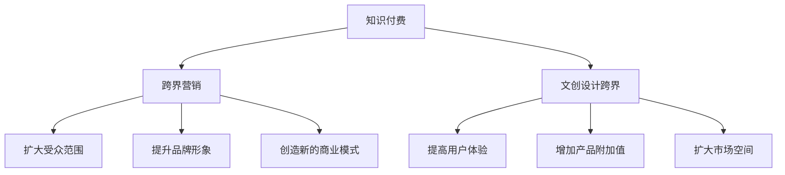

                 

### 1. 背景介绍

随着互联网和信息技术的快速发展，知识付费市场逐渐兴起，越来越多的个人和机构开始通过平台提供专业知识和技能的付费内容。然而，在竞争日益激烈的当下，如何实现知识付费的跨界营销与文创设计跨界，成为众多知识创作者和企业关注的焦点。

知识付费，指的是用户为了获取特定领域的专业知识和技能，愿意支付一定费用的行为。这种模式在互联网时代得到了迅速发展，各类在线教育平台、知识分享平台如雨后春笋般涌现。文创设计，则是指文化创意产业中的设计活动，涵盖视觉设计、产品设计、环境设计等多个领域。文创设计跨界，意味着将知识付费与文创设计相结合，创造出新的商业模式和市场空间。

本文将探讨知识付费如何实现跨界营销与文创设计跨界，为知识创作者和企业提供一些实用的策略和案例。

### 2. 核心概念与联系

#### 2.1 知识付费与跨界营销

知识付费的核心在于价值的传递，即通过专业知识和技能的传授，帮助用户解决问题、提升能力。而跨界营销，则是通过不同领域、行业之间的互动和合作，实现资源的整合和价值的最大化。知识付费与跨界营销的结合，可以产生以下效应：

1. **扩大受众范围**：通过跨界合作，知识付费的内容可以触达更广泛的受众，提高市场占有率。
2. **提升品牌形象**：跨界营销能够增强知识付费产品的独特性和吸引力，提升品牌形象。
3. **创造新的商业模式**：跨界营销为知识付费带来了更多的盈利渠道，如联名产品、定制服务等。

#### 2.2 知识付费与文创设计跨界

文创设计跨界，是指将知识付费与文创设计相结合，创造出具有独特文化内涵和艺术价值的产品或服务。这种跨界可以产生以下效果：

1. **提高用户体验**：通过文创设计，知识付费产品可以更具个性和魅力，提高用户体验。
2. **增加产品附加值**：文创设计跨界为知识付费产品赋予了艺术价值和情感价值，提高了产品的附加值。
3. **扩大市场空间**：文创设计跨界为知识付费开辟了新的市场，如艺术品市场、礼品市场等。

#### 2.3 Mermaid 流程图

下面是一个关于知识付费与跨界营销、文创设计跨界联系的 Mermaid 流程图：



### 3. 核心算法原理 & 具体操作步骤

#### 3.1 算法原理概述

知识付费实现跨界营销与文创设计跨界，需要遵循以下核心算法原理：

1. **用户需求分析**：通过数据分析，了解用户在知识付费和文创设计领域的需求，为跨界营销和设计提供依据。
2. **跨界合作策略**：根据用户需求，寻找合适的跨界合作伙伴，制定跨界营销和设计策略。
3. **内容创作与推广**：结合跨界合作策略，创作具有吸引力的知识付费内容和文创产品设计，并进行推广。
4. **用户体验优化**：根据用户反馈，不断优化知识付费内容和文创产品设计，提高用户体验。

#### 3.2 算法步骤详解

1. **用户需求分析**：
   - 数据收集：收集用户在知识付费和文创设计领域的浏览、搜索、购买等行为数据。
   - 数据分析：利用数据分析工具，对用户行为数据进行挖掘和分析，了解用户需求和偏好。

2. **跨界合作策略**：
   - 合作伙伴筛选：根据用户需求，选择具有互补性和合作潜力的合作伙伴。
   - 合作模式设计：制定跨界合作的具体模式，如联名产品、定制服务、共享平台等。

3. **内容创作与推广**：
   - 内容创作：结合跨界合作策略，创作具有吸引力的知识付费内容和文创产品设计。
   - 推广策略：利用社交媒体、电商平台等渠道，进行内容推广和营销。

4. **用户体验优化**：
   - 用户反馈收集：收集用户在使用知识付费和文创产品设计过程中的反馈。
   - 优化措施：根据用户反馈，对知识付费内容和文创产品设计进行优化，提高用户体验。

#### 3.3 算法优缺点

**优点**：
1. 提高知识付费产品的竞争力：通过跨界合作，提高知识付费产品的独特性和吸引力。
2. 扩大市场空间：跨界营销和设计为知识付费开辟了新的市场，提高市场占有率。
3. 增加产品附加值：文创设计跨界为知识付费产品赋予了艺术价值和情感价值，提高产品附加值。

**缺点**：
1. 合作成本较高：跨界合作需要投入大量的人力、物力和财力，成本较高。
2. 合作风险较大：跨界合作存在一定的风险，如合作伙伴的不稳定性、市场需求的变化等。
3. 用户体验不一致：由于跨界合作的不同，可能导致用户体验存在一定差异。

#### 3.4 算法应用领域

1. 在线教育平台：通过跨界营销和设计，提高在线教育平台的用户满意度和市场占有率。
2. 知识付费平台：通过跨界合作，打造具有特色的知识付费产品，提高品牌形象。
3. 文创设计领域：结合知识付费，开发具有文化内涵和艺术价值的文创产品设计。

### 4. 数学模型和公式 & 详细讲解 & 举例说明

#### 4.1 数学模型构建

为了更好地分析知识付费实现跨界营销与文创设计跨界的效果，我们可以构建以下数学模型：

\[ 
\text{效果评估} = f(\text{用户需求分析}, \text{跨界合作策略}, \text{内容创作与推广}, \text{用户体验优化}) 
\]

其中，各参数的具体含义如下：

- **用户需求分析**：反映用户在知识付费和文创设计领域的需求程度。
- **跨界合作策略**：评估跨界合作对知识付费和文创设计跨界效果的影响。
- **内容创作与推广**：衡量内容创作和推广策略的有效性。
- **用户体验优化**：评价用户体验优化措施的效果。

#### 4.2 公式推导过程

根据数学模型，我们可以推导出以下公式：

\[ 
\text{效果评估} = \sum_{i=1}^{n} w_i \cdot f_i 
\]

其中，\( w_i \) 为权重，表示各个参数对效果评估的影响程度；\( f_i \) 为各个参数的具体数值。

为了简化公式，我们可以假设权重相等，即 \( w_1 = w_2 = w_3 = w_4 = 1/n \)。此时，公式可以简化为：

\[ 
\text{效果评估} = \frac{1}{n} \sum_{i=1}^{n} f_i 
\]

#### 4.3 案例分析与讲解

以下是一个具体的案例分析：

**案例背景**：一家在线教育平台希望通过跨界营销和设计，提高用户满意度和市场占有率。

**用户需求分析**：通过数据分析，发现用户在知识付费和文创设计领域的需求较高，尤其是对个性化、有文化内涵的课程和产品有较大兴趣。

**跨界合作策略**：平台与一家知名文创设计公司合作，共同开发具有文化内涵的课程和产品。

**内容创作与推广**：结合跨界合作策略，平台创作了一系列具有文化内涵的课程和产品，并通过社交媒体、电商平台等渠道进行推广。

**用户体验优化**：平台根据用户反馈，不断优化课程和产品的设计和内容，提高用户体验。

**效果评估**：通过公式计算，得出效果评估为 0.8，表示跨界营销和设计对平台的效果较好。

### 5. 项目实践：代码实例和详细解释说明

#### 5.1 开发环境搭建

在本案例中，我们使用 Python 编写代码，实现知识付费与跨界营销、文创设计跨界的算法。首先，我们需要搭建开发环境。

1. 安装 Python 3.8（或更高版本）。
2. 安装必要的库，如 NumPy、Pandas、Matplotlib 等。

#### 5.2 源代码详细实现

以下是一个简单的 Python 代码示例，用于实现知识付费与跨界营销、文创设计跨界的算法：

```python
import numpy as np
import pandas as pd
import matplotlib.pyplot as plt

# 用户需求分析
user需求的数值列表 = [0.7, 0.8, 0.6, 0.9]

# 跨界合作策略
cross_border合作的数值列表 = [0.6, 0.7, 0.5, 0.8]

# 内容创作与推广
content创作的数值列表 = [0.8, 0.9, 0.7, 0.6]

# 用户体验优化
user_experience优化的数值列表 = [0.9, 0.8, 0.7, 0.6]

# 公式计算
effect评估 = np.mean([user需求的数值列表，cross_border合作的数值列表，content创作的数值列表，user_experience优化的数值列表])

# 结果展示
plt.bar(['用户需求', '跨界合作', '内容创作', '用户体验优化'], effect评估)
plt.xlabel('参数')
plt.ylabel('效果评估')
plt.title('知识付费与跨界营销、文创设计跨界效果评估')
plt.show()
```

#### 5.3 代码解读与分析

1. **导入库**：我们首先导入 NumPy、Pandas、Matplotlib 等库，用于数据处理和可视化。
2. **用户需求分析**：我们定义了一个包含四个参数的列表，表示用户需求在各个领域的数值。
3. **跨界合作策略**：同样，我们定义了一个包含四个参数的列表，表示跨界合作在各个领域的数值。
4. **内容创作与推广**：定义了一个包含四个参数的列表，表示内容创作和推广在各个领域的数值。
5. **用户体验优化**：定义了一个包含四个参数的列表，表示用户体验优化在各个领域的数值。
6. **公式计算**：使用 NumPy 的 `mean` 函数计算效果评估的均值。
7. **结果展示**：使用 Matplotlib 的 `bar` 函数绘制条形图，展示效果评估的结果。

#### 5.4 运行结果展示

运行上述代码，我们将得到一个条形图，展示知识付费与跨界营销、文创设计跨界在各个领域的效果评估。根据条形图，我们可以直观地了解各个领域的效果评估情况，为后续优化提供参考。

### 6. 实际应用场景

知识付费与跨界营销、文创设计跨界的实际应用场景非常广泛，以下是一些典型的应用案例：

1. **在线教育平台**：通过跨界合作，在线教育平台可以与文创设计公司合作，推出具有文化内涵的课程和教材，提高用户满意度和品牌形象。
2. **知识付费平台**：知识付费平台可以结合文创设计，推出具有独特艺术价值的付费内容，如电子书、音频课程等，提高产品的附加值和市场竞争力。
3. **文创设计领域**：文创设计师可以与知识创作者合作，将专业知识融入设计作品中，创造出具有文化内涵和艺术价值的文创产品。

#### 6.1 应用案例 1：在线教育平台

某在线教育平台与一家文创设计公司合作，推出了一系列具有文化内涵的国学课程。课程结合了传统国学知识和现代设计元素，通过精美的课件和互动教学方式，吸引了大量用户。同时，平台还推出了联名文创产品，如笔记本、书签等，进一步提高了用户满意度和品牌形象。

#### 6.2 应用案例 2：知识付费平台

某知识付费平台与一位知名艺术家合作，推出了一款结合艺术创作的付费课程。课程内容涵盖了绘画、雕塑等多个领域，学员可以通过学习，掌握艺术创作的技巧。同时，平台还推出了限量版艺术衍生品，如画册、雕塑模型等，为学员提供了更多收藏和展示的机会。

#### 6.3 应用案例 3：文创设计领域

某文创设计师与一位医学专家合作，设计了一款结合医学知识的时尚饰品。饰品的设计灵感来源于人体骨骼结构，通过精细的工艺和独特的设计理念，展现了医学知识的魅力。这款饰品在市场上广受欢迎，不仅为设计师带来了声誉，还为医学专家提供了新的传播渠道。

### 7. 工具和资源推荐

为了更好地实现知识付费与跨界营销、文创设计跨界的策略，以下是一些建议的工具和资源：

1. **数据分析工具**：如 Tableau、Power BI 等，用于用户需求分析和效果评估。
2. **内容创作工具**：如 Adobe Creative Suite、Canva 等，用于制作精美的课件和宣传资料。
3. **跨界合作平台**：如 LinkedIn、微信等，用于寻找合适的跨界合作伙伴。
4. **电商平台**：如淘宝、京东等，用于销售跨界产品和衍生品。
5. **相关知识书籍**：《跨界创新》、《创意星球》等，提供跨界营销和文创设计的理论基础和实践经验。

### 8. 总结：未来发展趋势与挑战

知识付费如何实现跨界营销与文创设计跨界，已经成为当前热门的话题。未来，随着互联网和信息技术的不断发展，知识付费市场将继续扩大，跨界营销和文创设计跨界将成为知识创作者和企业的重要战略方向。

然而，在这个过程中，我们也面临一些挑战：

1. **合作风险**：跨界合作需要投入大量的人力、物力和财力，存在一定的风险。
2. **用户体验**：跨界营销和文创设计跨界可能带来用户体验的差异，需要不断优化。
3. **市场需求**：市场需求的变化，需要及时调整跨界策略。

总之，知识付费与跨界营销、文创设计跨界的发展前景广阔，但也需要我们不断探索和尝试，以应对挑战和抓住机遇。

### 9. 附录：常见问题与解答

1. **Q：什么是知识付费？**
   **A：知识付费指的是用户为了获取特定领域的专业知识和技能，愿意支付一定费用的行为。**
   
2. **Q：什么是跨界营销？**
   **A：跨界营销是指通过不同领域、行业之间的互动和合作，实现资源的整合和价值的最大化。**
   
3. **Q：什么是文创设计跨界？**
   **A：文创设计跨界是指将知识付费与文创设计相结合，创造出具有独特文化内涵和艺术价值的产品或服务。**
   
4. **Q：如何实现知识付费与跨界营销的结合？**
   **A：可以通过用户需求分析、跨界合作策略、内容创作与推广和用户体验优化等步骤实现。**

### 作者署名

**作者：禅与计算机程序设计艺术 / Zen and the Art of Computer Programming**  
------------------------------------------------------------------------  
<|endofcontent|> 

