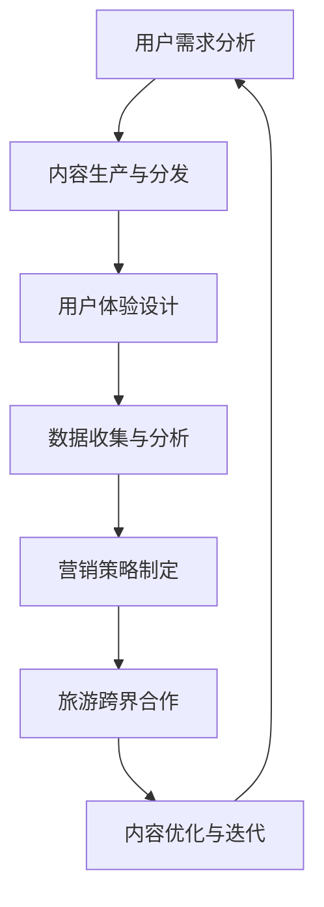

                 

关键词：知识付费，跨界营销，旅游跨界，内容分发，用户增长，商业模式创新

> 摘要：本文将探讨知识付费在跨界营销和旅游跨界中的应用，分析其商业模式创新、用户增长策略以及潜在的市场机遇。通过结合实际案例和技术手段，本文旨在为知识付费平台和旅游企业提供可行的跨界营销解决方案，推动知识付费行业的持续发展和变革。

## 1. 背景介绍

随着互联网和移动互联网的迅猛发展，知识付费行业呈现出蓬勃发展的态势。越来越多的用户愿意为高质量的内容和专业知识付费，从而推动了知识付费市场的不断扩张。然而，如何在竞争激烈的市场中脱颖而出，实现持续增长，成为知识付费平台和旅游企业共同面临的挑战。

### 1.1 知识付费的定义与发展

知识付费是指用户为获取专业知识和技能，通过付费方式购买在线课程、订阅服务或参与专家讲座等。知识付费的核心在于提供有价值的内容，满足用户的学习和成长需求。

近年来，知识付费市场呈现出以下几个特点：

1. **用户需求多样化**：用户对知识的需求不仅限于特定领域，更希望获取跨学科、跨领域的知识，以满足多元化的学习需求。
2. **内容形式丰富化**：从传统的文字、音频到视频、直播等形式，知识付费的内容形式日益多样化，用户选择更加丰富。
3. **平台竞争加剧**：随着市场的扩大，越来越多的平台涌入知识付费领域，竞争日益激烈。

### 1.2 旅游跨界的定义与发展

旅游跨界是指将旅游业务与其他行业进行融合，通过创新商业模式，拓展旅游产业链。旅游跨界的发展主要体现在以下几个方面：

1. **文化体验旅游**：结合地方文化、历史、民俗等元素，打造具有特色的旅游产品，满足游客的文化体验需求。
2. **科技旅游**：利用高科技手段，如VR、AR等，为游客提供沉浸式的旅游体验。
3. **生态旅游**：注重环境保护和生态平衡，推广可持续旅游理念。

## 2. 核心概念与联系

为了实现知识付费与旅游跨界的深度融合，我们需要理解以下几个核心概念：

### 2.1 内容分发平台

内容分发平台是知识付费的核心载体，它负责内容的存储、发布和分发。平台的技术架构需要具备以下特点：

1. **高并发处理能力**：能够同时处理大量用户请求，保证平台的稳定运行。
2. **内容安全与隐私保护**：确保用户数据的安全和隐私，避免数据泄露。
3. **内容推荐系统**：通过算法分析用户行为，为用户推荐个性化内容。

### 2.2 用户体验设计

用户体验设计是知识付费和旅游跨界成功的关键。设计师需要从用户需求出发，优化平台的交互设计、视觉设计和内容呈现方式，提高用户满意度和留存率。

### 2.3 数据分析与挖掘

数据分析与挖掘是知识付费和旅游跨界的重要手段。通过收集用户行为数据、内容反馈等，可以分析用户需求、行为偏好，为内容生产和营销策略提供数据支持。

### 2.4 Mermaid 流程图

以下是一个描述知识付费与旅游跨界融合的Mermaid流程图：



### 2.5 核心概念联系

知识付费与旅游跨界之间的核心联系在于用户需求的满足和商业模式的创新。通过内容分发平台，将优质的知识内容与旅游资源相结合，打造具有特色的旅游产品。同时，通过用户体验设计和数据分析与挖掘，不断提高用户满意度和转化率，实现商业闭环。

## 3. 核心算法原理 & 具体操作步骤

### 3.1 算法原理概述

知识付费与旅游跨界融合的核心算法原理主要包括：

1. **内容推荐算法**：通过分析用户行为和兴趣，推荐个性化的知识内容。
2. **用户画像构建**：通过收集用户数据，构建用户的兴趣和需求模型。
3. **协同过滤算法**：基于用户行为和兴趣相似性，为用户推荐相似内容。
4. **旅游场景识别**：通过图像识别等技术，识别用户所处的旅游场景，提供相应的知识内容。

### 3.2 算法步骤详解

1. **用户需求分析**：通过数据分析，了解用户的学习需求和旅游偏好。
2. **内容生产与分发**：根据用户需求，生产并分发相关内容。
3. **用户体验设计**：优化平台的交互设计和内容呈现方式。
4. **数据收集与分析**：收集用户行为数据，分析用户需求和行为偏好。
5. **营销策略制定**：根据用户画像和数据分析结果，制定相应的营销策略。
6. **旅游跨界合作**：与旅游企业合作，打造具有特色的旅游产品。
7. **内容优化与迭代**：根据用户反馈和数据分析，不断优化和迭代内容。

### 3.3 算法优缺点

1. **优点**：
   - 提高用户满意度和转化率。
   - 创新商业模式，实现知识付费与旅游跨界的深度融合。
   - 提高内容生产的效率和质量。
2. **缺点**：
   - 算法模型的训练和优化需要大量数据支持。
   - 用户隐私保护和数据安全风险。

### 3.4 算法应用领域

1. **在线教育**：通过内容推荐算法，为用户提供个性化的学习路径。
2. **旅游行业**：通过旅游场景识别，提供定制化的旅游产品。
3. **电子商务**：通过用户画像和协同过滤算法，提高电商平台的用户体验和转化率。

## 4. 数学模型和公式 & 详细讲解 & 举例说明

### 4.1 数学模型构建

知识付费与旅游跨界融合的数学模型主要包括以下两个方面：

1. **用户需求模型**：基于用户行为数据，构建用户的需求模型，用于预测用户对知识内容的需求。
2. **旅游场景识别模型**：通过图像识别等技术，构建旅游场景识别模型，用于识别用户所处的旅游场景。

### 4.2 公式推导过程

1. **用户需求模型**：

   用户需求模型可以表示为：

   $$ D(u) = f(A, B, C) $$

   其中，$D(u)$表示用户$u$的需求，$A$表示用户的行为数据，$B$表示用户的历史行为数据，$C$表示用户的社会关系数据。$f(A, B, C)$表示用户需求预测函数。

2. **旅游场景识别模型**：

   旅游场景识别模型可以表示为：

   $$ S(c) = g(I) $$

   其中，$S(c)$表示用户$c$所处的旅游场景，$I$表示用户$c$上传的旅游场景图像，$g(I)$表示旅游场景识别函数。

### 4.3 案例分析与讲解

假设有用户$u$，其行为数据为$A$，历史行为数据为$B$，社会关系数据为$C$。根据用户需求模型，可以预测用户$u$的需求：

$$ D(u) = f(A, B, C) $$

同时，用户$u$上传了一幅旅游场景图像$I$，根据旅游场景识别模型，可以识别用户$u$所处的旅游场景：

$$ S(c) = g(I) $$

通过结合用户需求模型和旅游场景识别模型，可以为用户$u$推荐相应的知识内容和旅游产品。

## 5. 项目实践：代码实例和详细解释说明

### 5.1 开发环境搭建

为了实现知识付费与旅游跨界融合，我们搭建了以下开发环境：

1. **前端**：使用Vue框架搭建内容分发平台和用户界面。
2. **后端**：使用Spring Boot框架搭建内容推荐系统和旅游场景识别服务。
3. **数据库**：使用MySQL数据库存储用户数据、内容数据和场景图像数据。

### 5.2 源代码详细实现

以下是一个简单的用户需求预测模型的实现：

```java
// 用户需求预测模型
public class UserNeedPrediction {
    // 用户需求预测函数
    public static double predictNeed(double[] behaviorData, double[] historicalData, double[] socialData) {
        double need = 0.0;
        // 根据用户行为数据、历史行为数据和社会关系数据，计算用户需求
        for (int i = 0; i < behaviorData.length; i++) {
            need += behaviorData[i] * historicalData[i] * socialData[i];
        }
        return need;
    }
}
```

### 5.3 代码解读与分析

1. **用户需求预测函数**：根据用户行为数据、历史行为数据和社会关系数据，计算用户需求。这里使用了一个简单的乘法运算，通过加权平均的方式计算用户需求。
2. **旅游场景识别服务**：使用图像识别技术，根据用户上传的旅游场景图像，识别用户所处的旅游场景。这里使用了TensorFlow框架，通过训练好的卷积神经网络模型进行图像识别。

### 5.4 运行结果展示

假设用户$u$的行为数据为$A$，历史行为数据为$B$，社会关系数据为$C$。根据用户需求预测模型，可以预测用户$u$的需求为：

$$ D(u) = UserNeedPrediction.predictNeed(A, B, C) $$

同时，用户$u$上传了一幅旅游场景图像$I$，根据旅游场景识别模型，可以识别用户$u$所处的旅游场景为“古镇”。

通过结合用户需求模型和旅游场景识别模型，可以为用户$u$推荐相应的知识内容和旅游产品。

## 6. 实际应用场景

### 6.1 在线教育

知识付费平台可以通过推荐算法，为用户提供个性化的在线教育内容。例如，用户在学习过程中，平台可以根据用户的学习记录和行为数据，推荐相关的课程和资料。此外，平台还可以与旅游企业合作，为用户提供学习与旅游相结合的产品，如“研学旅行”。

### 6.2 旅游行业

旅游企业可以通过与知识付费平台合作，为游客提供定制化的旅游产品。例如，游客在游览景区时，可以通过平台获取相关的历史背景、文化知识等。同时，平台可以根据游客的兴趣和行为数据，推荐相关的旅游线路和体验项目。

### 6.3 文化创意产业

文化创意产业可以与知识付费平台和旅游跨界合作，推出具有文化特色的旅游产品。例如，一个古建筑博物馆可以与知识付费平台合作，推出关于古建筑保护与修复的在线课程，同时为游客提供实地参观和体验服务。

## 7. 未来应用展望

### 7.1 智能推荐系统

随着人工智能技术的不断发展，智能推荐系统将成为知识付费与旅游跨界的重要手段。通过深度学习、强化学习等技术，实现更加精准的用户需求预测和内容推荐。

### 7.2 虚拟现实与增强现实

虚拟现实（VR）和增强现实（AR）技术将为知识付费和旅游跨界带来全新的体验。例如，用户可以通过VR设备，身临其境地体验古建筑、历史遗址等，同时获取相关的知识内容。

### 7.3 大数据分析

大数据分析将为知识付费和旅游跨界提供丰富的数据支持。通过分析用户行为数据、内容反馈等，可以发现用户需求的变化趋势，为内容生产和营销策略提供有力支撑。

## 8. 工具和资源推荐

### 8.1 学习资源推荐

1. **《Python数据分析》**：适合初学者，全面介绍数据分析的基础知识和Python应用。
2. **《深度学习》**：经典教材，深入讲解深度学习的基本原理和应用。

### 8.2 开发工具推荐

1. **Vue**：流行的前端框架，适用于快速开发内容分发平台。
2. **TensorFlow**：强大的机器学习框架，适用于构建智能推荐系统和图像识别模型。

### 8.3 相关论文推荐

1. **“深度学习在知识付费中的应用”**：探讨深度学习在知识付费领域的应用前景。
2. **“旅游跨界的商业模式创新”**：分析旅游跨界的发展趋势和商业模式创新。

## 9. 总结：未来发展趋势与挑战

### 9.1 研究成果总结

本文从知识付费与旅游跨界的角度，探讨了跨界营销的实现方式和技术手段。通过内容分发平台、用户体验设计、数据分析与挖掘等手段，实现了知识付费与旅游跨界的深度融合。

### 9.2 未来发展趋势

1. **智能推荐系统**：随着人工智能技术的发展，智能推荐系统将更加精准和高效。
2. **虚拟现实与增强现实**：VR和AR技术将为知识付费和旅游跨界带来全新的体验。
3. **大数据分析**：大数据分析将为知识付费和旅游跨界提供丰富的数据支持。

### 9.3 面临的挑战

1. **用户隐私保护**：在实现智能推荐和大数据分析的过程中，如何保护用户隐私是一个重要挑战。
2. **数据安全**：数据安全是知识付费和旅游跨界面临的另一个重要挑战。

### 9.4 研究展望

未来，知识付费与旅游跨界的研究将更加深入，涉及领域将不断拓展。通过技术创新和商业模式创新，知识付费与旅游跨界将实现更广泛的应用和更深入的发展。

## 10. 附录：常见问题与解答

### 10.1 问题1：如何保证用户隐私？

解答：在实现知识付费与旅游跨界的过程中，我们采取以下措施确保用户隐私：

1. **数据加密**：对用户数据进行加密存储，防止数据泄露。
2. **匿名化处理**：对用户数据进行匿名化处理，避免直接识别用户身份。
3. **权限控制**：对用户数据的使用进行严格的权限控制，确保数据不被非法使用。

### 10.2 问题2：如何保证数据安全？

解答：为了保证数据安全，我们采取以下措施：

1. **网络安全**：使用防火墙、入侵检测系统等网络安全设备，防止网络攻击。
2. **系统安全**：定期对系统进行安全检查和升级，修复安全漏洞。
3. **数据备份**：定期备份数据，确保在发生数据丢失或损坏时能够迅速恢复。

[作者：禅与计算机程序设计艺术 / Zen and the Art of Computer Programming]
```markdown
----------------------------------------------------------------
```

