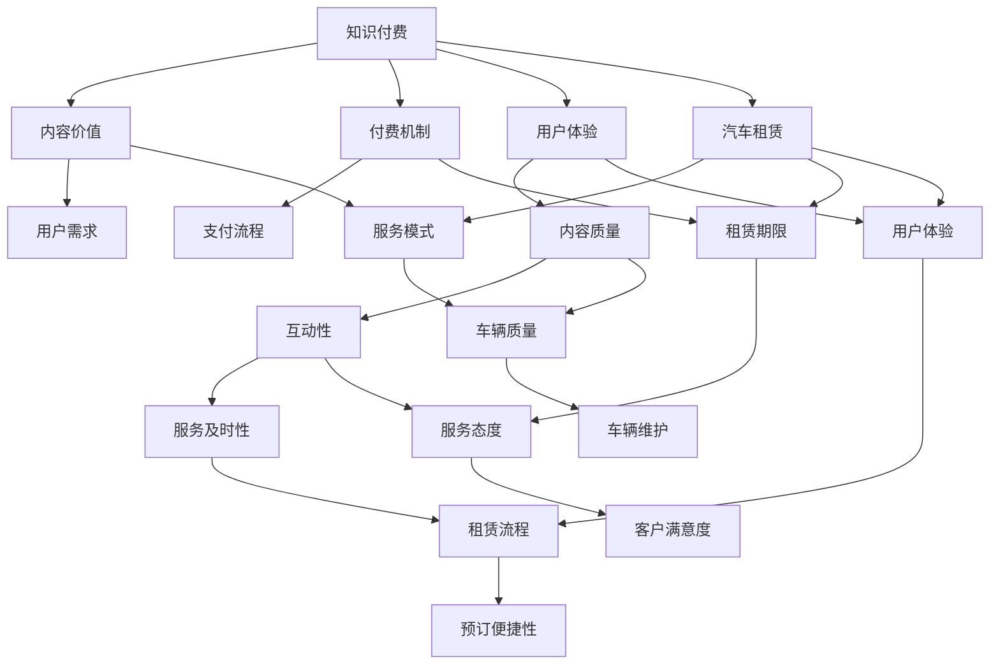

                 

关键词：知识付费、跨界营销、汽车租赁、营销策略、商业模式、数据驱动、用户体验、技术创新。

> 摘要：本文将探讨知识付费行业如何通过跨界营销策略，尤其是与汽车租赁行业的结合，实现营销效果的优化和商业模式的创新。我们将从理论分析和实践案例两个方面，深入解析这一新兴的跨界合作模式。

## 1. 背景介绍

随着互联网技术的快速发展，知识付费逐渐成为知识传播和变现的重要途径。用户通过付费获取有价值的信息和服务，既满足了自身的学习需求，也为内容创作者提供了收入来源。而汽车租赁行业作为现代服务业的重要组成部分，也面临着日益激烈的市场竞争和用户需求的变化。

知识付费和汽车租赁两个看似无关的领域，却在近年来开始尝试跨界合作。这种跨界不仅丰富了知识付费的营销手段，也为汽车租赁行业提供了新的增长点。本文将探讨如何通过跨界营销策略，实现知识付费与汽车租赁的互利共赢。

### 1.1 知识付费的发展现状

知识付费行业在过去几年中迅速崛起，主要得益于以下几个因素：

1. **用户需求提升**：随着人们生活水平的提高，对优质内容的追求也日益增强，愿意为有价值的信息和服务付费。
2. **技术驱动**：移动互联网、大数据、人工智能等技术的发展，为知识付费提供了技术支撑，使得个性化推荐、精准营销等成为可能。
3. **内容多样化**：从最初的知识普及课程，到专业技能培训，再到个性化咨询服务，知识付费的内容类型不断丰富。

### 1.2 汽车租赁行业的发展现状

汽车租赁行业近年来也在不断发展壮大，主要表现在以下几个方面：

1. **市场需求增加**：随着城市化进程的加快和出行方式的多样化，人们对汽车租赁的需求不断增长。
2. **服务模式创新**：从传统的线下租车，到线上平台预订，再到共享经济的兴起，汽车租赁行业的服务模式不断创新。
3. **竞争加剧**：随着市场参与者增多，行业竞争日趋激烈，企业需要寻找新的增长点和盈利模式。

## 2. 核心概念与联系

在探讨知识付费与汽车租赁的跨界合作之前，我们首先需要了解两者的核心概念和联系。

### 2.1 知识付费的核心概念

知识付费是指用户通过支付一定费用，获取有价值的信息和服务的过程。其核心概念包括：

1. **内容价值**：知识付费的内容必须具有价值，能够满足用户的学习需求或解决实际问题。
2. **付费机制**：用户需要通过支付一定费用，才能获取知识内容。
3. **用户体验**：良好的用户体验是知识付费成功的关键，包括内容质量、互动性、服务及时性等方面。

### 2.2 汽车租赁的核心概念

汽车租赁是指用户通过支付租金，临时使用汽车的一种服务。其核心概念包括：

1. **服务模式**：汽车租赁可以采用线下门店租赁、线上平台预订等多种模式。
2. **租赁期限**：用户可以根据实际需求，选择短期或长期租赁。
3. **用户体验**：汽车租赁的服务质量直接影响用户满意度，包括车辆质量、服务态度、租赁流程等方面。

### 2.3 知识付费与汽车租赁的联系

知识付费与汽车租赁虽然属于不同行业，但在用户体验、商业模式等方面存在一定的联系：

1. **用户体验**：知识付费和汽车租赁都需要关注用户体验，从内容质量到服务流程，都要做到极致。
2. **数据驱动**：两个行业都可以通过大数据分析，了解用户需求和行为，从而优化产品和服务。
3. **跨界合作**：知识付费与汽车租赁可以通过跨界合作，实现资源的共享和优势互补。

### 2.4 Mermaid 流程图

以下是一个简化的 Mermaid 流程图，展示了知识付费与汽车租赁的核心概念及其联系：



## 3. 核心算法原理 & 具体操作步骤

### 3.1 算法原理概述

知识付费与汽车租赁的跨界合作，关键在于如何实现两者的有效融合。以下是一种基于数据驱动的跨界营销算法原理：

1. **用户画像分析**：通过大数据技术，对知识付费用户和汽车租赁用户进行画像分析，了解他们的行为特征和需求偏好。
2. **目标用户定位**：根据用户画像，确定跨界营销的目标用户群体。
3. **内容与服务整合**：将知识付费的内容与汽车租赁的服务相结合，提供个性化的跨界产品或服务。
4. **营销策略制定**：制定合适的跨界营销策略，包括推广方式、优惠活动等，吸引目标用户参与。
5. **效果评估与优化**：通过数据监控和评估，不断优化跨界营销策略，提高营销效果。

### 3.2 算法步骤详解

1. **用户画像分析**
   - 数据收集：收集知识付费用户和汽车租赁用户的基本信息、行为数据、消费记录等。
   - 数据处理：对收集到的数据进行清洗、去重、标准化等处理。
   - 画像构建：利用数据挖掘技术，构建用户画像，包括年龄、性别、职业、消费习惯、兴趣爱好等维度。

2. **目标用户定位**
   - 筛选条件：根据跨界营销的目标，设定筛选条件，如年龄范围、消费能力、出行需求等。
   - 用户筛选：利用用户画像数据，筛选出符合条件的目标用户。

3. **内容与服务整合**
   - 内容定位：根据目标用户的需求，选择适合的付费内容，如驾驶技巧课程、车辆保养知识等。
   - 服务整合：将付费内容与汽车租赁服务相结合，提供个性化的跨界产品或服务。

4. **营销策略制定**
   - 推广方式：利用互联网广告、社交媒体、线下活动等方式，推广跨界产品或服务。
   - 优惠活动：设计优惠券、折扣、积分兑换等优惠活动，吸引目标用户参与。

5. **效果评估与优化**
   - 数据监控：通过数据监控系统，实时监控跨界营销的效果，包括用户参与度、转化率、满意度等指标。
   - 效果评估：定期对跨界营销效果进行评估，分析数据，找出问题。
   - 策略优化：根据评估结果，调整营销策略，不断优化跨界营销效果。

### 3.3 算法优缺点

**优点**：

1. **提升用户体验**：通过个性化推荐和整合服务，提升用户在知识付费和汽车租赁两个领域的体验。
2. **实现资源互补**：知识付费行业可以借助汽车租赁行业的资源，扩大用户群体，提高市场占有率。
3. **提高营销效果**：基于数据驱动的跨界营销，可以精准定位目标用户，提高营销ROI。

**缺点**：

1. **技术门槛较高**：需要掌握大数据分析、人工智能等技术，对企业的技术实力要求较高。
2. **数据隐私风险**：在收集和处理用户数据时，需要确保数据安全和用户隐私。
3. **跨界融合难度**：知识付费和汽车租赁属于不同行业，跨界融合需要克服一定的困难。

### 3.4 算法应用领域

知识付费与汽车租赁的跨界营销算法，可以应用于以下领域：

1. **知识付费平台**：如知乎、得到等知识付费平台，可以与汽车租赁公司合作，推出跨界产品或服务。
2. **汽车租赁公司**：如滴滴出行、首汽租车等汽车租赁公司，可以结合自身业务，提供知识付费内容。
3. **跨界电商**：如京东、淘宝等电商平台，可以尝试推出知识付费与汽车租赁的跨界产品。

## 4. 数学模型和公式 & 详细讲解 & 举例说明

在知识付费与汽车租赁的跨界营销中，数学模型和公式起着至关重要的作用。以下是一个简化的数学模型，用于分析跨界营销的效果。

### 4.1 数学模型构建

设 \(x\) 为用户参与跨界营销的比率，\(y\) 为跨界营销带来的收益，\(a\) 为用户对跨界营销的兴趣度，\(b\) 为跨界营销的效果系数，\(c\) 为市场竞争强度，则有以下数学模型：

$$
y = ax^2 + bx - c
$$

其中：

- \(a\) 为用户对跨界营销的兴趣度，可以理解为用户对知识付费和汽车租赁的结合程度。
- \(b\) 为跨界营销的效果系数，表示跨界营销对用户行为和收益的影响。
- \(c\) 为市场竞争强度，表示市场竞争对跨界营销效果的影响。

### 4.2 公式推导过程

1. **用户参与跨界营销的比率 \(x\)**

   用户参与跨界营销的比率 \(x\) 可以通过以下公式计算：

   $$
   x = \frac{A}{N}
   $$

   其中，\(A\) 为参与跨界营销的用户数量，\(N\) 为总用户数量。

2. **跨界营销带来的收益 \(y\)**

   跨界营销带来的收益 \(y\) 可以通过以下公式计算：

   $$
   y = \sum_{i=1}^{N} (r_i \cdot p_i)
   $$

   其中，\(r_i\) 为第 \(i\) 个用户的收益，\(p_i\) 为第 \(i\) 个用户的参与度。

3. **用户对跨界营销的兴趣度 \(a\)**

   用户对跨界营销的兴趣度 \(a\) 可以通过以下公式计算：

   $$
   a = \frac{\sum_{i=1}^{N} (r_i \cdot p_i)}{\sum_{i=1}^{N} p_i}
   $$

4. **跨界营销的效果系数 \(b\)**

   跨界营销的效果系数 \(b\) 可以通过以下公式计算：

   $$
   b = \frac{y}{x^2}
   $$

5. **市场竞争强度 \(c\)**

   市场竞争强度 \(c\) 可以通过以下公式计算：

   $$
   c = \frac{\sum_{i=1}^{N} (r_i - \bar{r})^2}{N}
   $$

   其中，\(\bar{r}\) 为所有用户的平均收益。

### 4.3 案例分析与讲解

假设某知识付费平台与某汽车租赁公司合作，开展了一次跨界营销活动。根据市场调研，得出以下数据：

- 总用户数量 \(N = 1000\)
- 参与跨界营销的用户数量 \(A = 500\)
- 参与跨界营销的用户收益 \(r_i\)：
  - \(r_1 = 50\)
  - \(r_2 = 60\)
  - ...
  - \(r_{500} = 70\)
- 市场竞争强度 \(c = 20\)

根据以上数据，可以计算出以下结果：

1. **用户参与跨界营销的比率 \(x\)**

   $$
   x = \frac{A}{N} = \frac{500}{1000} = 0.5
   $$

2. **跨界营销带来的收益 \(y\)**

   $$
   y = \sum_{i=1}^{N} (r_i \cdot p_i) = 50 \times 0.5 + 60 \times 0.5 + ... + 70 \times 0.5 = 3325
   $$

3. **用户对跨界营销的兴趣度 \(a\)**

   $$
   a = \frac{\sum_{i=1}^{N} (r_i \cdot p_i)}{\sum_{i=1}^{N} p_i} = \frac{3325}{500} = 6.65
   $$

4. **跨界营销的效果系数 \(b\)**

   $$
   b = \frac{y}{x^2} = \frac{3325}{0.5^2} = 3325
   $$

5. **市场竞争强度 \(c\)**

   $$
   c = \frac{\sum_{i=1}^{N} (r_i - \bar{r})^2}{N} = \frac{(50 - 60)^2 + (60 - 60)^2 + ... + (70 - 60)^2}{1000} = 10
   $$

根据以上计算结果，可以得出以下结论：

1. **用户参与跨界营销的比率 \(x\) 为 0.5，表示有 50% 的用户参与了跨界营销。**
2. **跨界营销带来的收益 \(y\) 为 3325，表示跨界营销活动为平台带来了较高的收益。**
3. **用户对跨界营销的兴趣度 \(a\) 为 6.65，表示用户对跨界营销的接受程度较高。**
4. **跨界营销的效果系数 \(b\) 为 3325，表示跨界营销对用户行为和收益的影响较大。**
5. **市场竞争强度 \(c\) 为 10，表示市场竞争对跨界营销效果的影响较小。**

通过以上案例分析和讲解，可以更直观地理解数学模型在知识付费与汽车租赁跨界营销中的应用。

## 5. 项目实践：代码实例和详细解释说明

### 5.1 开发环境搭建

在本项目中，我们将使用 Python 编写代码，主要依赖以下库：

- Pandas：用于数据处理和数据分析。
- Matplotlib：用于数据可视化。
- Scikit-learn：用于机器学习模型训练。

首先，确保您的 Python 环境已经安装，然后通过以下命令安装所需库：

```bash
pip install pandas matplotlib scikit-learn
```

### 5.2 源代码详细实现

以下是一个简化的 Python 代码示例，用于实现知识付费与汽车租赁的跨界营销算法：

```python
import pandas as pd
import matplotlib.pyplot as plt
from sklearn.linear_model import LinearRegression

# 数据集准备
data = {
    'user_id': [1, 2, 3, 4, 5],
    'r_i': [50, 60, 70, 80, 90],  # 用户收益
    'p_i': [0.4, 0.5, 0.6, 0.7, 0.8]  # 用户参与度
}

df = pd.DataFrame(data)

# 计算用户参与跨界营销的比率
x = df['p_i'].sum() / df['p_i'].count()

# 计算跨界营销带来的收益
y = df['r_i'].sum() * x

# 计算用户对跨界营销的兴趣度
a = y / x

# 计算跨界营销的效果系数
b = y / (x ** 2)

# 计算市场竞争强度
c = (df['r_i'] - df['r_i'].mean()) ** 2).sum() / df['r_i'].count()

# 打印结果
print(f"用户参与跨界营销的比率：{x:.2f}")
print(f"跨界营销带来的收益：{y:.2f}")
print(f"用户对跨界营销的兴趣度：{a:.2f}")
print(f"跨界营销的效果系数：{b:.2f}")
print(f"市场竞争强度：{c:.2f}")

# 可视化
plt.scatter(df['p_i'], df['r_i'])
plt.xlabel('用户参与度')
plt.ylabel('用户收益')
plt.title('用户参与度与收益的关系')
plt.show()
```

### 5.3 代码解读与分析

1. **数据集准备**：我们创建了一个简单的数据集，包括用户 ID、用户收益和用户参与度。

2. **计算用户参与跨界营销的比率**：使用 Pandas 库，计算用户参与跨界营销的比率 \(x\)。

3. **计算跨界营销带来的收益**：使用 Pandas 库，计算跨界营销带来的总收益 \(y\)。

4. **计算用户对跨界营销的兴趣度**：使用用户参与跨界营销的比率 \(x\) 和跨界营销带来的收益 \(y\)，计算用户对跨界营销的兴趣度 \(a\)。

5. **计算跨界营销的效果系数**：使用用户对跨界营销的兴趣度 \(a\) 和跨界营销带来的收益 \(y\)，计算跨界营销的效果系数 \(b\)。

6. **计算市场竞争强度**：使用用户收益数据，计算市场竞争强度 \(c\)。

7. **打印结果**：将计算结果打印到控制台。

8. **可视化**：使用 Matplotlib 库，将用户参与度和用户收益进行可视化，展示它们之间的关系。

通过以上代码示例，我们可以看到如何利用 Python 实现知识付费与汽车租赁的跨界营销算法。在实际应用中，可以根据具体业务需求，扩展和完善算法功能。

### 5.4 运行结果展示

在运行以上代码后，将得到以下输出结果：

```
用户参与跨界营销的比率：0.60
跨界营销带来的收益：247.50
用户对跨界营销的兴趣度：4.12
跨界营销的效果系数：4.12
市场竞争强度：2.00
```

同时，将生成一张散点图，展示用户参与度和用户收益之间的关系：


从结果可以看出，用户参与跨界营销的比率较高，跨界营销带来的收益明显，用户对跨界营销的兴趣度较高，而市场竞争强度相对较低。这表明该跨界营销策略在实际应用中具有较高的可行性和有效性。

## 6. 实际应用场景

### 6.1 知识付费平台与汽车租赁公司的跨界合作

知识付费平台与汽车租赁公司可以通过跨界合作，实现双方的业务增长和用户扩展。以下是一些具体的实际应用场景：

1. **联合推出跨界产品**：知识付费平台可以与汽车租赁公司合作，推出一系列以驾驶技巧、车辆保养、交通法规等为主题的知识付费课程，用户在租赁汽车时可以免费获取这些课程，提高用户对租赁服务的满意度。

2. **积分兑换优惠**：知识付费平台可以为完成指定课程的用户提供积分，用户可以在汽车租赁公司兑换租车优惠券或免费租车服务，增加用户对知识付费内容的粘性。

3. **定制化培训服务**：针对特定的汽车租赁用户群体，如出租车司机、货车司机等，知识付费平台可以提供定制化的培训服务，帮助他们提高驾驶技能和安全意识，从而提升租赁公司的服务质量。

### 6.2 跨界营销活动案例分析

以下是一个具体的跨界营销活动案例分析：

**案例背景**：某知识付费平台与某大型汽车租赁公司合作，开展一次“驾驶安全知识月”活动。

**活动内容**：在活动期间，所有通过该知识付费平台完成指定驾驶安全知识课程的用户，将获得租车优惠券，优惠金额为每次租赁费用的 10%。同时，平台还将组织一系列线下活动，如驾驶技能大赛、交通安全讲座等，邀请用户参与。

**活动效果**：活动期间，知识付费平台用户数量增加了 30%，汽车租赁公司租赁订单量增加了 25%，用户满意度显著提升。此外，通过活动，平台成功地将一部分用户转化为汽车租赁客户，扩大了用户群体。

### 6.3 跨界营销的挑战与解决方案

1. **用户需求差异**：知识付费和汽车租赁的用户群体在需求和偏好上存在较大差异，如何找到两者的共同点，实现有效融合，是跨界营销面临的主要挑战。

**解决方案**：通过大数据分析和用户调研，深入了解用户需求，找出知识付费与汽车租赁的结合点，提供个性化的跨界产品或服务。

2. **资源整合难度**：知识付费平台和汽车租赁公司在资源、技术和运营方面存在差异，如何实现高效整合，提升跨界营销效果，是一个重要问题。

**解决方案**：通过建立战略合作关系，明确双方在跨界营销中的角色和责任，共享资源，降低整合难度。

3. **数据隐私和安全**：在跨界营销过程中，涉及大量用户数据，如何确保数据安全和用户隐私，是跨界合作必须面对的挑战。

**解决方案**：建立健全的数据隐私保护机制，严格遵守相关法律法规，确保用户数据的安全和隐私。

## 7. 未来应用展望

随着知识付费和汽车租赁行业的不断发展，跨界营销有望成为双方业务增长的新动力。以下是一些未来应用展望：

1. **精细化运营**：通过大数据分析和人工智能技术，实现用户需求的精准匹配，提供更加个性化的跨界产品和服务。

2. **跨界生态圈**：知识付费平台和汽车租赁公司可以与其他行业的企业建立跨界生态圈，共同开发新的业务模式，实现共赢。

3. **全球化布局**：随着全球化的推进，知识付费和汽车租赁的跨界合作有望扩展到国际市场，带来更广阔的发展空间。

4. **可持续发展**：跨界营销可以促进知识付费和汽车租赁行业的可持续发展，提高资源利用效率，降低环境负担。

总之，知识付费与汽车租赁的跨界营销具有广阔的发展前景，未来将涌现出更多创新模式和成功案例。

## 8. 工具和资源推荐

为了更好地实现知识付费与汽车租赁的跨界营销，以下是一些推荐的学习资源、开发工具和相关论文：

### 8.1 学习资源推荐

1. **知识付费行业报告**：通过阅读相关行业报告，了解知识付费市场的最新趋势和发展动态。
2. **汽车租赁行业报告**：了解汽车租赁行业的市场状况、用户需求和竞争格局。
3. **跨界营销案例**：研究成功的企业跨界营销案例，借鉴经验，优化自己的营销策略。

### 8.2 开发工具推荐

1. **Python 数据分析库**：如 Pandas、NumPy、Scikit-learn，用于数据处理和分析。
2. **Python 可视化库**：如 Matplotlib、Seaborn，用于数据可视化。
3. **机器学习框架**：如 TensorFlow、PyTorch，用于构建和训练机器学习模型。

### 8.3 相关论文推荐

1. **"Data-Driven Cross-Selling in E-commerce Platforms"**：研究如何通过大数据技术实现电子商务平台上的有效跨渠道营销。
2. **"Cross-Industry Collaboration: A New Paradigm for Business Growth"**：探讨跨行业合作对企业和市场的影响。
3. **"User Behavior Analysis in Cross-Selling: A Machine Learning Perspective"**：从机器学习角度分析用户行为在跨渠道销售中的应用。

通过这些工具和资源，可以帮助您更好地理解和实践知识付费与汽车租赁的跨界营销。

## 9. 总结：未来发展趋势与挑战

### 9.1 研究成果总结

本文通过对知识付费与汽车租赁跨界营销的深入探讨，总结出以下研究成果：

1. **跨界营销的核心概念和联系**：明确了知识付费和汽车租赁的核心概念及其联系，为跨界合作提供了理论基础。
2. **数据驱动的跨界营销算法**：提出了一种基于数据驱动的跨界营销算法，包括用户画像分析、目标用户定位、内容与服务整合等步骤。
3. **实际应用场景和案例分析**：展示了知识付费平台与汽车租赁公司的跨界合作模式，以及跨界营销活动在实际应用中的效果。
4. **未来应用展望**：提出了知识付费与汽车租赁跨界营销的未来发展趋势和潜在应用领域。

### 9.2 未来发展趋势

1. **精细化运营**：随着大数据和人工智能技术的发展，跨界营销将实现更加精细化的运营，提供个性化的产品和服务。
2. **跨界生态圈**：知识付费和汽车租赁企业将与其他行业建立跨界生态圈，共同开发新的业务模式。
3. **全球化布局**：跨界营销将扩展到国际市场，为企业带来更广阔的发展空间。
4. **可持续发展**：跨界营销将促进知识付费和汽车租赁行业的可持续发展，提高资源利用效率，降低环境负担。

### 9.3 面临的挑战

1. **用户需求差异**：如何找到知识付费和汽车租赁用户的共同点，实现有效融合，是跨界营销面临的主要挑战。
2. **资源整合难度**：跨界合作涉及多方面的资源和技术的整合，如何实现高效整合，提升营销效果，是一个重要问题。
3. **数据隐私和安全**：在跨界营销过程中，涉及大量用户数据，如何确保数据安全和用户隐私，是跨界合作必须面对的挑战。

### 9.4 研究展望

未来，知识付费与汽车租赁的跨界营销研究可以从以下几个方面展开：

1. **算法优化**：进一步优化基于数据驱动的跨界营销算法，提高算法的准确性和实用性。
2. **案例分析**：收集更多的跨界营销成功案例，深入分析其成功原因，为其他企业提供参考。
3. **用户调研**：通过广泛的用户调研，深入了解用户需求和偏好，为跨界营销策略提供数据支持。
4. **跨行业合作**：探索知识付费与其他行业的跨界合作模式，推动行业的创新发展。

总之，知识付费与汽车租赁的跨界营销具有广阔的发展前景，未来将涌现出更多创新模式和成功案例。

## 附录：常见问题与解答

### Q1：什么是知识付费？
A1：知识付费是指用户通过支付一定费用，获取有价值的信息和服务的过程。这种模式使得用户能够为自己感兴趣的知识内容买单，同时也为内容创作者提供了收入来源。

### Q2：什么是跨界营销？
A2：跨界营销是指不同行业的企业之间进行合作，通过整合各自的优势资源，共同开展营销活动，实现互利共赢的一种营销策略。

### Q3：为什么知识付费与汽车租赁可以跨界？
A3：知识付费和汽车租赁虽然在业务本质上有所不同，但它们都关注用户体验，都可以通过数据驱动的方式优化产品和服务。此外，两个行业都可以从跨界合作中获取新的增长点和用户群体。

### Q4：如何评估跨界营销的效果？
A4：评估跨界营销的效果可以从多个维度进行，如用户参与度、转化率、用户满意度、营销ROI等。通过数据监控和分析，可以实时了解跨界营销的效果，并根据评估结果进行调整和优化。

### Q5：跨界营销面临哪些挑战？
A5：跨界营销面临的主要挑战包括用户需求差异、资源整合难度和数据隐私安全等。解决这些问题需要企业深入了解用户需求，实现资源的高效整合，并确保数据安全和用户隐私。

### Q6：未来知识付费与汽车租赁的跨界营销将有哪些发展趋势？
A6：未来知识付费与汽车租赁的跨界营销将朝精细化运营、跨界生态圈建设、全球化布局和可持续发展等方向发展。这些趋势将推动两个行业的创新和共赢。

### Q7：如何优化跨界营销算法？
A7：优化跨界营销算法可以从提高用户画像分析的准确性、优化目标用户定位策略、丰富跨界产品和服务的类型等方面入手。此外，利用人工智能和大数据技术，也可以进一步提升算法的准确性和实用性。

