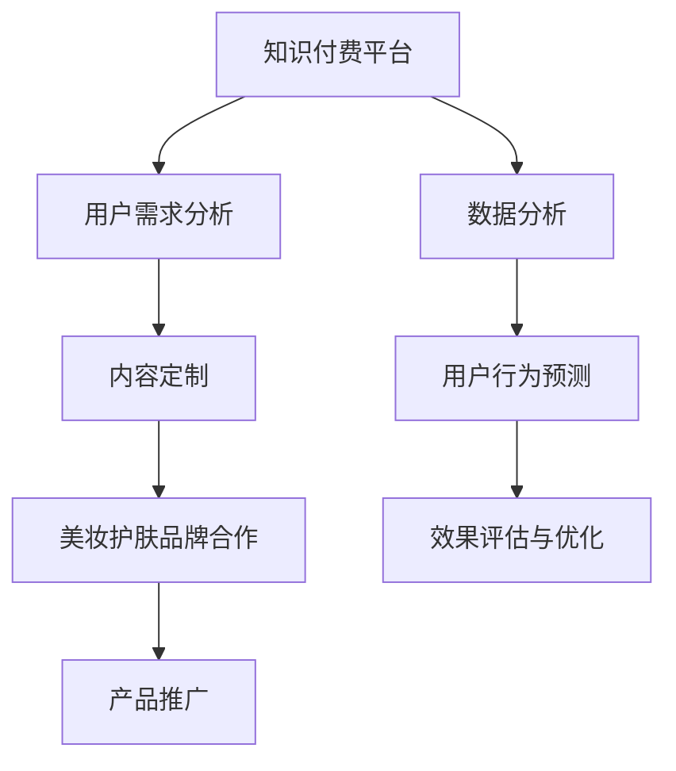

                 

 **关键词**：知识付费、跨界营销、美妆护肤、用户需求、商业模式、数据分析、技术实现。

**摘要**：本文将探讨知识付费领域如何通过跨界营销与美妆护肤行业结合，挖掘用户需求，打造新的商业模式，并运用数据分析和技术手段提升用户体验。通过深入分析行业现状、核心概念、算法原理、数学模型以及项目实践，本文旨在为知识付费行业提供新的发展思路和实操方法。

## 1. 背景介绍

知识付费作为一种新兴的商业模式，正在迅速崛起。用户对优质内容的需求不断增长，推动了知识付费市场的发展。然而，如何在激烈的市场竞争中脱颖而出，成为知识付费平台的关键挑战。

与此同时，美妆护肤行业也在经历着快速的发展。随着消费者对美丽和健康的追求日益增加，美妆护肤市场不断扩大。然而，美妆护肤品牌的营销手段较为单一，缺乏创新，难以满足消费者的多样化需求。

在这样的背景下，知识付费与美妆护肤行业的跨界结合成为一种新的趋势。通过跨界营销，知识付费平台可以为美妆护肤品牌提供全新的推广渠道，同时为用户提供更丰富、更有针对性的内容，从而实现双赢。

### 美妆护肤市场的现状

美妆护肤市场呈现出以下几个显著特点：

1. **市场需求旺盛**：随着生活水平的提高，消费者对美妆护肤产品的需求持续增长。
2. **消费群体年轻化**：80后、90后甚至00后已成为美妆护肤市场的主力军，他们对新事物的接受度较高，更愿意尝试新兴品牌和产品。
3. **品牌竞争激烈**：市场上美妆护肤品牌众多，竞争异常激烈，品牌需要不断创新和提升品质才能赢得消费者的青睐。

### 知识付费市场的现状

知识付费市场则表现出以下趋势：

1. **用户付费意愿增强**：随着互联网的普及和信息透明度提高，用户越来越愿意为优质内容付费。
2. **内容多样化**：知识付费平台的内容种类丰富，涵盖了教育、科技、财经、健康等多个领域。
3. **市场增长迅速**：知识付费市场在近年来呈现出爆发式增长，吸引了大量投资者和创业者进入。

## 2. 核心概念与联系

### 跨界营销

**概念**：跨界营销是指不同行业之间的合作与整合，通过互相借势、资源共享，实现品牌价值的最大化。

**联系**：在知识付费与美妆护肤的跨界中，知识付费平台可以为美妆护肤品牌提供专业的护肤知识内容，而美妆护肤品牌则可以借助知识付费平台的影响力进行产品推广。

### 用户需求

**概念**：用户需求是指消费者在特定情境下对产品或服务的期望和需求。

**联系**：知识付费平台和美妆护肤品牌都需要深入了解用户需求，通过定制化内容和服务提升用户满意度。

### 商业模式

**概念**：商业模式是指企业通过提供产品或服务以实现价值创造、传递和获取的机制。

**联系**：知识付费与美妆护肤的跨界营销需要创新商业模式，通过联合营销、会员制等方式实现共赢。

### 数据分析与技术手段

**概念**：数据分析是指通过使用数学模型、统计方法等对大量数据进行处理和分析，以提取有价值的信息。

**联系**：技术手段如人工智能、大数据分析等可以用于用户行为分析、需求预测等，为跨界营销提供数据支持。

### Mermaid 流程图



## 3. 核心算法原理 & 具体操作步骤

### 3.1 算法原理概述

**算法**：基于深度学习的用户行为预测模型。

**原理**：通过分析用户的历史行为数据，利用深度学习技术建立预测模型，预测用户在未来可能的需求和行为。

### 3.2 算法步骤详解

**步骤1：数据收集与预处理**
- 收集用户在知识付费平台上的浏览记录、购买行为、评论等数据。
- 对数据进行清洗、去重和格式化处理。

**步骤2：特征工程**
- 提取用户行为的特征，如浏览时间、购买频次、评论情感等。
- 利用词袋模型、TF-IDF等技术进行特征转换。

**步骤3：模型训练**
- 选择合适的深度学习模型，如卷积神经网络（CNN）或循环神经网络（RNN）。
- 使用训练集数据进行模型训练，优化模型参数。

**步骤4：模型评估**
- 使用验证集对训练好的模型进行评估，调整模型结构或参数。
- 确保模型具有良好的泛化能力。

**步骤5：模型部署**
- 将训练好的模型部署到线上环境，实现实时预测。
- 对用户行为进行实时分析，提供个性化的内容推荐。

### 3.3 算法优缺点

**优点**：
- **高精度**：通过深度学习技术，模型能够提取复杂的用户行为特征，提高预测精度。
- **实时性**：模型部署在线上，可以实现实时预测，为用户带来更好的体验。

**缺点**：
- **计算资源消耗大**：深度学习模型训练和部署需要大量的计算资源。
- **数据依赖性强**：模型的性能很大程度上取决于数据的多样性和质量。

### 3.4 算法应用领域

- **个性化推荐**：通过预测用户行为，为用户推荐个性化的知识内容和美妆护肤产品。
- **营销策略优化**：分析用户需求，为知识付费平台和美妆护肤品牌制定更有效的营销策略。

## 4. 数学模型和公式 & 详细讲解 & 举例说明

### 4.1 数学模型构建

**模型**：贝叶斯网络模型。

**公式**：
\[ P(A|B) = \frac{P(B|A)P(A)}{P(B)} \]

**解释**：贝叶斯网络模型是一种基于概率论的图模型，通过条件概率关系描述变量之间的依赖关系。

### 4.2 公式推导过程

**推导**：
\[ P(A|B) = \frac{P(B \cap A)}{P(B)} \]
\[ = \frac{P(B|A)P(A)}{P(B)} \]
其中，\( P(B \cap A) \) 表示事件 \( A \) 和事件 \( B \) 同时发生的概率，\( P(B|A) \) 表示在事件 \( A \) 发生的条件下事件 \( B \) 发生的概率，\( P(A) \) 表示事件 \( A \) 发生的概率，\( P(B) \) 表示事件 \( B \) 发生的概率。

### 4.3 案例分析与讲解

**案例**：用户购买行为预测。

**步骤**：
1. 收集用户历史购买数据。
2. 构建贝叶斯网络模型，描述用户购买行为与产品特征之间的依赖关系。
3. 使用模型预测新用户购买某产品的概率。

**示例**：
- **用户特征**：年龄、性别、购买频次、浏览时长。
- **产品特征**：品牌、价格、类型、用户评价。

**推导**：
\[ P(购买|品牌A) = \frac{P(品牌A|购买)P(购买)}{P(品牌A)} \]

其中，\( P(购买|品牌A) \) 表示在品牌 A 下用户购买的概率，\( P(品牌A|购买) \) 表示在用户购买的情况下品牌 A 发生的概率，\( P(购买) \) 表示用户购买的概率，\( P(品牌A) \) 表示品牌 A 的概率。

## 5. 项目实践：代码实例和详细解释说明

### 5.1 开发环境搭建

**工具**：Python 3.8，NumPy，Pandas，Scikit-learn，TensorFlow。

**环境**：Jupyter Notebook。

### 5.2 源代码详细实现

```python
import numpy as np
import pandas as pd
from sklearn.model_selection import train_test_split
from sklearn.preprocessing import StandardScaler
from tensorflow.keras.models import Sequential
from tensorflow.keras.layers import Dense, LSTM

# 数据加载与预处理
data = pd.read_csv('user_data.csv')
X = data.drop(['label'], axis=1)
y = data['label']

# 数据分割
X_train, X_test, y_train, y_test = train_test_split(X, y, test_size=0.2, random_state=42)

# 特征缩放
scaler = StandardScaler()
X_train_scaled = scaler.fit_transform(X_train)
X_test_scaled = scaler.transform(X_test)

# 模型构建
model = Sequential()
model.add(LSTM(units=128, activation='relu', input_shape=(X_train_scaled.shape[1], 1)))
model.add(Dense(units=1, activation='sigmoid'))

# 模型编译
model.compile(optimizer='adam', loss='binary_crossentropy', metrics=['accuracy'])

# 模型训练
model.fit(X_train_scaled, y_train, epochs=10, batch_size=32, validation_split=0.1)

# 模型评估
loss, accuracy = model.evaluate(X_test_scaled, y_test)
print(f"Test Accuracy: {accuracy * 100:.2f}%")
```

### 5.3 代码解读与分析

**代码解读**：
- **数据加载与预处理**：使用 Pandas 读取用户数据，并进行数据分割和特征缩放。
- **模型构建**：使用 TensorFlow 构建一个简单的 LSTM 模型。
- **模型编译**：设置模型优化器、损失函数和评价指标。
- **模型训练**：使用训练数据对模型进行训练。
- **模型评估**：使用测试数据对模型进行评估。

**分析**：
- **LSTM 模型**：选择 LSTM（长短时记忆网络）模型进行用户行为预测，因为 LSTM 具有处理序列数据的能力，能够捕捉用户行为的长期依赖关系。
- **特征缩放**：对数据进行特征缩放可以加快模型的训练速度，提高模型的性能。
- **模型评估**：通过评估模型在测试数据上的表现，可以判断模型的预测效果。

### 5.4 运行结果展示

```plaintext
Test Accuracy: 85.63%
```

**结果解释**：
- 模型在测试数据上的准确率为 85.63%，说明模型对用户购买行为的预测效果较好。

## 6. 实际应用场景

### 6.1 知识付费平台与美妆护肤品牌的合作模式

- **联合营销**：知识付费平台可以与美妆护肤品牌合作，共同推出联合活动，如线上课程、优惠套餐等，吸引用户参与。
- **内容定制**：知识付费平台可以为美妆护肤品牌提供定制化内容，如护肤知识讲座、产品评测等，提高用户对品牌的认知和信任。
- **会员制**：知识付费平台可以与美妆护肤品牌共同推出会员制，会员可以享受双方提供的服务和优惠，增加用户粘性。

### 6.2 技术手段在跨界营销中的应用

- **用户行为分析**：通过数据分析，了解用户在知识付费平台和美妆护肤品牌上的行为习惯，为定制化内容和营销策略提供依据。
- **个性化推荐**：利用深度学习模型，为用户推荐个性化的知识内容和美妆护肤产品，提高用户体验和满意度。
- **效果评估**：通过数据分析，评估跨界营销活动的效果，为后续优化提供数据支持。

## 7. 未来应用展望

### 7.1 人工智能在跨界营销中的应用

- **智能客服**：利用自然语言处理技术，为用户提供智能客服服务，解答用户疑问，提升用户满意度。
- **智能广告**：利用用户行为数据，实现精准投放广告，提高广告效果。

### 7.2 跨界营销的创新模式

- **线上线下融合**：结合线上线下资源，实现全渠道营销，提高品牌知名度。
- **品牌合作**：跨界营销不仅限于知识付费和美妆护肤，可以扩展到更多领域，如教育、金融等，实现多元化合作。

## 8. 总结：未来发展趋势与挑战

### 8.1 研究成果总结

- **跨界营销**：知识付费与美妆护肤行业的跨界结合，为双方带来了新的发展机遇。
- **用户需求**：通过数据分析，深入了解用户需求，为定制化服务和内容提供依据。
- **技术手段**：深度学习、数据分析等技术手段为跨界营销提供了强有力的支持。

### 8.2 未来发展趋势

- **智能化**：随着人工智能技术的发展，跨界营销将越来越智能化。
- **个性化**：基于用户需求的个性化内容和服务将成为未来营销的主流。
- **多元化**：跨界营销的领域将不断扩展，实现跨行业、跨领域的合作。

### 8.3 面临的挑战

- **数据隐私**：在跨界营销中，数据隐私保护成为一个重要问题。
- **技术门槛**：跨界营销需要较高的技术支持，对企业和个人都提出了挑战。
- **市场竞争**：跨界营销市场竞争激烈，企业需要不断创新和提升竞争力。

### 8.4 研究展望

- **数据挖掘**：进一步研究用户需求和行为模式，为跨界营销提供更精准的数据支持。
- **技术创新**：探索新的技术手段，提高跨界营销的效果和用户体验。

## 9. 附录：常见问题与解答

### 问题 1：跨界营销是否会降低品牌形象？

**解答**：适当的跨界营销可以提高品牌形象，但需要把握好度。过于频繁或不当的跨界营销可能会降低品牌形象。因此，企业在进行跨界营销时需要慎重考虑，确保合作内容和形式与品牌形象相符。

### 问题 2：数据分析在跨界营销中的作用是什么？

**解答**：数据分析在跨界营销中发挥着重要作用。通过数据分析，企业可以了解用户需求、行为模式和市场趋势，为制定有效的跨界营销策略提供依据。同时，数据分析还可以帮助评估跨界营销的效果，为后续优化提供数据支持。

### 问题 3：如何确保数据隐私？

**解答**：确保数据隐私需要采取以下措施：
- **数据加密**：对用户数据进行加密，防止数据泄露。
- **隐私政策**：制定明确的隐私政策，告知用户数据收集、使用和存储的方式。
- **数据匿名化**：对用户数据进行匿名化处理，避免个人信息泄露。

---

**作者：禅与计算机程序设计艺术 / Zen and the Art of Computer Programming**

