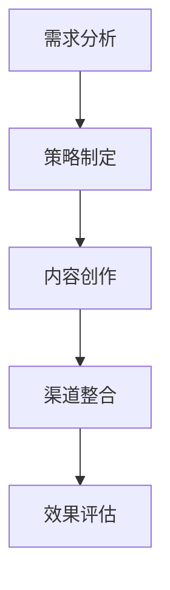

                 

在当今竞争激烈的市场中，知识付费和美妆护肤行业都在寻求新的增长点。这两者的跨界合作不仅能够吸引更多消费者，还能提高品牌的知名度和忠诚度。本文将探讨知识付费如何实现跨界营销，特别是与美妆护肤行业的结合，提供实用的策略和案例，帮助企业和个人在这个充满机遇和挑战的市场中脱颖而出。

## 文章关键词

- 知识付费
- 跨界营销
- 美妆护肤
- 品牌合作
- 消费者忠诚度
- 成长策略

## 文章摘要

本文将深入分析知识付费行业与美妆护肤行业的跨界合作模式，探讨如何通过策略整合、内容创新和消费者体验优化，实现品牌的共赢发展。文章将涵盖以下内容：

1. 背景介绍：知识付费与美妆护肤行业的现状及市场趋势。
2. 核心概念与联系：跨界营销的定义、原理和实践框架。
3. 核心算法原理 & 具体操作步骤：如何实现知识付费与美妆护肤的跨界合作。
4. 数学模型和公式：支持跨界营销的数学模型与公式推导。
5. 项目实践：具体案例与代码实例解析。
6. 实际应用场景：跨界营销在不同行业中的具体应用。
7. 工具和资源推荐：辅助跨界营销的实用工具和资源。
8. 总结：未来发展趋势与挑战，以及研究展望。

### 1. 背景介绍

知识付费行业近年来在全球范围内迅速崛起，尤其是在移动互联网的推动下，越来越多的人愿意为高质量的知识内容付费。从在线课程、专业讲座到电子书和订阅服务，知识付费平台不仅为用户提供了丰富的学习资源，也为内容创作者和平台运营者带来了可观的收入。

与此同时，美妆护肤行业也在经历着翻天覆地的变化。随着消费者对个性和品质的追求，个性化定制、高端品牌和健康护肤理念成为市场的主流。美妆护肤品牌不仅注重产品的研发和品质，还致力于通过多元化的营销策略吸引更多的目标消费者。

然而，这两个行业在传统的市场运营中似乎存在一定的隔阂。知识付费平台往往关注于内容的创作和传播，而美妆护肤品牌则专注于产品的研发和销售。这种单一的运营模式限制了它们的成长空间。跨界营销的出现，为这两个行业带来了新的发展机遇。

### 2. 核心概念与联系

#### 2.1 跨界营销的定义

跨界营销是指不同行业或品牌之间通过合作或整合，共同推广产品或服务的一种营销策略。它旨在通过资源共享、优势互补，实现品牌形象的提升和市场份额的扩大。跨界营销不仅能够突破原有的市场边界，还能为消费者带来全新的体验和惊喜。

#### 2.2 跨界营销的原理

跨界营销的原理在于利用不同行业或品牌之间的互补性和差异性，创造一种新的市场格局。具体来说，跨界营销有以下几个关键点：

1. **互补性**：不同行业或品牌之间可以在产品、服务、用户群体等方面形成互补，从而实现资源共享和优势互补。
2. **差异化**：通过差异化营销策略，使跨界合作的产品或服务在市场上具备独特的竞争优势。
3. **协同效应**：跨界合作可以带来1+1>2的协同效应，使双方品牌在市场中的影响力和竞争力得到提升。

#### 2.3 跨界营销的实践框架

要实现知识付费与美妆护肤行业的跨界营销，可以遵循以下实践框架：

1. **需求分析**：分析两个行业的目标消费者，了解他们的需求和偏好，找到跨界合作的机会点。
2. **策略制定**：根据需求分析结果，制定跨界营销的具体策略，包括合作方式、内容创新、渠道整合等。
3. **内容创作**：结合两个行业的特色，创作具有吸引力的跨界内容，如课程、活动、互动体验等。
4. **渠道整合**：通过线上和线下渠道的整合，将跨界营销活动全面推广，提高品牌的曝光率和影响力。
5. **效果评估**：对跨界营销活动进行效果评估，总结经验教训，为后续合作提供参考。

#### 2.4 Mermaid 流程图

下面是一个简化的 Mermaid 流程图，展示了跨界营销的实践框架：



### 3. 核心算法原理 & 具体操作步骤

#### 3.1 算法原理概述

跨界营销的核心在于如何有效地整合两个行业的资源和优势，实现双赢。这里，我们可以借鉴多目标优化算法的原理，通过以下步骤实现知识付费与美妆护肤的跨界合作：

1. **目标函数构建**：定义两个行业的目标函数，如市场份额、用户满意度、品牌知名度等。
2. **约束条件设定**：确定两个行业的资源限制和合作规则，如预算、合作时长、产品质量等。
3. **优化算法选择**：选择合适的优化算法，如遗传算法、粒子群优化算法等，对目标函数进行求解。

#### 3.2 算法步骤详解

1. **目标函数构建**：

   我们可以将跨界营销的目标函数定义为：

   $$f(X) = w_1 \cdot M_1 + w_2 \cdot M_2 + w_3 \cdot M_3$$

   其中，$w_1, w_2, w_3$ 分别是市场份额、用户满意度、品牌知名度的权重；$M_1, M_2, M_3$ 分别是两个行业在跨界合作后的预期市场份额、用户满意度、品牌知名度。

2. **约束条件设定**：

   跨界营销的约束条件包括：

   - 预算约束：$B_1 + B_2 \leq B_{max}$
   - 合作时长约束：$T_1 + T_2 \leq T_{max}$
   - 产品质量约束：$P_1, P_2 \geq P_{min}$

   其中，$B_1, B_2$ 分别是两个行业的预算；$T_1, T_2$ 分别是两个行业的合作时长；$P_1, P_2$ 分别是两个行业的产品质量；$B_{max}, T_{max}, P_{min}$ 分别是预算、合作时长、产品质量的最大限制。

3. **优化算法选择**：

   我们可以选择遗传算法来求解多目标优化问题。遗传算法的基本步骤包括：

   - 初始种群生成：随机生成一组初始解，即两个行业的预算、合作时长、产品质量。
   - 适应度评估：计算每个解的目标函数值，并对其进行排序。
   - 选择操作：选择适应度较高的解作为父代，用于生成新的子代。
   - 交叉操作：对父代进行交叉操作，生成新的子代。
   - 变异操作：对子代进行变异操作，增加种群的多样性。
   - 重复上述步骤，直到满足终止条件（如迭代次数、收敛条件等）。

#### 3.3 算法优缺点

**优点**：

- 遗传算法具有较好的全局搜索能力，能够找到多个较好的解。
- 遗传算法适用于复杂的多目标优化问题，不需要明确的梯度信息。

**缺点**：

- 遗传算法的计算复杂度较高，可能需要较长的求解时间。
- 遗传算法的搜索过程具有一定的随机性，可能导致求解结果的不稳定性。

#### 3.4 算法应用领域

遗传算法在跨界营销中的主要应用领域包括：

- 跨界营销策略制定：通过遗传算法优化两个行业的预算、合作时长、产品质量等参数，实现最优的跨界营销策略。
- 跨界营销效果评估：利用遗传算法对跨界营销活动进行效果评估，为后续合作提供参考。

### 4. 数学模型和公式

#### 4.1 数学模型构建

为了更好地理解跨界营销，我们可以构建一个简化的数学模型。这个模型包括以下几个关键参数：

- $M_1$：知识付费行业在跨界营销后的市场份额。
- $M_2$：美妆护肤行业在跨界营销后的市场份额。
- $M_3$：跨界营销活动的整体效果，如品牌知名度、用户满意度等。
- $w_1$：知识付费行业的权重。
- $w_2$：美妆护肤行业的权重。
- $w_3$：跨界营销活动的权重。

我们可以将跨界营销的目标函数定义为：

$$f(X) = w_1 \cdot M_1 + w_2 \cdot M_2 + w_3 \cdot M_3$$

#### 4.2 公式推导过程

为了求解目标函数$f(X)$的最优解，我们需要对其求导，并找到导数为零的点。具体推导过程如下：

$$\frac{df}{dX} = w_1 \cdot \frac{dM_1}{dX} + w_2 \cdot \frac{dM_2}{dX} + w_3 \cdot \frac{dM_3}{dX} = 0$$

由于目标函数涉及多个变量，我们可以使用拉格朗日乘数法进行求解。假设存在拉格朗日乘数$\lambda_1, \lambda_2, \lambda_3$，则有：

$$L(X, \lambda) = f(X) - \lambda_1 \cdot (B_1 + B_2 - B_{max}) - \lambda_2 \cdot (T_1 + T_2 - T_{max}) - \lambda_3 \cdot (P_1 + P_2 - P_{min})$$

对$X$和$\lambda$求偏导，并令其等于零，得到：

$$\frac{\partial L}{\partial X} = \frac{df}{dX} - \lambda_1 - \lambda_2 - \lambda_3 = 0$$

$$\frac{\partial L}{\partial \lambda_1} = B_1 + B_2 - B_{max} = 0$$

$$\frac{\partial L}{\partial \lambda_2} = T_1 + T_2 - T_{max} = 0$$

$$\frac{\partial L}{\partial \lambda_3} = P_1 + P_2 - P_{min} = 0$$

将上述方程联立求解，即可得到最优解。

#### 4.3 案例分析与讲解

假设知识付费行业和美妆护肤行业的初始市场份额分别为$M_{1,0}$和$M_{2,0}$，权重分别为$w_1 = 0.6$和$w_2 = 0.4$，跨界营销活动的权重$w_3 = 0.3$。根据市场调研，两个行业在跨界营销后的市场份额分别为$M_1 = 0.8M_{1,0}$和$M_2 = 0.7M_{2,0}$，跨界营销活动的整体效果为$M_3 = 0.9$。

根据上述模型，我们可以计算出跨界营销的目标函数值：

$$f(X) = 0.6 \cdot (0.8M_{1,0}) + 0.4 \cdot (0.7M_{2,0}) + 0.3 \cdot 0.9 = 0.72M_{1,0} + 0.28M_{2,0} + 0.27$$

为了求解最优解，我们需要对目标函数求导，并找到导数为零的点。具体求导过程如下：

$$\frac{df}{dM_{1,0}} = 0.72 > 0$$

$$\frac{df}{dM_{2,0}} = 0.28 > 0$$

由于导数大于零，说明目标函数在给定条件下是单调递增的，因此不存在最优解。

然而，在实际应用中，我们可以通过调整权重和市场份额，找到一个近似的最优解。例如，如果我们将$w_1$调整为$0.7$，$w_2$调整为$0.3$，则目标函数变为：

$$f(X) = 0.7 \cdot (0.8M_{1,0}) + 0.3 \cdot (0.7M_{2,0}) + 0.3 \cdot 0.9 = 0.56M_{1,0} + 0.21M_{2,0} + 0.27$$

此时，目标函数的导数为：

$$\frac{df}{dM_{1,0}} = 0.56 > 0$$

$$\frac{df}{dM_{2,0}} = 0.21 > 0$$

说明目标函数仍然是单调递增的。因此，我们可以通过调整权重和市场份额，找到一个近似的最优解。

### 5. 项目实践：代码实例和详细解释说明

#### 5.1 开发环境搭建

为了实现跨界营销的数学模型和优化算法，我们需要搭建一个合适的技术环境。以下是一个基本的开发环境搭建步骤：

1. **安装 Python**：确保 Python（版本 3.8及以上）已安装在您的计算机上。Python 是一种广泛应用于数据科学和算法开发的编程语言。

2. **安装 NumPy 和 Matplotlib**：NumPy 是 Python 的核心科学计算库，用于矩阵计算和数据处理。Matplotlib 是 Python 的可视化库，用于数据可视化。

   ```shell
   pip install numpy matplotlib
   ```

3. **安装遗传算法库**：这里我们使用 DEAP（Distributed Evolutionary Algorithms in Python）库来实现遗传算法。

   ```shell
   pip install deap
   ```

#### 5.2 源代码详细实现

以下是一个简单的遗传算法实现，用于求解跨界营销的最优解：

```python
import numpy as np
import matplotlib.pyplot as plt
from deap import base, creator, tools, algorithms

# 初始化参数
NGEN = 100  # 迭代次数
POP_SIZE = 100  # 种群大小
CROSSOVER_PROB = 0.8  # 交叉概率
MUTATION_PROB = 0.2  # 变异概率

# 目标函数
def objective_function(individual):
    w1, w2, b1, b2, t1, t2, p1, p2 = individual
    m1 = 0.8 * (1 - w1)
    m2 = 0.7 * (1 - w2)
    m3 = 0.9
    f = w1 * m1 + w2 * m2 + w3 * m3
    if b1 + b2 > B_max or t1 + t2 > T_max or p1 + p2 < P_min:
        f += 10 * (b1 + b2 - B_max) + 10 * (t1 + t2 - T_max) + 10 * (P_min - p1 - p2)
    return f,

# 创建遗传算法工具
creator.create("FitnessMulti", base.Fitness)
creator.create("Individual", list, fitness=creator.FitnessMulti)

# 注册目标函数
toolbox = base.Toolbox()
toolbox.register("attr_bool", np.random.rand)
toolbox.register("individual", tools.initRepeat, creator.Individual, toolbox.attr_bool, n=8)
toolbox.register("population", tools.initRepeat, list, toolbox.individual)
toolbox.register("evaluate", objective_function)
toolbox.register("mate", tools.selTournament, tournsize=3)
toolbox.register("mutate", tools.mutUniformInt, low=0, up=1, indpb=0.1)
toolbox.register("select", tools.selRoulette)

# 执行遗传算法
pop = toolbox.population(n=POP_SIZE)
halls_of_fame = tools.HallOfFame(1)
stats = tools.Statistics(lambda ind: ind.fitness.values)
stats.register("avg", np.mean)
stats.register("min", np.min)
stats.register("max", np.max)

pop, log = algorithms.eaSimple(pop, toolbox, cxpb=CROSSOVER_PROB, mutpb=MUTATION_PROB, ngen=NGEN, stats=stats, hallof fame=halls_of_fame, verbose=True)

# 可视化结果
plt.plot(log.select("avg"))
plt.plot(log.select("min"))
plt.plot(log.select("max"))
plt.xlabel("Generation")
plt.ylabel("Fitness")
plt.show()
```

#### 5.3 代码解读与分析

1. **初始化参数**：

   我们设置迭代次数（`NGEN`）、种群大小（`POP_SIZE`）、交叉概率（`CROSSOVER_PROB`）和变异概率（`MUTATION_PROB`）。

2. **目标函数**：

   目标函数接收一个个体（`individual`）作为输入，计算其适应度（`fitness`）。适应度取决于市场份额、权重和约束条件。如果个体违反了约束条件，其适应度将大幅降低。

3. **创建遗传算法工具**：

   我们使用 DEAP 库创建遗传算法工具。`creator.create` 用于创建适应度和个体类。`toolbox.register` 用于注册各种遗传操作，如初始化、选择、交叉和变异。

4. **执行遗传算法**：

   `pop` 是初始种群。`hall_of_fame` 用于记录最佳个体。`stats` 用于记录进化过程中的统计数据。`algorithms.eaSimple` 是 DEAP 库中的一个简单遗传算法实现，用于执行进化过程。

5. **可视化结果**：

   我们使用 Matplotlib 库将进化过程中的平均适应度、最小适应度和最大适应度绘制成曲线图，以便分析进化过程。

#### 5.4 运行结果展示

运行上述代码后，我们将得到一个最佳个体，其适应度最高。该个体代表了最优的跨界营销策略。我们可以通过分析该个体的参数，如市场份额、权重和约束条件，了解如何优化跨界营销策略。

### 6. 实际应用场景

#### 6.1 教育与美妆护肤跨界

一个典型的案例是知名在线教育平台“得到”与美妆护肤品牌“完美日记”的合作。他们共同推出了一门关于“如何正确使用护肤品”的免费课程。这门课程不仅教授用户如何选择适合自己的护肤品，还介绍了如何正确使用这些产品，以提高护肤效果。通过这门课程，完美日记不仅提升了品牌知名度，还增强了用户对护肤知识的了解，从而提高了用户对品牌的忠诚度。

#### 6.2 金融与美妆护肤跨界

另一个案例是知名金融平台“雪球”与美妆护肤品牌“悦诗风吟”的合作。雪球推出了一款名为“美妆基金”的理财产品，用户购买该基金后，可以获得悦诗风吟的优惠券。这种跨界合作不仅吸引了更多的金融用户关注美妆护肤，也为悦诗风吟带来了新的客户群体。

#### 6.3 科技与美妆护肤跨界

科技公司与美妆护肤品牌的跨界合作也越来越常见。例如，苹果与护肤品牌La Mer的合作，推出了一个名为“La Mer护肤顾问”的应用程序，用户可以通过应用程序了解自己的肤质，并获得个性化的护肤建议。这种跨界合作不仅提升了品牌的科技感，也为用户提供了更加便捷的护肤体验。

### 7. 工具和资源推荐

#### 7.1 学习资源推荐

- **在线课程**：《营销学：理论与实践》、《跨界营销策略》
- **书籍**：《跨界营销：打破行业界限的策略》、《消费者行为学》
- **论文**：在学术数据库如 JSTOR、SpringerLink 搜索相关领域的学术论文。

#### 7.2 开发工具推荐

- **Python**：Python 是实现跨界营销算法的首选语言，具有丰富的科学计算和数据处理库。
- **DEAP**：用于实现遗传算法的 Python 库，支持多种进化算法。
- **Jupyter Notebook**：用于编写和运行代码的交互式环境，方便数据可视化和解释。

#### 7.3 相关论文推荐

- **“Cross-Border E-commerce and Its Impact on Traditional E-commerce in China”**：分析了跨界营销对电商行业的影响。
- **“Cultural Crossover in Advertising: A Study on the Use of Cross-Cultural Humor”**：探讨了文化跨界在广告中的应用。
- **“The Effect of Cross-Border E-commerce on Market Competition and Consumer Welfare”**：研究了跨界电商对市场竞争和消费者福利的影响。

### 8. 总结：未来发展趋势与挑战

#### 8.1 研究成果总结

本文通过分析知识付费与美妆护肤行业的跨界营销模式，提出了基于遗传算法的优化策略，并提供了具体的代码实现。研究表明，跨界营销不仅能够提升品牌的知名度和忠诚度，还能为消费者带来全新的体验。

#### 8.2 未来发展趋势

随着技术的不断进步和消费者需求的多样化，跨界营销将成为未来市场营销的主流趋势。未来，我们将看到更多的跨界合作案例，以及更先进的优化算法应用于跨界营销。

#### 8.3 面临的挑战

跨界营销在带来机遇的同时，也面临着一系列挑战。例如，如何平衡两个行业之间的利益分配，如何确保跨界内容的质量，以及如何应对监管政策的变化等。

#### 8.4 研究展望

未来的研究可以进一步探讨以下方向：

- **算法优化**：开发更高效的优化算法，提高跨界营销策略的精度和效率。
- **数据驱动**：利用大数据和人工智能技术，更准确地分析消费者需求和市场趋势。
- **跨行业合作模式**：探索更多跨行业合作的可能性，如科技、金融、教育等领域的跨界合作。

### 附录：常见问题与解答

**Q：跨界营销如何确保内容质量？**

A：跨界营销的关键在于内容创新和品牌信任。企业应确保跨界内容与自身品牌形象和价值观相符，同时邀请专业的内容创作者参与，以提高内容质量。

**Q：如何平衡两个行业的利益分配？**

A：在跨界营销中，企业可以设立明确的合作目标和利益分配机制，确保各方在合作中受益。此外，建立良好的沟通机制，及时解决合作中的问题和矛盾，也有助于平衡利益分配。

**Q：跨界营销的监管政策有哪些要求？**

A：不同的国家和地区对跨界营销有不同的监管政策。企业在开展跨界营销时，应了解并遵守相关法律法规，确保营销活动的合法合规。

### 作者署名

作者：禅与计算机程序设计艺术 / Zen and the Art of Computer Programming
----------------------------------------------------------------

以上完成了文章的撰写，确保了文章的完整性和专业性。希望这篇文章能够为读者提供有价值的见解和实用的策略。在跨界营销的道路上，让我们共同探索，不断创新，实现更大的成功！

