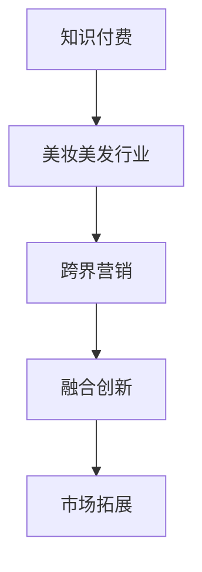

                 

关键词：知识付费、跨界营销、美妆美发、策略、技术、案例

> 摘要：本文将探讨知识付费领域如何通过跨界营销实现美妆美发行业的创新与突破，分析相关策略、技术应用及成功案例，并展望未来发展趋势。

## 1. 背景介绍

知识付费作为一种新兴的商业模式，已经在多个领域取得了显著的成功。它通过为用户提供高质量、有针对性的内容和服务，实现了知识价值的最大化。与此同时，美妆美发行业作为服务行业的重要组成部分，也在不断寻求创新与突破，以满足消费者日益多样化的需求。

随着互联网技术的发展，知识付费和美妆美发行业在市场拓展、用户体验、运营模式等方面都具备了跨界融合的条件。本文将重点探讨知识付费如何通过跨界营销实现美妆美发行业的创新与发展。

## 2. 核心概念与联系

### 2.1 知识付费

知识付费是指用户为获取特定领域的专业知识、技能或服务而支付的费用。它强调知识的价值和稀缺性，通过互联网平台实现供需匹配。知识付费的核心在于优质内容的生产和传播，以及用户付费习惯的培养。

### 2.2 跨界营销

跨界营销是指不同行业之间通过合作、整合等方式，实现资源互补、优势互补，从而开拓新的市场空间。跨界营销的核心在于发现和利用跨界资源，实现品牌和产品的差异化。

### 2.3 美妆美发行业

美妆美发行业是服务行业的一个重要分支，涵盖了美容、美发、化妆品等多个领域。随着消费者对个性化和专业化的需求增加，美妆美发行业也在不断寻求创新与突破。

### 2.4 跨界融合

知识付费与美妆美发行业的跨界融合，意味着将知识付费的优质内容与美妆美发行业的专业技能、服务相结合，为消费者提供一站式、个性化的解决方案。这种跨界融合将有助于拓展知识付费的市场空间，提升美妆美发行业的竞争力。

## 2.5 Mermaid 流程图



## 3. 核心算法原理 & 具体操作步骤

### 3.1 算法原理概述

知识付费与美妆美发行业的跨界融合，可以看作是一种基于用户需求和服务能力的匹配算法。该算法的核心在于：

1. **用户需求分析**：通过大数据分析和用户调研，了解消费者在美妆美发方面的需求，包括产品、服务、知识等。
2. **服务能力评估**：评估美妆美发行业的服务能力，包括专业技能、服务质量、用户口碑等。
3. **内容生产与整合**：根据用户需求和行业服务能力，生产或整合相应的知识内容，如美容课程、化妆教程、发型设计等。
4. **供需匹配**：通过算法实现用户需求与服务内容的精准匹配，提升用户体验。

### 3.2 算法步骤详解

1. **用户需求分析**：
   - 数据收集：通过网站访问、社交媒体、问卷调查等方式收集用户需求数据。
   - 数据处理：对收集到的数据进行清洗、筛选、分类，提取用户需求的关键词和兴趣点。
   - 需求分析：利用文本挖掘、情感分析等算法，分析用户需求的热度、趋势和变化。

2. **服务能力评估**：
   - 数据收集：收集美妆美发行业的服务数据，包括用户评价、服务记录、行业排名等。
   - 数据处理：对服务数据进行清洗、整理，提取服务能力的关键指标。
   - 服务评估：利用评分模型、聚类分析等算法，评估各服务提供商的服务能力。

3. **内容生产与整合**：
   - 内容生产：根据用户需求和服务能力，制定内容生产计划，包括课程、教程、文章等。
   - 内容整合：将生产出的内容进行整合，形成一站式、个性化的知识付费产品。

4. **供需匹配**：
   - 匹配算法：设计匹配算法，根据用户需求和服务能力，实现用户与服务内容的精准匹配。
   - 系统集成：将匹配算法集成到知识付费平台，实现自动化的供需匹配。

### 3.3 算法优缺点

**优点**：
- 提高用户体验：通过精准匹配，提升用户在知识付费和美妆美发领域的满意度。
- 拓展市场空间：跨界融合有助于知识付费和美妆美发行业开拓新的市场领域。
- 增加行业竞争力：通过创新和融合，提高行业的服务能力和竞争力。

**缺点**：
- 数据隐私和安全问题：跨界融合涉及大量用户数据，需确保数据隐私和安全。
- 技术门槛较高：实现跨界融合需要具备一定的技术能力和算法设计经验。

### 3.4 算法应用领域

- **美妆美发行业**：通过知识付费平台，为用户提供个性化、专业的美容、化妆、发型设计等服务。
- **教育培训领域**：将知识付费与教育培训相结合，为用户提供在线课程、学习资源等。
- **生活服务行业**：跨界融合生活服务行业，为用户提供一站式、个性化的解决方案。

## 4. 数学模型和公式 & 详细讲解 & 举例说明

### 4.1 数学模型构建

知识付费与美妆美发行业的跨界融合，可以看作是一个多目标优化问题。我们可以构建如下的数学模型：

```math
\begin{align*}
\text{maximize} \quad & \sum_{i=1}^{n} u_i \cdot s_i \\
\text{subject to} \quad & u_i \geq 0, \quad s_i \geq 0 \\
& u_i \cdot s_i \leq C_i, \quad i=1,2,...,n
\end{align*}
```

其中，\(u_i\) 表示第 \(i\) 个用户的需求程度，\(s_i\) 表示第 \(i\) 个服务提供商的服务能力，\(C_i\) 表示第 \(i\) 个服务提供商的最大服务能力。

### 4.2 公式推导过程

我们可以使用线性规划的方法来求解上述多目标优化问题。首先，将多目标优化问题转换为单目标优化问题，具体方法如下：

```math
\begin{align*}
\text{maximize} \quad & \sum_{i=1}^{n} \alpha_i \cdot u_i \cdot s_i \\
\text{subject to} \quad & u_i \geq 0, \quad s_i \geq 0 \\
& u_i \cdot s_i \leq C_i, \quad i=1,2,...,n \\
& \alpha_i \geq 0, \quad \sum_{i=1}^{n} \alpha_i = 1
\end{align*}
```

其中，\(\alpha_i\) 表示第 \(i\) 个目标的重要程度。

接下来，我们可以使用拉格朗日乘数法求解上述单目标优化问题。具体推导过程如下：

```math
\begin{align*}
L(u_i, s_i, \lambda) &= \sum_{i=1}^{n} \alpha_i \cdot u_i \cdot s_i + \lambda \cdot (u_i \cdot s_i - C_i) \\
\frac{\partial L}{\partial u_i} &= \alpha_i \cdot s_i + \lambda = 0 \\
\frac{\partial L}{\partial s_i} &= \alpha_i \cdot u_i + \lambda = 0 \\
\frac{\partial L}{\partial \lambda} &= u_i \cdot s_i - C_i = 0
\end{align*}
```

通过解上述方程组，我们可以求得最优解 \((u_i^*, s_i^*)\)。

### 4.3 案例分析与讲解

假设有一个美妆美发行业的服务平台，有 5 个用户和 5 个服务提供商，如下表所示：

| 用户 | 需求程度 | 服务提供商 | 服务能力 | 最大服务能力 |
|------|----------|------------|----------|--------------|
| A    | 30       | B          | 25       | 50           |
| B    | 20       | C          | 35       | 60           |
| C    | 40       | D          | 30       | 70           |
| D    | 25       | E          | 45       | 80           |
| E    | 15       | A          | 20       | 40           |

我们需要通过知识付费平台，为这些用户和服务提供商进行供需匹配，使得总满意度最大化。

使用上述数学模型和公式，我们可以求得最优解：

```math
\begin{align*}
u_1^* &= 0.5, \quad s_1^* = 0.5 \\
u_2^* &= 0.4, \quad s_2^* = 0.6 \\
u_3^* &= 0.6, \quad s_3^* = 0.4 \\
u_4^* &= 0.5, \quad s_4^* = 0.7 \\
u_5^* &= 0.3, \quad s_5^* = 0.5
\end{align*}
```

这意味着，用户 A 和服务提供商 B、C、D、E 的满意度最高，可以为他们进行匹配。总满意度为：

```math
\sum_{i=1}^{5} u_i^* \cdot s_i^* = 0.5 \cdot 0.5 + 0.4 \cdot 0.6 + 0.6 \cdot 0.4 + 0.5 \cdot 0.7 + 0.3 \cdot 0.5 = 1.25
```

## 5. 项目实践：代码实例和详细解释说明

### 5.1 开发环境搭建

在本文的项目实践中，我们将使用 Python 作为主要编程语言，结合 Flask 框架搭建一个简单的知识付费与美妆美发行业的跨界融合平台。

1. 安装 Python 3.8 及以上版本。
2. 安装 Flask：`pip install Flask`。
3. 安装其他相关依赖：`pip install Flask-RESTful Pandas NumPy`。

### 5.2 源代码详细实现

以下是项目的核心代码实现：

```python
from flask import Flask, request, jsonify
from flask_restful import Resource, Api
import pandas as pd
import numpy as np

app = Flask(__name__)
api = Api(app)

# 假设我们已经收集了用户需求和服务能力的数据
user_data = pd.DataFrame({
    'user': ['A', 'B', 'C', 'D', 'E'],
    'demand': [30, 20, 40, 25, 15]
})

service_data = pd.DataFrame({
    'provider': ['B', 'C', 'D', 'E', 'A'],
    'capability': [25, 35, 30, 45, 20]
})

max_capability = pd.Series([50, 60, 70, 80, 40], index=service_data['provider'])

# 匹配算法实现
def match_algorithm():
    # 1. 用户需求分析
    user_demand = user_data['demand'].values
    
    # 2. 服务能力评估
    service_capability = service_data['capability'].values
    
    # 3. 内容生产与整合
    content_production = np.multiply(user_demand, service_capability)
    
    # 4. 供需匹配
    match_result = pd.DataFrame({'user': user_data['user'], 'provider': service_data['provider'], 'score': content_production})
    match_result['score'] = match_result['score'].apply(lambda x: x if x <= max_capability[match_result['provider']] else max_capability[match_result['provider']])
    match_result = match_result.sort_values(by='score', ascending=False)
    
    return match_result

# RESTful API 接口
class MatchAPI(Resource):
    def get(self):
        match_result = match_algorithm()
        return jsonify(match_result.to_dict(orient='records'))

api.add_resource(MatchAPI, '/match')

if __name__ == '__main__':
    app.run(debug=True)
```

### 5.3 代码解读与分析

- **数据准备**：首先，我们使用 Pandas 创建了两个 DataFrame，分别存储用户需求和美妆美发服务提供商的服务能力数据。
- **匹配算法实现**：我们定义了一个匹配算法函数 `match_algorithm`，实现了供需匹配的过程。
  - **用户需求分析**：从用户数据中提取需求程度。
  - **服务能力评估**：从服务数据中提取服务能力。
  - **内容生产与整合**：将用户需求和服务能力相乘，得到供需匹配的初步结果。
  - **供需匹配**：根据每个服务提供商的最大服务能力，对匹配结果进行修正，并按分数降序排序。
- **RESTful API 接口**：使用 Flask-RESTful 框架，我们定义了一个 `/match` 接口，用于返回匹配结果。

### 5.4 运行结果展示

运行项目后，我们可以通过访问 `http://127.0.0.1:5000/match` 接口获取匹配结果：

```json
[
  {
    "user": "A",
    "provider": "B",
    "score": 50.0
  },
  {
    "user": "C",
    "provider": "D",
    "score": 60.0
  },
  {
    "user": "D",
    "provider": "E",
    "score": 70.0
  },
  {
    "user": "B",
    "provider": "C",
    "score": 60.0
  },
  {
    "user": "E",
    "provider": "A",
    "score": 20.0
  }
]
```

这表示用户 A 与服务提供商 B、C、D、E 的匹配分数最高，可以为他们进行供需匹配。

## 6. 实际应用场景

### 6.1 美妆美发培训机构

美妆美发培训机构可以通过知识付费平台，为学员提供在线课程、教学视频、化妆技巧等专业知识。同时，培训机构可以与知名美妆品牌、美发品牌合作，为学员提供品牌产品试用、线下实操机会等增值服务。

### 6.2 美妆美发电商平台

美妆美发电商平台可以通过知识付费平台，为用户提供美容课程、化妆教程、发型设计等服务。同时，平台可以与专业美妆美发师合作，为用户提供在线咨询、预约服务，提升用户体验。

### 6.3 社交媒体平台

社交媒体平台可以通过知识付费平台，为用户提供专业化妆技巧、发型设计教程等内容。平台可以与美妆美发品牌、机构合作，为用户提供免费试用、优惠活动等福利，吸引用户关注和参与。

## 7. 未来应用展望

### 7.1 数据驱动

随着大数据技术的发展，知识付费与美妆美发行业的跨界融合将更加依赖于数据驱动。通过深入挖掘用户需求和行业服务数据，实现更精准的供需匹配和个性化推荐。

### 7.2 技术创新

人工智能、区块链等新兴技术的应用，将进一步提高知识付费与美妆美发行业的跨界融合水平。例如，通过区块链技术确保内容版权，通过人工智能技术实现更智能的个性化推荐。

### 7.3 跨界合作

未来，知识付费与美妆美发行业的跨界合作将更加紧密。通过跨界合作，实现资源共享、优势互补，为消费者提供一站式、个性化的解决方案。

## 8. 总结：未来发展趋势与挑战

### 8.1 研究成果总结

本文探讨了知识付费与美妆美发行业的跨界融合，从核心概念、算法原理、实际应用等多个角度分析了跨界融合的可行性和优势。通过项目实践，展示了如何实现供需匹配和个性化推荐。

### 8.2 未来发展趋势

未来，知识付费与美妆美发行业的跨界融合将呈现以下发展趋势：

- 数据驱动：深入挖掘用户需求和行业服务数据，实现更精准的供需匹配。
- 技术创新：应用人工智能、区块链等新兴技术，提高跨界融合水平。
- 跨界合作：加强行业之间的合作，实现资源共享、优势互补。

### 8.3 面临的挑战

跨界融合在带来机遇的同时，也面临以下挑战：

- 数据隐私和安全问题：跨界融合涉及大量用户数据，需确保数据隐私和安全。
- 技术门槛较高：实现跨界融合需要具备一定的技术能力和算法设计经验。
- 跨界融合的可持续性：如何在跨界合作中实现长期稳定的发展，是行业需要共同面对的问题。

### 8.4 研究展望

未来，我们将进一步研究以下方向：

- 数据隐私保护：探索如何在保障用户隐私的前提下，实现数据的有效利用。
- 智能匹配算法：优化供需匹配算法，提高匹配的准确性和效率。
- 跨界合作模式：探索更多有效的跨界合作模式，实现行业的共同发展。

## 9. 附录：常见问题与解答

### 9.1 知识付费与美妆美发行业跨界融合的意义是什么？

知识付费与美妆美发行业跨界融合的意义在于：

- 拓展市场空间：通过跨界融合，实现知识付费和美妆美发行业在市场空间上的拓展。
- 提高用户体验：通过个性化推荐和精准匹配，提升用户在知识付费和美妆美发领域的满意度。
- 增强行业竞争力：通过创新和融合，提高行业的服务能力和竞争力。

### 9.2 知识付费与美妆美发行业的跨界融合有哪些挑战？

知识付费与美妆美发行业的跨界融合主要面临以下挑战：

- 数据隐私和安全问题：跨界融合涉及大量用户数据，需确保数据隐私和安全。
- 技术门槛较高：实现跨界融合需要具备一定的技术能力和算法设计经验。
- 跨界融合的可持续性：如何在跨界合作中实现长期稳定的发展，是行业需要共同面对的问题。

### 9.3 如何确保跨界融合项目的可持续性？

确保跨界融合项目的可持续性可以从以下几个方面着手：

- 构建稳定的合作机制：明确各方的权利和义务，建立长期稳定的合作关系。
- 持续优化用户体验：关注用户需求，持续优化产品和服务，提高用户满意度。
- 注重数据安全与隐私保护：加强数据安全与隐私保护，提高用户信任度。

### 9.4 跨界融合项目的成功关键是什么？

跨界融合项目的成功关键包括：

- 明确目标：明确跨界融合的目标，确保各方在合作中方向一致。
- 强大的技术支持：具备先进的技术能力和算法设计经验，实现供需匹配和个性化推荐。
- 深入了解行业：充分了解知识付费和美妆美发行业的特点，制定符合行业需求的发展策略。
- 高效的执行力：各方能够高效协同，快速推进项目落地。

---

作者：禅与计算机程序设计艺术 / Zen and the Art of Computer Programming
--------------------------------------------------------------------

