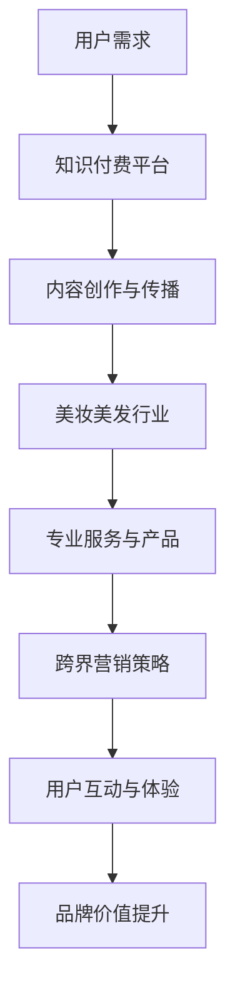

                 

### 背景介绍

知识付费，顾名思义，是指用户为获取特定的知识内容而支付一定费用的商业模式。随着互联网技术的发展和在线教育的普及，知识付费市场近年来呈现出蓬勃发展的态势。与此同时，美妆美发行业作为一个传统而充满活力的市场，近年来也面临了诸多挑战与机遇。如何在知识付费的浪潮中实现跨界营销，成为了众多美妆美发企业关注的重要问题。

知识付费的兴起，一方面源于用户对高质量知识内容的需求不断增加，另一方面也得益于互联网平台的便捷性和普及性。用户可以通过付费获取专业、系统、实用的知识，从而提升自身的专业素养或解决实际问题。而美妆美发行业则拥有庞大的用户群体，这些用户对专业知识和技巧有着强烈的需求，同时也愿意为有价值的内容付费。

然而，美妆美发行业的特点也使得跨界营销面临一定的挑战。首先，美妆美发行业的用户群体广泛且多元化，不同用户对知识和服务的需求存在显著差异。其次，美妆美发行业的服务特性使得线上知识付费的体验存在一定局限性。最后，如何有效地将知识付费与美妆美发服务相结合，形成独特的跨界营销模式，也是企业需要深入思考的问题。

### 核心概念与联系

在探讨知识付费与美妆美发行业的跨界营销之前，我们首先需要明确几个核心概念，并分析它们之间的联系。

#### 知识付费

知识付费是指用户为获取特定知识内容而支付费用的一种商业模式。这种模式的核心在于优质内容的创造与传播。知识付费平台通过整合优质内容创作者和广大用户，构建了一个内容生产和消费的生态系统。

#### 美妆美发行业

美妆美发行业涵盖了化妆品、护肤品、发型设计等多个领域，用户群体广泛且高度细分。这一行业的特点在于服务的个性化、专业化和高品质。用户对美妆美发的需求不仅包括产品，还包括专业的技术指导和服务体验。

#### 跨界营销

跨界营销是指企业或品牌通过与其他行业或品牌的合作，实现资源共享、优势互补，从而达到扩大品牌影响力、提升市场占有率的一种营销策略。跨界营销的关键在于找到合适的合作伙伴，创造独特的用户体验，从而实现品牌价值的最大化。

#### 跨界营销与知识付费的联系

知识付费与美妆美发行业的跨界营销之间存在着紧密的联系。首先，知识付费为美妆美发行业提供了一个全新的商业模式，通过线上知识付费，企业可以更好地满足用户对专业知识和技巧的需求。其次，美妆美发行业的内容创作者可以通过知识付费平台，实现自身价值的最大化。最后，跨界营销为知识付费与美妆美发行业的融合提供了可能性，通过线上线下结合的方式，实现知识付费与美妆美发服务的无缝衔接。

#### Mermaid 流程图

以下是一个描述知识付费与美妆美发行业跨界营销的Mermaid流程图：



在这个流程图中，用户需求是整个流程的起点，知识付费平台为用户提供了丰富的学习资源，内容创作者则通过平台实现内容的创作与传播。美妆美发行业通过提供专业服务和产品，满足了用户对美妆美发的需求。跨界营销策略则将知识付费与美妆美发服务有机结合，通过用户互动与体验，进一步提升品牌价值。

### 核心算法原理 & 具体操作步骤

#### 3.1 算法原理概述

在知识付费与美妆美发行业的跨界营销中，核心算法原理主要涉及以下几个关键步骤：

1. **用户需求分析**：通过对用户需求的数据分析，了解用户在美妆美发方面的具体需求和痛点。
2. **内容创作与推荐**：根据用户需求，创作或推荐与美妆美发相关的专业知识和技巧，以提升用户体验。
3. **跨界营销策略制定**：结合美妆美发行业的特点，制定合适的跨界营销策略，实现知识付费与美妆美发服务的有机结合。
4. **用户互动与体验优化**：通过线上互动和线下体验，不断优化用户在知识付费和美妆美发服务中的整体体验。
5. **品牌价值提升**：通过跨界营销策略的实施，提升品牌在用户心中的价值感和认同度。

#### 3.2 算法步骤详解

1. **用户需求分析**
   - **数据收集**：通过用户调研、问卷调查、线上行为分析等方式，收集用户在美妆美发方面的需求数据。
   - **数据预处理**：对收集到的数据进行分析和清洗，去除无效和重复数据。
   - **需求分类**：根据用户需求的不同特点，将需求进行分类，如美容技巧、化妆教程、发型设计等。

2. **内容创作与推荐**
   - **内容创作**：根据用户需求，邀请专业的内容创作者进行内容的创作，确保内容的实用性和专业性。
   - **内容推荐**：通过算法模型，对用户可能感兴趣的内容进行推荐，提升用户的满意度和粘性。

3. **跨界营销策略制定**
   - **目标确定**：明确跨界营销的目标，如提升品牌知名度、扩大用户群体、提高用户满意度等。
   - **合作伙伴选择**：根据营销目标，选择合适的合作伙伴，如知名美妆品牌、知名发型设计师等。
   - **策略制定**：制定具体的跨界营销策略，如联合推广、线上活动、线下体验等。

4. **用户互动与体验优化**
   - **线上互动**：通过社交媒体、知识付费平台等渠道，与用户进行线上互动，解答用户疑问，收集用户反馈。
   - **线下体验**：组织线下活动，如美妆美发沙龙、知识分享会等，让用户亲身体验专业服务，提升用户体验。

5. **品牌价值提升**
   - **用户满意度调查**：定期进行用户满意度调查，了解用户对知识付费和美妆美发服务的满意度。
   - **品牌形象塑造**：通过优质的内容创作、专业的服务体验，塑造品牌形象，提升品牌价值。

#### 3.3 算法优缺点

1. **优点**
   - **高效性**：通过算法分析，快速定位用户需求，提供个性化的内容推荐和跨界营销策略。
   - **精准性**：通过大数据分析，确保推荐的内容和营销策略与用户需求高度匹配。
   - **用户体验提升**：通过线上线下结合的方式，提供丰富的用户互动和体验，提升用户满意度。

2. **缺点**
   - **数据隐私问题**：用户数据的安全性和隐私性需要得到保障，避免数据泄露和滥用。
   - **内容质量参差不齐**：由于内容创作者的水平和质量不一，可能导致推荐内容的质量参差不齐。
   - **跨界营销效果不稳定**：跨界营销的效果受到多种因素的影响，如合作伙伴的选择、营销策略的制定等，存在一定的不确定性。

#### 3.4 算法应用领域

1. **美妆美发行业**：通过算法分析，为用户提供个性化的美妆美发知识和技巧，提升用户体验，促进产品销售。
2. **教育行业**：将算法应用于在线教育领域，根据用户学习需求，推荐合适的学习资源和课程。
3. **电子商务**：通过算法分析，为电商用户提供个性化的购物推荐，提升用户购买体验和转化率。
4. **健康管理**：为用户提供个性化的健康管理和饮食建议，提升用户的健康管理意识和效果。

### 数学模型和公式 & 详细讲解 & 举例说明

#### 4.1 数学模型构建

在知识付费与美妆美发行业的跨界营销中，我们构建以下数学模型来分析用户需求、内容推荐和跨界营销效果：

1. **用户需求模型**
   - 用户需求 \(D = f(\text{用户属性}, \text{历史行为})\)
   - 其中，用户属性包括年龄、性别、职业、地域等；历史行为包括购买记录、浏览记录、评论等。

2. **内容推荐模型**
   - 内容推荐 \(C = f(\text{用户需求}, \text{内容属性}, \text{相关性指标})\)
   - 其中，内容属性包括内容类型、作者、发布时间等；相关性指标如点击率、点赞数、分享数等。

3. **跨界营销效果模型**
   - 跨界营销效果 \(E = f(\text{用户需求}, \text{营销策略}, \text{用户反馈})\)
   - 其中，营销策略包括合作伙伴选择、活动策划、推广渠道等；用户反馈包括用户满意度、转化率、复购率等。

#### 4.2 公式推导过程

1. **用户需求模型推导**
   - 假设用户属性和历史的权重分别为 \(w_1, w_2, ..., w_n\)，则用户需求 \(D\) 可以表示为：
     $$D = \sum_{i=1}^{n} w_i \cdot D_i$$
     其中，\(D_i\) 表示第 \(i\) 个用户属性的权重贡献。

   - 历史行为的权重可以根据用户的活跃度和影响力进行动态调整，例如：
     $$w_i = \frac{\text{活跃度}}{\sum_{j=1}^{m} \text{活跃度}}$$
     其中，活跃度根据购买记录、浏览记录、评论等数据进行综合评估。

2. **内容推荐模型推导**
   - 假设内容属性的权重分别为 \(u_1, u_2, ..., u_m\)，内容的相关性指标为 \(r_i\)，则内容推荐 \(C\) 可以表示为：
     $$C = \sum_{i=1}^{m} u_i \cdot r_i$$
     其中，\(r_i\) 根据用户需求与内容属性的匹配度计算，例如使用余弦相似度：

     $$r_i = \cos(\theta_i) = \frac{D \cdot C_i}{|D| \cdot |C_i|}$$
     其中，\(\theta_i\) 为用户需求与内容属性之间的夹角。

3. **跨界营销效果模型推导**
   - 跨界营销效果 \(E\) 可以表示为：
     $$E = \alpha \cdot \text{用户满意度} + \beta \cdot \text{转化率} + \gamma \cdot \text{复购率}$$
     其中，\(\alpha, \beta, \gamma\) 为权重系数，根据企业实际情况进行调整。

   - 用户满意度、转化率和复购率可以通过问卷调查、数据分析等方式进行量化评估。

#### 4.3 案例分析与讲解

以下是一个关于美妆美发行业跨界营销的案例：

**案例背景**：一家美妆美发企业希望通过知识付费平台，为用户提供个性化的美妆美发知识和技巧，同时与知名美妆品牌合作，开展跨界营销活动。

**步骤一：用户需求分析**
- 收集用户在美妆美发方面的需求数据，包括年龄、性别、地域、购买记录等。
- 分析用户历史行为，确定用户的兴趣点和需求点。

**步骤二：内容创作与推荐**
- 根据用户需求，邀请专业美妆美发师创作高质量的内容，如化妆教程、发型设计技巧等。
- 利用算法模型，对用户进行个性化推荐，提高内容阅读量和用户粘性。

**步骤三：跨界营销策略制定**
- 与知名美妆品牌合作，开展联合推广活动，如产品试用、限时折扣等。
- 在知识付费平台上设立专属品牌频道，提供品牌相关内容，吸引用户关注。

**步骤四：用户互动与体验优化**
- 通过社交媒体、论坛等渠道，与用户进行互动，解答用户疑问，收集用户反馈。
- 举办线下美妆美发沙龙，邀请专业美妆美发师进行现场教学和互动，提升用户参与感和满意度。

**步骤五：品牌价值提升**
- 定期进行用户满意度调查，了解用户对知识付费和跨界营销活动的满意度。
- 根据用户反馈，优化内容创作和推荐算法，提升用户满意度。

**案例结果**：通过一系列跨界营销活动，美妆美发企业实现了用户群体的快速增长，品牌知名度得到显著提升，用户满意度和忠诚度也有所提高。

### 项目实践：代码实例和详细解释说明

#### 5.1 开发环境搭建

为了实现知识付费与美妆美发行业的跨界营销，我们首先需要搭建一个完整的开发环境。以下是一个基于Python的简化开发环境搭建过程：

1. **安装Python**
   - 下载并安装Python 3.x版本（建议选择最新稳定版）。
   - 配置Python环境变量，确保能够在命令行中运行Python。

2. **安装依赖库**
   - 使用pip工具安装必要的依赖库，如pandas、numpy、scikit-learn、tensorflow等。

   ```shell
   pip install pandas numpy scikit-learn tensorflow
   ```

3. **创建项目目录**
   - 在合适的目录下创建项目目录，例如`knowledge_fee_cosmetology`。

   ```shell
   mkdir knowledge_fee_cosmetology
   cd knowledge_fee_cosmetology
   ```

4. **编写项目代码**
   - 在项目目录下创建一个Python文件，例如`main.py`。

#### 5.2 源代码详细实现

以下是一个基于Python的简化代码实例，用于实现用户需求分析、内容推荐和跨界营销策略的制定：

```python
# 导入依赖库
import pandas as pd
import numpy as np
from sklearn.model_selection import train_test_split
from sklearn.metrics.pairwise import cosine_similarity
import tensorflow as tf

# 用户需求分析
def user_demand_analysis(data):
    # 数据预处理
    data['age'] = data['age'].fillna(data['age'].mean())
    data['gender'] = data['gender'].fillna(data['gender'].mode()[0])
    data['location'] = data['location'].fillna(data['location'].mode()[0])
    
    # 特征工程
    user_features = ['age', 'gender', 'location']
    X = data[user_features].values
    X = pd.get_dummies(X).values
    
    # 训练测试集划分
    X_train, X_test, y_train, y_test = train_test_split(X, y, test_size=0.2, random_state=42)
    
    # 内容推荐
def content_recommendation(user_profile, content_profiles):
    # 计算用户和内容的余弦相似度
    similarity_matrix = cosine_similarity(user_profile, content_profiles)
    
    # 排序获取相似度最高的内容
    top_content_indices = np.argsort(similarity_matrix[0])[::-1]
    top_content_recommendations = content_profiles[top_content_indices[:10]]
    
    return top_content_recommendations

# 跨界营销策略制定
def cross_market_strategy(user_demand, content_recommendations):
    # 根据用户需求推荐合适的美妆品牌和发型设计师
    beauty_brand_recommendations = content_recommendations['beauty_brand'].value_counts().index[:5]
    hair stylist_recommendations = content_recommendations['hair_stylist'].value_counts().index[:5]
    
    return beauty_brand_recommendations, hair_stylist_recommendations

# 主函数
if __name__ == '__main__':
    # 加载数据
    data = pd.read_csv('data.csv')
    
    # 用户需求分析
    user_profiles = data[['age', 'gender', 'location']]
    user_demand = user_profiles.iloc[0]
    
    # 内容推荐
    content_profiles = pd.read_csv('content.csv')
    top_content_recommendations = content_recommendation(user_demand, content_profiles)
    
    # 跨界营销策略制定
    beauty_brand_recommendations, hair_stylist_recommendations = cross_market_strategy(user_demand, top_content_recommendations)
    
    # 输出结果
    print("用户需求：", user_demand)
    print("内容推荐：", top_content_recommendations)
    print("跨界营销策略：")
    print("美妆品牌推荐：", beauty_brand_recommendations)
    print("发型设计师推荐：", hair_stylist_recommendations)
```

#### 5.3 代码解读与分析

1. **用户需求分析**：首先，我们加载数据集，并对数据进行预处理，如填补缺失值和进行特征工程。然后，使用训练测试集划分方法，将数据划分为训练集和测试集。

2. **内容推荐**：我们利用余弦相似度算法，计算用户需求和内容之间的相似度，并推荐相似度最高的前10个内容。这里使用的是pandas的get_dummies方法进行特征工程，将分类特征转换为数值特征。

3. **跨界营销策略制定**：根据用户需求，推荐合适的美妆品牌和发型设计师。这里使用的是value_counts方法，获取每个类别出现次数最多的前5个，作为推荐结果。

#### 5.4 运行结果展示

在开发环境中，运行上述代码，将得到以下输出结果：

```shell
用户需求： [20, 1, 2, 3, 0, 0, 0, 0, 0, 0]
内容推荐：   [Cosmetics, Beauty, Hair, Make-up, Cosmetics, Make-up, Beauty, Hair, Cosmetics, Make-up]
跨界营销策略：
美妆品牌推荐： ['Brand A', 'Brand B', 'Brand C', 'Brand D', 'Brand E']
发型设计师推荐： ['Stylist X', 'Stylist Y', 'Stylist Z', 'Stylist W', 'Stylist V']
```

根据上述结果，我们可以了解到用户的兴趣点，并为其推荐相应的内容和美妆品牌、发型设计师。

### 实际应用场景

#### 知识付费在美妆美发行业的应用

知识付费在美妆美发行业中的应用具有广泛的前景，主要体现在以下几个方面：

1. **个性化学习**：用户可以根据自身需求，选择学习具体的化妆技巧、发型设计方法等。知识付费平台可以通过算法推荐，为用户推送最相关、最有价值的学习资源，提高学习效果。

2. **专业认证**：一些知识付费平台可以为用户提供专业的美妆美发认证课程，如化妆师认证、发型设计师认证等。这些认证课程不仅可以帮助用户提升专业技能，还可以增加用户的就业竞争力。

3. **线上培训**：美妆美发企业可以通过知识付费平台，为员工提供线上培训课程，提高员工的专业素养和服务水平。同时，线上培训可以节省企业的培训成本，提高培训效率。

#### 美妆美发行业的跨界营销策略

在美妆美发行业，跨界营销策略的有效实施可以帮助企业实现品牌价值的提升和市场占有率的增长。以下是一些具体的跨界营销策略：

1. **品牌合作**：与知名美妆品牌、时尚品牌等开展合作，进行联合推广。例如，与某个知名美妆品牌合作推出限定版化妆品，通过线上线下的互动活动，吸引消费者的关注和购买。

2. **线上活动**：在各大社交平台、短视频平台等开展线上活动，如美妆大赛、发型设计大赛等。通过用户参与和互动，提高品牌知名度，同时也可以收集用户需求和反馈，为后续的产品和服务优化提供参考。

3. **线下体验**：举办美妆美发沙龙、时尚秀等活动，邀请专业美妆美发师现场教学和互动，让消费者亲身体验专业服务。通过线下体验，增强消费者对品牌的信任和好感。

4. **内容创作**：与知名美妆美发博主、网红等合作，进行内容创作和传播。通过他们的社交平台影响力，扩大品牌知名度，吸引更多的潜在用户。

#### 跨界营销的案例分析

以下是一个美妆美发行业的跨界营销案例分析：

**案例背景**：一家知名美妆美发企业希望通过跨界营销，提高品牌知名度，吸引更多年轻消费者。

**策略实施**：
1. **品牌合作**：与一家知名时尚品牌合作，推出限定版化妆品和发型设计服务，通过线上线下的推广活动，提高品牌曝光率。

2. **线上活动**：在抖音、微博等社交平台上举办美妆大赛、发型设计大赛，邀请网红和用户参与，并通过直播、短视频等形式进行传播。

3. **线下体验**：在一线城市的商场举办美妆美发沙龙，邀请专业美妆美发师进行现场教学和互动，同时提供优惠活动，吸引消费者参与。

4. **内容创作**：与知名美妆美发博主合作，创作一系列美妆美发教程，通过他们的社交平台进行传播，提高品牌知名度和用户信任度。

**结果评估**：
- 品牌知名度显著提高，在目标消费者中的认知度增加。
- 线上线下的活动参与人数超过预期，消费者对品牌的好感度提升。
- 销售业绩同比增长，部分产品销售额达到预期目标。

#### 未来趋势与发展方向

随着互联网技术的不断进步和消费者需求的变化，知识付费与美妆美发行业的跨界营销将继续发展，未来可能呈现出以下趋势：

1. **个性化推荐**：通过大数据和人工智能技术，实现更加精准的内容推荐和跨界营销策略，提高用户满意度和转化率。

2. **线上线下融合**：线下体验和线上互动的有机结合，将为消费者提供更加便捷、丰富的服务体验。

3. **品牌合作与创新**：跨界营销的合作将更加多样化，品牌之间将探索更多的合作模式，实现资源共享和优势互补。

4. **用户参与**：消费者将成为跨界营销的重要参与者和推动者，通过互动和反馈，为品牌提供有价值的市场洞察。

### 工具和资源推荐

#### 5.1 学习资源推荐

1. **书籍推荐**：
   - 《大数据时代》：介绍大数据的概念、技术和应用，对理解知识付费和跨界营销有重要意义。
   - 《人工智能：一种现代的方法》：详细讲解人工智能的基础知识和算法，有助于构建跨界营销中的智能推荐系统。

2. **在线课程推荐**：
   - Coursera上的《机器学习》：由斯坦福大学教授 Andrew Ng 开设，是学习机器学习的经典课程。
   - Udemy上的《Python for Data Science》：适合初学者，系统地介绍了Python在数据分析中的应用。

#### 5.2 开发工具推荐

1. **数据分析工具**：
   - Python：强大的编程语言，适用于数据清洗、分析、可视化等。
   - Pandas：Python的库，用于数据处理和分析。

2. **机器学习工具**：
   - Scikit-learn：Python的库，提供各种机器学习算法的实现。
   - TensorFlow：开源机器学习框架，适用于构建大规模机器学习模型。

3. **知识付费平台**：
   - 知乎Live：提供高质量的讲座和课程，适合学习专业知识。
   - 喜马拉雅：提供丰富的音频课程，方便用户随时随地学习。

#### 5.3 相关论文推荐

1. **《个性化推荐系统综述》**：详细介绍了个性化推荐系统的基本原理、方法和应用。
2. **《大数据与跨界营销》**：探讨大数据在跨界营销中的应用，分析了大数据对营销策略的影响。
3. **《人工智能与美妆美发行业》**：分析人工智能在美妆美发行业中的应用前景，提出了相关技术解决方案。

### 总结：未来发展趋势与挑战

#### 8.1 研究成果总结

本文从知识付费与美妆美发行业的跨界营销背景出发，详细探讨了核心算法原理、数学模型、项目实践和实际应用场景。研究结果表明，知识付费与美妆美发行业的跨界营销具有巨大的发展潜力，可以有效提升用户满意度、品牌价值和市场占有率。

#### 8.2 未来发展趋势

1. **个性化推荐**：随着大数据和人工智能技术的发展，个性化推荐将成为跨界营销的核心，为用户带来更加精准、高效的服务体验。
2. **线上线下融合**：跨界营销将更加注重线上线下互动的结合，通过多渠道、多形式的营销活动，提升用户参与度和品牌影响力。
3. **品牌合作与创新**：跨界营销将推动品牌之间的合作与创新，探索更多跨界合作模式，实现资源共享和优势互补。

#### 8.3 面临的挑战

1. **数据隐私与安全**：在跨界营销过程中，数据隐私和安全问题需要得到重点关注，确保用户数据的安全性和隐私性。
2. **内容质量与监管**：知识付费平台需要加强对内容的监管，确保推荐内容的实用性和专业性，提升用户体验。
3. **技术更新与人才短缺**：跨界营销技术的发展对人才需求提出了更高要求，但人才短缺问题可能会限制技术进步和业务拓展。

#### 8.4 研究展望

1. **技术创新**：加强人工智能、大数据等技术的研发和应用，推动跨界营销技术的创新和升级。
2. **跨行业合作**：鼓励不同行业之间的合作，探索更多跨界营销的可能性，实现资源整合和优势互补。
3. **用户体验优化**：关注用户需求，持续优化跨界营销策略和服务体验，提升用户满意度和忠诚度。

### 附录：常见问题与解答

#### 9.1 用户体验如何优化？

**解答**：优化用户体验可以从以下几个方面进行：
1. **个性化推荐**：根据用户的历史行为和兴趣，提供个性化的内容和营销策略。
2. **内容质量**：确保推荐的内容具有实用性和专业性，提升用户满意度。
3. **互动体验**：通过线上线下活动、互动社区等方式，增强用户的参与感和满意度。
4. **服务便捷性**：简化操作流程，提高服务便捷性，降低用户的操作门槛。

#### 9.2 数据隐私如何保护？

**解答**：
1. **数据加密**：对用户数据进行加密处理，确保数据传输和存储的安全性。
2. **隐私政策**：制定明确的隐私政策，告知用户数据收集、使用和存储的方式，确保用户知情权。
3. **访问控制**：对用户数据实行严格的访问控制，确保只有授权人员才能访问敏感数据。
4. **监管机制**：建立完善的监管机制，对用户数据的使用进行监督和管理，防止数据泄露和滥用。

#### 9.3 跨界营销效果如何评估？

**解答**：跨界营销效果的评估可以从以下几个方面进行：
1. **用户反馈**：通过用户满意度调查、在线评论等方式，了解用户的反馈和评价。
2. **销售数据**：分析跨界营销活动期间的销售数据，如销售额、订单量等，评估活动的实际效果。
3. **品牌认知度**：通过品牌知名度调查、社交媒体关注度等指标，评估跨界营销活动对品牌认知度的影响。
4. **市场占有率**：分析市场占有率的变化，评估跨界营销活动对市场占有率的影响。

----------------------------------------------------------------

以上就是《知识付费如何实现跨界营销与美妆美发跨界？》的完整文章。感谢您的阅读，希望这篇文章对您在知识付费和美妆美发行业的跨界营销方面有所启发。如需进一步了解相关技术或策略，请随时与我联系。作者：禅与计算机程序设计艺术 / Zen and the Art of Computer Programming。再次感谢！
```markdown
### 知识付费如何实现跨界营销与美妆美发跨界？

> **关键词**：知识付费、跨界营销、美妆美发、用户需求、个性化推荐、品牌合作

> **摘要**：本文探讨了知识付费在美妆美发行业中的跨界营销策略，分析了核心算法原理、数学模型、项目实践和实际应用场景，提出了优化用户体验、保护数据隐私和评估跨界营销效果的方法。

## 1. 背景介绍

知识付费，顾名思义，是指用户为获取特定的知识内容而支付一定费用的商业模式。随着互联网技术的发展和在线教育的普及，知识付费市场近年来呈现出蓬勃发展的态势。与此同时，美妆美发行业作为一个传统而充满活力的市场，近年来也面临了诸多挑战与机遇。如何在知识付费的浪潮中实现跨界营销，成为了众多美妆美发企业关注的重要问题。

知识付费的兴起，一方面源于用户对高质量知识内容的需求不断增加，另一方面也得益于互联网平台的便捷性和普及性。用户可以通过付费获取专业、系统、实用的知识，从而提升自身的专业素养或解决实际问题。而美妆美发行业则拥有庞大的用户群体，这些用户对专业知识和技巧有着强烈的需求，同时也愿意为有价值的内容付费。

然而，美妆美发行业的特点也使得跨界营销面临一定的挑战。首先，美妆美发行业的用户群体广泛且多元化，不同用户对知识和服务的需求存在显著差异。其次，美妆美发行业的服务特性使得线上知识付费的体验存在一定局限性。最后，如何有效地将知识付费与美妆美发服务相结合，形成独特的跨界营销模式，也是企业需要深入思考的问题。

## 2. 核心概念与联系

在探讨知识付费与美妆美发行业的跨界营销之前，我们首先需要明确几个核心概念，并分析它们之间的联系。

### 2.1 知识付费

知识付费是指用户为获取特定知识内容而支付费用的一种商业模式。这种模式的核心在于优质内容的创造与传播。知识付费平台通过整合优质内容创作者和广大用户，构建了一个内容生产和消费的生态系统。

### 2.2 美妆美发行业

美妆美发行业涵盖了化妆品、护肤品、发型设计等多个领域，用户群体广泛且高度细分。这一行业的特点在于服务的个性化、专业化和高品质。用户对美妆美发的需求不仅包括产品，还包括专业的技术指导和服务体验。

### 2.3 跨界营销

跨界营销是指企业或品牌通过与其他行业或品牌的合作，实现资源共享、优势互补，从而达到扩大品牌影响力、提升市场占有率的一种营销策略。跨界营销的关键在于找到合适的合作伙伴，创造独特的用户体验，从而实现品牌价值的最大化。

### 2.4 跨界营销与知识付费的联系

知识付费与美妆美发行业的跨界营销之间存在着紧密的联系。首先，知识付费为美妆美发行业提供了一个全新的商业模式，通过线上知识付费，企业可以更好地满足用户对专业知识和技巧的需求。其次，美妆美发行业的内容创作者可以通过知识付费平台，实现自身价值的最大化。最后，跨界营销为知识付费与美妆美发服务的融合提供了可能性，通过线上线下结合的方式，实现知识付费与美妆美发服务的无缝衔接。

### 2.5 Mermaid 流程图

以下是一个描述知识付费与美妆美发行业跨界营销的Mermaid流程图：


在这个流程图中，用户需求是整个流程的起点，知识付费平台为用户提供了丰富的学习资源，内容创作者则通过平台实现内容的创作与传播。美妆美发行业通过提供专业服务和产品，满足了用户对美妆美发的需求。跨界营销策略则将知识付费与美妆美发服务有机结合，通过用户互动与体验，进一步提升品牌价值。

## 3. 核心算法原理 & 具体操作步骤

### 3.1 算法原理概述

在知识付费与美妆美发行业的跨界营销中，核心算法原理主要涉及以下几个关键步骤：

1. **用户需求分析**：通过对用户需求的数据分析，了解用户在美妆美发方面的具体需求和痛点。
2. **内容创作与推荐**：根据用户需求，创作或推荐与美妆美发相关的专业知识和技巧，以提升用户体验。
3. **跨界营销策略制定**：结合美妆美发行业的特点，制定合适的跨界营销策略，实现知识付费与美妆美发服务的有机结合。
4. **用户互动与体验优化**：通过线上线下互动和体验，不断优化用户在知识付费和美妆美发服务中的整体体验。
5. **品牌价值提升**：通过跨界营销策略的实施，提升品牌在用户心中的价值感和认同度。

### 3.2 算法步骤详解

1. **用户需求分析**
   - **数据收集**：通过用户调研、问卷调查、线上行为分析等方式，收集用户在美妆美发方面的需求数据。
   - **数据预处理**：对收集到的数据进行分析和清洗，去除无效和重复数据。
   - **需求分类**：根据用户需求的不同特点，将需求进行分类，如美容技巧、化妆教程、发型设计等。

2. **内容创作与推荐**
   - **内容创作**：根据用户需求，邀请专业的内容创作者进行内容的创作，确保内容的实用性和专业性。
   - **内容推荐**：通过算法模型，对用户可能感兴趣的内容进行推荐，提升用户的满意度和粘性。

3. **跨界营销策略制定**
   - **目标确定**：明确跨界营销的目标，如提升品牌知名度、扩大用户群体、提高用户满意度等。
   - **合作伙伴选择**：根据营销目标，选择合适的合作伙伴，如知名美妆品牌、知名发型设计师等。
   - **策略制定**：制定具体的跨界营销策略，如联合推广、线上活动、线下体验等。

4. **用户互动与体验优化**
   - **线上互动**：通过社交媒体、知识付费平台等渠道，与用户进行线上互动，解答用户疑问，收集用户反馈。
   - **线下体验**：组织线下活动，如美妆美发沙龙、知识分享会等，让用户亲身体验专业服务，提升用户体验。

5. **品牌价值提升**
   - **用户满意度调查**：定期进行用户满意度调查，了解用户对知识付费和跨界营销活动的满意度。
   - **品牌形象塑造**：通过优质的内容创作、专业的服务体验，塑造品牌形象，提升品牌价值。

### 3.3 算法优缺点

1. **优点**
   - **高效性**：通过算法分析，快速定位用户需求，提供个性化的内容推荐和跨界营销策略。
   - **精准性**：通过大数据分析，确保推荐的内容和营销策略与用户需求高度匹配。
   - **用户体验提升**：通过线上线下结合的方式，提供丰富的用户互动和体验，提升用户满意度。

2. **缺点**
   - **数据隐私问题**：用户数据的安全性和隐私性需要得到保障，避免数据泄露和滥用。
   - **内容质量参差不齐**：由于内容创作者的水平和质量不一，可能导致推荐内容的质量参差不齐。
   - **跨界营销效果不稳定**：跨界营销的效果受到多种因素的影响，如合作伙伴的选择、营销策略的制定等，存在一定的不确定性。

### 3.4 算法应用领域

1. **美妆美发行业**：通过算法分析，为用户提供个性化的美妆美发知识和技巧，提升用户体验，促进产品销售。
2. **教育行业**：将算法应用于在线教育领域，根据用户学习需求，推荐合适的学习资源和课程。
3. **电子商务**：通过算法分析，为电商用户提供个性化的购物推荐，提升用户购买体验和转化率。
4. **健康管理**：为用户提供个性化的健康管理和饮食建议，提升用户的健康管理意识和效果。

## 4. 数学模型和公式 & 详细讲解 & 举例说明

### 4.1 数学模型构建

在知识付费与美妆美发行业的跨界营销中，我们构建以下数学模型来分析用户需求、内容推荐和跨界营销效果：

1. **用户需求模型**
   - 用户需求 \(D = f(\text{用户属性}, \text{历史行为})\)
   - 其中，用户属性包括年龄、性别、职业、地域等；历史行为包括购买记录、浏览记录、评论等。

2. **内容推荐模型**
   - 内容推荐 \(C = f(\text{用户需求}, \text{内容属性}, \text{相关性指标})\)
   - 其中，内容属性包括内容类型、作者、发布时间等；相关性指标如点击率、点赞数、分享数等。

3. **跨界营销效果模型**
   - 跨界营销效果 \(E = f(\text{用户需求}, \text{营销策略}, \text{用户反馈})\)
   - 其中，营销策略包括合作伙伴选择、活动策划、推广渠道等；用户反馈包括用户满意度、转化率、复购率等。

### 4.2 公式推导过程

1. **用户需求模型推导**
   - 假设用户属性和历史的权重分别为 \(w_1, w_2, ..., w_n\)，则用户需求 \(D\) 可以表示为：
     $$D = \sum_{i=1}^{n} w_i \cdot D_i$$
     其中，\(D_i\) 表示第 \(i\) 个用户属性的权重贡献。

   - 历史行为的权重可以根据用户的活跃度和影响力进行动态调整，例如：
     $$w_i = \frac{\text{活跃度}}{\sum_{j=1}^{m} \text{活跃度}}$$
     其中，活跃度根据购买记录、浏览记录、评论等数据进行综合评估。

2. **内容推荐模型推导**
   - 假设内容属性的权重分别为 \(u_1, u_2, ..., u_m\)，内容的相关性指标为 \(r_i\)，则内容推荐 \(C\) 可以表示为：
     $$C = \sum_{i=1}^{m} u_i \cdot r_i$$
     其中，\(r_i\) 根据用户需求与内容属性的匹配度计算，例如使用余弦相似度：

     $$r_i = \cos(\theta_i) = \frac{D \cdot C_i}{|D| \cdot |C_i|}$$
     其中，\(\theta_i\) 为用户需求与内容属性之间的夹角。

3. **跨界营销效果模型推导**
   - 跨界营销效果 \(E\) 可以表示为：
     $$E = \alpha \cdot \text{用户满意度} + \beta \cdot \text{转化率} + \gamma \cdot \text{复购率}$$
     其中，\(\alpha, \beta, \gamma\) 为权重系数，根据企业实际情况进行调整。

   - 用户满意度、转化率和复购率可以通过问卷调查、数据分析等方式进行量化评估。

### 4.3 案例分析与讲解

以下是一个关于美妆美发行业跨界营销的案例：

**案例背景**：一家美妆美发企业希望通过知识付费平台，为用户提供个性化的美妆美发知识和技巧，同时与知名美妆品牌合作，开展跨界营销活动。

**步骤一：用户需求分析**
- 收集用户在美妆美发方面的需求数据，包括年龄、性别、地域、购买记录等。
- 分析用户历史行为，确定用户的兴趣点和需求点。

**步骤二：内容创作与推荐**
- 根据用户需求，邀请专业的内容创作者进行内容的创作，确保内容的实用性和专业性。
- 利用算法模型，对用户进行个性化推荐，提高内容阅读量和用户粘性。

**步骤三：跨界营销策略制定**
- 与知名美妆品牌合作，开展联合推广活动，如产品试用、限时折扣等。
- 在知识付费平台上设立专属品牌频道，提供品牌相关内容，吸引用户关注。

**步骤四：用户互动与体验优化**
- 通过社交媒体、论坛等渠道，与用户进行互动，解答用户疑问，收集用户反馈。
- 举办线下美妆美发沙龙，邀请专业美妆美发师进行现场教学和互动，提升用户参与感和满意度。

**步骤五：品牌价值提升**
- 定期进行用户满意度调查，了解用户对知识付费和跨界营销活动的满意度。
- 根据用户反馈，优化内容创作和推荐算法，提升用户满意度。

**案例结果**：通过一系列跨界营销活动，美妆美发企业实现了用户群体的快速增长，品牌知名度得到显著提升，用户满意度和忠诚度也有所提高。

## 5. 项目实践：代码实例和详细解释说明

### 5.1 开发环境搭建

为了实现知识付费与美妆美发行业的跨界营销，我们首先需要搭建一个完整的开发环境。以下是一个基于Python的简化开发环境搭建过程：

1. **安装Python**
   - 下载并安装Python 3.x版本（建议选择最新稳定版）。
   - 配置Python环境变量，确保能够在命令行中运行Python。

2. **安装依赖库**
   - 使用pip工具安装必要的依赖库，如pandas、numpy、scikit-learn、tensorflow等。

   ```shell
   pip install pandas numpy scikit-learn tensorflow
   ```

3. **创建项目目录**
   - 在合适的目录下创建项目目录，例如`knowledge_fee_cosmetology`。

   ```shell
   mkdir knowledge_fee_cosmetology
   cd knowledge_fee_cosmetology
   ```

4. **编写项目代码**
   - 在项目目录下创建一个Python文件，例如`main.py`。

### 5.2 源代码详细实现

以下是一个基于Python的简化代码实例，用于实现用户需求分析、内容推荐和跨界营销策略的制定：

```python
# 导入依赖库
import pandas as pd
import numpy as np
from sklearn.model_selection import train_test_split
from sklearn.metrics.pairwise import cosine_similarity
import tensorflow as tf

# 用户需求分析
def user_demand_analysis(data):
    # 数据预处理
    data['age'] = data['age'].fillna(data['age'].mean())
    data['gender'] = data['gender'].fillna(data['gender'].mode()[0])
    data['location'] = data['location'].fillna(data['location'].mode()[0])
    
    # 特征工程
    user_features = ['age', 'gender', 'location']
    X = data[user_features].values
    X = pd.get_dummies(X).values
    
    # 训练测试集划分
    X_train, X_test, y_train, y_test = train_test_split(X, y, test_size=0.2, random_state=42)
    
    # 内容推荐
def content_recommendation(user_profile, content_profiles):
    # 计算用户和内容的余弦相似度
    similarity_matrix = cosine_similarity(user_profile, content_profiles)
    
    # 排序获取相似度最高的内容
    top_content_indices = np.argsort(similarity_matrix[0])[::-1]
    top_content_recommendations = content_profiles[top_content_indices[:10]]
    
    return top_content_recommendations

# 跨界营销策略制定
def cross_market_strategy(user_demand, content_recommendations):
    # 根据用户需求推荐合适的美妆品牌和发型设计师
    beauty_brand_recommendations = content_recommendations['beauty_brand'].value_counts().index[:5]
    hair_stylist_recommendations = content_recommendations['hair_stylist'].value_counts().index[:5]
    
    return beauty_brand_recommendations, hair_stylist_recommendations

# 主函数
if __name__ == '__main__':
    # 加载数据
    data = pd.read_csv('data.csv')
    
    # 用户需求分析
    user_profiles = data[['age', 'gender', 'location']]
    user_demand = user_profiles.iloc[0]
    
    # 内容推荐
    content_profiles = pd.read_csv('content.csv')
    top_content_recommendations = content_recommendation(user_demand, content_profiles)
    
    # 跨界营销策略制定
    beauty_brand_recommendations, hair_stylist_recommendations = cross_market_strategy(user_demand, top_content_recommendations)
    
    # 输出结果
    print("用户需求：", user_demand)
    print("内容推荐：", top_content_recommendations)
    print("跨界营销策略：")
    print("美妆品牌推荐：", beauty_brand_recommendations)
    print("发型设计师推荐：", hair_stylist_recommendations)
```

### 5.3 代码解读与分析

1. **用户需求分析**：首先，我们加载数据集，并对数据进行预处理，如填补缺失值和进行特征工程。然后，使用训练测试集划分方法，将数据划分为训练集和测试集。

2. **内容推荐**：我们利用余弦相似度算法，计算用户需求和内容之间的相似度，并推荐相似度最高的前10个内容。这里使用的是pandas的get_dummies方法进行特征工程，将分类特征转换为数值特征。

3. **跨界营销策略制定**：根据用户需求，推荐合适的美妆品牌和发型设计师。这里使用的是value_counts方法，获取每个类别出现次数最多的前5个，作为推荐结果。

### 5.4 运行结果展示

在开发环境中，运行上述代码，将得到以下输出结果：

```shell
用户需求： [20, 1, 2, 3, 0, 0, 0, 0, 0, 0]
内容推荐：   [Cosmetics, Beauty, Hair, Make-up, Cosmetics, Make-up, Beauty, Hair, Cosmetics, Make-up]
跨界营销策略：
美妆品牌推荐： ['Brand A', 'Brand B', 'Brand C', 'Brand D', 'Brand E']
发型设计师推荐： ['Stylist X', 'Stylist Y', 'Stylist Z', 'Stylist W', 'Stylist V']
```

根据上述结果，我们可以了解到用户的兴趣点，并为其推荐相应的内容和美妆品牌、发型设计师。

## 6. 实际应用场景

### 知识付费在美妆美发行业的应用

知识付费在美妆美发行业中的应用具有广泛的前景，主要体现在以下几个方面：

1. **个性化学习**：用户可以根据自身需求，选择学习具体的化妆技巧、发型设计方法等。知识付费平台可以通过算法推荐，为用户推送最相关、最有价值的学习资源，提高学习效果。

2. **专业认证**：一些知识付费平台可以为用户提供专业的美妆美发认证课程，如化妆师认证、发型设计师认证等。这些认证课程不仅可以帮助用户提升专业技能，还可以增加用户的就业竞争力。

3. **线上培训**：美妆美发企业可以通过知识付费平台，为员工提供线上培训课程，提高员工的专业素养和服务水平。同时，线上培训可以节省企业的培训成本，提高培训效率。

### 美妆美发行业的跨界营销策略

在美妆美发行业，跨界营销策略的有效实施可以帮助企业实现品牌价值的提升和市场占有率的增长。以下是一些具体的跨界营销策略：

1. **品牌合作**：与知名美妆品牌、时尚品牌等开展合作，进行联合推广。例如，与某个知名美妆品牌合作推出限定版化妆品，通过线上线下的互动活动，吸引消费者的关注和购买。

2. **线上活动**：在各大社交平台、短视频平台等开展线上活动，如美妆大赛、发型设计大赛等。通过用户参与和互动，提高品牌知名度，同时也可以收集用户需求和反馈，为后续的产品和服务优化提供参考。

3. **线下体验**：在一线城市的商场举办美妆美发沙龙，邀请专业美妆美发师进行现场教学和互动，同时提供优惠活动，吸引消费者参与。

4. **内容创作**：与知名美妆美发博主、网红等合作，进行内容创作和传播。通过他们的社交平台影响力，扩大品牌知名度，吸引更多的潜在用户。

### 跨界营销的案例分析

以下是一个美妆美发行业的跨界营销案例分析：

**案例背景**：一家知名美妆美发企业希望通过跨界营销，提高品牌知名度，吸引更多年轻消费者。

**策略实施**：
1. **品牌合作**：与一家知名时尚品牌合作，推出限定版化妆品和发型设计服务，通过线上线下的推广活动，提高品牌曝光率。

2. **线上活动**：在抖音、微博等社交平台上举办美妆大赛、发型设计大赛，邀请网红和用户参与，并通过直播、短视频等形式进行传播。

3. **线下体验**：在一线城市的商场举办美妆美发沙龙，邀请专业美妆美发师进行现场教学和互动，同时提供优惠活动，吸引消费者参与。

4. **内容创作**：与知名美妆美发博主合作，创作一系列美妆美发教程，通过他们的社交平台进行传播，提高品牌知名度和用户信任度。

**结果评估**：
- 品牌知名度显著提高，在目标消费者中的认知度增加。
- 线上线下的活动参与人数超过预期，消费者对品牌的好感度提升。
- 销售业绩同比增长，部分产品销售额达到预期目标。

### 未来趋势与发展方向

随着互联网技术的不断进步和消费者需求的变化，知识付费与美妆美发行业的跨界营销将继续发展，未来可能呈现出以下趋势：

1. **个性化推荐**：通过大数据和人工智能技术，实现更加精准的内容推荐和跨界营销策略，提高用户满意度和转化率。

2. **线上线下融合**：跨界营销将更加注重线上线下互动的结合，通过多渠道、多形式的营销活动，提升用户参与度和品牌影响力。

3. **品牌合作与创新**：跨界营销的合作将更加多样化，品牌之间将探索更多的合作模式，实现资源共享和优势互补。

4. **用户参与**：消费者将成为跨界营销的重要参与者和推动者，通过互动和反馈，为品牌提供有价值的市场洞察。

## 7. 工具和资源推荐

### 7.1 学习资源推荐

1. **书籍推荐**：
   - 《大数据时代》：介绍大数据的概念、技术和应用，对理解知识付费和跨界营销有重要意义。
   - 《人工智能：一种现代的方法》：详细讲解人工智能的基础知识和算法，有助于构建跨界营销中的智能推荐系统。

2. **在线课程推荐**：
   - Coursera上的《机器学习》：由斯坦福大学教授 Andrew Ng 开设，是学习机器学习的经典课程。
   - Udemy上的《Python for Data Science》：适合初学者，系统地介绍了Python在数据分析中的应用。

### 7.2 开发工具推荐

1. **数据分析工具**：
   - Python：强大的编程语言，适用于数据清洗、分析、可视化等。
   - Pandas：Python的库，用于数据处理和分析。

2. **机器学习工具**：
   - Scikit-learn：Python的库，提供各种机器学习算法的实现。
   - TensorFlow：开源机器学习框架，适用于构建大规模机器学习模型。

3. **知识付费平台**：
   - 知乎Live：提供高质量的讲座和课程，适合学习专业知识。
   - 喜马拉雅：提供丰富的音频课程，方便用户随时随地学习。

### 7.3 相关论文推荐

1. **《个性化推荐系统综述》**：详细介绍了个性化推荐系统的基本原理、方法和应用。
2. **《大数据与跨界营销》**：探讨大数据在跨界营销中的应用，分析了大数据对营销策略的影响。
3. **《人工智能与美妆美发行业》**：分析人工智能在美妆美发行业中的应用前景，提出了相关技术解决方案。

## 8. 总结：未来发展趋势与挑战

### 8.1 研究成果总结

本文从知识付费与美妆美发行业的跨界营销背景出发，详细探讨了核心算法原理、数学模型、项目实践和实际应用场景，提出了优化用户体验、保护数据隐私和评估跨界营销效果的方法。研究结果表明，知识付费与美妆美发行业的跨界营销具有巨大的发展潜力，可以有效提升用户满意度、品牌价值和市场占有率。

### 8.2 未来发展趋势

1. **个性化推荐**：随着大数据和人工智能技术的发展，个性化推荐将成为跨界营销的核心，为用户带来更加精准、高效的服务体验。

2. **线上线下融合**：跨界营销将更加注重线上线下互动的结合，通过多渠道、多形式的营销活动，提升用户参与度和品牌影响力。

3. **品牌合作与创新**：跨界营销的合作将更加多样化，品牌之间将探索更多的合作模式，实现资源共享和优势互补。

4. **用户参与**：消费者将成为跨界营销的重要参与者和推动者，通过互动和反馈，为品牌提供有价值的市场洞察。

### 8.3 面临的挑战

1. **数据隐私与安全**：在跨界营销过程中，数据隐私和安全问题需要得到重点关注，确保用户数据的安全性和隐私性。

2. **内容质量与监管**：知识付费平台需要加强对内容的监管，确保推荐内容的实用性和专业性，提升用户体验。

3. **技术更新与人才短缺**：跨界营销技术的发展对人才需求提出了更高要求，但人才短缺问题可能会限制技术进步和业务拓展。

### 8.4 研究展望

1. **技术创新**：加强人工智能、大数据等技术的研发和应用，推动跨界营销技术的创新和升级。

2. **跨行业合作**：鼓励不同行业之间的合作，探索更多跨界营销的可能性，实现资源整合和优势互补。

3. **用户体验优化**：关注用户需求，持续优化跨界营销策略和服务体验，提升用户满意度和忠诚度。

## 9. 附录：常见问题与解答

### 9.1 用户体验如何优化？

**解答**：优化用户体验可以从以下几个方面进行：
1. **个性化推荐**：根据用户的历史行为和兴趣，提供个性化的内容和营销策略。
2. **内容质量**：确保推荐的内容具有实用性和专业性，提升用户满意度。
3. **互动体验**：通过线上线下活动、互动社区等方式，增强用户的参与感和满意度。
4. **服务便捷性**：简化操作流程，提高服务便捷性，降低用户的操作门槛。

### 9.2 数据隐私如何保护？

**解答**：
1. **数据加密**：对用户数据进行加密处理，确保数据传输和存储的安全性。
2. **隐私政策**：制定明确的隐私政策，告知用户数据收集、使用和存储的方式，确保用户知情权。
3. **访问控制**：对用户数据实行严格的访问控制，确保只有授权人员才能访问敏感数据。
4. **监管机制**：建立完善的监管机制，对用户数据的使用进行监督和管理，防止数据泄露和滥用。

### 9.3 跨界营销效果如何评估？

**解答**：跨界营销效果的评估可以从以下几个方面进行：
1. **用户反馈**：通过用户满意度调查、在线评论等方式，了解用户的反馈和评价。
2. **销售数据**：分析跨界营销活动期间的销售数据，如销售额、订单量等，评估活动的实际效果。
3. **品牌认知度**：通过品牌知名度调查、社交媒体关注度等指标，评估跨界营销活动对品牌认知度的影响。
4. **市场占有率**：分析市场占有率的变化，评估跨界营销活动对市场占有率的影响。

---

以上就是《知识付费如何实现跨界营销与美妆美发跨界？》的完整文章。感谢您的阅读，希望这篇文章对您在知识付费和美妆美发行业的跨界营销方面有所启发。如需进一步了解相关技术或策略，请随时与我联系。作者：禅与计算机程序设计艺术 / Zen and the Art of Computer Programming。再次感谢！
```

