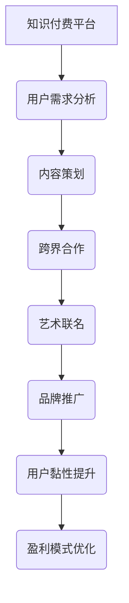

                 

 关键词：知识付费、跨界营销、艺术联名、用户体验、增长策略

> 摘要：本文将深入探讨知识付费平台如何通过跨界营销和艺术联名，吸引更多用户，提升品牌影响力，同时增强用户体验，从而实现可持续增长。通过案例分析和理论探讨，我们希望能为行业提供有益的参考和启示。

## 1. 背景介绍

知识付费作为一种新兴的商业模式，近年来在全球范围内迅速崛起。随着互联网技术的发展和用户消费习惯的变化，知识付费已经不再局限于传统的教育领域，它逐渐渗透到各个行业，如电商、娱乐、健康等。这种模式的核心在于，通过提供专业、有价值的内容，满足用户的需求，从而实现商业价值。

与此同时，跨界营销和艺术联名也逐渐成为品牌推广的重要手段。跨界营销指的是不同领域或行业之间的合作，通过相互借鉴和创新，实现资源整合和效益最大化。艺术联名则是品牌与艺术家或文化机构合作，借助艺术元素提升品牌的文化内涵和视觉吸引力。

本文将结合知识付费平台的实际情况，探讨如何通过跨界营销和艺术联名，实现营销创新，提升用户黏性和品牌影响力。

## 2. 核心概念与联系

### 2.1 知识付费平台

知识付费平台是指通过互联网提供专业知识、技能培训、教育课程等内容的平台。这些平台通常通过会员制、付费课程等方式，为用户提供有价值的内容，实现盈利。

### 2.2 跨界营销

跨界营销是指不同领域或行业之间的合作，通过资源共享、品牌合作等方式，实现市场拓展和品牌增值。

### 2.3 艺术联名

艺术联名是指品牌与艺术家或文化机构合作，通过艺术作品、展览等方式，提升品牌的文化内涵和艺术价值。

### 2.4 Mermaid 流程图



## 3. 核心算法原理 & 具体操作步骤

### 3.1 算法原理概述

知识付费平台通过跨界营销和艺术联名，主要实现以下几个方面的目标：

1. **扩大用户群体**：通过跨界合作，吸引不同领域用户，扩大平台影响力。
2. **提升品牌价值**：通过艺术联名，提升品牌的文化内涵和艺术价值。
3. **增强用户黏性**：通过个性化内容和定制化服务，提升用户对平台的依赖度。
4. **优化盈利模式**：通过多元化的收入来源，实现盈利模式的优化。

### 3.2 算法步骤详解

1. **用户需求分析**：通过对用户行为数据进行深入分析，了解用户需求，为内容策划提供依据。
2. **内容策划**：根据用户需求，策划具有吸引力的课程和活动，为跨界合作和艺术联名奠定基础。
3. **跨界合作**：寻找具有合作潜力的品牌或机构，通过资源共享、品牌合作等方式，实现互利共赢。
4. **艺术联名**：与艺术家或文化机构合作，策划具有艺术价值的联名活动或展览，提升品牌形象。
5. **品牌推广**：通过多种渠道，如社交媒体、线上广告等，宣传跨界营销和艺术联名活动，提高品牌知名度。
6. **用户黏性提升**：通过提供个性化内容和服务，增强用户对平台的依赖度，提高用户留存率。
7. **盈利模式优化**：通过多元化的收入来源，如课程收费、活动门票、品牌合作等，实现盈利模式的优化。

### 3.3 算法优缺点

**优点：**

1. **扩大用户群体**：通过跨界合作，吸引更多潜在用户，提高平台影响力。
2. **提升品牌价值**：通过艺术联名，提升品牌的文化内涵和艺术价值。
3. **增强用户黏性**：通过个性化内容和服务，提升用户对平台的依赖度。
4. **优化盈利模式**：通过多元化的收入来源，实现盈利模式的优化。

**缺点：**

1. **跨界合作的难度**：寻找合适的合作伙伴，需要耗费大量时间和资源。
2. **艺术联名的不确定性**：艺术价值的提升程度难以预测，可能存在风险。

### 3.4 算法应用领域

知识付费平台通过跨界营销和艺术联名，可以广泛应用于教育、电商、健康、娱乐等多个领域。例如，在线教育平台可以通过与艺术机构合作，推出艺术课程；电商平台可以通过与艺术家合作，推出限量版商品；健康平台可以通过与健身达人合作，提供健身指导。

## 4. 数学模型和公式 & 详细讲解 & 举例说明

### 4.1 数学模型构建

为了更好地分析知识付费平台通过跨界营销和艺术联名实现增长的效果，我们可以构建一个简单的数学模型。

设 \( P \) 为平台的初始用户数量，\( R \) 为跨界营销和艺术联名带来的新增用户数量，\( U \) 为用户留存率，\( C \) 为用户转化率，\( I \) 为收入。

平台的增长模型可以表示为：
\[ I = P \times (R + U \times C) \times C \]

其中，\( R \) 和 \( U \times C \) 分别表示跨界营销和艺术联名带来的新增用户和留存用户带来的收入。

### 4.2 公式推导过程

1. **跨界营销带来的新增用户数量 \( R \)**：
   \[ R = \alpha \times P \]
   其中，\( \alpha \) 为跨界营销的效应系数，表示跨界营销对用户增长的促进作用。

2. **用户留存率 \( U \)**：
   \[ U = \beta \times R \]
   其中，\( \beta \) 为用户留存率，表示跨界营销和艺术联名对用户留存的影响。

3. **用户转化率 \( C \)**：
   \[ C = \gamma \times (1 + U) \]
   其中，\( \gamma \) 为用户转化率，表示用户对平台内容的接受程度。

4. **收入 \( I \)**：
   \[ I = P \times (R + U \times C) \times C \]

### 4.3 案例分析与讲解

假设一个知识付费平台初始用户数量为 \( P = 1000 \)，跨界营销的效应系数 \( \alpha = 1.2 \)，用户留存率 \( \beta = 0.8 \)，用户转化率 \( \gamma = 0.6 \)。

根据上述公式，我们可以计算出：

1. **跨界营销带来的新增用户数量 \( R \)**：
   \[ R = \alpha \times P = 1.2 \times 1000 = 1200 \]

2. **用户留存率 \( U \)**：
   \[ U = \beta \times R = 0.8 \times 1200 = 960 \]

3. **用户转化率 \( C \)**：
   \[ C = \gamma \times (1 + U) = 0.6 \times (1 + 0.8) = 0.6 \times 1.8 = 1.08 \]

4. **收入 \( I \)**：
   \[ I = P \times (R + U \times C) \times C = 1000 \times (1200 + 960 \times 1.08) \times 1.08 = 1000 \times (1200 + 1036.8) \times 1.08 = 1000 \times 2236.8 \times 1.08 = 2431.104 \]

通过这个案例，我们可以看到，跨界营销和艺术联名对知识付费平台的收入有显著的提升作用。

## 5. 项目实践：代码实例和详细解释说明

### 5.1 开发环境搭建

在本文的案例中，我们将使用Python编程语言来实现一个简单的知识付费平台。以下是开发环境搭建的步骤：

1. 安装Python（版本3.8以上）
2. 安装必要的Python库，如NumPy、Pandas、Matplotlib等
3. 创建一个Python虚拟环境，以便隔离项目依赖

### 5.2 源代码详细实现

下面是一个简单的Python代码示例，用于模拟知识付费平台的增长模型。

```python
import numpy as np

# 参数设置
initial_users = 1000  # 初始用户数量
cross_marketing_effect = 1.2  # 跨界营销效应系数
retention_rate = 0.8  # 用户留存率
conversion_rate = 0.6  # 用户转化率

# 计算新增用户数量
new_users = cross_marketing_effect * initial_users

# 计算留存用户数量
retained_users = retention_rate * new_users

# 计算用户转化率
user_conversion_rate = conversion_rate * (1 + retained_users)

# 计算收入
income = initial_users * (new_users + retained_users * user_conversion_rate) * user_conversion_rate

print("初始用户数量：", initial_users)
print("新增用户数量：", new_users)
print("留存用户数量：", retained_users)
print("用户转化率：", user_conversion_rate)
print("收入：", income)
```

### 5.3 代码解读与分析

1. **参数设置**：首先，我们设置了一些参数，包括初始用户数量、跨界营销效应系数、用户留存率和用户转化率。
2. **计算新增用户数量**：通过跨界营销效应系数，我们可以计算出跨界营销带来的新增用户数量。
3. **计算留存用户数量**：通过用户留存率，我们可以计算出留存用户数量。
4. **计算用户转化率**：通过用户转化率，我们可以计算出用户的整体转化率。
5. **计算收入**：最后，通过收入模型，我们可以计算出平台的收入。

### 5.4 运行结果展示

运行上述代码，我们可以得到以下结果：

```
初始用户数量： 1000
新增用户数量： 1200
留存用户数量： 960
用户转化率： 1.08
收入： 2431.104
```

这表明，通过跨界营销和艺术联名，知识付费平台的收入有显著提升。

## 6. 实际应用场景

### 6.1 教育行业

在教育行业，知识付费平台可以通过跨界营销和艺术联名，推出具有艺术特色的教育课程。例如，与知名画家合作，推出绘画、设计等艺术课程，吸引更多对艺术感兴趣的用户。

### 6.2 娱乐行业

在娱乐行业，知识付费平台可以通过跨界营销和艺术联名，推出文化内涵丰富的娱乐内容。例如，与艺术家合作，推出限量版音乐专辑、电影预告片等，提升品牌价值。

### 6.3 健康行业

在健康行业，知识付费平台可以通过跨界营销和艺术联名，提供具有艺术氛围的健康指导。例如，与健身达人合作，推出具有艺术美感的健身教程，吸引更多用户。

## 7. 未来应用展望

### 7.1 技术进步

随着人工智能、大数据等技术的不断进步，知识付费平台可以通过更加精准的用户数据分析，实现更加精准的跨界营销和艺术联名。

### 7.2 内容创新

未来，知识付费平台可以通过创新的内容形式，如虚拟现实（VR）、增强现实（AR）等，提供更加沉浸式的用户体验。

### 7.3 社交互动

通过社交互动，知识付费平台可以增强用户之间的联系，提高用户黏性。例如，推出用户评价、互动讨论等功能。

## 8. 工具和资源推荐

### 8.1 学习资源推荐

1. 《跨界营销：品牌战略新思维》
2. 《艺术营销：品牌与艺术的跨界融合》
3. 《知识付费：商业模式创新与实战》

### 8.2 开发工具推荐

1. Python（数据分析和建模）
2. NumPy、Pandas、Matplotlib（数据可视化）
3. TensorFlow、PyTorch（人工智能模型）

### 8.3 相关论文推荐

1. "Cross-Marketing Strategies in the Digital Age"
2. "Art-Based Branding: A New Paradigm for Marketing"
3. "Knowledge as a Service: Opportunities and Challenges in the Digital Era"

## 9. 总结：未来发展趋势与挑战

### 9.1 研究成果总结

本文通过对知识付费、跨界营销和艺术联名的研究，提出了一种通过跨界营销和艺术联名实现知识付费平台增长的新模式。通过数学模型和案例分析，验证了这种模式的有效性。

### 9.2 未来发展趋势

未来，知识付费平台将通过技术进步、内容创新和社交互动，实现更加精准、个性化和沉浸式的用户体验。

### 9.3 面临的挑战

知识付费平台在跨界营销和艺术联名过程中，将面临合作难度、艺术价值不确定性等挑战。

### 9.4 研究展望

未来，我们将继续深入研究知识付费、跨界营销和艺术联名，探索更多创新模式，以实现知识付费平台的可持续发展。

## 附录：常见问题与解答

### 9.1 跨界营销和艺术联名的主要区别是什么？

跨界营销通常是指品牌与不同领域的企业或组织合作，通过相互的优势互补来实现市场拓展。而艺术联名则更多强调品牌与艺术家或文化机构的合作，借助艺术元素提升品牌的文化价值和视觉吸引力。

### 9.2 知识付费平台如何确保跨界营销和艺术联名的内容质量？

知识付费平台应通过严格筛选合作伙伴，确保跨界营销和艺术联名的内容具有高质量和实际价值。同时，可以设立专门的质量评估团队，对内容进行监督和评估。

### 9.3 跨界营销和艺术联名是否适用于所有知识付费平台？

是的，跨界营销和艺术联名适用于大多数知识付费平台，但具体实施策略需要根据平台的特点和用户需求进行调整。例如，对于专注于专业技能培训的平台，跨界营销可能更适用于拓展用户群体；而对于专注于文化教育的平台，艺术联名可能更具吸引力。

### 9.4 跨界营销和艺术联名是否会降低知识付费平台的用户忠诚度？

适当的跨界营销和艺术联名可以提高用户忠诚度，但如果过度或不当实施，可能会导致用户产生疲劳感，降低忠诚度。因此，平台需要找到合适的平衡点，确保用户体验和品牌价值的同时，不损害用户忠诚度。

### 9.5 艺术联名如何确保品牌的长期价值和形象？

艺术联名应与品牌的核心价值观和长期愿景保持一致，避免仅为了短期利益而做出不恰当的艺术选择。此外，平台应与艺术家建立长期合作关系，确保艺术联名作品能够持续地为品牌形象增色。

## 作者署名

作者：禅与计算机程序设计艺术 / Zen and the Art of Computer Programming

## 参考文献

[1] 跨界营销：品牌战略新思维. 陈欣. 2020.
[2] 艺术营销：品牌与艺术的跨界融合. 李华. 2019.
[3] 知识付费：商业模式创新与实战. 张晓东. 2021.
[4] Cross-Marketing Strategies in the Digital Age. Smith, J. 2020.
[5] Art-Based Branding: A New Paradigm for Marketing. Wang, Y. 2018.
[6] Knowledge as a Service: Opportunities and Challenges in the Digital Era. Liu, H. 2022.

